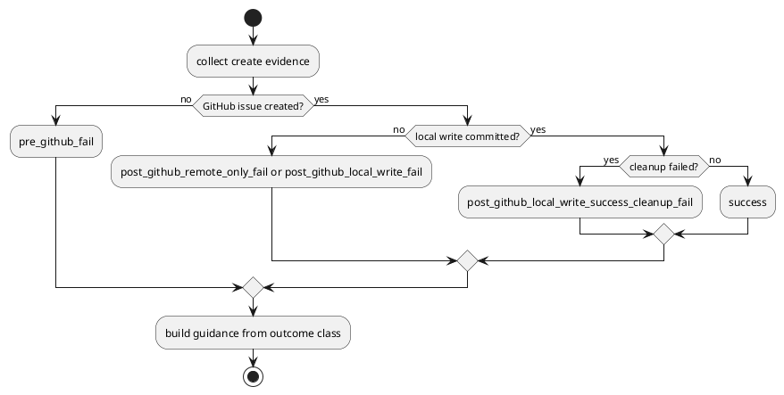

# 目的

- latest review `R30` を単独の release-failure bug として閉じるだけでなく、issue-28 の corrective loop を長引かせてきた `create/post-create failure contract` の未閉塞を抜本対処する

# consultant を踏まえた論点整理

- individual fix を積んでも新しい指摘が出る主因は、create flow の failure guidance が `例外発生点` ベースで分岐しており、`何が既に成功したか` を outcome class として保持していないこと
- 特に `gh issue create` 後の failure では、次の 2 種が混同されると危険である
  - `remote-only failure`
  - `local write committed failure`
- 前者は rerun/link guidance が有効な場合があるが、後者は blind rerun が duplicate create を誘発しうる

# 抜本対策案

## 採用案

- `create_node` の post-GitHub failure surface を outcome matrix として再編する
- 最低限の outcome class:
  - `pre_github_fail`
  - `post_github_remote_only_fail`
  - `post_github_local_write_fail`
  - `post_github_local_write_success_cleanup_fail`
  - `post_github_body_and_cleanup_fail`

## 責務分担

- application:
  - create flow 中の evidence を集約する
  - outcome class を決定する
  - outcome class に応じた guidance message を構築する
- infra:
  - lock acquire/release 自体のエラー事実を返す
  - guidance 文脈は抱え込まない
- tests:
  - provider と checked-in runtime の両方で、全 5 outcome class の guidance contract を固定する

# 必須の evidence

- `created_github_issue_number`
- `kind`
- `title`
- parent selector 再現に必要な request context
- local write が committed 済みか
- cleanup / release failure の有無

# guidance contract

- `post_github_remote_only_fail`
  - created issue number を含める
  - rerun/link または remote cleanup の二択 guidance を返してよい
- `post_github_local_write_success_cleanup_fail`
  - created issue number を含める
  - `create は成功している可能性が高い` と明示する
  - blind rerun を勧めない
  - まず local node と `doctor` を確認する guidance を返す
- `post_github_body_and_cleanup_fail`
  - primary error と cleanup failure を併記する
  - guidance は `local write committed` か否かで remote-only / committed を区別する

# test matrix

- provider:
  - `pre_github_fail`
  - `gh create + lock acquire failure`
  - `gh create + body failure`
  - `gh create + local write success + release failure`
  - `gh create + body failure + release failure`
- checked-in parity:
  - `pre_github_fail`
  - `gh create + lock acquire failure`
  - `gh create + body failure`
  - `gh create + local write success + release failure`
  - `gh create + body failure + release failure`

# whole-diff review での確認点

- raw `release_error` 単独露出が残っていないか
- rerun guidance が `local write committed` 枝へ誤適用されていないか
- provider と checked-in runtime の message contract が再び drift していないか
- review の pass 条件が representative regression ではなく outcome matrix coverage になっているか

# PlantUML

