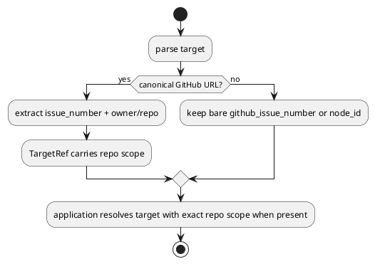

# 対象指摘

- review:
  - `P2 Preserve repo scope for URL targets in active set / deps check`
- scope:
  - `src/spec_dock/assets/spec_dock/scripts/spec_dock_runtime/commands/targets.py`
  - `src/spec_dock/assets/spec_dock/scripts/spec_dock_runtime/application/contracts.py`
  - `src/spec_dock/assets/spec_dock/scripts/spec_dock_runtime/application/set_active.py`
  - `src/spec_dock/assets/spec_dock/scripts/spec_dock_runtime/application/check_deps.py`

# 妥当性評価

- verdict:
  - `valid`
- severity:
  - `must`
- rationale:
  - full GitHub URL は `owner/repo/issues/123` という disambiguation 情報を持っているが、現在の `parse_active_like_target()` は `issue_number` だけへ潰している
  - `TargetRef` も repo scope を保持できないため、`active set` / `deps check` の application 層は bare `github_issue_number` 解決しかできない
  - その結果、`current/repo#123` と `other/repo#123` が共存する graph で URL target が exact foreign node を指せず、曖昧化または誤解決になる

# 事実

- `commands/targets.py`:
  - canonical URL は `parse_github_issue_target_ref()` では `owner/repo` を保持できる
  - しかし `parse_active_like_target()` は `/issues/<num>` 抽出だけで `TargetRef(kind=\"github_issue\", github_issue_number=<num>)` を返す
- `application/contracts.py`:
  - `TargetRef` は `kind / node_id / github_issue_number` しか持たない
- `set_active.py` / `check_deps.py`:
  - target 解決は bare `github_issue_number` の一致集合だけで動く

# 修正要否

- required:
  - `yes`

# 修正案

## 案A 採用案

- `TargetRef` を repo-aware に広げる
  - 例:
    - `github_issue_number`
    - `github_repo_owner`
    - `github_repo_name`
- `parse_active_like_target()` は full URL のときだけ repo scope を埋める
- `--github-issue 123` や bare `123` は unscoped target のまま残す
- `set_active.py` / `check_deps.py` の `_resolve_target_node_id()` を repo-aware 解決へ更新する

## 案B 非推奨

- URL target だけ node_id に変換する
- 問題:
  - parse 層で graph 参照が必要になり責務が崩れる
  - `active` / `deps` 以外に同様の target surface が増えたとき再利用しにくい

# 推奨理由

- repo scope を lossy に捨てない値オブジェクトへ寄せる方が、foreign URL import と整合する
- bare numeric target との互換性も壊さず、URL だけ exact disambiguation を強化できる

# 必要な回帰

- provider:
  - `active set https://github.com/other/repo/issues/123` が foreign node を exact resolve する
  - `deps check https://github.com/other/repo/issues/123` が foreign node を exact resolve する
  - same-number current+foreign coexist 時に URL target が ambiguous にならない
- checked-in parity:
  - dogfooding runtime でも同じ URL target contract を固定する

# PlantUML

