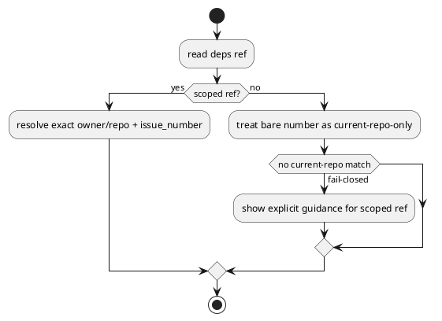

# 対象指摘

- review:
  - `P2 Stop forcing numeric dependency refs into the current repo scope`
- scope:
  - `src/spec_dock/assets/spec_dock/scripts/spec_dock_runtime/infra/deps_reader.py`
  - `src/spec_dock/assets/spec_dock/docs/reference_deps.md`

# 妥当性評価

- verdict:
  - `valid`
- severity:
  - `should`
- rationale:
  - 現在の実装は bare numeric ref `123` を `current_repo_slug` 既知時に current-repo-only で解決する
  - これは overlap ambiguity を fail-closed にする点では妥当だが、foreign imported issue を dependency target にしたいときに scope を表現する構文がない
  - 問題の本質は「current repo へ寄せたこと」単体ではなく、「docs が numeric ref を許容し続ける一方で foreign scope を表現できない」こと

# 事実

- `deps_reader.py`:
  - `int` / digit string の ref は `_find_node_by_github_issue_number(..., current_repo_slug=...)` へ渡る
  - current repo slug が既知だと foreign-only match は fail-closed する
- docs:
  - `reference_deps.md` は GitHub issue number を dependency ref として案内している
  - しかし foreign scope を明示する `owner/repo#123` や canonical URL の構文は未定義

# 修正要否

- required:
  - `yes`
- note:
  - ただし修正方向は「bare 123 を foreign に自動解決する」ではない

# 修正案

## 案A 採用案

- dependency ref に repo-scoped 構文を追加する
  - `owner/repo#123`
  - または canonical GitHub issue URL
- bare numeric ref は current-repo-only fail-closed のままにする
- docs / error message をその仕様に明示整合させる

## 案B 非推奨

- bare numeric ref を foreign-only match にも自動フォールバックする
- 問題:
  - current repo と foreign repo の意味が文脈依存になり、silent retarget が起こる
  - repo overlap を防ぐために導入した fail-closed 契約と衝突する

# 推奨理由

- ambiguity を fail-closed のまま保ちつつ、foreign issue dependency も明示構文で表現できる
- user-facing contract が明確になり、docs と実装の齟齬が解消する

# 必要な回帰

- provider:
  - bare `123` は current-repo-only で解決される
  - `other/repo#123` または URL は foreign imported node に解決される
  - overlap 時に silent fallback しない
- checked-in parity:
  - dogfooding runtime でも同じ dependency ref contract を固定する

# PlantUML

