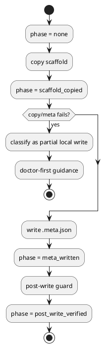

# 対象指摘

- review:
  - `P2 Treat partial execute_create_plan writes as local commits`
- scope:
  - `src/spec_dock/assets/spec_dock/scripts/spec_dock_runtime/application/create_node.py`
  - `src/spec_dock/assets/spec_dock/scripts/spec_dock_runtime/application/import_node.py`
  - `src/spec_dock/assets/spec_dock/scripts/spec_dock_runtime/infra/template_scaffolder.py`

# 妥当性評価

- verdict:
  - `valid`
- severity:
  - `must`
- rationale:
  - `execute_create_plan()` は scaffold copy を行ったあと `.meta.json` を書く
  - しかし `create_node_core()` は helper 全体が return したあとにしか `local_write_committed=True` へ遷移しない
  - そのため `copy 成功 -> meta failure` や `copy 途中 failure` の partial local write が `remote-only` に近い guidance で扱われ、blind rerun を誤って促す

# 事実

- `execute_create_plan()`:
  - `copy_scaffolded_tree(...)`
  - `node_repo.write_meta(...)`
- `create_node_core()`:
  - `execute_create_plan()` 後に `local_write_committed = True`
  - helper 内失敗では partial write 有無を区別できない
- 同じ seam は import の create plan 実行にも波及しうる

# 修正要否

- required:
  - `yes`

# 修正案

## 案A 採用案

- boolean `local_write_committed` を phase model に置き換える
  - `none`
  - `scaffold_copied`
  - `meta_written`
  - `post_write_verified`
- outcome builder は phase に応じて guidance を決める
  - `scaffold_copied` 以降は rerun unsafe
  - doctor-first / partial cleanup guidance を返す

## 案B 最小修正

- `execute_create_plan()` を段階別 helper に分け、copy 完了直後に flag を上げる
- 問題:
  - boolean のままでは `meta_written` と `post_write_verified` の差がまだ潰れる
  - 今回の loop を閉じるには少し弱い

# 推奨理由

- 「何が成功したか」を evidence として残せるため、post-create guidance を exception-point ではなく outcome class で制御できる
- create/import の両方に同じ phase model を再利用できる

# 必要な回帰

- provider:
  - `copy success + meta failure` は rerun unsafe / doctor-first
  - `copy partial failure` でも partial local write として扱われる
  - `post_write_guard failure` と区別される
- checked-in parity:
  - dogfooding runtime でも同じ phase-based guidance を固定する

# PlantUML

