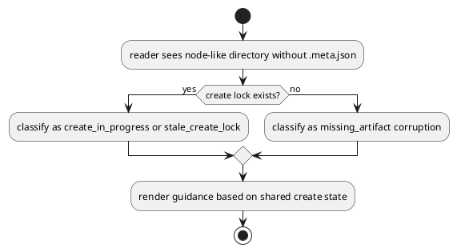

# 対象指摘

- review:
  - `P2 Don't treat in-progress node scaffolds as missing-meta corruption`
- scope:
  - `src/spec_dock/assets/spec_dock/scripts/spec_dock_runtime/infra/fs_repo.py`
  - `src/spec_dock/assets/spec_dock/scripts/spec_dock_runtime/application/doctor.py`
  - `src/spec_dock/assets/spec_dock/scripts/spec_dock_runtime/application/validate_tree.py`
  - `src/spec_dock/assets/spec_dock/scripts/spec_dock_runtime/application/sync_state.py`

# 妥当性評価

- verdict:
  - `valid`
- severity:
  - `should`
- rationale:
  - 現在の `load_node_records()` は node 形 directory が存在した時点で `.meta.json` 必須とみなし、create lock や create-in-progress を考慮しない
  - create-like command は lock で serialize されるが、read-only command は lock 外で走るため、正常な create 中間相を `missing_artifact` / corruption 扱いしうる

# 事実

- `_ensure_expected_node_meta_present()` は `.meta.json` 不在を即 hard-fail する
- `doctor` は stale create lock を別途診断するが、node load 失敗より後段であり、create-in-progress の共通状態としては使われていない
- create partial failure が残ると、reader 側でも same symptom が永続化しやすい

# 修正要否

- required:
  - `yes`
- note:
  - ただし単純に missing-meta check を外すのではなく、create state と連動させる必要がある

# 修正案

## 案A 採用案

- create lock / create phase を reader 側の classification に取り込む
- lock が存在し、missing `.meta.json` が create path 上にある場合:
  - `create_in_progress` または `stale_create_lock` 系として扱う
  - corruption と区別した guidance を返す
- lock が無い missing `.meta.json` は従来どおり corruption として扱う

## 案B 非推奨

- `_ensure_expected_node_meta_present()` を単純に warning へ落とす
- 問題:
  - 本当に壊れた tree まで許容してしまい、validate/doctor の診断力が落ちる

# 推奨理由

- create の中間状態と恒久 corruption を区別できる
- stale create lock と partial local write を同じ state model で扱う土台になる

# 必要な回帰

- provider:
  - create lock 下の missing `.meta.json` は `create_in_progress` / `stale_create_lock` 系へ分類される
  - lock が無い missing `.meta.json` は引き続き corruption になる
  - read-only command が create race で misleading error を出さない
- checked-in parity:
  - dogfooding runtime でも同じ診断 contract を固定する

# PlantUML

