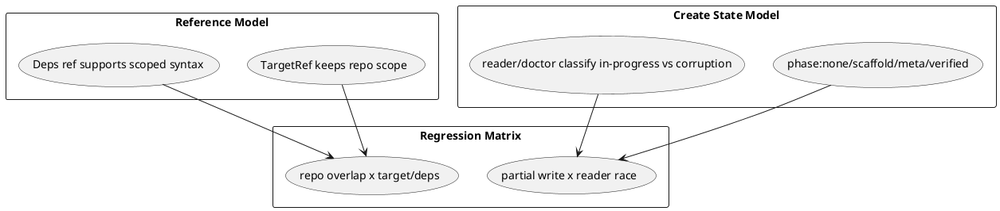

# 目的

- latest 4 reviews を individual fix として扱うだけでなく、同じ review loop を再発させている本質的問題を整理する

# 共通する根本問題

## 1. repo scope を end-to-end で保持する参照モデルがない

- create/import/meta では GitHub repo scope を保持できる
- しかし active/deps target や dependency ref では scope が失われるか、構文自体が存在しない
- そのため foreign issue support を追加しても、別 surface では current-repo-only へ暗黙還元される

## 2. create の中間状態を state machine ではなく断片的な flag で扱っている

- `local_write_committed: bool` では `none / partial / committed / verified` を区別できない
- reader 側も `create lock` と `missing .meta.json` を独立判断しており、shared state model がない
- その結果、guidance も diagnosis も `今どこまで成功したか` ではなく、`どこで例外が起きたか` に引っ張られる

## 3. test matrix が scope-loss と mid-write race を横断できていない

- review ごとに局所回帰は増えているが、
  - URL target + repo collision
  - dependency ref + foreign scope
  - create partial write + concurrent readers
  - stale lock + missing meta
  の組み合わせは matrix 化されていない

# 抜本改善案

## A. repo-scoped reference model を正本化する

- `TargetRef` と dependency ref contract を repo-aware へ昇格させる
- foreign scope を表現できる user-facing syntax を統一する
  - target:
    - canonical GitHub URL
    - bare number
  - deps:
    - canonical GitHub URL
    - `owner/repo#123`
    - bare number(current-repo-only)

## B. create transaction / reader diagnosis を shared state model へ寄せる

- create phase:
  - `none`
  - `scaffold_copied`
  - `meta_written`
  - `post_write_verified`
  - `stale`
- reader/doctor/validate はこの state model を参照して classification する

## C. test strategy を matrix 化する

- repo scope axis:
  - current only
  - foreign only
  - current + foreign overlap
- create state axis:
  - pre-create
  - in-progress
  - partial local write
  - committed
  - committed + cleanup failure

# 推奨実施順

1. `create transaction/state` corrective bundle
   - partial write classification
   - in-progress scaffold diagnosis
2. `repo-scoped reference model` corrective bundle
   - URL target repo scope preservation
   - scoped dependency ref support / docs alignment

# PlantUML

