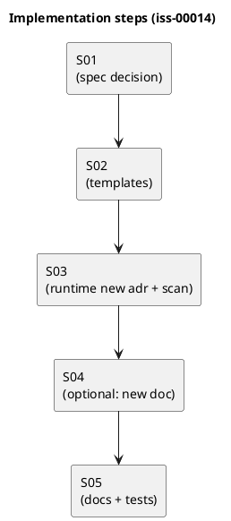

# iss-00014 ディスカッション資料の格納先を discussions/ に統一（adrs/artifacts の統合） — 実装計画（TDD: Red → Green → Refactor）

## この計画で満たす要件ID (必須)
- 対象AC: AC-001, AC-002, AC-003, AC-004
- 対象EC: EC-001, EC-002
- 対象制約（Always / 非交渉）:
  - ADR 採番（`adr-00001-...`）を維持
  - 後方互換性は維持しない（破壊的変更を許容）

## ステップ一覧（観測可能な振る舞い） (必須)
- [ ] S01: `discussions/` 運用仕様（命名/連番/rules/テンプレ位置・種類/ラッパ廃止）を確定する
- [ ] S02: 新規テンプレ生成物が `discussions/` と `rules.md` を作る（`adrs/`, `artifacts/` を生成しない）
- [ ] S03: `spec-dock new adr` の出力先が `discussions/` になり、走査/採番も追随する（後方互換なし）
- [ ] S04: （任意）`spec-dock new doc` を追加し、`note/disc/research` を連番で作成できる
- [ ] S05: docs/tests を更新し、運用ルールと導線を固定する

### UML（任意） (任意)

### 要件 ↔ ステップ対応表 (必須)
- AC-001 → S02
- AC-002 → S03
- AC-003 → S02
- AC-004 → S02（テンプレ位置の案内）/ S04（生成する場合）
- EC-001/EC-002 → S03, S04
- 非交渉制約（採番維持/後方互換なし）→ S03

---

## 実装ステップ（各ステップは“観測可能な振る舞い”を1つ） (必須)

### S01 — <観測可能な振る舞い> (必須)
- 対象: AC-001, AC-002, AC-003, AC-004 / EC-001, EC-002
- 設計参照:
  - 対象ドキュメント: `spec-deps/current/requirement.md`, `spec-deps/current/design.md`
  - 議論シート（作成予定）: `spec-deps/current/artifacts/` 配下
- このステップで「追加しないこと（スコープ固定）」:
  - 実装（テンプレ/ランタイム）の先走り（S02 以降で実施）

#### update_plan（着手時に登録） (必須)
- [ ] `update_plan` に、このステップの作業ステップ（調査/Red/Green/Refactor/品質ゲート/報告/コミット）を登録した
- 登録例:
  - （調査）既存挙動/影響範囲の確認、設計参照の確認
  - （Red）失敗するテストの追加/修正
  - （Green）最小実装
  - （Refactor）整理
  - （品質ゲート）format/lint/test
  - （報告）`./spec-dock/active/issue/report.md` 更新
  - （コミット）このステップの区切りでコミット

#### 期待する振る舞い（テストケース） (必須)
- Given: Issue #14 の合意済み仕様（命名/連番/rules/テンプレ位置/後方互換なし/ラッパ廃止）がドキュメントに反映されている
- When: 実装ステップ（S02〜）を開始する
- Then: 迷わずテンプレ/ランタイム/ドキュメントの実装に落とせる
- 観測点: `spec-deps/current/requirement.md` / `design.md` / `artifacts` の議論シート
- 追加/更新するテスト: なし（仕様確定ステップ）

#### Red（失敗するテストを先に書く） (任意)
- 期待する失敗:
  - ...

#### Green（最小実装） (任意)
- 変更予定ファイル:
  - Add: `<path/...>`
  - Modify: `<path/...>`
- 追加する概念（このステップで導入する最小単位）:
  - ...
- 実装方針（最小で。余計な最適化は禁止）:
  - ...

#### Refactor（振る舞い不変で整理） (任意)
- 目的:
  - ...
- 変更対象:
  - ...

#### ステップ末尾（省略しない） (必須)
- [ ] 期待するテスト（必要ならフォーマット/リンタ）を実行し、成功した
- [ ] `./spec-dock/active/issue/report.md` に実行コマンド/結果/変更ファイルを記録した
- [ ] `update_plan` を更新し、このステップの作業ステップを完了にした
- [ ] コミットした（エージェント）

---

### Sxx — <追加の観測可能な振る舞い> (任意)
- （上の S01 と同じ構成で記載する。update_plan / 期待する振る舞い / ステップ末尾 は省略しない）
  ...

---

## 未確定事項（TBD） (必須)
- Q-001:
  - 質問: TBD ...
  - 選択肢:
    - A: ...
    - B: ...
  - 推奨案（暫定）: ...
  - 影響範囲: S__ / AC-__ / EC-__ / `design.md` / ...
- Q-002:
  - 質問: TBD ...
  - 選択肢:
    - A: ...
    - B: ...
  - 推奨案（暫定）: ...
  - 影響範囲: ...

## 完了条件（Definition of Done） (必須)
- 対象AC/ECがすべて満たされ、テストで保証されている
- MUST NOT / OUT OF SCOPE を破っていない
- 品質ゲート（フォーマット/リント/テストのうち該当するもの）が満たされている

## 省略/例外メモ (必須)
- 該当なし
