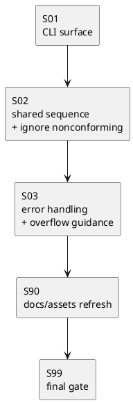

# iss-00019 discussions 配下の資料命名を時系列順に並ぶ形式へ統一し、全種別を共通採番できるようにする — 実装計画（TDD: Red → Green → Refactor）

## この計画で満たす要件ID (必須)
- 対象AC: AC-001, AC-002, AC-003, AC-004, AC-005, AC-006
- 対象EC: EC-001, EC-002, EC-003, EC-004, EC-005
- 対象制約:
  - primary interface は `new doc <type>` のみ
  - `new adr` / `new disc` / `new research` / `new note` は提供しない
  - explicit sequence override を提供しない
  - 採番対象は `NNN-type-slug.md` だけ
  - `rules.md` と非準拠ファイルは採番対象外
  - 既存ファイルの自動 rename をしない
  - `999` 超過時は失敗する

## ステップ一覧（観測可能な振る舞い） (必須)
- [x] S01: CLI 公開面が `new doc <type>` のみに統一され、per-type command / override option / legacy 導線が使えない
- [x] S02: `new doc <type>` が新標準ファイルだけを採番対象にして共通連番 `NNN-type-slug.md` を作成する
- [x] S03: duplicate / overflow / unknown type を明示的に失敗させ、overflow では follow-up guidance を返す
- [x] S90: docs impact resolution と asset/current guidance refresh を完了する
- [ ] S99: final diff review quality gate を通す（フルテストと手動 diff review は完了、fresh reviewer verdict 待ち）

### UML（任意） (任意)

### 要件 ↔ ステップ対応表 (必須)
- AC-001 → S90
- AC-002 → S02
- AC-003 → S02
- AC-004 → S01, S90
- AC-005 → S02
- AC-006 → S02
- EC-001 → S03
- EC-002 → S03, S90
- EC-003 → S02
- EC-004 → S01, S90
- EC-005 → S01, S03
- 非交渉制約（new doc only / no rename / no override / new-format only） → S01, S02, S03, S90

---

## 実行ルール（全ステップ共通） (必須)
- plan 全体は実装着手前に承認する。
- 各ステップは 1 つの観測可能な振る舞いを単位とする。
- 各ステップは Red → Green → Refactor → review → fix → re-review → report → commit/no-op の順で完了する。
- reviewer の blocking 指摘が残っている間は、そのステップを完了扱いにしない。
- 実差分があるステップは、承認済み状態を step-scoped commit として記録する。
- 実差分がないステップは、commit の代わりに no-op 理由を `report.md` に記録する。
- この issue は docs impact が確定しているため、`S90 docs impact resolution / docs refresh` は必須ステップとして実施する。
- 最後に `git diff <base>...HEAD` を対象に `S99 final diff review quality gate` を実施し、reviewer が承認するまで終了しない。

---

## 実装ステップ（各ステップは“観測可能な振る舞い”を1つ） (必須)

### S01 — CLI 公開面が `new doc <type>` のみに統一される (必須)
- 対象: AC-004 / EC-004 / EC-005
- 設計参照:
  - 対象IF/API: CLI-001, CLI-002, IF-001
  - 対象テスト:
    - `tests/test_cli.py::test_per_type_discussion_commands_are_not_available`
    - `tests/test_cli.py::test_help_exposes_only_new_doc_discussion_entrypoint`
    - `tests/test_cli.py::test_help_does_not_expose_discussion_sequence_override_options`
    - `tests/test_cli.py::test_new_doc_rejects_unexpected_sequence_override_option`
    - `tests/test_cli.py::test_new_doc_rejects_unknown_type`
- このステップで追加しないこと:
  - 採番アルゴリズムの本体変更
  - docs / assets refresh

#### update_plan（着手時に登録） (必須)
- [ ] `update_plan` に、S01 の作業ステップを登録した

#### 期待する振る舞い（テストケース） (必須)
- Given: runtime parser/help を確認できる repo
- When: `new doc <type>` の help と `new adr` / `new disc` / `new research` / `new note` / override option の有無を確認する
- Then: discussion docs の公開面は `new doc <type>` だけであり、per-type command と explicit sequence override は提供されない
- 観測点: parser help, runtime stderr/stdout, 回帰テスト
- 追加/更新するテスト: 上記 5 件

#### Red（失敗するテストを先に書く） (任意)
- 期待する失敗:
  - 旧 `new adr` 導線が parser/help に残っている
  - `--id` / `--seq` 相当の option が露出している

#### Green（最小実装） (任意)
- 変更予定ファイル:
  - Modify: `src/spec_dock/assets/spec_dock/scripts/spec_dock_runtime/app.py`
  - Modify: `tests/test_cli.py`
- 追加する概念:
  - `new doc <type>` parser route
  - per-type discussion command 非提供の明示
- 実装方針:
  - まず parser surface を固定し、help と unknown route の挙動を決める

#### Refactor（振る舞い不変で整理） (任意)
- 目的:
  - parser / dispatch の分岐を最小限に整理する

#### ステップ末尾（省略しない） (必須)
- [ ] step diff を reviewer にレビュー依頼した
- [ ] blocking 指摘を解消した、または no-op / 却下理由を `report.md` に記録して承認された
- [ ] reviewer verdict を `report.md` に記録した
- [ ] 期待するテストを実行し、成功した
- [ ] docs impact を確認し、`S90` の対象へ反映した
- [ ] `report.md` に実行コマンド/結果/変更ファイルを記録した
- [ ] `update_plan` を更新し、このステップの作業ステップを完了にした
- [ ] 実差分がある場合は step-scoped commit を作成し、実差分がない場合は no-op を記録した

---

### S02 — `new doc <type>` が新標準ファイルだけを採番対象にして共通連番ファイルを生成する (必須)
- 対象: AC-002 / AC-003 / AC-005 / AC-006 / EC-003
- 設計参照:
  - 対象IF/API: CLI-001, IF-001, IF-002, IF-003
  - 対象テスト:
    - `tests/test_cli.py::test_new_doc_adr_uses_shared_sequence_across_discussion_types`
    - `tests/test_cli.py::test_new_doc_disc_increments_after_adr`
    - `tests/test_cli.py::test_new_doc_ignores_nonconforming_files_for_sequence`
- このステップで追加しないこと:
  - duplicate / overflow の fail-fast
  - docs / assets refresh

#### update_plan（着手時に登録） (必須)
- [ ] `update_plan` に、S02 の作業ステップを登録した

#### 期待する振る舞い（テストケース） (必須)
- Given: `001-note-...`, `002-research-...` などの新標準ファイルに加えて `rules.md` や legacy / 非準拠ファイルが同一 `discussions/` に存在する
- When: `new doc adr` または `new doc disc|research|note` を実行する
- Then: 次の共通番号を持つ `NNN-type-slug.md` が生成され、`rules.md` と非準拠ファイルは採番対象外のまま残る
- 観測点: FS 上の生成ファイル名, runtime stdout/stderr, 回帰テスト
- 追加/更新するテスト: 上記 3 件

#### Red（失敗するテストを先に書く） (任意)
- 期待する失敗:
  - type ローカル連番のままになっている
  - `rules.md` や legacy file が番号計算に混入する

#### Green（最小実装） (任意)
- 変更予定ファイル:
  - Modify: `src/spec_dock/assets/spec_dock/scripts/spec_dock_runtime/app.py`
  - Modify: `tests/test_cli.py`
- 追加する概念:
  - shared discussion sequence generator
  - strict scanner for new-format only
  - `NNN-type-slug.md` writer
- 実装方針:
  - new-format files の最大番号だけを見て `next_sequence` を決める
  - `rules.md` / nonconforming file は recognized list に含めない

#### Refactor（振る舞い不変で整理） (任意)
- 目的:
  - scanner と generator の責務境界を明確にする

#### ステップ末尾（省略しない） (必須)
- [ ] step diff を reviewer にレビュー依頼した
- [ ] blocking 指摘を解消した、または no-op / 却下理由を `report.md` に記録して承認された
- [ ] reviewer verdict を `report.md` に記録した
- [ ] 期待するテストを実行し、成功した
- [ ] docs impact を確認し、`S90` の対象へ反映した
- [ ] `report.md` に実行コマンド/結果/変更ファイルを記録した
- [ ] `update_plan` を更新し、このステップの作業ステップを完了にした
- [ ] 実差分がある場合は step-scoped commit を作成し、実差分がない場合は no-op を記録した

---

### S03 — duplicate / overflow / unknown type / invalid slug を明示的に失敗させ、overflow では follow-up guidance を返す (必須)
- 対象: EC-001 / EC-002 / EC-005
- 設計参照:
  - 対象IF/API: CLI-001, IF-001, IF-003, ERR-001, ERR-002, ERR-003
  - 対象テスト:
    - `tests/test_cli.py::test_new_doc_fails_on_duplicate_sequence`
    - `tests/test_cli.py::test_new_doc_fails_on_sequence_overflow`
    - `tests/test_cli.py::test_new_doc_rejects_invalid_slug`
    - `tests/test_cli.py::test_new_doc_rejects_unknown_type`
- このステップで追加しないこと:
  - docs / assets refresh

#### update_plan（着手時に登録） (必須)
- [ ] `update_plan` に、S03 の作業ステップを登録した

#### 期待する振る舞い（テストケース） (必須)
- Given: duplicate target number / `999` 到達 / 未知 type / invalid slug のいずれかの条件
- When: `new doc <type>` を実行する
- Then: 明示的に失敗し、既存ファイルを壊さない。overflow 時は follow-up issue で archive または桁拡張を判断する guidance を stderr/stdout に含める
- 観測点: runtime stderr/stdout, FS 差分なし, 回帰テスト
- 追加/更新するテスト: 上記 4 件（overflow test は guidance message assertion を含める）

#### Red（失敗するテストを先に書く） (任意)
- 期待する失敗:
  - duplicate 上書き
  - `1000-...` へ進む
  - overflow guidance が出ない
  - invalid slug を通してしまう
  - 未知 type を通してしまう

#### Green（最小実装） (任意)
- 変更予定ファイル:
  - Modify: `src/spec_dock/assets/spec_dock/scripts/spec_dock_runtime/app.py`
  - Modify: `tests/test_cli.py`
- 追加する概念:
  - duplicate guard
  - overflow guard
  - slug validation
  - unknown type validation
- 実装方針:
  - scanner / parser が返した値に対して最短で fail-fast する
  - overflow では docs と整合する follow-up guidance を runtime message に含める

#### Refactor（振る舞い不変で整理） (任意)
- 目的:
  - エラーメッセージと guard 条件の重複を減らす

#### ステップ末尾（省略しない） (必須)
- [ ] step diff を reviewer にレビュー依頼した
- [ ] blocking 指摘を解消した、または no-op / 却下理由を `report.md` に記録して承認された
- [ ] reviewer verdict を `report.md` に記録した
- [ ] 期待するテストを実行し、成功した
- [ ] docs impact を確認し、`S90` の対象へ反映した
- [ ] `report.md` に実行コマンド/結果/変更ファイルを記録した
- [ ] `update_plan` を更新し、このステップの作業ステップを完了にした
- [ ] 実差分がある場合は step-scoped commit を作成し、実差分がない場合は no-op を記録した

---

### S90 — docs impact resolution / docs refresh を行う (必須)
- 条件: この issue では docs impact が確定している
- 対象: AC-001 / AC-004 / EC-002 / EC-004
- Given: CLI / runtime / tests の最終仕様が固まっている
- When:
  - templates / shipped docs / runtime docs / skill asset / current guidance を更新する
  - init/update/current guidance の各観測面で legacy 例と旧公開導線が残っていないことを自動アサーションで確認する
- Then: 利用者向け説明と配布物の文面が現行挙動と一致する
- 対象ファイル:
  - `src/spec_dock/assets/spec_dock/templates/README.md`
  - `src/spec_dock/assets/spec_dock/templates/{initiative,epic,issue}/discussions/rules.md`
  - `src/spec_dock/assets/spec_dock/docs/reference_naming.md`
  - `src/spec_dock/assets/spec_dock/docs/workflow_{adr,issue,epic,initiative}.md`
  - `src/spec_dock/assets/spec_dock/docs/phase_{requirement,design,plan}.md`
  - `src/spec_dock/assets/spec_dock/docs/README.md`
  - `src/spec_dock/assets/spec_dock/docs/guide.md`
  - `src/spec_dock/assets/spec_dock/scripts/README.md`
  - `src/spec_dock/assets/codex_skills/spec-driven-tdd-workflow/SKILL.md`
  - `spec-deps/current/discussions/rules.md`
  - `spec-deps/README.md`
  - `tests/test_cli.py`
- 対象テスト:
  - `tests/test_cli.py::test_init_scaffolds_discussion_guidance_without_legacy_examples_across_asset_set`
  - `tests/test_cli.py::test_update_refreshes_discussion_guidance_without_legacy_examples_across_asset_set`
  - `tests/test_cli.py::test_current_guidance_documents_match_discussion_numbering_contract`
- ステップ末尾:
  - [ ] docs impact の判定結果を `report.md` に記録した
  - [ ] 必要な docs / shipped assets / current guidance を更新した
  - [ ] reviewer に確認を依頼し、承認レベルに達した
  - [ ] asset-set / current guidance テストを実行し、成功した

---

### S99 — final diff review quality gate を通す (必須)
- 対象: このブランチの差分全体
- Given: S01, S02, S03, S90 が完了している
- When:
  - `python -m unittest -v tests.test_cli` を実行する
  - `python -m unittest discover -v` を実行する
  - packaging / shipped asset gate として、S90 で追加した asset-set / current guidance テストが `tests.test_cli.py` 上で green であることを確認する
  - `git diff <base>...HEAD` を reviewer が確認する
- Then:
  - test / packaging / docs / diff 全体で blocking finding が残っていない
  - reviewer が承認するまで修正と再レビューを反復する
- ステップ末尾:
  - [ ] 全体テストと必要な packaging check が成功した
  - [ ] reviewer の最終 verdict を `report.md` に記録した
  - [ ] 修正があれば commit し、修正がなければ no-op を記録した

---

## 未確定事項（TBD） (必須)
- なし

## 完了条件（Definition of Done） (必須)
- 対象 AC / EC がすべて満たされ、テストで保証されている
- MUST NOT / OUT OF SCOPE を破っていない
- CLI 公開面は `new doc <type>` のみで、per-type discussion command と explicit sequence override は存在しない
- new-format only 採番が `tests/test_cli.py` で保証されている
- overflow 時の follow-up guidance message がテストで保証されている
- docs impact が解決され、asset-set と current guidance の refresh が完了している
- `S99 final diff review quality gate` で reviewer 承認レベルに達している

## 省略/例外メモ (必須)
- この plan では legacy discussion 資料の移行や rename は扱わない
