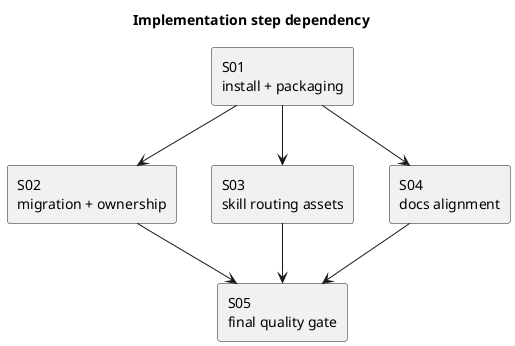

# iss-00016 Codex skills を hub + leaf 構成へ再編する — 実装計画（TDD: Red → Green → Refactor）

## この計画で満たす要件ID (必須)
- 対象AC:
  - AC-001, AC-002, AC-002b, AC-003, AC-004, AC-005, AC-005b, AC-006, AC-007, AC-008, AC-009, AC-010
- 対象EC:
  - EC-001, EC-001b, EC-002, EC-003, EC-004, EC-005, EC-006
- 対象制約:
  - hub 名維持
  - `--no-skill` 廃止
  - ownership boundary 維持
  - routing 契約（trigger group ごとの最小完全集合）
  - package assets / 配布検証

## ステップ一覧（観測可能な振る舞い） (必須)
- [ ] S01: installer が hub + 4 leaf の full set を managed skill manifest として導入し、配布物にも収載される
- [ ] S02: `update` migration が old single-skill / old no-skill / custom skill 混在 repo を ownership boundary つきで収束させ、`--no-skill` を廃止する
- [ ] S03: hub / leaf skill assets が routing 契約どおりに docs を直接案内する
- [ ] S04: root README / 配布 docs README / workflow docs が multi-skill 導線へ整合する
- [ ] S05: main ブランチとの差分全体を対象に品質ゲートを実施し、reviewer 承認レベルへ収束させる

### UML（任意） (任意)

### 要件 ↔ ステップ対応表 (必須)
- AC-001 → S01
- AC-002 → S02, S04
- AC-002b → S02, S04
- AC-003 → S03
- AC-004 → S03
- AC-005 → S03
- AC-005b → S03
- AC-006 → S04
- AC-007 → S01, S02, S03, S04, S05
- AC-008 → S02, S04
- AC-009 → S02
- AC-010 → S02, S05
- EC-001 → S02, S04
- EC-001b → S02, S04
- EC-002 → S03
- EC-003 → S04
- EC-004 → S03
- EC-005 → S02
- EC-006 → S02, S05
- 非交渉制約（hub 名維持 / ownership boundary / `--no-skill` 廃止 / custom skill 保持 / package assets） → S01, S02, S03, S04, S05

---

## 実装ステップ（各ステップは“観測可能な振る舞い”を1つ） (必須)

### S01 — installer が hub + 4 leaf の full set を managed skill manifest として導入し、配布物にも収載される (必須)
- 対象: AC-001, AC-007 / package assets 制約
- 設計参照:
  - 対象IF/API: IF-001, IF-002, IF-003
  - 対象テスト:
    - `tests/test_cli.py::test_init_creates_expected_structure`
    - 追加: installed package asset verification
- このステップで「追加しないこと（スコープ固定）」:
  - migration/ownership boundary の本格対応
  - docs 文面更新
  - leaf skill の routing 文面の仕上げ

#### update_plan（着手時に登録） (必須)
- [ ] `update_plan` に、このステップの作業ステップ（調査/Red/Green/Refactor/レビュー/品質ゲート/報告/コミット）を登録した

#### 期待する振る舞い（テストケース） (必須)
- Given: `spec-dock init` を通常実行する
- When: `.agents/skills/` とインストール済み package assets を確認する
- Then:
  - hub + 4 leaf の 5 skill が導入される
  - skill assets が配布物にも含まれる
- 観測点: `.agents/skills/**`, installed package 内の `assets/codex_skills/**`
- 追加/更新するテスト: `tests/test_cli.py`

#### Red（失敗するテストを先に書く） (任意)
- 期待する失敗:
  - 5 skill 導入アサートが失敗する
  - installed package asset 検証が失敗する

#### Green（最小実装） (任意)
- 変更予定ファイル:
  - Modify: `src/spec_dock/cli.py`
  - Modify: `tests/test_cli.py`
  - Modify: `pyproject.toml`（必要時のみ）
  - Add: `src/spec_dock/assets/codex_skills/spec-dock-initiative-planning/SKILL.md`
  - Add: `src/spec_dock/assets/codex_skills/spec-dock-epic-planning/SKILL.md`
  - Add: `src/spec_dock/assets/codex_skills/spec-dock-issue-execution/SKILL.md`
  - Add: `src/spec_dock/assets/codex_skills/spec-dock-adr-facilitation/SKILL.md`
- 追加する概念（このステップで導入する最小単位）:
  - managed skill manifest
  - bundled skill sync の初期版
  - package に入る 4 leaf skill asset の最小骨格
- 実装方針（最小で。余計な最適化は禁止）:
  - まず full set の install と package 収載保証だけを成立させる
  - 4 leaf はこの時点では「存在保証できる最小骨格」でよく、routing 文面の完成は S03 で行う

#### Refactor（振る舞い不変で整理） (任意)
- 目的:
  - installer 内の skill manifest / sync 導線を読みやすくする
- 変更対象:
  - `src/spec_dock/cli.py`

#### ステップ末尾（省略しない） (必須)
- [ ] code_reviewer にこのステップ差分をレビュー依頼し、指摘があれば dev_coder が修正した
- [ ] reviewer の再レビューで承認レベルに達した
- [ ] 期待するテストを実行し、成功した
- [ ] `spec-deps/current/report.md` に実行コマンド/結果/変更ファイルを記録した
- [ ] `update_plan` を更新し、このステップの作業ステップを完了にした
- [ ] Conventional Commits（日本語・複数行）でコミットした

---

### S02 — `update` migration が old single-skill / old no-skill / custom skill 混在 repo を ownership boundary つきで収束させ、`--no-skill` を廃止する (必須)
- 対象: AC-002, AC-002b, AC-007, AC-008, AC-009, AC-010 / EC-001, EC-001b, EC-005, EC-006
- 設計参照:
  - 対象IF/API: IF-002, IF-003, IF-004
  - 対象テスト:
    - old single-skill migration
    - old no-skill migration
    - custom skill preserve
    - failure-injection convergence
    - CLI help / parser
- このステップで「追加しないこと（スコープ固定）」:
  - hub / leaf skill 文面の本格リライト
  - README / 配布 docs の導線修正

#### update_plan（着手時に登録） (必須)
- [ ] `update_plan` に、このステップの作業ステップ（調査/Red/Green/Refactor/レビュー/品質ゲート/報告/コミット）を登録した

#### 期待する振る舞い（テストケース） (必須)
- Given: old single-skill repo / old no-skill repo / custom skill 混在 repo
- When: `spec-dock update` と必要なら再実行を行う
- Then:
  - 5 skill に収束する
  - unknown custom skill は保持される
  - `--no-skill` は CLI から消える
  - 途中失敗後も再実行で target state に収束する
- 観測点: `.agents/skills/**`, CLI help, 再実行後 FS 状態
- 追加/更新するテスト: `tests/test_cli.py`

#### Red（失敗するテストを先に書く） (任意)
- 期待する失敗:
  - legacy migration / custom preserve / convergence / parser 変更が未対応で落ちる

#### Green（最小実装） (任意)
- 変更予定ファイル:
  - Modify: `src/spec_dock/cli.py`
  - Modify: `tests/test_cli.py`
- 追加する概念（このステップで導入する最小単位）:
  - ownership boundary
  - copy/update -> verify -> prune
  - `--no-skill` 廃止
- 実装方針（最小で。余計な最適化は禁止）:
  - migration / parser / convergence に必要な部分だけを追加する

#### Refactor（振る舞い不変で整理） (任意)
- 目的:
  - skill sync と parser 変更を読みやすく保つ
- 変更対象:
  - `src/spec_dock/cli.py`

#### ステップ末尾（省略しない） (必須)
- [ ] code_reviewer にこのステップ差分をレビュー依頼し、指摘があれば dev_coder が修正した
- [ ] reviewer の再レビューで承認レベルに達した
- [ ] 期待するテストを実行し、成功した
- [ ] `spec-deps/current/report.md` に実行コマンド/結果/変更ファイルを記録した
- [ ] `update_plan` を更新し、このステップの作業ステップを完了にした
- [ ] Conventional Commits（日本語・複数行）でコミットした

---

### S03 — hub / leaf skill assets が routing 契約どおりに docs を直接案内する (必須)
- 対象: AC-003, AC-004, AC-005, AC-005b, AC-007 / EC-002, EC-004
- 設計参照:
  - 対象IF/API: MODEL-002
  - 対象テスト:
    - hub skill content assertion
    - leaf skill content assertion（trigger group ごとの最小完全集合）
- このステップで「追加しないこと（スコープ固定）」:
  - README / 配布 docs の本格更新
  - migration ロジックの追加変更

#### update_plan（着手時に登録） (必須)
- [ ] `update_plan` に、このステップの作業ステップ（調査/Red/Green/Refactor/レビュー/品質ゲート/報告/コミット）を登録した

#### 期待する振る舞い（テストケース） (必須)
- Given: 配布される各 `SKILL.md`
- When: 内容を確認する
- Then:
  - hub は 4 leaf + 4 reference docs + 各 leaf の 1 行説明を持つ
  - leaf は primary workflow doc と trigger group ごとの最小完全 direct doc set を持つ
  - `runtime-operations` のような抽象 skill は存在しない
- 観測点: `src/spec_dock/assets/codex_skills/**/SKILL.md`
- 追加/更新するテスト: `tests/test_cli.py`

#### Red（失敗するテストを先に書く） (任意)
- 期待する失敗:
  - 旧 single-skill 前提の skill 内容アサートが失敗する
  - 4 leaf は存在するが、routing 文面が契約未達で内容アサートが落ちる

#### Green（最小実装） (任意)
- 変更予定ファイル:
  - Modify: `src/spec_dock/assets/codex_skills/spec-dock-initiative-planning/SKILL.md`
  - Modify: `src/spec_dock/assets/codex_skills/spec-dock-epic-planning/SKILL.md`
  - Modify: `src/spec_dock/assets/codex_skills/spec-dock-issue-execution/SKILL.md`
  - Modify: `src/spec_dock/assets/codex_skills/spec-dock-adr-facilitation/SKILL.md`
  - Modify: `src/spec_dock/assets/codex_skills/spec-driven-tdd-workflow/SKILL.md`
  - Modify: `tests/test_cli.py`
- 追加する概念（このステップで導入する最小単位）:
  - hub skill
  - 4 leaf skill
  - routing copy の完成
- 実装方針（最小で。余計な最適化は禁止）:
  - requirement/design の wording に忠実な静的 skill 文面を追加する
  - docs 正本の詳細を skill へ複製しすぎない

#### Refactor（振る舞い不変で整理） (任意)
- 目的:
  - skill 文面の見出し・用語・導線の一貫性を整える
- 変更対象:
  - `src/spec_dock/assets/codex_skills/**/SKILL.md`

#### ステップ末尾（省略しない） (必須)
- [ ] code_reviewer にこのステップ差分をレビュー依頼し、指摘があれば dev_coder が修正した
- [ ] reviewer の再レビューで承認レベルに達した
- [ ] 期待するテストを実行し、成功した
- [ ] `spec-deps/current/report.md` に実行コマンド/結果/変更ファイルを記録した
- [ ] `update_plan` を更新し、このステップの作業ステップを完了にした
- [ ] Conventional Commits（日本語・複数行）でコミットした

---

### S04 — root README / 配布 docs README / workflow docs が multi-skill 導線へ整合する (必須)
- 対象: AC-002, AC-002b, AC-006, AC-007, AC-008 / EC-001, EC-001b, EC-003
- 設計参照:
  - 対象IF/API: なし（docs stable layer）
  - 対象テスト:
    - `README.md` 文面 assertion
    - `src/spec_dock/assets/spec_dock/docs/README.md` 文面 assertion
    - workflow docs の導線 assertion
- このステップで「追加しないこと（スコープ固定）」:
  - runtime script の仕様変更
  - docs ファイル名変更

#### update_plan（着手時に登録） (必須)
- [ ] `update_plan` に、このステップの作業ステップ（調査/Red/Green/Refactor/レビュー/品質ゲート/報告/コミット）を登録した

#### 期待する振る舞い（テストケース） (必須)
- Given: root `README.md` と配布 docs `README.md` / `workflow_*`
- When: skill 導線と usage を確認する
- Then:
  - single-skill 前提や `--no-skill` 記述が残らない
  - hub + 4 leaf + reference layer の導線に整合する
  - issue/initiative/epic/adr の各 leaf が読むべき docs が誤解なく辿れる
  - old single-skill repo / old no-skill repo へ `update` した後の配布 docs 導線も new skill set と整合する
- 観測点: `README.md`, `src/spec_dock/assets/spec_dock/docs/**`, legacy repo へ `update` 後の `spec-dock/docs/**`
- 追加/更新するテスト: `tests/test_cli.py`

#### Red（失敗するテストを先に書く） (任意)
- 期待する失敗:
  - `--no-skill` や single-skill 前提文面の否定アサートが失敗する
  - skill 入口の新 wording アサートが失敗する
  - legacy repo へ `update` した後の配布 docs 導線確認が失敗する

#### Green（最小実装） (任意)
- 変更予定ファイル:
  - Modify: `README.md`
  - Modify: `src/spec_dock/assets/spec_dock/docs/README.md`
  - Modify: `src/spec_dock/assets/spec_dock/docs/workflow_initiative.md`
  - Modify: `src/spec_dock/assets/spec_dock/docs/workflow_epic.md`
  - Modify: `src/spec_dock/assets/spec_dock/docs/workflow_issue.md`
  - Modify: `src/spec_dock/assets/spec_dock/docs/workflow_adr.md`
  - Modify: `tests/test_cli.py`
- 追加する概念（このステップで導入する最小単位）:
  - docs 側の multi-skill 入口
- 実装方針（最小で。余計な最適化は禁止）:
  - 既存 docs のファイル名は維持し、導線と説明だけ更新する
  - legacy repo へ `update` した結果の配布 docs も観測して、AC-002 / AC-002b の docs 側をこの step で完了させる

#### Refactor（振る舞い不変で整理） (任意)
- 目的:
  - docs の用語（hub / leaf / reference layer）を統一する
- 変更対象:
  - `README.md`
  - `src/spec_dock/assets/spec_dock/docs/**`

#### ステップ末尾（省略しない） (必須)
- [ ] code_reviewer にこのステップ差分をレビュー依頼し、指摘があれば dev_coder が修正した
- [ ] reviewer の再レビューで承認レベルに達した
- [ ] 期待するテストを実行し、成功した
- [ ] old single-skill repo / old no-skill repo へ `update` した後の docs 導線を観測し、AC-002 / AC-002b の docs 側を確認した
- [ ] `spec-deps/current/report.md` に実行コマンド/結果/変更ファイルを記録した
- [ ] `update_plan` を更新し、このステップの作業ステップを完了にした
- [ ] Conventional Commits（日本語・複数行）でコミットした

---

### S05 — main ブランチとの差分全体を対象に品質ゲートを実施し、reviewer 承認レベルへ収束させる (必須)
- 対象: AC-007, AC-010 / EC-006
- 設計参照:
  - 対象IF/API: IF-003
  - 対象テスト: 全体テストスイート、差分レビュー
- このステップで「追加しないこと（スコープ固定）」:
  - scope 外の改善
  - unrelated test fix

#### update_plan（着手時に登録） (必須)
- [ ] `update_plan` に、このステップの作業ステップ（調査/品質ゲート/レビュー/修正/再レビュー/報告/コミット）を登録した

#### 期待する振る舞い（テストケース） (必須)
- Given: このブランチの実装差分全体
- When:
  - `python -m unittest discover -v` を実行する
  - packaging 観点を含めた配布確認を行う
  - `git diff main...HEAD` をスコープに reviewer がレビューする
- Then:
  - テストが通る
  - 配布観点の取りこぼしがない
  - reviewer の指摘が解消される
  - 最終的に reviewer 承認レベルのクオリティに収束する
- 観測点: test output, packaging check, `git diff main...HEAD`, reviewer verdict
- 追加/更新するテスト: なし（既存追加済みテストを実行）

#### 品質ゲート（最終） (必須)
- 実行項目:
  - `python -m unittest discover -v`
  - 必要に応じて targeted test 再実行
  - `python -m pip install .` または同等の配布確認
  - `git diff main...HEAD`
- レビュー:
  - code_reviewer に **main との差分全体** をスコープにレビュー依頼する
  - 指摘があれば dev_coder が修正し、再レビューを繰り返す
  - reviewer の承認レベルに達するまで終えない

#### ステップ末尾（省略しない） (必須)
- [ ] 全体テストが成功した
- [ ] 配布確認が成功した
- [ ] main との差分レビューを実施した
- [ ] 指摘修正と再レビューを繰り返し、承認レベルに達した
- [ ] `spec-deps/current/report.md` に最終コマンド/結果/変更ファイルを記録した
- [ ] `update_plan` を更新し、このステップの作業ステップを完了にした
- [ ] 修正があった場合は Conventional Commits（日本語・複数行）でコミットし、修正がなかった場合は no-op を report に記録した

---

## 未確定事項（TBD） (必須)
- 現時点では、実装着手に必要な重大な未確定事項はない。
- 想定外のトラブルでユーザー判断が必要になった場合のみ、実装を停止して確認する。

## 完了条件（Definition of Done） (必須)
- 対象AC/ECがすべて満たされ、テストで保証されている
- 各ステップで **実装 → review → 修正 → 再レビュー → report 更新 → commit** が完了している
- S05 の最終品質ゲートで、`git diff main...HEAD` を対象にした reviewer 承認レベルへ到達している
- S05 で修正がなかった場合のみ、commit の代わりに no-op を report へ記録してよい
- MUST NOT / OUT OF SCOPE を破っていない
- 品質ゲート（テスト + 配布確認 + 差分レビュー）が満たされている

## 省略/例外メモ (必須)
- review は code_reviewer、実装は dev_coder を基本担当とする。
