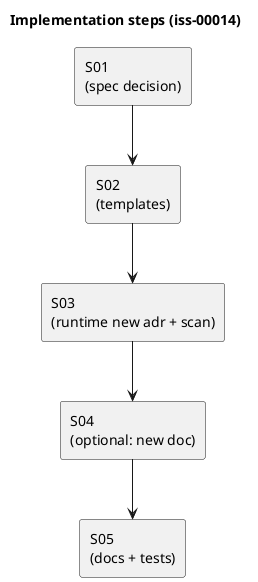

# iss-00014 ディスカッション資料の格納先を discussions/ に統一（adrs/artifacts の統合） — 実装計画（TDD: Red → Green → Refactor）

## この計画で満たす要件ID (必須)
- 対象AC: AC-001, AC-002, AC-003, AC-004, AC-005
- 対象EC: EC-001, EC-002
- 対象制約（Always / 非交渉）:
  - ADR 採番（`adr-00001-...`）を維持
  - 後方互換性は維持しない（破壊的変更を許容）

## ステップ一覧（観測可能な振る舞い） (必須)
- [x] S01: `discussions/` 運用仕様（命名/連番/rules/テンプレ位置・種類/ラッパ廃止）を確定する
- [ ] S02: 新規テンプレ生成物が `discussions/` と `rules.md` を作る（`adrs/`, `artifacts/` を生成しない）
- [ ] S03: `spec-dock new adr` の出力先が `discussions/` になり、走査/採番も追随する（後方互換なし）
- [ ] S04: （任意）`spec-dock new doc` を追加し、`note/disc/research` を連番で作成できる
- [ ] S05: docs/tests を更新し、運用ルールと導線を固定する

### UML（任意） (任意)

### 要件 ↔ ステップ対応表 (必須)
- AC-001 → S02
- AC-002 → S03
- AC-003 → S02
- AC-004 → S02（テンプレ位置の案内）/ S04（生成する場合）
- AC-005 → S02, S05
- EC-001 → S03, S04
- EC-002 → S02
- 非交渉制約（採番維持/後方互換なし）→ S03

---

## 実装ステップ（各ステップは“観測可能な振る舞い”を1つ） (必須)

### S01 — `discussions/` 運用仕様を確定する（ドキュメント） (必須)
- 状態: Done
- Done 条件:
  - `spec-deps/current/requirement.md` が reviewer Approved
  - `spec-deps/current/design.md` が reviewer Approved
  - `spec-deps/current/artifacts/20260305-discussions-best-practice.md` が最新仕様に追随している
- 追加/更新するテスト: なし（仕様確定）

---

### S02 — 新規テンプレ生成物が `discussions/` を生成する (必須)
- 対象: AC-001, AC-003, AC-004, AC-005
- Red（先にテストを固める）:
  - `tests/test_cli.py` で init/update の生成物を検証し、`<scope>/discussions/` が存在し `adrs/` と `artifacts/` が存在しないことをアサートする
  - `discussions/rules.md` が存在することをアサートする（AC-003 / EC-002）
  - `discussions/` 配下に `new-*` 等のラッパスクリプトが存在しないことをアサートする（AC-005）
- Green（実装。最小差分）:
  - Add: `src/spec_dock/assets/spec_dock/templates/{initiative,epic,issue}/discussions/rules.md`
  - Add: `src/spec_dock/assets/spec_dock/templates/discussions/{note,disc,research}.md`
  - Move: `src/spec_dock/assets/spec_dock/templates/adr.md` → `src/spec_dock/assets/spec_dock/templates/discussions/adr.md`
  - Delete: `src/spec_dock/assets/spec_dock/templates/{initiative,epic,issue}/{adrs,artifacts}/`
  - Modify: `src/spec_dock/assets/spec_dock/templates/README.md`（マッピング/注意書きの更新）
- Refactor:
  - 生成物テンプレの重複表現（命名/リンク/見出し）を最小限に整理する
- 品質ゲート:
  - `python -m unittest discover -v`

---

### S03 — `spec-dock new adr` が `discussions/` に作成する (必須)
- 対象: AC-002, EC-001
- Red:
  - `tests/test_cli.py` で `spec-dock/scripts/spec-dock new adr ...` が `<scope>/discussions/` に `adr-xxxxx-<slug>.md` を作成することをアサートする
  - EC-001: `--id` 省略時は max+1 採番、`--id` 明示重複は非0で失敗をアサートする
- Green:
  - Modify: `src/spec_dock/assets/spec_dock/scripts/spec_dock_runtime/app.py`
    - `_new_adr`: 出力先 `adrs/` → `discussions/`、テンプレ参照 `templates/adr.md` → `templates/discussions/adr.md`
    - `_next_id`（prefix=="adr" fallback）: `adrs/adr-*.md` → `discussions/adr-*.md`
- 品質ゲート:
  - `python -m unittest discover -v`

---

### S04 — （任意）`spec-dock new doc` を追加する (任意)
- 対象: （採用した場合）AC-004, EC-001
- Decision gate:
  - 実装する: `spec-dock new doc --{initiative|epic|issue} <id> --type {note|disc|research} --title ...`
  - 実装しない: `rules.md` の「テンプレコピー運用」を正とし、採番衝突時の手順を明記する
- 実装する場合の最小仕様:
  - テンプレ: `spec-dock/templates/discussions/<type>.md`（無ければ `note.md`）
  - 採番: type ごとに `discussions/<type>-*.md` を走査して max+1
  - 失敗: `--id` 明示（導入する場合）で重複なら非0（EC-001）

---

### S05 — docs/tests を更新して導線を固定する (必須)
- 対象: AC-005（運用の固定）、周辺ドキュメントの追随
- 更新対象（例）:
  - `docs/discussion-sheets/01_tree_root_location.md`（ツリー例から `adrs/` を除去し `discussions/` に更新）
  - `spec-deps/README.md`（v1 記述の更新。必要なら）
  - `spec-deps/current/report.md`（実行コマンド/変更ファイルの記録）
- 品質ゲート:
  - `python -m unittest discover -v`

---

## 未確定事項（TBD） (必須)
- Q-001: `spec-dock new doc` を実装するか（S04）
  - 選択肢:
    - A: 実装しない（手動コピー + `rules.md` で運用固定）
    - B: 実装する（採番衝突をツールで回避）
  - 推奨案（暫定）: B（ただし最小I/Fで）
  - 影響範囲: S04 / `design.md` / tests / 運用コスト

## 完了条件（Definition of Done） (必須)
- 対象AC/ECがすべて満たされ、テストで保証されている
- MUST NOT / OUT OF SCOPE を破っていない
- 品質ゲート（フォーマット/リント/テストのうち該当するもの）が満たされている

## 省略/例外メモ (必須)
- 該当なし
