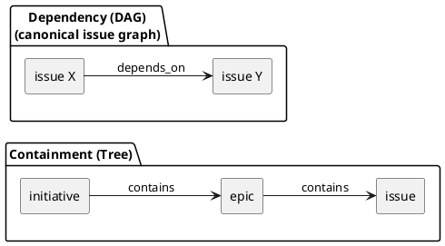

# iss-00010 deps v2: shorthand 依存（initiative/epic）を issue 依存へ還元し、Readyボード（矢印なしツリー）で一目瞭然にする — 要件定義（WHAT / WHY）

## 目的（ユーザーに見える成果 / To-Be） (必須)
- spec-dock の依存関係管理（deps）を “実作業単位=issue” に正規化し、**着手可能（ready）/着手不可（blocked）/ブロッカー**が一目で分かる状態を提供する。
- `deps.json` の宣言は「issue→issue」だけでなく **epic/initiative への shorthand 依存**を許可し、N対Nの依存記述をまとめて管理できるようにする。
- `sync` が生成する `.agent/index*.json` / `.agent/tree*.json`（todo/all）と PlantUML（特に **矢印なしのツリー=Readyボード**）を、multi-agent と人間の共通認識として使えるようにする。

## 背景・現状（As-Is / 調査メモ） (必須)
- 現状の挙動（事実）:
  - SSOT は `spec-dock/initiatives/**/meta.json`（initiative/epic/issue）。`sync` が `.agent/index*.json` / `.agent/tree*.json`（todo/all）を生成する（git 管理しない）。  
    - 実装: `src/spec_dock/assets/spec_dock/scripts/spec-dock` の `_scan_nodes()` / `_sync()`
  - deps v1 は `deps.json`（ノード直下）で依存を定義し、`deps check` / `sync` が `.agent/deps.json` + `deps.puml`/`deps.todo.puml` を生成する。  
    - ドキュメント: `src/spec_dock/assets/spec_dock/docs/reference_deps.md`
  - deps v1 の PlantUML は「ノード（initiative/epic/issue）同列 + 依存矢印」の図であり、包含（ツリー）と依存（順序）が混在して見えやすい。  
    - 実装: `src/spec_dock/assets/spec_dock/scripts/spec-dock` の `_render_deps_puml()`
- 現状の課題（困っていること）:
  - 依存（順序）と包含（ツリー）が混ざって可視化されると、**「いま着手できる issue（Ready）」**が視覚的に分かりづらい（毛玉化しやすい）。
  - 依存は本質的に issue→issue であるにもかかわらず、epic/initiative を同列ノードとして扱うと、説明（なぜ blocked か）と運用が複雑化する。
  - issue同士の依存（N対N）を愚直に列挙すると管理が破綻しやすい一方、「epic/initiative に依存」を shorthand として書けないと整理が難しい。
- 再現手順（最小で）:
  1) 複数 epic/initiative を含む spec ツリーで `deps.json` を設定する
  2) `.agent/deps.puml` を見ると、包含（ツリー）と依存（矢印）が混ざり、Ready/Blocked の判定が図だけでは直感的でないケースがある
- 観測点（どこを見て確認するか）:
  - CLI: `./spec`（wrapper）/ `spec-dock/scripts/spec-dock`（runtime script）
  - Derived: `spec-dock/.agent/index*.json` / `spec-dock/.agent/tree*.json` / `spec-dock/.agent/*.puml`
  - Docs: `src/spec_dock/assets/spec_dock/docs/reference_deps.md` / `reference_sync.md`
- 実際の観測結果（貼れる範囲で）:
  - `sync` は包含ツリーを `.agent/tree*.json` に出せるが、Ready/Blocked をツリー上で表現する “矢印なしビュー” が無い
  - 依存の shorthand を issue→issue に還元して扱うための canonical 仕様が無い
- 情報源（ヒアリング/調査の根拠）:
  - ヒアリング:
    - 「依存は最終的に issue へ還元して管理したい」「epic/initiative 依存でまとめたい」「矢印なしツリー（Readyボード）が欲しい」
  - ドキュメント:
    - `src/spec_dock/assets/spec_dock/docs/reference_deps.md`（現行 deps）
    - `src/spec_dock/assets/spec_dock/docs/reference_sync.md`（sync の入出力）
  - コード:
    - `src/spec_dock/assets/spec_dock/scripts/spec-dock`（runtime script）
      - `_sync()`（index/tree の生成）
      - `_build_deps_state()` / `_render_deps_puml()`（deps派生/可視化）
      - `deps check` / `active set`（depsガード）
  - 補足資料:
    - `spec-deps/current/artifacts/deps-best-practice-issue-normalization.md`（本Issueの検討メモ）

## 対象ユーザー / 利用シナリオ (任意)
- 主な利用者（ロール）:
  - 複数のコーディングエージェント（Codex CLI 等）を並行稼働させる開発者
  - 仕様ツリー（initiative/epic/issue）を運用する人間
- 代表的なシナリオ:
  - シナリオA: 次に着手する issue を探す
    - `sync` が生成する Readyボード（矢印なしツリー）を見て、READY の issue を選ぶ。
  - シナリオB: blocked の理由を短時間で理解する
    - `deps check <issue>`（または `deps explain`）で、ブロッカー（最小説明集合）と “どの deps.json の shorthand が原因か” を確認する。
  - シナリオC: active 化時の事故を防ぐ
    - `active set` が deps によりブロックされ、`--force` の明示がない限り順序違反を防ぐ。

### UML（任意） (任意)

## スコープ（暴走防止のガードレール） (必須)
- MUST（必ずやる）:
  - `deps.json` による依存宣言を **shorthand（initiative/epic）込み**で受け付け、`sync` 時に **canonical（issue→issue）**へ還元（compile）できる。
  - `deps check <target>`（既存）で、canonical 依存に基づく `ready/blocked` とブロッカーを判定できる（`--github` / `--json` を含む）。
  - `active set <target>` は canonical 依存に基づいてガードされ、blocked の場合はデフォルトで失敗し active を更新しない（`--force` でのみ例外化）。
  - `sync` は `.agent/index*.json` / `.agent/tree*.json`（todo/all）に、少なくとも以下の deps 派生情報を含める:
    - issue: 既存の `status`（open/done/active 等）とは **別フィールド**で、依存起因の状態（例: `ready` / `blocked`）を判定できる
      - 例: `ready`（bool）と、blocked理由の summary（例: `blockers_summary` / `blockers_top`）
    - issue: “依存している（merge 済み）issue” を機械的に扱える情報を保持できる
      - 推移依存（closure）を含み、Done 依存は除外する（決定事項 D-004）
    - 依存グラフ（canonical issue edges）をツール/エージェントが機械判定できる形で保持（例: `index.json` のトップレベル `deps.issue_edges`）
  - `sync` は PlantUML の **Readyボード（矢印なしツリー）**を生成できる（initiative→epic→issue の階層をそのまま表示し、各 issue の READY/BLOCKED/DOING/DONE/UNKNOWN を明示）。
    - 生成物は `tree*.puml`（todo/all）として扱う（TBD=Q-004）
  - `sync` は PlantUML の **issue-only 依存グラフ**を生成できる（initiative/epic を除外し、issue のみで依存矢印を描く。todo/all）。
  - shorthand 依存の展開結果が空（依存先 epic/initiative に issue が無い）場合は **エラーにしない**（ブロックしない）。ただし「空だった」事実は warnings/summary として観測できる。
  - canonical issue グラフ上で **自己依存/循環依存（cycle）**を検出し、構造エラーとして止める（エラーは “どの deps.json のどの参照が原因か” を説明できる）。
  - Unknown（GitHub状態未取得/未リンク/取得漏れ等）は安全側（blocked）に倒し、warn code（例: `gh_fetch_failed`, `gh_index_incomplete`）を安定化する。
- MUST NOT（絶対にやらない／追加しない）:
  - `meta.json` のスキーマ拡張、または依存情報の埋め込み（依存は `deps.json` に分離する）
  - runtime script に stdlib 以外の依存を追加
  - GitHub Issue を更新する操作（ラベル付与、本文編集、クローズ等）
- OUT OF SCOPE:
  - GUI/TUI の追加（CLI + 生成物のみ）
  - 未 import の外部 GitHub issue を “将来存在する前提で” 参照する機構（placeholder/external deps）
  - 依存の最適スケジューリング（厳密な最適化）。ただし簡易ランキングは将来拡張としては許容。

## 境界（Always / Ask / Never） (必須)
- Always（常に守る）:
  - unknown は blocked（安全側）に倒す
  - 出力は決定的順序（ソート）にする（テストと差分レビューの安定性）
  - `sync --force` で継続する場合でも、deps 派生物が stale にならないように「無効化された」ことが観測できる
  - `deps.json` の `schema_version` は **1 のみ**（v2 は作らない。v1 を作り直す）
  - 親→配下（descendant）依存は禁止（fail-fast）
- Ask（迷ったら相談）:
  - Readyボードに表示する情報量（blocked のブロッカーを何件までラベルに出すか）
  - `sync` 生成物の観測点（`*-all.json` と todo の分割、PlantUML の命名）をどう固定するか
- Never（絶対にしない）:
  - GitHub token や認証情報を出力/保存する
  - `meta.json` を deps の都合で書き換える

## 非交渉制約（守るべき制約） (必須)
- runtime script（`spec-dock/scripts/spec-dock`）は stdlib のみ
- GitHub state 取得は `gh` CLI を用い、取得失敗は Unknown 扱いで継続（blocked へ）
- 依存の SSOT は `deps.json`（ノード直下）であり、`.agent/*` は “観測スナップショット”
- 規模想定: initiative あたり issue は数十〜最大 ~100 程度（200/2000 規模は想定しない）

## 前提（Assumptions） (必須)
- 依存の “完了” は主に GitHub issue state（OPEN/CLOSED）または `.agent/index*.json` のスナップショットで判定できる
- `sync` は必要に応じて繰り返し実行され、派生物は上書きされる（git管理しない）

## 判断材料/トレードオフ（Decision / Trade-offs） (任意)
- 論点: 依存の判定単位（issue正規化 vs ノード同列）
  - 選択肢A: initiative/epic/issue を同列ノードとして依存グラフを扱う（deps v1）
    - Pros: 実装が単純、現在の仕組みを維持できる
    - Cons: 包含と順序が混ざって可視化が難しい、依存説明が複雑化しやすい
  - 選択肢B: shorthand を許しつつ canonical issue 依存へ compile（deps v2）
    - Pros: 判定が一貫（issue単位）、Readyボード/Explain が作りやすい
    - Cons: compile と provenance の設計が必要、cycle検出の定義が変わる
  - 決定: B（本Issueの目的）
  - 理由: “次にやれる issue” を最短で判断できることを最優先するため

## リスク/懸念（Risks） (任意)
- R-001: shorthand 展開により依存エッジが増える（サイズ/可読性）
  - 影響: `.agent/index-all.json` が肥大化、図が読めない
  - 対応: canonical edges はトップレベルに集約し、tree には summary のみ。図は Ready（矢印なし）を主、依存図は focus/集約を採用。
- R-002: shorthand 展開で自己依存/循環が“暗黙に”発生する
  - 影響: 永久 blocked / `sync` 失敗
  - 対応: canonical issue グラフで cycle 検出し、原因（どの deps.json が生成したか）を出す
- R-003: `sync --force` 時の stale（古い deps の誤用）
  - 影響: 図/JSONが古い deps を含み、誤判断する
  - 対応: deps が無効な場合は `.agent/index*.json`/`.agent/tree*.json` 側でも “deps 無効” を明示し、古い deps を残さない

## 受け入れ条件（観測可能な振る舞い） (必須)
- AC-001:
  - Actor/Role: 開発者 / エージェント
  - Given: spec ツリーに `deps.json`（shorthand含む）が存在する
  - When: `./spec sync --github` を実行する
  - Then:
    - `.agent/index-all.json` / `.agent/tree-all.json` が生成される（all）
    - `.agent/index.json` / `.agent/tree.json` が生成される（todo = Done除外）
    - index/tree（all/todo）の issue ノードに `ready`（bool）と blockers summary が出力される
    - index（all/todo）のトップレベルに canonical issue 依存（例: `deps.issue_edges`）が出力される
  - 観測点: `spec-dock/.agent/index.json` / `spec-dock/.agent/tree.json` / `spec-dock/.agent/index-all.json` / `spec-dock/.agent/tree-all.json`
- AC-002:
  - Actor/Role: 開発者 / エージェント
  - Given: issue が `depends_on` に `epic-*` / `init-*` を含む（shorthand）
  - When: `deps check <issue>` または `sync` を実行する
  - Then: shorthand が展開され、最終的に issue→issue の依存として ready 判定される（epic/init 自体への依存としては残らない）
  - 観測点: `deps check --json` 出力 / `.agent/index*.json` の `deps.issue_edges`
- AC-003:
  - Actor/Role: 開発者
  - Given: 依存先 epic/initiative に issue が1件も無い（空）
  - When: 空の epic/initiative を `depends_on` に指定して `sync` / `deps check` を実行する
  - Then:
    - 展開結果が空でも構造エラーにならず、依存としてはブロックしない
    - “空だった” ことは warnings/summary として観測できる（例: `deps_ref_expanded_to_empty`）
  - 観測点: `sync` の warnings / `deps check --json` の warnings
- AC-004:
  - Actor/Role: エージェント
  - Given: target issue が blocked（canonical 依存が未解決 or unknown）
  - When: `./spec active set <target>` を実行する（`--force` なし）
  - Then: 非0で失敗し、`spec-dock/.agent/active.json` は更新されない
  - 観測点: 終了コード / `spec-dock/.agent/active.json` の更新有無
- AC-005:
  - Actor/Role: エージェント
  - Given: target issue が blocked
  - When: `./spec active set <target> --force` を実行する
  - Then: 警告（blockers）付きで active が更新される
  - 観測点: stderr の warn / `spec-dock/.agent/active.json`
- AC-006:
  - Actor/Role: 開発者 / エージェント
  - Given: deps 情報が解決できる（構造エラーなし）
  - When: `./spec sync` を実行する
  - Then: PlantUML の Readyボード（矢印なしツリー）が生成され、READY/BLOCKED/DOING/DONE/UNKNOWN がラベルで区別できる
  - 観測点: `spec-dock/.agent/tree*.puml`（todo/all）
- AC-011:
  - Actor/Role: 開発者 / エージェント
  - Given: deps 情報が解決できる（構造エラーなし）
  - When: `./spec sync` を実行する
  - Then: PlantUML の issue-only 依存グラフが生成され、READY/BLOCKED/DOING/DONE/UNKNOWN が色/ラベルで区別できる
  - 観測点: `spec-dock/.agent/deps-issues*.puml`（todo/all。命名は ADR で確定）
- AC-007:
  - Actor/Role: 開発者 / エージェント
  - Given: `--github` を指定していない
  - When: `deps check` / `active set` を実行する
  - Then: GitHub へアクセスせず、可能なら `.agent/index*.json` のスナップショットを用いて status を扱う（無い場合は unknown 扱い）
  - 観測点: 実行ログ / `.agent/index*.json` の有無による差分
- AC-008:
  - Actor/Role: 開発者
  - Given: `--github` で `gh issue list` が一部の linked issue を含まない（`--gh-limit` 不足など）
  - When: `sync --github --gh-limit N` を実行する
  - Then: missing を unknown 扱いに倒しつつ `gh_index_incomplete` を warn できる
  - 観測点: stderr warn / `.agent/index*.json` の ready 判定（unknown=blocked）
- AC-009:
  - Actor/Role: 開発者
  - Given: deps 構造エラー（cycle/未解決参照/スキーマ不正）がある
  - When: `sync` を実行する（`--force` なし）
  - Then: 非0で失敗し、エラーに原因（deps.jsonパス、参照、cycle経路）が含まれる
  - 観測点: 終了コード / stderr
- AC-010:
  - Actor/Role: 開発者
  - Given: deps 構造エラーがある
  - When: `sync --force` を実行する
  - Then:
    - index/tree の更新は継続する（既存挙動）
    - deps 派生物は stale にならない（無効化/削除/`deps: null` 等で誤用防止できる）
  - 観測点: `spec-dock/.agent/index*.json` / `spec-dock/.agent/tree*.json` / `.agent/*.puml`

### 入力→出力例 (任意)
- EX-001:
  - Input:
    - `iss-A/deps.json`: `depends_on=["epic-00020"]`
    - `epic-00020` 配下: `iss-B`, `iss-C`
  - Output:
    - canonical: `iss-A -> iss-B`, `iss-A -> iss-C`
    - Readyボード: `iss-A` が `[BLOCKED]` の場合、ブロッカーとして `iss-B/iss-C` が要約表示される
- EX-002:
  - Input:
    - `iss-A/deps.json`: `depends_on=["epic-00020"]`
    - `epic-00020` 配下 issue が0
  - Output:
    - canonical: 展開結果は空（依存としてはブロックしない）
    - warnings: `deps_ref_expanded_to_empty`

## 例外・エッジケース（仕様として固定） (必須)
- EC-001:
  - 条件: `deps.json` の `schema_version` が未対応
  - 期待: 構造エラー（exit=1）で失敗し、`deps.json` のパスと理由が出る
  - 観測点: stderr / 終了コード
- EC-002:
  - 条件: 未解決参照（存在しない node id / 未 import の GitHub issue number）
  - 期待: 構造エラー（exit=1）。どの参照が未解決か分かる
  - 観測点: stderr / 終了コード
- EC-003:
  - 条件: shorthand 展開後に自己依存（`iss-X -> iss-X`）が発生する
  - 期待: 構造エラー（exit=1）。原因となった deps.json 参照が分かる
  - 観測点: stderr
- EC-004:
  - 条件: shorthand 展開後に cycle が発生する
  - 期待: 構造エラー（exit=1）。代表cycle（例: `A -> B -> A`）と provenance が出る
  - 観測点: stderr
- EC-005:
  - 条件: GitHub 取得失敗（`gh` 実行不可/認証不足/ネットワーク）
  - 期待: `gh_fetch_failed` を warn し、unknown を blocked として扱う
  - 観測点: stderr warn / `ready=false`

## 用語（ドメイン語彙） (必須)
- TERM-001: shorthand 依存 = `depends_on` に epic/initiative を指定して「配下 issue 一式」へ依存をまとめて表すこと
- TERM-002: canonical（issue graph）= shorthand を展開した最終形の issue→issue 依存グラフ
- TERM-003: Ready = canonical 依存がすべて Done で、着手可能である状態
- TERM-004: Blocked = canonical 依存に未解決（open/unknown/cycle）があり着手できない状態
- TERM-005: Readyボード = 矢印なしで包含ツリーを表示し、READY/BLOCKED 等をラベル/色で見せる図

## 決定事項（確定 / ADR） (必須)
- D-001: `deps.json` のスキーマは `schema_version=1` のまま作り直す（`schema_version=2` は作らない）
  - 参照: `spec-deps/current/adrs/adr-00001-deps-json-schema-version.md`
- D-002: deps 派生状態（ready/blocked・ブロッカー等）は `.agent/index*.json` / `.agent/tree*.json` に統合する（issue のみ）
  - 参照: `spec-deps/current/adrs/adr-00002-derived-state-integration.md`
- D-003: 親→配下（descendant）依存は禁止（fail-fast を維持）
  - 参照: `spec-deps/current/adrs/adr-00003-descendant-dependency-policy.md`
- D-004: index/tree の issue ノードは「推移依存（closure）を保持し、Done 依存は除外」する（Option C）
  - 参照: `spec-deps/current/adrs/adr-00005-issue-deps-derived-fields.md`
- D-005: index/tree を all と todo に分割し、todo をデフォルト観測点にする（`index-all.json` / `tree-all.json` を新設）
  - 参照: `spec-deps/current/adrs/adr-00006-sync-artifacts-all-vs-todo.md`

## 未確定事項（TBD / 要確認） (必須)
- Q-004:
  - 質問: Readyボード（矢印なしツリー=tree）の生成物ファイル名/種類（todo/all）をどう固定するか？
  - 選択肢:
    - A: `tree.puml` / `tree-all.puml`（推奨。`tree.json` / `tree-all.json` と対応）
    - B: `ready.puml` / `ready-all.puml`（board専用名）
    - C: 1ファイルのみ（todo-only か all のみ）
  - 推奨案（暫定）: A（観測点が `tree` に寄り、迷いにくい）
  - 影響範囲: AC-006（生成物の観測点）
  - 参照: `spec-deps/current/adrs/adr-00004-ready-board-artifact-naming.md`
- Q-006:
  - 質問: issue-only 依存グラフ（PlantUML）の生成物（全体/フォーカス、矢印方向、命名）をどう固定するか？
  - 選択肢:
    - A: 全体（todo/all）のみ生成
    - B: フォーカス（指定 issue の上流のみ）だけ生成（コマンドで生成）
    - C: 全体 + フォーカス（推奨候補）
  - 推奨案（暫定）: C（毛玉化してもフォーカスで回避できる）
  - 影響範囲: AC-011（生成物の観測点）, `deps check` / `sync` の UX
  - 参照: `spec-deps/current/adrs/adr-00007-issue-only-deps-visualization.md`

## Definition of Ready（着手可能条件） (必須)
- [ ] 目的が 1〜3行で明確になっている
- [ ] MUST/MUST NOT/OUT OF SCOPE が書けている
- [ ] Always/Ask/Never が書けている
- [ ] AC/EC が観測可能（テスト可能）な形になっている
- [ ] 観測点（UI/HTTP/DB/Log など）または確認方法が明記されている
- [ ] 未確定事項が「質問/選択肢/推奨案/影響範囲」で整理されている

## 完了条件（Definition of Done） (必須)
- すべてのAC/ECが満たされる
- 未確定事項が解消される（残す場合は「残す理由」と「合意」を明記）
- MUST NOT / OUT OF SCOPE を破っていない

## 省略/例外メモ (必須)
- 該当なし
