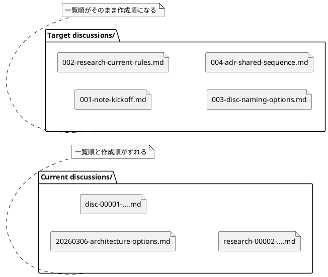

# iss-00019 discussions 配下の資料命名を時系列順に並ぶ形式へ統一し、全種別を共通採番できるようにする — 要件定義（WHAT / WHY）

## 目的（ユーザーに見える成果 / To-Be） (必須)
- Initiative / Epic / Issue の各 `discussions/` ディレクトリで、ADR / 議論 / 調査 / メモのファイルが **名前順のまま作成順に並ぶ** ようになる。
- `discussions/` に置かれる全種別の資料が、`001-adr-...`, `002-disc-...` のような **3 桁ゼロ埋め共通連番**で管理される。
- rules / templates / runtime / docs / tests が同じ命名規約を共有し、ADR だけでなく非 ADR も同じ並び順原則で運用できる。

## 背景・現状（As-Is / 調査メモ） (必須)
- 現状の挙動（事実）:
  - `spec-deps/current/discussions/rules.md` と `src/spec_dock/assets/spec_dock/templates/{initiative,epic,issue}/discussions/rules.md` は、`<type>-00001-<slug>.md` を規約としている。
  - `src/spec_dock/assets/spec_dock/scripts/spec_dock_runtime/app.py` の `_new_adr()` は `discussions/adr-*.md` のみを走査し、ADR だけを type ローカル連番で自動作成している。
  - 非 ADR（`disc` / `research` / `note`）はテンプレートのコピー運用であり、共通採番器がない。
  - 実例として `spec-deps/completed/20260309T041052Z-issue-iss-00016/discussions/` には、`20260306-...` の日付先頭ファイルと `disc-00001-...`, `research-00002-...` が混在している。
  - `tests/test_cli.py` は `discussions/rules.md` と `adr-00001-*.md` / `adr-00002-*.md` を前提にしている。
- 現状の課題（困っていること）:
  - type ごとの連番では、`discussions/` 1 ディレクトリ全体を名前順で見ても作成順にならない。
  - ADR だけが自動採番され、非 ADR は人間依存で命名がぶれやすい。
  - 日付先頭ファイルと type 先頭ファイルが混在すると、一覧性と規約の一貫性が崩れる。
  - rules / templates / runtime / docs / tests が別々の前提を持つため、変更箇所を揃えないと回帰しやすい。
- 再現手順（最小で）:
  1) `spec-deps/current/discussions/rules.md` を開くと `<type>-00001-<slug>.md` が規約になっている。
  2) `src/spec_dock/assets/spec_dock/scripts/spec_dock_runtime/app.py` の `_new_adr()` を見ると `discussions/adr-*.md` のみを走査している。
  3) `spec-deps/completed/20260309T041052Z-issue-iss-00016/discussions/` を名前順で見ると、日付先頭ファイルと `disc-*` / `research-*` が混在し、全体の作成順には見えない。
- 観測点（どこを見て確認するか）:
  - UI: 該当なし
  - HTTP: 該当なし
  - DB: 該当なし
  - Log: runtime コマンドの stderr/stdout
  - FS:
    - `src/spec_dock/assets/spec_dock/scripts/spec_dock_runtime/app.py`
    - `src/spec_dock/assets/spec_dock/templates/**/discussions/rules.md`
    - `src/spec_dock/assets/spec_dock/templates/README.md`
    - `src/spec_dock/assets/spec_dock/docs/{workflow_adr,workflow_issue,workflow_epic,workflow_initiative,phase_requirement,phase_design,phase_plan,README,guide}.md`
    - `tests/test_cli.py`
    - `spec-deps/README.md`
- 実際の観測結果（貼れる範囲で）:
  - Input/Operation:
    - rules / runtime / docs / tests / 過去 `discussions/` 実例を調査
  - Output/State:
    - 規約は type 先頭、実装は ADR のみ type ローカル採番、実例は日付先頭ファイルも混在
- 情報源（ヒアリング/調査の根拠）:
  - Issue/チケット:
    - `#19`
  - ドキュメント:
    - `spec-deps/current/discussions/disc-00001-discussions-naming-analysis-and-target-state.md`
    - `spec-deps/current/discussions/rules.md`
    - `spec-deps/completed/iss-00014/design.md`
    - `src/spec_dock/assets/spec_dock/templates/README.md`
    - `src/spec_dock/assets/spec_dock/docs/workflow_adr.md`
    - `src/spec_dock/assets/spec_dock/docs/workflow_issue.md`
    - `src/spec_dock/assets/spec_dock/docs/workflow_epic.md`
    - `src/spec_dock/assets/spec_dock/docs/workflow_initiative.md`
    - `src/spec_dock/assets/spec_dock/docs/phase_requirement.md`
    - `src/spec_dock/assets/spec_dock/docs/phase_design.md`
    - `src/spec_dock/assets/spec_dock/docs/phase_plan.md`
    - `src/spec_dock/assets/spec_dock/docs/guide.md`
    - `src/spec_dock/assets/spec_dock/docs/README.md`
  - コード:
    - `src/spec_dock/assets/spec_dock/scripts/spec_dock_runtime/app.py`（`_new_adr`, `prefix=="adr"` の `_next_id` fallback, `adr-*.md` 前提）
    - `tests/test_cli.py`（`adr-00001-*.md` / `adr-00002-*.md` を直接観測）
  - 画面/ログ/DB:
    - 該当なし

## 対象ユーザー / 利用シナリオ (任意)
- 主な利用者（ロール）:
  - `spec-dock` を導入した repo で要件整理・設計検討・ADR 作成を行う利用者
  - `spec-dock` の runtime / templates / docs / tests を保守する開発者
- 代表的なシナリオ:
  - Issue の `discussions/` に note → research → disc → adr を順に置き、一覧順だけで思考の流れを追いたい
  - 既存 scope に新しい ADR を追加したとき、他 type を含めた最後尾の番号で自動採番されてほしい
  - 非 ADR の資料も rules や supported workflow に従って同じ並び順で作りたい
  - `init` / `update` 後の配布 docs と templates が、古い命名例を含まない状態で揃っていてほしい

### UML（任意） (任意)

## スコープ（暴走防止のガードレール） (必須)
- MUST（必ずやる）:
  - `discussions/` 配下の命名規約を `<nnn>-<type>-<slug>.md` に統一する
  - `nnn` は `001` から始まる 3 桁ゼロ埋め連番とする
  - 採番スコープを type ごとではなく、各 `discussions/` ディレクトリ単位の全種別共通連番へ変更する
  - ADR の自動作成フローが、同一 `discussions/` 内の全資料を前提に次番号を決めるようにする
  - 非 ADR の資料についても、`spec-dock` が提供する supported workflow が番号計算・衝突検出・許容 type 判定を保証し、同じ連番原則に従えるようにする
  - rules / templates / runtime / docs / tests / `spec-deps/current/discussions/rules.md` / `spec-deps/README.md` を新ルールへ整合させる
  - 3 桁上限（999）を超える場合は、4 桁へ進まず明示的に失敗し、follow-up issue で archive または桁拡張を判断する契約に固定する
  - legacy 混在ディレクトリでは、旧 `<type>-00001-...` 形式の数値部を次番号計算対象に含め、日付先頭ファイルは採番基準に含めない
- MUST NOT（絶対にやらない／追加しない）:
  - 日時 prefix を新標準として採用しない
  - type ごとの独立連番を残したまま「時系列に並ぶ」と見なさない
  - `discussions/` を type ごとのサブディレクトリへ再分割しない
  - `init` / `update` 時に、既存ユーザー repo の discussion 資料を自動一括 rename しない
  - 3 桁と 4 桁を無秩序に混在させない
- OUT OF SCOPE:
  - `discussions/` 以外のファイル命名規約変更
  - Initiative / Epic / Issue ノード本体の ID 体系変更
  - `spec-dock` の GitHub 連携や deps 機能の再設計
  - 既存ユーザー repo の legacy discussion 資料に対する自動移行ツールの提供
  - `spec-deps/completed/**` の既存履歴を一括 rename して全面移行すること

## 境界（Always / Ask / Never） (必須)
- Always（常に守る）:
  - 変更判断は「一覧順がそのまま作成順になるか」を最優先にする
  - 1 ディレクトリ運用は維持し、分類は file type と frontmatter で担保する
  - rules / templates / runtime / docs / tests を一つの契約として扱う
  - 既存ユーザー資料の安全性を優先し、破壊的な自動 rename を避ける
- Ask（迷ったら相談）:
  - 非 ADR の supported workflow を独立 subcommand として見せるか、内部 helper を既存導線から呼ぶか
- Never（絶対にしない）:
  - 一部の docs や templates だけを更新して runtime / tests と食い違わせる
  - legacy 混在ディレクトリに対して、利用者に無断で rename をかける
  - uppercase を含む新しい file / dir path を増やす

## 非交渉制約（守るべき制約） (必須)
- 標準命名は `001-adr-...`, `002-disc-...` のような **3 桁ゼロ埋め + type + slug** とする
- type は `adr`, `disc`, `research`, `note` を基本語彙として維持する
- 採番は `discussions/` ディレクトリ単位の全種別共通連番とする
- `rules.md` は採番対象外とする
- 非 ADR も `spec-dock` 提供の supported workflow が番号計算・衝突検出・type 判定を保証する
- legacy 混在ディレクトリでは、`adr-00001-...`, `disc-00001-...`, `research-00001-...`, `note-00001-...` の数値部だけを次番号計算に利用し、日付先頭ファイルは数値源として扱わない
- 日時はファイル名ではなく frontmatter / 本文に保持する
- 連番は再利用しない
- 新規/変更する path は lowercase を維持し、`A-Z` を含む新規 path を作らない
- 既存ユーザー repo の資料は自動 rename しない
- `999` 超過時は 4 桁へ進まず失敗する
- Python 標準ライブラリ主体の現行 runtime 方針を崩さず、不要な依存追加を前提にしない

## 前提（Assumptions） (必須)
- `discussions/` は引き続き 1 ディレクトリに ADR / 議論 / 調査 / メモを共置きする
- 一覧性の主戦場はファイルブラウザや `ls` / `find` / editor tree での名前順表示である
- 既存 repo には旧ルールの discussion 資料が残りうる
- repo 管理下の docs / templates / tests はこの issue の中で更新できる
- repo 管理下の現行ガイダンス資料として `spec-deps/current/discussions/rules.md` と `spec-deps/README.md` は更新対象に含め、調査分析シートや `spec-deps/completed/**` の履歴資料は legacy 記録として原則据え置く
- 3 桁で当面の議論深度には十分で、999 を超えるケースは例外として扱える

## 判断材料/トレードオフ（Decision / Trade-offs） (任意)
- 論点: 日時 prefix か連番 prefix か
  - 選択肢A: 日時 prefix
    - Pros: 日付が一見で分かる
    - Cons: 長い、同日複数件で時刻が必要、一覧の可読性が落ちる
  - 選択肢B: 連番 prefix
    - Pros: 短い、一覧性が高い、時系列整列に強い
    - Cons: 上限管理と競合回避の設計が必要
  - 決定: B
  - 理由: 今回の主目的は「一覧順 = 作成順」であり、可読性と安定参照の両面で連番が優位
- 論点: 2 桁か 3 桁か
  - 選択肢A: 2 桁
    - Pros: 最短
    - Cons: 99 で頭打ちしやすい
  - 選択肢B: 3 桁
    - Pros: 999 まで余裕があり、深い議論に耐える
    - Cons: 1 文字分だけ長い
  - 決定: B
  - 理由: ユーザー判断として、ノイズ増より安心感の価値が高い
- 論点: type-first か sequence-first か
  - 選択肢A: `adr-001-...`
    - Pros: type ごとの一覧に強い
    - Cons: ディレクトリ全体の時系列整列を失う
  - 選択肢B: `001-adr-...`
    - Pros: 名前順がそのまま作成順になる
    - Cons: type を prefix だけで絞り込みにくくなる
  - 決定: B
  - 理由: 同一ディレクトリ運用の目的に合う

## リスク/懸念（Risks） (任意)
- R-001: legacy 混在ディレクトリは、新ルール導入後もしばらく完全な時系列一覧にならない
  - 影響: 過去資料を含む古い scope では見え方が揃わない
  - 対応: 自動 rename は行わず、旧 type-local 番号だけを次番号計算に利用して新規資料から新ルール適用・必要なら手動 migration 方針を docs へ明記
- R-002: 3 桁上限（999）を超える運用が現れた場合、追加方針が必要になる
  - 影響: 無秩序な 4 桁混在で一覧順が崩れる
  - 対応: 上限到達時は明示的に失敗または follow-up 方針へ誘導する
- R-003: 非 ADR の supported workflow を弱く設計すると、再び命名が人間依存になる
  - 影響: 規約と実態が再度ずれる
  - 対応: requirement で「全種別が supported workflow で同じ連番原則に従えること」を固定する

## 受け入れ条件（観測可能な振る舞い） (必須)
- AC-001:
  - Actor/Role: `spec-dock` 利用者
  - Given: 新しい Initiative / Epic / Issue scope に `discussions/` がある
  - When: `rules.md` と配布 docs / templates を参照する
  - Then: 命名規約が一貫して `<nnn>-<type>-<slug>.md` と説明され、例が `001-...` 形式になっている
  - 観測点（UI/HTTP/DB/Log など）: `discussions/rules.md`, `templates/README.md`, `docs/workflow_*.md`, `docs/phase_*.md`, `docs/guide.md`, `docs/README.md`
  - 権限/認可条件（ある場合）: なし
- AC-002:
  - Actor/Role: `spec-dock` 利用者
  - Given: ある scope の `discussions/` に `001-note-...`, `002-research-...` が既に存在する
  - When: supported workflow で新しい ADR を作成する
  - Then: 生成される ADR ファイル名は `003-adr-<slug>.md` となり、ADR だけのローカル連番には戻らない
  - 観測点（UI/HTTP/DB/Log など）: FS 上の生成ファイル名, runtime stdout/stderr, 回帰テスト
  - 権限/認可条件（ある場合）: なし
- AC-003:
  - Actor/Role: `spec-dock` 利用者
  - Given: ある scope の `discussions/` に `003-adr-...` までの資料が存在する
  - When: `disc` / `research` / `note` のいずれかを `spec-dock` 提供の supported workflow で追加する
  - Then: 追加されるファイル名は次の共通番号（例: `004-disc-...`）となり、supported workflow が番号計算と衝突検出を保証する
  - 観測点（UI/HTTP/DB/Log など）: FS 上の生成ファイル名, runtime / helper の stdout/stderr, 回帰テスト
  - 権限/認可条件（ある場合）: なし
- AC-004:
  - Actor/Role: `spec-dock` メンテナ
  - Given: リポジトリで `init` / `update` / テストを実行する
  - When: scaffold と package assets と docs を確認する
  - Then: 古い命名例（`adr-00001-...`, `<type>-00001-...`, 日時先頭例）が配布正本と現行ガイダンス資料（`spec-deps/current/discussions/rules.md`, `spec-deps/README.md`）では「現行ルール」として残らず、テストも新ルールを観測している
  - 観測点（UI/HTTP/DB/Log など）: templates, shipped docs, runtime assets, `spec-deps/current/discussions/rules.md`, `spec-deps/README.md`, `tests/test_cli.py`
  - 権限/認可条件（ある場合）: なし
- AC-005:
  - Actor/Role: 既存 `spec-dock` 利用者
  - Given: 既存 repo の `discussions/` に旧命名（例: `adr-00001-...`, `20260306-...`）が残っている
  - When: `init` / `update` を実行する
  - Then: 既存ファイルは自動 rename されず、`spec-dock` 提供の supported workflow は旧 `<type>-00001-...` の数値部を採番基準に含めて次番号を決め、新規作成される資料だけが新ルールに従う
  - 観測点（UI/HTTP/DB/Log など）: update 後の FS 差分, runtime / helper stdout/stderr, docs / migration guidance
  - 権限/認可条件（ある場合）: なし
- AC-006:
  - Actor/Role: `spec-dock` 利用者 / メンテナ
  - Given: ある `discussions/` ディレクトリが新ルールで運用されている
  - When: ファイル一覧を名前順で確認する
  - Then: `rules.md` を除く資料が `001`, `002`, `003` ... の順で並び、思考の時系列を名前順だけで追える
  - 観測点（UI/HTTP/DB/Log など）: FS の一覧順, docs に記載された例, 回帰テスト
  - 権限/認可条件（ある場合）: なし

### 入力→出力例 (任意)
- EX-001:
  - Input:
    - existing:
      - `001-note-kickoff.md`
      - `002-research-current-rules.md`
    - operation:
      - new ADR
  - Output:
    - `003-adr-shared-sequence.md`
- EX-002:
  - Input:
    - existing:
      - `001-note-kickoff.md`
      - `002-research-current-rules.md`
      - `003-adr-shared-sequence.md`
    - operation:
      - new disc
  - Output:
    - `004-disc-migration-options.md`

## 例外・エッジケース（仕様として固定） (必須)
- EC-001:
  - 条件: supported workflow が生成しようとする番号と同じ `nnn` を持つ discussion 資料が既に存在する
  - 期待: 重複を許容せず、明示的に失敗するか、番号衝突として利用者へ分かる形で止まる。既存ファイルを上書きしない
  - 観測点（UI/HTTP/DB/Log など）: runtime stderr/stdout, FS 差分なし, 回帰テスト
- EC-002:
  - 条件: 次番号が `999` を超える
  - 期待: 無秩序に 4 桁へ進まず、supported workflow は明示的なエラーで停止する。docs は「follow-up issue で archive または桁拡張を判断する」と案内する
  - 観測点（UI/HTTP/DB/Log など）: runtime / helper stderr/stdout, docs / guidance
- EC-003:
  - 条件: `rules.md` や命名規約外ファイルが `discussions/` に存在する
  - 期待: `rules.md` は採番対象外であり、supported workflow は rules 本体を番号消費に含めない
  - 観測点（UI/HTTP/DB/Log など）: FS, runtime behavior, tests
- EC-004:
  - 条件: legacy 命名の discussion 資料が残る既存 scope で `init` / `update` / 新規資料作成を行う
  - 期待: 既存資料は自動 rename されない。supported workflow は legacy のうち `<type>-00001-...` 形式の数値部だけを採番基準に含め、日付先頭ファイルは採番基準に含めない。新規資料だけが新ルールに従い、一覧順が完全に揃わない期間があることは docs で案内される
  - 観測点（UI/HTTP/DB/Log など）: update 後の FS 差分, runtime stdout/stderr, migration guidance
- EC-005:
  - 条件: `disc`, `research`, `note`, `adr` 以外の未知 type を扱おうとする
  - 期待: `spec-dock` 提供の supported workflow が許容 type を検証し、未知 type は明示的に失敗する
  - 観測点（UI/HTTP/DB/Log など）: rules/docs, runtime / helper stderr

## 用語（ドメイン語彙） (必須)
- TERM-001: `discussion 資料` = `discussions/` 配下に置く ADR / 議論 / 調査 / メモの総称
- TERM-002: `supported workflow` = `spec-dock` が提供・案内する資料作成手順。実装表面は command でも helper 呼び出しでもよいが、番号計算・衝突検出・type 判定をシステムが保証する
- TERM-003: `legacy 命名` = `<type>-00001-<slug>.md` や `YYYYMMDD-...` のような旧来または混在中の命名
- TERM-004: `共通連番` = `discussions/` ディレクトリ単位で、type を問わず共有する `001`, `002`, `003` ... の順序番号
- TERM-005: `legacy 採番基準` = legacy 混在ディレクトリで次番号を求める際に参照する数値源。旧 `<type>-00001-...` の数値部は含めるが、日付先頭ファイルは含めない

## 未確定事項（TBD / 要確認） (必須)
- Q-001:
  - 質問: 非 ADR の supported workflow を利用者へどの形で公開するか
  - 選択肢:
    - A: `new doc` 相当の明示 command を用意する
    - B: 既存コマンドや wrapper から内部 helper を呼び、利用者には最小の導線だけ見せる
  - 推奨案（暫定）: A か B のどちらでもよい。ただし requirement では「システムが番号計算・衝突検出・type 判定を保証する」ことまで固定し、表面 API は design で決める
  - 影響範囲: AC-003 / EC-001 / EC-005 / スコープ / テスト

## Definition of Ready（着手可能条件） (必須)
- [x] 目的が 1〜3行で明確になっている
- [x] MUST/MUST NOT/OUT OF SCOPE が書けている
- [x] Always/Ask/Never が書けている
- [x] AC/EC が観測可能（テスト可能）な形になっている
- [x] 観測点（UI/HTTP/DB/Log など）または確認方法が明記されている
- [x] 未確定事項が「質問/選択肢/推奨案/影響範囲」で整理されている

## 完了条件（Definition of Done） (必須)
- すべての AC / EC を満たす実装・docs・tests が揃う
- 3 桁ゼロ埋め + type + slug の命名規約が、rules / templates / runtime / docs / tests で矛盾なく共有される
- 非 ADR も `spec-dock` 提供の supported workflow で番号計算・衝突検出・type 判定が保証される
- legacy 資料の自動 rename を行わず、安全な移行方針が明示される
- `999` 超過時は失敗して停止する契約が docs / runtime / tests で一致している
- legacy 混在ディレクトリでの採番基準が docs / runtime / tests で一致している
- 未確定事項が解消される（残す場合は、残す理由と合意を記録する）
- MUST NOT / OUT OF SCOPE を破っていない

## 省略/例外メモ (必須)
- 該当なし
