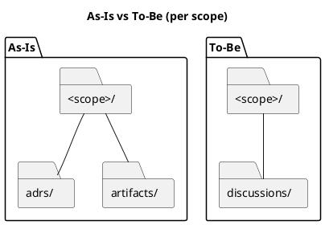

# iss-00014 ディスカッション資料の格納先を discussions/ に統一（adrs/artifacts の統合） — 要件定義（WHAT / WHY）

## 目的（ユーザーに見える成果 / To-Be） (必須)
- Initiative/Epic/Issue 配下に散らばるディスカッション関連ディレクトリ（`adrs/`, `artifacts/`）を廃止し、**`discussions/` 1つ**に統一する。
- ADR（意思決定）だけでなく、軽量な検討メモ/調査/説明資料も同じ場所に置けるようにし、運用と導線を簡素化する。
- ツールは未本格稼働のため、**後方互換性は維持しない**（破壊的変更を許容し、シンプルなロジックを優先する）。

## 背景・現状（As-Is / 調査メモ） (必須)
- 現状の挙動（事実）:
  - v2 テンプレートは各スコープ（initiative/epic/issue）配下に `adrs/` と `artifacts/` を生成する:
    - `src/spec_dock/assets/spec_dock/templates/{initiative,epic,issue}/{adrs,artifacts}/`
  - ADR は `adrs/new-adr` ラッパから作成できる（ランタイム `spec-dock new adr` を呼ぶ）:
    - 例: `spec-deps/current/adrs/new-adr`
    - To-Be: **このラッパは廃止**し、`discussions/` 配下にスクリプトを置かない運用にする
  - 補足資料は `artifacts/_template.md` をコピーして増やす運用になっている:
    - `spec-deps/current/artifacts/_template.md`
  - ランタイムは ADR を `**/adrs/adr-*.md` で走査して状態集計等に使う:
    - `src/spec_dock/assets/spec_dock/scripts/spec_dock_runtime/app.py`（`rglob("adrs/adr-*.md")` / `scope.path / "adrs"`）
- 現状の課題（困っていること）:
  - 「ADR にするほどでもない」軽量な検討メモ/調査結果/説明資料の置き場が `artifacts/` として別になり、判断と導線が増える。
  - ディレクトリが用途別に増えるほど、運用（探索/命名/新規作成コマンド）が複雑化しやすい。
  - Initiative/Epic/Issue すべてで同じ運用をしたいが、テンプレとコマンドを増やすほど保守が重くなる。
- 観測点（どこを見て確認するか）:
  - テンプレ生成物: `src/spec_dock/assets/spec_dock/templates/`
  - ランタイム: `src/spec_dock/assets/spec_dock/scripts/spec_dock_runtime/app.py`
  - 既存の作業ツリー例: `spec-deps/`（v1 の issue/current モデル）

## 対象ユーザー / 利用シナリオ (任意)
- 主な利用者（ロール）:
  - 仕様書駆動で Initiative/Epic/Issue を運用する開発者（人間/エージェント）
- 代表的なシナリオ:
  - Issue の検討中に、軽量メモ→調査→意思決定（ADR）までを同じ導線で追加/参照したい

### UML（任意） (任意)

## スコープ（暴走防止のガードレール） (必須)
- MUST（必ずやる）:
  - 新規生成テンプレート（initiative/epic/issue）から `adrs/` と `artifacts/` をなくし、`discussions/` を生成する。
  - `discussions/` は **空ディレクトリにならない**ように、運用ガイド（例: `discussions/rules.md`）を必ず配置する（Git で管理できる状態にする）。
  - ADR 作成コマンド（`spec-dock new adr`）は `discussions/` 配下へ作成するようにする。
  - `discussions/` 配下のファイルは **種類（prefix）+ 連番**で管理する（例: `adr-00001-...`, `disc-00001-...`, `research-00001-...`, `note-00001-...`）。
  - テンプレートは **1つのテンプレディレクトリ**に集約し、そこに type ごとのテンプレを置く（最小セットで開始する）:
    - `spec-dock/templates/discussions/`
    - 例: `adr.md`, `note.md`, `disc.md`, `research.md`
    - `discussions/rules.md` から上記パスを案内して「コピーして使う」運用にする。
  - `discussions/` 配下にスクリプト（`new-adr` 等）を置かない（完全廃止）。
- MUST NOT（絶対にやらない／追加しない）:
  - ディレクトリを用途別に増殖させない（トップレベルは `discussions/` のみ）。
  - 後方互換性のための併走サポート・自動移行・レガシー走査を入れない（必要になったら別Issueで検討する）。
- OUT OF SCOPE:
  - spec ツリー全体（v1→v2）の移行戦略の全面再設計（この Issue は「ディスカッション資料の格納と導線」に限定）

## 境界（Always / Ask / Never） (必須)
- Always（常に守る）:
  - ディレクトリ/ファイル命名は小文字（macOS case-insensitive 対策）
  - 人間が手で編集する資料は `discussions/` に集約（生成物ディレクトリとは分離）
- Ask（迷ったら相談）:
  - ADR 以外の資料タイプ（テンプレ種類）を追加するか（最小セットは `note/disc/research`）
- Never（絶対にしない）:
  - デフォルトで多数のテンプレを生成してツリーを汚す（必要最小限に絞る）

## 非交渉制約（守るべき制約） (必須)
- ADR の採番規則（`adr-00001-...`）は維持する。
- GitHub を使わないローカル運用（`--no-github`）でも同等に動作する。
- 既存の `adrs/` / `artifacts/` を維持する互換要件は無い（破壊的変更を許容する）。

## 前提（Assumptions） (必須)
- 既存ユーザーのツリーに `adrs/` と `artifacts/` が存在し得るが、互換サポートは不要（必要なら手動で移動する）。
- 生成後の資料はユーザーが自由に編集する（テンプレは雛形）。

## 判断材料/トレードオフ（Decision / Trade-offs） (任意)
- 論点: `discussions/` に統一すると「意思決定（ADR）」と「補足資料」が混在する
  - 選択肢A: ファイル名 prefix（`adr-`, `disc-`, `research-`, `note-`）で識別（Pros: 単純 / Cons: 命名規約が必要）
  - 選択肢B: frontmatter `種別:` を必須化して識別（Pros: 文章側で完結 / Cons: 運用の徹底が必要）
  - 選択肢C: サブディレクトリで分類（Pros: 分かりやすい / Cons: 「1ディレクトリ」要望に反する）
  - 決定: A（prefix を主）+ frontmatter は “任意〜推奨” として補助的に使う

## リスク/懸念（Risks） (任意)
- R-001: 破壊的変更により旧ツリーがそのままでは動かなくなる（影響: 既存利用者 / 対応: `rules.md` に手動移行の最小手順を記載）
- R-002: `discussions/` の運用ルールが曖昧だと “何でも置き場” 化する（影響: 探索性低下 / 対応: 最低限の命名規約・テンプレ・rules.md）
- R-003: 連番運用が手動だと衝突しやすい（影響: 作成時の手戻り / 対応: `spec-dock new ...` が採番する or `rules.md` で衝突時の対処を明記）

## 受け入れ条件（観測可能な振る舞い） (必須)
- AC-001:
  - Actor/Role: ユーザー
  - Given: `spec-dock new {initiative,epic,issue}` でノードを新規作成する
  - When: 生成されたノードディレクトリを確認する
  - Then: `discussions/` が存在し、`adrs/` と `artifacts/` は生成されない
  - 観測点: 生成物ツリー（ファイルシステム）
- AC-002:
  - Actor/Role: ユーザー
  - Given: 対象スコープ（initiative/epic/issue）ID が存在する
  - When: `spec-dock new adr --<scope> <id> --title "..."` を実行する
  - Then: `discussions/adr-xxxxx-<slug>.md` が作成され、ADR テンプレが適用される
  - 観測点: 生成物ツリー（ファイルシステム）
- AC-003:
  - Actor/Role: ユーザー
  - Given: `spec-dock new {initiative,epic,issue}` でノードを新規作成する
  - When: `discussions/` ディレクトリを確認する
  - Then: `discussions/rules.md`（運用ガイド）が存在し、`discussions/` が Git で管理可能な状態になっている
  - 観測点: 生成物ツリー（ファイルシステム）
- AC-004:
  - Actor/Role: ユーザー
  - Given: `discussions/rules.md` にテンプレパス（`spec-dock/templates/discussions/<type>.md`）が記載されている
  - When: テンプレをコピーして軽量資料を作成する
  - Then: 命名規約（`<type>-00001-<slug>.md`）に従って追加できる
  - 観測点: `discussions/` 配下のファイル名と内容
- AC-005:
  - Actor/Role: ユーザー
  - Given: `spec-dock new {initiative,epic,issue}` でノードを新規作成する
  - When: `discussions/` ディレクトリを確認する
  - Then: `discussions/` 配下に `new-adr` 等のラッパスクリプト（実行スクリプト）が存在しない
  - 観測点: 生成物ツリー（ファイルシステム）
- AC-006:
  - Actor/Role: ユーザー
  - Given: 対象リポジトリに `spec-dock/` がインストールされている（`spec-dock init/update` 済み）
  - When: `spec-dock/templates/discussions/` を確認する
  - Then: type テンプレ（`adr.md`, `note.md`, `disc.md`, `research.md`）が存在する
  - 観測点: 生成物ツリー（ファイルシステム）

### 入力→出力例 (任意)
- EX-001:
  - Input: `spec-dock new adr --issue iss-00123 --title "token rotation"`
  - Output: `<issue>/discussions/adr-00001-token-rotation.md`

## 例外・エッジケース（仕様として固定） (必須)
- EC-001:
  - 条件: `discussions/` 配下に同一連番のファイルが既に存在する（例: `note-00001-...` がある）
  - 期待:
    - `--id` を **省略**した作成（例: `spec-dock new adr ...`）では、既存の最大番号を走査して **次番号（max+1）** を採番し、衝突を回避する
    - `--id` を **明示**した作成で既に同一IDが存在する場合は、**非0で失敗**し、作成しない
  - 観測点: `spec-dock new ...` の出力、作成されたファイル名、終了コード
- EC-002:
  - 条件: `discussions/` を “空ディレクトリ” として残したい
  - 期待: `discussions/rules.md` が常に存在するため、空ディレクトリ問題は発生しない
  - 観測点: 生成物

## 用語（ドメイン語彙） (必須)
- TERM-001: `discussions/` = ADR を含むディスカッション関連ドキュメント置き場（検討/調査/説明/決定の記録）
- TERM-002: ADR = Architecture Decision Record（意思決定の記録、採番・状態管理を伴う）
- TERM-003: `note-` = 軽量メモ（会議メモ/思考メモ/作業メモ。必要なら `disc`/`adr` に昇格）
- TERM-004: `disc-` = 議論シート（選択肢/Pros/Cons/未決事項を整理し、推奨案まで置く）
- TERM-005: `research-` = 調査メモ（調査目的・方法・結果・結論・参照リンク/実験ログ）

## 未確定事項（TBD / 要確認） (必須)
- Q-001:
  - 質問: ディレクトリ名は `discussions/` で確定してよいか
  - 回答: Yes（決定）
  - 影響範囲: テンプレ/ランタイム/ドキュメント
- Q-002:
  - 質問: テンプレ提供をどうするか（1ファイル固定 vs typeごと複数）
  - 回答: B（決定。最小セットで開始）
  - 選択肢（記録）:
    - A: 1つの汎用テンプレ（`template.md`）に統一し、コピー運用（最小）
    - B: type ごとにテンプレを用意（`note.md`, `disc.md`, `research.md` 等）。ファイル名 prefix と 1:1 にする（迷いを減らす）
  - 影響範囲: テンプレ/`rules.md`/（任意）`new doc` のテンプレ選択ロジック
- Q-003:
  - 質問: 非ADRドキュメントの連番は「typeごと」か「discussions全体で共通」か
  - 選択肢:
    - A: typeごと（`note-00001`, `research-00001`）: 直感的、衝突が減る
    - B: 共通（`doc-00001` + frontmatter で type）: 作成順で並ぶが識別が弱い
  - 回答: A（決定）
  - 影響範囲: 命名規約/採番ロジック/探索性
- Q-004:
  - 質問: 非ADR作成を `spec-dock new doc` として機械化するか（連番衝突の回避）
  - 選択肢:
    - A: しない（手動コピー運用。最小）
    - B: する（`new doc` を追加し、typeごとの連番を採番する）
  - 回答: A（決定。今Issueでは実装しない）
  - 理由:
    - まずは `discussions/rules.md` + `spec-dock/templates/discussions/*.md` の導線（コピー運用）で運用を固定し、ロジックを最小化する。
    - 採番衝突の自動回避は必要性が顕在化した時点で別Issueとして追加する（拡張余地は残す）。
  - 影響範囲: ランタイム実装/テスト/ユーザー導線

## Definition of Ready（着手可能条件） (必須)
- [ ] 目的が 1〜3行で明確になっている
- [ ] MUST/MUST NOT/OUT OF SCOPE が書けている
- [ ] Always/Ask/Never が書けている
- [ ] AC/EC が観測可能（テスト可能）な形になっている
- [ ] 観測点（UI/HTTP/DB/Log など）または確認方法が明記されている
- [ ] 未確定事項が「質問/選択肢/推奨案/影響範囲」で整理されている

## 完了条件（Definition of Done） (必須)
- すべてのAC/ECが満たされる
- 未確定事項が解消される（残す場合は「残す理由」と「合意」を明記）
- MUST NOT / OUT OF SCOPE を破っていない

## 省略/例外メモ (必須)
- 該当なし
