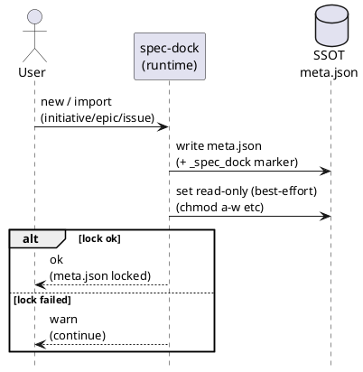

# iss-00012 メタデータ（meta.json等）をコーディングエージェントから保護するガードレールを追加する — 要件定義（WHAT / WHY）

## 目的（ユーザーに見える成果 / To-Be） (必須)
- Codex CLI / Claude Code などのコーディングエージェントが、`spec-dock` が生成する SSOT メタデータ（`spec-dock/initiatives/**/meta.json`）を **うっかり編集しにくい** 状態にする。
- `meta.json` を **tool-managed** として自己記述させ、かつ **read-only（best-effort）** にすることで、ローカル環境での事故率を下げる。

## 背景・現状（As-Is / 調査メモ） (必須)
- 現状の挙動（事実）:
  - spec-dock の SSOT は `spec-dock/initiatives/**/meta.json`（initiative/epic/issue）であり、`sync` が `.agent/index*.json` / `.agent/tree*.json` 等を生成する。
  - `meta.json` は `spec-dock new {initiative,epic,issue}` および `spec-dock import {initiative,epic,issue}` で生成される。
  - `meta.json` は現状「通常の JSON ファイル」であり、エージェント/人間の誤操作で容易に改変できる（ファイル権限のガードが無い）。
- 現状の課題（困っていること）:
  - コーディングエージェントが `meta.json` を編集すると、ツリー整合性が壊れやすく、バグの温床になる（例: `id` 重複、`type` 不整合、親子関係の破綻）。
  - CI 等で「混入を検知してブロック」するだけだと、**編集自体は発生しうる**（今回はローカル予防に集中したい）。
- 再現手順（最小で）:
  1) 任意の node の `meta.json` を開いて `id` / `type` / `parent_id` 等を（誤って）編集する
  2) `spec-dock validate` や `spec-dock sync` の結果が壊れる（例: Duplicate id / 参照不整合 / tree 破綻）
- 観測点（どこを見て確認するか）:
  - CLI: `spec-dock/scripts/spec-dock`（runtime）
  - SSOT: `spec-dock/initiatives/**/meta.json`
  - Derived: `spec-dock/.agent/*`（index/tree/deps など）
  - Log: 標準エラー（warn を含む）
- 実際の観測結果（貼れる範囲で）:
  - Input/Operation: `meta.json` の手編集（エージェント/人間）
  - Output/State: validate/sync の失敗や破綻（構造が SSOT のため影響が大きい）
- 情報源（ヒアリング/調査の根拠）:
  - Issue/チケット: GitHub Issue #12
  - コード:
    - `src/spec_dock/assets/spec_dock/scripts/spec_dock_runtime/app.py`
      - `_write_meta()`（meta.json 生成）
      - `_new_{initiative,epic,issue}()` / `_import_{initiative,epic,issue}()`（生成経路）
    - `src/spec_dock/assets/spec_dock/scripts/spec_dock_runtime/io_json.py`
      - `_write_json()`（JSON write、現状は chmod 等なし）

## 対象ユーザー / 利用シナリオ (任意)
- 主な利用者（ロール）:
  - spec-dock を運用する開発者（人間）
  - spec-dock を使ってタスク実行するコーディングエージェント（Codex CLI / Claude Code 等）
- 代表的なシナリオ:
  - シナリオA: `new issue` 実行後、エージェントが作業ディレクトリ内を探索しても `meta.json` は誤編集されにくい
  - シナリオB: `import` 実行後、取り込まれた `meta.json` が tool-managed と明示され、誤編集が起きにくい

### UML（任意） (任意)

## スコープ（暴走防止のガードレール） (必須)
- MUST（必ずやる）:
  - `spec-dock/initiatives/**/meta.json` に、tool-managed であることを示す自己記述フィールドを含める（JSON コメントの代替）。
    - 最小スキーマ（MUST）:
      - `_spec_dock.managed`: `true`
      - `_spec_dock.do_not_edit`: `true`
      - `_spec_dock.edit_via`: `"spec-dock"`
  - `spec-dock new {initiative,epic,issue}` / `spec-dock import {initiative,epic,issue}` で生成した `meta.json` を **read-only 化**する（best-effort）。
  - read-only 化に失敗しても、コマンド自体は失敗させない（warn して継続）。
- MUST NOT（絶対にやらない／追加しない）:
  - CI / CODEOWNERS / pre-commit 等の「混入防止（マージ防壁）」を、この Issue のスコープで追加しない。
  - 既存ノードの `meta.json` を一括変更（マイグレーション）しない。
- OUT OF SCOPE:
  - `.agent/*`（derived artifacts）の read-only 化
  - `meta.json` の unlock/lock を行う専用 CLI の追加（必要なら別 Issue）

## 境界（Always / Ask / Never） (必須)
- Always（常に守る）:
  - `meta.json` は SSOT（source of truth）として扱い、**spec-dock が管理**する。
  - `meta.json` の read-only 化は best-effort（OS/FS 差で完全保証しない）。
- Ask（迷ったら相談）:
  - read-only 以外のガード（例: CI、フック、CODEOWNERS）を入れたくなった場合
  - `meta.json` を編集する正規導線（CLI unlock/lock や更新コマンド）を追加したくなった場合
- Never（絶対にしない）:
  - `meta.json` の内容を「人間/エージェントが自由に編集するファイル」として扱う（SSOT 破綻につながるため）

## 非交渉制約（守るべき制約） (必須)
- 依存追加はしない（runtime は stdlib のみ）。
- `meta.json` の `schema_version` は **1 のまま**運用し、本 Issue では後方互換な追加（`_spec_dock` の追加）のみ行う（破壊的変更はしない）。
- 既存ノードの `meta.json` には **後追いで自動適用しない**（新規生成経路のみ）。
- 生成物の形式は JSON として妥当であること（parse 失敗する形式にしない）。

## 前提（Assumptions） (必須)
- 対象環境は POSIX 系（Linux/macOS）を主とするが、Windows 等で read-only を完全保証できない場合は許容する（warn で可視化）。
- `meta.json` を更新する公式コマンドは現状存在しない（新規作成・import が主経路）。

## 判断材料/トレードオフ（Decision / Trade-offs） (任意)
- 論点: 「編集そのものを起こりにくくする」 vs 「編集後に検知して止める」
  - 選択肢A: ローカル予防（自己記述 + read-only）に集中する
    - Pros: シンプル、運用負荷が低い、編集事故の発生確率を下げる
    - Cons: “完全禁止”は不可能、環境差で read-only が効かない場合がある
  - 選択肢B: CI / CODEOWNERS / pre-commit で混入をブロックする（今回は採用しない）
  - 決定: **選択肢A**
  - 理由: 今回は混入防止（マージ防壁）はスコープ外とし、ローカル予防で要件を満たす方針に合意したため

## リスク/懸念（Risks） (任意)
- R-001: read-only が “邪魔” になる（正当な修正が必要な場合）
  - 影響: ユーザーが `meta.json` を編集できず混乱する可能性
  - 対応: best-effort に留め、必要なら手動で解除できる（将来的に unlock/lock コマンドは別 Issue）
- R-002: OS/FS 差で read-only が効かない
  - 影響: 事故を完全には防げない
  - 対応: 自己記述フィールドで注意喚起し、read-only 失敗時は warn を出す

## 受け入れ条件（観測可能な振る舞い） (必須)
- AC-001:
  - Actor/Role: 開発者 / コーディングエージェント
  - Given: `spec-dock new {initiative,epic,issue}` を実行する
  - When: ノードが作成され `meta.json` が生成される
  - Then:
    - `meta.json` が `_spec_dock` 自己記述を含み、以下を満たす:
      - `_spec_dock.managed=true`
      - `_spec_dock.do_not_edit=true`
      - `_spec_dock.edit_via=\"spec-dock\"`
    - read-only 化（best-effort）:
      - POSIX（Linux/macOS 等）で成功した場合: `meta.json` の write bit が外れている（`chmod a-w` 相当）
      - non-POSIX（Windows 等）では「可能な範囲で」read-only 化を試行する
      - 失敗した場合: warn を出して処理継続する（exit code 0）
  - 観測点:
    - File content: `spec-dock/initiatives/**/meta.json`
    - File mode: `ls -l`（POSIX）等（POSIX 成功時）
    - Log: read-only 化に失敗した場合のみ `spec-dock: (warn) ...`（失敗時 / non-POSIX の判定にも使用）
- AC-002:
  - Actor/Role: 開発者
  - Given: `spec-dock import {initiative,epic,issue}` を実行する
  - When: ノードが作成され `meta.json` が生成される
  - Then: AC-001 と同様に、自己記述 + read-only（best-effort）になっている
  - 観測点: AC-001 と同様

### 入力→出力例 (任意)
- EX-001:
  - Input: `spec-dock new issue --epic epic-local-00001 --title "Add feature A"`
  - Output: `spec-dock/initiatives/**/issues/**/meta.json` が `_spec_dock` を含み、read-only になっている（best-effort）

## 例外・エッジケース（仕様として固定） (必須)
- EC-001:
  - 条件: OS/FS 制約により `chmod` 等が失敗する（Permission denied など）
  - 期待:
    - `spec-dock` は失敗せず **exit code 0** で処理継続する
    - 標準エラーに warn を出す（prefix: `spec-dock: (warn)`）
  - 観測点:
    - Exit code
    - 標準エラー出力（warn）
- EC-002:
  - 条件: 既存ノード（既に存在する `meta.json`）を `sync` / `validate` する
  - 期待: 既存 `meta.json` は変更されない（read-only 化も自己記述追記も行わない）
  - 観測点: `git diff` / `ls -l` などで変更が無い

## 用語（ドメイン語彙） (必須)
- TERM-001: SSOT = spec-dock における source of truth（派生ファイルの元となるデータ）
- TERM-002: tool-managed = spec-dock が管理し、人間/エージェントが直接編集すべきでないデータ
- TERM-003: read-only = 書き込み権限を外す（best-effort）
- TERM-004: `_spec_dock` = meta.json 内の namespace（tool-managed/編集禁止の自己記述）

## 未確定事項（TBD / 要確認） (必須)
- なし（本 Issue は自己記述 + read-only の最小セットで進める）

## Definition of Ready（着手可能条件） (必須)
- [ ] 目的が 1〜3行で明確になっている
- [ ] MUST/MUST NOT/OUT OF SCOPE が書けている
- [ ] Always/Ask/Never が書けている
- [ ] AC/EC が観測可能（テスト可能）な形になっている
- [ ] 観測点（UI/HTTP/DB/Log など）または確認方法が明記されている
- [ ] 未確定事項が「質問/選択肢/推奨案/影響範囲」で整理されている

## 完了条件（Definition of Done） (必須)
- すべてのAC/ECが満たされる
- 未確定事項が解消される（残す場合は「残す理由」と「合意」を明記）
- MUST NOT / OUT OF SCOPE を破っていない

## 省略/例外メモ (必須)
- 該当なし
