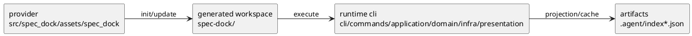

# init-local-00001 Dogfooding Prototype — 設計（HOW / Guardrails）

## アーキテクチャ上の狙い
- provider/source と consumer/generated workspace を分離しつつ、同一 repo 内で dogfooding 可能な運用を成立させる。
- runtime cli の拡張を hybrid layered architecture に沿って進め、責務の逆流を避ける。
- `status lifecycle` と `link lifecycle` を additive migration で導入し、既存 artifact を破壊しない。
- dogfooding から得られる feedback を prototype 改善の入力として継続的に受け取れるようにする。

## 現状と目指す姿
- As-Is:
  - provider 側の source of truth は `src/spec_dock/` にあり、dogfooding workspace は `spec-dock/` に生成されている。
  - GitHub-linked issue の状態は読めるが、local-only issue の close/reopen が product surface に存在しない。
  - authority と projection/cache の境界が実装者にとって明示的ではない。
- To-Be:
  - provider/source と consumer/generated workspace の二層構造を前提とした dogfooding 運用が定着している。
  - `1 issue = 1 authority` を中心に、local-only issue と GitHub-linked issue を一貫した contract で扱える。
  - staged rollout により `status contract -> local mutation -> authority transfer -> remote mutation -> diagnostics` の順で安全に拡張できる。
  - prototype completion までに必要な主要 blocker が設計テーマごとに backlog 管理下へ置かれている。

### UML（任意: high-level context / target-state）

## 対象境界 / 依存
- in scope:
  - runtime status contract
  - local close/reopen
  - link/unlink
  - GitHub close/reopen の安全な導線
  - diagnostics / explainability
  - dogfooding からの継続的な改善入力
- external dependency:
  - GitHub CLI / GitHub issue state
  - local filesystem にある generated workspace
- boundary policy:
  - provider 側の実装正本は `src/spec_dock/` に置く。
  - `spec-dock/` は consumer/generated workspace として扱う。
  - artifact は authority ではなく projection/cache として扱う。
  - 本 initiative の設計境界は prototype completion までとし、本番運用完成までは含めない。

## ガードレール
- 互換性:
  - `status` は既存 field を残し、新しい contract を additive に追加する。
  - existing issue metadata に field がない場合は `missing -> open` を既定にする。
- セキュリティ:
  - remote mutation は `--github` 明示時のみ許可する。
  - repo-safe な preflight を入れ、wrong-repo risk を抑える。
- データ境界:
  - `1 issue = 1 authority`
  - projection/cache と authority を分離する。
  - `unlink = adopt effective`
  - `id/path` は immutable とし、authority transfer で rename しない。
- 品質条件:
  - stale は可視化する。
  - contradiction は validate 対象にする。
  - sync/update は徐々に atomic/recoverable に寄せる。
  - dogfooding で見つかった主要課題は議論メモや backlog として継続投入できる形にする。

## ロールアウト原則
- rollout strategy:
  - staged rollout を採用する。
  - まず read-compatible な contract を追加し、その後 mutate 系 command を足す。
- rollback principle:
  - existing artifact と既存 `status` を維持する。
  - hardening は warning ベースで先行し、必要なときだけ error 化する。
- feature flag principle:
  - remote mutation は implicit にせず opt-in とする。

## 観測性 / NFR 原則
- observability:
  - `authority`, `effective`, `source`, `stale`, `reconcile_action` を観測可能にする。
  - dogfooding で見つかった課題を backlog note / discussion / issue に流せるようにする。
- performance / reliability:
  - partial/stale failure を表現できる result contract を維持する。
  - artifact 書き込みの recoverability を改善対象に含める。
- audit / compliance:
  - 状態遷移の理由と採用された authority を説明可能にする。
  - prototype completion 前の判断と課題追加が文書上追跡可能であること。

## 主要リスク
- R-001:
  - `status` の意味変更を破壊的に行うと既存 consumer と tests を壊す。
- R-002:
  - provider と generated workspace の責務混同により、誤った場所へ修正が入る。

## 関連 ADR
- discussions/001-adr-adopt-dogfooding.md:
  - dogfooding 採用と repo docs 正本化
- discussions/002-adr-agentic-cli-roadmap.md:
  - staged rollout による agentic cli 拡張
  - `1 issue = 1 authority`
  - `unlink = adopt effective`

## 未確定事項
- Q-001:
  - 質問:
    - contradiction validation を Phase 2 で warning に留めるか、Phase 6 で hard error に上げるか。
  - 選択肢:
    - A:
      - Phase 2 から hard error にする。
    - B:
      - 先に warning と可視化を入れ、Phase 6 で hard error を検討する。
  - 推奨案:
    - B。移行安全性を優先する。
  - 影響範囲:
    - 既存 metadata と validate の互換性。
