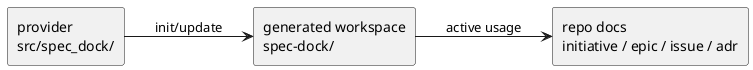
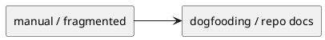
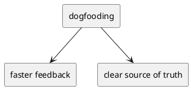
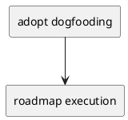
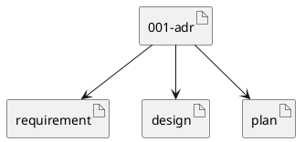

# 001-adr Adopt Dogfooding

## 結論（Decision） (必須)
- **決定**: `spec-dock` 自身の開発運用に `spec-dock` を採用する。
- repo 内文書を正本とし、会話ログや手動コピーペーストは正本にしない。
- provider/source は `src/spec_dock/`、consumer/generated workspace は `spec-dock/` として扱う。
- 本 initiative は `spec-dock` を `spec-dock` で管理する prototype の母体とする。

## 背景（Context） (必須)
- 背景/制約（なぜ今決める必要があるか）:
  - これまでの運用では、仕様・設計・計画・議論が会話と局所的な文書に分散していた。
  - dogfooding を始めるにあたり、どこを正本とするか、どの workspace を編集対象とするかを明示する必要がある。
- 前提:
  - この repo には provider/source と consumer/generated workspace が同居する。
  - 今後の機能追加は、dogfooding 中の運用から得られる friction を直接 backlog 化して進める。

### UML（任意） (任意)

## 選択肢（Options considered） (必須)
- Option A:
  - 概要:
    - 半手動運用を維持する。
  - Pros:
    - 初期コストが小さい。
  - Cons:
    - 正本が曖昧なまま残る。
    - 実運用からの学習が backlog に結びつきにくい。
  - 棄却理由（棄却する場合）:
    - prototype を育てる運用として弱い。
- Option B:
  - 概要:
    - `spec-dock` 自身を `spec-dock` で管理する。
  - Pros:
    - 不足機能を実運用で炙り出せる。
    - repo 内文書を正本に固定できる。
  - Cons:
    - 未整備機能の影響を直接受ける。
  - 棄却理由（棄却する場合）:
    - 該当なし。採用。

### UML（任意） (任意)

## 判断理由（Rationale） (必須)
- dogfooding は、この product に必要な機能と不足点を最短で可視化できる。
- provider/source と consumer/generated workspace が同居する以上、repo docs を正本にしないと判断が散る。
- したがって、`spec-dock` を `spec-dock` で管理する運用を正式採用する。

### UML（任意） (任意)

## 影響（Consequences） (必須)
- Positive（良い点）:
  - 実際の利用フローから不足機能を見つけられる。
  - initiative / epic / issue / ADR を repo 内に固定できる。
- Negative / Debt（悪い点 / 将来負債）:
  - 未整備機能が開発運用へ直接影響する。
- 影響範囲（コード/テスト/運用/データ）:
  - `spec-dock/` workspace
  - runtime roadmap
  - onboarding / AGENTS.md
- 移行/ロールバック:
  - 移行は段階導入とし、必要な機能は roadmap に従って追加する。
  - 問題がある場合も provider/source の正本は `src/spec_dock/` に残る。
- Follow-ups（追加の Epic/Issue/ADR）:
  - `002-adr-agentic-cli-roadmap.md`
  - status lifecycle / link lifecycle の epic 分割

### UML（任意） (任意)

## 参考（References） (任意)
- 関連仕様（requirement/design/plan/report）:
  - ../requirement.md
  - ../design.md
  - ../plan.md
- PR/実装:
  - なし
- 外部資料:
  - なし

### UML（任意） (任意)

