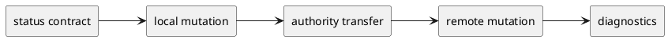
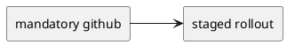
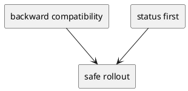
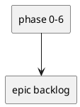
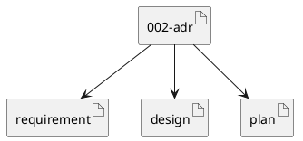

# 002-adr Agentic Cli Roadmap

## 結論（Decision） (必須)
- **決定**: 今後の agentic cli 拡張は、後方互換性を保つ staged rollout で進める。
- `1 issue = 1 authority` を維持する。
- `unlink` の既定動作は `adopt effective` とする。
- 実装順は `status contract -> local close/reopen -> link/unlink -> github close/reopen -> doctor/dry-run/explain -> discovery -> hardening` とする。

## 背景（Context） (必須)
- 背景/制約（なぜ今決める必要があるか）:
  - dogfooding を進めるには、状態変更と authority transfer を安全に扱える product surface が必要である。
  - 現状は GitHub-linked issue と local-only issue の完了導線が揃っていない。
- 前提:
  - local-only issue は残す。
  - GitHub-linked issue は GitHub authority、local-only issue は local authority とする。
  - existing artifact は projection/cache として維持する。

### UML（任意） (任意)

## 選択肢（Options considered） (必須)
- Option A:
  - 概要:
    - GitHub issue を必須化し、local-only issue を実質廃止する。
  - Pros:
    - authority を一本化しやすい。
  - Cons:
    - bootstrap と local-first 運用に不向き。
  - 棄却理由（棄却する場合）:
    - dogfooding と相性が悪い。
- Option B:
  - 概要:
    - local-only issue を残し、staged rollout で status/link lifecycle を追加する。
  - Pros:
    - 後方互換を保ちやすい。
    - 実装順を明確にできる。
  - Cons:
    - authority と migration の設計が必要になる。
  - 棄却理由（棄却する場合）:
    - 該当なし。採用。

### UML（任意） (任意)

## 判断理由（Rationale） (必須)
- `status` の shape を先に決めずに mutate 系 command を増やすと、authority 保存先が曖昧になる。
- local path を先に成立させれば、remote mutation は opt-in の後段に回せる。
- additive migration を守るには、既存 `status` と existing artifact を壊さずに新 contract を足す順番が最も安全である。

### UML（任意） (任意)

## 影響（Consequences） (必須)
- Positive（良い点）:
  - 実装順と guardrail が固定される。
  - local-only issue と GitHub-linked issue を一つのモデルで扱いやすくなる。
- Negative / Debt（悪い点 / 将来負債）:
  - 移行期間は旧 contract と新 contract が併存する。
- 影響範囲（コード/テスト/運用/データ）:
  - runtime command surface
  - metadata / artifact contract
  - validate / sync / diagnostics
- 移行/ロールバック:
  - 既存 `status` は維持する。
  - hardening は後段に回す。
- Follow-ups（追加の Epic/Issue/ADR）:
  - Phase 0-6 の epic 実装
  - repo-safe preflight
  - contradiction validation hardening

### UML（任意） (任意)

## 参考（References） (任意)
- 関連仕様（requirement/design/plan/report）:
  - ../requirement.md
  - ../design.md
  - ../plan.md
- PR/実装:
  - なし
- 外部資料:
  - なし

### UML（任意） (任意)

