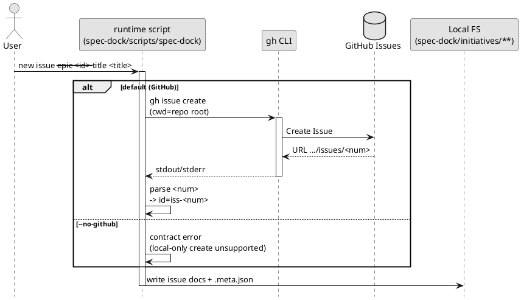

# GitHub 連携（`gh`）の挙動

このドキュメントは、`new {initiative,epic,issue}` が **GitHub Issue を自動作成する**挙動を、コーディングエージェント向けに明確化するためのものです。詳細の正本は `reference_github.md` を参照してください。

## 結論

- `new {initiative,epic,issue}` はデフォルトで **`gh issue create` を実行**します。
- `initiative / epic / issue` では GitHub linkage が mandatory です。
- create 系では spec-dock は owner/repo を自前で解決しません。
  - `gh` を導入先リポジトリの root で実行し、対象リポジトリの解決は **`gh` に委譲**します。
- `--github-issue <n>` は既存 current-repo Issue にリンクするだけで、GitHub Issue は新規作成しません。
- 新規ノード作成時は、spec-dock が対応する issue docs と `.meta.json` を管理対象として書き込みます。
- `--no-github` は compatibility option として残っていますが、`initiative / epic / issue` では contract error で reject されます。
- `--slug` は **安全な文字のみ**許可します（空白や `!` などは禁止）
  - 許可: Unicode の英数字 + `-` `_` `.`
  - 追加制約: **小文字のみ**（大文字を含む場合はエラー）

## 1) 実行されるコマンド（概要）

### 1.1 Issue 作成（デフォルト）

```bash
gh issue create --title "<title>" --body "<body>"
```

- `--title` と `--body` を必ず渡す（非対話）
- `cwd` は導入先リポジトリ root
- `gh` の出力に含まれる URL から `/issues/<num>` を抽出し、`<num>` を ID に使用
  - 例: GitHub #123 → `iss-00123` / `epic-00123` / `init-00123`

### 1.2 既存 Issue への紐づけ（作成しない）

`--github-issue 123` を渡すと、GitHub Issue は作成せず、番号だけ紐づけます。

```bash
./spec-dock/scripts/spec-dock new issue --epic 124 --title "..." --github-issue 123
```

### 1.3 Issue ブランチ checkout（`active set <github_issue_number>`）

GitHub Issue 番号から **ブランチ作成/checkout → active 設定 → sync** まで一括で行えます。

```bash
./spec-dock/scripts/spec-dock active set 123
```

内部的に実行されるコマンド（概要）:

```bash
gh issue develop 123 --name work/iss-00123 --checkout
```

注意:
- 安全のため、**未コミット/未追跡の変更がある場合はエラーで中断**します（作業を保護するため）
- 仕様ツリー内に `github.issue_number == 123` のノードが存在しない場合もエラーになります

補足:
- `active set iss-00123` のようにノードIDで直接指定した場合でも、そのノードが GitHub Issue に紐づいていれば checkout します（initiative/epic/issue 共通）。
- ブランチ名は日本語タイトルを使わず、`work/<node-id>` 形式を使います（例: `work/iss-00123`, `work/epic-00123`, `work/init-00123`）。
- `work/<node-id>` が linked branch として既にある場合は、その既存 branch の checkout を優先します。
- linked branch に `work/<node-id>` が無い場合は、`gh issue develop --name work/<node-id> --checkout` で作成します。
- linked branch に legacy ブランチ（例: `gh-issue-123`）しか無い場合は、その legacy を一時 checkout してノードを解決し、最終的に `work/<node-id>` へ移行します（legacy が複数ある場合は非決定的なためエラー）。
- `gh issue develop --name ...` が使えない環境では、互換のため `gh issue checkout` / `gh issue develop --checkout` にフォールバックします。
- 互換フォールバックが使われた場合、最終的な branch 名は `gh` の挙動に依存するため `work/<node-id>` と一致しない可能性があります。

## 2) 「どのリポジトリに作るか」はどう決まるか

create 系では spec-dock は `--repo owner/repo` を指定しません。  
そのため、**対象リポジトリは `gh` の解釈で決まります**。

代表的な解決材料（`gh` 側）:
- カレントディレクトリが Git リポジトリであること
- `git remote` の URL（GitHub の owner/repo を含む）
- 必要に応じて `GH_REPO` 等の環境変数
- `gh auth`（認証）状態と権限

## 3) `--no-github`（互換フラグ / reject）

現行 contract では、`initiative / epic / issue` の local-only create はサポートされません。

- `--no-github` は compatibility option として残っていますが、成功経路にはなりません
- GitHub Issue を新規作成したくない場合は、current repo の既存 Issue を `--github-issue <n>` で指定してください
- `gh` 未導入 / 未認証 / repo 未解決の状態では create は失敗します。先に GitHub linkage を整えてください

## 4) PlantUML（内部処理のイメージ）



## 5) よくある失敗

- `gh` が無い / 未認証: `new` がエラー → `gh` と current repo の GitHub linkage を先に整える
- local-only で作りたい: `--no-github` は reject → current repo の既存 Issue に `--github-issue <n>` でリンクする
- GitHub リポジトリとして解決できない / 権限がない: `gh issue create` が失敗 → `git remote` / `gh auth` を確認
