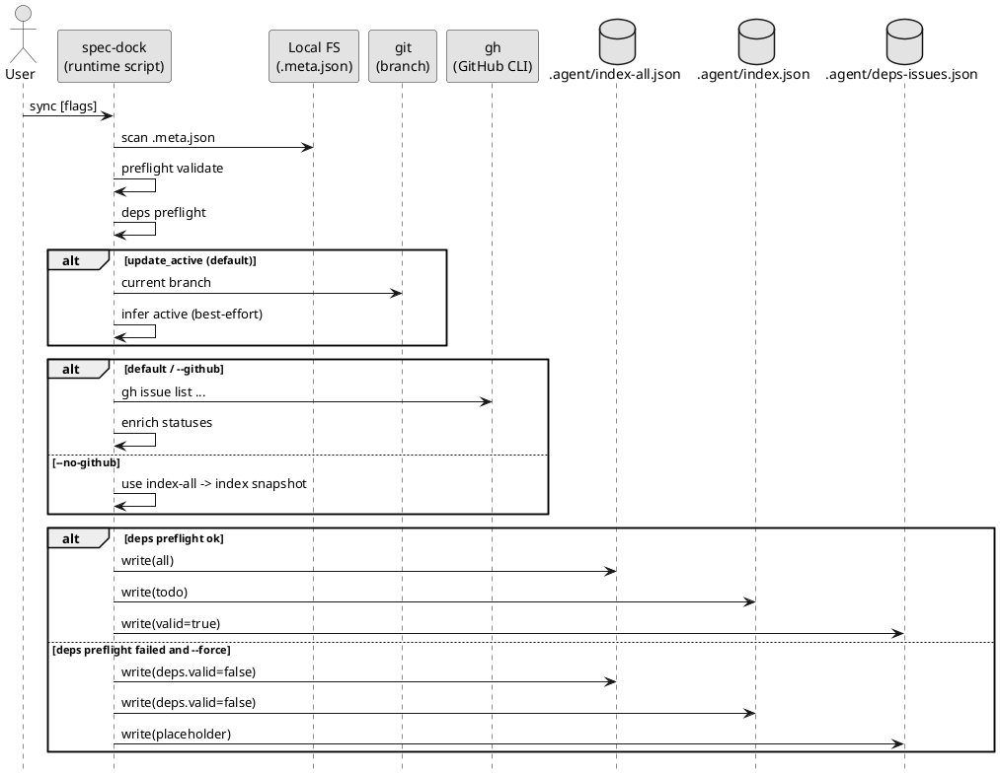

# 状態集計参照（reference: sync）

対象コマンド:

```bash
./spec-dock/scripts/spec-dock sync [--github] [--gh-limit N] [--no-update-active] [--force]
./spec-dock/scripts/spec-dock sync --no-github [--no-update-active] [--force]
```

関連:
- 入口: [README.md](README.md)
- 総合: [guide.md](guide.md)
- deps: [reference_deps.md](reference_deps.md)

## 1. 結論（v2の生成物）

`sync` はローカル SSOT（`spec-dock/initiatives/**/.meta.json`）を走査し、v2 の観測点を生成します（git 管理しない）。
`meta.json`（レガシー名）はサポート対象外で、検出時はエラー停止します（`.meta.json` へ手動移行してください）。
依存更新は `./spec-dock/scripts/spec-dock deps add/remove/check` を使い、実行後は `./spec-dock/scripts/spec-dock validate` と `./spec-dock/scripts/spec-dock sync` で GitHub live state を含めて整合を確認します。

`.agent/`（機械向け）:
- `spec-dock/.agent/index-all.json`（全ノード）
- `spec-dock/.agent/tree-all.json`（全ノードのツリー）
- `spec-dock/.agent/index.json`（todo projection）
- `spec-dock/.agent/tree.json`（todo projection のツリー）
- `spec-dock/.agent/deps-issues.json`（todo issue-only 依存グラフ）

agent-facing の読取契約:
- entry: `spec-dock/.agent/active.json`
- normal default working set: `spec-dock/.agent/index.json` + `spec-dock/.agent/deps-issues.json`
- escalation only: `spec-dock/.agent/index-all.json`（full-history / audit / search）
- `spec-dock/active/context-pack.md` はこの順序を案内する human guidance であり、唯一正本ではない

`spec-dock/` 直下（人間向け）:
- `spec-dock/tree-all.puml`（Readyボード, all）
- `spec-dock/tree.puml`（Readyボード, todo）
- `spec-dock/deps-issues.puml`（todo issue-only 依存図）
- `spec-dock/dashboard.md`（todo要約）

legacy v1 生成物（廃止）:
- `spec-dock/.agent/deps.json`
- `spec-dock/.agent/deps.puml`
- `spec-dock/.agent/deps.todo.puml`

上記3つは `sync` 実行時に常に削除されます（stale防止）。

## 2. 全体 / TODO 投影（all / todo projection）

`*-all.json` は全件を保持します。

`index.json` / `tree.json` は todo projection です:
- `status==done` の issue を除外
- todo issue が0件の epic / initiative を除外（empty枝除外）
- `deps.issue_edges` は端点が todo issue の edge のみ保持
- `index.json` と `tree.json` のノード集合は一致

## 3. 依存情報の埋め込み（deps）

`index-*.json` / `tree-*.json` のトップレベルには `deps` が入り、少なくとも以下を持ちます:
- `valid: bool`
- `error: string | null`
- `issue_edges: [{from,to,kind?}]`
- `edge_direction: "depends_on (dependent -> prerequisite)"`

issueノードには `deps`（`ready`, `depends_on`, `blockers_top`）を統合します。

## 4. `sync --force`（deps preflight失敗時）

deps 構造エラー（未解決参照 / self / cycle / descendant依存 / schema不正など）がある場合:
- 通常 `sync`: 失敗（非0）
- `sync --force`: index/tree 更新は継続し、`deps_preflight_failed` を warn + warnings に出力

`--force` で deps 無効化時の挙動:
- `index-*.json` / `tree-*.json`: `deps.valid=false`, `deps.issue_edges=[]`, `deps.error` を設定
- issueノードの `deps` は `null`（未計算扱い）
- `spec-dock/.agent/deps-issues.json` は placeholder（`deps.valid=false`, `nodes={}`, `edges=[]`）で上書き
- `spec-dock/deps-issues.puml`, `spec-dock/tree*.puml`, `spec-dock/dashboard.md` も placeholder内容で上書き
- `--force` はデバッグ/リカバリ用途のため、depsの成否に関わらず active auto-update を無効化（`--no-update-active` 相当）

削除ではなく上書きにすることで、stale 参照を防ぎます。
`--force` 実行後に active を更新したい場合は、`./spec-dock/scripts/spec-dock active set <target>` を使って明示更新してください。

## 5. GitHub の既定動作（GitHub default）と `--no-github`

`sync` / `sync --github`:
- `gh issue list` の読み取り結果で issue status を enrich（OPEN/CLOSED -> open/done）
- `--github` は後方互換 flag で、flag なしの `sync` と同じ GitHub enabled mode です

`sync --no-github`:
- GitHubへアクセスしない
- 既存スナップショットを使う場合は `index-all.json` を優先し、無ければ `index.json` へ fallback
- どちらも無ければ issue status は `unknown`
- この `index-all.json -> index.json` は issue status 補完のための runtime 内部 fallback であり、agent-facing の通常読取順ではない

`--github` と `--no-github` は同時に指定できません。

## 6. アクティブ更新（active update）

デフォルトでは、ブランチ名から active を best-effort 推定して更新します。

- `sync --no-update-active`: active を更新しない
- `sync --force`: `--no-update-active` 相当として扱い、active auto-update を行わない
- `main` / `develop` など手がかりが無いブランチでは active は維持
- active が未設定でも entry contract は `spec-dock/.agent/active.json` のままで、`spec-dock/active/context-pack.md` は placeholder README への human guidance を表示する

## 7. 矢印方向（JSONとPlantUML）

- JSON（`deps.issue_edges`）: `depends_on` 方向（`dependent -> prerequisite`）
- `deps-issues.puml`: blocks 表示（`prerequisite -> dependent`）

同じ依存を、機械向けと可視化向けで向きを分けて表現しています。

## 8. 処理フロー（PlantUML）



## 9. ハードカットオーバー検証契約（hard cutover verification contract / iss-00062 / iss-00063）

- hard cutover entry 条件は `docs 更新 + checked-in data manual fix + validate/sync evidence` の 3 点を満たしたときだけ充足です。
- `validate` / `sync` evidence は少なくとも次を issue-level `report.md` に記録します:
  - 実行コマンド
  - exit code
  - pass/fail
  - 結果要約（targeted regression summary を含む）
- `iss-00062`（T3 integration）が entry 条件と hard cutover judgment の primary owner、`iss-00063`（T4 closure）はその judgment を前提に final parity / close review を行う follow-up owner です。
- この split は no fallback / no dual-read / `.meta.json` only contract を維持するための固定境界であり、T4 側で entry 条件や verdict を再定義しません。
