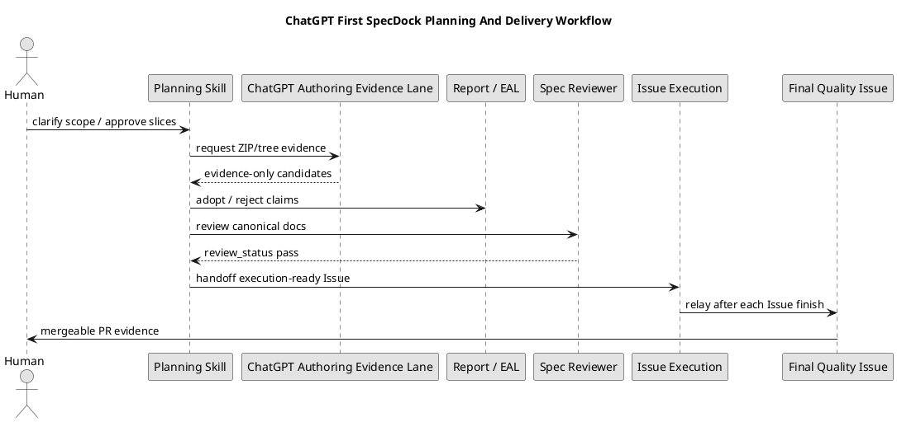

# オーサリングパックワークフロー（ChatGPT authoring pack）

この文書は、ChatGPT / Oracle を SpecDock planning workflow の evidence lane として使うための利用者向けガイドです。
Operational entrypoint は `.agents/skills/spec-dock-chatgpt-authoring/SKILL.md` であり、この文書は runtime command、authority boundary、human gate、relay delivery policy の参照面です。

## 基本原則

- ChatGPT / Oracle output は常に `authority: evidence_only` として扱う。
- ChatGPT-first planning route は、非自明な Initiative / Epic / Issue planning の正規 evidence-production route である。`spec-dock-chatgpt-authoring` は evidence lane であり、canonical adoption は各 planning skill が所有する。
- ZIP / tree / staged evidence / candidate validation / approval check の `pass` は command-local validation pass であり、canonical adoption、fresh reviewer pass、execution-ready、PR-ready、merge-ready ではない。
- canonical `requirement.md` / `design.md` / `plan.md` / `report.md` の single-writer は main orchestrator である。
- ChatGPT evidence を採用する場合、main orchestrator が Evidence Adoption Ledger に採否を記録し、canonical docsへ再記述し、fresh reviewer gate を通す。
- reviewed Epic plan が final delivery Issue を明示している場合だけ、中間 Issue は個別 PR を作らず、relay-style に `issue finish` から次 Issue の `issue start` へ進む。それ以外の multi-Issue Epic では通常の PR Delivery / Merge Preparation Gate に従う。
- Capacity limit、queued tab、retryable timeout、recoverable browser/backend failure は wait / retry / recover で扱う。manual planning skill は hard / unrecoverable failure と user-approved emergency backup evidence がある場合だけ使う。

## 正規計画と送達の全体像（ChatGPT First SpecDock Planning And Delivery Workflow）



この図の `ChatGPT Authoring Evidence Lane` は reviewer pass や execution-ready を付与しない。採用判断、canonical rewrite、fresh reviewer gate、Issue relay、final quality / PR delivery は SpecDock 側 workflow が所有する。

## 証跡モード（Evidence mode）

### `github-synced`

`github-synced` は repo-aware ChatGPT invocation の default mode です。
GitHub に push 済みの branch / commit / source manifest を ChatGPT が参照できる前提で使います。

この mode でも ChatGPT output は正本ではありません。GitHub 上に存在する状態を参照した evidence として扱い、canonical adoption には EAL、canonical rewrite、fresh reviewer gate が必要です。

### `local-context`

`local-context` は、GitHub sync を使えない、または使わない理由がある場合に明示的に選ぶ lower-authority evidence mode です。
local docs、diff summary、tree snapshot、artifact、必要な source snippets を prompt pack に含めて ChatGPT に渡します。

`local-context` output は `github_sync: not_verified` 相当の evidence です。採用時は、同期できなかった理由、提供した local context、採用した claim、捨てた claim を `report.md` に残します。

## 上流から下流への使い分け

### イニシアチブ計画での利用（Initiative planning）

Initiative では、要件定義書を起点に Initiative の design / plan と Epic candidate を生成できます。
Epic candidate は提案であり、Epic node creation の前に human approval gate を必ず通します。

推奨 flow:

1. Initiative requirement を人間と main orchestrator で固定する。必要なら ChatGPT evidence を使ってもよい。
2. `authoring preflight github-sync` で GitHub 同期状態を確認する。
3. `authoring pack prepare --mode initiative` で prompt pack を作る。
4. `authoring backend invoke` で backend command を使って ChatGPT / Oracle を呼び出す。
5. `authoring pack review` と `authoring pack stage` で ZIP / tree output を evidence として点検・配置する。
6. `authoring validate initiative-epic-candidates` で candidate schema を検査する。
7. 人間が Epic candidate を承認した後、main orchestrator が Epic node を作成し、canonical docs / report に採用判断を記録する。

### エピック計画での利用（Epic planning）

Epic では、Epic requirement / design / plan と、配下 Issue の draft requirement / draft design / draft plan をまとめて生成できます。
Issue candidate / draft は提案であり、Issue node creation の前に human approval gate を通します。

推奨 flow:

1. Epic requirement を固定する。必要に応じて Epic design / plan まで ChatGPT に一括生成させる。
2. `authoring pack prepare --mode epic` で prompt pack を作る。
3. ChatGPT output は ZIP / tree で受け取り、`authoring pack review` と `authoring pack stage` で evidence として扱う。
4. `authoring validate epic-issue-candidates` で Issue candidate を検査する。
5. 人間が Issue slice を承認した後、Issue node を作成する。
6. 作成した各 Issue の draft docs は Issue-local artifacts として扱い、Issue planning 時に正式版へ採用する。

### イシュー計画での利用（Issue planning）

Issue には大きく二つの入口があります。

- Epic planning で作られた draft requirement / draft design / draft plan を正式版に整える。
- 単体 Issue として、人間との議論や既存 artifact から requirement / design / plan を作る。

Epic draft から採用する場合も、`authoring validate issue-draft-adoption` は draft adoption input の形式や一致を確認するだけです。`pass` は reviewer pass ではありません。
main orchestrator が採用部分を canonical docs に再記述し、fresh `spec-reviewer` pass を通してから execution-ready とします。

## 対応済み authoring commands（Supported authoring commands）

現在 supported として案内できる command は次の通りです。

```bash
./spec-dock/scripts/spec-dock authoring preflight github-sync
./spec-dock/scripts/spec-dock authoring pack prepare
./spec-dock/scripts/spec-dock authoring backend invoke
./spec-dock/scripts/spec-dock authoring pack review
./spec-dock/scripts/spec-dock authoring pack stage
./spec-dock/scripts/spec-dock authoring validate initiative-epic-candidates
./spec-dock/scripts/spec-dock authoring validate epic-issue-candidates
./spec-dock/scripts/spec-dock authoring validate issue-draft-adoption
./spec-dock/scripts/spec-dock authoring validate selected-skeleton-fill
./spec-dock/scripts/spec-dock authoring approval check
```

## 延期・未対応の操作（Deferred / unsupported operations）

次の操作はこの runtime lane の supported command として案内しません。

- ChatGPT output から canonical docs を自動採用する。
- ZIP から Issue node を自動作成する。
- reviewer pass、authorized profile、execution-ready、PR-ready、merge-ready を自動設定する。

このため、`authoring adopt`、`authoring create-issues-from-zip`、`authoring mark-reviewer-pass`、`authoring set-authorized-profile`、`authoring issue-execution-ready`、`authoring pr-ready` のような操作名は、現在の supported usage example として使いません。

## 人間ゲートとリレー型 delivery（Human gate / relay delivery）

Epic / Issue の node creation 前には、candidate list を人間が確認し、明示的に承認します。
承認済み Issue の draft adoption では、commands が evidence の review / stage / validation を支援できます。ただし canonical adoption は自動化せず、main orchestrator の EAL disposition、canonical rewrite、fresh `spec-reviewer` pass を必ず通します。

Epic execution で reviewed Epic plan が final delivery Issue を定義している場合、中間 Issue は個別 PR を作りません。
`issue finish` で次 Issue に進み、最後の delivery Issue で Epic 全体の品質ゲート、レビュー指摘修正、手動確認、push、mergeable PR 作成をまとめて行います。
reviewed Epic plan がこの集約を定義していない場合は、通常の PR Delivery / Merge Preparation Gate に従います。
