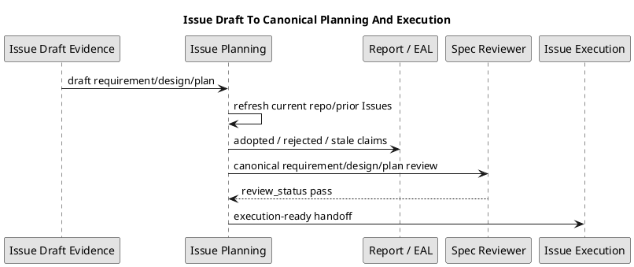

# 課題ワークフロー（workflow: issue / Agent-Native TDD）

Issue は実装の最小単位です。
Operational entrypoint / first-read spine は issue planning / issue execution skill が所有します。
この workflow は、active issue を起点にした仕様固定マイクロバッチTDD（Spec-Locked Micro-Batch TDD）、step review loop、docs impact、最終品質ゲート（final quality gate）の detail / reference semantics を保持します。
この workflow の品質ゲートは scope 固有の additive gate であり、`phase_*.md` の shared minimum gate 通過を前提とします。

対応 leaf skill（operational entrypoints）:
- `.agents/skills/spec-dock-issue-planning/SKILL.md`: Issue の requirement / design / plan planning、review readiness、未解決 gap の spec authoring / clarification への戻し。
- `.agents/skills/spec-dock-issue-execution/SKILL.md`: 承認済み planning artifacts を前提にした implementation、report evidence、issue execution gate / completion gate。

関連:
- 総合: [guide.md](guide.md)
- 仕様書作成: [workflow_spec_authoring.md](workflow_spec_authoring.md)
- Epic: [workflow_epic.md](workflow_epic.md)
- ADR: [workflow_adr.md](workflow_adr.md)
- GitHub 連携: [reference_github.md](reference_github.md)
- 共通 phase playbook: [phase_requirement.md](phase_requirement.md), [phase_design.md](phase_design.md), [phase_plan.md](phase_plan.md)
- Issue plan playbook: [phase_plan_issue.md](phase_plan_issue.md)
- Issue plan authoring contract: [authoring/issue-plan.md](authoring/issue-plan.md)
- Decision routing: [authoring/decision-routing.md](authoring/decision-routing.md)
- Scope layering: [authoring/scope-layering.md](authoring/scope-layering.md)
- Hard cutover reference: [reference_hard_cutover.md](reference_hard_cutover.md)
- ChatGPT authoring evidence lane: [workflow_chatgpt_authoring_pack.md](workflow_chatgpt_authoring_pack.md)
- Prompt pack / ZIP reference: [authoring/chatgpt-pack.md](authoring/chatgpt-pack.md)

## 作成と issue start

```bash
# 主要ライフサイクル（primary lifecycle）
./spec-dock/scripts/spec-dock new issue --epic <epic-id> --title "..."
./spec-dock/scripts/spec-dock new issue --create-github-issue --epic <epic-id> --title "..."

./spec-dock/scripts/spec-dock import issue <num|#num|canonical-url> --title "..." [--epic <epic-id>]

./spec-dock/scripts/spec-dock issue start <issue-id|github-issue-number|url>
./spec-dock/scripts/spec-dock issue start <issue-id|github-issue-number|url> -f
./spec-dock/scripts/spec-dock issue finish

# 手動 / 復旧専用（manual / recovery only）
./spec-dock/scripts/spec-dock active set <issue-id|github-issue-number|url>
./spec-dock/scripts/spec-dock active set --id <issue-id>
./spec-dock/scripts/spec-dock active set --github-issue <n>
./spec-dock/scripts/spec-dock active set <issue-id|github-issue-number|url> --checkout
./spec-dock/scripts/spec-dock active show

./spec-dock/scripts/spec-dock deps check <target>
./spec-dock/scripts/spec-dock deps add --from <node-id> --to <node-id>
./spec-dock/scripts/spec-dock deps remove --from <node-id> --to <node-id>
```

- `import issue` で `--epic` を省略した場合は current active から親 epic を解決する
- `import issue` の canonical URL は current repo と照合され、current repo を検証できない場合も含めて foreign GitHub issue URL は fail-closed で reject される
- `--allow-foreign-url` は compatibility flag として残るが、cross-repo node identity import の成功経路にはならない
- canonical でない URL-like target は受け付けない
- 通常の issue execution 開始は `./spec-dock/scripts/spec-dock issue start <target>` を primary path とし、active set と checkout を一操作で完了する
- `issue start` は unfinished active issue branch 上で別 issue を始めようとした場合だけ default で block する。`main` / `master` / `develop` / `staging` や non-issue branch からの start は block しない
- `./spec-dock/scripts/spec-dock issue start <target> -f` / `--force` は unfinished active issue guard だけを bypass する。依存未解決や他の readiness check は bypass しない
- 通常の issue 完了は `./spec-dock/scripts/spec-dock issue finish` を primary path とする。active issue の linked GitHub issue を close し、already-closed も success として扱い、その確認後に active state を解除する
- `issue finish` は active manifest の issue entry が `authority=approved` で、`promotion_record` が fresh で、exact grant `issue_finish` を持つ場合だけ lifecycle closure を進める。active issue が `issue start` / `active set` による synthetic active selection（`promotion_decision=runtime_active_selection`）の場合、`issue finish` は finish 前 local gate 通過後に `issue_finish_lifecycle_transition` を内部永続化し、この finish-only transition によって `issue_finish` gate を満たし得る。この内部 transition は `issue finish` 専用であり、synthetic active selection を一般的な lifecycle approval にするものではない
- `issue finish` は local delegated artifact gate と Evidence Adoption Ledger gate を transition 永続化前、かつ GitHub close / active clear 前に fail-closed で検査する。`authority=proposed`、authority metadata 欠落、wildcard/broad grant、stale `approved_hash` / `reviewer_target_hash` mismatch、`source_revision` / `approved_revision` mismatch、未承認 delegated artifact、または unresolved / stale Evidence Adoption Ledger entry は GitHub close や active clear の前に block する
- `issue_finish_lifecycle_transition` の永続化は GitHub close / active clear より前に行う。transition 永続化に失敗した場合は元の active selection を復元し、GitHub close は試みない。transition 永続化後に GitHub close / view が失敗した場合、active issue は finish-ready state のまま残す。復旧は `./spec-dock/scripts/spec-dock active show` で状態を確認してから `./spec-dock/scripts/spec-dock issue finish` を再実行する。直接の `active.json` 編集は標準 recovery path にしない
- `./spec-dock/scripts/spec-dock close <target>` は明示 target の GitHub issue close / already-closed 確認と post-mutation sync のための保守コマンドであり、issue lifecycle completion、active clear、`issue_finish` grant、または delivery completion を意味しない。lifecycle closure の authority gate は `issue finish` が担う
- `issue finish` は delivery completion に対する lifecycle closure 専用です。linked GitHub issue を close または already-closed と確認し、active state を解除してから lifecycle-owned post-mutation sync を実行しますが、commit、push、PR、merge、validate、test、review、final delivery completion は保証しません。delivery completion には tests、reviews、reports、PR/merge workflow の別証跡が必要です。
- delivery completion の判定と required evidence の記録・確認は、`issue finish` の前に、active issue が set され対象 issue を確認できる状態で `spec-dock/active/issue/report.md` に対して行う
- `issue finish` 後は active issue が clear されていてよく、active issue が残っていること自体を `complete` condition にしてはならない
- `issue finish` の lifecycle-owned post-mutation sync は、active clear 後に post-mutation no-migrate / no branch-active-update policy で実行される。この自動 sync は、issue branch 上で finish した場合でも、直前に clear した active issue を復元してはならない
- manual `./spec-dock/scripts/spec-dock sync` は lifecycle-owned post-mutation sync とは別物である。人が後から issue branch 上で manual `sync` を実行した場合は、manual sync 側の policy が変わらない限り branch-derived active restoration の caveat が残り得る
- Final commit gates 後、`issue finish` の前に `github-pr-merge-preparer` を使い、PR 送達ゲート（PR Delivery Gate）とマージ準備ゲート（Merge Preparation Gate）を通す
- PR 送達ゲート（PR Delivery Gate）は、PR URL、selected base、base-resolution source、base-resolution conflict / handling、draft / ready decision、head branch、head SHA、issue linkage、existing PR reuse / new PR creation decision を `report.md` に記録してから通す
- マージ準備ゲート（Merge Preparation Gate）は、PR open state、monitor status、latest monitored head SHA、fix loop count / history、required check status、non-required check status and waiver evidence、blocking review status、merge conflict / visible merge blocker status、unresolved review-thread limitation status、unresolved blockers、final merge-prepared decision を `report.md` に記録してから通す
- Reviewed Epic plan が final quality Issue へ PR delivery を意図的に集約する場合、中間 Issue は PR 送達ゲート / マージ準備ゲートの代わりに deferred PR delivery gate を通す。deferred PR delivery gate は、defer 先 final quality Issue id、defer 先 dependency edge、per-Issue PR を作らない理由、final PR delivery まで merge-prepared を主張しないこと、final quality Issue の PR Delivery Gate / Merge Preparation Gate が残っていること、reviewer が確認した local completion / issue finish 条件を `report.md` に記録する。deferred PR delivery gate は final quality Issue には使えず、final quality Issue は通常の PR 送達ゲート / マージ準備ゲートを通す
- failed、timeout、blocked、latest head SHA と一致しない monitor result、未解決 blocker、または unresolved review-thread limitation の未 waiver は、complete ではなく `blocked` または `未完了` として扱う
- `issue finish` は lifecycle-only command であり、PR URL、PR 作成、PR open state、merge readiness、checks、review、review-thread resolution、merge conflict absence、final delivery、または merge-prepared 状態を保証しない
- `active set` は manual / recovery command として維持する。unfinished active issue guard の対象外であり、必要時だけ direct に使う
- `active set` のデフォルトは no-checkout。ブランチ移動が必要な場合だけ `--checkout`
- `active set` は `<target>` の後方互換を維持しつつ、`--id` / `--github-issue` の explicit form も使える
- 依存未解決なら `active set` は通常失敗する。確認は `./spec-dock/scripts/spec-dock deps check <target>`
- 例外で進める場合だけ `./spec-dock/scripts/spec-dock active set <target> --force`
- 依存 edge の追加/削除は metadata を直編集せず `./spec-dock/scripts/spec-dock deps add --from <node-id> --to <node-id>` / `./spec-dock/scripts/spec-dock deps remove --from <node-id> --to <node-id>` を使う。`<node-id>` は existing initiative / epic / issue node を受け付け、source node 直下 `.meta.json.depends_on` の direct edge だけを add/remove する。inherited / compiled-only edge は remove 対象ではない

## 仕様 authoring（spec authoring）

- Issue planning は `.agents/skills/spec-dock-issue-planning/SKILL.md` を operational entrypoint にし、仕様作成の phase promotion detail は `workflow_spec_authoring.md`、未解決の曖昧さは `spec-dock-clarification` skill と `workflow_clarification.md` の bridge/reference に route する
- ChatGPT-first Issue planning は `./spec-dock/scripts/spec-dock-chatgpt` の `planning create` → `review planning` → 必要時だけ `planning revise` → fresh PASS → exact Human decision → `planning apply` を normal route とする。archive-candidate が default、git-bound は canonical三文書を対象にする明示 fallback であり、両 mode の PASS は流用しない
- Issue Planning の外部実行依存は `PATH` 解決した `oracle` だけである。未導入または非対応の Oracle は personal wrapper、arbitrary backend、API fallback を使わず block する。formal run は GitHub で exact current repository / branch / HEAD を確認し、default branch、attachment、prompt context、memoryをfallbackにしない
- Planner と Semantic Revision は canonical `requirement.md` / `design.md` / `plan.md` および runtime-selected の exactly-one onboarding companion を収めた exactly-one authoring ZIP を返す。companion は subordinate evidence であり、第四のcanonical specificationではない。Reviewer は closed JSON を返す
- `planning revise --request <path>` は request と同じ directory の exact `planning-review-result.json` のみを使う。P0/P1 findingだけが revision triggerであり、P2/P3-only observationではCandidateを変更しない
- Candidate／Reviewはrepository外のevidence-only outputであり、PASS Reviewとexact Human approvalへbindしたapplyが`ready/adoption_published`を返すまでcanonical adoptionまたはexecution-readyではない。PR、Issue finish、mergeは別workflowである
- Issue PlanningのPrompt本文はcompactなgoal／role／authority／exact repository・named branch・HEAD／fallback禁止／output contractを持ち、operation固有の詳細はprovider-owned operation resourcesから選択する。`--provided-context-path`はrepeatableなopaque reference inputであり、入力内容をruntimeがscan／再構成／hash／archiveしてinstruction authorityへ昇格させない。旧`--context-manifest`は使用しない
- Issue Planningでは、successful submission後のsemantic revisionだけがBlue continuityを引き継ぎ、CandidateごとのReviewはfresh Red bindingを使う。pre-submit failureはprofileで許可されたbounded new executionだけ、post-submit failureは同一sessionの回収だけとし、normal failure時にattachment／model／branch／backend／output contractを変更しない
- archive と git-bound の Review/apply は `planning create` が生成した exact same Candidate を必須とし、git-bound は `--candidate <candidate.zip> --reviewed-head <sha>` を渡す。exact Human approval の前に managed write は行わない
- `spec-dock-issue-planning-manual` は human-approved emergency backup であり、hard / unrecoverable ChatGPT route failure と recovery attempts、explicit approval の evidence がある場合だけ使う
- Decision-only Issue は execution-ready ではない。Issue-local な軽量判断なら issue requirement / design / plan / report に閉じてよいが、複数 Issue の責務境界、分解、依存方向、shared workflow policy に影響する判断は Epic へ戻し、複数 Epic または投資判断に影響する判断は Initiative へ戻す。Issue は parent envelope を再定義せず、上位 scope の目的・責務境界・handoff boundary は [authoring/scope-layering.md](authoring/scope-layering.md) と親 docs を参照する。長期 architecture decision は ADR 候補にし、判断に必要な情報が足りない場合は clarification へ戻す。具体例と good / bad routing pattern は [authoring/decision-routing.md](authoring/decision-routing.md) を参照する
- Handoff-ready と execution-ready は別状態である。Handoff-ready は Epic execution / Issue planning が引き継いでよい状態であり、Issue-local draft evidence や skip evidence が揃っていても実装開始を許可しない。Execution-ready は canonical `requirement.md` / `design.md` / `plan.md`、fresh `spec-reviewer` pass、executable plan、required verification、delegation contract、reviewer focus、Grade Specialist Evidence Gate / fallback evidence、未解決でない `report.md` ledger が揃った状態である
- Epic planning から ChatGPT-generated draft requirement / draft design / draft plan を受け取った場合、Issue planning は `authoring validate issue-draft-adoption` を draft adoption evidence として使える。ただし validation `pass` は reviewer pass ではなく、canonical docs への採用完了でも execution-ready でもない
- Option 3+ では、Epic planning が Issue-local draft path index を作り、Issue planning が各 Issue の実装直前に current repository state、prior completed Issues、dependency state、unresolved report ledgers を確認して draft claims を採否する。Issue-local drift は Issue planning で修正し、Epic boundary / Issue order / scope allocation を変える drift は Epic planning repair または clarification へ戻す。


- Issue execution は `.agents/skills/spec-dock-issue-execution/SKILL.md` を operational entrypoint にし、承認済み / reviewer-pass 済みの `requirement.md` / `design.md` / `plan.md` と executable `plan.md` を前提に、この workflow の execution gate / report gate / completion gate detail に route する
- active issue 配下の `requirement.md` / `design.md` / `plan.md` を埋める
- Requirement / design / plan の phase promotion は `workflow_spec_authoring.md` の detail / reference semantics に従い、各 artifact ごとに fresh `spec-reviewer` の `review_status: pass` まで次 phase へ進めない
- Requirement / design / plan に未解決の仕様 gap、用語衝突、責務境界の曖昧さがある場合は、実装で仮定せず [workflow_clarification.md](workflow_clarification.md) へ戻す。
- `artifacts/`: `new artifact <type> --issue <issue-id> --title "..."` で、この issue の `artifacts/` 配下に timestamp-prefixed original を作成する。current catalog は `blank` / `adr` / `disc` / `research` / `interview` / `decision-candidate` / `pr-repair-batch` / `draft-requirement` / `draft-design` / `draft-plan`。runtime が filename / path を生成し、caller は stdout の `path=...` を正本として扱う。標準形は `<ts>-<kind>-<slug>.md`、same-second collision fallback は `<ts>-<nn>-<kind>-<slug>.md`。既存 `discussions/` 配下の artifact は legacy/grandfathered として保持する。詳細 contract は [reference_naming.md](reference_naming.md) を参照する
- Issue-local `draft-design` / `draft-plan` の evidence primitive は `./spec-dock/scripts/spec-dock new artifact draft-design --issue <issue-id>` / `./spec-dock/scripts/spec-dock new artifact draft-plan --issue <issue-id>` である。actor / specialist / depth 別 draft command は導入しない。`assurance compose` は canonical `design.md` / `plan.md` の compose 専用であり、draft artifact 作成や raw artifact の canonical authority 化には使わない
- artifact docs は思考、知識、未確定情報を外部化する作業面であり、それ自体を正本へ昇格させない。Epic planning から渡された Issue-local `draft-design` / `draft-plan` も evidence として採否判断し、採用・部分採用・棄却・stale / blocked の disposition を canonical docs または `report.md` ledger に反映してから `design.md` / `plan.md` の正本根拠にする。`blank` / `interview` / `research` / `disc` の文脈をもとに、必要な `adr` を新規作成し、`requirement.md` / `design.md` / `plan.md` へ織り込む。
- `note` は新規作成 catalog から retired。既存 `note` artifact は grandfathered として壊さない。
- templates は完成形ではなく、書き始めるための最小 scaffold に留める。仕様書作成の説明や判断基準は docs / skills を参照する
- Issue の `templates/issue/design.md` と `templates/issue/plan.md` は compose 前 placeholder であり、手動 authoring の開始点ではない。実体の `design.md` / `plan.md` 本文は、`.assurance.json` の `authorized_profile` に従って `templates/issue-profiles/{lite,standard,strict,critical}/{design,plan}.md` から `assurance compose` が合成する
- Issue templates（共通 `requirement.md` と profile 別 `design.md` / `plan.md`）の title 行、見出し、小見出しは日本語を優先する。日本語だけで正確性が落ちる場合だけ、日本語表現の後に括弧内英語名称を併記する
- 日本語運用では、Issue planning / execution / readiness 中に作成・更新する docs、`report.md`、artifacts の本文を日本語ファーストにする。commands、paths、IDs、role 名、error text は正確性を優先して原文のまま保持してよい
- agent は、プロジェクトの目的、作業内容、人間の理解しやすさ、エージェントの実行可能性に合わせて、項目を追加・削除・統合・並べ替えてよい
- 不要な placeholder や該当しない節は削ってよいが、正確性、検証可能性、人間の理解、エージェントの実行に必要な情報は削らない
- テンプレートにない図表や節も、[phase_design.md](phase_design.md) の `optional diagram catalog` から必要なものを選んで追加してよい。カタログ外でも、構造・境界・責務・流れ・状態・依存を人間が理解しやすくする情報なら追加してよい
- shared な書き方は `phase_*.md`、Issue plan の哲学と review checklist は `phase_plan_issue.md`、Issue plan の field semantics と executable step schema は [authoring/issue-plan.md](authoring/issue-plan.md)、Issue 固有の lifecycle / execution / reviewer / completion policy detail はこの workflow を参照する
- Issue design では [phase_design.md](phase_design.md) に従い、必要な粒度で依存関係分析、`Module Dependency Diagram`、Linux `tree` style の `ディレクトリ / ファイル変更計画` を置く
- Issue plan では [phase_plan_issue.md](phase_plan_issue.md) に従い、design の依存関係分析、module dependency diagram、directory / file change plan から step 順を導く

## ワークフロー単位の named role 許可（workflow-scoped authorization）

- ユーザーが SpecDock workflow の利用を依頼した場合、その依頼自体を、SpecDock が定義する named sub-agent / reviewer を workflow に従って利用する明示的な許可として扱う（"A user request to use a SpecDock workflow is explicit workflow-scoped authorization to use the SpecDock-defined named sub-agents and reviewers required by that workflow."）。
- active repo/worktree、active SpecDock scope、current session、documented role responsibility の範囲内では、SpecDock-defined named role の起動前に role ごと・phase ごとの追加承認を求めない（"Do not ask for additional per-role or per-phase permission before invoking SpecDock-defined named roles within the active repo/worktree, active SpecDock scope, current session, and documented role responsibility."）。
- 追加確認は scope expansion、破壊的操作、外部公開、credential を伴う外部 mutation、private external system、SpecDock workflow 外の role 利用に限る（"Ask the user only for scope expansion, destructive actions, external publishing, credentialed external mutation, private external systems, or roles outside the SpecDock workflow."）。
- この許可は「ユーザーがすべてを許可した」ことを意味しない。範囲は current repo/worktree、active SpecDock scope、current session、SpecDock-defined named roles、documented role responsibility に限る。
- canonical docs の single-writer authority は main orchestrator に残る。Sub-agent / reviewer output は evidence であり、canonical docs への採用は main orchestrator が行う。
- fresh `spec-reviewer` / `code-reviewer` / `qa-reviewer` pass は required gate であり、bounded SpecDock workflow scope 内の追加許可待ちを理由に省略してはならない。
- user request と host policy が衝突し、required named role が利用できない場合は `denied` または `unavailable` として記録し、required reviewer gate を満たしたことにしてはならない。
- read-only specialist authorization と scope-local artifact direct-write authorization は分離する。Sub-agent authoring output は proposal-only に限定しないが、canonical `requirement.md` / `design.md` / `plan.md` / `report.md` は main orchestrator single-writer authority である。
- scope-local artifact direct-write authorization は task-local に記録する。最低限、target node、role、source artifacts、allowed artifact path rule、forbidden canonical/implementation paths、post-run diff guard、report ledger destination を含める。
- unguarded workspace-write、static broad profile edit、Desktop-only fallback は adoption-ready delegated output に数えない。System architect / implementation planner の static adapters は guarded workspace-write で scope-local `artifacts/` Markdown draft を作成できるが、workspace-write は hard path allow-list ではなく canonical target write の許可でもない。diff guard pass と report ledger entry まで adoption-ineligible とする。

## 報告判断台帳ライフサイクル（report decision ledger lifecycle）
- `report.md` は observed evidence ledger に加えて仕様解釈 / 判断台帳（`Spec Interpretation / Decision Ledger`）を持つ。ここには実装中・文書更新中に発生した material な仕様解釈、判断、plan 逸脱、tradeoff、open question、promotion / follow-up だけを記録し、shell transcript、worker raw note、private reasoning、secret、逐次作業ログは置かない。
- material な判断がない小規模 issue でも ledger section は省略しない。`No material interpretation changes.` と `No decision entries.` を残し、reviewer は diff / plan / report から本当に material decision がない場合だけ有効な no-decision 表現として扱う。
- delegated worker は material decision を発見したら `Ledger Note` を返す。最低限、source-agent、topic、trigger、ambiguity / constraint、observed facts、options considered、proposed decision、rationale、affected files、affected tests、risk if wrong、rollback or revisit、confidence、needs orchestrator decision を含める。material decision がない場合は `No material implementation decisions beyond the approved plan.` と明示する。
- worker の `proposed decision` は accepted decision ではない。orchestrator は source docs、diff、tests、reviewer output と照合し、canonical `report.md` entry として `Status`、`Disposition`、evidence、follow-up / promotion を整えて統合する。
- ledger entry の `Status` は `open` / `resolved` / `superseded`、`Disposition` は `applied` / `rejected` / `promoted_to_design` / `promoted_to_adr` / `promoted_to_plan` / `converted_to_followup` / `deferred` / `no_action` / `superseded` を使う。issue completion 前に `Status=open` を残してはならない。
- `Disposition=promoted_to_design` / `promoted_to_adr` / `promoted_to_plan` は昇格先 artifact と evidence を持つ。`converted_to_followup` は follow-up issue / discussion / ADR candidate、`deferred` は scope 外理由、blocking でない根拠、revisit 条件、`superseded` は置換先 entry ID、`no_action` は issue-local で追加対応不要な理由を持つ。
- 将来の実装者が守るべき durable decision は `report.md` だけに閉じ込めない。`design.md`、ADR、plan amendment、follow-up issue のいずれかへ昇格するか、issue-local な判断として閉じる理由を evidence 付きで残す。
- legacy issue report に ledger がないことは遡及 blocker にしない。必要な場合だけ source と confidence を明示して backfill し、新規 / 更新中 issue にはこの lifecycle を適用する。
## 実行 contract

- 実装前に `requirement.md` / `design.md` / `plan.md` の整合を確認し、特に `design.md` の依存関係分析 / module dependency diagram / directory tree と `plan.md` の step 順が一致していることを確認して、plan upfront approval を得る
- 実装前に `workflow_spec_authoring.md` の requirement / design / plan gate がすべて pass し、`Spec Authoring Gate` evidence が `report.md` に残っていることを確認する
- 実装開始前は、`workflow status` / `guidance issue-execution` の `report evidence gate` も pass していることを確認する。fresh `spec-reviewer` pass、Spec Authoring Gate、Evidence Adoption Ledger、Delegated Draft Evidence、Grade Specialist Evidence Gate、Reviewer Gate Status、未解決でない EAL が `report.md` に残っていない場合は、execution-ready として扱わない。Lite は specialist / fallback evidence を必須化しないが、fresh review と not applicable / skip reason の記録は必要とする
- Missing canonical docs、missing / stale reviewer pass、missing Issue readiness contract、missing executable plan structure、missing delegation contract、missing verification、missing reviewer focus、unresolved blocking / stale report entries、raw artifact authority、decision-only execution-ready、Grade Specialist Evidence Gate / required fallback evidence 欠落は structural blocker として扱う。構造は存在するが十分性に疑義がある acceptance criteria、test strategy、採用理由、設計妥当性、日本語ファースト wording は reviewer finding として扱い、実行者が semantic reviewer を置き換えない
- implementation start 前または実装中に unresolved spec gap を見つけた場合は、`workflow_clarification.md` / authoring phase へ戻し、`report.md` に handoff readiness evidence または blocked reason と next action を残す。Issue planning / execution split や PR / finish lifecycle の再設計で gap を吸収しない。
- `plan.md` は planned executable workflow contract / command queue である。実行者は step を上から順に読み、各 step の behavior goal、planned obligation、Red または代替 evidence、Green verification、refactor guardrail、closure requirements、report evidence destination、amendment trigger に従って作業する
- `report.md` は observed evidence ledger である。実際の Red / Green / Refactor 結果、verification result、discovered tests、closure delta、reviewer verdict、commit/no-op evidence は `report.md` に記録し、`plan.md` を実行結果の正本にしない
- bug / performance / unknown failure issue では、approved executable `plan.md` の step として diagnosis の feedback loop を先に固定する。実装開始の前提は変えず、承認済み `requirement.md` / `design.md` / `plan.md` と reviewer-pass evidence がない状態で reproduction や修正実装へ進んではならない
- diagnosis step は、reproduction または再現不能時の代替観測条件、ranked hypotheses、targeted instrumentation、expected signal、instrumentation cleanup、regression evidence、`report.md` の evidence destination を明記する。仮説なしの修正、計測を残したままの完了、または regression evidence なしの成功報告は step closure にならない
- Sub-agent-created artifact draft は lightweight provenance として `created_by_role`、`scope_id`、`source_paths`、`intended_targets`、`adoption_status: unreviewed`、`reflected_to: []`、`diff_guard_result`、adoption ledger note を持つ。task manifest / profile / probe / session hash fields は標準 delegated draft evidence として要求しない。
- Delegated authoring output は `new artifact <type>` など runtime-owned creation で作成し、返された `path=...` を正本として本文を更新する。post-run diff guard は生成された filename が artifact rules（標準 `<ts>-<kind>-<slug>.md`、same-second collision fallback `<ts>-<nn>-<kind>-<slug>.md`）に一致することを確認する。新規 delegated run は per-agent directory、run/task directory、global draft store、`artifacts/delegated-authoring/` を作らない。
- Historical `iss-00126` delegated-authoring manifest/Profile/probe/session artifacts は grandfathered evidence である。current standard が scope-local artifact drafts を使うことだけを理由に削除、rename、validation failure 化しない。
- `report.md` の仕様解釈 / 判断台帳（`Spec Interpretation / Decision Ledger`）は実行中判断の audit trail であり、planned contract の正本ではない。report に durable decision が残った場合は、completion 前に canonical artifact への promotion、follow-up 化、または issue-local disposition の evidence を残す
- `Parent Agent Invariant`: normal execution における親 Codex は inspect / plan / delegate / verify / integrate / report を担当する orchestration owner であり、code / runtime / tests / scaffold behavior / templates / shipped docs / skills / workflow text の直接実装者ではない
- 親 Codex が直接作成・更新してよいのは、`report.md`、handoff note、phase evidence など run-local orchestration metadata に限定する。shipped docs / templates / skills / workflow text、runtime-facing scaffold、コード、テスト、runtime behavior は delegated worker work として扱う
- 各 implementation step は `step closure contract`（step クロージャ契約）→ implementation delegation decision → bounded implementation batch → verification → refactor/tidy → report draft update → step reviewer gate → fix → re-review → step / milestone result approval → clean確認 の順で進める。commit は `lite` では必須の途中ゲートにせず、`standard` / `strict` / `critical` ではマイルストーン完了ゲートの `commit候補` として扱う
- 完成版 `plan.md` には仕様固定クロージャ索引（`Spec-Locked Closure Index`）を置き、各 behavior slice の仕様ロックと closure owner step を実装前に固定する
- 仕様固定クロージャ索引（`Spec-Locked Closure Index`）は Issue 全体のテストケース一覧や詳細なテスト実装指示ではなく、観測可能な入力・状態・locked expectation・防ぐ欠陥クラス・required/evidence level を固定する coverage ledger である
- step クロージャ契約（`step closure contract`）は closure index の `id` を参照し、どの検証契約をその step で満たせば close してよいかを追えるようにする
- 実装開始前に required closure id が step-local close condition と verification command または evidence path へ追跡できることを確認する。field semantics、card schema、risk-calibrated obligation coverage の詳細は [authoring/issue-plan.md](authoring/issue-plan.md) を参照する
- required closure row、`locked expectation`、`required`、`spec link` を変更する場合は plan amendment と re-review を先に通す
- `pre-implementation evidence` は expected red / characterization pass / test sensitivity evidence のいずれかを記録し、failing-first を完全要求できない場合もテストが欠陥を検出できる根拠を残す
- plan field semantics、`具体テストケース一覧` の card schema、docs-only / inspect-only / manual-required の書き方は [authoring/issue-plan.md](authoring/issue-plan.md) を参照する。この workflow は lifecycle、実行順、reviewer gate、completion policy を所有し、field-level template manual を再定義しない
- `Implementation Delegation Gate` は各 implementation step の開始前に必ず置く。runtime / CLI / infra / code / tests / scaffold behavior は `dev-coder`、shipped docs / templates / skills / workflow text は `doc-writer` を primary delegated worker とし、step が複数 layer / module / package にまたがる、runtime / CLI / infra / templates / shipped scaffold / shared docs に影響する、既存 pattern 調査や影響範囲分析が必要、integration test / migration / backward compatibility / filesystem / GitHub / active state に関わる、または独立 worker scope に分割できる大きさの場合は、適切なサブエージェント利用を必須にする
- delegated worker handoff には、`delegated role`、`scope`、`source of truth`、`allowed changes`、`forbidden changes`、`required verification`、`stop conditions`、`output required` を必ず含める。複数 layer / package / shipped asset にまたがる step は、親 Codex が direct implementation せず、allowed paths と dependency boundary を明記して委任する
- `delegated` の場合は delegated role、scope、source of truth、allowed changes、forbidden changes、required verification、stop conditions、output required、worker summary、changed files、verification result、unresolved risks、取り込み結果を `report.md` に残す
- delegated worker の output には `Ledger Note` または `No material implementation decisions beyond the approved plan.` を含める。orchestrator は worker note を accepted decision として扱わず、report decision ledger へ採用 / 却下 / 保留 / 昇格するかを明示する
- 親 Codex が例外的に直接実装する場合は `Parent Implementation Exception` として、delegation 不可理由、user approval、allowed files、allowed operation、rollback plan、post-change verification、reviewer gate を事前に記録する。`approved-local-execution` はこの exception record を満たす場合だけ使用し、小さい変更、機械的変更、親が修正を知っていることを理由にした無記録 direct implementation として扱ってはならない
- reviewer gate state は `passed` / `failed` / `unavailable` / `denied` / `waived` / `provisional` のいずれかで記録する。required reviewer gate を満たすのは fresh `passed` だけである
- `waived` はユーザーの明示的 risk acceptance が `report.md` にある場合だけ許可する。waiver は reviewer pass ではなく、delegation / reviewer gate の unavailable / denied を degraded success にしない。waiver 後に親 Codex が直接実装する場合も、別途 `Parent Implementation Exception` の user approval、allowed files、allowed operation、rollback plan、post-change verification、reviewer gate を必要とする
- サブエージェント機能が利用できない、拒否された、または host policy と衝突する場合、required delegation / reviewer gate は `unavailable` / `denied` として blocked / 未完了に分類する。unavailable / denied / host conflict は degraded success でも、親 Codex の direct implementation 自動承認でもない。degraded mode は status/context gathering や追加 verification に限定し、reviewer gate、implementation readiness、最終品質ゲート（final quality gate）を満たさない
- `approved-local-execution` と degraded mode は implementation delegation decision の例外 / availability 証跡であり、fresh reviewer pass、Step Result Approval、normal implementation success の代替ではない。reviewer `failed`、`unavailable`、`denied`、`waived`、`provisional` はいずれも required reviewer gate pass として扱わない。
- `bounded implementation batch` は step の scope、allowed files、forbidden scope に収まる最小実装単位とする
- `refactor/tidy` は verification 後の bounded decision point とし、plan では詳細 task を事前確定しない
- step 順は `design.md` の依存関係分析、module dependency diagram、directory / file change plan を根拠に、upstream / prerequisite から downstream へ組む
- cleanup が既知で大きい場合は `bounded implementation batch` / design / 別 step へ切り出す
- review / QA / spec の各 stage gate は `pass` まで回す
- reviewer gate mapping は step の変更種別で決める。code / runtime / tests / scaffold behavior を含む step は per-step `code-reviewer` pass を必要とし、docs-only / template-only / skill-text-only step は `spec-reviewer` docs/spec alignment pass を必要とする。両方を含む場合は step を分割するか、両方の reviewer focus を明記して必要な gate を通す
- implementation delegation は reviewer gate の代替ではない。`dev-coder` / `doc-writer` などの worker が実作業した場合でも、step diff は上記 mapping に従う reviewer pass を得る
- reviewer が `fail` を返した場合、親 Codex は原則として自分で direct fix せず、指摘を bounded delegated follow-up として同じ delegated worker または適切な worker に再委任する。親 Codex が直接修正するには `Parent Implementation Exception` を別途満たす
- テンプレート内の `001` / `002` などの連番例示は上限ではない。仕様目的に応じて必要な数だけ項目、行、振る舞い、ゲートを追加・削除し、`XXX` placeholder がある場合は実IDへ置換するか削除する
- `standard` / `strict` / `critical` では、マイルストーン完了ゲートの `commit候補` を使って、issue 全体を巨大な 1 commit にまとめずレビュー可能な履歴を残す。review scope と commit scope は一致してもよいが、常に完全一致するとは定義しない
- commit 後は `git status --short` などで、次のマイルストーンへ持ち越す意図しない staged / unstaged 変更がないことを確認する
- step または milestone closure unit の close state は `committed` または `approved-no-op` のどちらかにする。`approved-no-op` は差分が本当にない場合だけ許可し、小さい変更、あとでまとめる、report だけ、時間不足を理由にしてはならない
- `approved-no-op` には対象 step、変更不要の理由、確認した契約やファイル、差分なし確認コマンド、review 不要または read-only 確認の根拠を `report.md` に残す
- `1 step = 1 つの観測可能な振る舞い` を原則にし、各 step に観測用の 1 本のコマンドを置く
- `plan.md` では agent-native TDD cycle を step / block / behavior slice に埋め込み、配置ルールは `phase_plan_issue.md` に従う
- `Step / Milestone Result Approval` は、現在の implementation step または milestone について、closure contract、required verification、fresh reviewer `passed`、commit候補または approved-no-op、post-commit clean check がすべて閉じた状態を指す。次 step / milestone の implementation / review / commit を始めてよいのは、この Result Approval が得られた後だけである。
- 最終品質ゲート（final quality gate）の前に `S90 docs 影響解決 / docs 更新（S90 docs impact resolution / docs refresh）` を必ず置く。docs impact `none` は、docs / templates / README / workflow / skill / migration notes を確認し、更新不要の根拠と `spec-reviewer` の docs/spec alignment 結果を `report.md` に記録した場合だけ使える。更新が必要な場合は `doc-writer` が対象 docs を更新し、`spec-reviewer` が docs と requirement / design / plan の整合を確認する
- `S99 最終品質ゲート（S99 final quality gate）` は独立 step にし、final review だけで step review を代替してはならない
- `S99 最終品質ゲート（S99 final quality gate）` では、`qa-reviewer` がテスト十分性と issue 全体を達成する integration test の要否を確認し、必要な integration test が不足していれば追加を要求する
- `S99 最終品質ゲート（S99 final quality gate）` では、`code-reviewer` が issue 全体の統合 diff を俯瞰し、構造、責務、回帰リスク、保守性を確認する
- `S99 最終品質ゲート（S99 final quality gate）` では、`spec-reviewer` が requirement / design / plan / report、実装、テスト、docs が一致し、全要件を満たしているか確認する
- `qa-reviewer` / issue-wide `code-reviewer` / `spec-reviewer` のいずれかが `fail` の場合は修正し、該当 reviewer を再実行して `pass` まで回す
- 三者すべての final gate が `pass` した後、final report ledger に各 step の closure、三者 final review、final commit scope、post-commit external evidence の記録先を更新し、final commit を作成する。final commit の hash と clean check は final commit 後にしか確定できないため、committed `report.md` 内の必須記録ではなく、最終応答、PR、issue comment などの external delivery evidence として残す
- final commit は final report ledger と delivery evidence boundary を閉じるための commit であり、過去の implementation step / milestone で未 commit の実装差分をまとめる catch-up implementation commit ではない。未 commit の差分が残っている場合は、該当 milestone の commit候補または approved-no-op が未完了であり、final commit で救済してはならない。
- route だけ、または manual `active set` だけでは Issue work は完了しない。通常の開始/終了は `issue start` / `issue finish` を使う
- `complete` と報告してよいのは、`issue finish` 前に active issue が set されその対象 issue を確認できる状態で、`spec-dock/active/issue/requirement.md` / `design.md` / `plan.md` / `report.md` の 4 点が issue 固有の内容になっており、`spec-dock/active/issue/report.md` に required `sync` / `validate` の成功または pass 結果、required review の approval または pass 結果を示すコマンド証跡、各 implementation step の `Implementation Delegation Gate` が `delegated` / `approved-local-execution` / degraded mode のいずれかで閉じている証跡、required closure id が step 契約クロージャ（`Step Contract Closure`）/ テスト契約クロージャ（`Test Contract Closure`）/ クロージャ coverage（`Closure Coverage`）で pass または approved-no-op として閉じている証跡、全 implementation step / milestone closure unit が `committed` または正当な `approved-no-op` で閉じている証跡、final docs impact resolved、final `qa-reviewer` pass、issue-wide `code-reviewer` pass、final `spec-reviewer` pass、PR 送達ゲート（PR Delivery Gate）とマージ準備ゲート（Merge Preparation Gate）の pass evidence、または reviewed Epic plan に基づく中間 Issue の deferred PR delivery gate evidence、final report ledger が記録済みであり、final commit 済みと意図しない staged / unstaged 変更なしの post-commit external delivery evidence を確認している場合のみである。ここで degraded mode は implementation delegation availability の証跡に限られ、required reviewer gate pass ではない
- 4 点の issue docs のいずれかが untouched、template、placeholder、または実質未記入の状態で残る場合は `未完了` であり、成功報告をしてはならない
- required step（`sync` / `validate` / `required review` / implementation delegation decision / per-step reviewer gate / step / milestone result approval / final QA review / issue-wide code review / final spec review / final commit）のいずれかを未実施のままにした場合、または実行しても成功、pass、approval、`delegated`、`approved-local-execution`、`committed`、または正当な `approved-no-op` に到達しなかった場合、理由の記録は必須だが `complete` にはならない。`blocked` または `未完了` に分類し、`report.md` に reason と next action を残す
- `blocked` は、外部依存、権限不足、サービス停止、その他の環境条件によって次の required action を進められない状態を指す
- `blocked` の場合は `report.md` に reason と next action を残す。blocker type と impact は該当する場合に併記する
- `未完了` は、product work、docs 更新、または証跡が不足している状態を指す。product gap は環境 blocker がない限り `blocked` ではなく `未完了` として扱う
- `未完了` の場合も `report.md` に reason と next action を残す
- 完了条件を満たせない状態は `blocked` または `未完了` として扱い、成功報告をしてはならない

## 報告証跡（report）

- `spec-dock/active/issue/report.md` に、実行コマンド、結果、判断、想定外と対処を残す
- scope-local artifact direct-write authoring を使う場合は、created artifact path、created_by_role、scope_id、source_paths、intended_targets、`adoption_status: unreviewed`、`reflected_to: []`、diff_guard_result、canonical Evidence Adoption Ledger disposition を `report.md` に記録する。採否の正本は scope-local `report.md` の Evidence Adoption Ledger とする
- 仕様解釈 / 判断台帳（`Spec Interpretation / Decision Ledger`）に material な仕様解釈、判断、逸脱、tradeoff、open question、promotion / follow-up を残す。material decision がない場合は `No material interpretation changes.` と `No decision entries.` を残す
- ledger entry は `Status`、`Type`、`Options Considered`、`Disposition`、evidence、必要な follow-up / promotion を持つ。`Status=open` は completion blocker とし、`Disposition` に必要な evidence がない entry、report-only durable decision、根拠のない `no_action` / `deferred` / `superseded` は reviewer finding として扱う
- step 契約クロージャ（`Step Contract Closure`）に step、closure id、close condition、evidence、result を残す
- テスト契約クロージャ（`Test Contract Closure`）に required closure id、step、evidence level、pre-implementation evidence、verification command、result を残す
- クロージャ coverage（`Closure Coverage`）に各 required closure id と verification evidence の対応を残す
- クロージャ差分（`Closure Delta`）に追加・削除・変更・未実装 row と re-review 要否を残す
- `Implementation Delegation Gate` に step、decision、required reason、delegated role、scope、source of truth、allowed changes、forbidden changes、required verification、stop conditions、output required、result を残す。`delegated` の場合は worker summary、changed files、verification result、unresolved risks、parent integration decision を追跡する
- `Parent Implementation Exception` に delegation 不可理由、user approval、allowed files、allowed operation、rollback plan、post-change verification、reviewer gate、unavailable / denied / host conflict / waiver の扱い、risk acceptance の有無を残す。exception record がない親 Codex direct implementation は required gate 未完了として扱う
- `Workflow-Scoped Authorization` に authorization source、repo/worktree、active issue、session、named roles、boundary、expires / invalidation condition、`denied` / `unavailable` / host conflict の場合の reason と next action を残す。authorization source は SpecDock workflow 利用依頼でよく、active repo/worktree、active SpecDock scope、current session、SpecDock-defined named roles、documented role responsibility の範囲内では role ごと・phase ごとの追加承認を求める根拠にしてはならない
- `Reviewer Gate Status` に gate name、reviewer role、freshness、state（`passed` / `failed` / `unavailable` / `denied` / `waived` / `provisional`）、risk acceptance の有無、promotion / completion decision を残す
- `Milestone / Commit Candidate Gate` に milestone / step、reviewer verdict、commit候補 / commit scope、closure state、commit evidence または approved-no-op、post-commit clean check を残す。reviewer は reviewer gate mapping に従って `code-reviewer` または `spec-reviewer` を記録する
- PR 送達ゲート（`PR Delivery Gate`）に PR URL、selected base、base-resolution source、base-resolution conflict / handling、draft / ready decision、head branch、head SHA、issue linkage、existing PR reuse / new PR creation decision を残す
- マージ準備ゲート（`Merge Preparation Gate`）に PR open state、monitor status、latest monitored head SHA、fix loop count / history、required check status、non-required check status and waiver evidence、blocking review status、merge conflict / visible merge blocker status、unresolved review-thread limitation status、unresolved blockers、final merge-prepared decision を残す
- `Final QA Gate` に `qa-reviewer` verdict、テスト十分性、integration test 追加要否、追加した場合の evidence を残す
- `Final Code Review Gate` に issue-wide `code-reviewer` verdict、統合 diff scope、修正と re-review の evidence を残す
- `Final Spec Review Gate` に `spec-reviewer` verdict、requirement / design / plan / report / docs 整合、docs 修正が必要な場合の `doc-writer` 更新 evidence を残す
- `Final Commit` に final report ledger、final commit scope、post-commit external evidence の記録先を残す。final commit hash と final clean worktree check は final commit 後の external delivery evidence として残し、committed `report.md` 内の自己参照証跡にしない
- `complete` 判定に必要な required `sync` / `validate` の成功または pass 結果、required review の approval または pass 結果、PR 送達ゲート（PR Delivery Gate）とマージ準備ゲート（Merge Preparation Gate）の pass evidence を、`issue finish` 前に active issue を確認できる状態の report に残す
- `issue finish` 後は active issue が clear されていてよく、`complete` 判定は active state の残存ではなく `issue finish` 前に記録・確認した report evidence で行う
- `complete` 判定に必要な required closure id は、report の step 契約クロージャ（`Step Contract Closure`）/ テスト契約クロージャ（`Test Contract Closure`）/ クロージャ coverage（`Closure Coverage`）で pass または approved-no-op として閉じている必要がある
- `complete` 判定に必要な各 implementation step は、report の `Implementation Delegation Gate` で `delegated`、`approved-local-execution`、または degraded mode として閉じている必要がある。delegation evidence が不足している場合は `未完了` として扱う
- required step（`sync` / `validate` / `required review` / implementation delegation decision / per-step reviewer gate / step / milestone result approval / final QA review / issue-wide code review / final spec review / final commit）を未実施にした場合、または実行しても成功、pass、approval、`delegated`、`approved-local-execution`、`committed`、または正当な `approved-no-op` に到達しなかった場合は reason と next action を残し、`blocked` / `未完了` に分類する
- `blocked` / `未完了` の場合は reason と next action を残し、環境 blocker と product gap を混在させない
- `blocked` では blocker type と impact を該当する範囲で残す
- stage gate ごとの reviewer verdict / test結果 / 修正内容 / no-op 理由もここに残す
- 実際に行った refactor は事前計画ではなくここに残す
- 依存関係の想定と違った実装順や refactor が必要になった場合もここに残す
- 1 セッション 1 追記でよいが、未来の自分と reviewer が追える粒度を保つ

## 任意の hard cutover pattern（optional hard cutover pattern）

標準 Issue workflow は hard cutover を前提にしない。fallback 廃止、checked-in data の手動境界修正、entry judgment、T3/T4 owner split などを伴う issue だけ、[reference_hard_cutover.md](reference_hard_cutover.md) の optional pattern を plan / report contract へ明示的に取り込む。

## 品質ゲート

- requirement:
  - AC が観測可能
  - EC が書かれている
  - 対象外が明記されている
- design:
  - 変更点が列挙されている
  - テスト戦略がある
  - 互換 / 移行 / ロールバックが必要なら整理されている
- plan:
  - step が behavior slice と review loop を回せる粒度
  - 仕様固定クロージャ索引（`Spec-Locked Closure Index`）が AC / EC / design / bug / risk と behavior slice を結び、詳細なテスト実装指示になっていない
  - step クロージャ契約（step closure contract）/ verification evidence path / bounded implementation batch が追える
  - every required closure id が behavior slice、step-local close condition、verification evidence、report closure へ追跡できる
  - docs 影響 / docs 更新 step（docs impact / docs refresh）が必要なら入っている
  - 最終品質ゲート（final quality gate）が独立し、`qa-reviewer`、issue-wide `code-reviewer`、`spec-reviewer` の三者 review を含んでいる
  - 各 implementation step に Implementation Delegation Gate があり、条件付き必須 trigger に該当する step では適切なサブエージェント利用または degraded mode evidence がある
  - 各 implementation step に step reviewer gate があり、`standard` / `strict` / `critical` の主要マイルストーンには commit候補 gate、差分なしの場合には no-op gate がある
- report:
  - `complete` を報告する場合に必要な required `sync` / `validate` の成功または pass 結果と required review の approval または pass 結果を示すコマンド証跡が、`issue finish` 前に active issue を確認できる状態の report に残っている
  - required closure id が step 契約クロージャ（`Step Contract Closure`）/ テスト契約クロージャ（`Test Contract Closure`）/ クロージャ coverage（`Closure Coverage`）で閉じている
  - required row の削除、locked expectation 変更、required 変更、spec link 意味変更がある場合は re-review 証跡が残っている
  - 全 implementation step の `delegated` / `approved-local-execution` / degraded mode evidence と、step / milestone closure unit の `committed` または正当な `approved-no-op` evidence が残っている
  - final docs impact resolved、`qa-reviewer` pass、issue-wide `code-reviewer` pass、`spec-reviewer` pass、final report ledger、final commit scope、post-commit external evidence の記録先が残っている
  - required step を未実施にした場合、または実行しても成功、pass、approval、`committed`、または正当な `approved-no-op` に到達しなかった場合は `blocked` / `未完了` の reason と next action が残っている
  - `blocked` の blocker type / impact が必要な場合に残っている
  - 想定外と対処が追える

## 仕上げ

```bash
./spec-dock/scripts/spec-dock validate
./spec-dock/scripts/spec-dock sync
```
