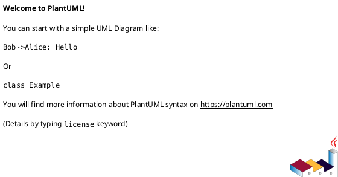

# init-00079 minor bugfix maintenance — 設計（HOW / Guardrails）

## アーキテクチャ上の狙い
- ...

## 現状と目指す姿
- As-Is:
  - ...
- To-Be:
  - ...

### UML（任意: high-level context / target-state）

## 対象境界 / 依存
- in scope:
  - ...
- external dependency:
  - ...
- boundary policy:
  - ...

## ガードレール
- 互換性:
  - ...
- セキュリティ:
  - ...
- データ境界:
  - ...
- 品質条件:
  - ...

## ロールアウト原則
- rollout strategy:
  - ...
- rollback principle:
  - ...
- feature flag principle:
  - ...

## 観測性 / NFR 原則
- observability:
  - ...
- performance / reliability:
  - ...
- audit / compliance:
  - ...

## 主要リスク
- R-001:
  - ...
- R-002:
  - ...

## 関連 ADR
- adr-...:
  - ...

## 未確定事項
- Q-001:
  - 質問:
  - 選択肢:
    - A:
      - ...
    - B:
      - ...
  - 推奨案:
    - ...
  - 影響範囲:
    - ...
