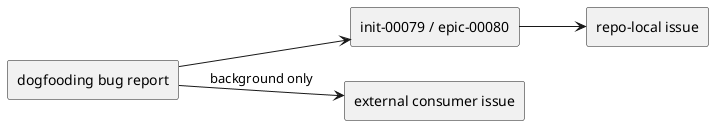

# init-00079 minor bugfix maintenance — 設計（HOW / Guardrails）

## アーキテクチャ上の狙い
- bug report の入口を 1 つに寄せつつ、architecture / feature / external-consumer concern をこの bucket から分離する。

## 現状と目指す姿
- As-Is:
  - `init-00079 / epic-00080` は存在するが、docs がテンプレートのままで具体的な routing guardrail がない。
- To-Be:
  - repo-local actionable bug はこの initiative 配下へ issue 化する。
  - external consumer app 側の flaky CI は背景 evidence としては参照できるが、本 repo の修正対象に自動昇格しない。

### UML（任意: high-level context / target-state）

## 対象境界 / 依存
- in scope:
  - repo 内で再現・修正・検証できる minor runtime / installer / docs / mirror parity bug
- external dependency:
  - GitHub issue linkage
  - dogfooding 中に収集される PR review / CI evidence
- boundary policy:
  - root cause が本 repo の contract にある場合だけ issue を切る。
  - root cause が外部 consumer app に閉じる場合は、別 issue / 別 repo で管理する。

## ガードレール
- 互換性:
  - provider-side source of truth と dogfooding mirror の差異を放置しない。
- セキュリティ:
  - issue / research / report には必要十分な evidence だけを残し、秘匿情報は持ち込まない。
- データ境界:
  - issue ごとの spec docs が正本であり、会話ログは正本にしない。
- 品質条件:
  - issue は single actionable bug に閉じ、requirement / design / plan / report が具体化されていること。

## ロールアウト原則
- rollout strategy:
  - parent bucket docs は最小限の guardrail のみを持ち、具体的な修正契約は issue docs で閉じる。
- rollback principle:
  - bucket 自体は rollback せず、個別 bugfix issue の差分単位で戻す。
- feature flag principle:
  - minor bug bucket では feature flag を前提にしない。必要なら個別 issue で判断する。

## 観測性 / NFR 原則
- observability:
  - bug report の出典、観測点、repo-local / external の切り分けを issue docs か research に残す。
- performance / reliability:
  - minor bug 対応でも validate / sync / report evidence を残せる運用を維持する。
- audit / compliance:
  - GitHub issue 番号と issue docs の対応を保つ。

## 主要リスク
- R-001:
  - external flaky issue を本 repo の bug と誤認する。
- R-002:
  - parent bucket docs を薄くしすぎて、issue 作成判断が人依存になる。

## 関連 ADR
- なし:
  - 現時点では initiative-level ADR は不要。長期方針変更が出たら architecture initiative 側で扱う。

## 未確定事項
- なし:
  - minor bug bucket は route-first の軽量運用で開始する。
