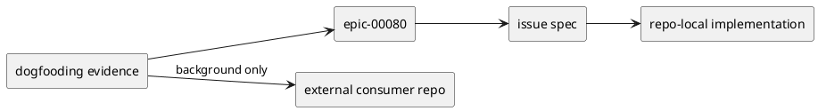
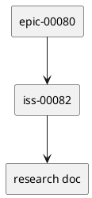
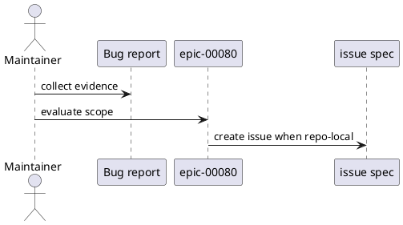

# epic-00080 minor bug fixes — 設計（HOW）

## 全体像
- target boundary:
  - repo-local actionable bug の reusable bucket
- impacted area:
  - runtime / installer / docs / dogfooding mirror の minor contract bugs
- existing relation:
  - initiative `init-00079` の唯一の execution epic として機能する

### UML（推奨: module / context）

## 契約
### API（必要時）
- API-001:
  - Request:
    - bug report / review comment / CI evidence
  - Response:
    - concrete issue spec under `epic-00080`
  - Errors:
    - repo-local actionable bug でない場合は本 epic の対象外とする

### Event（必要時）
- なし:
  - event contract は issue ごとに定義する

### Data boundary
- SoR:
  - issue requirement / design / plan / report
- consistency model:
  - parent docs は routing guardrail、具体的な修正契約は issue docs に委譲する

## データモデル
- model / table changes:
  - epic 自体では持たない
- invariants:
  - issue は single actionable bug に閉じる
  - external evidence は non-goal として明示する

### UML（任意: data model）

## 主要フロー
- Flow-A:
  1. dogfooding で bug report を受ける
  2. repo-local actionable bug かを判定する
  3. `epic-00080` 配下に issue を作成し、spec を固定する
- Flow-B:
  1. external staging failure などの evidence を受ける
  2. repo-local bug でない場合は background evidence としてだけ残す
  3. 必要なら別 repo / 別 issue を案内する

### UML（任意: sequence / flow）

## 失敗設計
- failure mode:
  - external issue を誤って repo-local issue にしてしまう
- retry:
  - scope を research / requirement で切り直す
- idempotency:
  - 既存 issue に収まるなら新規作成せず更新する
- partial failure:
  - issue 作成だけ成功し spec が未記入のままになると incomplete とみなす

## 移行戦略
- migration strategy:
  - 既存 reusable bucket をそのまま利用する
- dual write/read if needed:
  - 不要
- rollback:
  - issue 単位で元に戻す

## 観測性 / セキュリティ
- observability:
  - GitHub issue 番号、issue docs、research doc を相互参照可能にする
- role / auth:
  - GitHub-backed node creation に依存する
- audit / pii:
  - 秘匿情報を docs に持ち込まない

## テスト戦略
- Unit:
  - epic 自体では持たない
- Integration:
  - issue 作成後に validate / sync で tree projection が更新されること
- E2E:
  - first issue `iss-00082` が active issue として参照できること
- E-AC mapping:
  - E-AC-001 -> `iss-00082` creation + issue docs authoring
  - E-AC-002 -> issue / research scope wording

## 関連 ADR
- なし:
  - epic レベルの ADR は不要

## 未確定事項
- なし:
  - individual bug design decisions は issue docs で扱う
