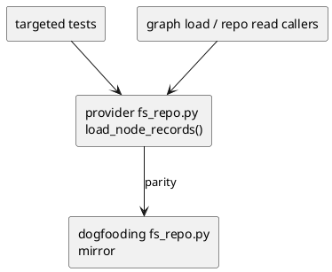
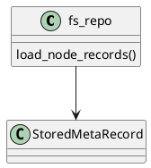

# iss-00082 Fail fast on malformed node metadata — 設計（HOW）

## 目的・制約
- 目的:
  - malformed node metadata の silent skip を廃止し、graph load を fail-fast に寄せる。
- MUST / MUST NOT:
  - MUST:
    - `type` / `id` が正規化後に非空文字列でない場合に RuntimeError を投げる
    - error に `meta_path` を含める
    - provider-side source と dogfooding mirror を揃える
  - MUST NOT:
    - malformed node を読み飛ばさない
    - valid nodes の読み込みを変えない
    - external staging failure 対応を混ぜない
- 非交渉制約:
  - implementation source of truth は `src/spec_dock/assets/spec_dock/scripts/spec_dock_runtime/infra/fs_repo.py`
  - checked-in dogfooding mirror も同一 contract を保つ
- 前提:
  - `load_node_records()` は graph load / repo read path の共通入口である

## 既存実装 / 規約の理解
- 参照した実装 / docs:
  - `src/spec_dock/assets/spec_dock/scripts/spec_dock_runtime/infra/fs_repo.py`
  - `spec-dock/scripts/spec_dock_runtime/infra/fs_repo.py`
  - `spec-dock/docs/workflow_issue.md`
  - `spec-dock/docs/phase_requirement.md`
  - `spec-dock/docs/phase_design.md`
  - `spec-dock/docs/phase_plan_issue.md`
- 現状理解:
  - `load_node_records()` は `.meta.json` が object でない場合は fail するが、`type` / `id` を `str(...).strip()` した結果が空文字のときは `continue` している。
- 採用するパターン:
  - existing invalid metadata handling を拡張し、required field が非空文字列でないケースを RuntimeError として扱う。
- 採用しないもの:
  - warning-only handling
  - malformed node の best-effort load
  - issue scope 外の schema expansion
- 影響範囲:
  - provider-side runtime asset
  - checked-in dogfooding runtime mirror
  - targeted tests

## 採用方針 / トレードオフ
- 論点:
  - malformed node を skip するか fail-fast するか
  - missing key だけを対象にするか、blank / whitespace-only / non-string まで integrity violation に含めるか
  - provider-side fix だけで済ませるか mirror parity まで同一 issue で閉じるか
- 選択肢:
  - Option A:
    - 現状どおり skip し続ける
  - Option B:
    - required field が非空文字列でない場合を RuntimeError に昇格する
  - Option C:
    - provider-side だけ直し、mirror は後続 issue に送る
- 決定:
  - Option B を採用する
  - parity drift を避けるため Option C は採用しない

## 依存関係分析
- upstream / prerequisite:
  - `load_node_records()` の既存 invalid-object error path
  - issue requirement の fail-fast contract
- downstream / dependent:
  - graph load / repo read callers
  - dogfooding runtime validation
- 実装起点:
  - SG1 spec review で issue contract を固定し、その後 `load_node_records()` の red test を先に固定して最小変更で fail-fast contract を入れる
- sequencing implications:
  - provider-side contract を先に固定し、その後 mirror parity と docs/report evidence を揃える

### UML（必須: module / dependency）

## インターフェース契約
- API / function / protocol / data boundary:
  - function:
    - `load_node_records(specdock_dir: Path) -> list[StoredMetaRecord]`
  - before:
    - `type` / `id` を `str(...).strip()` した結果が空なら `continue`
  - after:
    - `type` が非文字列または `.strip()` 後に空なら RuntimeError
    - `id` が非文字列または `.strip()` 後に空なら RuntimeError
    - error message は `meta_path` を含む
    - valid node behavior は unchanged

## クラス / インターフェース詳細設計（必要時）
- Class / Interface:
  - `StoredMetaRecord` loader path in `fs_repo.py`
- responsibility:
  - node metadata を完全性付きで records へ変換する
- collaboration:
  - `load_json`
  - graph load / repo read callers
  - targeted regression tests

### UML（任意: class / interface）

## 変更計画
- Add:
  - missing / blank / whitespace-only / non-string required field 用の targeted regression cases
- Modify:
  - `src/spec_dock/assets/spec_dock/scripts/spec_dock_runtime/infra/fs_repo.py`
  - `spec-dock/scripts/spec_dock_runtime/infra/fs_repo.py`
  - relevant tests
- Delete:
  - なし
- Move/Rename:
  - なし
- Read only:
  - issue research note
  - staging failure evidence

## 要件 → 設計マッピング
- AC-001 -> malformed `type` branch is RuntimeError
- AC-002 -> malformed `id` branch is RuntimeError
- AC-003 -> valid records path remains unchanged
- AC-004 -> staging failure remains research / non-goal only
- EC-001 -> existing invalid-object error path unchanged
- EC-002 -> mirror parity update in same issue
- constraint -> provider-side source of truth first

## テスト戦略
- Unit:
  - malformed `.meta.json` invalid `type` (`missing`, `""`, whitespace-only, non-string)
  - malformed `.meta.json` invalid `id` (`missing`, `""`, whitespace-only, non-string)
- Integration:
  - valid metadata load still passes
- Manual / operational evidence:
  - `./spec-dock/scripts/spec-dock validate`
  - `./spec-dock/scripts/spec-dock sync --github` は optional な repo-state refresh evidence とし、この issue の pass/fail gate には含めない
- migration / rollback / feature flag if needed:
  - feature flag 不要
  - rollback は issue diff 単位

## 要件 / 例外 -> verification mapping
- AC-001 -> targeted test for malformed `type`
- AC-002 -> targeted test for malformed `id`
- AC-003 -> existing valid-load regression
- AC-004 -> spec / research review
- EC-001 -> invalid-object regression unchanged
- EC-002 -> changed-files parity check
- constraint -> provider + mirror both touched or justified no-op

## リスク / 移行 / ロールバック（必要時）
- risk:
  - error message wording を変えすぎると既存 test が brittle になる
- mitigation:
  - include assertion on path and missing-field intent
- rollback:
  - revert issue diff if fail-fast contract causes unexpected breakage
