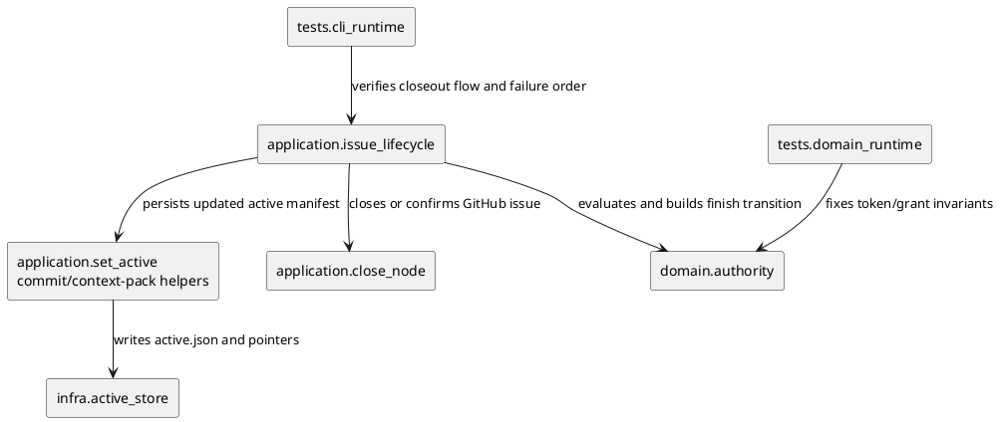
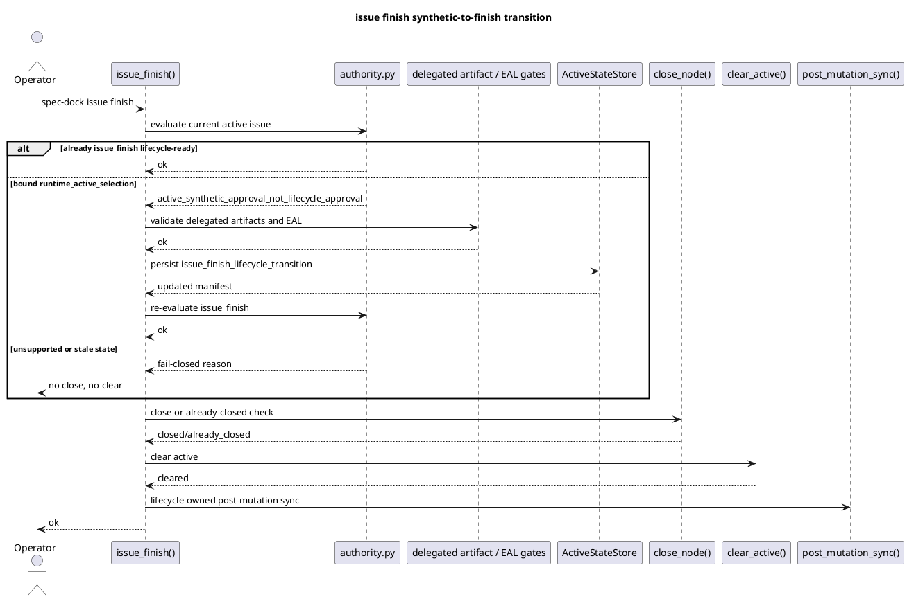

# iss-00149 Issue finish synthetic approval closeout bug — 設計（HOW / guardrails）

## 親図（Diagram）参照
- Epic 図:
  - N/A: epic は minor bug fixes の集合であり、この issue の authority transition は issue-local runtime bug fix として閉じる。
- Initiative 図:
  - N/A: delegated authoring / lifecycle authority 全体の再設計は対象外。
- 再利用する決定:
  - `requirement.md` DEC-001: `issue finish` が close / active clear 前に finish-scoped lifecycle transition を内部生成する。
  - `discussions/20260601t092641z-disc-deep-consultant-lifecycle-transition-decision.md`: synthetic selection と lifecycle approval は同一視せず、root cause は supported state transition の欠落として扱う。

## 目的・制約
- 目的:
  - `issue start` / `active set` が作る synthetic active selection から、手動 `active.json` 編集なしで `issue finish` の closeout path へ進める。
  - local authority / delegated artifact / Evidence Adoption Ledger gate を fail-closed で通した場合だけ、issue finish 専用 lifecycle transition を生成する。
- 必須 / 禁止:
  - 必須: `runtime_active_selection` は lifecycle grant を直接満たさない。
  - 必須: transition は `issue_finish` に限定する。
  - 必須: transition persistence は GitHub close / active clear より前、local preconditions より後に行う。
  - 禁止: generated state の手動編集を標準 recovery path にする。
  - 禁止: `implementation_start` / `issue_ready` / `phase_completion` を同時に自動昇格する。
- 非交渉制約:
  - provider-side runtime は `src/spec_dock/assets/spec_dock/scripts/spec_dock_runtime/...` を source of truth とする。
  - dogfooding mirror `spec-dock/scripts/spec_dock_runtime/...` は provider runtime と同じ挙動に保つ。
  - `issue finish` は PR delivery / review / test / merge readiness を保証しない。
- 前提:
  - requirement は fresh `spec-reviewer` pass 済み。
  - active issue entry は `promotion_record` が `active:<issue-id>` に bound されている場合だけ transition 候補にできる。
  - delegated `design.md` / `plan.md` と Evidence Adoption Ledger の blocking state は closeout 前に解消されている必要がある。

## 既存実装 / 規約の理解
- 参照した実装 / docs:
  - `src/spec_dock/assets/spec_dock/scripts/spec_dock_runtime/domain/authority.py`
  - `src/spec_dock/assets/spec_dock/scripts/spec_dock_runtime/application/set_active.py`
  - `src/spec_dock/assets/spec_dock/scripts/spec_dock_runtime/application/issue_lifecycle.py`
  - `src/spec_dock/assets/spec_dock/scripts/spec_dock_runtime/infra/active_store.py`
  - `src/spec_dock/assets/spec_dock/docs/workflow_issue.md`
  - `tests/domain_runtime/test_authority.py`
  - `tests/cli_runtime/test_issue_lifecycle.py`
  - `spec-dock/docs/workflow_issue.md`
  - `spec-dock/docs/workflow_spec_authoring.md`
  - `spec-dock/docs/phase_design.md`
- 現状理解:
  - `set_active.build_active_manifest()` は active chain の各 entry に `authority=approved`、全 runtime grants、`promotion_decision=runtime_active_selection` を設定する。
  - `evaluate_authority_gate()` は `implementation_start` / `issue_ready` / `issue_finish` / `phase_completion` に対して `runtime_active_selection` を `active_synthetic_approval_not_lifecycle_approval` として拒否する。
  - `issue_lifecycle.issue_finish()` は現状、delegated artifact / Evidence Adoption Ledger gate より先に `_require_issue_finish_authority()` を呼ぶため、synthetic active state では公式 transition を作る余地がない。
  - 既存テストは `_promote_active_issue_lifecycle()` で `promotion_decision` を `main_orchestrator_promotion` へ手動変更した場合だけ finish success を確認している。
- 採用するパターン:
  - authority 判定は domain の `evaluate_authority_gate()` に残す。
  - closeout workflow の順序制御と transition 生成は application layer の `issue_lifecycle.py` に置く。
  - active state の永続化は `ActiveStateStore` と `set_active.commit_active_state()` 相当の snapshot / rollback 付き path を使う。
- 採用しないもの:
  - `runtime_active_selection` を `issue_finish` だけ例外的に通す domain relaxation。
  - explicit `approve-finish` / `active promote` command の追加。
  - GitHub issue state だけを根拠に local spec gates を bypass すること。
- 影響範囲:
  - runtime authority domain、issue finish application flow、active context-pack / guidance、workflow docs、domain / CLI runtime tests。

## 採用方針 / トレードオフ
- 論点:
  - synthetic selection を lifecycle approval と区別したまま、通常 closeout の official path をどう作るか。
- 選択肢:
  - A: `issue_finish` 内部で finish-scoped lifecycle transition を生成する。
  - B: explicit promotion command を追加する。
  - C: guidance のみ改善する。
- 決定:
  - A を採用する。
  - `issue_finish_lifecycle_transition` token を導入し、`evaluate_authority_gate()` で `required_grant=issue_finish` のときだけ lifecycle-ready と扱う。
  - updated issue entry の grants は `issue_finish` と non-lifecycle input grants に狭める。これにより、transition 後に close failure が起きて active state が残っても、`implementation_start` / `issue_ready` / `phase_completion` は `missing_required_grant` または token restriction で通らない。
  - transition は local preconditions を通した後に永続化する。GitHub close failure 後の retry は、既に finish-ready な active issue state から再実行できる。

## 依存関係分析
- module 依存:
  - `application.issue_lifecycle` -> `domain.authority`: gate evaluation、transition promotion record helper、grants helper。
  - `application.issue_lifecycle` -> `application.set_active`: active state commit / context-pack render helper。
  - `application.issue_lifecycle` -> `infra.contracts`: immutable `ActiveManifest` / `ActiveManifestEntry` の差し替え。
  - `application.issue_lifecycle` -> `application.close_node` / `clear_active` / `sync_state`: existing finish flow。
- class 依存（必要時）:
  - `ActiveManifestEntry`: issue entry の `promotion_record` と `grants` を finish-scoped に差し替える。
  - `ActiveManifest`: initiative / epic は変更せず、issue entry だけを transition 済みに差し替える。
- function 依存（必要時）:
  - `evaluate_authority_gate()`: token restriction と synthetic rejection の source of truth。
  - `require_delegated_artifacts_authorized()`: transition 前 precondition。
  - `require_evidence_adoption_ledger_clear()`: transition 前 precondition。
  - `commit_active_state()`: active manifest / pointers / agent state の atomic-ish write。
- file 依存:
  - provider runtime を先に変更し、dogfooding mirror は provider と parity を取る。
- 上流 / 前提:
  - requirement DEC-001 と `spec-reviewer` requirement pass。
- 下流 / 依存先:
  - plan は domain tests から始め、application tests、docs / mirror parity、review gates の順に組む。
- 実装起点:
  - `domain.authority` の token / grants contract を tests で固定してから、`issue_lifecycle` の transition flow を実装する。
- 順序への影響:
  - domain invariant を先に固定しないと application transition が広すぎる regression を見逃す。

## モジュール依存図（Module Dependency Diagram）
- タイトル:
  - issue finish finish-scoped lifecycle transition dependency delta
- 答える問い:
  - `issue_finish` の transition をどの layer に置き、どの safety invariant を domain に残すか。
- 範囲:
  - authority domain、issue lifecycle application、active state persistence、tests。
- 含めない詳細:
  - 全 command / 全 active pointer update / GitHub gateway 詳細。
- 更新条件:
  - transition の owner layer、token contract、active state persistence owner が変わるとき。
- 図:
  - 下の `plantuml` block を更新する

### 図表（UML / 原則: モジュール依存 / パッケージ依存差分）


## ローカル図の差分（Local Diagram Delta / 必要時）
- 変更する境界 / 責務 / 相互作用:
  - `issue_lifecycle.issue_finish()` が synthetic issue entry を検出した場合だけ、delegated artifact / EAL preconditions を authority gate 前に評価し、finish-scoped transition を active manifest に永続化する。
  - authority 判定自体は domain から動かさない。

## インターフェース契約
- API / function / protocol / data boundary:
  - `approved_issue_finish_transition_promotion_record(node_id: str) -> dict[str, str]`
    - `promotion_decision=issue_finish_lifecycle_transition`
    - revision / hash fields は `active:<node_id>` に bind する。
  - `approved_issue_finish_transition_grants() -> tuple[str, ...]`
    - `review_input`, `planning_input`, `design_baseline`, `issue_finish` のみにする。
  - `evaluate_authority_gate(...)`
    - `runtime_active_selection` は downstream lifecycle grants を拒否し続ける。
    - `issue_finish_lifecycle_transition` は `required_grant=issue_finish` のときだけ許可し、それ以外の lifecycle grant では `finish_transition_not_valid_for_required_grant` などの明示 reason で拒否する。
  - `issue_finish(...)`
    - public CLI contract は変更しない。
    - active issue が既に lifecycle-ready の場合は既存 path を維持する。
    - active issue が bound synthetic selection の場合は transition preconditions -> persistence -> existing gate -> close -> clear -> post-sync の順に進む。

## シーケンス差分（Sequence Delta / 必要時）
- 変更する相互作用:
  - synthetic active state の `issue finish` success / failure order。
- retry / transaction / external API / queue:
  - Transition persistence failure は active store snapshot / rollback で previous state を復元し、GitHub close を呼ばない。
  - GitHub close failure after transition persistence は active を clear せず、retry 可能な finish-ready active state を残す。
  - Active clear failure は既存 guidance を維持し、GitHub close / already-closed 後の recovery として扱う。
- UML:
  - 下記に差分 sequence を示す。



## ドメインモデル差分（Domain Model Delta / 必要時）
- 親 model 参照:
  - Active manifest entry は runtime state model。永続 schema は既存 `promotion_record` dict と `grants` tuple を使う。
- aggregate / entity / value object 変更:
  - N/A: 新規 dataclass / persistent schema は追加しない。
- domain event / policy / specification 変更:
  - `issue_finish_lifecycle_transition` を lifecycle policy token として追加する。
- 不変条件の変更:
  - 変更しない: `runtime_active_selection` は lifecycle grants を直接満たさない。
  - 追加: `issue_finish_lifecycle_transition` は `issue_finish` 以外の lifecycle grant を満たさない。
- UML:
  - N/A: 既存 active manifest shape を再利用するため、module / sequence 図で十分。

## クラス / インターフェース詳細設計（必要時）
- Class / Interface:
  - `ActiveManifestEntry`
- 責務:
  - active issue entry の authority / grants / promotion record を保持する。
- 連携:
  - `issue_lifecycle` が issue entry だけを `replace()` 相当で差し替え、initiative / epic entry は変更しない。
- UML:
  - N/A: dataclass の field 追加なし。

## ディレクトリ / ファイル変更計画
```text
.
|-- src/spec_dock/assets/spec_dock/scripts/spec_dock_runtime/
|   |-- domain/
|   |   `-- authority.py          # 変更: finish transition token / grants helper and finish-only gate
|   |-- application/
|   |   |-- issue_lifecycle.py    # 変更: transition preconditions, persistence, retry/failure ordering
|   |   `-- set_active.py         # 変更候補: existing commit/context-pack helper reuse only
|   `-- infra/
|       |-- active_store.py       # 変更候補: existing store API で不足する場合のみ
|       `-- contracts.py          # 原則 no-op: existing ActiveManifestEntry/ActiveManifest を使う
|-- spec-dock/scripts/spec_dock_runtime/
|   `-- ...                       # provider runtime 変更との mirror parity
|-- src/spec_dock/assets/spec_dock/docs/
|   `-- workflow_issue.md         # 変更: shipped source of truth for internal finish transition and recovery boundary
|-- spec-dock/docs/
|   `-- workflow_issue.md         # 変更: dogfooding mirror; provider docs と parity を保つ
|-- tests/
|   |-- domain_runtime/
|   |   `-- test_authority.py     # 変更: synthetic rejection and finish-only transition token
|   `-- cli_runtime/
|       `-- test_issue_lifecycle.py # 変更: synthetic start/set finish success and fail-closed preconditions
```

## 要件 → 設計マッピング
- AC-001:
  - bound synthetic active issue で local preconditions を満たす場合、`issue_finish_lifecycle_transition` を永続化し、既存 finish flow で GitHub close / already-closed、active clear、post-sync へ進む。
- AC-002:
  - unsupported / stale / missing grant / delegated artifact / EAL blocker は transition 前に fail-closed し、GitHub close と active clear を呼ばない。
- AC-003:
  - domain tests で `runtime_active_selection` の lifecycle rejection と `issue_finish_lifecycle_transition` の finish-only behavior を固定する。
- AC-004:
  - provider `src/spec_dock/assets/spec_dock/docs/workflow_issue.md`、dogfooding mirror `spec-dock/docs/workflow_issue.md`、CLI failure guidance、context-pack wording を behavior と合わせる。
- EC-001:
  - already CLOSED の GitHub issue でも同じ transition path を通して active clear へ進む。
- EC-002:
  - expected revision mismatch は transition 生成前に fail-closed。
- EC-003:
  - EAL blocker は transition 生成前に fail-closed。
- EC-004:
  - delegated artifact gate は transition 生成前に fail-closed。
- constraint:
  - domain invariant を緩めず、transition token / grants の両方で issue_finish 限定を表現する。

## テスト戦略
- 単体:
  - `tests/domain_runtime/test_authority.py`
    - `runtime_active_selection` は lifecycle grants を拒否し続ける。
    - `issue_finish_lifecycle_transition` + `issue_finish` grant は `required_grant=issue_finish` だけ pass。
    - 同 token は `implementation_start` / `issue_ready` / `phase_completion` では fail。
    - stale revision / stale hash / expected active revision mismatch は fail。
- 統合:
  - `tests/cli_runtime/test_issue_lifecycle.py`
    - `active set` / `issue start` の synthetic active issue から `issue finish` が OPEN issue を close し active clear する。
    - already CLOSED issue でも synthetic active issue から active clear する。
    - delegated artifact failure / unresolved EAL / stale promotion record は transition 永続化前に fail し、GitHub close stub を呼ばない。
    - GitHub close failure after transition persistence は active を clear せず、active issue entry が finish-ready として retry 可能である。
    - post-mutation sync は close / clear 後に 1 回だけ走る。
- E2E / manual:
  - `./spec-dock/scripts/spec-dock validate`
  - `./spec-dock/scripts/spec-dock sync`
  - 必要なら dogfooding active issue で `active show` / context-pack の wording を inspection。
- migration / rollback / feature flag if needed:
  - data migration / feature flag は不要。transition は `issue finish` 実行時に lazy に発生する。
  - rollback は runtime changes の revert。既に `issue_finish_lifecycle_transition` になった active entry は finish-only token として domain が理解するため、revert 前提の migration は不要。ただし rollback 後の旧 runtime では token を generic non-synthetic として扱う可能性があるため、実装 report に rollback note を残す。

## 要件 / 例外 -> 検証マッピング
- AC-001 -> CLI runtime success tests for OPEN synthetic active issue and post-sync result.
- AC-002 -> CLI runtime negative tests asserting no GitHub close and active state retained.
- AC-003 -> domain authority tests for synthetic rejection and finish-only token.
- AC-004 -> provider/mirror docs inspection plus spec-reviewer review of `workflow_issue.md` / CLI guidance.
- EC-001 -> CLI runtime already-closed synthetic active issue test.
- EC-002 -> stale promotion record test.
- EC-003 -> unresolved EAL test.
- EC-004 -> delegated artifact authorization test.

## リスク / 移行 / ロールバック（必要時）
- token acceptance が広すぎると `implementation_start` / `issue_ready` / `phase_completion` まで開く。domain tests で finish-only を固定する。
- preconditions 前に transition を永続化すると blocked evidence を lifecycle-ready にしてしまう。application tests で write / close call order を固定する。
- GitHub close 後に transition を永続化すると close failure retry trap が残る。transition は local preconditions 後 / GitHub close 前に固定する。
- provider runtime と dogfooding mirror の片方だけを更新すると shipped behavior と dogfooding behavior が分岐する。plan で parity check を必須にする。
- initiative / epic は synthetic downstream block のまま残る可能性がある。`issue finish` は active issue entry の closeout gate に限定し、ancestor lifecycle completion は follow-up scope にする。

## 未確定事項
- なし:
  - `commit_active_state()` を直接再利用するか、issue lifecycle 内に小さな helper を置くかは実装時の局所判断だが、設計契約は active store / snapshot rollback path を使うことで固定済み。
  - CLI wording は implementation phase で既存 presentation style に合わせて調整し、AC-002 / AC-004 の tests / docs inspection で検証する。
