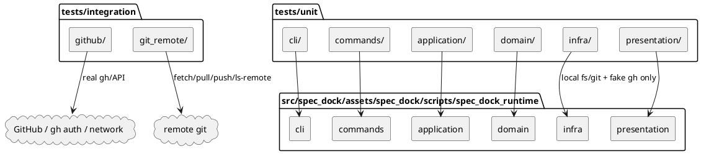
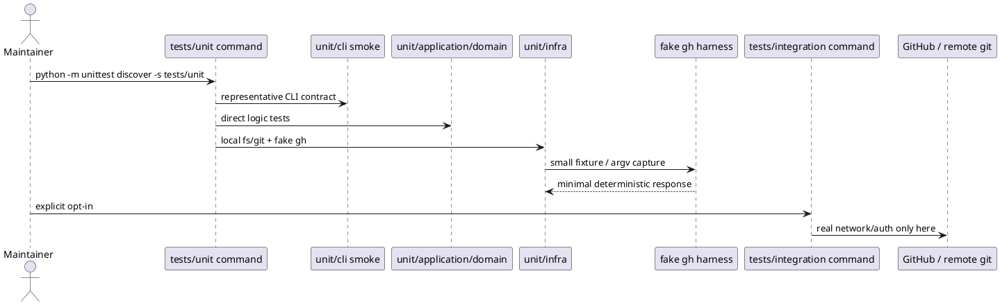

# iss-00160 Reduce Test Runtime Followup — 設計（どう実現するか）

## 親図（Diagram）参照
- Epic 図:
  - 直接の図更新は不要。Epic は minor bug fixes の集合であり、本 issue は test feedback loop 改善に閉じる。
- Initiative 図:
  - 直接の図更新は不要。Initiative は maintenance / dogfooding の継続改善であり、本 issue は test structure と fixture strategy の改善に閉じる。
- 再利用する決定:
  - `20260605t075347z-01-adr-test-suite-boundary-and-fixture-strategy.md`
  - `20260605t075347z-interview-unit-runtime-target-clarification.md`

## 目的・制約
- 目的:
  - `tests/unit/` を local/no external-service suite として 120 秒以内で実行できる構造にする。
  - `tests/integration/` を real external service / remote git suite として明示実行に分離する。
  - Heavy local fixture と CLI subprocess 反復を、small fixture、argv contract、direct application/domain tests へ置き換える。
- 必須 / 禁止:
  - 必須:
    - `tests/unit/{cli,commands,application,domain,infra,presentation}` を production runtime layer に対応させる。
    - `tests/integration/{github,git_remote}` を external boundary に対応させる。
    - Unit command は external credential / network なしで実行可能にする。
    - Default fake `gh` は small fixture を返す。
    - `--gh-limit=10000` は captured argv contract で検証する。
  - 禁止:
    - Production behavior を高速化目的だけで変更しない。
    - 1 万件 issue JSON を routine unit default path に残さない。
    - CLI contract smoke を消さない。
- 非交渉制約:
  - `tests/unit/` local measurement target は 120 秒以内。
  - Real GitHub / remote git / auth / network test は `tests/integration/` の opt-in suite。
- 前提:
  - Test framework は `unittest`。
  - Runtime source of truth は `src/spec_dock/assets/spec_dock/scripts/spec_dock_runtime/`。
  - Existing `python -m unittest discover` は full regression fallback として残す。

## 既存実装 / 規約の理解
- 参照した実装 / docs:
  - `src/spec_dock/assets/spec_dock/scripts/spec_dock_runtime/cli/`
  - `src/spec_dock/assets/spec_dock/scripts/spec_dock_runtime/commands/`
  - `src/spec_dock/assets/spec_dock/scripts/spec_dock_runtime/application/`
  - `src/spec_dock/assets/spec_dock/scripts/spec_dock_runtime/domain/`
  - `src/spec_dock/assets/spec_dock/scripts/spec_dock_runtime/infra/`
  - `src/spec_dock/assets/spec_dock/scripts/spec_dock_runtime/presentation/`
  - `tests/cli_runtime/`
  - `tests/domain_runtime/`
  - `tests/presentation_runtime/`
  - `tests/test_cli.py`
  - `tests/test_init_update.py`
  - `tests/cli_runtime/harness.py`
- 現状理解:
  - Current tests are organized mostly by historical runtime surface (`cli_runtime`, `domain_runtime`, `presentation_runtime`) rather than the accepted runtime layer map.
  - Slow tests are primarily local Unit-equivalent tests that repeatedly initialize temp repositories, materialize linked hierarchies, run CLI entrypoints, and sync against fake `gh` issue lists.
  - Default fake `gh issue list` returning 10000 records makes otherwise local tests expensive and obscures intent.
  - Application/domain behavior can often be tested without invoking full CLI subprocess / temp repo mutation loops.
- 採用するパターン:
  - Directory placement communicates test boundary and target layer.
  - CLI tests keep representative contract coverage.
  - Lower-layer tests validate branch-heavy behavior via direct APIs, fake ports, fake gateways, and minimal fixtures.
  - Integration tests are opt-in and explicit about external dependencies.
- 採用しないもの:
  - `fast/slow` の third category。
  - Marker framework introduction。
  - CI workflow redesign。
  - Runtime behavior refactor as a prerequisite for test speed.
- 影響範囲:
  - Tests and test helpers under `tests/`.
  - Potential README / docs command references if existing docs mention test commands.
  - `report.md` measurement evidence.

## 採用方針 / トレードオフ
- 論点:
  - Unit を conventional pure in-process tests に限定するか、repo-local operation definition として local subprocess / local git を含めるか。
- 選択肢:
  - A: Unit を in-process tests のみに狭め、subprocess / local git は integration or e2e に近い扱いへ移す。
  - B: Unit を local/no external-service tests と定義し、subprocess / tempdir / local git / stub `gh` を含める。
- 決定:
  - B を採用する。ADR とユーザー共有方針に一致し、今回の遅延要因を実通信ではなく heavy local fixture として扱える。
- trade-off:
  - `unit` の語義は一般的な pure unit より広い。代わりに、日常 command が外部依存なしで広い regression surface を持てる。
  - 120 秒 target は 60 秒 target より緩い。代わりに、1 issue での過大な rewrite を避け、top bottleneck を優先して段階的に改善できる。

## 依存関係分析
- module 依存:
  - `tests/unit/cli` は CLI parser / dispatcher / command contract に依存する。
  - `tests/unit/commands` は command handler contract に依存し、full business branching を抱えない。
  - `tests/unit/application` は use case / orchestration logic に依存し、fake port / fake gateway を使う。
  - `tests/unit/domain` は pure domain logic に依存する。
  - `tests/unit/infra` は filesystem、local git、fake `gh`、persistence adapters に依存する。ただし external remote には依存しない。
  - `tests/unit/presentation` は JSON / markdown / PUML / CLI rendering に依存する。
  - `tests/integration/github` は real `gh` / GitHub API / auth / network に依存する。
  - `tests/integration/git_remote` は remote git operations / network に依存する。
- file 依存:
  - `tests/cli_runtime/harness.py` は test helper の central point として fake `gh` default behavior と argv capture を持つ。
  - `tests/cli_runtime/test_deps.py`、`tests/cli_runtime/test_validate.py`、`tests/cli_runtime/test_delegated_authoring.py`、`tests/cli_runtime/test_active.py`、`tests/cli_runtime/test_sync.py`、`tests/cli_runtime/test_new.py` が heavy CLI coverage split targets。
  - `tests/domain_runtime/` と `tests/presentation_runtime/` は low-risk move candidates。
  - `tests/test_cli.py` は CLI / test discovery contract として `tests/unit/cli/test_cli.py` へ置く。
  - `tests/test_init_update.py` は installer / scaffold asset sync / local filesystem behavior として `tests/unit/infra/test_init_update.py` へ置く。
- 上流 / 前提:
  - Requirement review pass。
  - ADR accepted。
  - User answer Option B。
- 下流 / 依存先:
  - Implementation plan steps。
  - Final QA gate。
  - Potential docs update step if test commands are documented outside issue docs。
- 実装起点:
  - Directory scaffold and discovery command first。
  - Harness fixture default and argv capture second。
  - Slowest test files split/move third。
- 順序への影響:
  - Unit command must exist before measuring 120 秒 target。
  - Fixture default change should happen before migrating many tests so new tests inherit small default。
  - CLI smoke / direct lower-layer tests should be paired to avoid coverage loss.

## モジュール依存図（Module Dependency Diagram）
- タイトル:
  - Test Suite Boundary and Layer Mapping
- 答える問い:
  - Test directories map to which production layers / external boundaries, and which suite can run without external services.
- 範囲:
  - Test layout、runtime layer dependency、external boundary。
- 含めない詳細:
  - Individual test methods、full call graph、all fixtures。
- 更新条件:
  - Unit/integration boundary、layer directory、external boundary placement が変わるとき。
- 図:



## ローカル図の差分（Local Diagram Delta）
- 変更する境界 / 責務 / 相互作用:
  - Runtime module dependency is unchanged.
  - Test responsibility boundary changes from historical `cli_runtime` / `domain_runtime` / `presentation_runtime` grouping to explicit unit / integration and runtime-layer mapping.

## インターフェース契約
- Test discovery:
  - Unit:
    - `python -m unittest discover -s tests/unit`
    - 外部 credential / network なしで実行する。
  - Integration:
    - `python -m unittest discover -s tests/integration`
    - Real GitHub / remote git / auth / network を要求する tests はここだけに置く。
  - Full regression fallback:
    - `python -m unittest discover`
    - Unit より広い検証を実行する fallback として残す。
- fake `gh` harness:
  - Default `issue list` response:
    - Test intent に必要な small fixture を返す。
  - Large limit contract:
    - Command invocation argv を capture し、`--limit 10000` を assertion できる helper を提供する。
  - Large issue number:
    - `number: 10000` を含む one-record or minimal fixture で検証する。
  - State variations:
    - missing / unknown / open / closed は 2〜3件 fixture で表現する。
- CLI smoke contract:
  - Parser wiring、argument mapping、exit code、stdout/stderr、import path の代表 contract を保持する。
- Direct logic contract:
  - Branch-heavy behavior は application/domain/infra adapter の direct tests へ移し、必要な external boundary は fake port / fake gateway で置き換える。

## Command 別 coverage split 契約
- `deps`:
  - CLI に残す smoke:
    - `deps check` / representative deps subcommand の parser wiring、exit code、stdout/stderr、JSON or text surface の代表ケース。
    - `--gh-limit` が command handler から fake `gh` invocation へ渡る argv contract。
  - Lower-layer へ移す behavior:
    - Dependency graph resolution、blocked / ready calculation、unknown / missing / open / closed status interpretation。
    - Large issue index behavior は 10000件 generation ではなく argv contract と minimal fixtures で検証する。
  - 移設先:
    - `tests/unit/application/` for `application/check_deps.py` / `application/mutate_deps.py` orchestration。
    - `tests/unit/domain/` for `domain/deps.py` rules。
    - `tests/unit/infra/` for fake `gh` / deps reader / local artifact IO boundaries。
- `validate`:
  - CLI に残す smoke:
    - `validate` command の parser wiring、success/failure exit code、representative human output。
  - Lower-layer へ移す behavior:
    - Tree validation rules、required artifact checks、structure error precedence、diagnostic collection。
  - 移設先:
    - `tests/unit/application/` for `application/validate_tree.py` use-case orchestration。
    - `tests/unit/domain/` for `domain/validation.py` and `domain/tree.py` rules。
    - `tests/unit/presentation/` for validation output rendering where applicable。
- `delegated authoring`:
  - CLI に残す smoke:
    - Deprecated / removed subcommand surface、representative command rejection、stdout/stderr contract。
  - Lower-layer へ移す behavior:
    - Diff guard policy、baseline parsing、forbidden path handling、draft provenance validation、ignored path handling、dirty baseline behavior。
  - 移設先:
    - `tests/unit/domain/` for `domain/delegated_authoring.py` policy rules。
    - `tests/unit/application/` for delegated authoring orchestration。
    - `tests/unit/infra/` for local git / filesystem diff guard adapter behavior。
- `active`:
  - CLI に残す smoke:
    - `active show` / representative active command parser and output contract。
  - Lower-layer へ移す behavior:
    - Active target resolution、context pack generation inputs、persisted manifest fallback / repair rules。
  - 移設先:
    - `tests/unit/application/` for `application/set_active.py` / `application/status_context.py`。
    - `tests/unit/domain/` for `domain/active.py` rules。
    - `tests/unit/infra/` for `infra/active_store.py` local symlink/pathfile behavior。
- `sync`:
  - CLI に残す smoke:
    - `sync` parser conflicts such as mutually exclusive GitHub flags、representative success output、`--gh-limit` argv propagation。
  - Lower-layer へ移す behavior:
    - Projection generation、todo/all views、shorthand expansion、dependency cycle detection、local-only status, dashboard / PUML rendering inputs。
  - 移設先:
    - `tests/unit/application/` for `application/sync_state.py` orchestration。
    - `tests/unit/domain/` for deps/tree/status rules used by sync。
    - `tests/unit/presentation/` for JSON / Markdown / PUML rendering。
    - `tests/unit/infra/` for local artifact writer / fake `gh` status adapter。
- `new`:
  - CLI に残す smoke:
    - `new initiative/epic/issue/doc` representative parser contract、invalid option / invalid slug rejection at command surface、stdout path/id surface。
  - Lower-layer へ移す behavior:
    - ID allocation、duplicate detection、safe slug validation, scope resolution, post-mutation sync trigger conditions, doc timestamp allocation。
  - 移設先:
    - `tests/unit/application/` for `application/create_node.py` and post-mutation orchestration。
    - `tests/unit/domain/` for ID / scope / slug rules when represented there。
    - `tests/unit/infra/` for template scaffolding, local artifact writing, fake `gh issue create` boundary。
- Cross-command rule:
  - If a test only verifies parser wiring, command registration, exit code, or representative output, keep or move it under `tests/unit/cli` or `tests/unit/commands`.
  - If a test verifies branch-heavy business behavior, move it to `tests/unit/application` / `tests/unit/domain` / `tests/unit/infra` according to the production module under test.
  - If a test uses real GitHub / remote git / auth / network, move it to `tests/integration/github` or `tests/integration/git_remote`.

## シーケンス差分（Sequence Delta）
- 変更する相互作用:
  - Unit test execution path から routine 10000 issue generation と excessive CLI temp repo reconstruction を減らす。
- retry / transaction / external API / queue:
  - Production runtime の retry / transaction / external API behavior は変更しない。
- UML:



## ドメインモデル差分
- aggregate / entity / value object 変更:
  - N/A。Production domain model は変更しない。
- domain event / policy / specification 変更:
  - N/A。
- 不変条件の変更:
  - N/A。
- UML:
  - N/A: test structure issue であり domain model は変更対象外。

## クラス / インターフェース詳細設計
- Test helper:
  - `tests/**/harness.py` または移動後の shared helper。
  - 責務:
    - fake `gh` fixture construction。
    - invocation argv capture。
    - small default issue list。
  - 連携:
    - `tests/unit/infra` and CLI smoke tests。
- Test directory packages:
  - 必要なら `__init__.py` を追加し、`unittest discover -s tests/unit` / `tests/integration` が安定して動くようにする。

## ディレクトリ / ファイル変更計画
```text
.
|-- tests/
|   |-- unit/
|   |   |-- cli/                 # CLI parser/entrypoint/contract smoke
|   |   |-- commands/            # command handler contracts
|   |   |-- application/         # use case/orchestration direct tests with fake ports
|   |   |-- domain/              # domain rules/models migrated from domain_runtime
|   |   |-- infra/               # filesystem/local git/fake gh adapters; no external remote
|   |   `-- presentation/        # renderers migrated from presentation_runtime
|   |-- integration/
|   |   |-- github/              # real gh/GitHub/auth/network opt-in tests
|   |   `-- git_remote/          # remote git opt-in tests
|   |-- cli_runtime/             # migration source only; should be emptied or retired by this issue
|   |-- domain_runtime/          # migrate to tests/unit/domain
|   |-- presentation_runtime/    # migrate to tests/unit/presentation
|   |-- test_cli.py              # move to tests/unit/cli/test_cli.py
|   `-- test_init_update.py      # move to tests/unit/infra/test_init_update.py
`-- spec-dock/
    `-- initiatives/.../iss-00160.../report.md # record measurements and gate evidence
```

## 要件 → 設計マッピング
- AC-001 -> Test directory package layout and discovery commands.
- AC-002 -> Unit discovery command, 120 秒 measurement gate, no external dependency contract.
- AC-003 -> fake `gh` harness small default, argv capture, minimal large-number/state fixtures.
- AC-004 -> CLI smoke / lower-layer direct test split and migration order.
- AC-005 -> Full regression fallback command.
- EC-001 -> Integration-only placement for real GitHub / remote git / auth / network.
- EC-002 -> Large index replacement strategy.
- EC-003 -> Local git remains Unit only when deterministic and local-only.
- EC-004 -> Full regression known snapshot divergence is recorded separately if still present.

## テスト戦略
- 単体:
  - `python -m unittest discover -s tests/unit`
  - Must pass without external credential / network.
  - Must complete within 120 seconds in local measurement.
  - Includes CLI smoke, direct application/domain tests, local infra adapter tests, presentation tests.
- 統合:
  - `python -m unittest discover -s tests/integration`
  - Explicit opt-in.
  - Only real GitHub / remote git / auth / network tests belong here.
- Full regression:
  - `python -m unittest discover`
  - Maintains broad compatibility and reveals any existing non-speed failure separately.
- migration / rollback:
  - File moves should preserve test behavior. If a move causes discovery/import breakage, rollback by moving the affected file back or adding package/import compatibility in tests only.
  - Harness default changes should be paired with explicit tests for large limit / large number before deleting heavy default coverage.

## 要件 / 例外 -> 検証マッピング
- AC-001:
  - Inspect directory layout.
  - Run `python -m unittest discover -s tests/unit`.
  - Run `python -m unittest discover -s tests/integration` only when safe / explicitly allowed; otherwise inspect placement and skip/opt-in mechanics.
- AC-002:
  - Measure `python -m unittest discover -s tests/unit` with shell `time`.
- AC-003:
  - Run targeted tests for fake `gh` harness and limit argv contract.
- AC-004:
  - Inspect migrated tests and run targeted slow-file replacements.
- AC-005:
  - Run or at least verify `python -m unittest discover` remains available.
- EC-001:
  - Search for real `gh` / remote git operations in `tests/unit/` and ensure none require network/auth.
- EC-002:
  - Search routine unit fixtures for 10000-record generation and ensure it is not default.
- EC-003:
  - Inspect local git tests for absence of remote network operations.
- EC-004:
  - If full regression fails, compare failure to known snapshot divergence and changed files.

## リスク / 移行 / ロールバック
- Risk: File moves may break unittest discovery or imports.
  - Mitigation: Add `__init__.py` where needed and run focused discover commands after each move group.
- Risk: Shrinking fake `gh` default may remove implicit coverage.
  - Mitigation: Add explicit minimal fixtures for large issue number, state variations, and `--limit 10000` argv before or with default shrink.
- Risk: Moving branch-heavy CLI tests to lower layers may miss parser/stdout/exit behavior.
  - Mitigation: Keep representative CLI contract smoke tests.
- Risk: 120 秒 target may be missed after first pass.
  - Mitigation: Measure after top bottleneck slices and continue with delegated_authoring / active / sync / new until target is met.
- Rollback:
  - Test file moves and helper changes are reversible by restoring prior paths and harness default. Production code rollback should not be necessary because production behavior is out of scope.

## 未確定事項
- なし。
