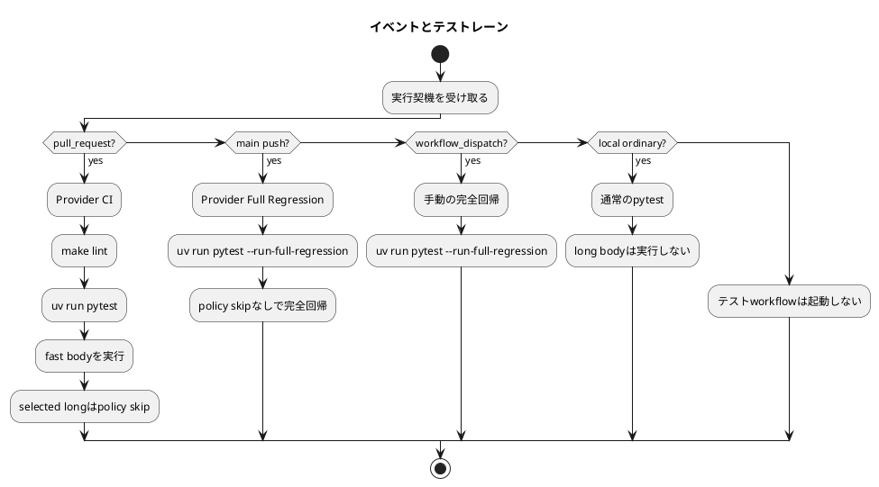
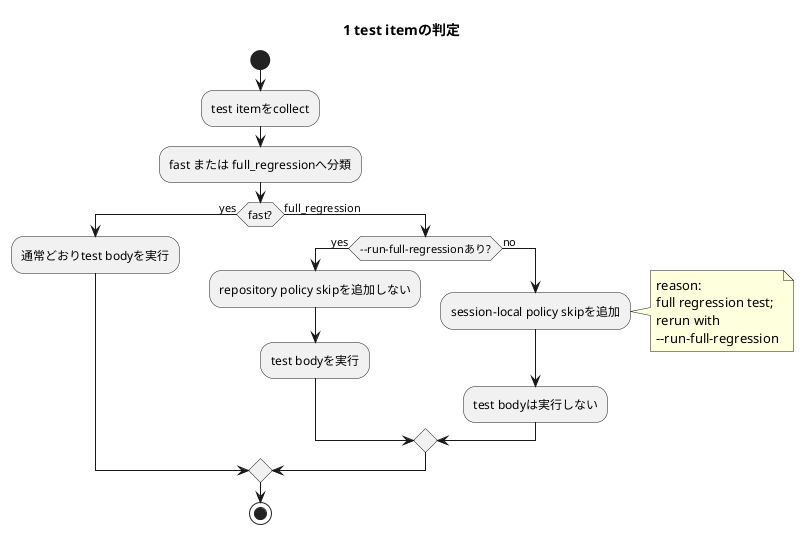
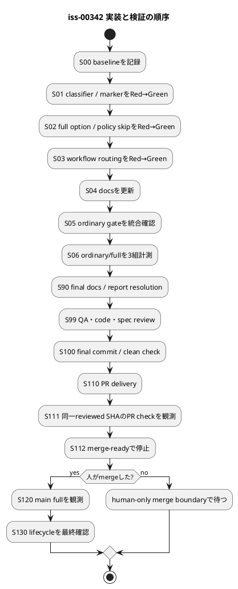

# 新メンバー向け: iss-00342 テスト実行時間改善ガイド

## はじめに

本日チームに加わった方が、Issue #342の目的、採用した設計、実装の進め方を一つの資料で理解できるようにまとめています。

最初に覚えることは一つだけです。

> 普段は、これまでどおり`uv run pytest`を使います。  
> 長時間テストまで意図的に実行するときだけ、`--run-full-regression`を付けます。

このIssueはまだ実装前です。要件・設計・計画は承認済みで、planning guidanceは`ready / planning-ready / assurance-valid`です。ただし`may_execute_approved_plan=false`であり、実装開始にはIssue execution workflowによる別のadmissionが必要です。

---

## 1. 30秒で理解する

### 問題

- 現在の完全なテストは約2,696件ある。
- Provider CIの成功runは中央値約38.1分かかる。
- `tests/cli_runtime`だけでも約20分かかる。
- 小さなPull Requestでも、長時間の完全回帰がmerge blockerになっている。

### 解決方針

- 日常開発とPRでは、短時間で必要な検証を行う。
- 長時間テストは削除せず、明示的な手動実行へ分離する。
- `main`へmergeされた後にも完全回帰を自動実行し、事後検知する。
- schedule / cronは追加しない。

### コマンド

```bash
# 普段の開発
uv run pytest
uv run pytest tests/unit
uv run pytest path/to/test.py::test_name

# 長時間テストを含む完全回帰
uv run pytest --run-full-regression

# 長時間テストだけを意図的に実行
uv run pytest --run-full-regression -m full_regression
```

---

## 2. なぜこのIssueが必要なのか

待ち時間の主因はdependency installやlintではなく、pytest workloadです。

| 観測対象 | 現在の目安 |
|---|---:|
| full collection | 2,696 tests |
| `tests/unit` | 約380秒 |
| `tests/cli_runtime` | 約1,228秒 |
| Provider CI | 中央値約38.1分 |

特に`tests/unit/infra/test_init_update.py`と`tests/cli_runtime/`へ長時間テストが集中しています。

しかし、単純にテストを削除したり、恒久的な`skip`へ変更したりすると、速く見える代わりに検証範囲が弱くなります。このIssueでは、テストの責務を維持したまま、実行するタイミングだけを分離します。

```plantuml
@startuml
title 現在と目標の違い
left to right direction

rectangle "現在" {
  actor Developer as OldDev
  rectangle "通常開発 / PR" as OldPath
  rectangle "完全回帰\n約30〜40分" as OldFull
  OldDev --> OldPath
  OldPath --> OldFull : 毎回待つ
}

rectangle "目標" {
  actor "Developer / Agent" as NewDev
  rectangle "通常pytest\n短いfeedback" as Fast
  rectangle "明示full\n--run-full-regression" as ManualFull
  rectangle "main merge後\nbackground full" as MainFull
  NewDev --> Fast : 普段
  NewDev --> ManualFull : 必要なときだけ
  Fast --> MainFull : human merge後
}
@enduml
```

---

## 3. 二つのレーン

### 通常レーン

日常開発とPR merge gateで使います。

- fast test bodyを実行する。
- 選択された長時間testは、理由付きのrepository policy skipにする。
- provider / dogfooding parityと代表的なCLI contractはmerge前に残す。
- 新しいメンバーやAI agentは、特別なwrapperを覚える必要がない。

### 完全回帰レーン

明示手動実行と`main` merge後の事後検知で使います。

- fastと長時間testを含む論理的な全集合を対象にする。
- repository policy skipを追加しない。
- 既存の正当な`skip`、`skipif`、`xfail`はそのまま維持する。
- PRのmerge blockerにはしない。
- 失敗時は赤いGitHub Actions runとして残し、forward fixまたはrerunで対応する。

### イベント別の動作

| 起点 | 通常レーン | 完全回帰 | 意味 |
|---|---:|---:|---|
| local ordinary pytest | yes | no | 日常開発 |
| local explicit full | no | yes | 意図的な完全回帰 |
| `pull_request` | yes | no | merge gate |
| non-`main` push | no | no | 重複実行しない |
| `main` push | no | yes | merge後の事後検知 |
| `workflow_dispatch` | no | yes | GitHub上の手動実行 |
| `schedule` / cron | no | no | 今回は導入しない |



---

## 4. 一番重要な設計: selectionとpermissionを分ける

pytestの`-m`は「どのtestを選ぶか」を表します。一方、`--run-full-regression`は「長時間test bodyを実行してよいか」を表します。

この二つは別の責務です。

| コマンド | 選択 | 長時間実行の許可 | 結果 |
|---|---|---:|---|
| `uv run pytest` | root全体 | no | fast body実行、selected longはpolicy skip |
| `uv run pytest tests/unit` | unit subset | no | subset内のlongはpolicy skip |
| `uv run pytest <fast-node>` | focused fast | no | 通常どおり実行 |
| `uv run pytest <long-node>` | focused long | no | 理由付きskip、exit 0 |
| `uv run pytest -m full_regression` | longだけ | no | 選択されるがpolicy skip |
| `uv run pytest --run-full-regression <long-node>` | focused long | yes | test bodyを実行 |
| `uv run pytest --run-full-regression` | root全体 | yes | policy skipなしの完全回帰 |

`-m full_regression`だけでは実行許可になりません。これにより、markerを指定しただけで長時間testを誤実行することを防ぎます。



---

## 5. pytest内部では何を実装するのか

主な実装場所は`tests/conftest.py`です。

### `pytest_addoption`

`--run-full-regression`というboolean optionを登録します。特別な操作が`pytest --help`から見つけられるようになります。

### `pytest_itemcollected`

各test itemを、marker expressionが評価される前に次のどちらかへ分類します。

- `fast`
- `full_regression`

全体では次の関係を保証します。

- `F ∩ H = ∅`: 重複分類がない
- `F ∪ H = C`: 全itemがどちらかに属する
- `U = 0`: 未分類がない
- `H > 0`: 長時間集合が誤って消えていない

focused pytestでは、収集されたsubsetの「ちょうど一方へ分類」だけを確認します。repository全体のrequired nodeや`H > 0`を要求して、単一test実行を壊してはいけません。

### `pytest_collection_modifyitems`

`--run-full-regression`がない場合だけ、選択された`full_regression` itemへsession-local policy skipを追加します。

full flagがある場合はpolicy skipを追加しません。既存のskip markerを削除する実装にはしません。

### なぜ恒久的な`@pytest.mark.skip`にしないのか

pytestのskipには複数の起源があります。

- `@pytest.mark.skip`
- 条件付きの`skipif`
- module / class marker
- `pytest.importorskip`
- testやfixture内の`pytest.skip`
- platformやpluginの判断

full modeでskipをgenericに解除すると、repository policyとは無関係な正当なskipまで壊す可能性があります。そのため「flagなし時だけpolicy skipを追加する」「flagあり時は追加しない」という方式を採用します。

---

## 6. PRで残す重要な検証

高速化のために、重要なcontractを全部外すわけではありません。次の7 nodeをrequired-fastとして維持します。

1. `tests/unit/cli/test_cli_smoke.py::TestCliSmoke::test_active_set_legacy_flag_reports_parser_error`
2. `tests/unit/cli/test_cli_smoke.py::TestCliSmoke::test_active_set_by_id_succeeds_through_runtime_subprocess`
3. `tests/unit/infra/test_init_update.py::TestInitUpdate::test_checked_in_dogfooding_mirror_docs_match_provider_assets`
4. `tests/unit/infra/test_init_update.py::TestInitUpdate::test_checked_in_dogfooding_mirror_templates_match_provider_assets`
5. `tests/unit/infra/test_init_update.py::TestInitUpdate::test_issue_68_workflow_seed_matches_repo_root_ci_workflow`
6. `tests/unit/infra/test_init_update.py::TestInitUpdate::test_issue_68_provider_only_workflow_is_not_shipped_via_install_root`
7. `tests/unit/infra/test_init_update.py::TestInitUpdate::test_issue_71_checked_in_dogfooding_agent_tooling_parity_matches_install_root_assets`

1〜2は代表的なCLI success / failure contract、3〜7はprovider authority、dogfooding parity、workflow非配送を守ります。

---

## 7. 変更するファイルと責任

| 対象 | 変更内容 | 担当 |
|---|---|---|
| `tests/conftest.py` | option、早期分類、conditional policy skip | `dev-coder` |
| `tests/unit/test_provider_test_lanes.py` | lane、command、failure contract | `dev-coder` |
| `tests/unit/infra/test_init_update.py` | workflow identity、non-shipping | `dev-coder` |
| `pyproject.toml` | marker登録とstrictnessのみ | bounded `utility-worker` |
| `.github/workflows/provider-ci.yml` | PRでlint + ordinary pytest | bounded `utility-worker` |
| `.github/workflows/provider-full-regression.yml` | `main` / manual full | bounded `utility-worker` |
| `README.md`、`AGENTS.md` | 人とagent向けの利用説明 | `doc-writer` |
| Issue `report.md` | 実測、レビュー、完了証跡 | main orchestrator |

`Makefile`はread-onlyです。既存の`make lint`は使いますが、test wrapperは追加しません。

変更しないもの:

- `src/spec_dock/**`のproduct implementation
- shipped scaffold / installed assets
- consumer側のdogfooding workspace
- branch protection
- workflow permissionsやsecrets
- unrelated workflow

---

## 8. 実装計画の全体像



### S00: baseline

現在のcollection、skip / xfail、known flaky、required-fast nodeを記録します。この段階ではsourceやconfigを変更しません。

### S01: classifierとmarker

分類contractを先にRed testで固定します。focused collection、marker conflict、early marker visibility、root completenessを確認します。ここではまだfull optionやpolicy skipを実装しません。

### S02: optionとpolicy skip

`--run-full-regression`、通常実行時のpolicy skip、marker-only非許可、legitimate skip保全をRed→Greenで実装します。

### S03: workflow

- PR: `make lint` + `uv run pytest`
- `main` / manual: `uv run pytest --run-full-regression`

event matrix、check identity、concurrency、failure propagation、consumer非配送を自動テストで固定します。

### S04〜S06: 統合と計測

README / AGENTSを更新した後、ordinary commandsを統合確認します。最後に同じ状態でordinary/fullを3組計測し、次を確認します。

- ordinaryの長時間test body実行数が0
- fullのrepository policy skipが0
- ordinaryがfullより短い
- collectionやassertionが説明なく減っていない

### S90以降: レビューとdelivery

最終QA・code・spec review後にPRを作成します。agentはmergeせず、merge-readyで停止します。人がmergeした後に`main` fullとIssue lifecycleを確認します。

---

## 9. 失敗時の考え方

### PRの通常テストが失敗した

通常のtest failureとして修正します。長時間testを外したことを理由にfailureを無視しません。

### `main` merge後のfullが失敗した

既にmergeされた事実を遡って取り消した扱いにはしません。

1. failing SHA、test、logを確認する。
2. 必要なら同じSHAでfocused testまたはfullを再実行する。
3. forward fixまたはGitHub Actions rerunを行う。
4. known flakyと新しい回帰を区別して記録する。

### 誤分類や検証漏れが見つかった

安全側へrollbackします。

1. 次のmergeやphaseを停止する。
2. PR commandを`uv run pytest --run-full-regression`へ戻す。
3. 必要ならflagなしconditional policy skipを無効化する。
4. markerとcontract testsは診断資産として残す。
5. classifier修正後にfresh reviewを行う。

---

## 10. やってはいけないこと

- test deletion、assertion weakening、恒久的skip / xfailで速く見せる
- `-m full_regression`だけをfull実行の許可として扱う
- full flagで既存のlegitimate skipをgenericに解除する
- default `addopts = -m fast`を追加する
- test実行に必須のMake wrapperを追加する
- schedule / cronを追加する
- provider-only workflowをconsumerへshippingする
- branch protection、permissions、secretsを変更する
- agentが自動mergeする
- post-merge failureを隠す

---

## 11. 新メンバーが最初に確認すること

### まず使うコマンド

```bash
uv run pytest tests/unit
```

実装後も、この通常コマンドを変える必要はありません。

### 長時間testを意図的に実行するとき

```bash
uv run pytest --run-full-regression path/to/test.py::test_name
```

### 仕様を確認する順番

1. [requirement.md](../requirement.md) — なぜ必要か、何を満たすか
2. [design.md](../design.md) — selection / permission、hooks、CI routing
3. [plan.md](../plan.md) — 実装順、test cards、review / delivery gate
4. [direct pytest ADR](20260728t105349z-03-adr-use-direct-pytest-commands-with-explicit-full-regression-opt-in.md) — なぜこのcommand方式にしたか
5. [fast/full分離ADR](20260728t025412z-adr-separate-fast-merge-gate-and-full-regression-execution.md) — なぜPRとfullを分離したか

---

## 12. 用語集

| 用語 | 意味 |
|---|---|
| fast / F | 日常開発とPRでtest bodyを実行する集合 |
| full regression / H | 明示permissionが必要な長時間test集合 |
| collection / C | pytestが収集した全item |
| selection | `-m`やpathでどのitemを対象にするか |
| permission | selected long itemのbodyを実行してよいか |
| policy skip | flagなし時にrepository policyとして追加するsession-local skip |
| legitimate skip | platform、dependency、既存skipifなど本来の理由によるskip |
| required-fast | PR前に必ず残す代表的なCLI / parity contract |
| post-merge full | `main` push後に行う事後の完全回帰 |

---

## 13. 要件・設計・計画の対応

| 正本文書 | この資料で説明した内容 | 実装時の使い方 |
|---|---|---|
| `requirement.md` | 待ち時間の問題、direct pytest、event matrix、受け入れ条件、非対象 | 「何を満たせば完了か」を確認する |
| `design.md` | F/H集合、selectionとpermission、pytest hooks、skip安全性、workflow責務 | 「どの責任をどこへ置くか」を確認する |
| `plan.md` | S00〜S130、Red→Green、担当path、計測、review、human merge境界 | 「どの順番と証跡で進めるか」を確認する |
| `report.md` | EAL、判断、review、assurance、実装後の観測証跡 | 「実際に何が起きたか」を記録する |
| accepted ADRs | 二レーン分離とdirect pytest opt-inの理由 | 方針を変更するときの判断根拠にする |

説明資料と正本が食い違う場合、説明資料を正しいものとして扱わず、正本文書とaccepted ADRを確認してください。

---

## 14. 現在地

- requirement: approved
- design: approved
- plan: approved
- fresh spec review: pass、findingsなし
- assurance: valid、authorized profile `standard`
- planning guidance: `ready / planning-ready / assurance-valid`
- implementation: 未開始
- Issue execution admission: 未取得
- agentによるmerge: 禁止

この資料は理解を助ける説明資料です。仕様上の判断が食い違う場合は、必ず`requirement.md`、`design.md`、`plan.md`、accepted ADRを優先してください。
