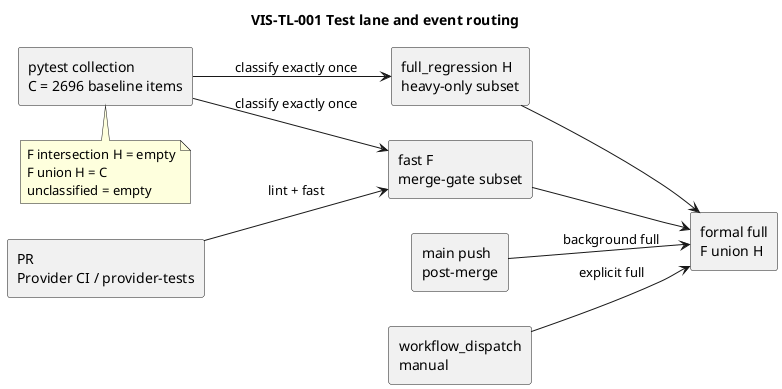
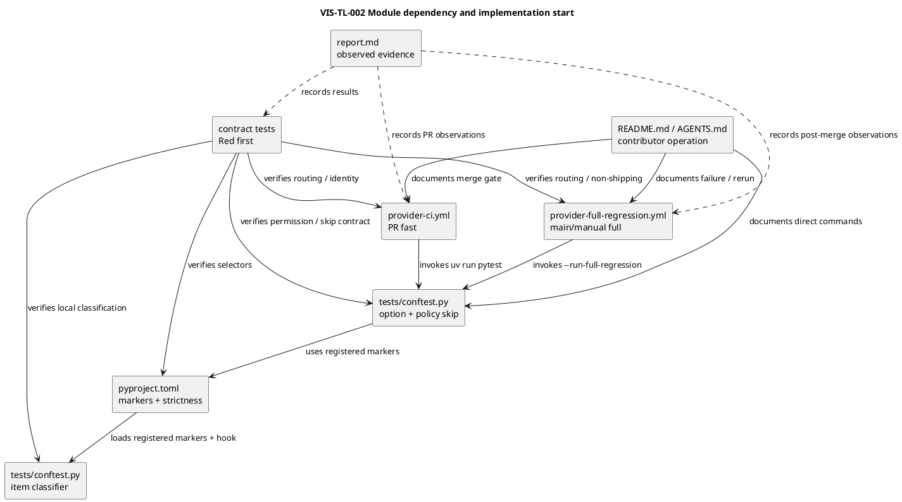

# iss-00342 Reduce Unit Test And Provider CI Runtime — Issue 設計書（Standard）

この文書は、通常開発とPull Request（PR）で使う高速テストレーンと、明示手動実行または`main`更新後に使う完全回帰レーンの責任、集合、コマンド、workflow routing、失敗時の扱いを定義する。

実装順序、TDDサイクル、実測結果は、それぞれ`plan.md`と`report.md`で扱う。

---

## 0. 文書の位置づけ

### この文書が定義すること

- fast / full-regression test itemの分類規則と完全性不変条件
- bare/default pytest、marker selection、明示full permissionのコマンド契約
- PR、`main` push、`workflow_dispatch`のevent routing
- merge前に残す代表的CLI / provider parity contract
- post-merge failureの観測、再実行、rollback
- 実装計画で検証すべき設計保証

### この文書が定義しないこと

- 長時間テスト自体の全面的な高速化
- schedule / cronの追加
- branch protection設定の変更
- release / deployment automation
- Red-Green-Refactorの具体的な実行順序

### 設計コミットメント

| タグ | 意味 | 変更条件 |
|---|---|---|
| `[N]` | 実装が必ず従う設計契約 | 設計書更新とfresh reviewが必要 |
| `[P]` | 現時点の有力な実装仮説 | 意味論を維持すればTDD中に変更可能 |
| `[I]` | 理解のための例示 | 実装を拘束しない |
| `[O]` | 未解決事項 | 指定段階までに解決する |
| `[E]` | このIssueの判断範囲外 | 上位文書または後続Issueへ送る |

## 1. 等級Standard確認

### 1.1 Standardとして扱う理由

- test selector、repo-local commands、provider workflow、contributor docsに閉じた可逆変更である。
- product runtime、公開`spec-dock` CLI、workspace schema、永続データを変更しない。
- merge protectionに関わるためtest omission riskは高いが、既存のPR full commandへ戻すrollbackがある。
- Standardに必要なsystem-architect evidence、collection completeness、fresh spec reviewを使用する。

### 1.2 Standardの前提

- [x] 公開product API、公開CLI contract、external event schemaを変更しない
- [x] 既存workspace layoutの破壊的変更を行わない
- [x] migrationまたは永続データ変換を伴わない
- [x] secret / credential / security / privacy領域を変更しない
- [x] 切り戻し可能である
- [x] 単一Issueのprovider test policyに閉じる
- [x] GitHub上の設定変更やIssue/PR mutationを実装に含めない

### 1.3 引き上げガード

次が必要になった場合は実装を停止し、Gradeとscopeを再評価する。

- public `spec-dock` CLI、scaffold、template、generated metadataの変更
- workflow permissionまたはsecret / credentialの追加
- credentialed branch protection変更
- release gate、deployment、external consumer workflowの変更
- migration、破壊的変更、rollback不能な変更

## 2. 設計意図

### 2.1 解決したい設計問題

- 現在の`uv run pytest`は2,696 itemsの完全回帰であり、通常開発とPRを30〜40分の経路へ結合している。
- `tests/unit/infra/test_init_update.py`と`tests/cli_runtime/`へ長時間処理が集中する一方、merge前に必要な代表的contractも同じ集合に含まれる。
- 現行workflowは`push`と`pull_request`の双方で同じ完全回帰を実行し、同一SHAの重複実行を生じ得る。

### 2.2 採用する設計方針

- `[N]` 全test itemを`fast`または`full_regression`のちょうど一方へ分類する。
- `[N]` bare/default pytestはfast bodyを実行し、selected `full_regression` itemをstable reason付きpolicy skipにする。
- `[N]` formal full commandは`--run-full-regression`を明示し、repository policy skipなしで論理的な全集合を実行する。
- `[N]` PRは既存`Provider CI` / `provider-tests` identityを維持したfast merge gateだけを実行する。
- `[N]` `main` pushと`workflow_dispatch`は独立workflowでformal full commandだけを実行する。
- `[N]` schedule / cronは導入しない。
- `[N]` post-merge full failureはredのまま可視化し、maintainerがforward fixまたはrerunする。既存mergeを遡ってblockしない。
- `[N]` pytest native option `--run-full-regression`でlong itemの実行許可を表し、`-m` selectionと分離する。
- `[P]` pytest native markerとcollection hookを使い、追加dependencyや独自wrapperを導入しない。

### 2.3 採用しない方針

| 方針 | 採用しない理由 |
|---|---|
| full regressionをPR merge gateに残す | ユーザーが解消したいcritical-path bottleneckを維持する |
| schedule / cronを追加する | 今回の明示判断で非採用であり、運用複雑性を増やす |
| 長時間testを削除、skip、xfailする | coverage obligationを静かに弱める |
| `tests/unit`全体をfastとみなす | 実測で約98%が単一heavy fileに集中しており、目的を達成しない |
| heavy testsを`tests/integration`へ移す | external boundaryではないlocal testの意味を歪める |
| pytest-xdist / sharding / cacheを導入する | lane分離に不要で、このIssueのscopeを広げる |
| 単一workflow内の複雑なevent conditional | routing inspectionとcheck identityを複雑にする |
| default `addopts = -m fast`を追加する | `-m full_regression` aloneが意図しないopt-inになり、focused longがreason付きskipにならない |
| 恒久的skipをlong分類に使う | full modeでlegitimate skipと安全に区別して解除できない |

## 3. 正本・根拠（Normative Sources）

| 種別 | パス・識別子 | このIssueへの意味 |
|---|---|---|
| Issue requirement | `requirement.md` | AC-001〜011、BH-001〜007、CON-001〜004 |
| accepted ADR | `artifacts/20260728t025412z-adr-separate-fast-merge-gate-and-full-regression-execution.md` | Option Aとno-schedule policy |
| accepted ADR | `artifacts/20260728t105349z-03-adr-use-direct-pytest-commands-with-explicit-full-regression-opt-in.md` | direct pytestと明示full permission |
| answered interview | `artifacts/20260728t015759z-01-interview-full-regression-merge-gate-policy.md` | owner intent |
| research | `artifacts/20260728t015759z-research-unit-test-and-provider-ci-runtime-investigation.md` | timings、collection、workflow baseline |
| existing workflow | `.github/workflows/provider-ci.yml` | `Provider CI` / `provider-tests` compatibility authority |
| pytest config | `pyproject.toml` | marker registryとstrictnessの配置 |
| pytest hook | `tests/conftest.py` | option、early classification、conditional policy skip |
| test collection | `tests/` | full collection authority |
| existing contract tests | `tests/unit/cli/test_cli_smoke.py`、`tests/unit/infra/test_init_update.py` | required-fast inventory |
| contributor docs | `README.md`、`AGENTS.md` | local commandとfailure operation |
| advisory evidence | `oracle:iss00342-test-ci-planning` | partially adopted。正本ではない |
| advisory evidence | `oracle:iss00342-pytest-opt-in-authoring` | direct command amendment candidate。正本ではない |

正本の優先順位は、accepted ADR → Issue requirement → Issue design → Issue plan → artifacts / advisory draftとする。

## 4. 要件から設計への追跡

| Requirement | 設計ID | 設計上の扱い |
|---|---|---|
| AC-001、BH-001 | `DES-TL-001`、`DES-TL-003` | total classifierとconditional policy skip |
| AC-002、BH-002 | `DES-TL-001`、`DES-TL-003` | disjoint unionとformal full command |
| AC-003、BH-003 | `DES-TL-004` | PR-only fast workflow、identity維持 |
| AC-004、BH-004 | `DES-TL-005` | `main` pushのpost-merge full |
| AC-005、BH-005、BH-006 | `DES-TL-003`、`DES-TL-005` | local/manual full、`workflow_dispatch`、no schedule |
| AC-006 | `DES-TL-002` | required-fast representative inventory |
| AC-007 | `DES-TL-001`、`DES-TL-006` | collection / skip / assertion delta guard |
| AC-008 | `DES-TL-006` | paired local measurementsと3 PR observations |
| AC-009 | `DES-TL-004`、`DES-TL-005`、`DES-TL-006` | deterministic event matrix test |
| AC-010、BH-007 | `DES-TL-005`、`DES-TL-007` | red run visibility、owner、rerun |
| AC-011 | `DES-TL-007` | PR full rollback |
| CON-001〜004 | `DES-TL-001`〜`DES-TL-007` | policy authority、provider boundary、no schedule、no weakening |

## 5. 継承制約と変更禁止領域

### 5.1 上位から継承する制約

- `[N]` repo-localで再現可能なminor maintenance issueとして閉じる。
- `[N]` provider-side source of truthとdogfooding workspaceの関係を変更しない。
- `[N]` local subprocess、filesystem、tempdir、local git、stub `gh`をexternal integrationへ再分類しない。

### 5.2 このIssueで変更しないもの

| 対象 | 理由 |
|---|---|
| `src/spec_dock/**` product implementation | test execution policyだけを変更する |
| `src/spec_dock/assets/install_root/**` | provider-only workflowはconsumerへshipしない |
| `src/spec_dock/assets/spec_dock/**` | scaffold/runtime contract変更ではない |
| root `spec-dock/**` dogfooding data | consumer workspace migrationは不要 |
| test assertions / product behavior | 性能目的のcoverage weakeningを禁止する |
| GitHub branch protection | credentialed mutationはscope外 |

### 5.3 このIssueで判断してはいけないもの

| 判断 | 扱い |
|---|---|
| schedule運用を追加する | scope expansionとしてownerへ戻す |
| full failureから自動Issue作成する | 後続Issue候補 |
| long test内部を大規模最適化する | 別Issue候補 |
| release / deployment gateを変える | 上位設計へ昇格 |

## 6. 現状（Current State）

### 6.1 現在の振る舞い

- full collectionは2,696 items。
- `uv run pytest`、PR、pushはいずれも完全回帰を選ぶ。
- `tests/unit/infra/test_init_update.py`は553 items、`tests/cli_runtime/`は1,269 itemsで、主要bottleneckである。
- unit観測380.19秒のうち、`test_init_update.py`を除く部分は5.45秒だった。
- Provider CIの近時中央値は38.1分である。
- marker、stable fast/full Make target、manual full workflowは存在しない。

### 6.2 現在の構造

| 対象 | 現在の責務 |
|---|---|
| `pyproject.toml` | `testpaths = ["tests"]`のみ |
| `Makefile` | `lint`のみ |
| `.github/workflows/provider-ci.yml` | push / PR双方でlintとfull pytest |
| `tests/` | directoryとnode IDはあるがlane contractはない |
| `README.md`、`AGENTS.md` | full / fast / post-merge operationを未定義 |

## 7. 目標設計差分（Target Design Delta）

| 設計ID | 種別 | 目標 | 固定度 |
|---|---|---|---|
| `DES-TL-001` | classification | 全itemをfast / full_regressionの排他的かつ完全な2集合にする | `[N]` |
| `DES-TL-002` | merge contract | heavy prefix内から7つのrepresentative nodeをrequired-fastとして固定する | `[N]` |
| `DES-TL-003` | command | bare pytestはordinary policy、`--run-full-regression`は明示permission、`-m` aloneはpermissionでない | `[N]` |
| `DES-TL-004` | PR workflow | `Provider CI` / `provider-tests`を維持し、PRでlint + fastだけを実行 | `[N]` |
| `DES-TL-005` | full workflow | 独立workflowが`main` push / manualでfullだけを実行し、scheduleを持たない | `[N]` |
| `DES-TL-006` | verification | collection、routing、coverage delta、performanceを再現可能に検証 | `[N]` |
| `DES-TL-007` | operation | full failureのowner / rerun / rollbackを文書化 | `[N]` |

### 7.1 非目標

- full regression自体のduration SLAを設定しない。
- 120秒local / 10分PRは非blocking targetであり、hard acceptance thresholdにしない。
- test fileの大規模移動やtest taxonomy再編をしない。

## 8. 視覚的な設計概要

### 8.0 図表一覧

| Diagram ID | 種類 | 固定度 | 目的 | 関連設計 | 状態 |
|---|---|---|---|---|---|
| `VIS-TL-001` | activity / set flow | `[N]` | lane集合とevent routingを固定する | `DES-TL-001`〜`005` | ready for review |
| `VIS-TL-002` | module dependency | `[N]` | 変更対象の依存方向と実装起点を固定する | `DES-TL-001`〜`007` | ready for review |

### 8.1 VIS-TL-001: 実行レーンとevent routing

- 固定度: `[N]`
- 関連設計: `DES-TL-001`〜`DES-TL-005`
- Question answered:
  - full collectionをどの集合へ分類し、各GitHub eventがどの集合を実行するか。
- Scope:
  - repo-root full collection、fast / full-regression集合、PR、`main` push、`workflow_dispatch`。
- Excluded details:
  - private helper、pytest hookの関数分割、YAML expressionの具体構文、実測duration。
- Update trigger:
  - lane algebra、event truth table、formal command、`provider-tests` identityのいずれかを変更するとき。



図にない`schedule`とnon-`main` pushは、どちらのworkflowも起動しない。

### 8.2 VIS-TL-002: module dependencyと実装起点

- 固定度: `[N]`
- 関連設計: `DES-TL-001`〜`DES-TL-007`
- Question answered:
  - test-lane contractをどのartifactが所有し、どの依存順でTDD実装するか。
- Scope:
  - classifier、pytest option / policy skip、provider workflows、contract tests、contributor docs、report evidence。
- Excluded details:
  - product runtime、consumer scaffold内部、private test helper、GitHub branch protection設定。
- Update trigger:
  - source of record、allowed path、workflowから呼ぶentrypoint、contract testの責任を変更するとき。



実装起点はcontract testsである。classifier / pytest option / policy skipをGreenにした後、workflow routing、docsの順に進め、観測結果は最後に`report.md`へ集約する。

## 9. 振る舞い設計

### DES-TL-001: total test classifier

- 固定度: `[N]`
- Trigger: pytest collection
- Actor: `tests/conftest.py`のcollection hook
- Input: collected `pytest.Item.nodeid`、既存marker、heavy prefix、required-fast inventory
- Decision rules:
  1. `fast`と`full_regression`の両markerがあるitemはcollection error。
  2. 今回収集されたitemがrequired-fast nodeなら`fast`とする。`full_regression`明示markerがあればcollection error。
  3. heavy prefix配下のitemは`full_regression`とする。required-fast以外の明示`fast` markerがあればcollection error。
  4. heavy prefix外の明示`full_regression` itemは`full_regression`とする。
  5. その他のitemは`fast`とする。
  6. hook完了時に、今回収集された全itemがちょうど一方のmarkerだけを持たなければcollection error。
- Postconditions:
  - collection hookはpartial / focused collectionにも適用でき、収集subsetにrequired-fast全件またはheavy itemがなくても成功する。
  - 今回収集された集合`S`について、各itemはexactly one markerを持つ。
  - repo-root full collectionの集合不変条件はhookへ無条件に課さず、専用contract verifierで検査する。
- Full-collection contract:
  - `C`をrepo-root full collection、`F`をfast、`H`をfull-regressionとすると、`F ∩ H = ∅`、`F ∪ H = C`、`|H| > 0`。
  - 未分類集合`U = C - (F ∪ H)`は空。
  - required-fast 7 nodeがすべて存在し、`F`に含まれる。
- Must not happen:
  - new testがselectorから静かに漏れること。
  - explicit marker conflictが黙って優先順位解決されること。
  - `pytest path::node`のようなfocused実行が、収集対象外nodeの欠落または`H=0`だけを理由に失敗すること。

### DES-TL-002: initial inventory

#### Heavy prefixes

- `tests/cli_runtime/`
- `tests/integration/`
- `tests/manual_tests/`
- `tests/unit/infra/test_init_update.py::`

#### Required-fast node IDs

次の7 nodeはheavy prefixより優先してfastに残す。

1. `tests/unit/cli/test_cli_smoke.py::TestCliSmoke::test_active_set_legacy_flag_reports_parser_error`
2. `tests/unit/cli/test_cli_smoke.py::TestCliSmoke::test_active_set_by_id_succeeds_through_runtime_subprocess`
3. `tests/unit/infra/test_init_update.py::TestInitUpdate::test_checked_in_dogfooding_mirror_docs_match_provider_assets`
4. `tests/unit/infra/test_init_update.py::TestInitUpdate::test_checked_in_dogfooding_mirror_templates_match_provider_assets`
5. `tests/unit/infra/test_init_update.py::TestInitUpdate::test_issue_68_workflow_seed_matches_repo_root_ci_workflow`
6. `tests/unit/infra/test_init_update.py::TestInitUpdate::test_issue_68_provider_only_workflow_is_not_shipped_via_install_root`
7. `tests/unit/infra/test_init_update.py::TestInitUpdate::test_issue_71_checked_in_dogfooding_agent_tooling_parity_matches_install_root_assets`

選定理由:

- 1〜2はCLI bootstrap、success / failure exit、代表output / errorをsubprocess boundaryで保持する。
- 3〜7はprovider-side authority、dogfooding mirror、workflow seed、install-root非配送の代表contractを保持する。
- 初期観測ではCLI 2 nodeが2.00秒、parity 5 nodeが0.07秒であり、merge前シグナルとして費用が小さい。
- exact inventoryの変更は設計契約変更としてreviewし、単なる速度理由で削除しない。

初期分類見込みは`F=661`、`H=2035`、`U=0`である。これは実装前snapshotであり、完了時はcurrent checkoutの実測item ID集合をauthorityとする。

### DES-TL-003: local / CI command contract

`pyproject.toml`はmarker registryとstrictnessだけを持つ。

```toml
[tool.pytest.ini_options]
testpaths = ["tests"]
addopts = ["--strict-markers"]
markers = [
  "fast: default provider test lane used during development and pull requests",
  "full_regression: long-running provider regression excluded from the default lane",
]
```

固定contract:

- bare `uv run pytest`と`uv run pytest tests/unit`はselected heavy itemへpolicy skipを追加し、heavy body実行数を0にする。
- focused heavy without flagはstable reason付きskip、exit 0とする。
- `uv run pytest -m full_regression`はheavy-only selectorだがpermissionを与えず、selected heavyをpolicy skipする。
- `uv run pytest --run-full-regression`は`F ∪ H`を選択し、repository policy skipを追加しないformal full entrypoint。
- `uv run pytest --run-full-regression -m full_regression`はrunnable heavy-only entrypoint。
- full flagはexisting skip / skipif / xfailを削除・上書きしない。
- contributorとworkflowはMake wrapperを必須とせずdirect pytest commandを使う。

### DES-TL-004: PR fast workflow

- `.github/workflows/provider-ci.yml`のworkflow name `Provider CI`とjob key/name `provider-tests`を維持する。
- triggerは`pull_request`だけとする。
- existing Python 3.11 setupとinstall stepを維持する。
- test stepsは`make lint`と`uv run pytest`。
- full command、full job、push、scheduleを含めない。
- fork PRでも通常の`pull_request` eventから同identityのcheckが作られる。

### DES-TL-005: post-merge / manual full workflow

- 新規`.github/workflows/provider-full-regression.yml`をprovider-only workflowとして置く。
- trigger:
  - `push.branches: [main]`
  - `workflow_dispatch`
- triggerに`pull_request`、non-`main` push、`schedule`を含めない。
- job key/nameは`provider-full-regression`、commandは`uv run pytest --run-full-regression`。
- `continue-on-error`を設定せず、failureはred runとして残す。
- workflow permissions、secret、live external credentialを追加しない。
- `main` push concurrencyは同branchの古いin-progress runをcancelし、最新SHAのrunを残す。
- manual runはpush runと別groupにし、別manual runやpushによって暗黙cancelしない。
- fullがfast集合を内包するため、同eventで別fast jobを起動しない。

Event truth table:

| Event | Fast merge gate | Full regression |
|---|---:|---:|
| `pull_request` | yes | no |
| non-`main` `push` | no | no |
| `main` `push` | no | yes |
| `workflow_dispatch` | no | yes |
| `schedule` | no | no |

### DES-TL-006: verification and evidence

- selector unit/contract testを`tests/unit/test_provider_test_lanes.py`へ追加する。
- collection hookは今回収集されたitemのexactly-one分類だけを保証する。
- repo-root full collectionを対象にする専用contract verifier/testは少なくとも次を機械的に確認する:
  - `F ∩ H = ∅`
  - `F ∪ H = C`
  - `U = ∅`
  - `|H| > 0`
  - required-fast 7 nodeの存在とfast分類
  - conflict / forbidden overrideがcollection error
  - default / fastではheavy item実行数0
  - formal fullのcollectionが`F ∪ H`
- workflow regression testはYAML parser dependencyを追加せず、既存`test_init_update.py`のdeterministic text inspectionを拡張してevent matrix、job identity、direct command、no scheduleを検証する。
- provider-only non-shipping testは`provider-ci.yml`と`provider-full-regression.yml`の双方について、`src/spec_dock/assets/install_root/.github/workflows/`に存在せず、代表的なinit / update targetへ生成されないことを明示assertする。
- before / afterについてfull node ID集合、count、skip / xfail、test deletion / assertion changeをdiffする。
- local fast / fullは同一checkout・Python・cache条件で3組測定し、各組でfast < fullを確認する。
- PR `provider-tests`はqueueを除くstarted-to-completed elapsedを3 run記録し、各runがbaseline median 38.1分未満であることを確認する。
- local 120秒、PR 10分は非blocking targetとして観測する。
- 30〜40分のfull regressionは最終統合状態まで実行を保留し、AC-008の最終計測batchでfast / fullのpaired runを3組実行する。この3回をfinal full evidenceにも兼用し、途中工程で同じfullを無用に繰り返さない。

### DES-TL-007: failure operation and rollback

- post-merge full failure ownerはrepository maintainer。
- GitHub Actionsの`Provider Full Regression` runからSHA、failed test、log、duration、summaryを確認する。
- local reproductionは同SHAで`uv run pytest --run-full-regression`。
- 通常対応はforward fixまたはGitHub Actions rerun。自動rollback / Issue作成はしない。
- selector漏れ、required check欠落、許容不能なescapeが判明した場合:
  1. `.github/workflows/provider-ci.yml`のPR test commandを`uv run pytest --run-full-regression`へ戻す。
  2. policy skipによる誤操作が問題ならflagなしpolicy追加を無効化する。
  3. markers、manual full command、full workflow、計測証跡は保持する。
  4. 修正したclassifierをfresh reviewし、fast gate再導入を別判断する。

## 10. 責任モデル

| 構成要素 | 責任 | Must Not Do | 設計ID |
|---|---|---|---|
| `tests/conftest.py` | total classification、full option、conditional policy skip | legitimate skipを解除する | `DES-TL-001`、`002`、`003` |
| `pyproject.toml` | marker登録とstrictness | default selectionを変更する | `DES-TL-003` |
| `provider-ci.yml` | PR merge gate | push / full / scheduleを実行する | `DES-TL-004` |
| `provider-full-regression.yml` | main post-merge / manual full | PR required checkになる | `DES-TL-005` |
| `test_provider_test_lanes.py` | classifier / collection contract | product behaviorを再検証する | `DES-TL-006` |
| existing parity test | workflow / shipped-asset boundary contract | provider-only workflowをinstall_rootへshipする | `DES-TL-006` |
| `README.md` / `AGENTS.md` | contributor commandとfailure operation | schedule採用を示す | `DES-TL-007` |
| `report.md` | measurements / delta / execution evidence | planned値を実測として扱う | `DES-TL-006`、`007` |

## 11. インターフェース・契約差分

| Contract | 影響 | 内容 |
|---|---|---|
| public product CLI / API | none | `spec-dock` runtimeは不変 |
| local contributor command | changed | ordinary pytestを維持し、`--run-full-regression`だけを明示opt-inとして追加 |
| GitHub check identity | compatible | `Provider CI` / `provider-tests`を維持 |
| GitHub event routing | changed | PR fast、main/manual fullへ分離 |
| scaffold / template | none | provider-only workflowをshipしない |
| metadata / persistent state | none | migrationなし |

## 12. データ・状態・生成物差分

- product data、SpecDock metadata、active stateに変更なし。
- `.assurance.json`はauthoring lifecycleにより更新され得るが、実装contractの変更対象ではない。
- workflow YAMLはrepository provider運用物であり、`src/spec_dock/assets/install_root/.github/`へ複製しない。
- full test resultはGitHub Actions runとして残るが、application data persistenceではない。

## 13. 失敗・境界・互換性設計

| Failure ID | 条件 | 期待される扱い | 観測点 |
|---|---|---|---|
| `FAIL-TL-001` | itemが両markerまたは無分類 | collection error、test実行を開始しない | pytest stderr |
| `FAIL-TL-002` | repo-root full collectionでrequired-fast node消失 / heavy 0件 | dedicated full-collection contract failure | focused contract test |
| `FAIL-TL-003` | PR workflowがfullを参照 | deterministic workflow test failure | focused unit test |
| `FAIL-TL-004` | scheduleまたは誤event追加 | event matrix test failure | focused unit test |
| `FAIL-TL-005` | main post-merge full failure | workflowをredで保持し、maintainer対応 | Actions run |
| `FAIL-TL-006` | required check identity欠落 | PR fullへrollbackし、再計画 | PR checks |
| `FAIL-TL-007` | full collection delta | unexplained deltaなら完了をblock | report + node ID diff |

互換性:

- existing `provider-tests` identityを維持する。
- bare pytestの意味は意図的にfullからfastへ変わるため、formal full commandをREADME / AGENTSへ明示する。
- existing test node IDsとdirectory layoutを不必要に変更しない。

## 14. セキュリティ・プライバシー確認

| 項目 | 影響 | 備考 |
|---|---|---|
| 認証 / 認可 | none | workflow permission拡張なし |
| secret / token / credential | none | 追加しない |
| 個人情報 / 機微情報 | none | 対象外 |
| log | local | pytest / Actionsの既存test logのみ |
| external API | none | branch protection mutationなし |

## 15. 観測性・証跡設計

| Evidence ID | 観測対象 | 証拠 |
|---|---|---|
| `EVD-TL-001` | C / F / H / U集合 | collect-only node ID、count、set差分 |
| `EVD-TL-002` | required-fast inventory | focused pytest |
| `EVD-TL-003` | ordinary / marker-only / explicit full command | command、selection、policy skip、executed count、exit、duration |
| `EVD-TL-004` | workflow truth table / identity | deterministic testとYAML diff |
| `EVD-TL-005` | local performance | same-condition paired 3 runs |
| `EVD-TL-006` | PR performance | 3 GitHub runsのSHA / elapsed / counts |
| `EVD-TL-007` | post-merge operation | full run URL / SHA / result / rerun path |
| `EVD-TL-008` | coverage weakening guard | before / after node、skip、xfail、assertion delta |

実測は`report.md`へ記録し、planned countやChatGPT提案値をobserved resultとして代用しない。

## 16. 文書・template・skill影響

### 16.1 Linux tree形式の変更計画

凡例: `[A]` add、`[M]` modify、`[R]` read-only / must remain unchanged。

```text
.
├── tests/
│   ├── conftest.py                                      [A] collected-item classifier
│   └── unit/
│       ├── test_provider_test_lanes.py                  [A] lane / command / routing contract
│       └── infra/
│           └── test_init_update.py                      [M] parity and provider-only non-shipping
├── pyproject.toml                                       [M] markers and strict markers only
├── Makefile                                             [R] existing lint command only
├── .github/
│   └── workflows/
│       ├── provider-ci.yml                              [M] pull_request lint + fast
│       └── provider-full-regression.yml                 [A] main push / manual full
├── README.md                                            [M] contributor commands and failure operation
├── AGENTS.md                                            [M] agent test contract
├── src/
│   └── spec_dock/
│       └── assets/                                      [R] provider-only workflows must not be shipped
└── spec-dock/
    ├── initiatives/
    │   └── init-00079-minor-bugfix-maintenance/
    │       └── epics/
    │           └── epic-00080-minor-bug-fixes/
    │               └── issues/
    │                   └── iss-00342-reduce-unit-test-and-provider-ci-runtime/
    │                       ├── requirement.md            [R] amend only after re-review
    │                       ├── design.md                 [R] amend only after re-review
    │                       ├── plan.md                   [R] amend only after re-review
    │                       └── report.md                 [M] implementation and verification evidence
    ├── docs/                                            [R] no scaffold refresh
    ├── scripts/                                         [R] no scaffold refresh
    ├── system/                                          [R] no scaffold refresh
    └── templates/                                       [R] no scaffold refresh
```

### 16.2 変更対象と主要依存

| Path | 更新理由 | 必須 |
|---|---|---:|
| `tests/conftest.py` | collected itemをpartial-safeにexactly-one laneへ分類する | yes |
| `tests/unit/test_provider_test_lanes.py` | full completeness、focused collection、commands、routingをRed-firstで固定する | yes |
| `tests/unit/infra/test_init_update.py` | provider workflow parityと2つのprovider-only workflow非配布を固定する | yes |
| `README.md` | fast / full command、post-merge failure operation、rollback | yes |
| `AGENTS.md` | agent向けdefault / explicit full contract | yes |
| `pyproject.toml` | marker / selector contract | yes |
| `.github/workflows/provider-ci.yml` | PR fast routing | yes |
| `.github/workflows/provider-full-regression.yml` | main/manual full routing | yes |
| `src/spec_dock/assets/**` | provider-only policyのため変更しない | no |
| `spec-dock/**` dogfooding workspace | scaffold反映不要 | no |

主要依存:

- contract tests → classifier / pytest option / policy skip → workflows → docs / report。
- provider workflows → direct pytest commands。workflowへmarker expressionを複製しない。
- non-shipping tests → root workflowと`src/spec_dock/assets/install_root/`、代表init / update target。
- `src/spec_dock/assets/**`またはIssue外`spec-dock/**`に変更が必要になった場合は停止して設計を再reviewする。

## 17. 検討した代替案

| ID | 代替案 | 利点 | 欠点 | 採否 |
|---|---|---|---|---|
| `ALT-TL-001` | PR fullを維持して内部最適化 | coverage gate不変 | 大規模最適化が先行し、待ち時間を直ちに解消しない | rejected |
| `ALT-TL-002` | fast PR + manual fullだけ | 単純 | main上の回帰を自動検知しない | rejected |
| `ALT-TL-003` | fast PR + scheduled full | mainと独立して定期検知 | ownerが複雑性を避けると判断 | rejected |
| `ALT-TL-004` | fast PR + main post-merge + manual full | critical pathを短縮しつつfullを保持 | failure対応は事後になる | adopted |
| `ALT-TL-005` | one workflow + conditionals | file数が少ない | event matrixとcheck identityが読みにくい | rejected |
| `ALT-TL-006` | two workflows | responsibilityとtriggerが明確 | workflow fileが1つ増える | adopted |

## 18. 実装へ委譲する設計仮説

| Hypothesis ID | 内容 | 制約 | 判断タイミング |
|---|---|---|---|
| `HYP-TL-001` | collection helperのprivate関数分割 | `DES-TL-001`不変条件を変えない | TDD / refactor |
| `HYP-TL-002` | workflow concurrency expressionの具体的YAML表現 | latest main SHAを残し、manualを暗黙cancelしない | implementation |
| `HYP-TL-003` | contract testのsubprocess helper再利用 | 新dependencyを追加せず、実コマンド意味論を検証する | TDD |
| `HYP-TL-004` | README / AGENTSの配置と文言 | commands、no schedule、failure owner、rollbackを欠落させない | docs update |

実装中に変更してはいけないもの:

- 2集合のtotal / disjoint contract
- exact initial required-fast inventory
- event truth table
- `Provider CI` / `provider-tests` identity
- no schedule
- formal fullが`F ∪ H`であること
- post-merge failureがmerge blockerではないこと

## 19. 検証への含意

| 設計ID | 検証すべき内容 | Level | Evidence |
|---|---|---|---|
| `DES-TL-001` | total / disjoint / non-empty heavy / conflict failure | unit + CLI collection | `EVD-TL-001` |
| `DES-TL-002` | 7 nodeの存在、分類、代表contract | focused unit / subprocess | `EVD-TL-002` |
| `DES-TL-003` | bare/marker-only/fullのselection、permission、policy skip | pytest CLI / hook | `EVD-TL-003` |
| `DES-TL-004` | PR-only、identity、lint + fast | contract test / inspection | `EVD-TL-004` |
| `DES-TL-005` | main/manual full、no schedule、concurrency | contract test / Actions observation | `EVD-TL-004`、`007` |
| `DES-TL-006` | collection delta、3 paired local、3 PR runs | automated + manual evidence | `EVD-TL-005`、`006`、`008` |
| `DES-TL-007` | owner / rerun / rollback docs | docs review | `EVD-TL-007` |

## 20. 計画への引き渡し

### 20.1 固定設計契約

- `DES-TL-001`: total / disjoint classifier
- `DES-TL-002`: heavy prefixesとrequired-fast 7 node
- `DES-TL-003`: ordinary pytest、marker-only非許可、explicit full permission
- `DES-TL-004`: PR-only fastとexisting identity
- `DES-TL-005`: main/manual full、no schedule
- `DES-TL-006`: completeness / routing / performance evidence
- `DES-TL-007`: failure operationとrollback

### 20.2 Behavior Backlog Seeds

| Seed ID | 振る舞い / 成果 | Design | Requirement |
|---|---|---|---|
| `B-SEED-TL-001` | classifierが全itemを排他的に分類し、invalid inventoryをfail-closeする | `DES-TL-001`、`002` | AC-001、002、006、007 |
| `B-SEED-TL-002` | ordinary / marker-only / explicit full commandがselectionとpermissionを分離する | `DES-TL-003` | AC-001、002 |
| `B-SEED-TL-003` | PRがexisting identityでfastだけを実行する | `DES-TL-004` | AC-003、009 |
| `B-SEED-TL-004` | main/manualがfullだけを実行し、scheduleがない | `DES-TL-005` | AC-004、005、009 |
| `B-SEED-TL-005` | collection / coverage / performance evidenceがreportに残る | `DES-TL-006` | AC-007、008 |
| `B-SEED-TL-006` | full failureの確認、rerun、rollbackが再現可能である | `DES-TL-007` | AC-010、011 |

### 20.3 推奨検証ゲート

1. baseline full node ID集合を固定する。
2. classifier / command / routingのRed testを先に追加する。
3. focused classifier testsとcollect-only set algebraを通す。
4. lintとfast laneを通す。
5. docs / workflow contractをfresh reviewする。
6. 最終統合状態で同条件のfast / fullを3組まとめて計測し、その3回をfinal full evidenceにも兼用する。
7. PR作成後に`provider-tests` 3 runとmain post-merge runを観測する。

### 20.4 停止・再計画条件

- [x] Red理由が想定外なら原因確認まで実装を進めない
- [x] full collectionにunexplained deltaがあれば完了しない
- [x] required-fast contractを維持できない場合は設計へ戻る
- [x] `provider-tests` identityを維持できない場合はPR fullへrollbackする
- [x] schedule、permission、credential、branch protection mutationが必要ならscope確認する
- [x] public product contract、scaffold、migrationへ影響するならGradeを再評価する
- [x] latest main SHAのfull runを保証できない場合はworkflow設計を再reviewする

## 21. 未確定事項

- owner判断が必要な未解決事項: なし。
- `HYP-TL-001`〜`004`はaccepted policyを変更しない実装内判断として残す。

## 22. 図表レビューチェックリスト

- [x] Diagram IDと固定度がある
- [x] Diagramが`DES-TL-001`〜`007`に対応する
- [x] 図だけに存在する契約がない
- [x] 実装のprivate構造を過剰に固定していない
- [x] event / set relationを文章より明確にする最小の図だけを使用した

## 23. 設計承認チェックリスト

- [x] AC-001〜011をDesign IDへ対応した
- [x] BH-001〜007を振る舞い設計へ反映した
- [x] CON-001〜004を設計制約として扱った
- [x] Standardに留まる理由とescalation guardを記載した
- [x] product public contract / migration / security影響がない
- [x] Current StateとTarget Design Deltaを区別した
- [x] responsibilityとsource of recordを定義した
- [x] TDDへ委ねる仮説と固定契約を区別した
- [x] Behavior Backlog SeedsとVerification Implicationsがある
- [x] runtime substantive判定修正後のfresh `spec-reviewer` R4 passを取得した

## 24. 変更履歴

| Date | Change | Reason | Author |
|---|---|---|---|
| 2026-07-28 | 初稿 | approved requirement、user-selected Option A、system-architect evidenceを統合 | iwasawayuuta |
| 2026-07-28 | approved | R1 / R2 findingsを修正し、fresh R3 `spec-reviewer` passを取得 | iwasawayuuta |
| 2026-07-28 | R4 review pending | §16.1の省略パスがruntime placeholder detectorに誤認されたためexact scope pathへ展開 | iwasawayuuta |
| 2026-07-28 | approved | exact path化が設計意味論を変えずruntime substantive判定と整合することをfresh R4で確認 | iwasawayuuta |
