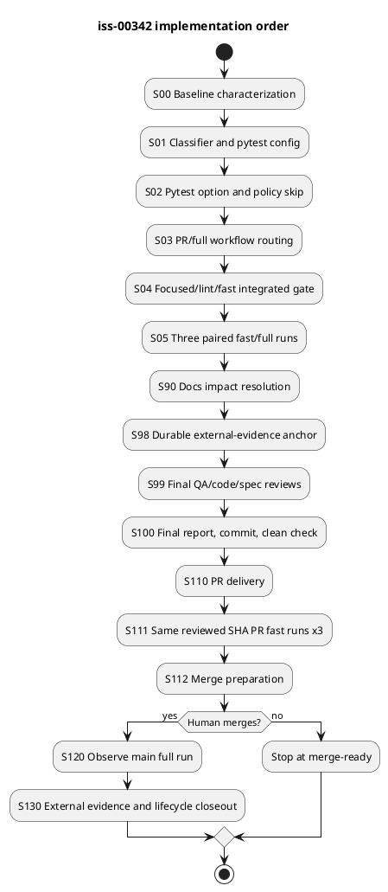

# iss-00342 Reduce Unit Test And Provider CI Runtime — Issue 実装計画書（Standard / TDD）

この文書は、承認済みの`requirement.md`とfresh R4で再承認済みの`design.md`を、通常開発とPRをfast laneへ移し、formal full regressionを明示手動実行と`main` merge後へ分離する実行契約へ落とす。

この計画は実装をまだ開始しない。Red / Green / Refactor、ローカル実測、reviewはS100まで`report.md`へ記録する。S100 final commit後のPR、post-merge、lifecycle観測値は、S98で先に固定して`report.md`へURLをcommitするIssue #342 external-evidence anchorへ記録する。

---

## 0. 文書の位置づけ

### 定義すること

- 実装・検証の順序と依存
- allowed / forbidden paths
- TDD Red、Minimal Green、step closure
- 22個のAC / BH / CON closure
- full regressionの高コスト実行を最終batchへ集約する方法
- fresh review、PR実測、human merge、post-merge観測の境界
- report / post-commit external evidenceの非循環な保存境界
- 停止・rollback、required sync、`issue finish`の終端条件

### 定義しないこと

- 新しい要件または設計判断
- schedule / cron
- test内部の全面高速化
- branch protection mutation
- 実装後の観測結果
- agentによる自動merge

## 1. Plan Readiness

| Artifact / gate | 状態 | 根拠 |
|---|---|---|
| `requirement.md` | approved | requirement-R2 fresh pass |
| `design.md` | approved | design-R4 fresh pass。§16.1 exact path化は設計意味論を変更しない |
| `report.md` | exists | authoring / evidence / reviewer ledgersあり |
| accepted ADR | accepted | Option A、manual + main post-merge、no schedule |
| assurance profile | standard | classify / verify valid、hard triggersなし |
| specialist evidence | usable | system-architect + implementation-planner artifacts |
| owner open question | none | policy、truth table、rollback、performance protocol確定 |

計画開始条件:

- [x] AC-001〜011、BH-001〜007、CON-001〜004が確定している
- [x] `DES-TL-001`〜`DES-TL-007`のR4 fresh review passを取得した
- [x] partial-safe classifierとglobal verifierの責任が分離されている
- [x] no scheduleとhuman merge boundaryが確定している
- [x] known flakyをlaneで隠さない方針がある
- [x] Standard gradeのrollbackとspecialist evidenceがある
- [x] current draft bytesでassurance source bindingをrefresh / verifyする
- [x] canonical planのfresh `spec-reviewer` passを取得する
- [x] approved state反映後のfinal plan bytesでassuranceを再refresh / verifyする

## 2. 実装戦略

### 2.1 TDD方針

```text
baseline characterization
  -> classifier / selector Red
  -> classifier / selector Green
  -> pytest option / policy-skip Red / Green
  -> workflow routing Red / Green
  -> focused / lint / fast integration
  -> final 3-pair fast/full measurement batch
  -> S90 docs impact resolution
  -> S98 durable external-evidence anchor
  -> S99 final QA / code / spec reviews
  -> final report / final commit / clean check
  -> PR delivery
  -> same reviewed SHA PR fast observation x3
  -> merge preparation
  -> human merge boundary
  -> post-merge full observation
  -> external evidence closeout
  -> required sync / validate
  -> issue finish or authorized human closeout handoff
```

- production/config変更より先に、観測可能なcontract testをRedにする。
- active Redは原則1件だけとし、原因を確認してからMinimal Greenへ進む。
- expected Redと異なるfailure、既存regression、unknown Redは即時停止する。
- S00は`characterization-first`、S90は`inspect-only`、S05/S111/S120は`manual-required` evidenceとする。
- 30〜40分のformal fullはS00〜S04で実行せず、S05のfinal acceptance evidenceは同一new SHAのexactly 3回とする。2.2.1のpre-amendment failed attempt 1回を別failure evidenceとして保持し、pre-merge総上限は4回とする。
- S05後の追加fullは、post-merge failureをsame SHAで再現するincident responseに限る。routing確認だけの追加`workflow_dispatch` fullは行わない。

### 2.2 known flakyの扱い

既知候補:

`tests/unit/infra/test_init_update.py::TestInitUpdate::test_issue_187_s430_final_snapshot_timeout_preserves_stable_completion_state`

- skip / xfail / deletion / selector除外を追加しない。
- S00でexact nodeをcharacterizeし、pass/fail/logをそのまま記録する。
- S05 fullにcollect / executeされることを確認する。
- failureをGreenへ読み替えず、`baseline-known-flaky observed failure`としてunexpected regressionと分離する。
- planned full 3回の外でpre-merge full rerunを自動実行しない。exact focused rerunでtriageする。
- known flaky以外のfailure、別node併発、node omissionはunexpected regressionとして停止する。
- 3回のfullの1回でもnonzeroならS05は未完了で、final readinessへ進まない。ownerが原因・risk・follow-upを解消するか、requirement/design/planをamendしてfresh reviewを通すまでpassへ読み替えない。
- human merge後のmain full failureだけは、incident ID、same SHA、理由、回数、結果をS98 external-evidence anchorに記録して`uv run pytest --run-full-regression`を追加実行できる。このincident reproductionはpre-merge総上限4回の外側である。

#### 2.2.1 S05 failed-attempt recovery amendment

- 2026-07-29のS05 Pair 1 formal fullは、current `iss-00342`の`.meta.json`がdogfooding cutover snapshotへ未収載だったためexit 1で停止した。このrunはfailure evidenceとして保持し、AC-008のGreen 3-pair evidenceへ数えない。
- origin fixは`tests/unit/infra/test_init_update.py`の既存static snapshotへcurrent Issue pathと空の`depends_on`を追加するbounded correctionだけとし、assertion、skip、xfail、lane分類を弱めない。
- fixをfresh `code-reviewer`が承認しcommit/cleanを確認した後、manifest変更によりstaleとなるS04を同一契約で再実行し、fresh review/commit/cleanを完了する。
- その後、new SHAとnew `TEST-RELEVANT-MANIFEST`でfast→fullを3組実行し、3組すべてをAC-008のfinal evidenceとする。pre-amendment failure 1回を含むpre-merge formal fullの総上限は4回であり、5回目を自動実行しない。
- recovery後の3組の1回でもnonzero、fast>=full、condition drift、coverage mismatchがあれば再停止し、追加fullを実行しない。

## 3. Scope and Change Surface

### 3.1 Allowed paths

| Path | 操作 | 責任 | Design |
|---|---|---|---|
| `tests/conftest.py` | add | partial-safe item classifier / `dev-coder` | `DES-TL-001`、`DES-TL-002` |
| `tests/unit/test_provider_test_lanes.py` | add | lane / command / routing contract / `dev-coder` | `DES-TL-001`、`DES-TL-003`、`DES-TL-006` |
| `tests/unit/infra/test_init_update.py` | modify | workflow identity / non-shipping tests / `dev-coder` | `DES-TL-002`、`DES-TL-005`、`DES-TL-006` |
| `pyproject.toml` | modify | markers、strict markers only / bounded `utility-worker` config slice | `DES-TL-003` |
| `Makefile` | read-only | existing `lint` command only | `DES-TL-003` |
| `.github/workflows/provider-ci.yml` | modify | pull_request lint + fast / bounded `utility-worker` workflow slice | `DES-TL-004` |
| `.github/workflows/provider-full-regression.yml` | add | main / manual full / bounded `utility-worker` workflow slice | `DES-TL-005` |
| `README.md` | modify by doc-writer | contributor operation | `DES-TL-007` |
| `AGENTS.md` | modify by doc-writer | agent test contract | `DES-TL-007` |
| Issue `report.md` | main orchestrator only | observed evidence | `DES-TL-006`、`DES-TL-007` |

`requirement.md`、`design.md`、`plan.md`は実装中read-onlyとし、契約変更が必要な場合だけamend + fresh reviewする。

### 3.2 Forbidden changes

- `src/spec_dock/**`、`src/spec_dock/assets/**`
- Issue外の`spec-dock/**` consumer workspace
- `.github/workflows/ci.yml`
- branch protection、workflow permission、secret、credential
- schedule / cron
- test deletion、broad skip / xfail、assertion weakening
- testを遅さだけで`tests/integration`へ移すこと
- pytest-xdist、sharding、cache、dependency追加
- public product CLI / API / schema / migration
- automatic rollback、automatic Issue creation、agent merge

禁止pathまたは変更が必要になった場合は実装を停止し、requirement/designへ戻す。

## 4. Execution Overview

### 4.1 Milestones

| Milestone | Steps | 独立成果 | Gate |
|---|---|---|---|
| M0 Baseline Lock | S00 | full node IDs、skip/xfail、known flaky、source条件 | reproducible characterization |
| M1 Local Lane Contract | S01-S02 | classifier、global verifier、bare/fast/full commands | focused + collect-only |
| M2 CI Routing | S03 | 2 workflows、truth table、identity、non-shipping | deterministic tests |
| M3 Integrated Local Gate | S04-S05 | lint/fast Green、coverage delta、3 paired full evidence | local final evidence |
| M4 Docs / Final Review | S90-S99 | docs alignment、durable external-evidence anchor、fresh QA/code/spec passes | final quality evidence |
| M5 Delivery | S100-S112 | final report/commit、PR delivery、same-SHA fast 3 runs、merge-ready | external delivery evidence |
| M6 Post-Merge / Lifecycle Closeout | S120-S130 | latest main full、external evidence、sync/validate、Issue closure | maintainer observation + lifecycle evidence |

### 4.2 Dependency



S05 freshnessはcommit間の全path差分ではなく、test/runtime結果を決める次の`TEST-RELEVANT-MANIFEST`で判定する。

- manifest対象: `tests/**`、`src/**`、`pyproject.toml`、`uv.lock`、`.github/workflows/**`
- S05開始時に、対象となるtracked fileのsorted path、各SHA-256、集約SHA-256、Python/cache条件を記録する。
- S90、S98、S99、S100の各gateで同じmanifestを再計算し、集約SHA-256一致を必須とする。
- `README.md`、`AGENTS.md`、Issue `report.md`、Issue artifacts、`.assurance.json`、external-evidence metadataだけの変更はmanifest対象外であり、それ自体ではS05 evidenceをstaleにしない。S90のfresh spec-reviewerはdocs command/event contract、S98/S99はledger/anchor整合を別途確認する。
- manifest対象の1 byteでも変化した場合、S04を再実行しS05 evidenceをstaleとする。fullを再計測する前にowner disposition、plan amendment要否、fresh reviewer要否を判断し、2.2.1以外ではpre-merge formal full総上限を暗黙に増やさない。
- S99後にmanifest対象またはdocs contractを変更した場合、origin stepへ戻し、該当step review、S90、S99を再実行する。

## 5. Acceptance Envelope

### 5.1 Outcomes

| Outcome | 内容 | AC | Design | Evidence |
|---|---|---|---|---|
| `OUT-TL-001` | default/local/PRがfastでH実行0 | AC-001/003/006 | `DES-TL-001`〜`DES-TL-004` | `EVD-TL-001`〜`EVD-TL-004` |
| `OUT-TL-002` | formal fullがF∪Hでmanual/mainから実行可能 | AC-002/004/005 | `DES-TL-001`、`DES-TL-003`、`DES-TL-005` | `EVD-TL-001`、`EVD-TL-003`、`EVD-TL-004` |
| `OUT-TL-003` | event truth table、identity、no schedule、non-shipping | AC-003〜005/009 | `DES-TL-004`、`DES-TL-005`、`DES-TL-006` | `EVD-TL-004` |
| `OUT-TL-004` | test obligationを弱めず性能差を実測 | AC-007/008 | `DES-TL-006` | `EVD-TL-005`、`EVD-TL-006`、`EVD-TL-008` |
| `OUT-TL-005` | post-merge failureとrollbackが操作可能 | AC-010/011 | `DES-TL-005`、`DES-TL-007` | `EVD-TL-007` |

### 5.2 Must Not Happen

| ID | 内容 | 検出 |
|---|---|---|
| `MNH-TL-001` | focused pytestがglobal required node / H=0で失敗 | partial collection test |
| `MNH-TL-002` | full selectorからitemが漏れる | set equality verifier |
| `MNH-TL-003` | PRでfullまたはpush jobを実行 | workflow truth table |
| `MNH-TL-004` | schedule、permission、secretを追加 | deterministic inspection |
| `MNH-TL-005` | provider workflowsをconsumerへship | init/update non-shipping test |
| `MNH-TL-006` | skip/xfail/assertion weakeningで高速化 | before/after delta + review |
| `MNH-TL-007` | post-merge redを遡及merge failureとして扱う | docs + Actions evidence |

## 6. Spec-Locked Closure Index

`Evidence / report anchor`は、S100までの実行では`report.md`の`Test Contract Closure`、`Closure Coverage`、対応するEVD ledgerへ、S100後の実行ではS98 external-evidence anchorの対応slotへ転記するexact keyである。

| Closure ID | Spec link / Design | Observable input / state | Locked expectation | Bug class guarded | Required | Evidence level | Evidence / report anchor | Owner step / verification path |
|---|---|---|---|---|---|---|---|---|
| `CLOS-TL-AC-001` | AC-001 / `DES-TL-001`,`003` | bare pytest、`tests/unit`、focused pytestのselected/executed node setとcontrolled failure | 3経路すべてH実行0、各failure pathはnonzero | heavy leakage or swallowed default failure | yes | red-required + automated | `EVD-TL-001`,`EVD-TL-003`; `TC-CLOS-TL-AC-001` | S01/S02/S04; `tc-s01-001`,`tc-s01-004`,`tc-s02-001`,`tc-s02-002`,`tc-s04-001` |
| `CLOS-TL-AC-002` | AC-002 / `DES-TL-001`,`003` | root collection C、F/H partition、full selector | F∩H=∅、F∪H=C、U=0、H>0 | silent full omission | yes | red-required + manual-required | `EVD-TL-001`,`EVD-TL-003`,`EVD-TL-005`; `TC-CLOS-TL-AC-002` | S01/S02/S05; `tc-s01-002`,`tc-s02-001`,`tc-s05-001` |
| `CLOS-TL-AC-003` | AC-003 / `DES-TL-004` | PR event、existing workflow/job identity | `Provider CI` / `provider-tests`でlint+fastのみ、full 0 | required-check rename or PR full | yes | red-required + external | `EVD-TL-004`,`EVD-TL-006`; `TC-CLOS-TL-AC-003` | S03/S111; `tc-s03-001`,`tc-s03-002`,`tc-s111-001` |
| `CLOS-TL-AC-004` | AC-004 / `DES-TL-005` | `main` push SHAとfull workflow runs | main pushでfull 1 job、PR重複なし | missing or duplicate post-merge full | yes | red-required + post-merge manual | `EVD-TL-004`,`EVD-TL-007`; `TC-CLOS-TL-AC-004` | S03/S120; `tc-s03-001`,`tc-s120-001` |
| `CLOS-TL-AC-005` | AC-005 / `DES-TL-003`,`005` | direct full command、workflow_dispatch、docs | 同じfull contract、schedule 0、明示手動操作可能 | manual/full contract drift | yes | red-required + inspect-only | `EVD-TL-003`,`EVD-TL-004`,`EVD-TL-007`; `TC-CLOS-TL-AC-005` | S02/S03/S90; `tc-s02-001`,`tc-s03-001`,`tc-s90-001` |
| `CLOS-TL-AC-006` | AC-006 / `DES-TL-002` | required-fast 7 exact node IDs | 7件すべて存在しFに分類、focused実行pass | representative smoke omitted | yes | characterization-first + automated | `EVD-TL-002`; `TC-CLOS-TL-AC-006` | S00/S01/S04; `tc-s00-001`,`tc-s01-002`,`tc-s04-001` |
| `CLOS-TL-AC-007` | AC-007 / `DES-TL-001`,`006` | before/after node、skip、xfail、assertion diff | unexplained delta 0 | coverage weakening by omission | yes | characterization-first + review | `EVD-TL-001`,`EVD-TL-008`; `TC-CLOS-TL-AC-007` | S00/S04/S05/S99; `tc-s00-001`,`tc-s04-001`,`tc-s05-002`,`tc-s99-001` |
| `CLOS-TL-AC-008` | AC-008 / `DES-TL-006` | same-condition local 3 pairsとsame reviewed SHA PR 3 runs | 各local fast<full、各PR run<38.1m baseline | unsubstantiated latency claim | yes | manual-required + external | `EVD-TL-005`,`EVD-TL-006`; `TC-CLOS-TL-AC-008` | S05/S111; `tc-s05-001`,`tc-s111-001` |
| `CLOS-TL-AC-009` | AC-009 / `DES-TL-004`,`005`,`006` | PR/non-main/main/manual/schedule event matrix | yes/no matrixがrequirementと完全一致 | event routing drift | yes | red-required | `EVD-TL-004`; `TC-CLOS-TL-AC-009` | S03; `tc-s03-001` |
| `CLOS-TL-AC-010` | AC-010 / `DES-TL-005`,`007` | main failureのSHA/test/log/owner/rerun record | failureが可視で、ownerとnext actionが残る | silent post-merge red | yes | inspect-only + post-merge manual | `EVD-TL-007`; `TC-CLOS-TL-AC-010` | S90/S120; `tc-s90-001`,`tc-s120-001` |
| `CLOS-TL-AC-011` | AC-011 / `DES-TL-007` | rollback procedureとPR command | PR fastをfullへ戻せ、manual/full evidenceは保持 | unsafe fast gate without rollback | yes | inspect-only + spec review | `EVD-TL-007`; `TC-CLOS-TL-AC-011` | S90/S99/S112; `tc-s90-001`,`tc-s99-001`,`tc-s112-001` |
| `CLOS-TL-BH-001` | BH-001 / `DES-TL-001`,`003` | bare pytest、`tests/unit`、focused pytestと各controlled failing-fast probe | F bodyを実行しH bodyは0、3入口すべてfailureをnonzeroで伝播 | default bypass or swallowed failure | yes | red-required | `EVD-TL-001`,`EVD-TL-003`; `TC-CLOS-TL-BH-001` | S01/S02/S04; `tc-s01-001`,`tc-s01-004`,`tc-s02-001`,`tc-s02-002`,`tc-s04-001` |
| `CLOS-TL-BH-002` | BH-002 / `DES-TL-001`,`003` | explicit full permission | `--run-full-regression`でpolicy skipなしにF∪Hを選択 | full command still policy-skipped | yes | red-required + manual-required | `EVD-TL-001`,`EVD-TL-003`,`EVD-TL-005`; `TC-CLOS-TL-BH-002` | S01/S02/S05; `tc-s01-002`,`tc-s02-001`,`tc-s05-001` |
| `CLOS-TL-BH-003` | BH-003 / `DES-TL-004` | `pull_request` workflow execution | lint+fastのみでfullなし | PR merge blocked by full | yes | red-required + external | `EVD-TL-004`,`EVD-TL-006`; `TC-CLOS-TL-BH-003` | S03/S111; `tc-s03-001`,`tc-s111-001` |
| `CLOS-TL-BH-004` | BH-004 / `DES-TL-005` | human merge後のlatest main SHA | post-merge fullが1件起動 | missing background regression | yes | red-required + post-merge manual | `EVD-TL-004`,`EVD-TL-007`; `TC-CLOS-TL-BH-004` | S03/S120; `tc-s03-001`,`tc-s120-001` |
| `CLOS-TL-BH-005` | BH-005 / `DES-TL-003`,`005` | local direct commandとmanual dispatch job command | 両方が同じfull permission contract | local/CI full divergence | yes | red-required | `EVD-TL-003`,`EVD-TL-004`; `TC-CLOS-TL-BH-005` | S02/S03; `tc-s02-001`,`tc-s03-001` |
| `CLOS-TL-BH-006` | BH-006 / `DES-TL-005` | workflow trigger keys | schedule key 0 | accidental cron reintroduction | yes | inspect-only | `EVD-TL-004`; `TC-CLOS-TL-BH-006` | S03; `tc-s03-001` |
| `CLOS-TL-BH-007` | BH-007 / `DES-TL-005`,`007` | nonzero full resultとfailure record | redを保持し遡及merge blockにしない | hidden failure or false rollback | yes | manual-required + inspect-only | `EVD-TL-005`,`EVD-TL-007`; `TC-CLOS-TL-BH-007` | S05/S90/S120; `tc-s05-002`,`tc-s90-001`,`tc-s120-001` |
| `CLOS-TL-CON-001` | CON-001 / `DES-TL-001`〜`007` | accepted ADRとcanonical docs/diff | Option A/no schedule/human merge境界を変更しない | implementation redefines policy | yes | spec-review | `EVD-TL-009`; `TC-CLOS-TL-CON-001` | S90/S99; `tc-s90-001`,`tc-s99-001` |
| `CLOS-TL-CON-002` | CON-002 / `DES-TL-004`,`005`,`006` | provider workflow paths、install/update output | provider-only、consumer assets不変 | workflow accidentally shipped | yes | red-required + diff inspection | `EVD-TL-004`,`EVD-TL-008`; `TC-CLOS-TL-CON-002` | S03/S99; `tc-s03-003`,`tc-s99-001` |
| `CLOS-TL-CON-003` | CON-003 / `DES-TL-005` | all changed workflow triggers | scheduleを追加しない | scope creep to cron | yes | inspect-only | `EVD-TL-004`,`EVD-TL-009`; `TC-CLOS-TL-CON-003` | S03/S99; `tc-s03-001`,`tc-s99-001` |
| `CLOS-TL-CON-004` | CON-004 / `DES-TL-001`,`002`,`006` | node/skip/xfail/assertion/dependency diff | coverage weakening 0、dependency追加0 | speedup by weakening tests | yes | characterization-first + review | `EVD-TL-008`,`EVD-TL-009`; `TC-CLOS-TL-CON-004` | S00/S04/S05/S99; `tc-s00-001`,`tc-s04-001`,`tc-s05-002`,`tc-s99-001` |

closure rowの削除、locked expectation、required-fast inventory、truth tableの変更はplan amendmentとfresh `spec-reviewer` re-reviewを必要とする。

## 7. Behavior Backlog

| Behavior | Milestone | 観測可能な保証 | Closures | 状態 |
|---|---|---|---|---|
| `B-TL-000` | M0 | baseline集合とknown flakyを固定 | AC-006/007、CON-004 | ready |
| `B-TL-001` | M1 | partial-safe exactly-one classification | AC-001/002/006/007 | planned |
| `B-TL-002` | M1 | ordinary pytest / explicit full permission contract | AC-001/002/005 | planned |
| `B-TL-003` | M2 | PR/main/manual routingとidentity/non-shipping | AC-003/004/005/009 | planned |
| `B-TL-004` | M3 | focused/lint/fast/coverage gate | AC-001/006/007/009 | planned |
| `B-TL-005` | M3 | 3 paired final full evidence | AC-002/007/008 | planned |
| `B-TL-006` | M4 | contributor operation、rollback docs、final reviews | AC-005/010/011 | planned |
| `B-TL-007` | M5/M6 | delivery、PR 3 runs、post-merge full | AC-003/004/008/010 | planned |

## 8. Active Behavior / TDD Cycle

実装開始時の最初のactive behaviorだけを固定する。

- Behavior: `B-TL-000`
- Cycle: `TDD-TL-000`
- Type: `characterization-first`
- Status: `planned`
- Hypothesis:
  - current checkoutのfull node集合、required-fast 7 node、skip/xfail、known flakyをwriteなしで再現できる。
- Allowed paths: read-only
- Expected evidence:
  - sorted full node IDs、count、Python/cache/SHA、required-fast results、known flaky raw result
- Stop:
  - unexplained baseline drift、missing required-fast、known flaky以外のbaseline failure
- Report destination:
  - `report.md` implementation session、EVD-TL-001/002/008

## 9. Step Plans

### 9.0 共通のstep gate順序

各stepは、`step closure contract -> delegation -> bounded batch -> verification -> refactor/tidy decision -> report draft update -> fresh step reviewer -> finding修正 -> fresh re-review -> commit candidateまたは正当なapproved-no-op -> post-commit clean check -> Step/Milestone Result Approval`の順に閉じる。後続stepは直前stepのResult Approval後にだけ開始する。

`approved-no-op`は本当に差分がない場合だけ使う。`report.md`更新があるstepはcommit候補で閉じ、no-opにしない。worker出力は必ずchanged files、verification、risk、親へ転記するevidence、およびLedger Noteまたは`No material implementation decisions beyond the approved plan.`を含む。

### S00 Baseline characterization

#### Planned contract / delegation contract

| 項目 | 契約 |
|---|---|
| Behavior goal | current SHAのC、required-fast 7件、skip/xfail、known flakyをwriteなしで再現する |
| Planned obligation / evidence level | `characterization-first`; `CLOS-TL-AC-006`,`007`,`CON-004` |
| Pre-implementation evidence | researchのC=2696、known flaky raw failure、required-fast `7 passed in 2.02s`。実装開始時SHAで再取得する |
| Delegated role | `dev-coder` read-only characterization |
| Input docs | approved requirement/design/plan、research、`pyproject.toml`、`tests/**` |
| Allowed paths | source/configはread-only。main orchestratorだけがIssue `report.md`へ観測値を転記 |
| Forbidden changes | source/test/config/workflow/docs変更、skip/xfail、full lane実装 |
| Bounded batch | root collect-only、required-fast exact command、known flaky exact nodeを各1回 |
| Acceptance criteria | sorted C、count、SHA/Python/cache、skip/xfail、7-node結果、known flaky raw結果が再現可能 |
| Required verification | `uv run pytest --collect-only -q -p no:cacheprovider`; required-fast exact command; known flaky exact node |
| Refactor guardrail | read-only stepのためrefactorなし |
| Reviewer focus | fresh `code-reviewer`: baseline completeness、command再現性、隠されたfailureがないこと |
| Stop conditions | unexplained C drift、required-fast欠落、known flaky以外のbaseline failure、write発生 |
| Amendment trigger | required-fast inventory、baseline failure class、coverage contractの変更が必要 |
| Output required | command/exit/count/elapsed/SHA、raw failure、risk、`EVD-TL-001/002/008`転記note、Ledger Noteまたはno-material-decision文 |
| Report destination | Implementation Delegation Gate、Step/Test Contract Closure、`EVD-TL-001/002/008` |

#### 具体テストケース一覧

- `tc-s00-001` characterization: collectionとcoverage baselineを固定する
  - 前提: implementation未変更のcurrent SHA、repo root、cache条件を記録している。
  - 操作: root collect-onlyを実行し、node IDs、skip/xfailをsortしてresearch baselineと比較する。
  - 期待結果: 差分が0、または全差分を説明して停止判断できる。
  - 失敗検出: stale baseline、node omission、skip/xfailによるcoverage低下を検出する。
  - 検証方法: collect-only出力と`git diff`を`report.md`へ保存する。
  - 関連 closure id: `CLOS-TL-AC-006`,`CLOS-TL-AC-007`,`CLOS-TL-CON-004`

- `tc-s00-002` characterization: known flakyを隠さず再現する
  - 前提: exact node IDがcollectionに存在する。
  - 操作: known flaky exact nodeを単独実行する。
  - 期待結果: pass/failとraw logをそのまま得て、skip/xfailされていない。
  - 失敗検出: selector omission、skip/xfail化、別failure混入を検出する。
  - 検証方法: exact node commandのexit/logを`EVD-TL-008`へ記録する。
  - 関連 closure id: `CLOS-TL-AC-007`,`CLOS-TL-CON-004`

#### Step closure / Result Approval

- Close: S00 evidence、fresh code-reviewer pass、M0 baseline ledger commit候補、commit後`git status --short` clean。
- Finding:同roleへbounded follow-upしfresh re-review。source差分が必要ならS00を閉じずplan amendment判定へ戻る。

### S01 Classifier / pytest marker config

#### Planned contract / delegation contract

| 項目 | 契約 |
|---|---|
| Behavior goal | focused collectionを壊さず各collected itemをexactly one F/Hへ分類し、global verifierで完全性を証明する |
| Planned obligation / evidence level | `red-required`; `CLOS-TL-AC-002`,`006`,`007` |
| Pre-implementation evidence | S00 approved evidence、current marker registry、heavy prefixes、required-fast 7 node |
| Delegated role | `dev-coder`: `tests/conftest.py`と`tests/unit/test_provider_test_lanes.py`; bounded `utility-worker`: `pyproject.toml`だけ |
| Input docs | approved requirement/design/plan、S00 report evidence、`pyproject.toml`、relevant tests |
| Allowed paths | `dev-coder`: `tests/conftest.py`、`tests/unit/test_provider_test_lanes.py`; `utility-worker`: `pyproject.toml` |
| Forbidden changes | Make/workflow/docs、test移動/削除、skip/xfail/assertion weakening、dependency追加 |
| Bounded batch | `dev-coder`がclassification contract Redを作る → `utility-worker`がmarker registry/strictnessだけをGreenにする → `dev-coder`がpartial-safe classifierとglobal verifierをGreenにする。optionとpolicy skipはS02まで実装しない |
| Acceptance criteria | subsetはexactly-one分類のみ。global verifierだけがF∩H=∅、F∪H=C、U=0、H>0、7 node∈Fを検査。dynamic markerは`-m fast/full_regression` evaluationから見える |
| Required tests | step-local tests、one-node/H=0 focused collection、both-marker conflict、root verifier、required-fast exact command、dynamic marker visibility |
| Refactor guardrail | classification ruleを1箇所に限定し、single-use abstractionやtest-specific bypassを追加しない |
| Reviewer focus | fresh `code-reviewer`: partial safety、marker conflict、early marker visibility、set algebra、coverage weakening |
| Stop conditions | focused runがglobal inventory不足でfail、conflict黙殺、inventory/selector変更、allowed外diff |
| Amendment trigger | heavy prefixまたはrequired-fast inventory変更、分類contract変更、new dependency必要 |
| Output required | role別changed files、Red/Green/Refactor、commands、unresolved risk、`EVD-TL-001/002`note、各workerのLedger Noteまたはno-material-decision文 |
| Report destination | Delegation/Worker Evidence、Step/Test Contract Closure、`EVD-TL-001/002` |

#### 具体テストケース一覧

- `tc-s01-001` red-required: focused collectionはglobal guardに阻害されない
  - 前提: one-nodeまたはH=0のfocused selector。
  - 操作: focused collect/runを行う。
  - 期待結果: collected subsetがexactly-one分類され、他のrequired nodeやH>0を要求しない。
  - 失敗検出: focused pytestがglobal completenessでcollection errorになる回帰を検出する。
  - 検証方法: `tests/unit/test_provider_test_lanes.py`のred-first focused case。
  - 関連 closure id: `CLOS-TL-AC-001`,`CLOS-TL-BH-001`

- `tc-s01-002` red-required: root collectionのF/H完全性を検証する
  - 前提: repo-rootのCと7 required-fast node IDs。
  - 操作: dedicated verifierでF/H/Cを比較する。
  - 期待結果: F∩H=∅、F∪H=C、U=0、H>0、7 nodeがFに存在する。
  - 失敗検出: unclassified item、overlap、full omission、required smoke omissionを検出する。
  - 検証方法: global verifier testとrequired-fast exact command。
  - 関連 closure id: `CLOS-TL-AC-002`,`CLOS-TL-AC-006`,`CLOS-TL-BH-002`

- `tc-s01-003` negative: conflicting explicit markersを拒否する
  - 前提: 同一itemへ`fast`と`full_regression`を明示するfixture。
  - 操作: collectionを行う。
  - 期待結果: 明確なcollection errorでnonzeroになる。
  - 失敗検出: conflictの黙殺とlane nondeterminismを検出する。
  - 検証方法: focused negative test。
  - 関連 closure id: `CLOS-TL-AC-007`,`CLOS-TL-CON-004`

- `tc-s01-004` red-required: dynamic classification markerがselection前に見える
  - 前提: temporary mini-projectへF/H分類対象itemを配置し、option/policy skipはまだ実装しない。
  - 操作: `-m fast`と`-m full_regression`でcollect-onlyを行う。
  - 期待結果: early hookが付けたmarkerによりF/Hが各expressionから選択され、未分類と重複は0。
  - 失敗検出: marker evaluation後のlate classification、H deselectionの誤分類、unclassified itemを検出する。
  - 検証方法: focused contract testでselected node IDsとset partitionをassertする。
  - 関連 closure id: `CLOS-TL-AC-002`,`CLOS-TL-AC-006`,`CLOS-TL-AC-007`

#### Step closure / Result Approval

- Close: role-separated worker evidence、Red感度、Minimal Green、focused/global verification、refactor decision、report更新、fresh code-reviewer pass、M1a commit候補、commit後clean。
- Finding: finding pathに応じてS01 `dev-coder`または`utility-worker`へbounded follow-upし、fresh code-reviewer passまで進まない。commit後だけS02へ進む。

### S02 Pytest option and conditional policy skip

#### Planned contract / delegation contract

| 項目 | 契約 |
|---|---|
| Behavior goal | ordinary pytestを維持し、explicit full permissionとconditional policy skipを実装する |
| Planned obligation / evidence level | `red-required`; `CLOS-TL-AC-001`,`002`,`005`,`BH-001`,`BH-002`,`BH-005` |
| Pre-implementation evidence | S01 classifier/marker committed/clean、`--run-full-regression`未実装のexpected Red |
| Delegated role | `dev-coder`: `tests/conftest.py`、`tests/unit/test_provider_test_lanes.py`; bounded `utility-worker`: `pyproject.toml` |
| Input docs | approved docs、S01 evidence、`pyproject.toml`、lane tests |
| Allowed paths | `dev-coder`: `tests/conftest.py`、`tests/unit/test_provider_test_lanes.py`; `utility-worker`: `pyproject.toml` |
| Forbidden changes | classifier、workflow、docs、dependency/parallelism/cache追加、formal full execution |
| Bounded batch | `dev-coder`がoption/permission/policy-skip contract testをRedにする → `utility-worker`がmarker registry/strictnessだけをGreenにする → `dev-coder`がhookとfocused verificationをGreenにする。role間でpathを共有しない |
| Acceptance criteria | ordinary=`uv run pytest`、full=`uv run pytest --run-full-regression`、full collect=F∪H、ordinary H body=0、full policy skip=0。`-m full_regression` aloneはpermissionにならない |
| Required tests | focused command contract tests、temporary controlled failure、ordinary/full collect-only、global verifier |
| Refactor guardrail | option/classifier/policy-skipを不要に抽象化せず、既存pytest styleへ合わせる |
| Reviewer focus | fresh `code-reviewer`: hook order、selection/permission分離、full parity、scope最小性 |
| Stop conditions | raw selector重複を別所へ波及、non-pytest dependency追加必要、legitimate skip変更、full実行が必要 |
| Amendment trigger | option名、permission contract、policy skipまたはpytest defaultの変更 |
| Output required | role別changed files、Red/Green/Refactor、commands、risk、`EVD-TL-003`note、各workerのLedger Noteまたはno-material-decision文 |
| Report destination | Delegation/Worker Evidence、Step/Test Contract Closure、`EVD-TL-003` |

#### 具体テストケース一覧

- `tc-s02-001` red-required: ordinary/fullのselectionとpermissionを固定する
  - 前提: S01のF/H partitionと`--run-full-regression`未実装状態。
  - 操作: bare、marker-only、flag付きroot/heavy-onlyをcontrolled projectで評価する。
  - 期待結果: ordinaryはH body=0、marker-onlyはpolicy skip、flag付きfullはF∪Hかつpolicy skip=0。
  - 失敗検出: option欠落、marker-only bypass、policy skip leakage、fullがHを落とす回帰を検出する。
  - 検証方法: focused command test、help、set verifier。
  - 関連 closure id: `CLOS-TL-AC-001`,`CLOS-TL-AC-002`,`CLOS-TL-AC-005`,`CLOS-TL-BH-001`,`CLOS-TL-BH-002`,`CLOS-TL-BH-005`

- `tc-s02-002` red-required: ordinary pytestがfast failureをnonzeroで伝播する
  - 前提: temporary projectにcontrolled failing-fast itemを配置し、real environment/networkへ接続しない。
  - 操作: controlled failing-fast itemを含む`uv run pytest`をstubbed/temporary projectで実行する。
  - 期待結果: fast item failureがpytest processのnonzeroとして伝播する。
  - 失敗検出: command drift、error swallowing、fallback full executionを検出する。
  - 検証方法: focused contract testでpytest exit、selected/executed item、full command未実行をassertする。
  - 関連 closure id: `CLOS-TL-AC-001`,`CLOS-TL-BH-001`

- `tc-s02-003` red-required: selected heavyはpermissionなしでpolicy skipする
  - 前提: focused heavy item、root/unit subset、stable reason。
  - 操作: bare root、`tests/unit`、focused heavy、`-m full_regression` aloneを実行する。
  - 期待結果: selected H bodyは0、focused/marker-onlyはstable reason付きskipとexit 0、F failureはnonzero。
  - 失敗検出: H body leakage、deselection/no-tests、marker-only bypass、failure swallowを検出する。
  - 検証方法: selected/executed node IDs、skip reason、exit status。
  - 関連 closure id: `CLOS-TL-AC-001`,`CLOS-TL-BH-001`,`CLOS-TL-BH-002`

- `tc-s02-004` red-required: full flagはpolicyだけを解除する
  - 前提: focused heavy、root F/H、既存legitimate skip/skipif/xfail fixture。
  - 操作: flag付きfocused heavy、heavy-only、root fullを実行する。
  - 期待結果: repository policy skipは0、H bodyを実行し、legitimate outcomesは不変、failing Hはnonzero。
  - 失敗検出: policy leakage、legitimate skip removal、full omission、failure swallowを検出する。
  - 検証方法: outcome/count/set/exit comparison。
  - 関連 closure id: `CLOS-TL-AC-002`,`CLOS-TL-AC-007`,`CLOS-TL-BH-002`,`CLOS-TL-BH-005`

#### Step closure / Result Approval

- Close: command Red/Green、collect parity、report更新、fresh code-reviewer pass、M1b commit候補、commit後clean。
- Finding: finding pathに応じてS02 `dev-coder`または`utility-worker`へ戻し、re-review/commit/clean完了前にS03を開始しない。

### S03 Workflow routing / identity / non-shipping

#### Planned contract / delegation contract

| 項目 | 契約 |
|---|---|
| Behavior goal | PR fast gateとmain/manual fullを別workflowへ分離しidentity/non-shippingを保つ |
| Planned obligation / evidence level | `red-required`; `CLOS-TL-AC-003`,`004`,`005`,`009`,`BH-003`〜`006`,`CON-002`,`003` |
| Pre-implementation evidence | S02 committed/clean、current Provider CI workflow、existing identity/non-shipping tests |
| Delegated role | `dev-coder`: workflow contract/identity/non-shipping tests; bounded `utility-worker`: `.github/workflows/provider-ci.yml`と`.github/workflows/provider-full-regression.yml` |
| Input docs | approved docs、S02 evidence、current workflows、`tests/unit/infra/test_init_update.py` |
| Allowed paths | `dev-coder`: `tests/unit/infra/test_init_update.py`; `utility-worker`: `.github/workflows/provider-ci.yml`、`.github/workflows/provider-full-regression.yml` |
| Forbidden changes | branch protection、permissions、secrets、schedule、install_root/provider assets、docs、other workflows |
| Bounded batch | `dev-coder`がevent/identity/non-shipping contract testsをRedにする → `utility-worker`がPR workflow minimal Green、full workflow minimal Greenを行う → `dev-coder`がfocused testsを検証する。role間でpathを共有しない |
| Acceptance criteria | PR=yes/no、non-main=no/no、main=no/yes、dispatch=no/yes、schedule=no/no。identity維持、main latest-only concurrency、manual isolation |
| Required tests | exact focused workflow/identity/non-shipping tests、deterministic YAML/text inspection、`git diff --check` |
| Refactor guardrail | workflow再利用抽象化やshared actionを追加せず2ファイルに限定 |
| Reviewer focus | fresh `code-reviewer`: trigger truth table、identity、concurrency、no schedule/permission/secret、non-shipping |
| Stop conditions | identity維持不能、branch protection mutation必要、consumer asset変更、credential必要 |
| Amendment trigger | truth table、identity、concurrency、shipping boundary、rollback contractの変更 |
| Output required | role別changed files、Red/Green/Refactor、commands、risk、rollback viability、`EVD-TL-004`note、各workerのLedger Noteまたはno-material-decision文 |
| Report destination | Delegation/Worker Evidence、Step/Test Contract Closure、`EVD-TL-004` |

#### 具体テストケース一覧

- `tc-s03-001` red-required: event truth tableと禁止triggerを固定する
  - 前提: provider workflow 2ファイルのparsed trigger/job model。
  - 操作: PR/non-main/main/dispatch/scheduleのfast/full値を評価する。
  - 期待結果: exact five-event matrix、schedule/permission/secret 0。
  - 失敗検出: PR full、push fast重複、cron追加、manual欠落を検出する。
  - 検証方法: focused deterministic contract test。
  - 関連 closure id: `CLOS-TL-AC-003`,`CLOS-TL-AC-004`,`CLOS-TL-AC-005`,`CLOS-TL-AC-009`,`CLOS-TL-BH-003`,`CLOS-TL-BH-004`,`CLOS-TL-BH-005`,`CLOS-TL-BH-006`,`CLOS-TL-CON-003`

- `tc-s03-002` regression: required check identityを維持する
  - 前提: existing `Provider CI` workflowと`provider-tests` job。
  - 操作: modified workflowのname/job/commandをinspectする。
  - 期待結果: identityは不変、commandだけがdirect ordinary pytestになる。
  - 失敗検出: branch protectionが参照するstatus identity renameを検出する。
  - 検証方法: existing identity regression test。
  - 関連 closure id: `CLOS-TL-AC-003`,`CLOS-TL-BH-003`

- `tc-s03-003` regression: provider full workflowをconsumerへshipしない
  - 前提: install_root assetsとinit/update target fixture。
  - 操作: provider workflow 2ファイルのabsenceを検査する。
  - 期待結果: install_rootとgenerated consumerの双方に存在しない。
  - 失敗検出: provider-only workflowのaccidental shippingを検出する。
  - 検証方法: focused `test_init_update.py` non-shipping assertion。
  - 関連 closure id: `CLOS-TL-CON-002`

#### Step closure / Result Approval

- Close: role-separated worker evidence、workflow Red/Green、rollback inspection、report更新、fresh code-reviewer pass、M2 commit候補、commit後clean。
- Finding: finding pathに応じてS03 `dev-coder`または`utility-worker`へ戻す。external workflow実行、push、branch protection mutationはこのstepでは禁止。

### S04 Integrated local fast gate

#### Planned contract / delegation contract

| 項目 | 契約 |
|---|---|
| Behavior goal | committed implementationのbare pytest、`tests/unit`、focused pytestがlint/set/coverage/failure contractをfullなしで満たす |
| Planned obligation / evidence level | `covered-existing`; `CLOS-TL-AC-001`,`006`,`007`,`CON-004` |
| Pre-implementation evidence | S01-S03 committed/clean、各step reviewer pass |
| Delegated role | `dev-coder` verification operator |
| Input docs | approved docs、all step evidence、committed implementation |
| Allowed paths | source/config/workflow read-only。main orchestratorの`report.md`転記のみ |
| Forbidden changes | verification中のfix、full execution、allowed外diff |
| Bounded batch | focused failure-contract tests、3入口のcollect-onlyと実行、required-fast、lint、global verifier、diff/validateを1bundle |
| Acceptance criteria | bare rootと`tests/unit`はselected Hをpolicy skipし、focused fastは通常実行、focused heavyはstable reason付きskip。3入口すべてH body 0、controlled failure nonzero、unexplained delta 0 |
| Required verification | focused `tc-s01-004`/`tc-s02-002`; `uv run pytest --help`; `uv run pytest --collect-only -q`; `uv run pytest`; `uv run pytest --collect-only -q tests/unit`; `uv run pytest tests/unit`; focused heavy without flag; `uv run pytest -m full_regression -rs`; required-fast command; `make lint`; global verifier; `git diff --check`; SpecDock validate |
| Refactor guardrail | verification-only。failureはorigin stepへ戻しその場でfixしない |
| Reviewer focus | fresh `code-reviewer`: integrated diff、commands、H=0、coverage delta、forbidden change 0 |
| Stop conditions | H execution、unknown failure、node/skip/xfail/assertion delta、dirty/unreviewed source |
| Amendment trigger | integrationでdesign/selector/scope gapを発見 |
| Output required | 3入口のselected/executed set、failure probes、commands/exits/counts/elapsed/SHA、delta、risk、`EVD-TL-001/002/003/004/008`note、Ledger Noteまたはno-material-decision文 |
| Report destination | Step/Test Contract Closure、`EVD-TL-001/002/003/004/008` |

#### 具体テストケース一覧

- `tc-s04-001` covered-existing: local fast integration bundleを閉じる
  - 前提: S01-S03のreviewed commitsとclean worktree。
  - 操作: `tc-s01-004`/`tc-s02-002`、help、bare root collect/run、`tests/unit` collect/run、focused heavy without flag、marker-only diagnostic、required-fast、lint、global verifier、diff/validateを順に実行する。
  - 期待結果: bare root/unitのF bodyがGreen、selected H bodyは0。focused fastはGreen、focused heavyはstable reason付きskip。controlled fast failureはnonzeroで、coverage delta 0。
  - 失敗検出: 3入口のheavy leakage、permission/policy-skip drift、legitimate skip mutation、failure swallow、step単体では見えないselector/workflow/coverage統合回帰を検出する。
  - 検証方法: collect-selected node IDs、実行exit/count、failure probe exit/error、exact command/resultを同一SHAで`report.md`へ記録する。
  - 関連 closure id: `CLOS-TL-AC-001`,`CLOS-TL-BH-001`,`CLOS-TL-AC-006`,`CLOS-TL-AC-007`,`CLOS-TL-CON-004`

#### Step closure / Result Approval

- Close: bundle Green、report更新、fresh code-reviewer pass、M3a evidence commit候補、commit後clean。
- Finding: origin stepへbounded fix、origin re-review/commit、S04再実行。S04完了前にfullを実行しない。

### S05 Final pre-merge three-pair measurement batch

#### Planned contract / delegation contract

| 項目 | 契約 |
|---|---|
| Behavior goal | same reviewed conditionsでfast/full相対差とformal full completenessを3組だけ実測する |
| Planned obligation / evidence level | `manual-required`; `CLOS-TL-AC-002`,`007`,`008`,`BH-002`,`BH-007`,`CON-004` |
| Pre-implementation evidence | S04 approved/committed/clean、`TEST-RELEVANT-MANIFEST`集約SHA/Python/cache条件、preflight Green |
| Delegated role | `dev-coder` measurement operator |
| Input docs | approved docs、S04 evidence、measurement protocol |
| Allowed paths | source/config/workflow read-only。main orchestratorの`report.md`転記のみ |
| Forbidden changes | measurement間のsource/config変更、自動5回目pre-merge full、pre-amendment redのGreen読み替え |
| Bounded batch | pre-amendment failed full 1回をfailure evidenceとして保持。bounded snapshot correction、fresh S04後にfast→fullを同一順序でnew 3組。pre-merge formal fullは総上限4回 |
| Acceptance criteria | 3組すべてfast<full、full=F∪H、all full exit 0、condition drift 0 |
| Required verification | failed attempt/focused triage evidence; snapshot correction focused test; fresh S04; new manifest preflight; `uv run pytest`; `uv run pytest --run-full-regression`をnew 3組で各1回 |
| Refactor guardrail | measurement-only。性能最適化やflaky fixを混在させない |
| Reviewer focus | fresh `qa-reviewer`: protocol、3-pair completeness、failure classification、coverage parity |
| Stop conditions | any full nonzero、fast>=full、H=0、condition drift、unexplained delta |
| Amendment trigger | recovery後の追加full要求、known flaky risk acceptance要求、snapshot correctionを超えるscope変更 |
| Output required | pairごとのSHA/condition/elapsed/exit/count/failure、sorted `TEST-RELEVANT-MANIFEST`と集約SHA、`EVD-TL-005/008`note、Ledger Noteまたはno-material-decision文 |
| Report destination | Step/Test Contract Closure、Measurement Ledger、`EVD-TL-005/008` |

#### 具体テストケース一覧

- `tc-s05-001` manual-required: fast/fullを3組比較する
  - 前提: same SHA/Python/cache、S04 Green、dirty sourceなし。
  - 操作: fast→fullを3組、順序固定で実行する。
  - 期待結果: 各fast<full、各fullはF∪H、全exit 0。
  - 失敗検出: weak performance claim、full omission、condition driftを検出する。
  - 検証方法: pair ledgerへexact command/elapsed/count/exitを記録する。
  - 関連 closure id: `CLOS-TL-AC-002`,`CLOS-TL-AC-008`,`CLOS-TL-BH-002`

- `tc-s05-002` negative: full redを隠さない
  - 前提: known flakyを含むformal full。
  - 操作: 各fullのfailure node/logを分類する。
  - 期待結果: nonzeroは常にS05未完了。focused triageだけ行い、owner dispositionまでreadinessを止める。
  - 失敗検出: known flaky名目のfalse Green、amendmentなしの追加fullまたは5回目full、unexpected regression隠蔽を検出する。
  - 検証方法: raw log、focused exact-node result、owner/follow-up statusをreportへ記録する。
  - 関連 closure id: `CLOS-TL-AC-007`,`CLOS-TL-BH-007`,`CLOS-TL-CON-004`

#### Step closure / Result Approval

- Close: 3 pairs Green、fresh qa-reviewer pass、M3b measurement ledger commit候補、commit後clean。
- Nonzero: S05はfail/未完了のまま。2.2.1のamendment前は自動4回目fullを禁止し、amendment/fresh review後も総上限4回を超える5回目は禁止する。原因解消、fresh S04、new 3-pair Green、fresh qa-reviewer passなしにS90へ進まない。

### S05R Dogfooding snapshot recovery

#### Planned contract / delegation contract

| 項目 | 契約 |
|---|---|
| Behavior goal | current `iss-00342` metadataをdogfooding cutover snapshotへ追加し、S05-F1のunexpected Redを解消する |
| Planned obligation / evidence level | `red-required`; `CLOS-TL-AC-007`,`CLOS-TL-BH-007`,`CLOS-TL-CON-004` |
| Pre-implementation evidence | S05-F1 formal full exit 1、focused exact node exit 1、actual 213 / expected 212、差分current Issue path 1件、D-006、fresh amendment review pass |
| Delegated role | `dev-coder` |
| Input docs | approved requirement/design、amended plan、S05-F1 logs/report evidence、current `.meta.json`、snapshot test |
| Allowed paths | `tests/unit/infra/test_init_update.py` only |
| Forbidden changes | Issue `.meta.json`、source/config/workflow/docs、assertion/skip/xfail/lane分類、snapshot生成方式、他のexpected path/value |
| Bounded batch | existing S05-F1/focused failureをactive Red evidenceとして採用 → `_CHECKED_IN_DOGFOODING_META_JSON_PATHS`へcurrent Issue path 1件、`_CHECKED_IN_DOGFOODING_DEPENDS_ON_BY_META_PATH`へ同pathのempty list 1件を追加 → focused exact node Green → related static snapshot tests/lint/diff |
| Acceptance criteria | focused node exit 0、observed/expected meta paths=213、depends_on map一致、diffは2 snapshot entriesだけ、assertion weakening 0 |
| Required verification | focused exact node、related dogfooding snapshot/validate test、ruff check/format、`git diff --check` |
| Refactor guardrail | static tuple/dictのsorted位置へ2 entryを追加するだけ。helper化やdynamic expected生成を行わない |
| Reviewer focus | fresh `code-reviewer`: exact 2-entry correction、Red感度、test weakening 0、scope最小性 |
| Stop conditions | current Issue以外の差分、actual metadata異常、empty depends_on不一致、allowed外diff |
| Amendment trigger | snapshot entry追加以外の修正、test contract変更、追加full要求 |
| Output required | changed file、Red provenance、Green commands/results、213-path parity、diff、risk、Ledger Noteまたはno-material-decision文 |
| Report destination | Delegation/Worker Evidence、Step/Test Contract Closure、D-006 recovery evidence |

#### 具体テストケース一覧

- `tc-s05r-001` red-required: current Issue metadataをcutover snapshotへ反映する
  - 前提: S05-F1とfocused exact nodeがcurrent Issue path 1件の不足でexit 1。
  - 操作: exact pathをpath tupleとdepends-on mapへ追加し、同一focused nodeを再実行する。
  - 期待結果: 213 pathと全depends_onが一致し、focused nodeがGreen。
  - 失敗検出: pathだけ追加してdepends mapを落とす、assertionを弱める、dynamic expectedでsnapshot contractを消す変更を検出する。
  - 検証方法: focused exact node、diff inspection、fresh code review。
  - 関連 closure id: `CLOS-TL-AC-007`,`CLOS-TL-BH-007`,`CLOS-TL-CON-004`

#### Step closure / Result Approval

- Close: active Red provenance、Minimal Green、focused/related/static verification、fresh code-reviewer pass、M3r commit候補、post-commit clean。
- S05R close後はmanifest変更を理由にS04を同じrequired bundleで再実行し、fresh code-reviewer pass、M3a-r evidence commit、post-commit cleanを完了する。その前にnew 3-pairを開始しない。
- Finding: origin workerへbounded follow-upし、fresh review/commit/clean完了までS04Rまたは追加fullへ進まない。

### S90 Docs Impact Resolution

#### Planned contract / delegation contract

| 項目 | 契約 |
|---|---|
| Behavior goal | contributor/agentがfast/full、event、failure、rollbackを誤解なく操作できる |
| Planned obligation / evidence level | `inspect-only`; `CLOS-TL-AC-005`,`010`,`011`,`BH-007`,`CON-001` |
| Pre-implementation evidence | S05 approved/committed/clean、final commands/workflows |
| Delegated role | `doc-writer` |
| Input docs | approved requirement/design/plan、implementation、current `README.md`/`AGENTS.md` |
| Allowed paths | `README.md`、`AGENTS.md` |
| Forbidden changes | source/tests/workflows、templates/skills/install assets、schedule/hard SLA/automatic rollbackの新契約 |
| Bounded batch | docs gap inspection後、必要な2 docsだけをsurgical update |
| Acceptance criteria | bare/fast/full、PR/main/manual、no schedule、owner、SHA/test/log/rerun、rollback、人間merge境界がimplementationと一致。S05の`TEST-RELEVANT-MANIFEST`集約SHAが不変 |
| Required docs verification | targeted `rg`、implementation comparison、link/command inspection、`git diff --check`、S05 manifest再計算/一致、manifest対象diff 0 |
| Refactor guardrail | adjacent docs整理やstyle改変をしない |
| Reviewer focus | fresh `spec-reviewer`: docs/spec/implementation alignmentとscope外契約追加なし |
| Stop conditions | scaffold docs変更必要、policy ambiguity、new SLA/schedule/automation要求 |
| Amendment trigger | contributor contractがapproved designを超える |
| Output required | changed files、docs diff、verification、risk、`EVD-TL-007`note、Ledger Noteまたはno-material-decision文 |
| Report destination | S90 Docs Impact Resolution、Delegated Worker Evidence、`EVD-TL-007` |

#### 具体テストケース一覧

- `tc-s90-001` inspect-only: contributor operationを実装と照合する
  - 前提: final reviewed direct commandsとworkflow truth table。
  - 操作: README/AGENTSのcommands、events、owner、rerun、rollbackを照合する。
  - 期待結果: implementationと一致し、schedule/automatic rollback/hard SLAを導入しない。S05の`TEST-RELEVANT-MANIFEST`は不変。
  - 失敗検出: stale command、PR full誤案内、post-merge redの遡及block解釈、manifest対象byte driftを検出する。
  - 検証方法: targeted `rg`、docs diff、S05 manifest再計算、fresh spec-reviewer docs alignment。
  - 関連 closure id: `CLOS-TL-AC-005`,`CLOS-TL-AC-010`,`CLOS-TL-AC-011`,`CLOS-TL-BH-007`,`CLOS-TL-CON-001`

#### Step closure / Result Approval

- Close: docs gap resolved、S05 `TEST-RELEVANT-MANIFEST`一致、report更新、fresh spec-reviewer pass、M4a docs commit候補、commit後clean。manifest一致によりS05 evidenceはcurrentとして保持する。
- Finding: doc-writerへbounded follow-upしfresh spec-reviewer passまでS99へ進まない。

### S98 Durable post-commit external-evidence anchor

#### External evidence contract

- Goal: S100 final commit後にreviewed implementation/docs/report bytesへ追記せず、S110〜S130の観測値を永続化できるexact destinationを先に作る。S130のSpecDock-owned projection/active lifecycle mutationだけはこのauthoring-write禁止の対象外である。
- Owner: main orchestratorがaccountable、`spec-manager`またはauthorized GitHub Issue operatorが実行担当。GitHub Issue #342の単一commentを`[iss-00342 external-evidence]` anchorとして作成または再利用する。
- External mutation boundary: comment作成/編集はcredentialed external mutationであり、実行時に本Issueのin-scope authorizationを確認する。不足時はhumanへcomment作成をhandoffし、URL受領までblocked。
- Anchor schema: PR Delivery、reviewed head SHA、3 PR executions、Merge Preparation、human merge、latest-main full、incident exception、final 22-closure audit、sync/validate、issue-finish/closeoutの各slot。
- Canonical record before S100: exact anchor comment URLとschemaを`report.md`のpost-commit external evidence indexへ記録する。
- After S100: observed external valuesはanchor comment、linked PR comment/check URLs、Issue #342 stateへだけ追記し、repoの`report.md`へ戻さない。
- Forbidden: source/tests/workflows/docs変更、anchorにcredential/secretを記録、reviewer passの代替。
- Verification: comment URL/readback、Issue #342 linkage、empty schema slots、`git diff --check`。
- Reviewer focus: fresh `spec-reviewer`がdestinationのdurability、non-circularity、secret-free schemaを確認する。
- Output: anchor URL、authorization source/result、readback、`EVD-TL-010`、Ledger Noteまたはno-material-decision文。

#### 具体テストケース一覧

- `tc-s98-001` external: post-commit evidenceのdurable anchorを固定する
  - 前提: S90 Result Approval、Issue #342 open、external mutation authorizationまたはhuman handoff。
  - 操作: named anchor commentを作成/再利用し、exact URLとschemaをreportへ記録する。
  - 期待結果: S110〜S130が同じURLへ追記でき、S100後にreviewed implementation/docs/reportへのwriteを必要としない。
  - 失敗検出: evidence destination不明、self-referential report commit、secret混入を検出する。
  - 検証方法: GitHub comment readbackとreport index inspection。
  - 関連 closure id: 全22 closureのpost-commit delivery evidence

#### Step closure / Result Approval

- Close: anchor readback、report index、fresh spec-reviewer pass、M4b evidence-anchor commit候補、commit後clean、その後S98 Result Approval。
- Finding: anchor/schema/report indexを修正しfresh re-review。S98 Result Approval前にS99へ進まない。

### S99 Final Quality Gate

#### Planned contract / reviewer contract

S99はpre-delivery readiness gateであり、S111/S120でしか観測できない次の7 closureを完了済みとは扱わない。

`EXT-PENDING-TL = {CLOS-TL-AC-003, CLOS-TL-AC-004, CLOS-TL-AC-008, CLOS-TL-AC-010, CLOS-TL-BH-003, CLOS-TL-BH-004, CLOS-TL-BH-007}`

各entryは、pre-delivery deterministic/local部分がpassし、S98のexact slot、後続owner step、acceptance predicateが揃った場合だけ`pending_external`と記録できる。`pending_external`は`pass`ではなく、S130 final closure auditまでIssue completionを許可しない。

| 項目 | 契約 |
|---|---|
| Goal | issue-wide implementation/tests/docsがdelivery開始可能で、後続external closureの観測契約が欠落なく固定されている |
| Input docs/state | requirement/design/plan/report、all committed diffs、S00-S98 evidence、external anchor URL、clean worktree |
| Allowed | reviewersはread-only。fixはorigin stepのdelegated role/allowed pathsへ戻す |
| Required reviewers | fresh `qa-reviewer`、fresh issue-wide `code-reviewer`、fresh `spec-reviewer` |
| Acceptance criteria | 3者pass、15 closure pre-delivery pass、`EXT-PENDING-TL` 7件はexact slot/owner/predicate付き`pending_external`、それ以外のpending/unresolved 0、integration test sufficiency、allowed diff、docs/spec alignment、S05 manifest一致 |
| Verification | qa: obligation coverage; code: integrated diff; spec: canonical docs/ADR/implementation/evidence |
| Stop | any fail/unavailable/denied/waived/provisional、stale evidence、uncommitted implementation、`EXT-PENDING-TL`以外のpending、external slot/owner/predicate欠落 |
| Output required | 3 authoritative verdicts、findings/fixes/re-review、`EVD-TL-009`、Ledger Noteまたはno-material-decision文 |
| Report destination | Final QA/Code/Spec Gates、Reviewer Gate Status、Closure Coverage、`EVD-TL-009` |

#### 具体テストケース一覧

- `tc-s99-001` review-required: issue-wide closureとdiffを三者で検証する
  - 前提: S98までのResult Approval、durable external anchor、clean worktree。
  - 操作: qa/code/spec reviewerをfreshに独立実行する。
  - 期待結果: 3者pass、15 closureはpre-delivery pass、指定7件だけがexact slot/owner/predicate付き`pending_external`、その他の未閉鎖0、integration test不足なし。
  - 失敗検出: future evidenceをfalse passにすること、許可外pending、step reviewで見落とした統合回帰、coverage gap、docs/spec driftを検出する。
  - 検証方法: authoritative review outputs、22-row status snapshot、fix/re-review history、S05 manifest一致をreportへ記録する。
  - 関連 closure id: 全22 closure、特に`CLOS-TL-CON-001`〜`004`

#### Step closure / Result Approval

- Any failはorigin roleへbounded fixし、origin step reviewer、S90、該当final reviewerをfresh rerunする。3者pass後だけS99 Result Approval。
- S99自体はstep reviewの代替ではない。M4 final review evidenceはS100 final report/commitへ渡す。

### S100 Final report ledger / final commit / clean check

#### Delivery contract

- Owner: main orchestrator（Issue `report.md`）とcommit担当workflow。
- Inputs: S99 3 passes、15 pre-delivery closure pass、7 exact `pending_external` entries、all milestone commits、closure/report evidence、S98 exact external-anchor URL。
- Allowed: Issue `report.md`、commit metadataのみ。未commit implementationのcatch-upは禁止。
- Action: final report ledgerへ15 pass + 7 `pending_external`のstatus snapshot、reviews、final commit scope、S98 anchor URLとpost-commit evidence schemaを記録し、final commitを作る。22件completeとは記録しない。
- Verification: final commit hash、`git status --short` clean、latest SHAをS98 anchorへ保持。
- Stop: uncommitted implementation、missing closure/reviewer evidence、dirty worktree。
- Result Approval: final commitとclean check後だけS110へ進む。
- Non-circular boundary: S100後はS110〜S130の観測値をrepoの`report.md`へ書き戻さず、S98 anchor commentとlinked PR/check/Issue URLsを正本にする。fixでreviewed implementation/docs/report SHAが変わる場合だけorigin stepへ戻り、S99/S100を再実行する。S130のSpecDock-owned projection/active lifecycle mutationはreviewed product SHAを改変するauthoringではなくrequired lifecycle exceptionとして分離する。

#### 具体テストケース一覧

- `tc-s100-001` delivery: final ledgerとcommit boundaryを閉じる
  - 前提: S99三者pass、各milestone committed。
  - 操作: final ledgerを更新しfinal commit後にstatusを確認する。
  - 期待結果: catch-up実装差分なし、15 pass + 7 `pending_external`をfalse completionなく固定し、final commit hashとclean stateをS98 anchorへ記録できる。以後はrequired S130 lifecycle mutation以外のauthoring writeが不要。
  - 失敗検出: 未commit実装をfinal commitで隠すこと、self-referential hash要求を検出する。
  - 検証方法: commit scope inspection、`git status --short`。
  - 関連 closure id: 全22 closureのdelivery evidence

### S110 PR Delivery Gate

#### Delivery contract

- Precondition: S100 Result Approval、clean worktree、reviewed head SHA固定。
- External mutation boundary: push、PR作成/編集はcredentialed external mutationであり、実行時に本Issueのin-scope authorizationを確認する。不足時はblockedとして停止する。
- Resolve: existing PRの有無、selected base、base-resolution source、conflict handling。
- Record: PR URL、base、draft/ready、head branch、head SHA、Issue #342 link、reuse/new decisionをS98 anchorとlinked PR surfaceへ保存する。
- Forbidden: merge、full workflow dispatch、branch protection mutation。

#### 具体テストケース一覧

- `tc-s110-001` delivery: reviewed SHAをPRへ送達する
  - 前提: S100のreviewed/clean head SHAとin-scope external mutation authorization。
  - 操作: existing PRを再利用または新規作成し、base/head/linkageを確認する。
  - 期待結果: PR Delivery Gateの全fieldが同じreviewed SHAを指す。
  - 失敗検出: stale SHA、wrong base、duplicate PR、Issue linkage欠落を検出する。
  - 検証方法: PR metadata snapshotをS98 anchorへ追記しreadbackする。
  - 関連 closure id: `CLOS-TL-AC-003`,`CLOS-TL-AC-008`

### S111 Same-reviewed-SHA PR fast observation x3

#### Observation contract

- Precondition: S110 PR、reviewed head SHA不変、natural `provider-tests` run完了。
- Generation method: natural PR runを1回目とし、同じrun/SHAを`gh run rerun`相当で完了後に2回逐次rerunする。各rerunはcredentialed external mutationなので実行時authorizationを確認する。
- Observe: 各attemptのURL/run ID/attempt/head SHA/status/duration/job identity/full absence。
- Acceptance: 3 executionsすべて同じreviewed SHA、`Provider CI` / `provider-tests`、各38.1分未満、full execution 0。
- Forbidden: PRで`Provider Full Regression`をdispatch、rerun並列化、SHA変更後の混合集計。
- Stop: any run red/timeout/>=38.1m、identity/full defect、authorization不足。fix時はorigin stepへ戻りS99/S100/S110をやり直し、S98 anchorのold SHA entryをsupersededとして残す。

#### 具体テストケース一覧

- `tc-s111-001` external: PR fast gateを同一SHAで3回観測する
  - 前提: natural runがreviewed head SHAで完了している。
  - 操作: natural 1回と逐次rerun 2回のjob結果を収集する。
  - 期待結果: 3回ともpass、各<38.1m、identity不変、full 0。
  - 失敗検出: stale/mixed SHA、PR full、performance regression、status renameを検出する。
  - 検証方法: 3 execution URL/attempt/SHA/durationをS98 anchorの`EVD-TL-006` slotへ追記しreadbackする。
  - 関連 closure id: `CLOS-TL-AC-003`,`CLOS-TL-AC-008`,`CLOS-TL-BH-003`

### S112 Merge Preparation Gate

#### Merge-ready contract

- Record: PR open state、monitor status、latest monitored head SHA、fix loop history、required/non-required checks、blocking reviews、conflict/visible blockers、unresolved review-thread limitation、unresolved blockersをS98 anchorとPR commentへ保存する。
- Acceptance: latest head=S111 reviewed SHA、required checks/reviews pass、conflict/blocker 0、rollback instructions visible。
- Failure: origin stepへ戻し、fix/re-review/recommit/PR rerunを行う。
- Boundary: `merge-ready`を記録して停止する。agentはmergeしない。human mergeだけがS120のpreconditionを満たす。

#### 具体テストケース一覧

- `tc-s112-001` inspect-only: merge preparationを人間境界まで閉じる
  - 前提: S111 3 runs passのopen PR。
  - 操作: checks/reviews/conflicts/head SHA/rollbackを確認する。
  - 期待結果: unresolved blocker 0、merge-ready decision、human-only merge boundary。
  - 失敗検出: stale check、hidden conflict、agent merge、rollback欠落を検出する。
  - 検証方法: Merge Preparation Gate snapshotをS98 anchorへ追記しreadbackする。
  - 関連 closure id: `CLOS-TL-AC-011`

### S120 Post-merge main full observation

#### Post-merge contract

- Precondition: humanがPRをmergeし、latest main SHAが確定した後だけ。
- Owner: repository maintainer。observe対象はautomatic `Provider Full Regression` run。
- Acceptance: latest main SHAにfull run 1件、status/duration/count/failure/logが観測できる。
- No extra routing run: manual `workflow_dispatch`はdeterministic contract testで閉じ、routing確認だけの追加40分runは行わない。
- Failure: redを遡及merge blockにしない。owner、next action、rerun/forward-fix/rollback dispositionをS98 anchorへ記録する。
- Incident exception: same SHA local `uv run pytest --run-full-regression` reproductionはpre-merge総上限4回の外で追加可能。incident ID、理由、回数、結果をS98 anchorへ記録する。
- Forbidden: automatic rollback、automatic Issue creation、schedule、agent merge。

#### 具体テストケース一覧

- `tc-s120-001` post-merge manual: latest main fullを観測しfailureを操作可能にする
  - 前提: human merge後のlatest main SHA。
  - 操作: automatic full runのSHA/status/duration/count/logを確認し、redならowner dispositionを記録する。
  - 期待結果: run 1件がlatest SHAに結び付き、redでもmergeを遡及blockせずnext actionが残る。
  - 失敗検出: missing/duplicate run、wrong SHA、silent red、automatic rollbackを検出する。
  - 検証方法: Actions evidenceと必要時のincident reproductionをS98 anchorの`EVD-TL-007` slotへ追記しreadbackする。
  - 関連 closure id: `CLOS-TL-AC-004`,`CLOS-TL-AC-010`,`CLOS-TL-BH-004`,`CLOS-TL-BH-007`

### S130 Required sync / Issue lifecycle finish

#### Lifecycle closeout contract

- Precondition: human merge済み、S120 evidenceがS98 anchorに存在し、new regression / lane omission / identity defectが未解決でない。redの場合はowner dispositionとblocking follow-up/rollbackが閉じるまでfinishしない。
- Owner: `spec-manager` command operator。GitHub Issue closeはcredentialed external mutationなので、実行時にin-scope authorizationを確認する。不足時はhumanへexact commands/evidenceをhandoffし、完了確認までblocked。
- Pre-finish evidence check:
  - S98 anchorにPR URL、merged SHA、3 PR executions、merge-ready、human merge、latest-main full、failure dispositionがある。
  - `report.md`のEALに`blocked` / `stale` unresolved entryがなく、post-commit anchor URLがcommitted済み。
  - S99で`pending_external`だった7 closureを含む全22 closureが、S98 anchor/linked evidenceによりpassまたは契約どおりのactionable dispositionへ到達し、final closure auditがpassしている。
  - active issueが`iss-00342`で、linked GitHub Issueが#342。
- Required commands:
  1. `./spec-dock/scripts/spec-dock sync --github --no-update-active`
  2. `./spec-dock/scripts/spec-dock validate`
  3. `./spec-dock/scripts/spec-dock issue finish`
- Expected behavior: pre-finish syncがmerged remote stateをprojectionへ反映しactiveを維持する。finishがGitHub #342をclose/already-closed確認し、その成功後だけactiveをclearしpost-mutation syncする。
- External evidence destination: final closure audit、command/output、projection hashes、validate result、close/already-closed、active clear、post-sync、final GitHub stateをS98 anchorへ保存する。S100後のrepo reportへは書き戻さない。
- Recovery:
  - pre-finish sync/validate fail: finishを実行せず原因修正。
  - GitHub close fail: activeが残ることを確認し、authorization/network回復後にfinish再実行。
  - active-clear fail after close: GitHub already-closed状態を確認し、finish再実行またはdocumented active-clear recovery。
  - expected projection/lifecycle以外のlocal diff: completeを主張せず、別closeout follow-up要否を判断。
- Forbidden: `sync --force`を通常経路で使用、Issue finish前のactive手動clear、agent merge、post-finish product SHA改変。

#### 具体テストケース一覧

- `tc-s130-001` lifecycle: remote stateを同期してIssueをfail-closedに完了する
  - 前提: S120 closure、`tc-s130-002` final closure audit pass、S98 anchor complete、active iss-00342、finish authorization。
  - 操作: pre-finish sync/validate後に`issue finish`を実行し、GitHub/active/post-syncを確認する。
  - 期待結果: #342 close/already-closed、active issue clear、post-sync成功、external anchorに全evidenceが残る。
  - 失敗検出: evidence不足のfinish、close失敗後のactive clear、active-clear失敗の見落としを検出する。
  - 検証方法: command outputs、`active show`、GitHub Issue state、projection hashesをS98 anchorへ保存する。
  - 関連 closure id: 全22 closureのlifecycle completion evidence

- `tc-s130-002` lifecycle: post-delivery final closure auditを閉じる
  - 前提: S111、S112、S120の全external evidenceが同じreviewed/merged lineageでS98 anchorに存在する。
  - 操作: S99の15 `pass`をstaleでないことを再確認し、`EXT-PENDING-TL` 7件をPR/main evidenceへ照合する。
  - 期待結果: 全22 closureがexact evidenceへ解決し、`pending_external`、blocked、stale、unresolvedが0。post-merge redがあった場合はowner/follow-up/rollback dispositionがclosure predicateを満たす。
  - 失敗検出: S99でのfuture false pass、mixed SHA、missing PR run/main run、silent red、未解決pendingを検出する。
  - 検証方法: 22-row final status snapshotとevidence URLをS98 anchorへ保存し、`issue finish`前にreadbackする。
  - 関連 closure id: 全22 closure

## 10. Step-local test inventory

具体テストケースはS00〜S130の各stepへ配置した。global横長test tableはauthoritativeではなく、§6 closure indexからstep-local cardとexact EVD/report/external anchorへ追跡する。

## 11. Verification Ladder

| Level | 目的 | Command / evidence |
|---|---|---|
| L1 | active cycle | `uv run pytest tests/unit/test_provider_test_lanes.py -q` |
| L2 | representative contract | exact required-fast 7 nodes |
| L3 | workflow / non-shipping | focused `test_init_update.py` subset |
| L4 | lane algebra | fast/heavy/full collect-only verifier |
| L5 | static | `make lint`、`git diff --check` |
| L6 | default ordinary entrypoints | bare pytest、`uv run pytest tests/unit`、focused pytestのH実行0、stable skip reason、controlled failure nonzero |
| L7 | pre-merge full | pre-amendment failed attempt 1 + repaired SHAのaccepted 3 paired runs、総上限4 |
| L8 | docs/spec | S90 README/AGENTS diff、fresh spec review |
| L9 | durable evidence boundary | S98 Issue #342 external-evidence anchor URL/readback/schema |
| L10 | pre-delivery final review | S99 fresh QA/code/spec passes、15 pass + 7 `pending_external` |
| L11 | final repository boundary | S100 final report/commit/clean。以後reviewed bytesへのwriteなし |
| L12 | delivery | S110 PR Delivery |
| L13 | external PR | S111 same-reviewed-SHA fast 3 executions |
| L14 | merge readiness | S112 Merge Preparation、human-only stop |
| L15 | post-merge | S120 automatic main full、incident exception evidence |
| L16 | lifecycle | S130 final 22-closure audit、sync/validate/issue finish、GitHub closeとactive clear |

Required-fast command:

```bash
uv run pytest -q \
  tests/unit/cli/test_cli_smoke.py::TestCliSmoke::test_active_set_legacy_flag_reports_parser_error \
  tests/unit/cli/test_cli_smoke.py::TestCliSmoke::test_active_set_by_id_succeeds_through_runtime_subprocess \
  tests/unit/infra/test_init_update.py::TestInitUpdate::test_checked_in_dogfooding_mirror_docs_match_provider_assets \
  tests/unit/infra/test_init_update.py::TestInitUpdate::test_checked_in_dogfooding_mirror_templates_match_provider_assets \
  tests/unit/infra/test_init_update.py::TestInitUpdate::test_issue_68_workflow_seed_matches_repo_root_ci_workflow \
  tests/unit/infra/test_init_update.py::TestInitUpdate::test_issue_68_provider_only_workflow_is_not_shipped_via_install_root \
  tests/unit/infra/test_init_update.py::TestInitUpdate::test_issue_71_checked_in_dogfooding_agent_tooling_parity_matches_install_root_assets
```

`uv run pytest --run-full-regression`はpre-mergeでは2.2.1のfailed attempt 1回と、repaired SHAのfinal 3-pair batchだけに使い、総上限4回とする。command inventoryへの記載はS00〜S04での実行許可ではない。S120 failureのsame-SHA incident reproductionだけは記録付き追加実行を許す。

## 12. Delegation / Review / Commit Summary

| Step | Delegated role | Step reviewer | Result Approval / history unit |
|---|---|---|---|
| S00 | dev-coder read-only | fresh code-reviewer | M0 baseline ledger commit + clean |
| S01 | dev-coder (tests/hook) + utility-worker (pyproject config) | fresh code-reviewer | M1a classifier/config commit + clean |
| S02 | dev-coder (hook/tests) + utility-worker (pyproject) | fresh code-reviewer | M1b pytest option/policy contract commit + clean |
| S03 | dev-coder (tests) + utility-worker (workflows) | fresh code-reviewer | M2 workflow contract commit + clean |
| S04 | dev-coder operator | fresh code-reviewer | M3a integrated evidence commit + clean |
| S05 | dev-coder operator | fresh qa-reviewer | M3b measurement evidence commit + clean |
| S90 | doc-writer | fresh spec-reviewer | M4 docs commit + clean |
| S98 | spec-manager / authorized GitHub Issue operator | fresh spec-reviewer | external anchor readback + URL/schema report commit + clean |
| S99 | read-only QA/code/spec reviewers | 3 fresh final reviewers | pre-delivery quality Result Approval: 15 pass + 7 `pending_external` |
| S100 | main orchestrator + commit workflow | S99 verdicts are prerequisite | final report commit + clean |
| S110-S112 | PR delivery/observation/merge-preparation workflows | gate-specific evidence inspection | S98 anchorへPR Delivery + 3 runs + merge-ready |
| S120 | maintainer observation | post-merge evidence inspection | S98 anchorへlatest-main full disposition |
| S130 | spec-manager | lifecycle evidence inspection | S98 anchorへfinal 22-closure audit + sync/validate/issue finish/active clear |

- step-local contracts in §9 are authoritative;この表は概要である。
- worker evidenceはreviewer verdictの代替ではない。
- unavailable / denied / waived / provisional reviewはpassとして扱わない。
- finding修正はorigin stepのfresh bounded workerへ戻し、fresh re-reviewする。
- external mutationは実行時にin-scope authorizationを確認し、agent mergeは常に禁止する。

## 13. Report Evidence Mapping

| Evidence | 対象 | Report destination |
|---|---|---|
| `EVD-TL-001` | C/F/H/U sets | session log / Test Contract Closure |
| `EVD-TL-002` | required-fast 7 nodes | focused verification |
| `EVD-TL-003` | default/fast/full commands | Red/Green + measurement |
| `EVD-TL-004` | workflow truth table / identity / non-shipping | workflow evidence |
| `EVD-TL-005` | local 3 pairs | measurement ledger |
| `EVD-TL-006` | PR 3 runs | S98 external-evidence anchorのPR observation slot |
| `EVD-TL-007` | rollback docs / post-merge owner・rerun・disposition | S100まではdocs evidence、S100後はS98 post-merge slot |
| `EVD-TL-008` | node/skip/xfail/assertion delta | coverage weakening guard |
| `EVD-TL-009` | S90/S99 docs/spec/QA/code verdicts | final reviewer gates / Closure Coverage |
| `EVD-TL-010` | durable external-evidence destination | S98 anchor URL、schema、authorization/handoff、readback |

S00〜S100では、Red、Green、Refactor、closure IDs、command、exit、count、SHA、未実施理由を`report.md`へ記録する。S110〜S130では同じschemaのobserved valuesをS98 anchorとlinked PR/check/Issue URLsへ記録し、S100後のreviewed implementation/docs/reportへのwriteを禁止する。S130のSpecDock-owned projection/active lifecycle mutationは例外だが、observed valuesの保存先にはしない。planはobserved resultの正本にしない。

closure statusはS99で15件を`pass`、`EXT-PENDING-TL` 7件を`pending_external`として記録する。S130の`tc-s130-002`だけが後続証跡を照合して全22件をfinal closeできる。将来観測値の予約はpass evidenceではない。

## 14. Amendment and Stop Rules

即時停止:

- expectedと異なるRed
- known flaky以外の既存failure
- required-fast node / check identityの欠落
- F/H/C set inequality、H=0、unclassified item
- unexplained node/skip/xfail/assertion delta
- forbidden path / dependency / workflow permission / schedule
- public contract、scaffold、migration、security影響
- Standard gradeの前提逸脱
- fresh reviewer fail
- S98 anchorの未作成、URL/readback不一致、schema欠落
- S100後にobserved external valuesのためreviewed implementation/docs/reportへのwriteが必要になる状態
- required sync / validate / `issue finish`の失敗または未承認external mutation

対応:

| 状況 | 戻り先 |
|---|---|
| test design error | active testを修正しRed再確認 |
| requirement gap | `requirement.md` amendment + fresh review |
| design change | `design.md` amendment + assurance + fresh review |
| path/scope expansion | owner確認またはfollow-up Issue |
| identity/selector defect | PR full rollback |
| known flaky only during S05 | S05 remains failed/incomplete; raw evidence + focused triage + owner risk/follow-up resolution。Green読み替え不可。契約例外が必要ならplan amendment + fresh review |
| post-merge full failure | incident ID付きsame-SHA local reproductionを追加可能。owner、回数、結果、rerun/forward-fix/rollback dispositionを記録 |
| S98 anchor unavailable / external authorization不足 | S98/S110/S111/S130のmutationを停止し、human handoffまたはauthorization回復までblocked |
| S100後にsource SHA変更が必要 | origin stepへ戻しS99/S100を再実行。旧anchor entryはsupersededとして保持 |
| sync / validate / issue finish failure | S130 recovery contractに従い、GitHub close・active clear・post-syncを個別確認してfail-closed |

## 15. Docs / Template / Skill Impact

| Target | 影響 | 対応 |
|---|---|---|
| `README.md` | yes | local commands、event routing、failure operation |
| `AGENTS.md` | yes | routine fast / explicit full contract |
| templates / skills | no | 変更禁止 |
| `src/spec_dock/assets/**` | no | provider-only non-shipping test |
| consumer `spec-dock/**` | no | scaffold refreshなし |
| Issue report | yes | main orchestratorがS100までのevidenceとS98 anchor URL/schemaを記録 |
| GitHub Issue #342 external-evidence anchor | yes | S100後のPR/main/lifecycle evidenceだけを追記 |

## 16. Final Quality Gate

- [ ] 全22 closureがreportまたはS98 external evidenceへ結び付く
- [ ] S00 baseline / known flaky evidenceがある
- [ ] S01-S03のRed / Minimal Green / worker evidenceとper-step code reviewがある
- [ ] S04でbare pytest、`tests/unit`、focused pytestのH body実行0、stable policy skip、controlled failure nonzero、lint / validate / deltaがGreenでfresh code-reviewer pass
- [ ] S05 stable `TEST-RELEVANT-MANIFEST`で3 paired runs、各fast<full、全full exit 0、fresh qa-reviewer pass
- [ ] pre-merge formal fullはfailed attempt 1回とrepaired SHAのaccepted 3回だけで総上限4。post-merge incident例外は別記録
- [ ] known flakyがfullから消えず、unexpected regressionと分離され、redならS05未完了
- [ ] allowed paths以外のdiffがない
- [ ] deletion / skip / xfail / assertion weakening / dependency / schedule / permissionがない
- [ ] S90 docs impactが解消されfresh spec-reviewer pass
- [ ] S98 exact anchor URL/schema/authorizationまたはhuman handoff/readbackが`report.md`へcommitされる
- [ ] S99 fresh QA / issue-wide code / spec reviewsがpassし、15 closure pass + 指定7件だけ`pending_external`
- [ ] S100 final report/commit/cleanが完了し、以後のobserved valuesでreviewed implementation/docs/reportへwriteしない
- [ ] S110 PR Delivery Gateがpass
- [ ] S111同一reviewed SHAの`provider-tests` 3 executionsが各38.1分未満
- [ ] `Provider CI` / `provider-tests` identityが維持される
- [ ] S112 Merge Preparation Gateを閉じhuman-only merge boundaryで停止する
- [ ] human merge後のS120でlatest main fullとfailure dispositionを記録する
- [ ] human merge後のS130 final auditで全22 closureを閉じてからrequired sync / validate / `issue finish`を実行し、GitHub #342 close、active clear、post-syncを確認する
- [ ] pre-mergeの`git diff --check`とSpecDock validate、S130のrequired SpecDock validateがpass
- [ ] 各Result Approval、milestone commit、post-commit clean evidenceが更新される

Rollback:

1. merge / next phaseを停止。
2. PR commandを`uv run pytest --run-full-regression`へ戻す。
3. bare defaultがunsafeならflagなしconditional policy skipを無効化する。
4. markers、manual full、post-merge workflow、measurement evidenceは保持。
5. classifier修正後にfresh code/spec reviewを行う。

## 17. Follow-up Candidates

| ID | 候補 | Blocking |
|---|---|---|
| `FU-TL-001` | known flakyのclock / polling安定化 | no。今Issueでは可視化と分離 |
| `FU-TL-002` | heavy tests内部の高速化 | no。lane separation後に実測で優先順位付け |
| `FU-TL-003` | post-merge failure自動Issue化 | no。今回scope外 |
| `FU-TL-004` | schedule導入 | rejected in this Issue。ownerが別途判断した場合のみ |

## 18. Plan Approval Checklist

- [x] AC / BH / CONを22 closureへ完全traceした
- [x] `DES-TL-001`〜`007`をstepsへ反映した
- [x] milestonesとdependency orderを定義した
- [x] Red / alternative evidenceとMinimal Greenを定義した
- [x] allowed / forbidden pathsを固定した
- [x] known flakyを隠さない契約がある
- [x] pre-merge fullをS05へ集約し、failed attempt recoveryを含む総上限4とpost-merge incident例外を分離した
- [x] S05 freshnessを明示的な`TEST-RELEVANT-MANIFEST`で判定し、必須ledger/docs-only commitと分離した
- [x] 22 closureへobservable state、locked expectation、bug guard、required、evidence level、exact EVD/TC anchorを記録した
- [x] bare pytest、`tests/unit`、focused pytestのselected/executed集合とcontrolled failure nonzeroを具体カードへ固定した
- [x] implementation stepsへ完全なdelegation contractとnested concrete test cardsを配置した
- [x] dev-coder禁止pathをutility-workerへ分離し、S01〜S03のtest/code/config/workflow ownershipをpath単位で固定した
- [x] per-step reviewer、Result Approval、milestone commit、clean checkを直列化した
- [x] S90 / S98 / S99 / S100 / PR Delivery / 3-run observation / Merge Preparationを独立gateにした
- [x] S98 external-evidence anchorとS100後repo-write禁止でfinal SHAの非循環境界を固定した
- [x] S99を15 pass + 7 `pending_external`のpre-delivery gate、S130を全22 closureのfinal auditに分離した
- [x] Result Approvalをfresh review、commit/no-op、post-commit cleanの後へ直列化した
- [x] docs、reviewer、PR、human merge、post-mergeのownerを分離した
- [x] S130 required sync / validate / `issue finish`とfail-closed recoveryを定義した
- [x] report evidenceとrollbackを定義した
- [x] current draft bytesでassurance verifyする
- [x] fresh `spec-reviewer` passを取得する
- [x] approved state反映後のfinal plan bytesでassuranceを再verifyする

## 19. Change History

| Date | Change | Reason | Author |
|---|---|---|---|
| 2026-07-28 | initial draft | approved designとimplementation-planner evidenceをcanonical TDD planへ統合 | iwasawayuuta |
| 2026-07-28 | plan-R1 remediation | authorization、exact closure evidence、step-local schema/test cards、per-step reviews、S90/S99/PR delivery、known flaky/full-count境界を修正 | iwasawayuuta |
| 2026-07-28 | plan-R2 remediation | S05 docs-only freshness、S98/S100 non-circular evidence boundary、Result Approval順、required sync/validate/issue finish、task-local authorizationを修正 | iwasawayuuta |
| 2026-07-28 | plan-R3 remediation | S99 future-evidence cycle、S05 manifest freshness、bare/unit/Make fast入口とfailure propagation、stale report gateを修正 | iwasawayuuta |
| 2026-07-28 | plan-R4 remediation | dev-coderが禁止されるconfig/workflow mutationをbounded utility-workerへpath分離し、test-first順とreview routingを固定 | iwasawayuuta |
| 2026-07-28 | plan-R5 approval | fresh spec-reviewer findings 0 / pass（confidence 0.99）を受け、reviewer-passed executable planとしてapprovedへ昇格 | iwasawayuuta |
| 2026-07-29 | S05 failed-attempt recovery amendment | current Issue snapshot欠落によるformal full Redを保持し、bounded snapshot correction、fresh S04、repaired SHAのnew 3-pair batch、pre-merge総上限4を定義 | iwasawayuuta |
