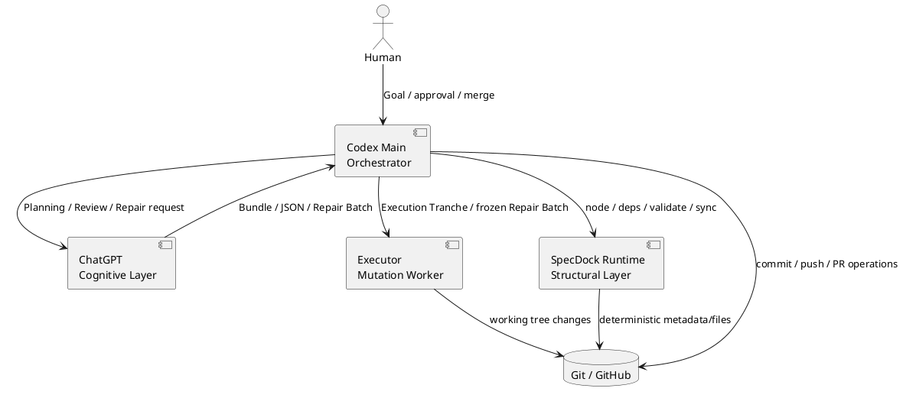

# 20260716t123423z-01-adr ChatGPT・Codex・SpecDock Runtimeの責務分離
## 位置づけ

このADRは、ChatGPT、Codex Main Orchestrator、Executor、SpecDock Runtimeの責務境界を固定する。vNextのPlanning、Review、Repair、Execution、Deliveryは、すべてこの境界へ従う。

## ADR 化基準

- hard to reverse:
  - yes。Skill、Agent、Runtime、Review、Git操作、Human Gateの所有者を横断的に変更する。
- surprising without context:
  - yes。高度なPlanningとReviewをChatGPTへ移しながら、canonical adoptionとrepository mutationはCodex側へ残すため、単純な「ChatGPT中心」または「Codex中心」ではない。
- real tradeoff:
  - yes。高度認知の品質とCodex quota削減を得る代わりに、外部モデル呼び出し、明示的なauthority handoff、複数Actor間の契約が必要になる。
- ADR 化しない場合の反映先:
  - `design.md`。
- ADR として残す理由:
  - 将来モデル、Oracle、Agent構成を変更しても維持すべき最上位の責務境界であり、個別Skill実装だけでは判断理由を復元できない。

## 結論（Decision）

Accepted.

次の責務境界を採用する。

- **ChatGPT / GPT-5.6 Pro**
  - Requirement、Design、Planの統合生成。
  - Planning、Checkpoint、Issue Delivery、Epic DeliveryのFormal Review。
  - ユーザー指定のTargeted Review。
  - blocking setの原因分析、小規模再設計、Repair Batch生成。
- **Codex Main Orchestrator**
  - Workflow、authority、target、contextの解決。
  - ChatGPT出力の採用、棄却、差し戻し判断。
  - Executorへの委任、Git diffとverificationの確認。
  - commit、push、Node、dependency、PR Delivery、Human Gateの管理。
- **Executor**
  - Execution TrancheまたはRepair Batchで境界付けられたrepository調査、実装、test、verification。
  - working treeへの変更までを担当し、commitとpushは行わない。
- **SpecDock Runtime**
  - Node lifecycle、active scope、dependency、validate、sync、Workbench、決定的なfile／metadata操作。
  - `plan.md`、Review JSON、Repair Batchの意味をparseしてgate判定しない。

Main OrchestratorはEpic全体を長時間担当してよい。実装担当ExecutorはIssue単位を基本寿命とし、同一Issueのbounded repairは原則同じExecutorへ戻す。計画破綻時だけfresh Executorへ切り替える。

## 背景（Context）

従来Workflowでは、CodexがPlanning文書の作成、仕様Review、実装、修復、証拠台帳、Git操作を広く担当し、複数の専用Reviewer AgentやWriter Agentが存在していた。この構造は、Codexのcontextとquotaを消費し、Actor間でauthorityが重複し、モデル変更時の追従箇所を増やしていた。

一方、ChatGPTは高度な包括分析に適するが、repository mutation、Git transaction、Node lifecycleを直接所有させると、再現性、権限、安全性、変更追跡が弱くなる。Runtimeへ意味的判断を移すと、model-dependentな文書やReviewをparserとstate machineへ固定してしまう。

## 選択肢（Options considered）

### Option A: Codex-centric all-in-one

- 概要:
  - Planning、Review、Implementation、Repair、Git操作をCodexが一貫して担当する。
- 良い点:
  - Actor handoffが少ない。
  - ローカルrepository contextを直接利用できる。
- 悪い点 / 制約:
  - Main contextとquotaを大量に消費する。
  - Reviewer independenceが弱い。
  - 専用AgentとSkillが増えやすい。
- 棄却理由:
  - vNextの主目的である認知負荷とCodex quota削減を満たさない。

### Option B: Runtime-heavy semantic state machine

- 概要:
  - Plan、Review、RepairをJSON化し、RuntimeがparseしてWorkflowを判定する。
- 良い点:
  - 状態遷移を機械的に再現できる。
  - restart耐性を高めやすい。
- 悪い点 / 制約:
  - model、prompt、schemaの変化へ弱い。
  - state、receipt、parser、migrationが増える。
  - 文書の意味をRuntime契約へ過剰固定する。
- 棄却理由:
  - 変更容易性を主要価値とする方針に反する。

### Option C: ChatGPTがrepositoryを直接変更する

- 概要:
  - ChatGPTがPlanning、Reviewに加え、canonical文書やコードを直接更新する。
- 良い点:
  - 認知と実装を一つのモデルへ集約できる。
- 悪い点 / 制約:
  - browser sessionへwrite権限を与える必要がある。
  - Git transactionとHuman Gateの管理が不安定になる。
- 棄却理由:
  - authority、安全性、再現性の境界を失う。

### Option D: Delegation-first layered architecture

- 概要:
  - 高度認知、オーケストレーション、bounded mutation、構造的Runtimeを分離する。
- 良い点:
  - 各Actorの得意領域を使える。
  - Context rot、quota、state肥大化を抑えられる。
  - model／Oracle変更を薄い境界へ閉じ込められる。
- 悪い点 / 制約:
  - handoff contractの設計が必要。
  - 外部ChatGPT利用不能時の代替操作経路が必要。
- 決定:
  - Accepted.

## 判断理由（Rationale）

この分離は、モデルの能力差ではなく、**authority、side effect、耐久性、変更容易性**を基準にしている。ChatGPTは高コストな意味的推論へ集中し、CodexはrepositoryとWorkflowを所有し、Executorはbounded mutationへ限定し、Runtimeはdeterministicな構造操作へ限定する。

これにより、ChatGPTモデルやOracle UIが変わっても、repository lifecycleやcanonical authorityを変更せずに認知層を交換できる。逆に、GitHubやRuntimeの実装変更も、Planning／Reviewの意味契約を保持したまま進められる。

## 影響（Consequences）

- 良い影響（Positive）:
  - Codex Mainの長時間contextを保護できる。
  - Local Reviewer Agent、Docs Writer、Repository Analyst等を削減できる。
  - Runtimeのschema migrationとsemantic parserを避けられる。
  - Human GateとGit transactionの責任が明確になる。
- 悪い影響 / 将来負債（Negative / Debt）:
  - ChatGPT、Main、Executor間のhandoff qualityが品質へ直結する。
  - Oracle／ChatGPT障害時に同一契約を維持するHuman Relayが必要になる。
  - 一部の作業では複数モデル呼び出しによる待ち時間が増える。
- 影響範囲（コード/テスト/運用/データ）:
  - Planning／Execution／PR Delivery Skill。
  - Codex Agent設定とinstalled mirror。
  - `spec-dock-chatgpt` CLI。
  - Workflow文書とReview／Repair prompt。
- 移行/ロールバック:
  - Workflow単位でvNextへ切り替え、旧Local Reviewerやmanual authoring routeを削除する。
  - ロールバックは旧Skill群の復元を要するため高コストであり、導入前にOracle、Review JSON、Executor handoffをsmoke testする。
- 追加対応（Follow-ups / Epic / Issue / ADR）:
  - 各ActorのSkill／CLI／Agent inventoryをInitiative Planで分割する。
  - Model labelやreasoning enumはDesign／Agent設定へ置き、ADRには固定しない。

## 参考（References）

- 関連仕様（requirement/design/plan/report）:
  - `requirement.md`
  - `design.md`
  - `plan.md`
- 元になった discussion docs（derived_from）:
  - `20260716t054458z-disc-gpt56-chatgpt-delegation-vnext-decision-registry.md`
- 反映先（reflected_to）:
  - `workflow_planning.md`
  - `workflow_review.md`
  - `workflow_issue.md`
