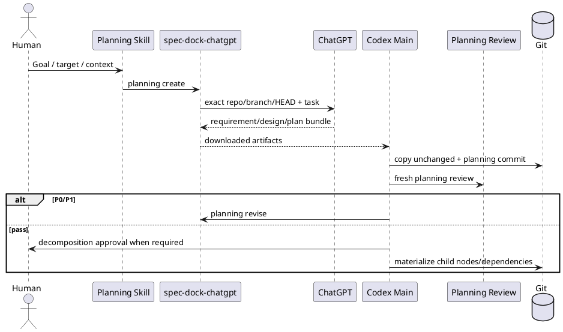

# 20260716t123423z-02-adr 統合Planning Bundleとplan.mdのSSOT化
## 位置づけ

このADRは、Initiative／Epic／Issue Planningで`requirement.md`、`design.md`、`plan.md`をどのように作成し、canonical文書へ採用するかを固定する。

## ADR 化基準

- hard to reverse:
  - yes。Planning Skill、Review Gate、文書template、Node materialization、旧manual authoring routeを横断して変更する。
- surprising without context:
  - yes。ChatGPT出力をevidenceとしてCodexが再執筆するのではなく、ChatGPTがcanonical候補の完全ファイルを一括生成し、Codexは意味内容を改変せず配置する。
- real tradeoff:
  - yes。三文書の整合性と高い初回品質を得る代わりに、ChatGPT出力品質、fresh review、fail-closedな再生成へ依存する。
- ADR 化しない場合の反映先:
  - `workflow_planning.md`。
- ADR として残す理由:
  - Planning authorityと文書生成境界を決める長期判断であり、旧Evidence Laneへ回帰しないために理由を固定する必要がある。

## 結論（Decision）

Accepted.

Initiative、Epic、IssueのPlanningでは、ChatGPTが一つのfresh sessionで次の完全なPlanning Bundleを生成する。

```text
requirement.md
design.md
plan.md
```

生成工程には、adversarial self-review、自己修正、三文書整合性確認を含める。Codex Mainは出力ファイルを識別し、意味内容を再構成・要約・正規化せずcanonical pathへ配置する。

Planning Bundleは実装変更と分離したPlanning commitにする。Liteを除く正式Planningではfresh Planning Reviewを行い、P0／P1があれば`planning revise`で完全なBundleを再生成する。P2／P3だけならPASSとして文書を変更しない。

Initiative／Epicでは、Humanが分解案を承認してから子Nodeとdependencyをmaterializeする。Node materializationだけを理由に、親Bundleを変更または再Reviewしない。

次を廃止する。

- ChatGPT出力をevidenceとしてclaim単位に採用し、Codexがcanonical三文書を再執筆する方式。
- `spec-dock-chatgpt-authoring`共有Skill。
- Initiative／Epic／Issueのmanual planning Skills。
- Identifyヘッダー、作成者、最終更新者、親ID等の重複情報。
- `plan.json`、Plan parser、Planning receipt、Review recipe。

公開Planning Skillは`spec-dock-initiative-planning`、`spec-dock-epic-planning`、`spec-dock-issue-planning`の3つを維持し、共通mechanicsだけを`workflow_planning.md`へ集約する。



## 背景（Context）

従来は、Requirement、Design、Planを段階的に作成・Reviewし、ChatGPT出力を低authority evidenceとして保存し、Codexがclaimを採用してcanonical文書を再執筆していた。この方式は、claim adoption ledger、preservation checkpoint、manual fallback、phase-specific Reviewer、canonical rewriteを必要とし、文書間の整合をMainが再構成する負担が大きかった。

GPT-5.6 Proは、三文書を同一contextで作成し、相互整合を自己検証できる。Planningの主要価値は、機械的なfield埋めではなく、Requirement、Design、Planの一貫した意味設計である。

## 選択肢（Options considered）

### Option A: artifactごとの逐次Planning

- 概要:
  - Requirement、Design、Planを別phase、別reviewで順番に作る。
- 良い点:
  - 各phaseのauthorityが明確。
  - 小さな変更単位で確認できる。
- 悪い点 / 制約:
  - context切替とreview回数が多い。
  - 後続文書で前段判断を再構成しやすい。
- 棄却理由:
  - 強い統合モデルを活用できず、運用が重い。

### Option B: ChatGPT evidence + Codex canonical rewrite

- 概要:
  - ChatGPTはdraft／evidenceを作り、Codexがcanonical三文書へ採用・再執筆する。
- 良い点:
  - Codexが最終authorityを細かく制御できる。
  - ChatGPT出力形式の揺れを吸収できる。
- 悪い点 / 制約:
  - 意味内容が二度生成される。
  - claim ledger、rewrite、preservation、reviewが肥大化する。
  - ChatGPTの一貫した文章をCodexが損なう可能性がある。
- 棄却理由:
  - 二重authoringと認知コストを維持するため。

### Option C: Integrated canonical bundle

- 概要:
  - ChatGPTが三文書を一括生成し、Codexは内容不変で配置する。
- 良い点:
  - 三文書の一貫性が高い。
  - Mainのrewrite負担が減る。
  - Planning Skillのinterfaceが明確になる。
- 悪い点 / 制約:
  - 初回出力品質へ依存する。
  - 不備時は部分patchではなくBundle revisionが必要になる。
- 決定:
  - Accepted.

### Option D: Runtime template／JSONから文書を合成

- 概要:
  - Runtimeがmetadataと定型fieldを埋め、LLM bodyと合成する。
- 良い点:
  - 一部のfieldを機械的に保証できる。
- 悪い点 / 制約:
  - 不要なmetadataと合成logicを維持する。
  - template変更へ弱い。
- 棄却理由:
  - 必要性の薄い情報を正確に保つための過剰設計になる。

## 判断理由（Rationale）

Planning Bundleは、一つの契約を異なる抽象度で表現する三文書であり、分離生成より同一contextでの統合生成が適する。HumanとMainが必要なのは、claimごとの再執筆ではなく、完全Bundleに対する独立Reviewと分解承認である。

Codexがファイル内容を再構成しないことで、作者とReviewerの境界も明確になる。ChatGPTの出力揺れは、Runtime合成やCodex rewriteではなく、出力contract、fresh revision、filesystem copyで処理する。

## 影響（Consequences）

- 良い影響（Positive）:
  - Planningのstep数、Main context、claim ledgerが減る。
  - Requirement／Design／Planの整合性が高まる。
  - Initiative／Epic／Issue Planningの正常終了条件が明確になる。
- 悪い影響 / 将来負債（Negative / Debt）:
  - ChatGPTが不完全ファイルを返す場合、再生成が必要になる。
  - Bundle全体のReview promptと出力取得を十分にsmoke testする必要がある。
- 影響範囲（コード/テスト/運用/データ）:
  - Planning Skills、`workflow_planning.md`、Oracle prompt、artifact placement。
  - 旧authoring Skill、manual Skills、Evidence Ledger guidanceの削除。
- 移行/ロールバック:
  - 既存Scopeの文書を変換せず、次のPlanning操作から新方式を使う。
  - ロールバックは旧Evidence Laneの復元を要するため、first-waveで三Scopeのdogfood Planningを実施する。
- 追加対応（Follow-ups / Epic / Issue / ADR）:
  - Initiative／Epic／Issue固有のContext、Human Gate、Node materializationを各Skillへ実装する。

## 参考（References）

- 元になった discussion docs（derived_from）:
  - `20260716t054458z-disc-gpt56-chatgpt-delegation-vnext-decision-registry.md`
- 反映先（reflected_to）:
  - `workflow_planning.md`
  - `workflow_initiative.md`
  - `workflow_epic.md`
  - `workflow_issue.md`
