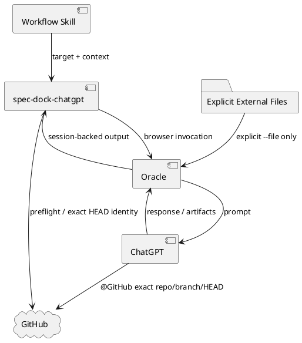

# 20260716t123423z-03-adr 薄いspec-dock-chatgptアダプターとGitHub exact HEAD binding
## 位置づけ

このADRは、SpecDockがChatGPT／Oracleをどこまで所有し、repository contextとrevision identityをどのように固定するかを定める。

## ADR 化基準

- hard to reverse:
  - yes。CLI境界、認証、context供給、failure semantics、tracked fileのSSOT、将来のOracle更新方式を決める。
- surprising without context:
  - yes。tracked fileを添付せず、GitHub exact branch／HEADを必須とし、確認不能時はモデルへ回答を拒否させる。
- real tradeoff:
  - yes。二重管理とstale contextを防ぐ代わりに、push済みclean branchとGitHub Connector availabilityへ依存する。
- ADR 化しない場合の反映先:
  - `design.md`。
- ADR として残す理由:
  - OracleのUIや実装が変わっても維持すべきadapter boundaryとfail-closed原則である。

## 結論（Decision）

Accepted.

ChatGPT連携をCore `spec-dock` CLIから分離し、独立した`spec-dock-chatgpt` CLIとして提供する。`spec-dock-chatgpt`はOracleの薄いadapterであり、次だけを所有する。

- target、parent、dependency、relevant pathの解決。
- named branch、clean working tree、upstream、local HEAD == remote HEADのpreflight。
- repository、branch、expected HEAD SHA、task、Operator Context、明示添付を含むprompt合成。
- Oracle processの起動。

Oracleへ次を委ねる。

- browser automation、login、model picker、ChatGPT Project。
- timeout、session、reattach、response保存、downloadable artifacts。

正式Workflowは`--engine browser`を固定し、原則fresh one-shotで実行する。モデル、Project URL、login、thinking time等はローカルOracle configへ委ねる。

Git-trackedなRequirement、Design、Plan、Report、source、test、configは自動添付しない。GitHubをRepository SSOTとし、ChatGPTは`@GitHub`で指定repository、branch、exact HEAD SHAを確認する。確認できない場合はPlanning、Review、Repairを行わず、default branch、添付、記憶で代替しない。

GitHub外のPDF、画像、実験結果、Workbench資料等だけを`--file`で明示添付する。Operator Contextは`--context`／`--context-file`で渡す。

Oracle UI障害時も旧Codex-only Workflowへ戻さない。別browser操作、Codex browser、またはHuman Relayで、同じprompt／context／result contractを維持する。

## 背景（Context）

OracleはChatGPTのbrowser利用、session、reattach、downloadをすでに提供している。SpecDockがこれらを再実装すると、Oracle更新への追従箇所が増え、独自result manifestやsession stateが二重化する。

一方、ChatGPTへtracked fileを添付すると、GitHub上の同一ファイルと二つの情報源が生まれ、どちらが最新かを保証する追加logicが必要になる。正式ReviewやPlanningでは、未pushのlocal stateを利用すると、回答対象のrevisionを第三者が再現できない。

## 選択肢（Options considered）

### Option A: Core `spec-dock`へOracle機能を統合する

- 良い点:
  - CLI入口が一つになる。
- 悪い点 / 制約:
  - Node lifecycleとfragileなbrowser automationが結合する。
  - Oracle変更がCore Runtimeへ波及する。
- 棄却理由:
  - 安定した構造操作と変化の大きい外部UI操作を分離するため。

### Option B: tracked fileをcontext packとして自動添付する

- 良い点:
  - ChatGPTが重要ファイルへ確実に到達しやすい。
- 悪い点 / 制約:
  - GitHubと添付の二重SSOTになる。
  - stale file検証、bundle生成、size管理が必要になる。
- 棄却理由:
  - path anchorとGitHub探索で十分であり、二重管理の費用が大きい。

### Option C: Oracle API modeを標準とする

- 良い点:
  - UI変更の影響を受けにくい。
- 悪い点 / 制約:
  - コストが高く、利用方針に合わない。
- 棄却理由:
  - browser modeを主要経路とする運用方針に反する。

### Option D: GitHub-bound thin adapter

- 良い点:
  - repository revisionを再現可能に固定できる。
  - Oracleの既存機能をそのまま利用できる。
  - SpecDock側の保守面を小さくできる。
- 悪い点 / 制約:
  - push済みclean branchとConnector availabilityが必要。
  - browser障害時にHuman Relayが必要になる。
- 決定:
  - Accepted.

## 判断理由（Rationale）

正式なPlanning／Review／Repairで最も重要なのは、**モデルがどのrepository stateを見たか**を明確にすることである。GitHub exact branch／HEADをSSOTとし、tracked fileの添付を避けることで、revision identityを一つにできる。

Oracleは交換可能なtransport／browser adapterとして扱い、そのsessionとartifact管理を再利用する。SpecDockは意味契約とpreflightだけを所有し、外部toolの更新へ追従しやすくする。

## 影響（Consequences）

- 良い影響（Positive）:
  - stale／duplicate contextを抑制できる。
  - Oracle更新時のSpecDock変更を減らせる。
  - Planning／Review Requestをself-containedにできる。
- 悪い影響 / 将来負債（Negative / Debt）:
  - 未push状態で正式ChatGPT処理を実行できない。
  - GitHub Connectorやbrowser障害がWorkflowをblockする。
  - Human Relay手順を明文化する必要がある。
- 影響範囲（コード/テスト/運用/データ）:
  - `spec-dock-chatgpt` CLI、Git preflight、prompt、Oracle config、smoke tests。
- 移行/ロールバック:
  - 旧authoring pack／receipt／artifact import前提を削除し、Oracle session outputを直接利用する。
  - ロールバックする場合もtracked fileの二重SSOTを再導入しない。
- 追加対応（Follow-ups / Epic / Issue / ADR）:
  - exact branch／SHA、artifact download、fail-closed回答をlive smokeする。

## 参考（References）

- 元になった discussion docs（derived_from）:
  - `20260716t054458z-disc-gpt56-chatgpt-delegation-vnext-decision-registry.md`
- 外部資料:
  - `steipete/oracle`
  - local `chatgpt-use` wrapper contract
