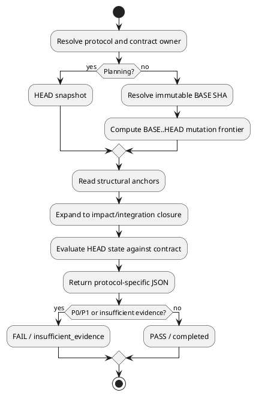

# 20260716t123423z-04-adr 契約駆動Review ProtocolとDelta-bounded Snapshot Review
## 位置づけ

このADRは、Formal ReviewとTargeted ReviewのProtocol、範囲、revision境界、Perspective、結果契約を固定する。

## ADR 化基準

- hard to reverse:
  - yes。Planning、Execution、Delivery、PR、Agent削除、Review prompt、JSON contractを横断する。
- surprising without context:
  - yes。差分だけでもrepository全体監査でもなく、deltaで対象を選び、HEADのsnapshotを契約へ照合する。またReview JSONをRuntimeではparseしない。
- real tradeoff:
  - yes。見落としを抑えながらReview範囲を限定する代わりに、意味的BASEとSemantic ExpansionをMain／ChatGPTが扱う必要がある。
- ADR 化しない場合の反映先:
  - `workflow_review.md`。
- ADR として残す理由:
  - Reviewの正しさ、コスト、freshness、gate semanticsを決める中心的なarchitecture contractである。

## 結論（Decision）

Accepted.

Formal Review Protocolを次の3つに限定する。

```text
Planning Review
Checkpoint Review
Delivery Review
```

Targeted Reviewはadvisoryであり、Formal Gateを代替しない。ユーザーが任意対象とPerspectiveを直接指定する公開Skill`spec-dock-targeted-review`を設ける。

Review Scopeを次で定義する。

```text
Contract Owner
× Temporal Window
× Structural Anchors
× Mutation Frontier
× Semantic Expansion
```

Perspectiveは別軸として合成する。

- Planning Review:
  - current HEAD Snapshot。
  - BASEなし。
  - Requirement／Design／Planとparent／SeedをContract Closureする。
- Checkpoint／Issue Delivery／Epic Delivery:
  - 意味的なimmutable `BASE SHA`からcurrent synced HEADまでをMutation Frontierとする。
  - HEADの最終repository stateをContractへ照合する。
  - 必要なcaller、consumer、test、config、docsへImpact／Integration Closureする。
- PR-style Review:
  - base branchとのmerge-baseを使用する。

この方式を**Delta-Bounded Snapshot Review**と呼ぶ。

Findingは今回のdeltaで導入・悪化・顕在化した問題、または今回のContract未達へ限定する。無関係な既存問題や一般的改善提案は報告しない。

Reviewはfresh one-shot sessionで行い、前回finding、Authorの自己弁護、期待verdictを渡さない。

Perspectiveは必要なものだけを選択し、`repository-conventions`を含める。Repository conventionsは明示された`AGENTS.md`、規約文書、formatter／linter設定等だけを根拠にし、規約がなければN/Aとする。

Review結果はProtocol固有JSONとする。P0／P1があればFAIL、P2／P3だけまたはfindingなしならPASS、GitHub／HEAD／必要証拠を確認できない場合はPASSを禁止する。RuntimeはJSONをparse／validateせず、Main Orchestratorが意味的に解釈する。

Targeted ReviewはFormal `pass/fail`ではなく、次のadvisory statusを返す。

```text
completed
insufficient_evidence
```

ローカル`spec-reviewer`、`code-reviewer`、`qa-reviewer` Agentは削除する。GitHub上のCodex PR Reviewは当面ChatGPT Delivery Reviewと併用する。



## 背景（Context）

Diff-only Reviewは変更行の局所的欠陥には強いが、Requirement未達、call site、integration test、config、docsとの不整合を見落とす。Repository全体Reviewは高コストで、今回の変更と無関係な既存問題を混入させる。

Codexの公開Review実装は、uncommitted、base branch、commit、custom targetという小さなtarget代数を持ち、merge-baseまたはdiffを起点に周辺call siteとtestへ展開する。この原則をSpecDockの契約Reviewへ適応する必要がある。

## 選択肢（Options considered）

### Option A: diff-only review

- 良い点:
  - 範囲が明確で速い。
  - findingを変更行へ紐付けやすい。
- 悪い点 / 制約:
  - Contract未達や周辺impactを見落とす。
- 棄却理由:
  - SpecDock Reviewは契約充足を判定するため。

### Option B: repository-wide snapshot audit

- 良い点:
  - 広範な問題を発見できる。
- 悪い点 / 制約:
  - 高コストで、既存問題や一般改善が混入する。
  - Reviewが収束しにくい。
- 棄却理由:
  - 今回のdelivery sliceと無関係なfindingを増やす。

### Option C: path hard allow-list

- 良い点:
  - 実行範囲を厳密に制御できる。
- 悪い点 / 制約:
  - caller、consumer、test、configへの影響を追えない。
- 棄却理由:
  - pathはanchorでありcorrectness boundaryではない。

### Option D: delta-bounded snapshot review

- 良い点:
  - 変更起点の高signalとHEAD契約評価を両立する。
  - Checkpoint／Deliveryの意味的境界を表現できる。
- 悪い点 / 制約:
  - BASE管理とSemantic Expansionの指示が必要。
  - ChatGPTのrepository探索品質へ依存する。
- 決定:
  - Accepted.

## 判断理由（Rationale）

レビュー対象の選択と、正しさを判定する状態は分離すべきである。BASE..HEADは「何が変わったか」を選び、HEAD SnapshotとContractは「現在正しいか」を判定する。Semantic Expansionによって、変更に直接関係する周辺範囲だけを読む。

Protocol固有JSONは、モデル間通信を安定させるために使用するが、Runtime gateへ固定しない。これにより、Review schemaを変更してもRuntime migrationを避けられる。

## 影響（Consequences）

- 良い影響（Positive）:
  - Reviewの見落としと無関係findingの両方を抑えられる。
  - Planning、Checkpoint、Issue Delivery、Epic Deliveryを同じ抽象モデルで説明できる。
  - Local Reviewer Agentを統合・削除できる。
- 悪い影響 / 将来負債（Negative / Debt）:
  - BASEを正しく選ぶ必要がある。
  - Semantic Expansionが広がりすぎないようpromptを調整する必要がある。
  - JSON不整合時はMainが再実行判断を行う。
- 影響範囲（コード/テスト/運用/データ）:
  - Review CLI、prompt、Protocol JSON、Workflow Skills、Agent削除。
- 移行/ロールバック:
  - 旧Local Reviewerを削除する前に、各Protocolのlive ReviewとJSON安定性を確認する。
  - GitHub Codex PR Reviewは独立チャネルとして維持する。
- 追加対応（Follow-ups / Epic / Issue / ADR）:
  - Perspective catalog、BASE validation、finding location contractをDesignで具体化する。

## 参考（References）

- 元になった discussion docs（derived_from）:
  - `20260716t054458z-disc-gpt56-chatgpt-delegation-vnext-decision-registry.md`
- 外部資料:
  - `openai/codex` review implementation
