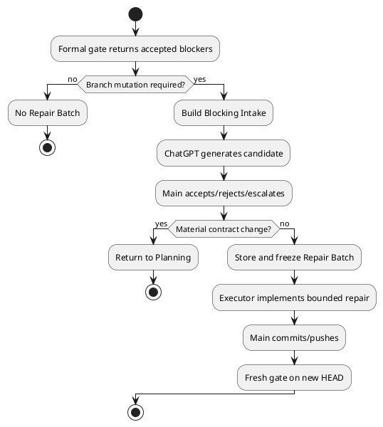

# 20260716t123423z-05-adr Repair Batchを凍結された従属修復契約とする
## 位置づけ

このADRは、Formal Quality Gateで発見されたblocking setを、既存Planを全面改訂せず安全に修復するためのRepair Batchのauthorityとlifecycleを固定する。

## ADR 化基準

- hard to reverse:
  - yes。Checkpoint、Delivery、PR、Executor handoff、Artifact、Planning escalationを横断する。
- surprising without context:
  - yes。Repair Batchは実施記録やPR台帳ではなく、Source HEADへ固定された小規模な設計書兼実装計画書であり、作成後に更新しない。
- real tradeoff:
  - yes。場当たり的修正を防ぎ、修復理由を残す代わりに、blocking cycleごとにChatGPT生成とArtifact作成が必要になる。
- ADR 化しない場合の反映先:
  - `workflow_repair_batch.md`。
- ADR として残す理由:
  - Plan、Review finding、Executor、PR stateのauthority混同を防ぐ永続的な境界である。

## 結論（Decision）

Accepted.

Repair Batchを、Checkpoint、Issue Delivery、Epic Delivery、PR Review、required CI failure、merge conflict等のFormal Quality Gateで発生した**accepted blocking set**を処理する、小規模な設計書兼実装計画書とする。

Repair BatchはPR固有ではない。Planning ReviewのP0／P1は原則としてPlanning Bundle Revisionで処理し、Repair Batchを使用しない。

branch mutationを伴うaccepted P0／P1、required CI failure、merge conflictでは、原則ChatGPTに完全なRepair Batch Markdownを生成させる。P2／P3のみ、false positive、no-change、human gateだけでは作らない。

CLIは次の一つとする。

```bash
spec-dock-chatgpt repair-batch generate <execution-owner-issue>
```

Repair Batchは一つのSource HEAD／Blocking Cycleにつき一つ作成し、Git管理Artifactとして配置する。Mainが候補を採用した後、Executor開始前にfreezeし、以後変更しない。

内容は次を含む。

```text
Binding
Blocking Set
Root-Cause Families
Repair Design
Allowed / Forbidden Scope
Implementation Plan
Validation / Re-review Plan
Stop / Escalation Conditions
Evidence References
```

次は含めない。

```text
Implementation Result
Changed Paths
Commit SHA
Push Result
CI Result
Fresh Review Result
Merge-Prepared State
```

実施結果はGit、Executor Handoff、test結果、Oracle Review、GitHub CI／Codex Review、`report.md`を正本とする。

Repair BatchはRequirement／Design／Planへ従属する。Scope、Requirement、Architecture、Public Contract、Review Topologyのmaterial変更が必要なら、Repair Batchを拡張せずPlanningへ戻る。

独立`spec-dock-repair-batch` Skillは作らない。各Workflow Ownerが起動条件と復帰先を所有し、共通契約を`workflow_repair_batch.md`へ集約する。



## 背景（Context）

Review findingやCI failureを一件ずつExecutorへ渡すと、重複原因を別々に修正し、scope creepや無効な再試行が起きやすい。一方、すべての修正でRequirement／Design／Planを全面改訂すると、局所修復に対してPlanning costが高すぎる。

従来のPR Repair Batchは、問題分析に加えてconsultation status、fallback approval、repair queue、iteration ledger、merge-prepared checklist等を持ち、PR Workflow databaseとして肥大化していた。

## 選択肢（Options considered）

### Option A: raw findingsをExecutorへ直接渡す

- 良い点:
  - 最も速く、Artifactが増えない。
- 悪い点 / 制約:
  - finding間の重複、coupling、root causeを整理できない。
  - Main session喪失時に修復理由が残らない。
- 棄却理由:
  - 複数チャネルReviewと長時間Workflowに対して不安定。

### Option B: 全修復でPlanning Bundleを改訂する

- 良い点:
  - canonical authorityが一つに保たれる。
- 悪い点 / 制約:
  - 局所修復のたびに三文書再生成とPlanning Reviewが必要。
- 棄却理由:
  - bounded repairに対して過剰である。

### Option C: mutable repair ledger

- 良い点:
  - PR期間全体の履歴を一ファイルで追跡できる。
- 悪い点 / 制約:
  - stale finding、旧戦略、CI状態が混在する。
  - Review後にledger更新commitを作りたくなる。
- 棄却理由:
  - Repair PlanとWorkflow Stateが混同される。

### Option D: frozen subordinate Repair Batch

- 良い点:
  - root cause単位の修復契約をExecutorへ渡せる。
  - Source HEADと判断理由を固定できる。
  - Planningと場当たり修正の中間を取れる。
- 悪い点 / 制約:
  - blocking cycleごとにArtifactが増える。
  - Mainによる採用判断が必要。
- 決定:
  - Accepted.

## 判断理由（Rationale）

Repair Batchの価値は、一次証拠を複製することではなく、複数findingを一つのbounded repair strategyへ圧縮することにある。計画と実施結果を分け、Source HEADに固定してfreezeすることで、後から「どの問題に対して何を実装する予定だったか」を再現できる。

ChatGPTはrepair recommendationを作るが、authorizationはMainが持つ。上位契約を変更する必要がある場合は、Repair Batchを裏口のPlanとして利用せずPlanningへ戻す。

## 影響（Consequences）

- 良い影響（Positive）:
  - 複数Review／CI findingをroot cause単位で処理できる。
  - Executorのscopeとstop conditionが明確になる。
  - PR状態台帳を別途持たず修復理由を永続化できる。
- 悪い影響 / 将来負債（Negative / Debt）:
  - simpleなblocking repairでもChatGPT生成が一段入る。
  - candidate採用前のquality checkが必要。
  - Artifact namingとSource HEAD bindingを一貫させる必要がある。
- 影響範囲（コード/テスト/運用/データ）:
  - Repair CLI、Workflow docs、Issue／Epic／PR Delivery Skill、Artifact template。
- 移行/ロールバック:
  - 旧巨大PR Repair Batch templateを置換する。
  - Rollback時もmutable workflow ledgerへ戻さず、必要ならRepair Batch自体を省略する方を選ぶ。
- 追加対応（Follow-ups / Epic / Issue / ADR）:
  - Blocking Intake、Artifact placement、fresh review復帰をDesignで具体化する。

## 参考（References）

- 元になった discussion docs（derived_from）:
  - `20260716t054458z-disc-gpt56-chatgpt-delegation-vnext-decision-registry.md`
