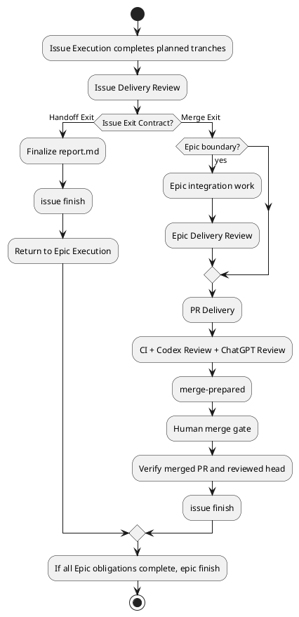

# 20260716t123423z-07-adr Plan駆動Delivery Topology・Issue Exit Contract・Human Merge Gate
## 位置づけ

このADRは、複数Issueを含むEpicでPRをどこに置くか、Issue Executionがどこまで所有するか、Issue／EpicをいつfinishするかをPlan-drivenに決める。

## ADR 化基準

- hard to reverse:
  - yes。Epic Plan、Issue Seed、Issue Plan、Issue Execution、Epic Execution、PR Delivery、Human Gate、finish semanticsを横断する。
- surprising without context:
  - yes。中間Issueはmerge前にfinishできる一方、Merge Exitを持つIssueは人間mergeの実確認までfinishできない。またIssue ReviewとEpic Reviewを両方行う。
- real tradeoff:
  - yes。Issue単位の小回りとEpic-wide integrationを両立する代わりに、Delivery TopologyとExit ContractをPlanningで明示する必要がある。
- ADR 化しない場合の反映先:
  - `workflow_issue.md`および`workflow_epic.md`。
- ADR として残す理由:
  - Scope completion、PR boundary、人間承認の意味を固定する長期Workflow decisionである。

## 結論（Decision）

Accepted.

Epic `plan.md`が**Delivery Topology**を所有する。各Issue列のどこにDelivery Boundaryを置くか、どのIssue群を一つのDelivery Scopeに含めるか、どのIssueがDelivery Ownerかを明示する。

Delivery Topologyは次を表現できる。

```text
per-Issue PR
Epic-wide PR
several-Issue batch PR
```

Issue SeedにはExit expectationを、Issue `plan.md`には具体的な**Issue Exit Contract**を記述する。Invocation contextだけで実行時の終了境界を変更しない。

Issue ExecutionはPlan-drivenなconditional end-to-end orchestratorとし、正常終了経路を次の2つとする。

- **Handoff Exit**
  - Issue-level Delivery Reviewを通す。
  - `report.md`を完成する。
  - PRを作らず`issue finish`し、Epic Executionへ制御を返す。
- **Merge Exit**
  - IssueまたはEpic Delivery Reviewを通す。
  - PR Deliveryを実行し`merge-prepared`へ到達する。
  - Human Merge Gateで停止する。
  - 人間がmergeした後、Mainがmerged PRとreviewed headを確認して`issue finish`する。

`issue finish`と`epic finish`は、Plan完了の構造的反映とする。自動mergeは行わない。

Issue Delivery ReviewとEpic Delivery Reviewは両方行うが、同一Reviewの重複ではない。

- Issue ReviewはIssue Requirement／Design／Planの充足を確認する。
- Epic Reviewはcross-Issue integration、Epic Requirement／Design、Epic-level integration／E2E testを確認する。

Epic PlanはDelivery Owner Issueを明示する。単一Issue／小規模Epicでは通常Issueへ包含できるが、複数Issueや統合リスクがある場合は専用Final Quality／Delivery Issueを推奨する。特殊Node型は作らない。

Delivery Owner Issueは既存Epic契約内のbounded integration／quality／PR repairを所有できる。新Scope、materialな要件／設計変更、独立workstreamが必要ならEpic Planningへ戻して新Issue化する。

PR Deliveryは一つのWorkflow Skillとして、PR作成／特定、CI／Codex Review観測、Repair Batch、Executor修復、push、fresh ChatGPT Delivery Review、再観測、merge-preparedまでを所有する。P2／P3だけを理由にbranch mutationしない。



## 背景（Context）

Issue単位PRは小回りとreviewabilityに優れるが、複数Issueにまたがるintegration workを分断しやすい。Epic-wide PRは統合しやすいが、PRが大きくなり、最終品質ゲートと修復が重くなる。実際のEpicには、両方の運用と中間的なbatch PRが存在する。

Issue Executionの終了境界を呼び出し元で暗黙変更すると、同じIssue Planを単独実行した場合とEpic内で実行した場合で挙動が変わり、restartやhandoffが不安定になる。

## 選択肢（Options considered）

### Option A: すべてのIssueでPRを作る

- 良い点:
  - PRが小さく、問題を早期に隔離できる。
- 悪い点 / 制約:
  - cross-Issue integrationをどこで所有するか曖昧になる。
  - 人間merge gateがIssueごとに入り、長時間Epicが頻繁に停止する。
- 棄却理由:
  - すべてのEpicへ固定できない。

### Option B: Epic最後に必ず一つのPRを作る

- 良い点:
  - Epic全体を一つのdeliveryとして扱える。
- 悪い点 / 制約:
  - PRが巨大化し、品質ゲートの修復が重い。
- 棄却理由:
  - 小規模／独立Issueでも不必要にbatch化する。

### Option C: Invocation contextで動作を切り替える

- 良い点:
  - Plan変更なしに単独／Epic実行を使い分けられる。
- 悪い点 / 制約:
  - 同じPlanの終了条件が呼び出し元で変わる。
  - restart／manual recoveryで誤動作しやすい。
- 棄却理由:
  - Planning SSOTを破壊する。

### Option D: Plan-driven Delivery Topology

- 良い点:
  - per-Issue、Epic-wide、batchを同じモデルで表現できる。
  - restart時もPlanから終了条件を復元できる。
  - Issue ReviewとEpic Reviewの責務を分離できる。
- 悪い点 / 制約:
  - Epic PlanningでDelivery OwnerとBoundaryを決める必要がある。
  - Planが不足していれば局所refreshが必要になる。
- 決定:
  - Accepted.

## 判断理由（Rationale）

Delivery BoundaryはGitの都合ではなく、製品・契約・品質の境界である。Epic Planがportfolio-level topologyを、Issue Planがexecution-local exit contractを所有することで、異なるdelivery粒度を明示的に扱える。

IssueとEpicのReviewを分けることで、局所的正しさと統合的正しさを別々に証明できる。Human mergeは不可逆で外部可視な操作であるため、Mainが自動実行せず、人間の判断と実際のmerge確認を完了条件に含める。

## 影響（Consequences）

- 良い影響（Positive）:
  - Epic規模に応じてPR粒度を最適化できる。
  - Issue finish、Epic finish、mergeの意味が明確になる。
  - Integration／E2E workのOwnerを明示できる。
- 悪い影響 / 将来負債（Negative / Debt）:
  - Epic PlanとIssue PlanへExit／Delivery契約を記述する必要がある。
  - 中間Issueがmerge前にclosedとなる運用を理解する必要がある。
  - Human merge待ちでWorkflowが停止する。
- 影響範囲（コード/テスト/運用/データ）:
  - Epic／Issue Planning、Execution、PR Delivery、finish command guidance、Report。
- 移行/ロールバック:
  - 既存Planに必要なExit Contractがなければ、次の操作時にPlanning gapとして局所refreshする。
  - 旧per-Issue／Epic-wide固定modeを並行維持しない。
- 追加対応（Follow-ups / Epic / Issue / ADR）:
  - Plan記述例、Delivery Owner選定、merge verificationをDesignへ落とす。

## 参考（References）

- 元になった discussion docs（derived_from）:
  - `20260716t054458z-disc-gpt56-chatgpt-delegation-vnext-decision-registry.md`
