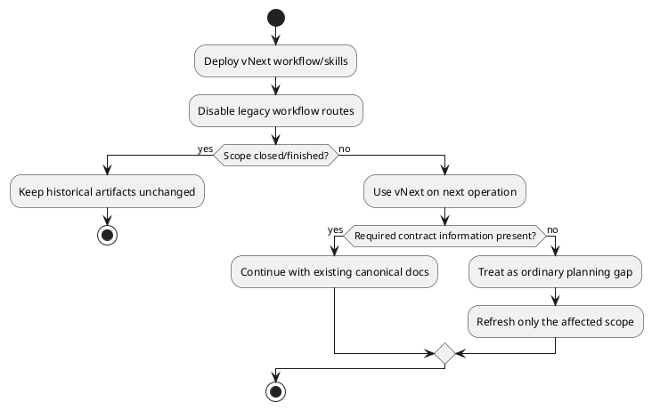

# 20260716t123423z-09-adr 文書移行を伴わない全Scope Workflow一括cutover
## 位置づけ

このADRは、vNextを既存Initiative／Epic／Issueへどのように適用し、旧Workflowと文書をどのように扱うかを定めるmigration decisionである。

## ADR 化基準

- hard to reverse:
  - yes。旧Skill／Agent／Workflowの削除時期、既存open Scopeの継続方法、dual workflowの有無を決める。
- surprising without context:
  - yes。全ScopeのWorkflowを一括切替する一方、既存文書は一括変換も事前refreshもしない。
- real tradeoff:
  - yes。二重Workflowを避けながらmigration作業を最小化する代わりに、既存Scopeの不足契約を次回利用時に局所修復する。
- ADR 化しない場合の反映先:
  - `plan.md`。
- ADR として残す理由:
  - Initiative実装順、compatibility、旧Asset削除、open Scopeの安全な継続を決める一度きりだが重大な移行方針である。

## 結論（Decision）

Accepted.

vNext導入を、文書schemaやScope構造のmigrationではなく、**全Scopeに対するWorkflow／Actorの一括cutover**として実施する。

- 新規、open、activeのすべてのScopeは、vNext導入後の次のPlanning／Review／Execution／Delivery操作からvNext Workflowを使用する。
- 既存Initiative／Epic／Issueの`requirement.md`、`design.md`、`plan.md`、`report.md`、artifactsを一括変換、再生成、編集しない。
- closed／finished Scopeはhistorical artifactとして不変とする。
- open／active Scopeも事前に一括refreshしない。
- vNextの次操作に必要なGrade、Review Topology、BASE、Exit Contract、Delivery Topology等が実際に不足する場合だけ、通常のPlanning gapとして対象Scopeを局所refreshする。
- 旧WorkflowとvNextを並行運用しない。
- 新規Scopeだけに限定した段階導入を行わない。
- 全open Scopeの事前migration projectを作らない。

Workflow切替と同時に、旧ChatGPT authoring evidence lane、manual planning Skills、Local Reviewer Agents、旧Docs Writer等を削除・置換する。既存canonical文書形式は維持するため、Scope作成日や文書versionによるRuntime分岐を追加しない。

## 背景（Context）

vNextは、主要なcanonical file名やScope directory schemaを変更しない。変更の中心はActor、Workflow、Review、Repair、Skill topologyである。そのため、既存文書を変換する専用migrationは、多くの場合価値を生まない。

一方、新規ScopeだけにvNextを適用すると、旧Skill、旧Reviewer、旧authoring runtimeを長期間維持する必要があり、どのWorkflowを使うかがScope作成日へ依存する。全open Scopeを先にrefreshすると、今後使わないScopeまで大量に変更・Reviewすることになる。

## 選択肢（Options considered）

### Option A: 新規ScopeだけvNext

- 良い点:
  - 既存作業へ影響しない。
- 悪い点 / 制約:
  - 旧Workflowを長期間保守する。
  - Scope作成日による分岐が残る。
- 棄却理由:
  - 二重Workflowと運用複雑性が残る。

### Option B: 全open Scopeを事前に一括migration

- 良い点:
  - cutover時点で全open Scopeが統一される。
- 悪い点 / 制約:
  - 利用しないScopeまでPlanning／Reviewが必要。
  - migration自体が大規模Epicになる。
- 棄却理由:
  - 文書schema変更がないため費用対効果が低い。

### Option C: hard cutoverし、既存文書は常に十分とみなす

- 良い点:
  - migration手順が最小。
- 悪い点 / 制約:
  - Grade、Checkpoint、Exit Contract等の実不足を見落とす。
- 棄却理由:
  - 安全な継続を保証できない。

### Option D: global workflow cutover + lazy planning-gap repair

- 良い点:
  - 二重Workflowを残さない。
  - 不要な文書変換を避ける。
  - 必要なScopeだけを実際の不足に基づいてrefreshできる。
- 悪い点 / 制約:
  - 既存Scopeの最初のvNext操作でPlanning gapが発見される可能性がある。
  - 旧Asset削除と新Workflow導入を整合した順序で行う必要がある。
- 決定:
  - Accepted.

## 判断理由（Rationale）

Migrationの必要性は、ファイルの古さではなく、次の操作に必要な契約の不足で判断すべきである。vNextは同じcanonical fileを使うため、全Scopeを変換することは「新しいWorkflowへ移行する」ことと同義ではない。

Global cutoverによってActorとWorkflowを一つにし、必要なPlanning refreshだけを通常のgap handlingへ統合することで、legacy modeとmigration stateを追加せずに安全性を確保できる。

## 影響（Consequences）

- 良い影響（Positive）:
  - 旧Workflowとの並行運用を避けられる。
  - Historical artifactsを保護できる。
  - 不要な一括文書変更とReviewを削減できる。
  - Runtimeへversion分岐を追加しなくてよい。
- 悪い影響 / 将来負債（Negative / Debt）:
  - open Scopeの次回操作時に局所Planning refreshが発生し得る。
  - cutover releaseでは旧Skill削除と新Skill導入をatomicに近づける必要がある。
- 影響範囲（コード/テスト/運用/データ）:
  - Skill／Agent packaging、Workflow docs、installer、dogfood assets、release plan。
- 移行/ロールバック:
  - provider／installed／dogfood mirrorを同じchange setで更新する。
  - rollback時は旧Workflow routeを復元する必要があるため、cutover前にinventoryとdogfoodを完了する。
- 追加対応（Follow-ups / Epic / Issue / ADR）:
  - Initiative Planでcutover dependency、asset deletion order、compatibility testsを定義する。

## 参考（References）

- 元になった discussion docs（derived_from）:
  - `20260716t054458z-disc-gpt56-chatgpt-delegation-vnext-decision-registry.md`
