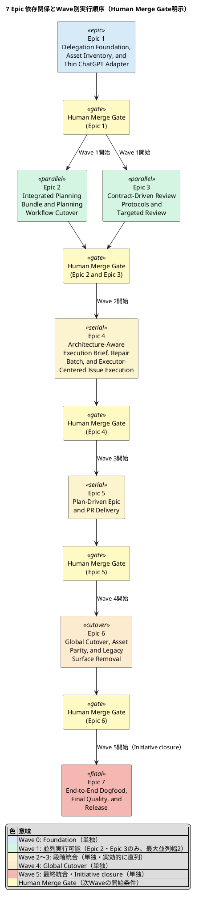
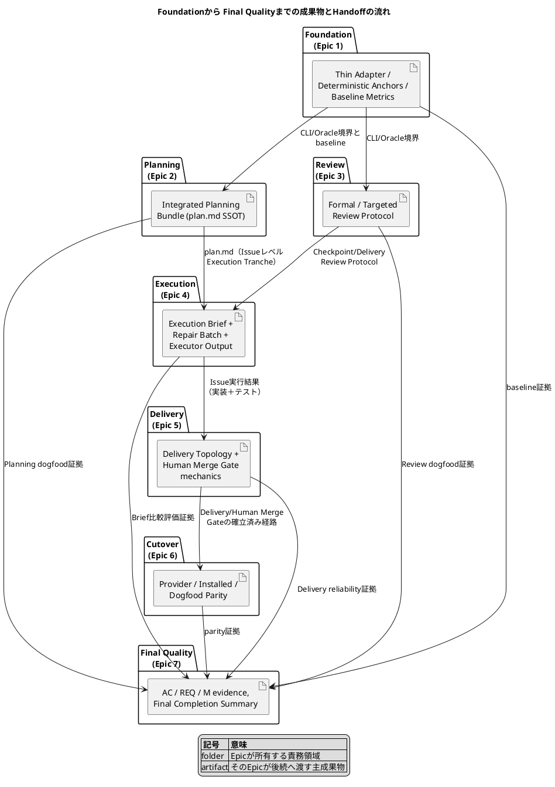

# 20260719t234539z-disc Seven Epic Visual Guide（7 Epic 構造・依存 視覚化ガイド）

## この文書について

- 本artifactの種別は`disc`だが、目的はHuman承認者・将来のEpic planner・実装担当者が`init-00322`の7 Epicの責務・順序・依存・並列性・handoffを構造的かつ視覚的に理解できるようにする**explanatory evidence**であり、標準的な`disc`の「質問回答synthesis／reflection proposal／ADR candidate triage」テンプレートとは異なる。
- この文書は新しいreflection proposalやADR candidateを作らない。canonical三文書（`requirement.md`／`design.md`／`plan.md`）が定める事実を要約・可視化するだけであり、それ自体はcanonical authorityを持たない。
- 矛盾が生じた場合は、常にcanonical三文書、特に`requirement.md`のスコープ／制約／受入条件を優先する。

---

## 1. 1ページで分かる全体像

### 1.1 Initiativeの目的

`init-00322`は、SpecDockの高度認知処理をChatGPT（GPT-5.6 Pro）へ、repository mutationとWorkflow制御をCodex（Main Orchestrator）へ、構造的・決定的処理をSpecDock Runtimeへ分離し、Human Gateを維持したままPlanningからmerge確認までを一貫した`ChatGPT 5.6 Pro Delegation-First Workflow vNext`として自動化することを主目的とする（`requirement.md` §2.1）。Architecture-Aware Execution Briefの導入により、分析品質と実装確度の向上を第一目的、Codex認知資源の有効活用を第二目的とする（`requirement.md` §2.1）。

### 1.2 7 Epicがなぜこの境界に分かれるか

7 Epicの境界は、Actor責務・Contract種別・依存関係が明確に切り替わる場所で引かれている。

| 境界の理由 | 該当Epic |
|---|---|
| 全Epicが依存する共通CLI／Oracle／GitHub基盤とbaselineを最初に確立する必要がある | Epic 1 |
| 「意味を生成するCapability」（Planning）と「意味を検証するCapability」（Review）は異なるContract Ownerを持ち、互いに依存しないため分離できる | Epic 2, Epic 3 |
| 実装前分析（Execution Brief）と実装後修復（Repair Batch）とIssue実行は、Planning／Reviewの両方が揃って初めて機能する複合Capabilityである | Epic 4 |
| Issue単位の実行結果を束ねてEpic／PR単位でHuman mergeへ運ぶDelivery Capabilityは、実行結果が存在して初めて意味を持つ | Epic 5 |
| 新surfaceが完成するまで旧surfaceを削除できないため、cutoverは全capability完成後に来る | Epic 6 |
| Initiative全体の統合検証とclosureは、全Epicがmerge済みでなければ実施できない | Epic 7 |

この境界の分け方により、各EpicがHuman merge可能な独立したDelivery Boundaryを持ち、巨大なEpic-wide PRによる品質ゲート負荷を避けられる（`requirement.md` §2.3、`plan.md` §3 実行原則7）。

### 1.3 Wave構成と並列性の要点

| Wave | 対象Epic | 並列性 |
|---:|---|---|
| Wave 0 | Epic 1 | 単独 |
| Wave 1 | Epic 2、Epic 3 | **相互に独立して並列実行可能** |
| Wave 2 | Epic 4 | 単独 |
| Wave 3 | Epic 5 | 単独 |
| Wave 4 | Epic 6 | 単独 |
| Wave 5 | Epic 7 | 単独の最終統合 |

**最大並列幅は2であり、並列実行可能なのはEpic 2とEpic 3だけである**（`plan.md` §8.1）。Epic 4以降は前Waveまでの成果を統合するため実効的に直列となる。

### 1.4 各開始条件の原則

各Waveの開始条件は、**原則として依存EpicのHuman merge完了**である（`plan.md` §2.5、§8.1）。依存Epicの「実装完了」や「merge-prepared」ではHuman mergeの代わりにならない。Epic completionはHuman merge後にのみ反映し、merge-preparedをcompletionとして扱わない（`plan.md` §2.6）。

---

## 2. 読み方とauthority

### 2.1 このartifactとcanonical三文書の関係

| 項目 | 本artifact | canonical三文書 |
|---|---|---|
| authority | explanatory evidence（本artifact自身はcanonical authorityではない） | Human承認とpromotion条件を満たした`requirement.md`／`design.md`／`plan.md`がcanonical authorityである（`requirement.md` §1.2） |
| 目的 | 7 Epicの構造・依存・並列性・handoffを人間が理解しやすい形へ再構成する | Initiativeのscope、能力要件、受入条件、Epic分割、Epic詳細を定義する正本 |
| 矛盾時の扱い | 常にcanonical側を優先する | 優先される側 |
| 新規事項の追加 | しない（新しい要件、Epic、依存関係、受入条件、完了状態を捏造しない） | Human承認とfresh Reviewを経て変更される |

本artifactを読む際は、常に「この説明はどのcanonical section の要約か」を意識し、疑義があれば該当section（本文中に明記）へ戻って確認すること。

### 2.2 完全DAGと視覚化上の推移簡約の違い

`plan.md` §8が定義する完全依存DAGは次のとおりである。

```text
E1 -> E2, E3
E2 + E3 -> E4
E2 + E3 + E4 -> E5
E2 + E3 + E4 + E5 -> E6
E1..E6 -> E7
```

この完全DAGでは、Epic 5はEpic 2・Epic 3・Epic 4すべてに明示的に依存し、Epic 6はEpic 2〜Epic 5すべてに明示的に依存し、Epic 7はEpic 1〜Epic 6すべてに明示的に依存する。

一方、本artifactの§4のPlantUML図（および`plan.md` §8.2の図）は読みやすさのため**推移簡約（transitive reduction）**を用いており、Epic 4のHuman mergeがEpic 2・Epic 3のHuman merge完了を前提とするため、図ではEpic 4→Epic 5という単一矢印だけを描く。同様にEpic 5→Epic 6、Epic 6→Epic 7も、それぞれ先行するすべての依存Epicのmerge完了を暗黙に含んだ実効依存として描かれる。**依存関係の最終判断は、図ではなく上記の完全DAGテキストと`plan.md` §6 Epicポートフォリオを正本とする**（`plan.md` §8.2）。

---

## 3. Epic Portfolio 一覧表

| # | 正式名 | 短い役割 | 主な入力 | 主成果 | 依存 | 後続へのhandoff | 主実装責任AC | metric責務 |
|---:|---|---|---|---|---|---|---|---|
| 1 | Delegation Foundation, Asset Inventory, and Thin ChatGPT Adapter | inventory・薄いOracle／GitHub境界・baseline確立 | Initiative三文書 | inventory、`spec-dock-chatgpt`境界、`execution-brief generate`を含むcommand skeleton、deterministic anchor assembly、baseline | なし | Epic 2・Epic 3が使う共通CLI／Oracle／GitHub境界とbaseline | AC-002, AC-004, AC-009 | M-001〜M-013のbaseline／telemetry feasibility、M-008を支える変更容易性 |
| 2 | Integrated Planning Bundle and Planning Workflow Cutover | Planningをcomplete Bundle生成＋Formal Reviewへ切替 | Epic 1のadapter基盤 | vNext Planning Skills、Planning Prompt／output contract、Human decomposition gate | Epic 1 | Epic 4が使う`plan.md`（Issue全体のPlanning SSOT） | AC-001, AC-003 | M-001, M-002, M-003, M-007 |
| 3 | Contract-Driven Review Protocols and Targeted Review | Formal／Targeted Reviewを契約駆動に統一 | Epic 1のadapter基盤 | Review Prompt群、Semantic BASE、Perspective catalog、result contract | Epic 1 | Epic 4／Epic 5が使うCheckpoint／Delivery Review Protocol | AC-005, AC-006, AC-007 | M-003, M-007 |
| 4 | Architecture-Aware Execution Brief, Repair Batch, and Executor-Centered Issue Execution | 実装前分析をfrozen Briefへ、Formal blockerをRepair Batchへ変換しIssueを実行 | Epic 2のPlanning Bundle、Epic 3のReview Protocol | Execution Brief Prompt／output contract、dynamic Concern catalog、Repair Batch、custom Executor、Issue Execution Skill | Epic 2, Epic 3 | Epic 5が使うIssue実行結果とDelivery入力 | AC-008, AC-010, AC-011, AC-019〜AC-023 | M-002, M-003, M-007, M-009〜M-013 |
| 5 | Plan-Driven Epic and PR Delivery | Delivery Topology・Issue／Epic Review・Human Merge Gateを実装 | Epic 2／3／4の成果 | Delivery Topology、PR Delivery Skill、merge-prepared／Human Merge Gate／finish | Epic 2, Epic 3, Epic 4 | Epic 6が使う確立済みDelivery／Merge Gate経路 | AC-012〜AC-015 | M-004, M-007, M-013 |
| 6 | Global Cutover, Asset Parity, and Legacy Surface Removal | 旧surfaceを除去し全ScopeをvNextへcutover | Epic 2〜5の完成surface | provider／installed／dogfood parity、旧surface削除、rollback runbook | Epic 2, Epic 3, Epic 4, Epic 5 | Epic 7が検証するparity／cutover証拠 | AC-016, AC-017 | M-005, M-006, M-007 |
| 7 | End-to-End Dogfood, Final Quality, and Release | 全EpicのHuman merge済み成果を統合dogfood・最終検証 | Epic 1〜6のHuman merge済み成果とAC evidence | comparative evaluation、M-001〜M-013評価、Final Completion Summary | Epic 1〜Epic 6 | なし（Initiative closure） | AC-018, AC-024, AC-025 | M-001〜M-013のInitiative-level集計 |

---

## 4. PlantUMLによる全体ロードマップ

- **Title**: 7 Epic 依存関係とWave別実行順序（Human Merge Gate明示）
- **Question answered**: どのEpicがどのWaveに属し、どこまでが並列実行可能で、各Waveの間にどのHuman Merge Gateが存在するか。
- **Scope**: 7 Epicの実効開始順序、Wave区分、最大並列幅2、Human Merge Gateの位置。上記§2.2の完全DAGの推移的に冗長な辺は省略する。
- **Excluded details**: 各Epic内のIssue分割、実装手順、test command、PR内の並列作業、JIT Epic Planningの内部論点。
- **Update trigger**: HumanがEpic境界、依存DAG、Delivery Boundary、またはWave構成の変更を承認したとき。



この図はWave構成・並列幅・Human Merge Gateの位置を読みやすくするための推移簡約表示である。完全な依存判定は上記§2.2のtext DAGと§3のEpicポートフォリオを正本とする。

---

## 5. Epicごとの詳細

各Epicは同一テンプレートで記述し、比較しやすくする。

### Epic 1: Delegation Foundation, Asset Inventory, and Thin ChatGPT Adapter

- **目的／背景**: 全vNext Epicが依存するinventory、authority境界、薄いCLI／Oracle／GitHub binding、metrics baseline、Execution Brief command skeletonを確立する（`plan.md` §7 Epic 1）。GPT-5.5前提の旧構造が抱える二重authoring、context圧迫、quota消費、重複調査、surface改修負荷、移行負債（`requirement.md` §2.2）を解消するための土台となる。
- **このEpicが解決する問題**: 全Epicが個別に薄いadapterやbaseline計測を再発明することによる重複コストと、旧surfaceとの並存に伴う責務境界の曖昧さ。
- **前提入力**: Initiative三文書。依存Epicなし。
- **主成果物**: maintained Skill／Agent／Workflow／Template／Script inventory、`spec-dock-chatgpt` application boundary、`execution-brief generate`を含むcommand skeleton、target resolution・Git sync preflight・deterministic anchor assembly・Oracle adapter、`workflow_chatgpt_delegation.md`、Human Relay contract、M-001〜M-013に必要なbaseline／telemetry feasibility（`plan.md` §7 Epic 1）。
- **対象外**: Execution Briefの最終Prompt、Concern selection、Artifact lifecycle、旧surface削除（`plan.md` §7 Epic 1）。
- **Requirement coverage**: REQ-001, REQ-004, REQ-005, REQ-018, REQ-022。
- **主実装責任AC**: AC-002, AC-004, AC-009。**共同実装／証拠提供AC**: AC-001, AC-003, AC-016, AC-018, AC-019, AC-021, AC-023, AC-025。**Epic 7へのhandoff**: これらの証拠をhandoffするのみで、final closureはEpic 1が所有しない（`plan.md` §6.2）。
- **metric responsibility**: M-001〜M-013のbaseline／telemetry feasibility、M-008を支えるadapter／Prompt／field変更容易性の計測可能性（`plan.md` §4.4）。
- **JIT Epic Planningで具体化する論点**: Python package内のmodule／class／file path、`spec-dock-chatgpt`の最終command／flag表現とerror code、Oracleのconfig key／session path／output discovery、baseline対象と計測手段（`requirement.md` §11、`design.md` §18）。
- **completion条件とDelivery Boundary**: command boundaryとhelp skeletonが利用可能、no-hidden-Git tests、exact GitHub branch／HEAD smoke、deterministic anchorsがCodex意味分析なしで生成できる、baseline対象と計測方法が定義される。独立merge boundary、Human merge後に完了反映（`plan.md` §7 Epic 1）。
- **後続Epicへ何を渡すか**: Epic 2・Epic 3が利用する共通CLI／Oracle／GitHub adapter、deterministic anchor assembly、baseline計測基盤。
- **よくある誤解／失敗パターン**:
  - Execution BriefのPrompt本文やConcern selectionまでこの段階で確定させようとする誤解 → 実際はcommand skeletonのみで、Prompt／Concern catalogの具体化はEpic 4の責務。
  - この段階で旧surfaceを削除してよいという誤解 → 旧surface削除はEpic 6の責務であり、Epic 1は並行運用を前提とする。
  - baseline計測方法が未定のままでよいという誤解 → Epic 1の完了条件はbaseline対象と計測方法の確定を含む。

### Epic 2: Integrated Planning Bundle and Planning Workflow Cutover

- **目的／背景**: Initiative／Epic／Issue Planningを、complete-file生成、セルフレビュー、content-preserving placement、Formal Planning Review、Human decomposition gateへ切り替える（`plan.md` §7 Epic 2）。旧の段階的生成＋Codex再構成モデルを置き換える（`requirement.md` §2.2）。
- **このEpicが解決する問題**: 同じ意味をChatGPT／Codex／ledger／reviewerで再生成する二重authoring、Main Orchestratorへ長い調査・review履歴を戻すことによるcontext圧迫（`requirement.md` §2.2）。
- **前提入力**: Epic 1のthin adapter・baseline・deterministic anchors。
- **主成果物**: `workflow_planning.md`、vNext Initiative／Epic／Issue Planning Skills、Planning create／revise Promptとoutput contract、legacy Identify front matterを持たないPlanning templates、旧`spec-dock-chatgpt-authoring`とmanual planning Skillsの削除、Planning candidate commit／push／Review／Human decomposition gate、Node materializationとdependency handoff tests（`plan.md` §7 Epic 2）。
- **対象外**: Checkpoint／Delivery Reviewの最終実装、Architecture-Aware Execution Brief・Repair Batch・Issue Execution・PR Deliveryの全面改訂（`plan.md` §7 Epic 2）。
- **Requirement coverage**: REQ-002, REQ-003, REQ-018。
- **主実装責任AC**: AC-001, AC-003。**共同実装／証拠提供AC**: AC-002, AC-004, AC-005, AC-016, AC-017, AC-018, AC-022。**Epic 7へのhandoff**: 証拠handoffのみで、final closureは所有しない。
- **metric responsibility**: M-001、M-002、M-003、M-007のPlanning経路に関する介入、handoff量、旧認知route除去、reliability（`plan.md` §4.4）。
- **JIT Epic Planningで具体化する論点**: Review JSONとExecution Brief Markdownの最終field名・型・section、Prompt本文・few-shot wording、Execution Unit ID解決方式とMilestone／Tranche mapping（`requirement.md` §11）。
- **completion条件とDelivery Boundary**: 3つのPlanning Skillが共通ChatGPT integration boundaryを利用する、ChatGPT生成三文書が意味的再執筆なしでcanonical pathへ配置される、P0／P1でcomplete Bundleをrevisionし、P2／P3だけでは文書を変更しない、Human approval後だけ子Nodeを作成する、evidence front matterだけでadoptionを成立させない。独立merge boundary、Human merge後にEpic完了を反映（`plan.md` §7 Epic 2）。
- **後続Epicへ何を渡すか**: Epic 4が実装直前の詳細具体化に利用する`plan.md`（Issue全体のPlanning SSOT）と、Formal Planning Reviewを経た三文書生成の仕組み。
- **よくある誤解／失敗パターン**:
  - Execution BriefをPlanning Bundleへ追加してしまう誤解 → `design.md` §17 Guardrailsで明示的に禁止。
  - P2／P3指摘だけでcomplete Bundleを書き換えてよいという誤解 → 実行原則「P0／P1 only repair」（`plan.md` §3）に反する。
  - Human承認前に子Nodeを作成してよいという誤解 → Human分割承認が必須。

### Epic 3: Contract-Driven Review Protocols and Targeted Review

- **目的／背景**: Planning／Checkpoint／Issue Delivery／Epic DeliveryのFormal ReviewとTargeted Reviewを、契約駆動のScope、Temporal Window、Perspective、structured resultへ統一する（`plan.md` §7 Epic 3）。旧の複数ローカルReviewer Agentとmanual fallbackによる品質補完構造を置き換える（`requirement.md` §2.2）。
- **このEpicが解決する問題**: ローカルReviewer／Writer／manual planning経路によるCodex quota消費、Review対象・時間範囲・Perspective・判定規則の再現性不足（`requirement.md` §2.2、§2.4）。
- **前提入力**: Epic 1のthin adapter基盤。
- **主成果物**: `workflow_review.md`、Planning／Checkpoint／Issue Delivery／Epic Delivery／Targeted Review Prompt、Semantic BASEとDelta-bounded Snapshot Review、`repository-conventions`を含むPerspective catalog、Protocol別result contractとmodel smoke、`spec-dock-targeted-review` Skill、local `spec-reviewer`／`code-reviewer`／`qa-reviewer`のremoval（`plan.md` §7 Epic 3）。
- **対象外**: Architecture-Aware Execution Brief・Repair Batch・Executor implementation、GitHub上のCodex PR Reviewの削除（`plan.md` §7 Epic 3）。
- **Requirement coverage**: REQ-006, REQ-007, REQ-008, REQ-009, REQ-018。
- **主実装責任AC**: AC-005, AC-006, AC-007。**共同実装／証拠提供AC**: AC-001, AC-002, AC-004, AC-008, AC-011〜AC-014, AC-016, AC-018。**Epic 7へのhandoff**: 証拠handoffのみで、final closureは所有しない。
- **metric responsibility**: M-003、M-007の旧Reviewer依存除去、Protocol reliability、evidence不足時のfail-closed（`plan.md` §4.4）。
- **JIT Epic Planningで具体化する論点**: Review JSONの最終field名・型・section、Prompt本文・Perspective catalog wording、PR observer／pollingの具体的統合方法の一部（`requirement.md` §11）。
- **completion条件とDelivery Boundary**: PlanningはSnapshot、Checkpoint／DeliveryはSemantic BASE、PR-styleはmerge-baseを使用する、P0／P1・P2／P3・insufficient evidenceが期待どおりに処理される、fresh Reviewへ前回finding等を混入しない、Targeted Reviewがadvisoryでありrepository mutationを発生させない、`repository-conventions`が規約なしでN/Aを返し捏造しない。独立merge boundary、Human merge後にEpic完了を反映（`plan.md` §7 Epic 3）。
- **後続Epicへ何を渡すか**: Epic 4のCheckpoint／Delivery Review、Epic 5のIssue／Epic Reviewが利用するReview Protocol基盤。
- **よくある誤解／失敗パターン**:
  - Execution BriefをFormal Review化してしまう誤解 → `design.md` §7「Architecture-Aware Execution BriefはFormal Reviewではない」と明記。
  - GitHub上のCodex PR Reviewをこの段階で廃止してよいという誤解 → NFR-006・Epic 3対象外に明記。
  - Targeted ReviewがFormal Gateを発生させると誤解 → REQ-009・AC-007で明示的に否定。

### Epic 4: Architecture-Aware Execution Brief, Repair Batch, and Executor-Centered Issue Execution

- **目的／背景**: ChatGPTの高深度横断分析を各非機械的Execution Unitのfrozen subordinate contractへ変換し、Formal blockerをRepair Batchへ変換し、一つのcustom ExecutorとExecution Tranche／MilestoneでIssueを実行する（`plan.md` §7 Epic 4）。
- **このEpicが解決する問題**: Execution Unitごとに関連Artifact・architecture・test seamをCodexが重複調査するコストと、Codex認知資源がrepository mutation／verification／Workflow制御へ十分集中できていない状態（`requirement.md` §2.1、§2.2）。
- **前提入力**: Epic 2のIntegrated Planning Bundle（`plan.md`のIssue全体SSOT）、Epic 3のFormal／Targeted Review Protocol（Checkpoint／Delivery Review）。
- **主成果物**: `workflow_execution_brief.md`、Architecture-Aware Execution Brief Promptとoutput contract、dynamic Concern catalogとarchitecture-neutral rules、`ready | planning-gap | insufficient-evidence` routing、Workbench candidate→Issue Artifact adoption／freeze、`execution-brief` Artifact typeまたは専用import path、Source HEAD stale handling、Mainの最小adoption check、Executor input／authority contract、`workflow_repair_batch.md`とRepair Batch generation、custom Executor・Markdown handoff・不要Agent削除、Execution Unit／Checkpoint／Brief／Repairを持つ`workflow_issue.md`とIssue Execution Skill、Final Completion Summaryとしての`report.md` target guidance、Main-owned Git transitionとrepresentative Issue E2E（`plan.md` §7 Epic 4）。
- **対象外**: Epic Delivery Topologyの完全実装、PR monitor／merge gateの全面改訂、特定architecture専用template、Brief validity parser／database（`plan.md` §7 Epic 4）。
- **Requirement coverage**: REQ-010〜REQ-013, REQ-016, REQ-018, REQ-020〜REQ-024。
- **主実装責任AC**: AC-008, AC-010, AC-011, AC-019〜AC-023。**共同実装／証拠提供AC**: AC-001, AC-002, AC-004, AC-005, AC-009, AC-012, AC-013, AC-016〜AC-018, AC-024, AC-025。**Epic 7へのhandoff**: 証拠handoffのみで、final closureは所有しない。
- **metric responsibility**: M-002、M-003、M-007、M-009〜M-013のBrief品質、実装収束、Codex resource、汎用性、総Delivery効率の実測（`plan.md` §4.4）。
- **JIT Epic Planningで具体化する論点**（`plan.md` §7 Epic 4の推奨Issue slices）: Execution Unit／Milestone selectionとmechanical-skip policy、ChatGPT semantic retrievalとEvidence Used／Gaps contract、Dynamic Applicable Concern selectionとarchitecture-neutral prompt、Brief statuses・candidate・adoption・freeze・Source HEAD invalidation、Executor handoffとsame-commit Git lifecycle、Repair BatchとBrief authority integration、Issue Execution Skill／workflow integration、Representative multi-shape dogfoodとEpic quality gate。
- **completion条件とDelivery Boundary**: 非機械的UnitでBriefを生成し、mechanical changeで省略／最小化できる、DDD／イベント等の適用Concernは選ばれCLI／docs等では非適用Concernを強制しない、`ready`だけをArtifactへ昇格し他statusではExecutorを開始しない、accepted Briefがfreezeされ Plan変更の裏口にならない、ExecutorとintegrationCLIがcommit／pushしない、Mainがdiff／verification後に明示commit／pushする、Issue Handoff ExitをE2Eで完了する。独立merge boundary、Human merge後に完了反映（`plan.md` §7 Epic 4）。
- **後続Epicへ何を渡すか**: Epic 5が使うIssue実行結果（実装＋テスト＋Brief／Repair証跡）とDelivery入力。
- **よくある誤解／失敗パターン**:
  - Execution BriefをIssue直下の第四canonical文書として扱う誤解 → 禁止事項・`design.md` §3.3 Ubiquitous languageで明示的に否定。
  - Executorがcommit／push／stash／force／mergeを行ってよいという誤解 → NFR-002、`design.md` §4／§10で明確に禁止。
  - BriefがDDD／イベント駆動等の特定architectureを前提にしてよいという誤解 → REQ-021・NFR-007・`design.md` §8.3で禁止、存在しない概念の捏造は不可。
  - ExecutorがBriefを盲信してよいという誤解 → `design.md` §8.9で、Intended contractとObserved stateが矛盾する場合は`blocked`を返すと定められている。

### Epic 5: Plan-Driven Epic and PR Delivery

- **目的／背景**: Epic Delivery Topology、Issue／Epic Review、Delivery Owner、PR repair、Human Merge Gate、merge確認後のfinish semanticsを実装する（`plan.md` §7 Epic 5）。
- **このEpicが解決する問題**: 巨大なEpic-wide PRによる品質ゲート負荷（`requirement.md` §2.3）と、Issue単位・batch単位でmerge可能なPRの作りやすさ不足。
- **前提入力**: Epic 2のPlanning（Delivery Topologyの記述先としての`plan.md`）、Epic 3のReview Protocol（Issue／Epic Review）、Epic 4のIssue実行結果。
- **主成果物**: Delivery Topologyを扱うEpic Planning／Epic Execution、Issue Exit ContractのHandoff／Merge経路、Delivery Owner IssueとEpic-level integration obligations、簡素化されたPR Delivery Skill、CI／GitHub Codex Review／ChatGPT Delivery Reviewの統合、merge-prepared・Human Merge Gate・merge確認後finish、Final Completion Summaryから主要Execution Brief／Repair Batchを必要最小限参照するguidance（`plan.md` §7 Epic 5）。
- **対象外**: 自動merge、GitHub上のCodex PR Reviewの一本化判断（`plan.md` §7 Epic 5）。
- **Requirement coverage**: REQ-014, REQ-015, REQ-018。
- **主実装責任AC**: AC-012〜AC-015。**共同実装／証拠提供AC**: AC-001, AC-002, AC-004, AC-005, AC-009, AC-011, AC-016, AC-018。**Epic 7へのhandoff**: 証拠handoffのみで、final closureは所有しない。
- **metric responsibility**: M-004、M-007、M-013のHuman Gate integrity、Delivery reliability、PR／mergeまでの総時間（`plan.md` §4.4）。
- **JIT Epic Planningで具体化する論点**: PR observer／pollingの具体的統合方法（`requirement.md` §11）、Delivery Owner Issueの詳細運用、Merge Exitの実装詳細。
- **completion条件とDelivery Boundary**: per-Issue／batch／Epic-wide deliveryをPlanで表現できる、Issue ReviewとEpic Reviewを異なるContract Ownerで実行できる、P2／P3だけでbranchを変更しない、修復後のnew HEADで必要なgateを再観測する、Human merge前にfinishせずmerge後にreviewed headを確認する。独立merge boundary、Human merge後にEpic完了を反映（`plan.md` §7 Epic 5）。
- **後続Epicへ何を渡すか**: Epic 6が全Scope cutoverの際に利用する、確立済みのDelivery Topology／Human Merge Gate／finish経路。
- **よくある誤解／失敗パターン**:
  - 自動mergeやauto-merge有効化を実装してよいという誤解 → `requirement.md`禁止事項・Non-goalsに明記。
  - P2／P3指摘だけでbranch mutation・再CI・再Reviewを行ってよいという誤解 → AC-014・実行原則「P0／P1 only repair」で禁止。
  - Human merge前に`issue finish`／`epic finish`を行ってよいという誤解 → AC-015で明確に禁止。

### Epic 6: Global Cutover, Asset Parity, and Legacy Surface Removal

- **目的／背景**: vNext replacement surface完成後に旧Workflow／Skill／Agent／Document／Template／Scriptを除去し、全Scopeの公式Workflow authorityをvNextへ切り替える（`plan.md` §7 Epic 6）。
- **このEpicが解決する問題**: 旧surfaceの参照漏れによる二重Workflowの残存（`requirement.md` §2.2、R-006）、provider／installed／dogfood間の責務不整合。
- **前提入力**: Epic 2〜Epic 5で完成したreplacement surface。
- **主成果物**: provider／installed／dogfood parity、旧authoring lane・manual planning・local reviewers・custom Explorer・Repository Analyst・Docs Writerの削除、`workflow_spec_authoring.md`等の置換とリンク整理、Architecture-Aware Execution Briefのcommand／Prompt／Workflow／Artifact guidance parity、existing Scope cutover guidanceとplanning-gap refresh path、repository-wide stale reference／compatibility tests、install／upgrade／dogfood smoke、abort／rollback runbookとknown-good boundary（`plan.md` §7 Epic 6）。
- **対象外**: 既存Scope文書の一括変換、closed Scopeの書き換え（`plan.md` §7 Epic 6）。
- **Requirement coverage**: REQ-016, REQ-017, REQ-018。
- **主実装責任AC**: AC-016, AC-017。**共同実装／証拠提供AC**: AC-001, AC-002, AC-009, AC-010, AC-018。**Epic 7へのhandoff**: 証拠handoffのみで、final closureは所有しない。
- **metric responsibility**: M-005、M-006、M-007のminimal state、provider／installed／dogfood parity、cutover／rollback reliability（`plan.md` §4.4）。
- **JIT Epic Planningで具体化する既知follow-up**（`plan.md` §7 Epic 6に明記）: cutover前後のrollback rehearsalを実行し手順と観測証拠を残す、provider／installed／dogfoodと公開Workflowが同一のvNext authority sourceを参照しmixed authorityがないことを確認する、abort後にknown-good boundaryへ復元できることを検証し、closed Scopeを書き換えず旧／新authorityを併存させない。
- **completion条件とDelivery Boundary**: maintained surfaceに旧Workflow参照がない、provider／installed／dogfoodが同一責務で一致する、existing open Scopeが文書移行なしでvNextへ入る、必要契約が不足する場合だけ局所Planning refreshを行う、closed Scopeが変更されない、cutover abort／rollbackがmixed authorityを作らずに実行できる。独立merge boundary、Human merge後にEpic完了を反映（`plan.md` §7 Epic 6）。
- **後続Epicへ何を渡すか**: Epic 7が検証するparity証拠とcutover完了証拠。
- **よくある誤解／失敗パターン**:
  - 既存Scope文書を一括変換してよいという誤解 → `requirement.md`禁止事項・Non-goalsおよびEpic 6対象外に明記。
  - closed／finished Scopeを書き換えてよいという誤解 → NFR-006・Epic 6対象外で禁止。
  - replacement surface完成前に旧surfaceを削除してよいという誤解 → `design.md` §14「Epic 4がmergeされる前はBriefをbounded dogfoodとしてのみ利用する」等、置換完了前の削除はMust notに該当する。

### Epic 7: End-to-End Dogfood, Final Quality, and Release

- **目的／背景**: Epic 1〜6のHuman merge済みcapabilityを代表Workflowで統合dogfoodし、全REQ／AC、Architecture-Aware Execution Brief比較、metrics、最新gate、release handoffをInitiative-levelで最終検証する（`plan.md` §7 Epic 7）。
- **このEpicが解決する問題**: Execution Briefの導入価値（分析品質・実装確度・Codex資源・総時間）を体系的に評価する必要性（`requirement.md` §2.1、§8）と、Initiative全体のREQ／AC達成状況を統合的に確認する必要性。
- **前提入力**: Epic 1〜6のHuman merge済み成果と、各EpicのAC handoff evidence。
- **主成果物**: Initiative／Epic／Issue Planning dogfood、Formal Review／Repair／Issue／Epic／PR Delivery dogfood、Architecture-Aware Execution Brief comparative evaluation、diverse task shape model smoke、Evidence quality／implementation convergence／Codex resource／wall-clock report、M-001〜M-013 evaluation report、changeability drill、AC-001〜AC-025 final verification matrixとowner別evidence disposition、Initiative Final Completion Summary、release delivery（`plan.md` §7 Epic 7）。
- **対象外**: 承認済みREQ／ACのclosureに不要な新規feature workstream・product capability・framework固有機能の追加、Human承認を伴わないEpicの追加・分割・統合・責任再配分等のre-slicing、Epic 1〜6の未完実装や証拠不足をEpic 7のfinal verification名目で黙って吸収すること、自動merge・Human merge前のEpic／Initiative finish・merge-preparedをcompletionとして扱うこと（`plan.md` §7 Epic 7）。
- **Requirement coverage**: REQ-001〜REQ-025。
- **主実装責任AC**: AC-018, AC-024, AC-025。**Initiative-level final verification**: AC-001〜AC-025について、各主実装責任EpicのHuman merge済み成果と証拠を確認し、不足・矛盾・stale evidenceを元の責任Epicへ返す。**Initiative-level closure**: Epic 7のHuman merge後に最終reviewed headと全completion evidenceを確認し、Initiative completionを`report.md`へ反映する（`plan.md` §6.2、§7 Epic 7）。
- **metric responsibility**: M-001〜M-013をInitiative-levelで集計し、M-008 changeability drillと品質・resource・latencyの継続判断をJIT Epic Planningで具体化する（`plan.md` §4.4）。
- **JIT Epic Planningで具体化する論点**: 成功指標baselineの採取手段とstable telemetryの有無（`requirement.md` §11）、代表Unit選定とtask shape網羅（`plan.md` §4.2）、changeability drillの具体的手順。
- **completion条件とDelivery Boundary**: AC-001〜AC-025のowner別証拠が揃い主実装責任とfinal verification／closureの分離が維持される、M-001〜M-013が評価される、architecture-neutralityとnon-inventionが確認される、quality／resource／latencyのtradeoffに基づく継続判断が記録される、latest HEADでChatGPT Delivery Review／CI／GitHub Codex PR Reviewがterminal、merge-preparedでHuman Gateへ停止しHuman merge後にInitiative完了条件を確認する。Epic 7は独立したmerge boundaryとし、approved Epic 7 Scope内のdogfood・evaluation・final-quality evidence・既存契約を満たすためのbounded repairだけを含める（`plan.md` §7 Epic 7）。
- **後続Epicへ何を渡すか**: なし。Epic 7はInitiativeのclosureであり、後続Epicは存在しない。Human merge後、Mainが`report.md`へInitiative completionを反映する。
- **よくある誤解／失敗パターン**:
  - Epic 7がEpic 1〜6の未完了実装や証拠不足を黙って肩代わりしてよいという誤解 → `plan.md` Epic 7対象外・§6.1責任モデルで明確に禁止。不足はfinal verificationで元の主実装責任Epicへ差し戻す。
  - merge-preparedの時点でInitiative completionとみなしてよいという誤解 → AC-018・`plan.md` §2.6・Epic 7 Delivery Boundaryで「merge前にはcompletionを反映しない」と明記。
  - Epic 7で新しいfeature workstreamやHuman未承認のEpic re-slicingを行ってよいという誤解 → `plan.md` Epic 7対象外、§13 Controlled re-slicingで例外条件が限定されている。

---

## 6. Epic間handoff map

| Handoff | 渡す側が提供するもの（出力） | 受け取る側が前提とするもの（入力） | 開始条件 |
|---|---|---|---|
| Epic 1 → Epic 2／Epic 3 | 共通CLI／Oracle／GitHub adapter、deterministic anchor assembly、baseline計測基盤、no-hidden-Git保証 | Epic 2／Epic 3のPlanning／Review Prompt・Skill実装がこのadapter境界の上に構築される | Epic 1のHuman merge完了 |
| Epic 2 ＋ Epic 3 → Epic 4 | Epic 2: `plan.md`（Issue全体Planning SSOT）とFormal Planning Review経路。Epic 3: Checkpoint／Delivery Review Protocol、Perspective catalog | Epic 4のExecution Brief生成・freeze、Repair Batch生成、Executor実装がこれらの上に構築される | Epic 2とEpic 3の両方のHuman merge完了 |
| Epic 4 → Epic 5 | Execution Unit実装結果（Brief＋実装＋テストの同一candidate commit）、Repair Batch連携済みIssue Execution、Checkpoint Review実績 | Epic 5のEpic Delivery Topology、Issue／Epic Review区別、PR Deliveryがこの実行結果を積み上げる | Epic 4のHuman merge完了 |
| Epic 5 → Epic 6 | 確立済みDelivery Topology、Human Merge Gate、merge確認後finish semantics | Epic 6のcutover・rollback rehearsal・abort手順がこのDelivery機構を前提に検証される | Epic 5のHuman merge完了 |
| Epic 1〜6 → Epic 7 | 各EpicのHuman merge済みcapabilityとAC handoff evidence（§3・§5の共同実装／証拠提供AC一覧） | Epic 7のInitiative dogfood、comparative evaluation、AC-001〜AC-025 final verification | Epic 1〜6すべてのHuman merge完了 |

---

## 7. PlantUMLによる責務・成果物流れ

- **Title**: Foundationから Final Qualityまでの成果物とHandoffの流れ
- **Question answered**: Foundation、Planning、Review、Execution、Delivery、Cutover、Final Qualityの各段階が、どのような成果物を次段階およびEpic 7へ渡すか。
- **Scope**: 各Epicが所有する責務領域と、後続Epicへ渡す主成果物の因果関係。
- **Excluded details**: 個々のIssue・Milestone・Checkpointの内部手順、Prompt本文、Artifactのfront matter詳細。
- **Update trigger**: Human承認によりEpicの主成果物または後続への引き渡し内容が変更されたとき。



---

## 8. 並列実行ガイド

### 8.1 Epic 2／Epic 3が並列可能な理由

完全DAG（§2.2）上、Epic 2とEpic 3はともにEpic 1にのみ依存し、互いへの依存関係を持たない（`E1 -> E2, E3`）。両者は成果物の領域も分かれている。Epic 2はPlanning Skill／Prompt／template、Epic 3はReview Prompt／Perspective catalog／result contractであり、片方の実装がもう片方の完成を前提としない。そのため両者は同時にJIT Planning・実装・Human mergeへ進めることができる（`plan.md` §8.1）。

### 8.2 それ以外を並列化しない理由

| Epic | 並列化できない理由 |
|---|---|
| Epic 4 | Epic 2の`plan.md`（Planning SSOT）とEpic 3のReview Protocolの両方を前提とする複合Capabilityであり、両方のHuman mergeが揃うまで開始できない。 |
| Epic 5 | Epic 2・Epic 3・Epic 4すべての成果（Planning、Review、Execution結果）を積み上げるDelivery Capabilityであり、これらのHuman merge完了が前提となる。 |
| Epic 6 | Epic 2〜Epic 5の完成surfaceを置き換える作業であり、置換元となるreplacement surfaceが揃うまで開始できない。 |
| Epic 7 | Epic 1〜Epic 6すべてのHuman merge済み成果とAC evidenceを統合するInitiative-level最終検証であり、単独の最終統合として位置づけられる。 |

Epic 4以降は前Waveまでの成果を統合するため実効的に直列となる（`plan.md` §8.1）。**最大並列幅は2であり、並列区間はWave 1のEpic 2／Epic 3だけである。**

### 8.3 Waveごとの開始／終了gate

| Wave | 開始条件 | 終了条件（次Waveへの開始条件） | 関連するInitiative意思決定ゲート（`plan.md` §9） |
|---:|---|---|---|
| Wave 0（Epic 1） | G0 Bootstrap Adoptionの条件（Human承認・Node作成・validate／sync成功）を満たす | Epic 1をHuman merge済みにする | G0 Bootstrap Adoption、G1 Foundation Readiness |
| Wave 1（Epic 2, Epic 3） | Epic 1のHuman merge完了 | Epic 2とEpic 3の両方をHuman merge済みにする | G2 Planning／Review Readiness |
| Wave 2（Epic 4） | Epic 2、Epic 3のHuman merge完了 | Epic 2、Epic 3、Epic 4をHuman merge済みにする | G3 Execution Readiness |
| Wave 3（Epic 5） | Epic 2〜Epic 4のHuman merge完了 | Epic 2〜Epic 5をHuman merge済みにする | G4 Delivery Readiness |
| Wave 4（Epic 6） | Epic 2〜Epic 5のHuman merge完了 | Epic 2〜Epic 6をHuman merge済みにする | G5 Cutover Readiness |
| Wave 5（Epic 7） | Epic 1〜Epic 6のHuman merge完了、owner別AC evidenceが利用可能 | Epic 7をHuman merge済みにし、Initiative completionを`report.md`へ反映する | G6 Initiative Final Quality |

上表の「関連するInitiative意思決定ゲート」列は、各Waveの内容と`plan.md` §9が定めるG0〜G6の判断基準を対応づけた説明的整理であり、`plan.md`が両者を同一の表として明示的に定義しているわけではない。正確なgate基準は`plan.md` §9の各Gの本文を参照すること。

---

## 9. Human向けチェックリスト

### 9.1 7 Epic境界承認時（G0 Bootstrap Adoptionに対応）

- [ ] Initiative Requirement／Design／PlanがfreshReviewを通過している。
- [ ] 7 Epicの名称、責任境界、依存DAG、Delivery Boundaryを確認し承認する。
- [ ] MainがEpic Node／dependencyを作成し、`validate`／`sync`が成功していることを確認する。

（`plan.md` §2、§9 G0）

### 9.2 各Epic JIT Planning時

- [ ] Initiative三文書と、Human／`report.md` dispositionが確認できる関連ADR evidenceが揃っている。
- [ ] Epicの目的、Scope、Non-goal、Requirement coverageが明記されている。
- [ ] 主実装責任AC、共同実装／証拠提供AC、Initiative-level final verification／closure ownerが§3・§5および`plan.md` §6.1／§10と一致している。
- [ ] 依存EpicのHuman merge状態を確認している。
- [ ] §5の各Epicのmetric responsibility（`plan.md` §4.4）、baseline、計測時点、証拠形式が具体化されている。
- [ ] （該当Epicのみ）Epic 4はExecution BriefのInterview／Discussion／Research／ADR、Epic 6はrollback rehearsal・authority single-source確認・known-good boundary restoration verification、Epic 7はEpic 1〜6のAC evidence matrixと未充足時のroutingが揃っている。

（`plan.md` §12 Epic handoff readiness）

### 9.3 Human merge時

- [ ] Executor／`spec-dock-chatgpt`／隠れたautomationがGit transaction（commit／push／stash／force／merge）を行っていないことを確認する。
- [ ] Mainが定義済みtransitionでdiff・verification確認後に明示的commit／pushしたことを確認する。
- [ ] merge-prepared状態でP0／P1・required CI failureが解消済みであることを確認する（AC-013）。
- [ ] P2／P3だけでbranch mutation・再CI・再Reviewが行われていないことを確認する（AC-014）。
- [ ] merge後に`issue finish`／`epic finish`が実行されること、merge前に実行されていないことを確認する（AC-015）。

（`requirement.md` AC-009／AC-013〜AC-015、`plan.md` §3 実行原則11）

### 9.4 Epic 7／Initiative closure時

- [ ] AC-001〜AC-025のowner別証拠が揃い、主実装責任とfinal verification／closureの分離が維持されている。
- [ ] M-001〜M-013が評価されている。
- [ ] architecture-neutralityとnon-invention（非適用概念の捏造がないこと）が確認されている。
- [ ] quality／resource／latencyのtradeoffに基づく継続判断が記録されている。
- [ ] latest HEADでChatGPT Delivery Review・CI・GitHub Codex PR Reviewがterminalであることを確認する。
- [ ] merge-preparedでHuman Gateへ停止していることを確認し、Human mergeを実行する。
- [ ] merge後、merged headと最終reviewed headの整合、required gate、AC／M評価が`report.md`へ反映されていることを確認する。

（`plan.md` §7 Epic 7完了条件、§16 Final completion criteria）

---

## 10. 用語集

| 用語 | 説明 |
|---|---|
| ChatGPT-first | 高度な横断調査・分析処理をChatGPT（GPT-5.6 Pro）へ委譲し、SpecDockの認知処理の中心に据える方針（`requirement.md` §2.2）。 |
| Delegation-First | Human・ChatGPT・Main Orchestrator（Codex）・Executor・SpecDock Runtimeの責務を明確に分離し、それぞれへ処理を委譲するWorkflow設計方針。program label `ChatGPT 5.6 Pro Delegation-First Workflow vNext`として表現される（`requirement.md` §1.1）。 |
| Integrated Planning Bundle | 同一fresh ChatGPT sessionでRequirement・Design・Planを相互整合した完全文書として生成し、内部セルフレビューを含めたPlanning成果物（`design.md` §3.3）。 |
| Formal Review | Planning・Checkpoint・Issue Delivery・Epic Deliveryの各Protocolで実施される構造化Review。P0／P1をblocking、P2／P3をnon-blockingとして扱い、証拠不足時のPASSを禁止する（`requirement.md` REQ-009）。 |
| Targeted Review | 対象とPerspectiveを指定して行うadvisory Reviewで、Formal Gateやrepository mutationを発生させない（`requirement.md` REQ-009、AC-007）。 |
| Architecture-Aware Execution Brief | 各非機械的Execution Unitの実装直前に、ChatGPTがexact HEAD上の目的・現状・architecture・契約・関連Artifact・code・tests・configuration・repository conventionsを横断分析して具体化する、特定Execution Unitに限定されたfrozen subordinate execution contract。第四canonical文書ではない（`design.md` §3.3、`requirement.md` §1）。 |
| Repair Batch | Formal Quality Gateで発見されたaccepted blockerに限定され、Source HEADへbindされたfrozen subordinate repair contract（`requirement.md` §1、REQ-010）。 |
| Executor | frozen Execution BriefまたはRepair Batch内の調査・実装・verification・working tree mutationを担うwrite-capable agent。commit／push／Plan変更／Scope拡大／Formal Gateは所有しない（`requirement.md` §4）。 |
| Delivery Topology | Epic Planが所有する、Issue単位・batch単位・Epic-wide単位のPR Delivery構成（`requirement.md` REQ-014）。 |
| Human Merge Gate | PR mergeをHumanだけが実行するGate。Mainはmerge後の状態確認とfinish反映だけを行う（`design.md` §4、NFR-002）。 |
| global cutover | 全Scopeの公式Workflow／Actor authorityをvNextへ切り替える手続き。既存Scope文書のdocument migrationを意味しない（`design.md` §14）。 |
| provider／installed／dogfood parity | provider配布・installed環境・dogfood運用の各surfaceでSkill／Agent／Workflow／Template／Scriptの責務が一致している状態（`requirement.md` REQ-018、M-006）。 |

---

## 11. 根拠と非権威性

### 11.1 正本ファイル一覧

| 正本ファイル | 主な参照section |
|---|---|
| `../requirement.md` | §2 目的とWhy now、§3 スコープと境界、§5 必須能力（REQ-001〜REQ-025）、§7 受入条件（AC-001〜AC-025）、§8 成功指標（M-001〜M-013）、§10 Epic handoff seed |
| `../design.md` | §15 ADR Evidence、§16 REQ／NFR／AC Traceability、§17 Seven-Epic Guardrails |
| `../plan.md` | §6 Epicポートフォリオ、§7 Epic詳細、§8 依存DAGと並列化、§9 Initiative意思決定ゲート、§10 Requirement／AC／Epic traceability、§12 Epic handoff readiness |

### 11.2 非権威性の明記

本artifactは`init-00322`の7 Epicの理解を助ける**explanatory evidence**であり、それ自体はcanonical authorityではない。本artifactの記述とcanonical三文書との間に矛盾が見つかった場合は、常にcanonical三文書、特に`requirement.md`のスコープ／制約／受入条件を優先する。本artifactは新しい要件、Epic、依存関係、受入条件、実装済み／ready状態を作らない。Epic NodeやIssueのmaterializationはHuman承認とMain Orchestratorによる実際のNode作成手続きを通じてのみ行われ、本artifactの存在によって代替されない。
