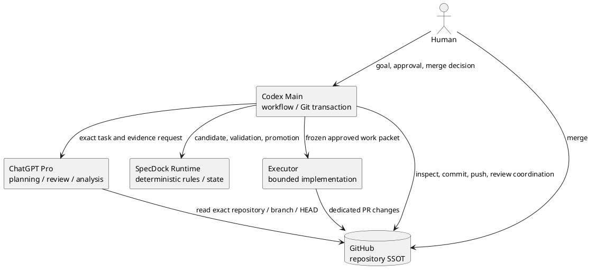
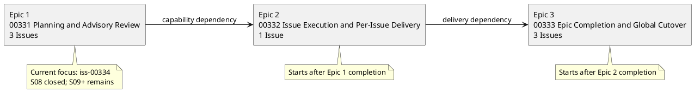
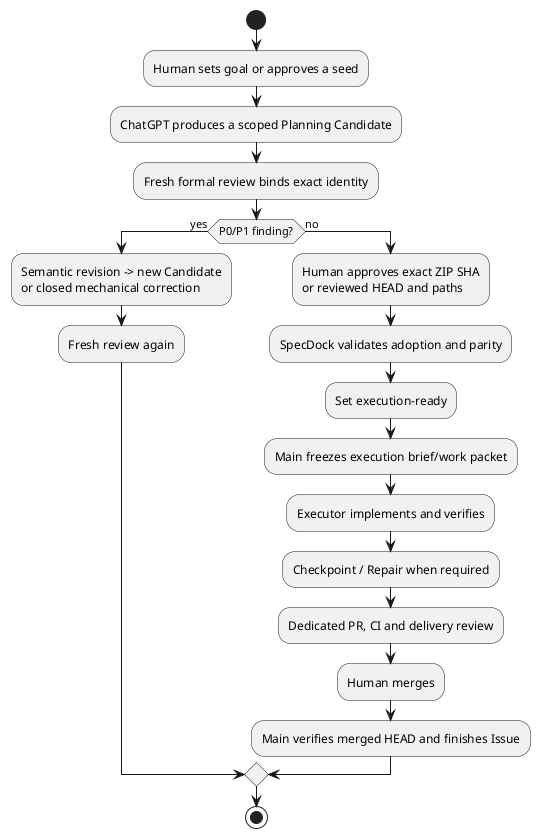

# init-00322 新メンバー向けオンボーディング

> **対象 snapshot**: `chemitaro/spec-dock` の `iss-00334-implement-chatgpt-issue-planning-workflow`、S08 closure HEAD `a297cda42fb356e91dd5c537010a83d66e199932`。これは説明用 evidence artifact であり、canonical requirement/design/plan や承認判断を置き換えない。

## 最初に知ること

`init-00322` は **ChatGPT 5.6 Pro Delegation-First Workflow vNext** を、SpecDock の計画から個別 PR、Epic 完了、cutover まで一貫して使える形にする Initiative です。狙いは「AI に任せる」こと自体ではありません。認知負荷の高い横断分析を ChatGPT に委任しつつ、変更の正当性、Git 操作、実装の境界、merge の決定をそれぞれ適切な主体に残すことです。

GPT-5.5 前提では、段階的 authoring、同じ意味の複数 ledger、Codex による再記述、複数の local reviewer、manual fallback が重なりがちでした。vNext は GPT-5.6 Pro の横断的な計画・レビュー能力を使い、**ChatGPT First**（知的作業をまず ChatGPT に委任する）へ移します。ただし、ChatGPT の出力は evidence/candidate であり、出力だけで仕様にも実装許可にもなりません。

## authority を混同しない

- canonical authority は、Human の明示承認と SpecDock の promotion 条件を満たした Scope の `requirement.md`、`design.md`、`plan.md` です。
- accepted ADR は Human adoption と `report.md` の disposition を根拠に architecture authority になります。
- ChatGPT raw output、Interview、Discussion、Research、self-review、Candidate ZIP は evidence です。Review PASS だけでも Human approval だけでも execution-ready にはなりません。
- `report.md` は observed progress と採否を記録する ledger であり、未来の commit/push を先取りして書く場所ではありません。

## システム全体の役割

| 主体 | 主な仕事 | してはいけないこと |
|---|---|---|
| ChatGPT | Initiative/Epic/Issue planning、Red/Targeted Review、横断分析、Execution Brief、Repair Batch の提案 | canonical を単独で確定、Human gate の代行、hidden Git mutation |
| SpecDock Runtime | node/dependency/validation、Candidate/Artifact の決定的処理、状態と規則の検証 | 意味的な仕様判断、ChatGPT 出力の自動採用 |
| Codex Main | authority の確認、workflow 運用、candidate adoption、diff/commit/push、gate の調整 | Human merge の代行、未承認 candidate の promotion |
| Executor | 承認済み Plan/Brief/Repair Batch に限った実装と検証 | scope 拡張、commit/push/merge、複数 write agent の導入 |
| Human | Goal、portfolio/material change、exact candidate の承認、PR merge、closure 判断 | evidence を読まずに PASS を宣言すること |

### Oracle と operator-local `chatgpt-use` の境界

製品 runtime が依存するのは provider-owned の Oracle adapter と、その安定した task/result contract です。個人の operator 環境にある `chatgpt-use` skill/wrapper は、Codex が ChatGPT を操作するための**運用ツール**であり、製品 runtime の依存関係ではありません。この分離により、operator のローカル設定を consumer/runtime contract に漏らさず、Oracle 障害時にも同じ task/result contract を保持します。

## 現在の portfolio と進捗

現行 portfolio は **3 Epic / 7 Issue / 9 direct dependencies** です。Initiative `report.md` の Portfolio Materialization Disposition は、旧 7 Epic / 17 dependencies が retire 済みであることを記録しています。存在しない「current 7 Epic」は前提にしません。

- **Epic 1 / `epic-00331`**: Issue/Initiative/Epic planning、Planning Review、Targeted Review、Human-approved materialization を実装します。`iss-00334` の S01–S08 は実装・commit・push済みで、S08 は exact HEAD `a297cda42fb356e91dd5c537010a83d66e199932` に対する fresh ChatGPT Pro closure Review が P1-001〜005 closed／new P0/P1 0／PASS となりました。次は S09（Prompt body、exact branch、role output contract）です。
- **Epic 2 / `epic-00332`**: adopted Issue Plan を Execution Brief、single Executor、Checkpoint/Repair、dedicated PR、Human merge、Issue finish まで届けます。Epic 1 の完了が前提です。
- **Epic 3 / `epic-00333`**: multi-Issue coordination、default branch 上の Epic Delivery Review、official cutover、4週間かつ5件以上の post-cutover evaluation、release/closure を扱います。Epic 2 の完了が前提です。

並列化は DAG 上で独立した vertical Issue に限ります。依存 Issue は upstream の Human merge と default-branch refresh 後に開始します。現在は E1 の walking skeleton (`iss-00334`) が先行条件なので、E2/E3 を「計画があるから開始可能」とは扱いません。

進捗の読み方にも注意してください。open GitHub Issue は未着手の同義語ではなく、report の古い snapshot は後続 commit より古い場合があります。進捗主張は、canonical docs、Issue report、exact commit、GitHub PR/CI の四つを照合して行います。

## 典型的な end-to-end lifecycle

Planning の通常経路は archive-candidate（exact logical filename/ZIP SHA）で、`git-bound` は exact reviewed HEAD と target paths に bind する正式 fallback です。どちらの経路でも次の四点が揃うまで実装開始は禁止です。

1. exact identity に対する fresh Review PASS
2. 同一 identity に bind した Human adoption/implementation-start authorization
3. canonical との exact/parity 確認
4. required validation と planning publication

## よくある落とし穴

- **PASS を許可と取り違える**: Review PASS、Human gate、parity のどれか一つだけでは足りません。
- **source drift を見落とす**: Candidate/Review は exact ZIP SHA または exact branch/HEAD/path に bind します。drift 後は新 identity と fresh Review に戻ります。
- **ChatGPT 出力をそのまま正本化する**: raw output は必ず repository facts、canonical docs、tests、GitHub state と照合します。
- **一つの Epic を工程別に細分化する**: Foundation/QA/Metrics/Docs だけを独立 Epic にせず、独立 Outcome/Acceptance/Risk/Rollback/decision boundary があるときだけ分割します。
- **自動 merge を期待する**: PR merge は常に Human の責務です。aggregate Epic PR や事前 Final QA Issue も既定にしません。
- **operator skill を製品依存にする**: `chatgpt-use` は operator-side。runtime は Oracle adapter の boundary だけに依存します。
- **guide を第四の正本にする**: onboarding companion は理解を助ける subordinate artifact です。矛盾時は canonical three documents を優先し、矛盾自体を defect として扱います。

## 新メンバーの読む順と最初の行動

1. Initiative の `requirement.md` を読み、authority、Scope/Non-goal、Slicing Contract を把握する。
2. `design.md` と `plan.md` で 3 Epic/7 Issue、dependency、Candidate/Review/Human gate を追う。
3. `epic-00331` の requirement/design/plan/report と `iss-00334` の canonical docs を読み、実装中の walking skeleton と S08 以降を確認する。
4. `epic-00332`、`epic-00333` は downstream contract として読み、今すぐ作業開始しない理由を確認する。
5. 実作業前に `spec-dock active show`、`spec-dock sync --github`、対象 node の `spec-dock deps check --id <id>` を実行し、ローカルの記憶ではなく live state で readiness を判定する。

最初の貢献は、新しい Epic/Issue を先回りで作ることではありません。active scope、exact GitHub HEAD、canonical authority、必要な Human gate を確認し、現在 ready な一つの vertical Issue のみに参加してください。

## この資料の照合記録

- GitHub remote branch: `iss-00334-implement-chatgpt-issue-planning-workflow`
- ChatGPT authoring source HEAD: `cdfb47171d921ff9f5e28c675de75b2ae52921da`
- current verified pushed S08 closure HEAD: `a297cda42fb356e91dd5c537010a83d66e199932`
- S08 final closure Review: P1-001〜005 closed、new P0/P1 0、PASS
- local source checked: Initiative canonical three documents/reports、current three Epic documents/reports、`iss-00334` canonical docs/report/artifacts、exact commit。
- ChatGPT Pro session: `init-00322-new-member-onboarding`（GitHub connector、model selector `Pro` verified、20m44s、completed）。ChatGPT が生成した responsibility/system-context/lifecycle の構成を採用し、current portfolio、old portfolio retirement、downstream status は local canonical docs と exact commit に合わせて補正した。S08 closure statusはfresh session `iss00334-s08-final-fresh-closure-2`のexact-HEAD PASS後に更新した。raw response 自体は authority ではない。
