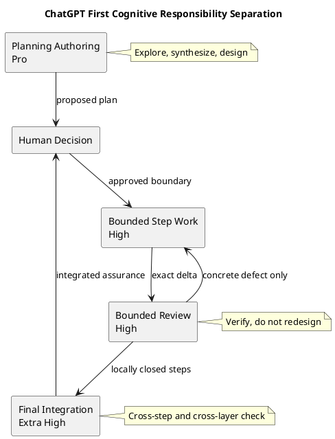
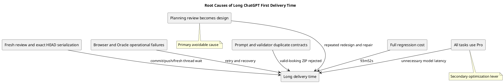
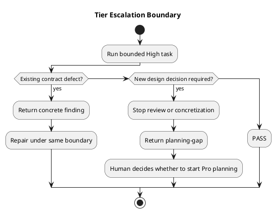
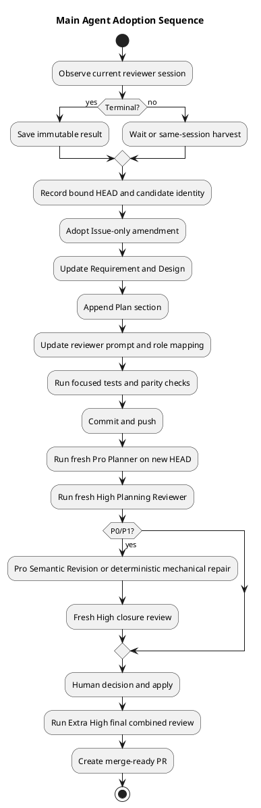
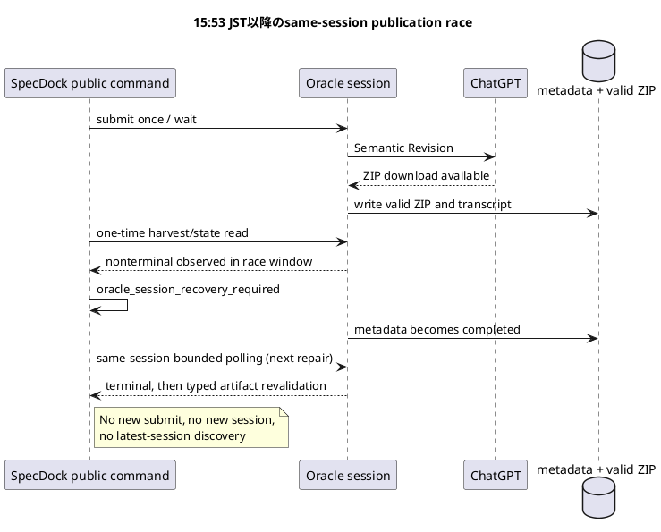

# iss-00334 ChatGPT First統合分析・最適化提案・Main Agent Handoff

## 0. 資料の目的

本資料は、iss-00334で実施したChatGPT Firstの計画、具体化、Review、修正、closure、live dogfoodを統合分析し、次を明確にする。

1. 現在どこまで進んでいるか。
2. なぜ時間がかかったか。
3. 何が有効で、何が過剰だったか。
4. ChatGPTの`Pro`／`Extra High`／`High`をどう割り当てるか。
5. Promptをどのように分離するか。
6. 今回のIssueで修正する範囲。
7. Epic／Initiativeで修正する範囲。
8. Main Agentが安全に作業へ反映する順序。

本資料はrepository外の分析artifactであり、canonical Requirement／Design／Planを変更しない。

## 1. Executive Decision

### 1.1 採用するtier policy

| Task | ChatGPT Intelligence tier | 理由 |
|---|---|---|
| Initiative Planning authoring | `Pro` | Portfolio全体、Epic分解、dependency、authorityを統合する |
| Epic Planning authoring | `Pro` | Issue slicing、acceptance、architecture boundaryを設計する |
| Issue Planning authoring | `Pro` | 実装可能なRequirement／Design／Planとartifactを同時生成する |
| Semantic Revision | `Pro` | formal findingを反映したcomplete replacementを再authoringする |
| Planning Review | `High` | approved designの矛盾、欠落、重複、実装不能だけを確認する |
| Step concretization | `High` | approved Planをbounded implementation packetへ変換する |
| Per-step implementation Review | `High` | exact deltaとaccepted contractの違反を確認する |
| Repair work packet | `High` | 既知findingをminimal correctionへ変換する |
| Closure Review | `High` | prior findingの閉鎖とdirect regressionだけを確認する |
| Final combined Review | `Extra High` | Issue全体のcross-step、cross-layer、spec／code／QA整合を統合確認する |
| Epic Delivery Review | `Extra High` | merged Issues間のinteractionとEpic Outcomeを確認する |
| Initiative Final Review | `Extra High` | Portfolio Outcome、cutover、evaluation、closureを横断確認する |

### 1.2 重要な原則

- **Planning authoringはInitiative、Epic、Issueのすべてで`Pro`を使用する。**
- Planning Reviewとper-step implementation Reviewは、どちらも`High`を使用する。
- 実装Reviewだから自動的にPlanning Reviewより高いtierへ上げない。
- 最終統合Reviewだけ`Extra High`を使用する。
- Review中にarchitecture decisionが必要になった場合、Review tierを`Pro`へ上げない。
- Reviewを停止し、別のPlanning authoring taskとして`Pro`へ戻す。
- tier変更より先に、role、scope、valid finding、output contractをPromptで閉じる。
- silent fallback、tier自動昇格、default branch fallbackを禁止する。

### 1.3 この配分の意味



## 2. Current State Snapshot

### 2.1 Git state

観測時刻:

```text
2026-07-30 15:53 JST
```

| 項目 | 状態 |
|---|---|
| Repository | `chemitaro/spec-dock` |
| Branch | `iss-00334-implement-chatgpt-issue-planning-workflow` |
| HEAD | `1b9f2c52cb8b61e3c48ec69a981f628720dfe2b5` |
| Upstream | `origin/iss-00334-implement-chatgpt-issue-planning-workflow` |
| ahead／behind | `0／0` |
| worktree | clean |
| Pull Request | 未作成 |
| active Initiative | `init-00322` |
| active Epic | `epic-00331` |
| active Issue | `iss-00334` |

Issue pathに触れたcommitは76件、Issue artifactは85件である。

### 2.2 実装進捗

既存Plan上の状態:

- S01〜S11: 実装、focused validation、step Reviewを完了。
- S12 hermetic verification: focused、lint、distribution、full regressionを完了。
- S12 live dogfood: 進行中。
- S13: 未完了。
- S14 final gate: 未完了。
- Delivery PR: 未作成。
- merge-ready: 未成立。

### 2.3 直近live dogfood

二回のinvalid authoring ZIPを修正した後、第三Planner runは成功した。

| 項目 | 値 |
|---|---|
| Planner session | `specdock-planner-77b8d6-075f7a60` |
| status | `completed` |
| model evidence | `requested=Pro`／`resolved=Pro`／`verified=true` |
| authoring ZIP SHA-256 | `5a3ead3e0faab4002a7ae201e6b043ef5fe13e0861c497e3cb9b322785f4566b` |
| Runtime Candidate ID | `iss-00334-v1-20260730t062649z` |
| Runtime Candidate ZIP SHA-256 | `b5eedb8d6c629586d4d72c40fee2c34ea4451b5690dadec91468562104f8d8a7` |

最初のgit-bound Review:

| 項目 | 値 |
|---|---|
| Reviewer session | `specdock-reviewer-77b8d6-60c26e30` |
| status | `completed` |
| model evidence | `requested=Pro`／`resolved=Pro`／`verified=true` |
| verdict | `FAIL` |
| P1 | 1件 |

Findingはonboarding companionのresponsibility diagramが、次の正式経路を正確に描いていないことだった。

```text
Runtime
  -> provider-owned Adapter
  -> PATH Oracle
  -> fresh Reviewer
  -> GitHub exact current branch
  -> closed Review JSON
  -> Oracle
  -> Adapter
  -> Runtime
```

別のfresh Reviewer session `specdock-reviewer-77b8d6-20c2a979`は、観測時点で`running`、`promptSubmitted=true`だった。

### 2.4 Main Agentに対する即時注意

- running sessionを重複送信しない。
- terminalになるまで同一sessionのstatus／harvest経路を使う。
- current Candidate／ReviewはHEAD `1b9f2c52...`へbindされている。
- tier policyをrepositoryへ実装してHEADが変わる場合、current Candidate／Reviewを新HEADのHuman apply evidenceへ流用しない。
- current resultはimmutable evidenceとして保存し、新HEADでfresh planning／Reviewを再確立する。

## 3. ChatGPT Firstで得られた効果

### 3.1 Planning品質

ChatGPTによるauthoringは次を同時に扱えた。

- Requirement、Design、Planのcross-document整合。
- Candidate／Review／Human／apply authority。
- exact repository／branch／HEAD binding。
- direct PATH Oracle boundary。
- authoring ZIPとRuntime Candidateの分離。
- onboarding companionのsubordinate authority。
- provider／projection／distributionの整合。
- negative fixtureとrollback。

Issue Planningは高度な統合作業であり、`Pro`を維持する合理性がある。

### 3.2 実装Reviewの精度

S08〜S11のimplementation Reviewは1〜3回で収束した。
指摘にはexact source path、concrete impact、minimal correction、required testがあり、主に次を検出した。

- executable identity drift。
- corrupt metadata classification。
- ancestor symlink TOCTOU。
- parser exception leakage。
- unbounded ZIP decompression。
- exact repository failure sentinelの誤受理。
- Candidate再検証の欠落。
- stale fake E2E guideによるfalse positive。

これらは改善提案ではなく、accepted contractに対する実害のある実装欠陥だった。
したがって、実装Reviewの存在や1〜3回の往復自体は不健全ではない。

### 3.3 Codex resource shift

ChatGPT Firstにより、次を外部の長時間contextへ委譲できた。

- repository全体のsource-grounded分析。
- multi-file planning authoring。
- step work packet。
- review findingの構造化。
- repair instruction。
- final combined perspective。

Codex側はdiff確認、実装管理、test、commit、push、authority gateに集中できた。
これはCodex tokenとmain contextの温存に有効だった。

### 3.4 Evidence quality

Candidate identity、source HEAD、Review result、Prompt、artifact、commit、test結果が残った。
将来のHuman／Agentが判断経緯を復元できる点は、単純な速度比較では失われてはならない価値である。

## 4. 時間分析

### 4.1 完了ChatGPT session

HEAD `9855eda9`時点の63 completed sessions:

| カテゴリ | session | 合計 | 平均 |
|---|---:|---:|---:|
| Step concretization | 12 | 12:03:29 | 1:00:17 |
| Review | 23 | 6:47:19 | 0:17:43 |
| Planning authoring | 5 | 2:35:33 | 0:31:07 |
| Repair planning | 11 | 2:04:23 | 0:11:18 |
| Decision／admission | 6 | 1:26:53 | 0:14:29 |
| Recovery／smoke | 6 | 0:08:32 | 0:01:25 |
| Total | 63 | 25:06:09 | 0:23:55 |

S01 step concretizationの7時間29分03秒は異常値だった。
これを除く11 stepの平均は約24分57秒である。

### 4.2 Session reliability

同じsnapshotの107 sessions:

| Outcome | 数 | 比率 |
|---|---:|---:|
| completed | 63 | 58.9% |
| error | 43 | 40.2% |
| running | 1 | 0.9% |

errorのうち:

- pre-submit: 11。
- prompt submitted後: 32。

これはtierとは別の運用コストである。
modelを軽くしても、upload、rate limit、login、selector、completion detection、harvest、tab、connectorが不安定なら時間は残る。

### 4.3 Review cycle

完了した主要7サイクル:

| 指標 | 値 |
|---|---:|
| Review | 21回 |
| FAIL→repair往復 | 14回 |
| 初回Reviewから最終PASSまで | 14:48:04 |
| ChatGPT Review処理 | 6:53:32 |
| Repair／commit／push／fresh準備 | 7:54:32 |

Review時間は全体の46.5%であり、残り53.5%は修正と同期だった。
モデル応答だけを高速化しても、全cycleが同じ割合で短縮されるわけではない。

### 4.4 最大の異常: canonical planning review

| 指標 | 値 |
|---|---:|
| Review | 6回 |
| Repair往復 | 5回 |
| 累積P1 | 16件 |
| Cycle | 6:55:29 |
| Review処理 | 2:17:31 |
| Repair／同期 | 4:37:58 |

各findingの証拠は具体的だったが、Reviewが毎回complete snapshotから新しいarchitecture、schema、lifecycleを探索した。
その結果、Reviewが設計作業へ変質した。

defect-onlyへrebaselineした後は、親Epicとの直接矛盾1件だけを指摘し、修正とclosureが約16分で収束した。

### 4.5 実装Reviewは過剰ループではない

| Cycle | Review回数 | Repair往復 | Cycle |
|---|---:|---:|---:|
| S08 | 3 | 2 | 1:46:37 |
| S09 | 2 | 1 | 0:39:26 |
| S10 | 3 | 2 | 1:09:51 |
| S11 | 2 | 1 | 0:48:50 |

回数は1〜3回であり、findingsはaccepted implementation contractへ結びついた。
問題は実装Reviewの存在ではなく、planning Reviewのscope逸脱だった。

## 5. Root Cause Analysis

### 5.1 Root cause overview



### 5.2 Cause A: Review role leakage

Planning Reviewerへ次を同時に求めていた。

- specification review。
- architecture review。
- executability review。
- completeness review。
- additional ambiguity discovery。
- better design exploration。

このPromptでは、高性能なmodelほど新しい設計論点を発見する。
それをP1として扱うと、Candidate revision、commit、push、fresh Reviewが発生する。

解決:

- Reviewはapproved architectureを尊重する。
- direct contradiction、missing obligation、duplication、implementation impossibilityだけをfindingにする。
- より良いarchitecture、new schema、optional hardening、future extensionをfindingにしない。
- architecture decisionが必要ならReviewを停止し、Planningへ戻す。

### 5.3 Cause B: Exact identityによる必要な直列化

Candidate／Review／Human decisionをexact SHA／HEADへbindするため、次は省略できない。

```text
repair
-> test
-> commit
-> push
-> remote parity
-> fresh Review
```

これは無駄ではなくauthorityとreproducibilityのコストである。
削減対象はidentity gateそのものではなく、scope外findingによってこの直列列を不要に再起動することだ。

### 5.4 Cause C: Browser／Oracle operational failure

43／107 sessionsがerrorだった。
新しいtier routingはselector surfaceを増やすため、実装が不十分ならerror率を上げる可能性がある。

解決:

- roleからclosed tierを決定する。
- exact argvをtestする。
- selector failureで別tierへfallbackしない。
- prompt submission後はsame-session recoveryだけを行う。
- requested／resolved tierをevidenceへ残す。

### 5.5 Cause D: Promptとvalidatorの二重契約

直近live dogfoodでは、`Pro` Plannerが二回invalid ZIPを生成した。

第一の拒否:

- validatorは13個のdistinct nonempty H2 assignmentを要求。
- Promptはtopic一覧だけで、split／merge禁止とexact co-locationを十分に示していなかった。

第二の拒否:

- Promptは`system-context`等のhyphen表記を要求。
- validatorは`system context`等の空白表記を探索。

これはmodel能力不足ではない。
Promptから見えないlexical contractをvalidatorが持っていたことが原因である。

`Pro`でもhidden exact grammarは推測できない。

解決の優先順位:

1. typed output contractを一つのauthorityとして持つ。
2. Prompt expectationとvalidatorを同じcontractから生成する。
3. すぐに共有生成へ移せない場合、exact literal parity testを必須にする。
4. live rejectionをmodel retryで解決せず、Prompt／validator driftを診断する。

### 5.6 Cause E: 一律Pro

一律Proは次の問題を持つ。

- bounded checkingでもopen-ended explorationを誘発しやすい。
- session latencyとsubscription capacityを消費する。
- authoringとreviewの責務差が実行設定に反映されない。

ただし、一律Proは主原因ではない。
最大の改善はReview scopeの修正であり、tier routingはその次の最適化である。

## 6. Intelligence Tier Deep Analysis

### 6.1 Tierは難易度ではなくtask shapeで選ぶ

単純に「難しいからPro」と判断すると、すべてProへ戻る。
次の三軸で選ぶ。

| 軸 | 質問 |
|---|---|
| Generativity | 新しい構造、選択肢、計画を作る必要があるか |
| Boundary | 入力、判定条件、対象diffが閉じているか |
| Integration breadth | 複数step／layer／artifactを横断して最終整合するか |

Decision:

```text
新しい設計を生成する
  -> Pro

設計は承認済みで、対象と判定条件が閉じている
  -> High

設計は承認済みだが、最終状態を全体横断で統合確認する
  -> Extra High
```

### 6.2 三つのモードを一軸の強弱として扱わない

`Pro`、`Extra High`、`High`を、単純な
`Pro > Extra High > High`というreasoning levelの序列として扱ってはならない。

OpenAIのGPT-5.6公式ガイドでは、APIの`Pro mode`と`reasoning effort`は独立であり、
常に最大設定を選ぶのではなく、代表taskで比較評価することが推奨されている。

- [Choose pro mode when quality matters most](https://developers.openai.com/api/docs/guides/latest-model#choose-pro-mode-when-quality-matters-most)

一方、現在のSpecDock browser orchestrationでは、ChatGPT UI／Oracleで観測できる
次の三つを、相互排他的な**運用プロファイル**として扱う。

| 運用プロファイル | 現在の操作 | 適したtask shape |
|---|---|---|
| `Pro` | ChatGPTの`Pro`選択 | open-ended synthesis、設計、complete replacement authoring |
| `High` | GPT-5.6 Sol＋high thinking time | 対象と判定条件が閉じた局所変換／局所検証 |
| `Extra High` | GPT-5.6 Sol＋extra-high thinking time | 設計を再開しない広域統合検証 |

したがって、割当基準は「どれが最強か」ではなく、次である。

1. 新しいarchitecture、slicing、計画を生成する必要があるか。
2. 既存contractに対する判定問題として閉じられるか。
3. 局所ではなく、複数step／layer／artifactを横断する必要があるか。
4. marginal quality gainが、追加latencyを正当化するか。

`Pro`をPlanningに固定する理由は、Planningがopen-ended synthesisだからである。
Final Reviewを`Extra High`にする理由は、広域だがauthoringではないからである。
これはFinal Reviewの重要性がPlanningより低いという意味ではない。
役割が異なるという意味である。

将来、代表的なfinal-review corpusで`Pro`が`Extra High`より重大defect recallを
有意に改善し、scope expansionも増やさないことが実測された場合は、
Human decisionでmappingを見直せる。ただし、事前の実測なしに
「finalだからPro」と自動設定しない。

本資料では以後、これらを「推論レベル」ではなく
**ChatGPT intelligence mode profile**または**運用プロファイル**と呼ぶ。

### 6.3 なぜPlanning authoringはすべてProか

Initiative／Epic／Issueでは粒度が異なるが、いずれもauthoringは生成taskである。

Initiative:

- outcomeとportfolio boundary。
- Epic decomposition。
- cross-Epic dependency。
- cutoverとevaluation。

Epic:

- actor outcome。
- Issue slicing。
- per-Issue PR boundary。
- acceptance ownership。

Issue:

- Requirement、Design、Planの同時整合。
- repository architectureへの具体的mapping。
- test、rollback、security。
- onboarding artifact。

Issue Planningも単純な文書補完ではない。
既存sourceを理解し、実装可能なclosed packageへ統合するため、`Pro`を使用する。

Semantic Revisionもcomplete replacement authoringであり、`Pro`を使用する。

Mechanical RevisionはChatGPTを使わずdeterministic local transformationにする。

### 6.4 なぜPlanning ReviewはHighか

Planning Reviewの仕事は設計ではなく確認である。

- 文書間の直接矛盾。
- stated obligationの欠落。
- authorityの二重化。
- non-executable statement。
- acceptanceとstep／testの不一致。
- approved slicing contractへの直接違反。

`High`で十分な理由:

- exact targetとsource identityがある。
- valid finding条件を閉じられる。
- output schemaがclosed JSONである。
- 新しいarchitectureの生成を許可しない。

`High`で解けないarchitecture ambiguityはReview failureではない。
Planning taskへ戻すべきsignalである。

### 6.5 なぜper-step implementation ReviewもHighか

implementation Reviewは深いが、各stepでは次が閉じている。

- exact HEAD／diff。
- allowed paths。
- approved requirement。
- targeted test。
- stop condition。

過去のS08〜S11 findingsは具体的だった。
深さを維持するのはtierだけではなく、exact execution path、contract、impact、testをPromptで要求することによる。

各stepを`High`にし、cross-step interactionはfinal `Extra High`で確認する二層構造が妥当である。

### 6.6 なぜStep concretizationもHighか

Step concretizationはPlanを再設計しない。
次の形式へ変換するtaskである。

- exact scope。
- allowed paths。
- implementation order。
- tests。
- stop conditions。
- worker instruction。

これはclosed transformationであり`High`を使用する。

具体化中にPlanだけでは解けないmaterial ambiguityが見つかった場合:

- 推測で拡張しない。
- `Pro`へ自動昇格しない。
- `planning-gap`としてHumanへ戻す。
- 必要なら別のPro Planning amendmentを開始する。

### 6.7 なぜFinal ReviewはExtra Highか

Final Reviewは新しい設計を作らないが、局所Reviewより対象が広い。

- Requirement／Design／Plan。
- all implementation steps。
- provider／projection。
- distribution。
- test evidence。
- live dogfood。
- status／Report。
- PR boundary。

複数の局所的に正しい変更が、全体では矛盾する可能性を確認する。
このcross-step integrationに`Extra High`を使用する。

`Pro`を使わない理由:

- architectureは既にapproved。
- final gateで新しい設計を提案するとdeliveryが再び開く。
- 目的は統合検証でありauthoringではない。

### 6.8 Mode profile escalationを自動化しない



禁止:

- Highが遅いので自動的にExtra Highへ切り替える。
- Reviewでfindingが出ないのでProへ切り替える。
- selector失敗時にdefault Proへfallbackする。
- Issue Gradeだけでtierを決める。

Initiative Designの「Issue Gradeをmodel／reasoning自動routingへ使わない」と整合させ、workflow roleでclosed mappingする。

## 7. Prompt Best Practices

### 7.1 Planning authoring Prompt

対象tier:

```text
Pro
```

必要要素:

```text
Role:
- You are the Planning author.

Goal:
- Produce a complete, internally consistent planning package.

Authority:
- Human and canonical source precedence.
- Do not mutate repository or claim approval.

Source:
- Exact repository, branch, HEAD.
- Required GitHub connector inspection.
- No default branch fallback.

Scope:
- Exact Initiative / Epic / Issue boundary.
- Parent architecture and non-goals.

Output:
- Exact ZIP filename and root.
- Exact file inventory.
- Required document and artifact contracts.
- No prose outside the ZIP.

Verification:
- Check cross-document consistency before returning.
- Check required sections, PlantUML, manifest expectations.
```

Proには探索を許可するが、scope外のdownstream pre-authoringやHuman authority bypassを許可しない。

### 7.2 Planning Review Prompt

対象tier:

```text
High
```

必須文言:

```text
You are a specification reviewer, not an architect or planner.
Respect the approved architecture and scope.

Report only an existing defect that:
1. cites an exact location,
2. violates an explicit accepted requirement or creates a direct contradiction,
3. has a concrete implementation, authority, safety, or verification impact,
4. can be corrected without reopening the approved architecture.

Do not propose:
- a better architecture,
- a new schema or workflow,
- a new abstraction,
- optional hardening,
- future extensions,
- aesthetic or style improvements.

If the concern requires a new architecture decision,
do not emit it as a finding. Return a planning-gap signal instead.
```

P2／P3もsuggestion欄として使わない。
全severityはactual defectに限定する。

### 7.3 Per-step implementation Review Prompt

対象tier:

```text
High
```

Review対象:

```text
- exact step scope
- exact diff
- accepted requirement/design/plan
- directly affected tests
- direct security and failure semantics
```

Finding必須field:

```text
exact file / symbol / line
violated accepted contract
concrete runtime impact
minimal correction boundary
required regression test
```

禁止:

```text
unrelated repository search
new architecture
new feature
optional refactor
future hardening
```

### 7.4 Closure Review Prompt

対象tier:

```text
High
```

```text
Review only:
- the prior formal finding,
- the exact repair diff,
- directly affected tests,
- direct regressions introduced by that repair.

Do not discover unrelated defects.
Do not reopen accepted design.
Do not propose improvements.
```

### 7.5 Final combined Review Prompt

対象tier:

```text
Extra High
```

perspectives:

- spec consistency。
- code correctness。
- security／authority。
- QA／distribution。
- live evidence。
- lifecycle／status。

ただしfinding条件はexisting contract violationへ限定する。
Final Reviewもarchitecture authoringを行わない。

## 8. Oracle／Browser Mapping

### 8.1 Current UIとOracle

今回の対象はChatGPT browser UIの`Pro`／`Extra High`／`High`である。
APIの`reasoning.mode`／`reasoning.effort`をproduct contractへ直接流用しない。

Oracle 0.16.1の想定mapping:

| SpecDock tier | Oracle argv |
|---|---|
| `Pro` | `--model Pro` |
| `High` | `--model gpt-5.6-sol --browser-thinking-time high` |
| `Extra High` | `--model gpt-5.6-sol --browser-thinking-time extra-high` |

`high`はOracle内部で`extended`、`extra-high`は`heavy`へ正規化される。

### 8.2 Issue Planning role mapping

```text
planner           -> Pro
semantic_revision -> Pro
reviewer          -> High
```

現行adapterは全roleへ次を渡している。

```text
--model Pro
```

したがってReviewerだけをclosed mappingで変更する。

### 8.3 実装上の注意

- `--model Pro --browser-thinking-time extra-high`のようにPro targetとnon-Pro tierを混在させない。
- `--browser-thinking-time`はOracle versionによってhelp visibilityが異なるため、通常helpだけのcapability listへ無条件追加しない。
- supported Oracle version contract、focused test、live smokeで保証する。
- selector errorで別tierへfallbackしない。
- prompt submission後はsame-session recoveryだけを許可する。
- product runtimeはpersonal `chatgpt-use` wrapperへ依存しない。
- operator-side analysisは指定`chatgpt-use` wrapperを利用できる。

## 9. Tier変更による時間効果

### 9.1 数値予測の制約

過去の正式runはほぼすべて`Pro`であり、`High`／`Extra High`の比較母集団がない。
したがって削減率は実測値ではない。

### 9.2 Sensitivity analysis

S01異常値とfinal combined Reviewを除き、将来`High`候補となるcompleted session poolを概算すると14:27:56である。

内訳:

- step concretization excluding S01: 4:34:26。
- Review excluding one final combined Review: 6:22:14。
- repair planning: 2:04:23。
- decision／admission advisory: 1:26:53。

仮に同じ品質と回数を維持したままsession durationだけが短くなる場合:

| Highによる仮定短縮率 | 概算短縮 |
|---:|---:|
| 15% | 約2時間10分 |
| 25% | 約3時間37分 |
| 35% | 約5時間04分 |

これは予測ではなく、評価規模を理解するための感度分析である。

### 9.3 Scope修正の方が効果が大きい

canonical planning broad Reviewは6:55:29を要した。
defect-onlyへ限定した後は約16分で収束した。

この差はtier変更ではなく、Reviewが設計から確認へ戻った効果である。

優先順位:

1. Prompt scope。
2. valid finding contract。
3. Prompt／validator contract parity。
4. tier routing。
5. browser／Oracle reliability。

## 10. 今回のIssueで修正すること

### 10.1 Scope判断

iss-00334はIssue Planning Workflowを実装するIssueである。
そのため、次はIssue内で修正できる。

- Issue Plannerのtier。
- Issue Semantic Revisionのtier。
- Issue Planning Reviewerのtier。
- Planning Reviewer Prompt scope。
- direct Oracle argv。
- role別fake Oracle test。
- provider／projection parity。
- current Issue executionにおけるremaining ChatGPT step運用。

次はIssue内でgeneralizeしない。

- Initiative／Epic Planning実装。
- generic all-workflow tier engine。
- Issue Execution全体の恒久Review orchestrator。
- organization-wide telemetry database。
- arbitrary user-configurable tier。

### 10.2 Requirement amendment

Issue Requirementへ追加する内容:

1. Planner／Semantic Revisionは`Pro`を必須とする。
2. Planning Reviewerは`High`を必須とする。
3. roleからclosed tierを決め、Issue Gradeやcaller任意文字列から決めない。
4. tier selector失敗時に別tierへfallbackしない。
5. Planning Reviewはdefect-onlyであり、新architecture／schema／workflow提案をfindingにしない。
6. architecture decisionが必要な場合は`planning-gap`としてHumanへ戻す。
7. provider／wheel／sdist／fresh init／update／dogfoodで同じrole mappingを持つ。

追加Acceptance候補:

```text
Planner / Semantic Revision:
  exact argv contains --model Pro
  no non-Pro thinking-time override

Reviewer:
  exact argv contains --model gpt-5.6-sol
  exact argv contains --browser-thinking-time high

All roles:
  no silent fallback
  exact branch policy preserved
  provider/projection parity
```

### 10.3 Design amendment

closed internal profile:

```text
IssuePlanningIntelligenceProfile
- role
- model_selector
- browser_thinking_time
```

Mapping:

```text
planner           -> model=Pro, thinking_time=None
semantic_revision -> model=Pro, thinking_time=None
reviewer          -> model=gpt-5.6-sol, thinking_time=high
```

設計制約:

- public CLI optionを増やさない。
- callerにarbitrary tierを渡させない。
- adapter内部のrole mappingに局所化する。
- Prompt roleとtier roleの不一致を拒否する。
- Oracle version contractを維持する。

### 10.4 Plan amendment

Issue Planはappend-only履歴を持つ。
既存§91の「各step ChatGPT Pro」は過去実施履歴として書き換えない。

Plan末尾へ新sectionを追加し、remaining workに対してsupersedeする。

推奨:

```text
## 32. ChatGPT Intelligence Tier and Review Scope Optimization Amendment

- S01〜現時点のPro evidenceはhistorical valid evidenceとして保持する。
- remaining Issue Planning authoring／Semantic RevisionはPro。
- remaining step concretization、planning Review、per-step Review、
  repair、closureはHigh。
- final combined ReviewはExtra High。
- current Candidate／Reviewはbound HEAD変更時に再利用しない。
- role mapping implementation、tests、live smokeをS12 remaining workへ加える。
- S13／S14 sequenceとHuman-only merge boundaryは維持する。
```

新しい巨大milestoneを追加せず、S12のremaining live dogfoodとS14 final Reviewへ統合する。

### 10.5 Prompt resource

現行Reviewer resourceは既に`fresh, read-only, defect-only`と、onboarding向け`unsolicited redesign`禁止を持つ。

追加するgeneral rule:

- all planning targetsでbetter architecture禁止。
- new schema／workflow／abstraction禁止。
- optional hardening／future extension禁止。
- P0〜P3の全findingをactual defectに限定。
- exact existing requirement／contradictionとconcrete impactを必須化。
- architecture reopeningが必要ならfindingにせず`planning-gap`。

Planner／Revision Promptはauthoring責務を維持し、Reviewer制約を混入しない。

### 10.6 Runtime implementation

最小変更:

1. role→argv fragmentを返すprivate helperを追加。
2. current unconditional `--model Pro`をhelper出力へ置換。
3. Reviewerだけ`--browser-thinking-time high`を追加。
4. existing browser-only、exact branch、remote Chrome、no-cookie-syncを維持。
5. no personal wrapper、no API fallbackを維持。

避けること:

- generic model registry。
- config file。
- environment override。
- public CLI tier option。
- automatic fallback。
- role以外のheuristic routing。

### 10.7 Tests

必須focused tests:

- Planner argv: `Pro`。
- Semantic Revision argv: `Pro`。
- Reviewer argv: `gpt-5.6-sol`＋`high`。
- Reviewer argvに`Pro`が混入しない。
- authoring argvにnon-Pro thinking timeが混入しない。
- same-session recoveryが元profileを維持する。
- unsupported Oracle／selector failureでno fallback。
- provider／dogfood exact byte parity。
- wheel／sdist／fresh init／update parity。
- Prompt reviewer redesign-negative fixture。
- existing Candidate／Review／Human／apply suite regression 0。

### 10.8 Current live sequence

Main Agentは次の順で扱う。

1. 現在runningのReviewerを完了まで待つ。
2. resultをimmutable evidenceとして保存する。
3. current Candidate／Reviewのbound HEADを記録する。
4. tier／Prompt amendmentを採用するかHuman decisionを確認する。
5. 採用する場合、current Candidateを新HEADへ流用しない。
6. canonical amendment、code、tests、projectionを一つのbounded changeとして実装する。
7. commit／pushしてclean remote parityを作る。
8. new HEADでPlanner `Pro`をfresh実行する。
9. Reviewer `High`をfresh実行する。
10. Human decision後のapply／remote parityを完了する。
11. final combined `Extra High` Reviewを行う。
12. merge-ready PRを作成し、Human mergeで停止する。

## 11. Epicで修正すること

対象:

```text
epic-00331 ChatGPT Planning and Advisory Review
```

### 11.1 Epic requirement

追加する共通policy:

- Initiative／Epic／Issue Planning authoringとSemantic Revisionは`Pro`。
- Planning Reviewは`High`。
- Targeted Reviewはbounded advisoryとして`High`。
- Epic Delivery Reviewは`Extra High`。
- role-based mappingでありIssue Grade routingではない。
- selector failureでfallbackしない。
- requested／resolved tierをevidenceへ記録する。

### 11.2 Epic design

Epic全体のrole tableを一つ定義する。

```text
planning-author       -> Pro
semantic-revision     -> Pro
planning-review       -> High
targeted-review       -> High
epic-delivery-review  -> Extra High
```

RoleごとにPrompt authorityを分ける。

- author Prompt: synthesis allowed。
- reviewer Prompt: defect-only。
- targeted advisory: suggestions allowedだがFormal Gateなし。
- delivery Prompt: cross-Issue integration、no redesign。

### 11.3 E1-I2へのhandoff

`iss-00335 Implement Initiative Epic Portfolio Planning Workflow`:

- Initiative／Epic authoringは`Pro`。
- Semantic Revisionも`Pro`。
- decomposition-quality Planning Reviewは`High`。
- Reviewerはover／under slicingのcontract違反を指摘できるが、replacement Portfolioを設計しない。
- replacementが必要ならPro Blue authoringへ戻す。

### 11.4 E1-I3へのhandoff

`iss-00336 Implement Targeted Review and Planning Surface Cutover`:

- Targeted Review defaultは`High`。
- advisoryでarchitecture explorationを依頼する場合はFormal Reviewと分離し、Humanが明示的にPro authoring／consultationを選ぶ。
- planning-specific cutover後もrole mapping、Prompt scope、evidenceを維持する。

### 11.5 Epic Delivery

全3 Issue merge後のEpic Delivery Review:

```text
Extra High
```

確認対象:

- Issue／Portfolio／Targeted Reviewの連携。
- Prompt role separation。
- role tier parity。
- planning-specific legacy route不在。
- provider／installed／dogfood parity。
- metrics。

新architecture proposalは出さず、Epic accepted contract違反だけをfindingにする。

## 12. Initiativeで修正すること

対象:

```text
init-00322 GPT 56 ChatGPT First Intelligence Architecture
```

### 12.1 Requirement

Initiative-level requirementとして次を追加する。

1. ChatGPT Firstはall-Proを意味しない。
2. Planning authoringは全scopeでPro。
3. bounded planning／implementation／closure ReviewはHigh。
4. final Issue／Epic／Initiative ReviewはExtra High。
5. architecture decisionはReview内で行わず、Pro Planningへrouteする。
6. Issue Gradeをtier routingへ使用しない。
7. role mapping、requested／resolved tier、duration、outcome、finding、repair、round tripをEvidence化する。
8. silent fallback、unobserved selector、default branch fallbackを禁止する。

### 12.2 Design

cross-Epic policy:

```text
Authoring lane
  Initiative / Epic / Issue / Semantic Revision
  -> Pro

Execution lane
  Step concretization / bounded repair
  -> High

Verification lane
  Planning / step implementation / closure
  -> High

Integration lane
  Issue final / Epic delivery / Initiative final
  -> Extra High
```

既存Designの「Issue Gradeをmodel／reasoning自動routingへ使わない」は維持する。
tierはGradeではなくworkflow roleから決める。

### 12.3 Plan

Initiative Planへ追加する評価obligation:

- role別duration。
- selector failure率。
- completed／pre-submit／post-submit error。
- accepted P0／P1。
- scope外proposal数。
- repairを起動したfinding数。
- PASSまでのround trip。
- final Reviewで初めて見つかったdefect。
- Highで見落とし、Extra High／Proで検出したdefect。

### 12.4 Metricsへの接続

既存M-008、M-010、M-011、M-013へ接続する。

- M-008 Changeability Drill: tier labelをRuntime migrationなしで局所変更可能。
- M-010 Implementation Convergence: first Checkpoint PASS、failure cycle。
- M-011 Codex Resource Shift: ChatGPT delegationとhandoff量。
- M-013 Total Delivery Efficiency: latency、quality、mode固定化の妥当性。

追加metric候補:

```text
Tier Routing Effectiveness
- role/tier conformance 100%
- silent fallback 0
- selector unknown 0 for accepted evidence
- planning review architecture-suggestion findings 0
- High step review重大defect recall non-inferior
- final Extra High incremental critical finding trend
```

## 13. Main Agent Handoff

### 13.1 まず理解すべき状況

- 現在の遅延はChatGPT First全体の失敗ではない。
- Planning authoringとimplementation Reviewの品質は高い。
- 不健全だったのはbroad planning Reviewがarchitecture authoringへ変質した部分。
- implementation Reviewは1〜3回で収束し、findingsも実害があった。
- current live failure二件はmodel tierではなくPrompt／validator contract drift。
- all-Proは二次的なlatency要因であり、role-based tierへ変える価値がある。
- current branchはclean／remote parityだが、live Candidate／Reviewが進行中である。

### 13.2 Main Agentへの推奨decision

```text
ADOPT_BOUNDED_TIER_AND_REVIEW_SCOPE_AMENDMENT
```

理由:

- Issue PlanningのPlanner／Reviewer roleは既に分離されている。
- current adapterのunconditional Proをclosed role mappingへ変える差分は小さい。
- Review Promptのdefect-only制約は既存方針の明確化であり、architectureを変更しない。
- future Initiative／Epic workflowへのgeneralizationは上位scopeへ送れる。

### 13.3 Main Agentの作業順



### 13.4 Explicit non-goals for Main Agent

- current Candidateをnew HEADへ流用しない。
- running Reviewerを取消・重複送信しない。
- all workflow向けgeneric tier frameworkをiss-00334へ追加しない。
- Initiative／Epic Planning implementationを先行しない。
- Prompt改善を新architecture proposalへ拡張しない。
- tier変更と無関係なrefactorを行わない。
- Human decision、merge、Issue finishを代行しない。

### 13.5 Acceptance for this amendment

```text
Documentation
- Issue Requirement/Design updated
- Issue Plan append-only section added
- Epic/Initiative follow-up explicitly recorded

Prompt
- Planning Reviewer is defect-only for all planning targets
- redesign and suggestion findings prohibited

Runtime
- planner = Pro
- semantic_revision = Pro
- reviewer = High
- no fallback

Tests
- exact argv per role
- recovery preserves role profile
- prompt negative fixtures
- provider/projection/distribution parity
- existing Issue Planning regression green

Live
- fresh new-HEAD Planner observed Pro
- fresh new-HEAD Reviewer observed High
- exact branch verified
- Candidate/Review/Human binding valid

Final
- Extra High final combined Review PASS
- PR merge-ready
- Human-only merge boundary preserved
```

## 14. Suggested Message to Main Agent

以下をMain Agentへそのまま共有できる。

```text
iss-00334のChatGPT First所要時間、Review往復、現行Oracle adapter、
Prompt、canonical Issue/Epic/Initiative文書、live sessionを統合分析した。

決定:
- Initiative/Epic/Issue Planning authoringとSemantic Revisionは常にPro。
- Planning ReviewはHigh。
- 各stepの具体化、per-step implementation Review、repair、closureもHigh。
- Issue/Epic/Initiativeのfinal combined/delivery ReviewだけExtra High。
- Reviewでarchitecture decisionが必要ならtierをProへ上げず、
  planning-gapとして別Pro Planningへ戻す。

原因:
- 最大の遅延はall-Proではなく、planning Reviewが設計提案をP1化し、
  5回の修正とfresh Reviewを起動したこと。
- implementation Reviewは1〜3回で収束し、findingsも具体的で健全。
- current live ZIP拒否二件はmodel能力不足ではなく、
  Promptとvalidatorの13-H2／PlantUML role lexical contract drift。
- Oracle/browser errorとexact HEAD同期も時間を使うため、
  tier変更だけで全時間は解決しない。

Current state snapshot:
- branch iss-00334-implement-chatgpt-issue-planning-workflow
- HEAD 1b9f2c52cb8b61e3c48ec69a981f628720dfe2b5
- clean、remote parity 0/0、PRなし
- third Planner succeeded and produced Candidate v1
- first git-bound Review failed with one onboarding-diagram P1
- another fresh Reviewer was running at 2026-07-30 15:53 JST

Immediate guard:
- running sessionを重複送信しない。
- current resultをimmutable evidenceとして保存する。
- tier implementationでHEADが変わる場合、current Candidate/Reviewをnew HEADへ流用しない。

Issueで行うbounded change:
1. Requirement/Designへrole-based tier policyを追加。
2. Plan末尾へappend-only amendmentを追加し、既存Pro履歴を保持。
3. Reviewer Promptをgeneral defect-onlyへ強化し、
   new architecture/schema/workflow/optional improvementをfinding禁止。
4. provider-owned adapterをclosed mappingへ変更:
   planner/semantic_revision -> --model Pro
   reviewer -> --model gpt-5.6-sol --browser-thinking-time high
5. exact argv/no-fallback/recovery/parity testsを追加。
6. commit/push後のnew HEADでPro Planner→High Reviewerをfresh dogfood。
7. Human apply後、Extra High final combined Review。

Issueでは行わない:
- generic tier framework
- Initiative/Epic Planning implementation
- arbitrary configuration
- Grade-based routing

Epic/Initiativeへ送る:
- all Planning authoring Pro
- bounded Review High
- final Review Extra High
- role-based, not Grade-based
- requested/resolved tier、duration、error、finding、round trip telemetry
- Prompt/validator single contract authority
```

## 15. Evaluation Plan

### Phase 1: Current Issue

- Reviewer High live successを確認。
- prior Pro Reviewとduration、output validity、finding qualityを比較。
- final Extra HighでHigh step Reviewのmissを確認。

### Phase 2: Next 3 Issues

各Issueで記録:

- role。
- requested tier。
- resolved tier。
- started／completed。
- error class。
- finding count。
- accepted finding。
- repair count。
- final-only finding。

### Phase 3: Policy review

判断:

- Planning authoring Proは固定。
- High step Reviewで重大finding recallが不十分ならPrompt／contextを先に修正。
- それでも不足する場合だけ対象roleをExtra Highへ上げる。
- final Extra Highで毎回多数のstep-local defectが出る場合、High Review Promptまたはtest gateを改善する。
- final Extra Highのincremental findingが継続的に0で、latencyが重大ならsampling policyをHuman判断する。

## 16. Risks

| Risk | Mitigation |
|---|---|
| High selector drift | exact argv test、live smoke、no fallback |
| High Reviewの見落とし | exact contract Prompt、targeted tests、final Extra High |
| Pro authoringのscope expansion | parent boundary、non-goals、exact output contract |
| Extra High finalのredesign | existing contract violation限定 |
| tier policyが巨大framework化 | Issueではclosed role mappingだけ |
| current Candidate identity失効 | HEAD変更後はfresh Candidate／Review |
| Promptとvalidator再drift | shared contractまたはliteral parity tests |
| telemetryが新database化 | existing Report／session evidenceを先に利用 |

## 17. Final Recommendation

ChatGPT Firstの基本方針は維持する。

今回の分析から、最適化の中心は次である。

```text
Planning authoring quality
  -> Proを維持

Planning Review loop
  -> defect-only Prompt + High

Per-step execution
  -> concretization High + Review High

Issue-wide assurance
  -> final Extra High

Architecture ambiguity
  -> Reviewで解かず、Human gate経由でPro Planningへ戻す
```

この構造は、ChatGPTの高度な分析能力を弱めるのではない。
生成能力をPlanningへ、局所検証能力を各stepへ、統合能力をfinal gateへ割り当て、同じ分析を全工程で重複させない設計である。

最大の改善は「Proを減らすこと」単独ではなく、**Planning author、bounded Reviewer、final integratorの責務を分離すること**である。

## 18. Source Materials

- `/private/tmp/iss-00334-chatgpt-first-time-analysis-20260730/chatgpt-first-time-analysis.md`
- `/private/tmp/iss-00334-chatgpt-first-time-analysis-20260730/review-repair-cycle-analysis.md`
- `/private/tmp/iss-00334-chatgpt-first-time-analysis-20260730/chatgpt-intelligence-tier-routing-analysis.md`
- `spec-dock/active/initiative/{requirement,design,plan}.md`
- `spec-dock/active/epic/{requirement,design,plan}.md`
- `spec-dock/active/issue/{requirement,design,plan,report}.md`
- `src/spec_dock/assets/spec_dock/scripts/spec_dock_runtime/infra/issue_planning_chatgpt.py`
- `src/spec_dock/assets/spec_dock/scripts/spec_dock_runtime/infra/issue_planning_oracle_artifact.py`
- `src/spec_dock/assets/install_root/.agents/skills/spec-dock-issue-planning/resources/*.md`
- Oracle 0.16.1 source and browser selector tests under `/Volumes/990p2t/workspace/tools/oracle`
- Oracle session metadata under `/Users/iwasawayuuta/.oracle/sessions/`
- [GPT-5.6 model guidance](https://developers.openai.com/api/docs/guides/latest-model#update-api-and-model-parameters)
- [Reasoning mode](https://developers.openai.com/api/docs/guides/reasoning#reasoning-mode)
- [Advice on prompting](https://developers.openai.com/api/docs/guides/reasoning#advice-on-prompting)

## 19. Continuation Update — 2026-07-30 16:42:56 JST

### 19.1 更新の範囲と観測点

本章は、15:53 JST snapshot以降にterminalとなったsessionと、現在のrepository／evidenceを追記する。既存の分析、提案、PlantUML、履歴上の数値を上書きせず、後続の一次証跡で補正する。

観測した一次証跡は、branch `iss-00334-implement-chatgpt-issue-planning-workflow`、HEAD `1b9f2c52cb8b61e3c48ec69a981f628720dfe2b5`、`/Users/iwasawayuuta/.oracle/sessions/*/meta.json` と各session artifact、および `/private/tmp/codex-agent-work/501/session-20260730t040101z-iss00334-s12-live-d3473ee3-8d847355/live-evidence/` である。16:42:56 JST snapshotはcleanかつupstream一致だった。16:47 JSTの再確認ではHEADは同じで、same-session recovery repairに対応するprovider/projection runtime、focused unit test、Issue-local work packetのWIPがある。

### 19.2 15:53 JST以降に確定したlive lifecycle

| event | session / evidence | 結果 | duration |
|---|---|---|---:|
| Candidate v1 | `specdock-planner-77b8d6-075f7a60` | created、Candidate ID `iss-00334-v1-20260730t062649z`、runtime ZIP SHA-256 `b5eedb8d6c629586d4d72c40fee2c34ea4451b5690dadec91468562104f8d8a7` | 15:10 |
| git-bound Review | `specdock-reviewer-77b8d6-60c26e30` | FAIL、P1 1件（onboarding responsibility diagram） | 7:48 |
| archive Review | `specdock-reviewer-77b8d6-20c2a979` | FAIL、P1 3件（onboarding identity、roadmap status、Oracle transport boundary） | 15:31 |
| Semantic Revision | `specdock-semantic-revision-77b8d6-11b34339` | completed、valid authoring ZIP SHA-256 `c26fcbb4edc55f7f2d5eccb4a5fb8248898221156bc2c4b99606b8114cf486b3`を保存 | 19:52 |
| race diagnosis | `iss00334-terminal-artifact-race` | completed、`GO_BOUNDED_SAME_SESSION_POLLING` work packetを保存 | 11:55 |

Semantic Revisionはvalid ZIPとtranscriptを保存したが、public commandは `oracle_session_recovery_required` で終端した。これはartifact rejectionではなく、同一process内でharvest直後に一回だけmetadataを読み、数秒後の`completed`への遷移を待たないterminal/artifact publication raceである。したがって再送や新session作成は誤りであり、同sessionをrecoverする。



### 19.3 KPI delta

15:53 JST snapshot以降の追加ChatGPT wall timeは **46:32** である。内訳は、当時runningだったarchive Reviewの残り **14:45**、Semantic Revision **19:52**、race diagnosis **11:55**。これはwall-clock重複を含まないsession単位の合計である。

| KPI | 15:53 snapshot | continuation delta | 16:42:56 current |
|---|---:|---:|---:|
| completed sessions | 63 | +3 | 66 |
| error sessions | 43 | +0 | 43 |
| running sessions | 1 | -1 | 0 |
| observed sessions | 107 | +2 | 109 |
| completed-session cumulative duration | 25:06:09 | +47:18 | 25:53:27 |
| post-snapshot additional wall time | — | +46:32 | 46:32 |

`+47:18`は当時runningだったarchive Reviewの全duration 15:31を完了session累積へ取り込むため、15:53以降の残り時間46:32とは一致しない。これらを区別しないと、snapshot前に既に消費したarchive Reviewの約46秒を重複計上する。

### 19.4 tier proposalの実装可能性を訂正する

既存のHigh／Extra High mappingは、task shapeの**評価仮説**としては保持できるが、現行実装として断定できない。確認結果は次のとおりである。

| layer | `High` / `Extra High` status | evidence | 結論 |
|---|---|---|---|
| direct Oracle 0.16.1 | `--browser-thinking-time high`を`extended`、`extra-high`を`heavy`へ正規化できる | installed `oracle --version`=`0.16.1`、dist `thinkingTime.js`／option parser | CLI capabilityは存在する |
| operator `chatgpt-use` wrapper | `--browser-thinking-time`をunsupported optionとして即時拒否する | `/Users/iwasawayuuta/.agents/skills/chatgpt-use/scripts/oracle-chatgpt` | wrapper経由では利用不能 |
| SpecDock provider-owned adapter | all rolesに`--model Pro`だけを渡し、thinking-time argvを組み立てない | `issue_planning_chatgpt.py` | product runtimeには未実装 |
| live product evidence | Proのみがverified | current Planner／Reviewer／Semantic Revision session metadata | High／Extra Highのlive verificationは未実施 |

よって、`planner -> Pro`／`semantic_revision -> Pro`は現在の事実であるが、`reviewer -> gpt-5.6-sol --browser-thinking-time high`およびfinal Extra Highは、adapter contract、focused test、managed-Chrome live smokeを別途通すまでproposal/evaluation扱いに訂正する。current wrapperを変更してproduct runtimeへ依存させることも、本Issueのdirect Oracle boundaryと矛盾する。

### 19.5 最小の改善優先順位

今回新たに判明した改善は二つだけである。

1. **same-session recovery raceを閉じる。** submit一回、harvest最大一回、同じprivate session metadataをsingle monotonic deadline内でpollする。terminal後も既存typed artifact readerでsafe-open／hash／ZIP validationを再実行する。invalid artifactをpollingで救済しない。
2. **長時間のstale UI／capture delayを計測可能にする。** sessionの`startedAt`／`completedAt`、prompt submission、harvest開始／終了、metadata terminal観測を同じevidenceに記録し、timeout・capture lag・model response timeを混同しない。これは新registryや自動resubmitを要求しない。

tier routingの導入、generic configuration、Review scopeの再設計は、このrace修正と同じ変更へ混ぜない。まずimmutable Semantic Revision artifactを正しくpublicationできることが次のgateである。

### 19.6 Current main-agent handoff

1. provider authorityの`_recover_same_session`をbounded same-session pollingに限定して修正する。
2. Red/Greenでeventual completion、harvest nonzero／timeout、invalid metadata、deadline、submit=1、harvest<=1、new session=0を確認する。
3. official updateでdogfood projectionを同期し、commit/pushする。
4. 新規Semantic Revisionを送らず、既存`specdock-semantic-revision-77b8d6-11b34339`のrecovery publicationを再開する。
5. published Candidateをfresh Reviewへ渡す。P0/P1以外の提案でcycleを再開しない。

未確定事項は、修正後のrecoveryが現存sessionをpublic candidateとして正しくpublishできるか、およびHigh／Extra Highがmanaged Chromeの現行UIで期待どおり選択・観測できるかである。後者はrecovery修正の成功条件ではない。
