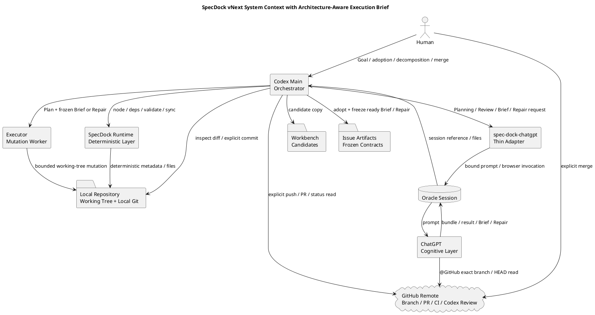

# init-00322 GPT 56 ChatGPT First Intelligence Architecture — 設計


## 1. 設計目的とInitiative identity

本設計は、`ChatGPT 5.6 Pro Delegation-First Workflow vNext`のtarget architectureを定義する。高度認知、Workflow制御、bounded mutation、決定的Runtime処理を分離し、PlanningからHuman merge確認後のfinishまでを一つのauthority modelで接続する。

Architecture-Aware Execution Briefは、特定のarchitecture、framework、design methodologyを前提にせず、ChatGPTが実装開始前のexact HEADから目的、実装状況、責任境界、契約、関連Artifact、code、tests、configuration、repository conventionsを横断調査し、対象Execution UnitにmaterialなConcernだけを選択して、テスト戦略と実装戦略を具体化する。

- Initiative ID: `init-00322`
- filesystem path: `spec-dock/initiatives/init-00322-gpt-5-6-chatgpt-first-intelligence-architecture`
- GitHub Issue: `#322`
- repository title: `GPT 56 ChatGPT First Intelligence Architecture`
- program label: `ChatGPT 5.6 Pro Delegation-First Workflow vNext`

ADR／Interview／Discussion／Researchの採用状態はHuman判断とMain Orchestratorが`report.md`へ記録するdispositionで確定する。設計優先順位は、Contract OwnerとHuman Gate、Evidenceに基づく分析品質、GitHub exact HEAD、Mainだけの明示的Git transaction、Runtime非parse、可変部分の局所化、Scope互換、Codex資源効率の順とする。

## 2. System Contextと目標状態

GPT-5.5前提の旧構造は、ChatGPT evidence、preservation、claim ledger、Codex rewrite、複数local reviewer、report／repair stateへ同じ意味を複製していた。vNextではChatGPTがcomplete Planning／Review／Execution Brief／Repair outputを返し、Mainが採否とGit transitionを制御し、ExecutorとRuntimeはlocal working treeだけを変更する。



`Local Repository`と`GitHub Remote`は別境界である。ExecutorとRuntimeはlocal working treeまで、Mainは明示的commit／push／PRまで、Humanはmergeだけを所有する。ChatGPTはrepositoryを読み、分析Artifactを生成するが、filesystemとGitを変更しない。

## 3. Authority、SSOT、Ubiquitous Language

### 3.1 Authority hierarchy

1. Humanの明示判断とMainが`report.md`へ記録したadoption／disposition。
2. Human承認とpromotion条件を満たしたcanonical `requirement.md`／`design.md`／`plan.md`。
3. Human adoptionと`report.md` dispositionが確認できるADR。
4. 修復対象範囲ではSource HEAD固定のfrozen Repair Batch。
5. 通常Execution UnitではSource HEAD固定のaccepted Architecture-Aware Execution Brief。
6. Workflow文書と公開Skill。
7. Executorの局所判断。
8. Discussion、Research、Interview、Workbench、raw Review、Oracle transcript等のevidence。

上位と下位が矛盾するときは下位を実行せず、PlanningまたはHuman Gateへ戻る。同じUnitにRepair Batchが存在する場合、その修復範囲ではRepair BatchがExecution Briefの推奨戦略を置き換える。ただし、どちらもcanonical三文書を変更できない。

### 3.2 SSOT

| 情報 | SSOT |
|---|---|
| Scope／要件／設計／Issue全体計画 | adoption済みcanonical三文書 |
| Evidence／ADR採否 | Human判断＋`report.md` disposition |
| Node／dependency／active | SpecDock metadata／Runtime |
| tracked repository | GitHub exact branch／HEAD |
| local mutation | working tree／Git diff |
| ChatGPT run | Oracle session |
| PR／CI／Codex Review | GitHub PR |
| planned Execution Unitの実装具体化 | accepted frozen Architecture-Aware Execution Brief |
| bounded repair | frozen Repair Batch |
| completion／handoff | `report.md` |
| temporary candidate／diagnostic | Workbench |

### 3.3 Ubiquitous language

| Term | Meaning | Not meaning |
|---|---|---|
| Planning Bundle | 同一fresh sessionで生成・セルフレビューする完全三文書 | patch、claim集合、Runtime合成物 |
| Contract Owner | Formal Reviewの評価対象Scope | 実装Agent、変更path |
| Execution Unit | 実装前に一つの目的・前提・検証戦略として具体化できるMilestoneまたはTranche | file数だけで決める固定単位 |
| Architecture-Aware Execution Brief | exact HEADから目的・構造・契約・Evidence・test／implementation strategyを具体化したUnit限定のfrozen subordinate contract | 第四canonical文書、patch、実施記録、特定architecture専用template |
| Applicable Concern | 対象Unitの正しい実装にmaterialな影響を持つarchitecture／domain／framework／data／event／transaction／compatibility／security／operation等の観点 | 全Unitへ必須の固定section |
| Deterministic Anchor | Codex／wrapperが意味判断なしで提供するrepo、branch、HEAD、Scope path、Artifact directory、dependency scope、Unit ID | 関連Artifactの意味的選択 |
| Evidence Used | ChatGPTがBrief作成に実際に利用したcanonical docs、ADR、Artifact、code、tests、config、conventions | 全repository file一覧 |
| Repair Batch | Source HEAD固定の小規模設計書兼実装計画書 | 実施記録、PR state、Planning裏口 |
| Execution Tranche | Issue Planが定める意味的実装単位 | Runtime固定schema |
| ready | Evidenceが十分で、上位Plan内でExecutorへ委任可能 | Review pass、実装完了 |
| planning-gap | 上位Requirement／Design／Planのmaterial変更が必要 | 局所的な実装上の選択肢 |
| insufficient-evidence | materialな意味・状態・契約を確認できず、安全なBriefを作れない | モデルが一般知識で補完してよい状態 |

## 4. Actor責務とGit Transaction

| Actor | Owns | Must not own |
|---|---|---|
| Human | Goal、adoption、分割、material変更、merge | 日常file mutation |
| ChatGPT | Planning、Review、Architecture-Aware Execution Brief、Repair、高深度分析、関連Artifactの意味的探索 | filesystem、Git、Node、merge、自己authority |
| Main | Workflow、target、authority、deterministic anchors、ChatGPT出力の採否、Executor、explicit commit／push、PR、Human Gate、`report.md` | Review verdict捏造、長時間実装、重いArtifact意味解析の再実行 |
| Executor | frozen Brief／Repair内の実装、verification、working-tree mutation | commit／push／stash／force／merge、Plan変更、Brief書換え |
| Runtime | Node／dependency／active／validate／sync／Workbench／決定的file操作 | semantic parse、hidden Git、Artifact relevance判断 |
| GitHub | tracked content、PR、CI、Codex PR Review | Contract／adoption判断 |
| Oracle | browser、login、model、session、artifact | Workflow authority、Git |

Mainがcommit／pushできるのは、targetとauthorityが確認済み、diffとverificationを確認済み、必要な`report.md`整合済み、transition目的が明示済みの場合だけである。Execution Briefは原則として対応実装・testsと同じcandidate commitへ含め、Briefだけの先行commit／pushを標準にしない。

## 5. `spec-dock-chatgpt`とContext Boundary

### 5.1 Logical command surface

```text
spec-dock-chatgpt planning create <target>
spec-dock-chatgpt planning revise <target>
spec-dock-chatgpt review planning <target>
spec-dock-chatgpt review checkpoint <target> --checkpoint <id> --base-sha <sha>
spec-dock-chatgpt review delivery <target> --base-sha <sha>
spec-dock-chatgpt review targeted <target> [--base-sha <sha>]
spec-dock-chatgpt execution-brief generate <issue> --unit <execution-unit-id>
spec-dock-chatgpt repair-batch generate <execution-owner-issue>
```

共通surfaceは`--context`、`--context-file`、`--file`。前二者はOperator Context、後者はGitHub外資料。tracked file自動添付とraw Prompt overrideは禁止する。正確なflag、exit code、fieldはEpic Planningで確定する。

### 5.2 Deterministic Anchor Assembly

Execution Brief生成時、Codex／wrapperは次だけを決定的に解決する。

```text
repository
branch
expected HEAD
Issue／Epic／Initiative paths
requirement.md／design.md／plan.md paths
selected Execution Unit ID
Artifact directory paths
dependency Scope IDs／paths
optional Operator Context
```

CodexはADR、Interview、Discussion、Research、dependency report、code、testsの関連性を意味的に評価・要約しない。ChatGPTがexact HEAD上で探索・選択する。

### 5.3 Prompt contract

Promptは次のOutcome-focused構造を一度ずつ持つ。

```text
Goal
Required Repository Access
Deterministic Starting Anchors
Evidence Requirement
Constraints／Approval Boundary
Output Contract
Final Quality Requirement
```

特定architectureの固定checklistをPromptへ埋め込まない。ChatGPTには、対象UnitにmaterialなConcernをrepository evidenceから特定させる。domain、event、transaction、security等が適用される場合だけ深掘りし、確認できない概念を一般知識から補完しない。

### 5.4 Preflight／Oracle／GitHub／Human Relay

Formal commandはGit repo、named HEAD、clean tree、upstream、local HEAD＝remote HEAD、target、必要なBASE ancestry、禁止attachmentを確認する。失敗時はremediationを返すだけでGit操作しない。

Oracleはdirect argv、browser engine、fresh one-shotを原則とする。Promptはrepository、branch、expected HEAD、target／parent／dependency pathを含み、ChatGPTが`@GitHub`でexact branch／HEADを確認できなければ継続しない。default branch、attachment、memoryへfallbackしない。

Oracle復旧不能時は同一Prompt／Context packageをHumanが承認済みUIで実行し、complete outputをWorkbenchへ置いて通常adoptionへ戻す。旧Codex-only分析へ切り替えない。

## 6. Integrated Planning

Initiative／Epic／Issue Planningは、ChatGPTが同一fresh sessionでRequirement、Design、Planを完全Bundleとして生成・セルフレビューし、Mainが意味的再執筆なしでcanonical pathへ配置する。`plan.md`はIssue全体のExecution Tranche、Milestone、Checkpoint、Verification、Exit Contractを所有し、実装直前のJIT詳細はArchitecture-Aware Execution Briefへ委譲する。

Planning Promptは内部role sequenceを細かく強制せず、material defect、矛盾、実行不能、検証不足、Review Topology過不足が残らない最終成果を要求する。

## 7. Review Architecture

Formal Review ProtocolはPlanning、Checkpoint、Issue Delivery、Epic Delivery、Targetedで構成する。Scopeは`Contract Owner × Temporal Window × Structural Anchors × Mutation Frontier × Semantic Expansion × Perspective`で定義する。

Architecture-Aware Execution BriefはFormal Reviewではない。Briefの`ready`は実装委任可能性を示すだけで、Review PASSを意味しない。実装後はPlanどおりCheckpoint／Delivery Reviewを行う。

## 8. Architecture-Aware Execution Brief

### 8.1 Purpose

Architecture-Aware Execution Briefは、各非機械的Execution Unitを実装する直前に、ChatGPTが現在HEAD上の目的、現状、適用architecture／framework／contract、関連Artifact、code、tests、configuration、repository conventionsを横断分析し、Executorが着実に実装できる具体的な作業契約へ変換する。

第一目的は分析品質、テスト戦略、実装確度、収束性の向上である。第二目的は、その認知負荷をChatGPTへ移し、Codexのtoken、tool call、探索、試行錯誤を削減することである。

### 8.2 Applicability

原則として次のUnitで生成する。

- 複数module／layer／componentへまたがる。
- architecture、framework mechanism、public contract、data、transaction、concurrency、security、compatibility等の理解が必要。
- 関連ADR／Artifact／dependency evidenceが複数ある。
- test strategyが非自明。
- 既存patternが一意でない。
- 実装前の横断分析に明確な品質価値がある。

次のmechanical changeでは省略できる。

- formatterのみ。
- 明白なrename。
- 意味を変えない文書修正。
- 一意なmirror同期。
- 既存patternの機械的複製。

省略判断をIssue Gradeへ自動接続せず、task shapeで判断する。

### 8.3 Dynamic Concern Selection

ChatGPTは、次の候補から対象UnitにmaterialなConcernだけを選択する。catalogは拡張可能であり、固定schemaではない。

```text
purpose／user-visible behavior
architecture／responsibility boundary
framework／extension mechanism
domain model／business invariant
event／message flow
transaction／consistency
concurrency／ordering／idempotency
data／persistence／migration
API／compatibility
security／privacy
CLI／UX
build／deployment／operations
documentation／repository conventions
testability／observability
```

DDD、イベント駆動、特定frameworkは一例であり前提ではない。非適用Concernを無理に埋めず、存在しない概念を捏造しない。

### 8.4 Evidence Retrieval

ChatGPTは次を探索する。

- canonical Requirement／Design／Plan。
- accepted ADR。
- current-effective Discussion／Interview／Research。
- dependency `report.md`。
- relevant code、tests、configuration、docs。
- applicable repository conventions。

Include／exclude規則:

```text
Include:
- canonical docsから参照されるArtifact
- accepted ADR
- current-effective user-approved evidence
- Unitへ直接影響するResearch
- dependency completion evidence
- applicable conventions

Exclude:
- superseded／withdrawn／obsolete evidence
- unrelated historical background
- 実装判断を変えない一般情報
```

Briefは`Evidence Used`と`Evidence Gaps`を持つ。MaterialなEvidence gapがある場合は`ready`を返さない。

### 8.5 Output contract

```markdown
# Architecture-Aware Execution Brief

Status: ready | planning-gap | insufficient-evidence

## Binding
## Evidence Used
## Evidence Gaps
## Current-State Assessment
## Required Outcome
## Applicable Concerns
## Binding Constraints
## Test Strategy
## Implementation Strategy
## Validation
## Risks and Assumptions
## Stop and Escalation Conditions
```

`Applicable Concerns`は、必要なConcernごとにEvidenceと結論を記載する。固定文字数、固定Concern数、全項目必須を課さない。

### 8.6 Lifecycle

```text
synced source HEAD
→ ChatGPT generates candidate
→ Oracle artifact / Workbench candidate
→ Main verifies binding, status, evidence, scope
→ ready only: copy unchanged to Issue artifacts
→ freeze
→ delegate to Executor with canonical docs and selected Unit
→ implementation + tests
→ Main inspects diff / verification
→ Brief + implementation in same candidate commit
→ Checkpoint / Delivery Review
```

candidate path例:

```text
<issue>/.workbench/execution-briefs/<timestamp>-<unit>-candidate.md
```

accepted path例:

```text
<issue>/artifacts/<timestamp>-execution-brief-<unit>-<slug>.md
```

### 8.7 Status semantics

- `ready`: exact HEAD、canonical contract、material Evidence、適用Concernが確認され、Plan内で実装可能。
- `planning-gap`: Requirement／Design／Plan、Scope、architecture、Review Topology等のmaterial変更が必要。Artifactへ昇格せずPlanningへ戻る。
- `insufficient-evidence`: exact HEAD、relevant Artifact、architecture／contract、code／test seam等を確認できない。証拠を補うまで実装しない。

### 8.8 Invalidation and immutability

accepted Briefは書き換えない。Executor開始前にsource code、Plan、関連ADR、dependency state、Unit定義がmaterialに変わった場合は再生成する。Executor開始後に局所調整が必要ならPlan内でExecutorが調整しHandoffへ記録する。material conflictでは停止しPlanningへ戻る。

`plan.md`へBrief pathを追記しない。Issue完了時の`report.md`は、必要な主要Briefだけを参照できる。

### 8.9 Executor contract

ExecutorはBriefを主要入力として利用するが盲信しない。優先関係は次である。

```text
Intended contract: Requirement／accepted ADR／Design／Plan
Observed state: current code／tests／configuration
Unit guidance: accepted Execution Brief
Local choice: Executor judgment
```

Intended contractとObserved stateがmaterialに矛盾する場合、Executorが片方へ合わせるのではなくMainへ`blocked`を返す。

## 9. Repair Batch

Repair BatchはFormal blockerをroot-cause familyへ統合するreactiveな修復契約であり、Execution Briefは実装前のproactiveな具体化契約である。

| | Execution Brief | Repair Batch |
|---|---|---|
| 起点 | 実装前 | Formal blocker後 |
| 目的 | 分析・テスト・実装戦略の具体化 | root cause統合とbounded repair |
| 保存 | accepted時にIssue Artifact | accepted時にIssue Artifact |
| freeze | する | する |
| 上位Plan変更 | 不可 | 不可 |
| 実施結果追記 | しない | しない |

## 10. ExecutorとAgent

Executorはcustom write-capable agent一つ、Issue単位寿命、same-Issue bounded repair再利用、Main環境のmodel／reasoning継承を基本とする。Execution Unit実装時はcanonical docs、selected Unit、accepted Briefを受ける。source／test／config／docs／mirrorを契約内で変更できるが、material Requirement／Architecture／Public Contract／Scope／Review Topology変更では`blocked`を返す。commit／push／stash／force／mergeを行わない。

MainはBrief本文をゼロから再分析せず、Binding、Status、Evidence Used／Gaps、Scope、上位契約との明白な矛盾を確認する。

## 11. Issue／Epic／PR Delivery

Issue PlanはExecution Tranche／Milestoneへ分け、非機械的Unitでは実装前にExecution Briefを生成する。BriefはCheckpointを増減せず、Plan上のReview Topologyを維持する。

```text
Issue Plan selects Unit
→ optional mechanical skip or Architecture-Aware Brief
→ Executor
→ Main commit/push
→ Checkpoint
→ Repair Batch if blocking
→ all Units complete
→ Final Completion Summary
→ Issue Delivery Review
→ Issue Exit Contract
```

Epic／PR Deliveryは、Epic Planが定めるDelivery Topology、Issue／Epic Review、PR Gate、Human Merge Gate、merge確認後のfinishを一つのauthority modelで接続する。

## 12. Report、Workbench、Persistent State

Target `report.md`はOutcome、主要verification、主要Execution Brief／Repair参照、残存risk、handoffを持つFinal Completion Summaryとする。全Briefの台帳や本文転記を必須にしない。

WorkbenchはPrompt、Operator Context、Blocking Intake、Execution Brief candidate、Repair candidate、external file、long diagnosticのGit非管理一時領域であり、authority、state、receiptではない。

Execution Brief DB、validity parser、semantic Artifact indexを新設しない。必要なnavigation anchorだけをRuntime／wrapperが解決する。

## 13. Security、Observability、Evaluation

GitHub exact binding不能ならBriefを生成しない。secretをPrompt／Artifactへ入れない。ChatGPTが選択したEvidenceとConcernをBriefへ明示し、unsupported assumptionをReview可能にする。

評価は次の3条件を比較する。

```text
A. Briefなし
B. generic implementation brief
C. Architecture-Aware Execution Brief
```

評価対象は多様なtask shapeを含める。品質指標はEvidence omission、unsupported assumption、test strategy、first Checkpoint PASS、Repair発生、手戻り。資源指標はCodex token、tool call、探索回数、failure cycle、handoff量。運用指標はChatGPT latencyを含む総時間。

Qualityを悪化させるresource削減は成功とみなさない。

## 14. Global Cutover、Abort、Rollback

cutoverは全Scopeの公式Workflow／Actor authority切替であり、document migrationではない。Architecture-Aware Execution Briefは既存Scope schemaへ新しいtop-level fileを要求しないため、既存open Scopeも次の非機械的Unitから利用できる。

Epic 4がmergeされる前はBriefをbounded dogfoodとしてのみ利用する。provider／installed／dogfood parity、Prompt／output smoke、stale detection、mechanical skip、diverse task evaluationが未完了ならofficial routeへcutoverしない。

## 15. ADR Evidence

本設計を支えるarchitecture decisionsは次の10 ADRで構成する。これらをHuman承認と`report.md` dispositionに基づくarchitecture evidenceとして参照する。

- `artifacts/20260716t123423z-01-adr-delegation-first-responsibility-boundary.md`
- `artifacts/20260716t123423z-02-adr-integrated-planning-bundle-and-plan-ssot.md`
- `artifacts/20260716t123423z-03-adr-thin-chatgpt-oracle-adapter-and-github-binding.md`
- `artifacts/20260716t123423z-04-adr-contract-driven-review-protocols.md`
- `artifacts/20260716t123423z-05-adr-frozen-repair-batch-contract.md`
- `artifacts/20260716t123423z-06-adr-main-executor-git-ownership.md`
- `artifacts/20260716t123423z-07-adr-plan-driven-delivery-topology-and-human-merge-gate.md`
- `artifacts/20260716t123423z-08-adr-minimal-persistent-state-and-workbench-boundary.md`
- `artifacts/20260716t123423z-09-adr-global-workflow-cutover-without-document-migration.md`
- `artifacts/20260719t135413z-05-adr-architecture-aware-execution-brief-as-frozen-subordinate-contract.md`

## 16. REQ／NFR／AC Traceability

| Requirement | 主なDesign section | 主なEpic |
|---|---|---|
| REQ-001〜REQ-005 | §2〜§6 | 1、2、7 |
| REQ-006〜REQ-009 | §7 | 3、7 |
| REQ-010 | §9 | 4、7 |
| REQ-011〜REQ-013 | §4、§8〜§11 | 4、7 |
| REQ-014〜REQ-015 | §7、§11 | 5、7 |
| REQ-016〜REQ-018 | §3、§5、§12、§14 | 1〜7 |
| REQ-019 | §13〜§14 | 7 |
| REQ-020〜REQ-025 | §5、§8、§10〜§13 | 1、4、7 |

| Acceptance Criteria | 主なDesign section | 主なEpic |
|---|---|---|
| AC-001〜AC-018 | §2〜§14 | 1〜7 |
| AC-019〜AC-023 | §5、§8、§10〜§12 | 1、4 |
| AC-024〜AC-025 | §13 | 7 |

## 17. Seven-Epic Guardrails

| Epic | Must | Must not | Boundary | Coverage |
|---|---|---|---|---|
| 1 Foundation | inventory、thin adapter、exact HEAD、Execution Brief command skeleton、deterministic anchors、baseline | Brief semanticsの先取り、legacy削除 | CLI／Oracle／GitHub foundation | REQ-001／004／005／018／022、AC-004／023 |
| 2 Planning | complete Bundle、self-review、content-preserving placement、Human node gate | Execution BriefをPlanning Bundleへ追加 | Planning capability | REQ-002／003、AC-003 |
| 3 Review | Formal Protocol、BASE、Perspective、result、Targeted | BriefをFormal Review化 | Review capability | REQ-006〜009、AC-005〜007 |
| 4 Brief／Repair／Issue | Architecture-Aware Brief、dynamic Concern、Artifact lifecycle、Repair、Executor、Issue E2E | top-level fourth doc、特定architecture固定、Executor Git | Issue execution | REQ-010〜013／016／020〜024、AC-008〜011／019〜023 |
| 5 Epic／PR | Topology、Owner、Issue／Epic Review、PR repair、Human merge | auto-merge、P2/P3 mutation | Epic／PR delivery | REQ-014／015、AC-012〜015 |
| 6 Cutover | parity、stale removal、no-migration replay、single authority | replacement前削除、mixed mode | Workflow cutover | REQ-016〜018、AC-016／017 |
| 7 Dogfood | 全REQ／NFR／AC、Brief comparative eval、metrics、latest gates | 特定architectureだけで評価 | Initiative integration | REQ-001〜025、AC-001〜025 |

## 18. Epic Planningへ委譲する詳細

- exact module／class／file path。
- command／flag／exit code。
- Oracle config／timeout／session discovery。
- Review result field／type。
- Execution Brief front matter／sectionの最終表現。
- Prompt本文／few-shot／Concern catalog。
- Artifact import／copyの具体実装。
- Execution Unit ID解決とMilestone／Tranche mapping。
- mechanical skipの判断例。
- PR polling／watcher統合。
- agent model label／reasoning enum。
- metrics baseline tool／telemetry。
