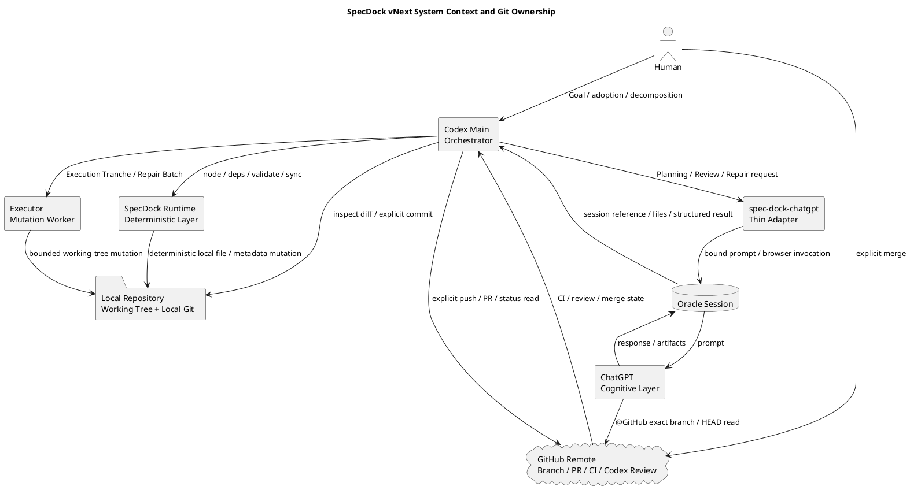
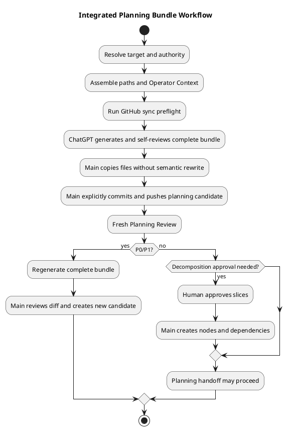
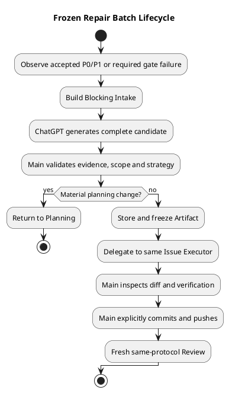

# init-00322 GPT 56 ChatGPT First Intelligence Architecture — 設計

## 1. 設計目的と識別互換性

本設計は、`ChatGPT 5.6 Pro Delegation-First Workflow vNext`を既存Initiative `init-00322`へ適用するtarget architectureを定義する。高度認知、Workflow制御、bounded mutation、決定的Runtime処理を分離し、PlanningからHuman merge確認後のfinishまでを一つのauthority modelで接続する。

- repository上の正式タイトルは`GPT 56 ChatGPT First Intelligence Architecture`のまま維持する。
- `ChatGPT 5.6 Pro Delegation-First Workflow vNext`はprogram labelである。
- 本改訂は`.meta.json`、GitHub Issue #322、Initiative path、`requirement.md`、`plan.md`、`report.md`、Artifactを変更しない。
- ADR／Interview／Discussion／Researchの有効な採用は、Human判断とMain Orchestratorが管理する`report.md` dispositionで成立する。source fileのfront matterだけではauthorityにならない。
- 本文はDesign Review pass、canonical adoption、execution-ready、PR-ready、merge-ready、Initiative／Epic completionを主張しない。

設計優先順位は、Contract OwnerとHuman Gate、GitHub exact HEAD、Mainだけの明示的Git transaction、Runtime非parse、可変部分の局所化、既存Scope互換の順とする。

## 2. System Contextと目標状態

GPT-5.5前提の旧構造は、ChatGPT evidence、preservation、claim ledger、Codex rewrite、複数local reviewer、report／repair stateへ同じ意味を複製していた。vNextではChatGPTがcomplete planning／review／repair outputを返し、Mainが採否とGit transitionを制御し、ExecutorとRuntimeはlocal working treeだけを変更する。

### 図1メタデータ

- **Title**: SpecDock vNext System Context and Git Ownership
- **Question answered**: 誰が認知処理、working-tree mutation、commit／push、remote state、mergeを所有するか。
- **Scope**: Human、ChatGPT、Main、`spec-dock-chatgpt`、Executor、Runtime、local repository、GitHub、Oracle。
- **Excluded details**: module／class／file、Prompt本文、Review field、CI job、Runtime command内部。
- **Update trigger**: Actor responsibility、Git owner、GitHub binding、Oracle境界、Human Merge Gateの変更。



`Local Repository`と`GitHub Remote`は別境界である。ExecutorとRuntimeはlocal working treeまで、Mainは明示的commit／push／PRまで、Humanはmergeだけを所有する。Executor／RuntimeからGitHubへの直接mutation経路はない。

## 3. Authority、SSOT、Domain Language

### 3.1 Authority hierarchy

1. Humanの明示判断とMainが`report.md`へ記録したadoption／disposition。
2. 現行promotion条件を満たしたcanonical `requirement.md`／`design.md`／`plan.md`。
3. Human adoptionと`report.md` dispositionが確認できるADR。
4. Source HEAD固定のfrozen Repair Batch。
5. Workflow文書と公開Skill。
6. Executorの局所判断。
7. Discussion、Research、Interview、Workbench、raw Review、Oracle transcript等のevidence。

上位と下位が矛盾するときは下位を実行せず、PlanningまたはHuman Gateへ戻る。

### 3.2 SSOT

| 情報 | SSOT |
|---|---|
| Scope／要件／設計／計画 | adoption済みcanonical三文書 |
| Evidence／ADR採否 | Human判断＋`report.md` disposition |
| Node／dependency／active | SpecDock metadata／Runtime |
| tracked repository | GitHub exact branch／HEAD |
| local mutation | working tree／Git diff |
| ChatGPT run | Oracle session |
| PR／CI／Codex Review | GitHub PR |
| bounded repair | frozen Repair Batch |
| completion／handoff | `report.md` |
| temporary material | Workbench |

### 3.3 Domain boundary

| Boundary | Owns | Must not own |
|---|---|---|
| Human Authority | Goal、adoption、分割、material変更、merge | 日常mutation、Reviewer verdict代行 |
| Cognitive | Planning、Formal／Targeted Review、Repair設計 | filesystem、Git、Node、merge |
| Orchestration／Git | target、authority、Workflow、diff確認、commit／push、PR、finish | Human merge、長時間実装 |
| Bounded Mutation | Tranche／Repair内の実装とverification | commit／push、Plan変更、Formal Gate |
| Deterministic Runtime | Node、dependency、active、validate／sync、Workbench、決定的file操作 | LLM意味解析、隠れたGit transaction |
| Repository／External Gate | remote content、PR、CI、GitHub Codex Review | Contract／adoption判断 |
| Temporary Evidence | Prompt、Context、Intake、candidate、diagnostic | canonical authority、lifecycle state |

### 3.4 Ubiquitous language

| Term | Meaning | Not meaning |
|---|---|---|
| Planning Bundle | 同一fresh sessionで生成・セルフレビューする完全三文書 | patch、claim集合、Runtime合成物 |
| Canonical adoption | Human判断＋`report.md` disposition＋現行promotion | Artifact自己申告 |
| Contract Owner | Formal Reviewの評価対象Scope | 実装Agent、変更path |
| Semantic BASE | Checkpoint／Deliveryの意味的開始commit | 直前commit、常時merge-base |
| Mutation Frontier | BASE..HEADを起点にする探索面 | hard path allow-list |
| Semantic Expansion | 必要なcaller／test／config／docsへの影響追跡 | repository全体監査 |
| Repair Batch | Source HEAD固定の小規模設計書兼実装計画書 | 実施記録、PR state、Planning裏口 |
| Execution Tranche | Issue Planが定める意味的実装単位 | Runtime固定schema |
| Delivery Topology | Epic PlanのBoundary／Scope／Owner／PR粒度 | invocation context分岐 |
| Handoff Exit | Issue Review／summary後に制御と証拠をEpicへ返すpre-merge handoff。`issue finish`／`epic finish`は行わない | 未検証途中終了、Scope finish |
| Merge Exit | PR Delivery、Human merge、reviewed head確認後に`issue finish`／`epic finish`を許可する唯一のExit | merge-preparedだけのfinish、pre-merge finish |
| merge-prepared | 最新HEADのgateがterminalでHuman merge待ち | merged／finished |
| parity | provider／installed／dogfoodの責務整合 | file数だけの一致 |
| safe state | 公式Workflow authorityが一つでknown-goodへ戻せる状態 | Scope別mixed mode |

## 4. Actor責務とGit Transaction

| Actor | Owns | Must not own |
|---|---|---|
| Human | Goal、adoption、分割、material変更、merge | 日常file mutation |
| ChatGPT | Planning、Review、Repair、高深度分析 | filesystem、Git、Node、merge、自己authority |
| Main | Workflow、target、authority、採否、Executor、explicit commit／push、PR、Human Gate、`report.md` | Review verdict捏造、長時間実装 |
| Executor | bounded調査／実装／verification／working-tree mutation | commit／push／stash／force／merge、Plan変更 |
| Runtime | Node／dependency／active／validate／sync／Workbench／決定的file操作 | semantic parse、hidden Git |
| GitHub | tracked content、PR、CI、Codex PR Review | Contract／adoption判断 |
| Oracle | browser、login、model、session、artifact | Workflow authority、Git |

Mainがcommit／pushできるのは、targetとauthorityが確認済み、diffとverificationを確認済み、必要な`report.md`整合済み、transition目的が明示済みの場合だけである。`spec-dock-chatgpt`、ChatGPT、Executor、Runtime、Review、preflight remediationは自動commit／push／stashを行わない。force pushを行わず、mergeはHuman専用とする。

## 5. Componentと依存前提

### 5.1 `spec-dock-chatgpt`

既存Python distribution内の独立console entrypointとし、Core Runtimeと分離する。logical componentsは`TargetResolver`、`RepositoryBindingPreflight`、`ContextAssembler`、`PromptComposer`、`OracleInvocationCoordinator`、Git／Scope／Oracle／attachment adapterである。Oracle session DB、response parser、artifact manifest、Workflow state DBを持たない。

### 5.2 Logical command surface

```text
spec-dock-chatgpt planning create <target>
spec-dock-chatgpt planning revise <target>
spec-dock-chatgpt review planning <target>
spec-dock-chatgpt review checkpoint <target> --checkpoint <id> --base-sha <sha>
spec-dock-chatgpt review delivery <target> --base-sha <sha>
spec-dock-chatgpt review targeted <target> [--base-sha <sha>]
spec-dock-chatgpt repair-batch generate <execution-owner-issue>
```

共通surfaceは`--context`、`--context-file`、`--file`。前二者はOperator Context、後者はGitHub外資料。tracked file自動添付とraw Prompt overrideは禁止する。正確なflag、exit code、fieldはEpic Planningで確定する。

### 5.3 Preflight／Oracle／GitHub／Human Relay

Formal commandはGit repo、named HEAD、clean tree、upstream、local HEAD＝remote HEAD、target、BASE ancestry、禁止attachmentを確認する。失敗時はremediationを返すだけでGit操作しない。

Oracleはdirect argv、browser engine、fresh one-shotを原則とし、model／Project／login／timeout／sessionはoperator configへ委ねる。Promptはrepository、branch、expected HEAD、target／parent／dependency pathを含み、ChatGPTが`@GitHub`でexact branch／HEADを確認できなければ継続しない。default branch、attachment、memoryへfallbackしない。

Oracle復旧不能時は同一Prompt／Context packageをHumanが承認済みUIで実行し、complete outputをWorkbenchへ置いて通常adoptionへ戻す。旧Codex-only Planning／Reviewへ切り替えず、Human Relayを別state machineにしない。

### 5.4 Dependency／prerequisite map

```text
Scope metadata + local Git + GitHub Connector + Oracle operator config
  -> spec-dock-chatgpt
spec-dock-chatgpt -> Planning / Review / Repair
Planning + Review -> Issue Execution
Issue Execution + Repair + Delivery Review -> Epic / PR Delivery
Epic 1-5 + parity + smoke -> Global Cutover
Cutover + dogfood + metrics -> Initiative Final Quality
```

| Capability | Prerequisite | Failure behavior |
|---|---|---|
| Adapter | clean synced branch、Scope metadata、GitHub Connector、Oracle login | fail closed。Git／default fallbackなし |
| Planning | Adapter、Human Goal、parent／Seed、placement authority | target／authority不足なら開始しない |
| Formal Review | exact HEAD、Contract Owner、必要時BASE、Perspective | binding／証拠不足でPASS禁止 |
| Repair | accepted blocker、Source HEAD、上位Plan、Execution Owner | material変更ならPlanningへ戻る |
| Issue Execution | approved Plan、Executor、Review、Main Git authority | Plan gapならPlanning refresh |
| Epic／PR Delivery | Issue Review、Topology、Owner、external gates | Human merge前にfinishしない |
| Cutover | Epic 1〜5、100% parity、install／upgrade／dogfood／replay、rollback target | 条件未達ならabortしpre-cutover safe state維持 |
| Final Quality | Epic 1〜6、dogfood、metrics、latest gates | blocker／rollback不能ならcompletion claim禁止 |

## 6. Integrated Planning

### 図2メタデータ

- **Title**: Integrated Planning Bundle Workflow
- **Question answered**: 誰がBundle生成、配置、commit／push、Review、分割承認、Node materializationを所有するか。
- **Scope**: target／authority、Context、preflight、ChatGPT生成、Main placement／Git、fresh Review、Human gate。
- **Excluded details**: Prompt本文、Oracle selector、Review field、Seed内容、Runtime argv。
- **Update trigger**: Bundle、Git owner、Planning Review、decomposition gate、Node materializationの変更。



| Skill | Scope-specific ownership |
|---|---|
| Initiative Planning | Goal、Scope、Epic Seed、Human Epic approval |
| Epic Planning | parent整合、Issue Seed、dependency、Delivery Topology、Delivery Owner |
| Issue Planning | Seed整合、Grade、Tranche、Checkpoint、Verification、Exit Contract |

共通mechanicsは`workflow_planning.md`、Oracleは`workflow_chatgpt_delegation.md`、Reviewは`workflow_review.md`へ置く。ChatGPT outputは完全三文書として扱い、legacy Identifyを再挿入せず、Mainが意味内容を再構成せずcanonical nameへ配置する。Node作成だけで親文書を書き換えない。

本Initiative adoption時は現行SpecDock gateに従い、passed Requirementを前提にDesignを再Reviewし、その後Planへ進む。これはvNextで逐次authoringを復活させる意味ではない。

## 7. Review Architecture

### 7.1 Protocol

| Protocol | Contract Owner | Temporal Window | Purpose |
|---|---|---|---|
| Planning | Initiative／Epic／Issue | HEAD Snapshot | Bundle adoption判断 |
| Checkpoint | Issue | previous reviewed HEAD→HEAD | Tranche closure |
| Issue Delivery | Issue | Issue BASE→HEAD | Issue Exit判断 |
| Epic Delivery | Epic | Delivery BASE→HEAD | cross-Issue integration／Epic契約 |
| Targeted | 任意Scope／path | Snapshot／optional range | advisory resultのみ |

Scopeは`Contract Owner × Temporal Window × Structural Anchors × Mutation Frontier × Semantic Expansion × Perspective`。PlanningはBASEなし、Checkpoint／Deliveryはimmutable Semantic BASE、PR-styleだけmerge-base。Mutation Frontierはhard boundaryでなく、findingはdeltaまたはContract未達に限定する。BASE不明時は狭く推測せず古い安全なBASEへ広げる。

Perspectiveは`specification`、`architecture`、`executability`、`code`、`qa`、`compatibility`、`security`、`operability`、`completion-summary`、`repository-conventions`。後者は明示規約だけを評価し、規約なしならN/A。

Formal semanticsはP0／P1＝FAIL、P2／P3のみ／findingなし＝PASS、証拠不足＝PASS禁止、binding不一致＝無効。Protocolごとの最小structured resultをMainが解釈し、Runtimeはparseしない。Targeted Reviewは`completed | insufficient_evidence`のadvisoryでmutationを起こさない。

Formal Reviewはfresh one-shotとし、前回finding、Author弁明、期待PASS、修正説明を渡さない。

## 8. Repair Batch

Repair Batchはaccepted blockerをroot-cause familyへ統合し、上位Planを変えない範囲の小規模設計書兼実装計画書にする。

### 図3メタデータ

- **Title**: Frozen Repair Batch Lifecycle
- **Question answered**: 誰がblockerを統合、採用、freeze、実装、commit／push、再Reviewするか。
- **Scope**: Intake、ChatGPT candidate、Main判断、Planning escalation、freeze、same-Issue Executor、Git、fresh Review。
- **Excluded details**: Finding field、template文言、test command、watcher、実施結果。
- **Update trigger**: Repair authority、escalation、Executor lifetime、Git owner、Review復帰の変更。



BatchはBinding、Blocking Set、Root-Cause Families、Repair Design、Allowed／Forbidden Scope、Implementation、Validation／Re-review、Stop／Escalation、Evidence Referencesを含む。実施結果、changed paths、commit SHA、CI、fresh Reviewを含めず、新HEADのblockerには新Batchを作る。

## 9. ExecutorとAgent

Executorはcustom write-capable agent一つ、Issue単位寿命、same-Issue bounded repair再利用、Main環境のmodel／reasoning継承を基本とする。source／test／config／docs／mirrorを契約内で変更できるが、material Requirement／Architecture／Public Contract／Scope／Review Topology変更では`blocked`を返す。commit／push／stash／force／mergeを行わない。handoffは`Disposition／Outcome／Verification／Recommended next action`を持つ自由Markdown。

Built-in Explorerは無改変、Researcherは軽量Web profile、Consultantは高Reasoning、Deep Consultantは最大Reasoning（Ultraなし）。Custom Explorer、Repository Analyst、Docs Writer、local Reviewer、旧default Worker routeを削除し、Issue Gradeでmodel routingしない。

## 10. Issue／Epic／PR Delivery

Issue Planは`Outcome／Scope／Verification／Checkpoint／Stop condition`を持つExecution Trancheへ分け、Runtimeはparseしない。

```text
Handoff Exit:
Tranches -> Issue Delivery Review -> report.md summary
-> return control and evidence to Epic
-> no issue finish / epic finish

Merge Exit:
Tranches -> Issue/Epic Delivery Review -> PR Delivery -> merge-prepared
-> Human merge -> Main verifies merged PR and reviewed head
-> issue finish -> epic finish when applicable
```

Handoff Exitはpre-mergeの制御・証拠handoffであり、`issue finish`／`epic finish`を実行しない。Scopeはopen／unfinishedのままEpicへ戻り、Delivery Topology上のMerge Exitへ引き継ぐ。`issue finish`／`epic finish`を実行できるのは、Human merge後にMainがmerged PRとreviewed headを確認したMerge Exitだけである。

Invocation contextでExitを変えない。Epic PlanはDelivery Boundary／Scope／Owner、per-Issue／batch／Epic-wide PR、Epic integration obligationsを定める。複数Issue／integration riskでは通常IssueとしてFinal Quality／Delivery Issueを推奨する。

PR DeliveryはPR create／identify、CI／GitHub Codex Review、Blocking Set、Repair、Executor、Main commit／push、fresh ChatGPT Delivery Review、fresh external gates、merge-prepared、Human Merge Gate、merge verificationを一つのWorkflowで扱う。P2／P3だけではmutationしない。auto-mergeしない。

## 11. Report、Workbench、Persistent State

Target `report.md`はOutcome、主要verification、Repair参照、残存risk、handoffを持つFinal Completion Summaryとし、transcript／private reasoning／Review全文／Batch全文を転記しない。本改訂では`report.md`を変更しない。

WorkbenchはPrompt、Operator Context、Blocking Intake、candidate、external file、long diagnosticのGit非管理一時領域であり、authority、state、receiptではない。

Planning／Review receipt、accepted HEAD registry、Checkpoint／Repair DB、custom Git ref、Plan parser、Review parserを新設しない。喪失時はGit／GitHub／Oracleから再構成し、必要なら広いfresh Reviewを行う。

## 12. Global Cutover、Abort、Rollback

cutoverは全Scopeの公式Workflow／Actor authority切替であり、document migrationではない。既存文書／Artifact／directoryを一括移行せず、closed Scopeは不変、open Scopeは次操作からvNext、契約不足だけをPlanning gapとしてrefreshする。

### 12.1 Cutover prerequisites

Epic 1〜5のreplacement surfaceがHuman merge済み、代表E2Eが完走またはfail closed、provider／installed／dogfood parity 100%、install／upgrade／dogfood／existing Scope replay PASS、旧参照と未実装箇所のinventory、last known good commit／releaseとrevert手順が必要である。

### 12.2 Safe-state invariant

- Pre-cutover: default branch／releaseではlegacyが唯一の公式Workflow。vNextはbounded dogfood／candidateのみ。
- Post-cutover: vNextだけが公式。Scope作成日／versionによるlegacy routeなし。
- 禁止: Scope別mixed mode、providerだけ新規、replacement欠落後のlegacy削除。

partial parity／regressionでは一部削除やScope単位切替を進めず、pre-cutover safe stateに留まるか戻る。

### 12.3 Abort criteria

unresolved P0／P1、required CI failure、merge conflict、parity failure、install／upgrade／dogfood／replay／Human Relay／exact binding failure、hidden Git、Human Gate bypass、P2／P3 mutation、旧必須参照／replacement欠落、closed Scope変更、rollback不能、無関係migration混入のいずれかでcutover merge／releaseをabortする。bounded repairで閉じなければEpic／Initiative Planningへ戻る。

### 12.4 Rollback

- Merge前: cutover PRをmergeせず、partial deletion／route flipをrevertしてpre-cutover stateを維持。
- Merge後release前: cutover change setを一体でrevert。file単位でmixed modeを作らない。
- Release後重大regression: 新しいScope mutationを停止しknown-good releaseへrollback。historical document／Node dataは変換しない。
- 一部surface failure: parity未達ならcutover不成立。失敗surfaceだけlegacyとして残さない。
- Recovery: parity、smoke、replay、fresh Delivery Reviewを再実行し、Human merge後だけ再cutover。

rollbackでpre-cutover releaseへ一時復旧することは、長期二重authorityではなくknown-good recoveryとして許可する。

## 13. Security、Observability、Test

GitHub exact binding不能ならFormal処理を行わず、secretをPrompt／Artifactへ入れず、direct argvを使い、transport failure／insufficient evidence／Formal FAILを分ける。Mainはoutputのbinding／scope／severity／上位契約を確認し、evidence front matterをadoption根拠にしない。

Oracle sessionはChatGPT run、Git historyはmutation／BASE、GitHub PRはCI／Review／mergeの記録とする。Main summaryはHEAD、Review、CI、blocker、next action。Main contextはraw transcript読込数とhandoff byte／token、Human介入はplanned／unplanned、Codex負荷はtelemetryまたはlocal cognitive invocation数で観測する。

Epic 1で旧代表3件以上のbaseline、Epic 7で最低4週間かつ5件以上のvNext実行を評価する。Test layersはUnit（target／Git／BASE／hidden Git）、Integration（Oracle argv／Prompt／artifact／parity）、Model smoke（Bundle／result／conventions N/A／Batch）、Workflow E2E（Handoff ExitがfinishせずEpicへreturnし、Merge ExitだけがHuman mergeとreviewed head確認後にfinishすることを含む）、existing Scope replay、changeability drill、cutover safety（abort／mixed-state防止／rollback／historical不変）とする。

## 14. Risk Responses

| Risk | Response |
|---|---|
| Oracle／model変更 | thin adapter、operator config、Human Relay |
| GitHub誤参照 | exact-HEAD preflight、Prompt binding、observed HEAD |
| Output揺れ | complete file、self-review、Protocol最小result、smoke |
| State喪失 | Git／GitHub／Oracle再構成、広いReview |
| Repair scope creep | frozen subordinate contract、forbidden scope、Planning escalation |
| Main context肥大 | Issue Executor、compressed handoff、Workbench、metrics |
| PR肥大 | Epic merge boundary、小PR、Final Quality Issue |
| Legacy残存 | inventory、search、parity、cutover Epic |
| 日本語規約逸脱 | repository-conventions、explicit MUST＝P1 |
| Evidence authority誤認 | Human＋`report.md` disposition |
| Partial parity | 100% parityをmerge gate、pre-cutover state維持 |
| Cutover regression | known-goodを保持しchange set単位rollback |

## 15. ADR Evidence

本設計は次の9 ADR evidenceが表すHuman-approved decision contentを反映するが、fileの自己申告だけでadoptionを主張しない。

- `artifacts/20260716t123423z-01-adr-delegation-first-responsibility-boundary.md`
- `artifacts/20260716t123423z-02-adr-integrated-planning-bundle-and-plan-ssot.md`
- `artifacts/20260716t123423z-03-adr-thin-chatgpt-oracle-adapter-and-github-binding.md`
- `artifacts/20260716t123423z-04-adr-contract-driven-review-protocols.md`
- `artifacts/20260716t123423z-05-adr-frozen-repair-batch-contract.md`
- `artifacts/20260716t123423z-06-adr-main-executor-git-ownership.md`
- `artifacts/20260716t123423z-07-adr-plan-driven-delivery-topology-and-human-merge-gate.md`
- `artifacts/20260716t123423z-08-adr-minimal-persistent-state-and-workbench-boundary.md`
- `artifacts/20260716t123423z-09-adr-global-workflow-cutover-without-document-migration.md`

## 16. REQ／NFR／AC Traceability

### 16.1 Requirement trace

| REQ | Design | Epic |
|---|---|---|
| REQ-001 | §3〜§4、§6〜§10 | 1、7 |
| REQ-002 | §6 | 2、7 |
| REQ-003 | §6 | 2、7 |
| REQ-004 | §5.1〜§5.3 | 1、7 |
| REQ-005 | §5.2〜§5.3 | 1、7 |
| REQ-006 | §7.1 | 3、7 |
| REQ-007 | §7.1 scope model | 3、7 |
| REQ-008 | §7 Perspective | 3、7 |
| REQ-009 | §7 result／freshness | 3、7 |
| REQ-010 | §8 | 4、7 |
| REQ-011 | §4、§9 | 4、7 |
| REQ-012 | §9 | 4、7 |
| REQ-013 | §10、§11 | 4、7 |
| REQ-014 | §7、§10 | 5、7 |
| REQ-015 | §3.4、§10、§13 lifecycle E2E | 5、7 |
| REQ-016 | §3、§11〜§12 | 4、6、7 |
| REQ-017 | §12 | 6、7 |
| REQ-018 | §5.4、§12〜§14、§17 | 1〜7 |
| REQ-019 | §13〜§17 | 7 |

### 16.2 NFR trace

| NFR | Design | Epic |
|---|---|---|
| NFR-001 | §5、§7、§11、§13 | 1〜4、7 |
| NFR-002 | §2、§4、§5、§9〜§10 | 1、4、5、7 |
| NFR-003 | §5、§7、§12〜§13 | 1、3、6、7 |
| NFR-004 | §7、§9、§13 | 1、3、4、7 |
| NFR-005 | §3、§6〜§10、§15〜§17 | 2〜7 |
| NFR-006 | §1、§6、§12 | 2、6、7 |

### 16.3 Acceptance Criteria trace

| AC | Design | Epic／gate |
|---|---|---|
| AC-001 | §1、§16 | M0、1、7 |
| AC-002 | §3〜§4、§15 | M0、1、7 |
| AC-003 | §6 | 2 |
| AC-004 | §5 | 1 |
| AC-005 | §7 | 3 |
| AC-006 | §7 Perspective | 3 |
| AC-007 | §7 Targeted | 3 |
| AC-008 | §8 | 4 |
| AC-009 | §4、§9 | 4 |
| AC-010 | §9 | 4 |
| AC-011 | §10 | 4 |
| AC-012 | §7、§10 | 5 |
| AC-013 | §10 PR repair | 5 |
| AC-014 | §7 severity、§10 no-mutation | 5 |
| AC-015 | §3.4、§10 Handoff非finish／Human merge後finish、§13 lifecycle E2E | 5 |
| AC-016 | §12〜§13 parity／cutover | 6 |
| AC-017 | §6 bootstrap、§12 Planning gap | 6 |
| AC-018 | §13〜§17 | 7 |

## 17. Seven-Epic Guardrails

| Epic | Must | Must not | Boundary | Handoff | Coverage |
|---|---|---|---|---|---|
| 1 Foundation | inventory、thin adapter、exact HEAD、Human Relay、baseline、hidden-Git test | final semantics先取り、legacy削除、session DB | CLI／Oracle／GitHub foundation | inventory／contract／smoke／baseline→2、3、7 | REQ-001／004／005／018、NFR-001〜004、AC-001／002／004 |
| 2 Planning | 3 Skill、complete Bundle、self-review、content-preserving placement、Review、Human node gate | Codex rewrite、manual fallback、Checkpoint／Delivery／Execution混入 | Planning capability | planning contract／template／node handoff→4、5、6、7 | REQ-002／003／018、NFR-001／005／006、AC-003 |
| 3 Review | Formal Protocol、BASE、Perspective、result、Targeted、local Reviewer削除 | Repair実装、GitHub Codex Review削除、Targeted mutation | Review capability | review contract／smoke→4、5、7 | REQ-006〜009／018、NFR-001／003〜005、AC-005〜007 |
| 4 Repair／Issue | Batch、Executor、Tranche、Handoff Exitのcontrol／evidence return、summary、Main Git | Executor／CLI Git、`issue finish`／`epic finish`、Epic／PR Delivery先取り | Issue execution | Issue E2E（no finish）／Repair contract／summary→5、6、7 | REQ-010〜013／016／018、NFR-002〜005、AC-008〜011 |
| 5 Epic／PR | Topology、Owner、Issue／Epic Review、PR repair、merge-prepared、Human merge＋reviewed head確認後finish | auto-merge、P2／P3 mutation、pre-merge finish | Epic／PR delivery | delivery E2E／merge verification／finish→6、7 | REQ-014／015／018、NFR-002／003／005、AC-012〜015 |
| 6 Cutover | parity、stale removal、no-migration replay、abort／rollback、single authority | replacement前削除、closed変更、partial parity／mixed mode | Workflow／packaging cutover | known-good、parity／smoke／replay→7 | REQ-016〜018、NFR-001／003／005／006、AC-016／017 |
| 7 Dogfood | 全REQ／NFR／AC、metrics、changeability、latest gates | Review一本化強制、future UI先回り、pre-merge completion | Initiative integration／release | Final Summary／risk／dual-review／follow-up→Human | REQ-001〜019、NFR-001〜006、AC-001〜018 |

## 18. Epic Planningへ委譲する詳細

- exact module／class／file path。
- command／flag／exit code。
- Oracle config／timeout／session discovery。
- structured result field／type。
- Prompt本文／few-shot。
- PR polling／watcher統合。
- agent model label／reasoning enum。
- Epic内Issue分割／Delivery Topology。
- metrics baseline tool／telemetry。
