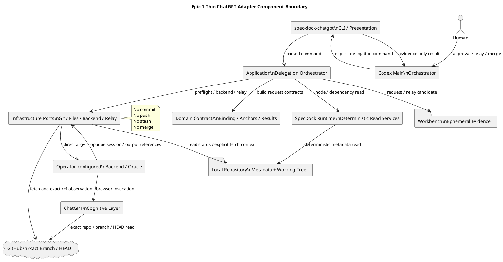
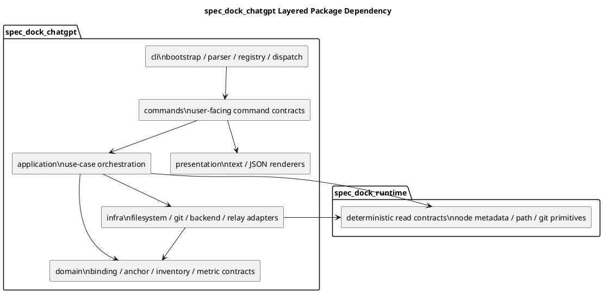
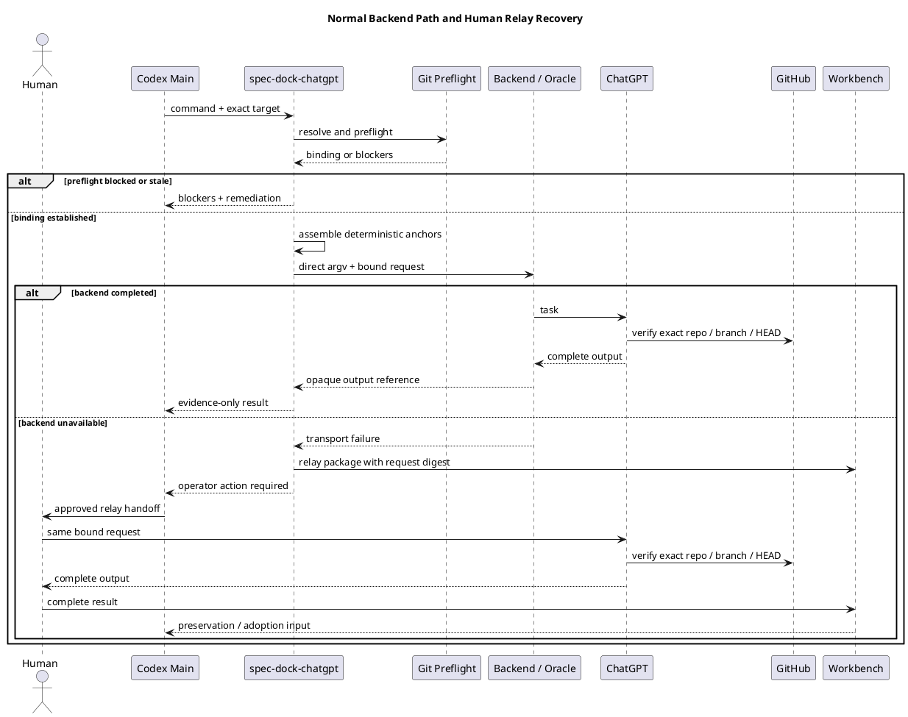
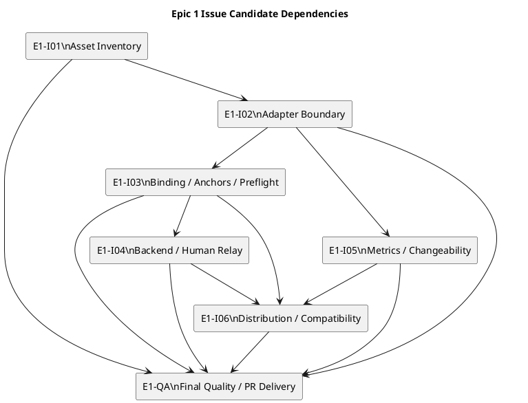

# epic-00324 Integrated Epic Planning Bundle Candidate

## FILE: requirement.md

---

種別: 要件定義書（Epic）
ID: "epic-00324"
タイトル: "Delegation Foundation Asset Inventory and Thin ChatGPT Adapter"
関連GitHub: ["#324"]
状態: "draft"
作成者: "iwasawayuuta"
最終更新: "2026-07-20"
親: ["init-00322"]
-----------------

# epic-00324 Delegation Foundation Asset Inventory and Thin ChatGPT Adapter — 要件定義

## 1. 文書の役割とEpic identity

この文書は、`init-00322`が定める7 Epic構成の第1 Epicとして、後続Epicが共用するDelegation Foundationの要求、責務境界、受入条件、互換性、運用条件を定義する。

* Epic ID: `epic-00324`
* normalized node title: `Delegation Foundation Asset Inventory and Thin ChatGPT Adapter`
* canonical long name in parent plan: `Delegation Foundation, Asset Inventory, and Thin ChatGPT Adapter`
* filesystem path: `spec-dock/initiatives/init-00322-gpt-5-6-chatgpt-first-intelligence-architecture/epics/epic-00324-delegation-foundation-asset-inventory-and-thin-chatgpt-adapter`
* GitHub Issue: `#324`
* Parent Initiative: `init-00322` / GitHub Issue `#322`
* Epic dependency: なし
* Delivery Boundary: 独立したEpic merge boundary。Human merge後にのみEpic completionを反映する。

本書、対応する`design.md`、`plan.md`はPlanning Bundle候補であり、ChatGPTが生成したという事実だけではcanonical authority、reviewer pass、execution-ready、Issue作成承認、PR-ready、merge-ready、Epic completionを成立させない。

## 2. 結論

本Epicは、ChatGPT Delegation-First Workflow vNextの意味仕様を完成させるEpicではなく、後続EpicがPlanning、Review、Execution Brief、Repair、Deliveryの各意味契約を安全に実装できるようにする共通基盤を提供する。

本Epicが提供する能力は次の5群である。

1. Skill、Agent、Workflow、Template、Scriptを横断するmaintained asset inventory。
2. Core `spec-dock` CLIから分離された薄い`spec-dock-chatgpt` application boundaryとcommand skeleton。
3. exact target resolution、GitHub sync preflight、deterministic anchor assembly、tracked-content非添付を保証する決定的処理。
4. operator-configured backend／Oracle invocationと、同一request／result contractを維持するHuman Relay。
5. M-001〜M-013のbaseline／telemetry feasibilityと、M-008 changeability drillを可能にする観測・変更境界。

本Epicは、ChatGPTが生成するPlanning、Review、Execution Brief、Repair Batchの最終的な意味、Prompt本文、動的Concern選択、Artifact lifecycle、Workflow cutoverを実装しない。

## 3. 背景とWhy

現行repositoryには、次の複数surfaceが存在する。

* provider implementation authorityである`src/spec_dock/`
* installed agent-tooling authorityである`src/spec_dock/assets/install_root/`
* shipped workspace／runtime authorityである`src/spec_dock/assets/spec_dock/`
* consumer／dogfood projectionである`spec-dock/`
* current ChatGPT authoring evidence laneである`spec-dock-chatgpt-authoring`
* Core repo-local Runtimeの`spec-dock authoring` command群

この状態で後続Epicが各自の都合でChatGPT integration、Git preflight、Oracle invocation、target resolution、metricsを実装すると、次の問題が生じる。

* PlanningとReviewが別々の外部adapterを持ち、GitHub binding semanticsがずれる。
* provider、installed、dogfoodのどのassetがauthorityか分からなくなる。
* tracked repository contentがGitHubとattachmentの二重SSOTになる。
* Codexが関連Artifactの意味的選択まで担い、REQ-022の責務分離が崩れる。
* Oracleのprivate path、browser profile、特定implementationがSpecDock product dependencyになる。
* adapterやautomationがGit transactionを隠れて実行する危険が生じる。
* M-001〜M-013の比較に必要なbaselineが導入後まで取得されず、継続判断が不可能になる。
* Prompt、backend、model label、output fieldの変更がCore Runtime migrationへ波及する。

本Epicはこれらを先に解消し、Epic 2とEpic 3が同一のfoundation上で並列に実装できる状態を作る。

## 4. Actorとauthority boundary

| Actor / Boundary                   | 本Epicで所有する責務                                                                                                                                  | 本Epicで所有しない責務                                                                            |
| ---------------------------------- | --------------------------------------------------------------------------------------------------------------------------------------------- | ---------------------------------------------------------------------------------------- |
| Human                              | Issue slice承認、material Scope変更承認、backend利用環境の選択、Human Relay実行、PR merge                                                                        | 日常的なtarget解決、anchor組立、adapter実装                                                          |
| ChatGPT                            | GitHub exact branch／HEADを参照する高深度分析、complete outputの生成                                                                                         | canonical file write、Git transaction、Node作成、自己申告によるadoption／review pass                  |
| Codex Main Orchestrator            | target指定、authority確認、adapter起動、output採否、明示的commit／push、Human Gate、`report.md` disposition                                                     | 関連Artifactの重い意味的選別を標準経路として再実行すること、ChatGPT verdictの捏造                                     |
| `spec-dock-chatgpt`                | deterministic target binding、strict preflight、anchor assembly、外部context policy、backend invocation、transport-level diagnostics、relay package生成 | canonical adoption、semantic review、Brief readiness、commit、push、stash、merge、Node mutation |
| SpecDock Runtime                   | Node metadata、dependency、active scope、validate／sync、決定的file操作、および再利用可能なread-only deterministic service                                        | ChatGPT outputの意味解析、Promptの意味判断、Brief／Review verdictの判定                                  |
| Operator-configured backend／Oracle | browser automation、login、model selection、session、reattach、response／artifact保存                                                                 | repository authority、Git transaction、SpecDock lifecycle gate                             |
| GitHub                             | tracked repository、branch、commit、PR、CIのSSOT                                                                                                   | canonical adoption、Human approval、ChatGPT outputの正しさの判定                                  |
| Executor                           | 後続Epicで定義されるbounded implementationとworking-tree mutation                                                                                      | 本EpicのPlanning候補からの自動開始、Git transaction                                                  |

### 4.1 Evidence authority

次はevidenceであり、それ自体はcanonical authorityを持たない。

* ChatGPT output
* Oracle session output
* Workbench内のrequest／result candidate
* asset inventoryとinventory validation report
* metrics feasibility／baseline record
* live smoke output
* generated anchor manifest
* adapter dry-run output

次がauthorityを持つ。

* Human承認とpromotion条件を満たしたcanonical `requirement.md`、`design.md`、`plan.md`
* Human採用と`report.md` dispositionが確認されたADR
* Node／dependencyに関するSpecDock metadata
* tracked repositoryに関するGitHub exact branch／HEAD
* completion／handoffに関する`report.md`
* mergeに関するHuman decisionとGitHub PR state

## 5. Capability envelope

### 5.1 必須capability

本Epicは次を実現しなければならない。

1. **Delegation asset inventory**

   * Skill、Agent、Workflow、Template、Scriptを列挙する。
   * provider authority path、shipped／installed path、dogfood path、owner、責務、lifecycle分類、verification方法を追跡する。
   * maintained surfaceとcompatibility surfaceを区別する。
   * 本Epicでは旧surfaceを削除しない。

2. **Thin application boundary**

   * `spec-dock-chatgpt`をCore `spec-dock` CLIとは別のrepo-local executableとして提供する。
   * 現行repositoryのlayered architectureに合わせ、CLI、commands、application、domain、infra、presentationを分離する。
   * command treeには少なくとも`execution-brief generate`を含める。
   * Planning、Review、Repairを含む将来command名の予約とhelp skeletonを提供できる。
   * semantic handlerが未実装のcommandは、別経路へfallbackせず明示的な`capability_not_materialized`相当で停止する。

3. **Target and source binding**

   * exact Scope IDまたはexact repo-relative node pathを解決する。
   * repository、branch、expected HEAD、target／parent／dependency pathsを固定する。
   * named branch、clean tree、origin upstream、fetch結果、local HEAD＝remote HEADを検査する。
   * default branch、memory、tracked attachment、local-contextへ黙ってfallbackしない。
   * preflight failure時はremediationを返すだけで、commit、push、stash、checkout、reset、merge、rebaseを行わない。

4. **Deterministic anchor assembly**

   * repository slug、branch、expected HEAD、Scope paths、canonical document paths、Artifact directories、dependency Scope IDs／paths、Execution Unit IDを意味判断なしで組み立てる。
   * ADR、Interview、Discussion、Research、dependency report、code、tests、configurationの関連性をadapterが意味的に選択しない。
   * 同一入力から同一canonical representationとdigestを生成する。

5. **Thin backend／Oracle adapter**

   * operator-configured executable argvをdirect invocationする。
   * shell、private wrapper path、browser profile、cookie storage、特定Oracle implementation selectorをproduct dependencyにしない。
   * backendが返すsession reference、output reference、exit statusをopaque transport resultとして扱う。
   * ChatGPT output本文をRuntime stateへ変換しない。

6. **Human Relay**

   * backend利用不能時も、同一task、binding、anchors、constraints、output contractを保持するrelay packageを生成する。
   * Humanが承認済みUIで実行したcomplete outputをWorkbenchへ戻し、通常のpreservation、EAL disposition、canonical adoption workflowへ再接続できる。
   * Human RelayをCodex-only semantic fallbackへ読み替えない。

7. **Workflow documentation**

   * `workflow_chatgpt_delegation.md`にauthority、normal path、failure path、Human Relay、no-hidden-Git、security、evidence handlingを記述する。
   * existing `workflow_chatgpt_authoring_pack.md`との併存境界を示す。
   * global cutoverや旧surface削除を宣言しない。

8. **Metrics foundation**

   * M-001〜M-013ごとにdirect telemetry、proxy、deferred measurement、unavailableを分類する。
   * source、unit、collector、sample boundary、privacy、limitations、downstream ownerを記録する。
   * 利用可能なhistorical evidenceから旧Workflowのbaselineを採取する。
   * Prompt、backend command、model label、output fieldの変更容易性をM-008で計測できる契約を定義する。

### 5.2 Capability boundary

本Epicのoutputは、後続Epicが意味契約をplug inできるfoundationである。次は本Epicに含めない。

* final Architecture-Aware Execution Brief Prompt
* dynamic Applicable Concern selection
* `ready | planning-gap | insufficient-evidence`の最終意味とrouting
* Workbench candidateからIssue ArtifactへのBrief adoption／freeze
* Integrated Planning Bundleの正式cutover
* Formal／Targeted Review Protocol
* Repair Batch semantics
* full Issue Executionとcustom Executor integration
* Epic Delivery Topology、PR Delivery、Human merge後finish
* global legacy surface removal
* Initiative-wide comparative evaluationとfinal closure
* automatic canonical adoption
* automatic Issue／Epic Node creation
* semantic state database、Brief registry、accepted HEAD registry
* Oracle session管理やbrowser automationの再実装
* 特定model label、thinking label、private wrapper locationの固定

## 6. Epic requirements

| ID       | 要件                                                                                                                     | Parent trace                                                                  | 観測可能な成果                                                                                                    |
| -------- | ---------------------------------------------------------------------------------------------------------------------- | ----------------------------------------------------------------------------- | ---------------------------------------------------------------------------------------------------------- |
| E-RQ-001 | Human、ChatGPT、Main、`spec-dock-chatgpt`、Runtime、backendの責務を分離し、ChatGPT outputやinventoryの自己申告だけでauthorityを成立させない。        | REQ-001。主実装責任: AC-002。共同証拠: AC-001、AC-003。M-004、M-005。                        | authority表、result envelope、workflow doc、negative testsで責務越境がない。                                            |
| E-RQ-002 | Skill／Agent／Workflow／Template／Scriptのmaintained inventoryを、provider／installed／dogfood pathとownerを含めて維持できる。             | REQ-018。共同実装／証拠: AC-016、AC-018。M-003、M-005、M-006、M-008。                       | versioned inventory、coverage validation、path existence／projection parity evidenceがある。                      |
| E-RQ-003 | Core `spec-dock`から分離した薄い`spec-dock-chatgpt` application boundaryと、`execution-brief generate`を含むcommand skeletonを提供する。  | REQ-004、REQ-005。主実装責任: AC-004。共同証拠: AC-003、AC-021。M-007、M-008。                | separate executable、help tree、dry-run request contract、未materialize capabilityのfail-closed resultがある。      |
| E-RQ-004 | Formal delegation requestをexact repository、named branch、expected HEAD、target Scopeへbindし、GitHub syncをfail closedで検査する。 | REQ-004、REQ-005。主実装責任: AC-004。M-004、M-007。                                    | synced temp-repo tests、mismatch／dirty／detached／missing upstream tests、exact branch／HEAD live smokeがある。     |
| E-RQ-005 | Codex／adapterが提示するcontextをdeterministic anchorsへ限定し、関連Artifactの意味的探索をChatGPTへ残す。                                       | REQ-022。共同実装／証拠: AC-019、AC-023。M-002、M-009、M-011、M-012。                       | stable anchor manifestとdigestが生成され、semantic artifact selectorが存在しない。                                       |
| E-RQ-006 | backend／Oracle invocationをoperator-configuredなthin portとし、特定implementation、browser profile、private pathへ依存しない。         | REQ-004、REQ-005。主実装責任: AC-004。M-007、M-008、M-013。                              | direct argv spy、config resolution、timeout／spawn failure、redaction testsがある。                                |
| E-RQ-007 | backend障害時に、bindingとoutput contractを変えないHuman Relayを提供する。                                                              | REQ-005。共同実装／証拠: AC-018、AC-023。M-001、M-007、M-013。                             | relay package digest、manual round-trip smoke、通常adoption laneへのre-entry guidanceがある。                        |
| E-RQ-008 | `spec-dock-chatgpt`とそのautomationはhidden Git transactionを行わず、Git preflight failureを自動修復しない。                             | REQ-001、REQ-004、REQ-005。主実装責任: AC-009。M-004、M-005。                            | subprocess argv spy、HEAD／index／worktree before-after test、forbidden Git command absence testがある。           |
| E-RQ-009 | provider、shipped consumer、dogfoodの新foundation surfaceを整合させ、current authoring laneを壊さず追加導入する。                           | REQ-018。共同実装／証拠: AC-001、AC-003、AC-016、AC-018、AC-021。M-005、M-006、M-007。        | installer init／update test、provider-dogfood parity、current authoring regressionがある。                        |
| E-RQ-010 | M-001〜M-013のbaseline／telemetry feasibilityを定義し、取得可能な旧Workflow baselineを保存する。                                           | REQ-018。REQ-025を支援するがfinal verificationはEpic 7が所有する。共同証拠: AC-025。M-001〜M-013。 | metric feasibility matrix、historical baseline record、unavailable／deferred理由、downstream ownerがある。           |
| E-RQ-011 | target、preflight、transport、output、relayのfailureを区別し、retry、idempotency、observability、securityを一貫して扱う。                   | REQ-004、REQ-005。主実装責任: AC-004、AC-009。M-007、M-008、M-013。                       | stable symbolic status、bounded diagnostics、retry policy、secret/path redaction、duplicate invocation防止契約がある。 |

## 7. 利用シナリオ

### 7.1 正常系

#### SC-N01: exact targetのdry-run

1. Mainがexact Issue IDとExecution Unit IDを`execution-brief generate`へ渡す。
2. adapterが`.meta.json`とdependency metadataからtarget、parent、dependencyを決定的に解決する。
3. strict GitHub sync preflightがnamed branch、clean tree、upstream、local／remote HEAD一致を確認する。
4. adapterがdeterministic anchor manifestとdigestを生成する。
5. `--dry-run`ではbackendを起動せず、evidence-only request envelopeを返す。
6. final Brief Prompt、Concern selection、Brief statusは生成しない。

#### SC-N02: operator-configured backend invocation

1. operatorがbackend commandをCLI optionまたはapproved environment configurationで指定する。
2. adapterがshellを介さずdirect argvでbackendを起動する。
3. backendがbrowser、login、model、session、artifact handlingを所有する。
4. adapterはtransport status、session／output reference、bounded diagnosticsだけを返す。
5. returned contentはevidenceとして扱われ、canonical adoptionはMainとdownstream workflowへ戻る。

#### SC-N03: inventory確認

1. maintainerがinventory validationを実行する。
2. validatorがprovider authority paths、shipped paths、installed paths、dogfood pathsの存在と分類を確認する。
3. maintained assetの未登録、duplicate logical ID、invalid owner、missing projectionを報告する。
4. validatorはassetを削除、rename、rewriteしない。

### 7.2 Failure scenarios

#### SC-F01: dirtyまたはdetached repository

* preflightは`preflight_blocked`として停止する。
* adapterはstash、checkout、commit、reset、cleanを実行しない。
* Main／operatorがremediationを明示的に実行した後、同一commandを再実行する。

#### SC-F02: local／remote HEAD mismatch

* ahead、behind、diverged、unresolved remote HEADを区別する。
* default branchへfallbackしない。
* staleまたはblockedとして停止し、expected HEADを推測しない。

#### SC-F03: target missing／ambiguous

* fuzzy title matchを使用しない。
* exact IDまたはexact repo-relative pathが一意に解決できなければ停止する。
* active Scopeや同名Nodeへ黙ってfallbackしない。

#### SC-F04: forbidden attachment

* Git-tracked file、`.env*`、credential-like path、symlink、path traversal、unsupported directoryを拒否する。
* tracked contentはGitHub exact HEADから参照させ、添付へコピーしない。

#### SC-F05: backend spawn／timeout／nonzero

* canonical docs、Node、Git stateを変更しない。
* transport failureをsemantic failureとして解釈しない。
* retryable条件とoperator recovery条件を示す。
* automatic duplicate invocationを行わない。

#### SC-F06: semantic capability未materialize

* Epic 2〜Epic 5が所有するsemantic handlerが存在しないcommandは、`capability_not_materialized`相当で停止する。
* current authoring lane、manual semantic analysis、default Promptへfallbackしない。

### 7.3 Recovery scenarios

#### SC-R01: preflight recovery

* operatorがremote configuration、authentication、repository stateを修正する。
* adapterは同じtargetとcommand contractでpreflightを再実行する。
* 新しいobserved HEADが以前のexpected HEADと異なる場合、新しいrequest bindingを明示的に作り直す。

#### SC-R02: Human Relay

1. adapterがrequest body、binding、anchor digest、constraints、output contract、external file digestsを含むrelay packageを生成する。
2. Humanがapproved ChatGPT UIまたはapproved browser routeで同じtaskを実行する。
3. ChatGPTがGitHub exact repository／branch／HEADを確認できなければ回答を継続しない。
4. Humanがcomplete outputをWorkbenchへ配置する。
5. Mainがpreservation checkpoint、EAL disposition、canonical adoption、fresh reviewer gateへ戻す。
6. relay packageやoutputはcompletionを自己申告しない。

### 7.4 Operator scenarios

#### SC-O01: backend configuration変更

* operatorはprivate absolute pathやbackend-specific fixed argumentsを自分のconfigに置く。
* SpecDock assetsにはprivate path、profile、cookie、account dataを保存しない。
* backend commandの変更はadapter core migrationを要求しない。

#### SC-O02: baseline採取

* operator／Mainが利用可能な旧Workflow evidenceを選ぶ。
* metric collectorがM-001〜M-013の取得可否と値を記録する。
* 値を取得できない指標は推測せず、proxy、deferred measurement、unavailableのいずれかと理由を記録する。
* qualityとresource／latencyを同一の単一scoreへ潰さない。

## 8. Epic acceptance criteria

| ID       | 前提                                                                                | 操作                                                                                                                            | 期待結果                                                                                                                                                                                                          | 観測点とParent trace                                                                                                                   |
| -------- | --------------------------------------------------------------------------------- | ----------------------------------------------------------------------------------------------------------------------------- | ------------------------------------------------------------------------------------------------------------------------------------------------------------------------------------------------------------- | ---------------------------------------------------------------------------------------------------------------------------------- |
| E-AC-001 | provider、installed、dogfoodのasset treeが存在する。                                       | inventoryを生成または検証する。                                                                                                          | Skill／Agent／Workflow／Template／Scriptの各maintained assetが一意なlogical ID、authority path、projection path、owner、lifecycle、verification modeを持つ。未登録assetとmissing pathは失敗になる。旧surfaceは削除されない。                         | inventory file、coverage report、path tests。E-RQ-002、E-RQ-009。REQ-018。AC-016／AC-018共同証拠。M-003、M-005、M-006。                           |
| E-AC-002 | cleanなinitialized consumer repositoryがある。                                         | `spec-dock-chatgpt --help`およびsubcommand helpを実行する。                                                                            | Core `spec-dock`とは別のexecutableとして起動し、Planning／Review／Execution Brief／Repairのreserved command groupsと`execution-brief generate`を表示する。semantic未実装commandは明示的に停止し、authorityやreadinessを主張しない。                     | CLI help tests、result envelope assertions。E-RQ-001、E-RQ-003。REQ-001、REQ-004。AC-002、AC-004。M-007、M-008。                             |
| E-AC-003 | named branch、origin upstream、clean tree、remote-visible commitがある。                 | strict preflightを実行し、次にdirty、detached、ahead、behind、diverged、missing upstreamを個別に再現する。                                         | 正常時だけexact repository／branch／HEAD bindingを返す。各異常時はblockedまたはstaleになり、default branch、local-context、tracked attachmentへfallbackせずremediationを返す。                                                                | hermetic Git tests、CLI JSON、exact HEAD fields。E-RQ-004、E-RQ-011。REQ-004、REQ-005。AC-004。M-004、M-007。                                |
| E-AC-004 | exact Scope ID、dependency metadata、optional Execution Unit IDがある。                 | anchor assemblyを同一入力で複数回実行する。                                                                                                 | 同一ordered anchor setとdigestを返し、repository、branch、HEAD、Scope／canonical／artifact／dependency paths、Unit ID以外のsemantic artifact選択を含まない。                                                                           | golden fixture、digest stability test、negative selector search。E-RQ-005。REQ-022。AC-019／AC-023共同証拠。M-002、M-009、M-011、M-012。          |
| E-AC-005 | operator-configured backend stubと、private backend detailsを含まないpublic contractがある。 | normal、missing executable、timeout、nonzero exitを実行する。                                                                          | shellを使用せずdirect argvで呼び出し、backend選択、browser、model、session internalsをoperator側へ残す。failureをtyped transport resultへ分類し、secret／absolute host pathをredactする。                                                      | subprocess spy、timeout test、redaction test。E-RQ-006、E-RQ-011。REQ-004、REQ-005。AC-004。M-007、M-008、M-013。                             |
| E-AC-006 | backend routeが利用不能で、同一request bindingが保持されている。                                    | relay packageを生成し、approved UIを使ったround-trip smokeを行う。                                                                         | relay packageとnormal backend routeが同じtask／binding／anchors／constraints／output contractを共有し、complete outputを通常のevidence adoption laneへ戻せる。Codex-only semantic fallbackは発生しない。                                   | relay manifest digest、manual smoke record、workflow doc。E-RQ-007。REQ-005。AC-018／AC-023共同証拠。M-001、M-007、M-013。                       |
| E-AC-007 | adapterの全subprocess境界をspyできる。                                                     | normal、blocked、transport failure、relay生成を実行する。                                                                                | commit、push、stash、checkout、switch、reset、clean、merge、rebase、cherry-pick、revert、tag、update-ref、force操作が実行されない。HEAD、local branch、index、worktree contentが不変であり、明示preflight fetchによるremote-tracking ref観測だけが許容される。 | argv allowlist／denylist、repository before-after snapshot。E-RQ-008。REQ-001、REQ-004、REQ-005。AC-009。M-004、M-005。                      |
| E-AC-008 | adapter output、inventory、smoke resultが存在する。                                       | output metadataとworkflow guidanceを検査する。                                                                                       | `authority=evidence_only`相当、`canonical_written=false`、`git_transaction_performed=false`を示し、adoption、reviewer pass、execution-ready、PR-ready、merge-ready、completionを自己申告しない。                                    | contract tests、forbidden-claim tests、docs review。E-RQ-001、E-RQ-003、E-RQ-007。REQ-001。AC-002、AC-003共同証拠。M-004、M-005。                 |
| E-AC-009 | provider assetから新規consumer init／updateを実行できる。                                     | temp repositoryへinit／updateし、dogfood projectionとcurrent authoring laneを検査する。                                                  | new executable、package、inventory、workflow docがinstallされ、provider sourceとの期待parityを持つ。current `spec-dock authoring`と`spec-dock-chatgpt-authoring`は引き続き利用可能で、旧surface削除やglobal cutoverは発生しない。                   | installer tests、provider-dogfood diff、existing authoring regression。E-RQ-002、E-RQ-009。REQ-018。AC-016／AC-018共同証拠。M-005、M-006、M-007。 |
| E-AC-010 | parent InitiativeのM-001〜M-013定義と利用可能なhistorical evidenceがある。                      | metric feasibility matrixとbaseline recordを作成する。                                                                               | 全13 metricがsource、unit、collector、availability、limitations、downstream ownerを持つ。3件以上の適格historical runが存在する場合は3件以上を記録し、存在しない場合は全件と不足理由を記録する。未観測値を捏造しない。                                                          | metrics schema、baseline artifact、coverage assertion。E-RQ-010。REQ-018。AC-025共同証拠。M-001〜M-013。                                       |
| E-AC-011 | Prompt resource、backend config、output fixtureを交換できるfoundation designがある。          | M-008 changeability rehearsalを設計し、代表変更をtest fixture上で試す。                                                                      | Prompt、backend command／model label、output field変更が局所resource／adapter testの変更で済み、Core Runtime semantic migration、新state DB、canonical schema migrationを要求しないことを測定できる。                                           | changed-file set、test set、migration absence assertion。E-RQ-002、E-RQ-003、E-RQ-006、E-RQ-010。REQ-018。M-008。                           |
| E-AC-012 | Epic実装Issue候補が統合され、delivery branchがremote-visibleである。                             | final quality laneでfull tests、current branch／HEAD GitHub connector smoke、Human Relay smoke、rollback-by-revert rehearsalを実行する。 | smokeが実行時のexact repository／branch／HEADを一致確認し、不一致やconnector access failureでfail closedになる。rollback後もcurrent Core Runtimeとauthoring laneが動作し、新semantic stateが残らない。                                              | full test summary、observed SHA、smoke output、rollback evidence。E-RQ-003〜E-RQ-011。AC-004、AC-009、AC-018共同証拠。M-006、M-007、M-008、M-013。  |

## 9. 非機能要件

### 9.1 変更容易性

* Oracle／backend、Prompt resource、task output contract、model labelを別々に交換できる。
* `spec-dock-chatgpt`のOracle dependencyをinfra portへ閉じ込める。
* Core `spec-dock` RuntimeはChatGPT outputの意味をparseしない。
* inventoryとmetrics schemaはversioned static assetであり、Workflow state databaseとして扱わない。
* 後続Epicがsemantic handlerを追加してもroot command、binding、anchor、transport contractを再設計しない。
* M-008で変更file数、変更layer、必要test、migration有無を観測できる。

### 9.2 信頼性と一貫性

* preflightとanchor dry-runは同一入力に対してdeterministicである。
* repository snapshot中にHEAD、worktree、source pathが変わった場合は`concurrent_repo_change`相当で停止する。
* backend invocationは非冪等な外部処理として扱い、session／output discoveryを確認せず自動重複実行しない。
* relay packageは同一requestから同一content digestを生成する。
* transport failure、binding stale、unsafe input、semantic capability未materializeを別状態として扱う。

### 9.3 Git安全性

* adapterはcommit、push、stash、force、mergeを行わない。
* adapterはindex、working tree、local branch、local HEADを変更しない。
* explicit preflight fetchはremote-tracking ref観測のための公開された操作としてのみ許可する。
* fetch failureを権限変更、shell wrapper、agent-owned raw fetch、automatic retry escalationで補わない。
* Mainだけがreviewed transitionで明示的commit／pushを行い、Humanだけがmergeする。

### 9.4 セキュリティと秘密

* secret、token、cookie、browser profile、private key、`.env*`、production dumpをPrompt、inventory、metrics artifact、relay packageへ含めない。
* direct argvを使用し、`shell=True`、pipe、redirect、command substitutionを使用しない。
* external fileは明示指定、regular file、non-symlink、non-secret-like、Git-untrackedまたはrepository外でなければならない。
* stdout／stderr、argv、path、environment由来のdiagnosticsをboundedかつredactedにする。
* backend configのprivate absolute pathをdurable outputへ保存しない。

### 9.5 観測性

* textとJSONの両方で、operation、status、target ID、repo、branch、expected／observed HEAD、anchor digest、blockers、remediation、backend source class、duration、relay digest、authority boundaryを観測できる。
* raw ChatGPT transcriptやsecret-like valuesを標準diagnosticへ含めない。
* M-001〜M-013の収集可否を機械的にcoverage確認できる。
* ChatGPT latencyをadapter／backend／Human Relayで区分して記録できる。

### 9.6 性能とresource

* adapterは関連Artifactの意味的探索やrepository全体のcontent要約を行わない。
* target resolutionはNode metadata、dependency metadata、固定path conventionを対象とする。
* anchor assemblyは対象Scopeとdependency数に比例する決定的処理とする。
* external backend latencyに固定SLOを設けず、M-013のwall-clock evidenceとして記録する。
* token telemetryが安定して取得できない場合はtool call、探索回数、handoff byte数、failure cycleをproxyとして扱う。

### 9.7 互換性

* Initiative／Epic／Issue ID、`.meta.json`、canonical file名、dependency metadataを変更しない。
* current `spec-dock` CLIのcommand contractを壊さない。
* current `spec-dock authoring` laneと`spec-dock-chatgpt-authoring` Skillを削除しない。
* existing open／closed Scope文書を移行しない。
* top-level fourth canonical documentを追加しない。
* Python 3.10+とstdlib-firstの現行project constraintを維持する。
* new executableは`spec-dock init`／`update`でmanaged assetとして配布する。
* rollbackはGit revertで行え、新しいdata migrationやsemantic state cleanupを必要としない。

## 10. 外部依存

| Dependency                             | 用途                                          | Failure時の扱い                                                             |
| -------------------------------------- | ------------------------------------------- | ----------------------------------------------------------------------- |
| Git executableとorigin remote           | branch／HEAD／worktree／upstreamの観測、明示fetch    | fail closed。自動修復やdefault fallbackを行わない。                                 |
| GitHub remoteとChatGPT側GitHub connector | tracked repositoryのexact branch／HEAD参照      | Formal delegationを停止する。Human Relayでも同じbinding requirementを維持する。         |
| Operator-configured backend／Oracle     | browser、login、model、session、output保存        | recoverまたはHuman Relayへ進む。private implementationをproduct dependencyにしない。 |
| ChatGPT account／approved UI            | cognitive processing                        | unavailable時は未実行として扱い、Codex-only semantic substituteを標準化しない。            |
| SpecDock installer／repo-local Runtime  | managed asset配布、Node metadata、validate／sync | current contractを保持し、semantic ChatGPT processingをCore Runtimeへ移さない。     |

## 11. 後続Epicへのhandoff

### Epic 2へ渡すもの

* separate `spec-dock-chatgpt` command boundary
* exact target／branch／HEAD binding
* deterministic anchor contract
* operator backend port
* Human Relay
* Planning routeで利用可能なmetrics hooks
* authority／no-hidden-Git invariants

Epic 2へ渡さないもの:

* complete Planning Bundle Prompt
* Planning create／reviseのsemantic output contract
* canonical placement／review loop
* Human decomposition gate implementation

### Epic 3へ渡すもの

* same binding／anchor／transport foundation
* BASEを将来追加できるpreflight extension seam
* transport and diagnostics contract
* Review routeで利用可能なmetrics hooks

Epic 3へ渡さないもの:

* Formal Review Protocol
* Perspective catalog
* P0／P1、P2／P3、insufficient evidence semantics
* Targeted Review result contract

### Epic 4へ渡す共同証拠

* `execution-brief generate` command skeleton
* exact Issue／Unit anchor fields
* exact HEAD smoke evidence
* no semantic Artifact selection invariant
* backend／Human Relay foundation
* baseline／telemetry schema

Epic 4へ渡さないもの:

* final Execution Brief Prompt
* dynamic Concern selection
* `ready | planning-gap | insufficient-evidence`
* candidate adoption／freeze
* Executor handoff／same-commit lifecycle

### Epic 6／Epic 7へのhandoff

* asset inventory baseline
* compatibility surface classification
* provider／installed／dogfood projection evidence
* M-001〜M-013 feasibility matrix
* M-008 changeability measurement design
* exact branch／HEAD smoke evidence
* no-hidden-Git evidence
* residual risksとunavailable telemetry

Epic 1はAC-001〜AC-025のInitiative-level final verificationやclosureを所有しない。

## 12. 未確定事項

Scope、non-scope、E-RQ、E-ACに関する未確定事項はない。

次はIssue planningへ意図的に委譲するreplaceable implementation detailであり、本Epicのacceptance boundaryを変更してはならない。

* Python module／class／functionの細分化
* numeric exit codeの割当
* argparse helperの具体名
* current preflight implementationからの抽出単位
* backend timeoutとbounded retryの具体値
* relay packageの非意味的file naming
* baseline evidence artifactのtimestamped filename
* individual test file名
* later Epicが登録するPrompt resource名とsemantic output field

## END FILE: requirement.md

## FILE: design.md

---

種別: 設計書（Epic）
ID: "epic-00324"
タイトル: "Delegation Foundation Asset Inventory and Thin ChatGPT Adapter"
関連GitHub: ["#324"]
状態: "draft"
作成者: "iwasawayuuta"
最終更新: "2026-07-20"
依存: ["requirement.md"]
親: ["init-00322"]
-----------------

# epic-00324 Delegation Foundation Asset Inventory and Thin ChatGPT Adapter — 設計

## 1. 設計目的

本設計は、`epic-00324`が固定するcross-Issue architecture、component boundary、command／adapter contract、failure semantics、inventory ownership、metrics feasibility、test strategyを定義する。

設計優先順位は次の通りである。

1. Human Gateとactor authority
2. GitHub exact repository／branch／HEAD
3. no-hidden-Git
4. deterministic anchorとsemantic selectionの分離
5. thin／operator-configured backend boundary
6. current provider／installed／dogfood architectureへの適合
7. changeabilityとminimal state
8. metrics observability
9. backward compatibility

## 2. 現行architectureと再利用方針

### 2.1 現行surface

| Surface                              | 現行authority／役割                                             | 本Epicでの扱い                                                                                               |
| ------------------------------------ | ---------------------------------------------------------- | ------------------------------------------------------------------------------------------------------- |
| `src/spec_dock/cli.py`               | wheel側の`spec-dock init`／`update` installer                 | new repo-local executable、docs、system inventoryを配布できるようadditiveに更新する。                                   |
| `src/spec_dock/assets/install_root/` | `.agents/`、`.codex/`、`.github/`のagent-tooling authority    | inventoryの主要scan対象。Epic 1ではglobal Skill／Agent cutoverや旧asset削除を行わない。                                    |
| `src/spec_dock/assets/spec_dock/`    | shipped docs／templates／system／repo-local runtime authority | new adapter executable、adapter package、inventory、workflow docのprovider authorityとする。                    |
| `spec-dock/`                         | dogfood projection                                         | provider sourceから同期し、独立implementation authorityとして編集しない。                                                |
| `spec_dock_runtime`                  | layered deterministic Runtime                              | Node metadata、Git preflight、path safety等のnarrow read-only deterministic serviceを再利用可能にする。Oracleを取り込まない。 |
| current `spec-dock authoring`        | current ChatGPT authoring-pack evidence lane               | compatibility regression対象。vNext formal boundaryとしてそのまま再brandingせず、Epic 6まで保持する。                        |
| `spec-dock-chatgpt-authoring` Skill  | current external evidence-lane Skill                       | inventoryではcompatibility surfaceとして記録し、本Epicで削除しない。                                                     |

### 2.2 実装配置の決定

`spec-dock-chatgpt`はwheel-level `[project.scripts]`へ新しい常駐CLIとして追加せず、現行repo-local Runtime patternに合わせたmanaged executableとして配布する。

Provider authority:

```text
src/spec_dock/assets/spec_dock/scripts/
├── spec-dock-chatgpt
└── spec_dock_chatgpt/
    ├── app.py
    ├── cli/
    ├── commands/
    ├── application/
    ├── domain/
    ├── infra/
    └── presentation/
```

Dogfood／installed consumer projection:

```text
spec-dock/scripts/
├── spec-dock-chatgpt
└── spec_dock_chatgpt/
    ├── app.py
    ├── cli/
    ├── commands/
    ├── application/
    ├── domain/
    ├── infra/
    └── presentation/
```

この配置を採る理由:

* day-to-day repo operationをinstalled wheel availabilityから分離する現行patternと一致する。
* `spec-dock-chatgpt`をCore `spec-dock` command registryから分離できる。
* `spec-dock init`／`update`でconsumerへ同一assetを配布できる。
* provider、installed consumer、dogfood projectionを同じasset sourceから検証できる。
* Oracle dependencyをCore Runtime packageへ逆流させずに済む。

`spec_dock_chatgpt`は必要に応じて`spec_dock_runtime`のnarrow deterministic read-only serviceをimportできる。依存方向は常に次である。

```text
spec_dock_chatgpt -> spec_dock_runtime deterministic contracts/services
spec_dock_runtime -X-> spec_dock_chatgpt
```

次は禁止する。

* `spec_dock_runtime`からOracle／backend codeをimportする。
* `spec_dock_chatgpt`からCore command registry、Node mutation use case、finish／sync mutation pathを呼ぶ。
* current `spec-dock authoring` CLIをsubprocessで呼び出してvNext boundaryを偽装する。
* preflight semanticsを複製した二つの独立implementationを長期維持する。

## 3. Cross-Issue invariants

1. `spec-dock-chatgpt`はseparate executableである。
2. semantic command ownerが未materializeの場合、明示的にunsupportedとして停止する。
3. Formal requestはnamed branch、clean tree、origin upstream、local＝remote HEADへbindされる。
4. default branch、memory、tracked attachment、local-contextへsilent fallbackしない。
5. adapterはcanonical docs、Node、dependency、active state、Git transactionを変更しない。
6. remote-tracking refsを更新する明示preflight fetch以外、Git write operationを実行しない。
7. adapterは関連Artifactを意味的に選択しない。
8. backend command、model、browser、login、session internalsはoperator／backend-ownedである。
9. outputはevidence-onlyであり、adoption、reviewer pass、readiness、completionを自己申告しない。
10. inventoryとmetrics schemaはversioned static assetであり、runtime state databaseではない。
11. current authoring laneはEpic 6のcutoverまで維持する。
12. final Execution Brief Prompt、Concern selection、Brief lifecycleはEpic 4へ残す。

## 4. Component view

* **Title**: Epic 1 Thin ChatGPT Adapter Component Boundary
* **Question answered**: provider／Runtime／adapter／Oracle／GitHubの責務と依存方向は何か。
* **Scope**: target resolution、strict preflight、anchor assembly、backend invocation、Human Relay、evidence output。
* **Excluded details**: final Planning／Review／Execution Brief／Repair Prompt、browser UI、private wrapper implementation、Issue内class names。
* **Update trigger**: separate executable boundary、dependency direction、Git ownership、backend ownershipが変わるとき。



## 5. Package dependency

* **Title**: `spec_dock_chatgpt` Layered Package Dependency
* **Question answered**: new adapterのinternal layerとCore Runtimeへの許可依存は何か。
* **Scope**: CLI、commands、application、domain、infra、presentationの依存方向。
* **Excluded details**: individual function names、test helper、backend implementation source tree。
* **Update trigger**: layer responsibilityまたはCore Runtimeとのdependency directionが変わるとき。



`spec_dock_runtime`から`spec_dock_chatgpt`へのruntime dependencyは禁止する。図のhidden relationはlayout用途であり、実dependencyを表さない。

## 6. Design slice catalog

| Design slice                                 | 目的                                                                     | Closes                                                          | Owning Issue candidate | Contract impact                         | Expected evidence                                                 |
| -------------------------------------------- | ---------------------------------------------------------------------- | --------------------------------------------------------------- | ---------------------- | --------------------------------------- | ----------------------------------------------------------------- |
| DS-001 Inventory and authority map           | maintained assetの所在、owner、projection、lifecycleを固定する。                   | E-RQ-002、E-RQ-009。E-AC-001、E-AC-009。                            | `E1-I01`               | static inventory schema、coverage rule   | manifest、scan report、path／parity tests                            |
| DS-002 Adapter boundary and command skeleton | separate executable、layered package、command tree、result envelopeを確立する。 | E-RQ-001、E-RQ-003。E-AC-002、E-AC-008。                            | `E1-I02`               | CLI／application public contract         | help／parser tests、dry-run fixture、forbidden-claim tests           |
| DS-003 Binding, anchors, strict preflight    | exact target／branch／HEADとno-hidden-Gitを成立させる。                          | E-RQ-004、E-RQ-005、E-RQ-008、E-RQ-011。E-AC-003、E-AC-004、E-AC-007。 | `E1-I03`               | TargetBinding、AnchorSet、PreflightResult | hermetic Git tests、digest fixtures、argv spy                       |
| DS-004 Backend and Human Relay               | operator-configured transportと同一contract recoveryを提供する。                | E-RQ-006、E-RQ-007、E-RQ-011。E-AC-005、E-AC-006。                   | `E1-I04`               | BackendInvocationPort、RelayPackage      | backend stub tests、relay round-trip、workflow doc                  |
| DS-005 Metrics and changeability             | M-001〜M-013 feasibility、baseline、M-008 drillを準備する。                     | E-RQ-010。E-AC-010、E-AC-011。                                     | `E1-I05`               | MetricFeasibilityRecord、baseline rubric | coverage matrix、baseline artifact、changeability rehearsal         |
| DS-006 Distribution and compatibility        | installer、dogfood、docs、current lane regressionを統合する。                   | E-RQ-002、E-RQ-009。E-AC-009、E-AC-012。                            | `E1-I06`               | managed asset API、docs navigation       | init／update tests、provider-dogfood parity、current lane regression |
| DS-007 Final quality and delivery            | all contractsをlatest delivery HEADで統合検証する。                             | 全E-RQ、全E-AC。                                                    | `E1-QA`                | Epic integration boundary               | full tests、exact HEAD smoke、rollback rehearsal、closure matrix     |

## 7. Inventory design

### 7.1 Authority and path

Inventory provider authority:

```text
src/spec_dock/assets/spec_dock/system/delegation-inventory.json
```

Shipped／dogfood projection:

```text
spec-dock/system/delegation-inventory.json
```

Human-readable responsibility／operating guidance:

```text
src/spec_dock/assets/spec_dock/docs/workflow_chatgpt_delegation.md
spec-dock/docs/workflow_chatgpt_delegation.md
```

Inventoryはmanaged static catalogであり、次のものではない。

* runtime execution state
* accepted HEAD registry
* workflow database
* completion ledger
* cutover switch
* automatic deletion list

### 7.2 Inventory schema

```text
schema_version
generated_for
entries[]
  asset_id
  kind
  responsibility
  authority_owner
  provider_authority_paths[]
  shipped_paths[]
  installed_consumer_paths[]
  dogfood_paths[]
  hosts[]
  lifecycle
  replacement_owner_epic
  verification_mode
  related_workflows[]
  notes[]
```

#### `kind`

* `skill`
* `agent`
* `workflow`
* `template`
* `script`

#### `lifecycle`

* `maintained`: current supported responsibilityを持つ。
* `compatibility`: current workflow継続に必要だが、後続Epicで置換候補になる。
* `planned_replacement`: parent planでreplacement ownerが明示されている。
* `historical`: maintained surfaceから参照されない履歴。validatorのrequired parity対象外。

`planned_replacement`や`compatibility`は削除許可ではない。実際の削除はEpic 6のreviewed planとHuman Gateを必要とする。

#### `verification_mode`

* `byte_equal_projection`
* `managed_copy`
* `required_marker_set`
* `path_exists`
* `generated_from_provider`
* `manual_external_boundary`

### 7.3 Coverage rules

Validatorは少なくとも次をscanする。

* `src/spec_dock/assets/install_root/.agents/skills/`
* `src/spec_dock/assets/install_root/.agents/host-adapters/`
* `src/spec_dock/assets/install_root/.codex/agents/`
* `src/spec_dock/assets/install_root/.github/agents/`
* `src/spec_dock/assets/spec_dock/docs/workflow_*.md`
* `src/spec_dock/assets/spec_dock/templates/`
* `src/spec_dock/assets/spec_dock/scripts/`
* corresponding dogfood projections

次をfailureにする。

* duplicate `asset_id`
* unknown kind／lifecycle／verification mode
* missing provider authority path
* maintained entryのmissing consumer／dogfood projection
* unmanaged maintained asset
* projectionがproviderと不整合
* replacement owner不在の`planned_replacement`
* private absolute host path
* inventory自体からのcompletion／cutover claim

## 8. Command surface

### 8.1 Root command

```text
spec-dock-chatgpt <command-group> <operation> <target> [options]
```

Reserved logical groups:

```text
planning create
planning revise
review planning
review checkpoint
review delivery
review targeted
execution-brief generate
repair-batch generate
```

Epic 1で必須なのはcommand tree、argument validation、common binding、dry-run、explicit unsupported behaviorである。各semantic handlerのownerは次の通り。

| Command group     | Semantic owner |
| ----------------- | -------------- |
| `planning`        | Epic 2         |
| `review`          | Epic 3         |
| `execution-brief` | Epic 4         |
| `repair-batch`    | Epic 4         |

### 8.2 `execution-brief generate` skeleton

```text
spec-dock-chatgpt execution-brief generate <issue-id-or-path> --unit <execution-unit-id>
```

Epic 1で実装するbehavior:

1. exact Issue targetの構造的解決
2. Execution Unit IDのopaque identifier validation
3. strict preflight
4. deterministic anchor assembly
5. evidence-only request envelopeのdry-run rendering
6. semantic contract未materialize時の明示停止

Epic 1で実装しないbehavior:

* PlanからUnitの意味をparseすること
* relevant Artifact retrieval
* Applicable Concern selection
* final Prompt
* Brief Markdown生成
* `ready | planning-gap | insufficient-evidence`
* Workbench candidate adoption／freeze
* Executor start

### 8.3 Common options

Foundationとして許可する共通option:

```text
--repo-root <path>
--ref <named-branch>
--context <text>
--context-file <external-or-untracked-file>
--file <external-or-untracked-file>
--format text|json
--dry-run
--backend-command <operator-configured-command>
```

禁止するoption／behavior:

```text
--allow-default-branch-fallback
--oracle <implementation-selector>
--prompt <raw-prompt-override>
tracked repository file auto-attachment
implicit active target fallback for formal invocation
implicit local-context fallback
```

`--context-file`と`--file`はregular non-symlink fileに限定し、Git-tracked file、secret-like path、`.env*`を拒否する。

### 8.4 Result envelope

```text
schema_version
status
operation
authority
canonical_written
node_mutated
git_transaction_performed
target_binding
anchor_digest
preflight
backend
relay
blockers[]
remediation[]
durations
```

固定値:

```text
authority = evidence_only
canonical_written = false
node_mutated = false
git_transaction_performed = false
```

Semantic output本文はresult envelopeへ埋め込まず、backend／Oracle-owned output referenceとして扱う。

## 9. Target resolution

### 9.1 Accepted target forms

* exact Scope ID: `init-*`、`epic-*`、`iss-*`
* exact repo-relative node directory path

Formal invocationではtitle fuzzy search、GitHub Issue numberだけの曖昧解決、active Scopeへの暗黙fallbackを使わない。

### 9.2 Resolution algorithm

1. repository rootを決定する。
2. `.workbench`を除外してcanonical `.meta.json`をscanする。
3. requested IDまたはpathに一致するNodeを一件だけ選ぶ。
4. `.meta.json`のtype、ID、parent、initiative、epic、GitHub repositoryを検証する。
5. parent chainをmetadataから解決する。
6. `depends_on`をmetadataから読み、dependency IDとpathを決定的に解決する。
7. canonical file pathsをfixed filename conventionから組み立てる。
8. Artifact directory pathsを構造的に組み立てる。
9. pathをrepo-relative POSIX形式に正規化する。
10. lexical ID／path orderで安定sortする。

Node本文の意味やArtifact relevanceは評価しない。

## 10. Target binding and GitHub sync preflight

### 10.1 `TargetBinding`

```text
schema_version
repository_owner
repository_name
normalized_origin
branch
expected_head
observed_local_head
observed_remote_head
target_type
target_id
target_path
parent_ids[]
parent_paths[]
dependency_ids[]
dependency_paths[]
canonical_paths
artifact_paths
execution_unit_id
binding_digest
```

`binding_digest`はtimestampを含まないcanonical sorted JSONからSHA-256で計算する。

### 10.2 Strict preflight

Formal commandは次を順番に確認する。

1. Git repositoryである。
2. current HEADがdetachedでない。
3. requested refがnamed branchと一致する。
4. originが存在し、GitHub owner／repoへ正規化できる。
5. working tree、index、untracked stateがcleanである。
6. bounded noninteractive `git fetch --prune origin`が成功する。
7. upstreamが`origin/<named-branch>`を指す。
8. remote-visible branchを解決できる。
9. local HEADとremote HEADが一致する。
10. preflight開始時とfinal guard時でrepository snapshotが変化していない。
11. target metadataとcanonical pathがexpected HEADでtrackedである。
12. explicit external fileがtracked contentではない。
13. expected HEADとrequest bindingが一致する。

### 10.3 Failure classifications

| Condition                                      | Status                     | Allowed next action                                           |
| ---------------------------------------------- | -------------------------- | ------------------------------------------------------------- |
| dirty／detached／missing origin／missing upstream | `preflight_blocked`        | operatorが状態を修正して同じcommandを再実行する。                              |
| ahead／diverged／head mismatch                   | `preflight_blocked`        | Mainが明示的Git workflowで整合する。adapterはpush／rebaseしない。             |
| behind／source changed                          | `binding_stale`            | Mainが明示的に更新し、新しいHEADへrequestを再bindする。                         |
| fetch timeout／transport throttling             | `preflight_blocked`        | bounded same-shape retry policyまたはoperator remediation。       |
| authentication／configuration failure           | `preflight_blocked`        | credentials／remote configをoperatorが修正する。権限escalationを自動推測しない。 |
| concurrent repository change                   | `preflight_blocked`        | repositoryが安定した後に再実行する。                                       |
| target missing／ambiguous                       | `target_resolution_failed` | exact ID／pathを修正する。                                           |
| tracked／secret-like attachment                 | `attachment_rejected`      | GitHub anchorまたは安全なexternal fileを使用する。                        |

### 10.4 Git operation policy

Allowed direct Git operationsは、target bindingに必要なread-only observationと明示fetchに限定する。

```text
rev-parse
symbolic-ref
status --porcelain
remote get-url
for-each-ref / show-ref
rev-list
merge-base --is-ancestor
ls-files
cat-file / show for structural existence
fetch --prune origin
```

Forbidden operations:

```text
add
commit
push
stash
checkout
switch
reset
clean
merge
rebase
cherry-pick
revert
tag
update-ref
branch force-update
force push
```

rollbackで使用する`git revert`はMain／Human-controlled delivery procedureであり、adapterに許可しない。

## 11. Deterministic anchor contract

### 11.1 Included anchors

```text
repository owner/name
named branch
expected HEAD
target type/ID/path
Initiative/Epic/Issue parent paths
requirement.md/design.md/plan.md/report.md paths
target artifacts directory
dependency Scope IDs/paths
selected Execution Unit ID
optional Operator Context digest
explicit external file digests
```

### 11.2 Excluded semantics

```text
relevant ADR selection
relevant Interview selection
relevant Discussion selection
relevant Research selection
dependency completion interpretation
code relevance ranking
test seam selection
configuration relevance ranking
architecture classification
Applicable Concern selection
test strategy
implementation strategy
```

### 11.3 Canonical representation

* UTF-8
* POSIX repo-relative path
* dictionary key sort
* list sort by `(scope_type, scope_id, path)`
* duplicate removal
* no timestamp in digest input
* no absolute host path
* no raw context body in durable diagnostics
* SHA-256 digest

## 12. Backend／Oracle boundary

### 12.1 Config resolution

Compatibilityを維持する解決順:

1. explicit `--backend-command`
2. `SPECDOCK_CHATGPT_COMMAND`
3. compatibility environment `ORACLE_CHATGPT_COMMAND`
4. unsetならfail closed

SpecDockは`--oracle` implementation selectorを追加しない。

### 12.2 Invocation contract

`BackendInvocationPort` input:

```text
operator-configured argv prefix
request slug
request text or request package reference
explicit external file references
output directory
timeout
dry-run
```

`BackendInvocationPort` output:

```text
transport_status
backend_source_class
exit_code
session_ref
output_refs[]
stdout_excerpt
stderr_excerpt
duration_ms
retry_disposition
```

Rules:

* `shell=False`
* direct argv
* no private path persistence
* no model／browser selector injected by SpecDock
* no cookie／profile inspection
* no backend source checkout／update
* no output semantic parse
* stdout／stderrはbounded and redacted
* nonzero exitをChatGPT semantic verdictとして扱わない

### 12.3 Idempotency

* config resolution、request rendering、dry-runはpure and repeatable。
* backend invocationはnon-idempotent。
* timeout／uncertain completion後はsession／output discoveryを先に確認する。
* evidenceなしで同じrequestを自動再送しない。
* operator-approved retryは同じbindingとrequest digestを保持する。
* request digestが変わる場合は新しいinvocationとして扱う。

## 13. Human Relay

### 13.1 Relay package

```text
schema_version
request_digest
task_kind
target_binding
deterministic_anchors
operator_context_digest
external_file_digests
required_repository_access
constraints
forbidden_authority_claims
output_contract_reference
created_by
authority
```

固定値:

```text
authority = evidence_only
```

Relay packageにtracked repository content本文を含めない。

### 13.2 Relay flow

* **Title**: Normal Backend Path and Human Relay Recovery
* **Question answered**: preflight成功後、backend failureを同一contractのHuman Relayへどう接続するか。
* **Scope**: request binding、backend invocation、failure、relay、Workbench handoff。
* **Excluded details**: ChatGPT UI操作、final Prompt本文、output adoptionの意味判断。
* **Update trigger**: transport owner、relay package、authority handoffが変わるとき。



### 13.3 Re-entry boundary

Human Relay後のMainは次だけを確認する。

* relay request digest
* exact binding
* complete output presence
* output source／session reference
* forbidden authority claim
* preservation classification

Mainはraw outputを自動でcanonical docsへ書かず、既存のpreservation、EAL、canonical integration、fresh reviewer workflowへ戻す。

## 14. Workflow documentation

`workflow_chatgpt_delegation.md`は次を含む。

1. purposeとauthority
2. actor responsibility
3. normal route
4. strict GitHub preflight
5. deterministic anchors
6. backend configuration
7. external file policy
8. transport failure classification
9. Human Relay
10. evidence preservation and adoption handoff
11. no-hidden-Git
12. security／redaction
13. current authoring laneとのcompatibility
14. later Epic ownership
15. stop conditions
16. operator checklist

この文書はcurrent `workflow_chatgpt_authoring_pack.md`を置換済みと表現しない。

## 15. Metrics feasibility design

### 15.1 Record schema

```text
schema_version
metric_id
metric_name
definition
availability
source_type
source_reference
collector
unit
sample_id
task_shape
started_at
ended_at
observed_value
proxy_definition
privacy_classification
limitations[]
downstream_owner_epic
revisit_condition
```

`availability`:

* `direct`
* `proxy`
* `deferred_measurement`
* `unavailable`

`observed_value`は取得できる場合だけ記録する。未取得値を0として記録しない。

### 15.2 Metric mapping

| Metric                             | Epic 1 feasibility source                           | Expected classification                            |
| ---------------------------------- | --------------------------------------------------- | -------------------------------------------------- |
| M-001 Unplanned Human Intervention | workflow report／operator logのplanned／unplanned分類    | historical recordがあればdirect、なければproxy              |
| M-002 Main Context Protection      | handoff UTF-8 byte数、raw transcript intake有無         | direct byte countまたはproxy                          |
| M-003 Codex Cognitive Route Proxy  | Skill／Agent invocation log、inventory                | direct countまたはrepository evidence                 |
| M-004 Human Gate Integrity         | Git／GitHub／report audit                             | direct                                             |
| M-005 Minimal State                | inventory、repository search、new file classification | direct                                             |
| M-006 Asset Parity                 | provider／installed／dogfood parity test              | direct                                             |
| M-007 Workflow Reliability         | command／smoke statusとfailure classification         | direct                                             |
| M-008 Changeability Drill          | changed files、layers、tests、migration有無              | direct rehearsal                                   |
| M-009 Brief Evidence Quality       | Epic 4以降のreview rubric                              | deferred_measurement。schemaとownerをEpic 1で固定する。     |
| M-010 Implementation Convergence   | Checkpoint result、failure cycle                     | deferred_measurement。Epic 4 owner。                 |
| M-011 Codex Resource Shift         | tokenがあればtoken、なければtool call／exploration／handoff    | proxy対応                                            |
| M-012 General Applicability        | diverse task-shape classification                   | deferred_measurement。Epic 4／7 owner。               |
| M-013 Total Delivery Efficiency    | wall-clock、backend／relay／Executor区分                 | direct timestamp foundation、full evaluationはEpic 7 |

### 15.3 Baseline

Baseline evidenceはEpic scopeのtimestamped `artifacts/`へRuntime-owned artifact commandで保存し、`report.md`にはsummaryとreferenceだけを置く。

Selection rule:

1. repository／Oracle／report evidenceから直近の適格旧Workflowを時系列で列挙する。
2. 3件以上あれば直近3件以上を選ぶ。
3. 3件未満なら全件を選び、不足理由を記録する。
4. sample selectionを導入後の結果に合わせて変更しない。
5. task shape、evidence dates、missing telemetryを記録する。
6. quality metricとresource metricを別々に保つ。

## 16. M-008 changeability feasibility

次の変更を局所化する。

| Change target   | Expected localized surface                 | Forbidden consequence             |
| --------------- | ------------------------------------------ | --------------------------------- |
| Prompt wording  | later Epic-owned resource／fixture          | Core Runtime migration            |
| backend command | operator config／infra adapter test         | product assetへのprivate path保存     |
| model label     | operator backend configuration             | canonical file schema migration   |
| result field    | boundary contract version／renderer／fixture | semantic state database migration |
| anchor field    | domain contract version、compat renderer    | full repository semantic parser   |
| inventory entry | static manifest、coverage test              | automatic asset deletion          |

Rehearsalは変更前後の次を記録する。

* changed file set
* changed layer set
* affected tests
* migration files
* runtime state reset requirement
* provider／dogfood projection impact
* compatibility result

成功条件は、代表変更が局所的であり、semantic database、canonical schema migration、全Scope rewriteを要求しないことである。

## 17. Failure model

| Symbolic status               | 意味                                                                          | Retry／recovery                                |
| ----------------------------- | --------------------------------------------------------------------------- | --------------------------------------------- |
| `pass`                        | foundation-level structural operationが完了した。semantic adoptionやreadinessではない。 | 次のexplicit workflow stepへ進める。                 |
| `capability_not_materialized` | later Epic-owned semantic handlerがまだ存在しない。                                  | owner Epicの実装まで停止する。fallbackしない。              |
| `target_resolution_failed`    | targetがmissing、ambiguous、invalid type。                                      | exact ID／pathを修正する。                           |
| `preflight_blocked`           | repository、remote、worktree、connector前提を満たさない。                               | operator／Mainが修正して再実行する。                      |
| `binding_stale`               | source HEADまたはsource snapshotが古い。                                           | new HEADへrequestを再bindする。                     |
| `attachment_rejected`         | tracked、secret-like、unsafe path。                                            | GitHub anchorまたは安全なexternal fileへ変更する。        |
| `backend_unconfigured`        | backend commandがない。                                                         | operatorがconfigを設定する。                         |
| `backend_unavailable`         | spawn、browser startup、recoverable environment failure。                      | recovery後に再実行、またはHuman Relay。                 |
| `backend_timeout`             | completion不明またはtimeout。                                                     | session／output discoveryを先に行い、重複送信を避ける。       |
| `backend_failed`              | backend nonzero／transport failure。                                          | diagnosticsに基づきrepairまたはHuman Relay。          |
| `output_unavailable`          | complete outputを取得できない。                                                     | output recoveryまたはHuman Relay。                |
| `operator_action_required`    | Human Relay、credential repair、material decisionが必要。                         | Human Gate。                                   |
| `rejected`                    | unsafe input／output、forbidden authority claim。                              | sourceを修正または棄却する。                             |
| `internal_error`              | adapter defectまたは未分類failure。                                                | fail closed、diagnostic evidence、Issue repair。 |

Numeric exit code allocationはIssue implementation detailとするが、`pass`だけがzero、その他はnonzeroでなければならない。

## 18. Security and secrets boundary

* `--backend-command`またはenvironmentから取得したargvはredaction後だけdiagnosticへ出す。
* secret optionの次value、token-like string、host absolute pathをredactする。
* `.env*`のreadはinstruction-forbiddenであり、adapter inputとして拒否する。
* symlink target、path traversal、hidden credential directory、device file、directory attachmentを拒否する。
* relay packageはexternal fileのdigestとlogical referenceを持てるが、secret contentを埋め込まない。
* request package、output、metricsはWorkbenchまたはscope-local Artifact contractに従い、private temp pathをcanonical docsへ残さない。
* ChatGPT側GitHub access failure時はtracked file attachmentで補わない。

## 19. Observability

### 19.1 Structural event fields

```text
operation
status
target_id
target_path
repository
branch
expected_head
observed_local_head
observed_remote_head
anchor_digest
request_digest
preflight_duration_ms
backend_duration_ms
total_duration_ms
backend_source_class
relay_required
blocker_codes[]
remediation_codes[]
git_operation_summary
authority
```

### 19.2 Logging rules

* text outputはoperator-readable remediationを優先する。
* JSON outputはstable symbolic fieldを持つ。
* raw stdout／stderrはbounded excerptだけを保持する。
* raw ChatGPT output本文をstandard logへ複製しない。
* secret、cookie、browser profile、absolute private pathを出力しない。
* `git_operation_summary`は明示fetchとread-only commandsだけを示す。
* metrics collectorがduration、failure、relay routeを再利用できる。

## 20. Compatibility, migration, and rollback

### 20.1 Additive rollout

1. provider assetへnew executable／package／inventory／workflow docを追加する。
2. installerがnew executableをexecutable化する。
3. temp consumer init／updateでprojectionを検証する。
4. dogfood `spec-dock/`をproviderから同期する。
5. current `spec-dock authoring`／current Skillsのregressionを確認する。
6. later Epicはnew boundaryへsemantic handlerを追加する。
7. Epic 6まで旧surfaceを削除しない。

### 20.2 No migration

本Epicは次を要求しない。

* existing Scope document rewrite
* Node metadata migration
* active state migration
* Brief／Review database migration
* Oracle session migration
* new canonical file
* closed Scope modification

### 20.3 Rollback-by-revert

* adapter、inventory、workflow doc、installer integrationを含むEpic candidate commitsをMainがGit revertできる。
* rollback rehearsalはtemp clone／temp consumerで実行する。
* revert後にcurrent `spec-dock` CLI、current authoring lane、existing specsが動作することを確認する。
* adapter自身は`git revert`を実行しない。
* data migrationがないため、rollback後のsemantic cleanupは不要である。
* rollbackでtracked-file attachmentやOracle selectorを再導入しない。

## 21. Test strategy

### 21.1 Unit tests

* inventory schema、coverage、stable ordering
* TargetBinding normalization／digest
* AnchorSet normalization／digest
* exact ID／path resolver
* parent／dependency traversal
* external file policy
* strict preflight classification
* config resolution
* backend argv construction
* diagnostic redaction
* relay package digest
* metric feasibility coverage
* result envelope authority fields
* unsupported semantic capability behavior

### 21.2 Application tests

* target resolve → preflight → anchors → dry-run
* blocked preflight short-circuit
* backend normal／timeout／nonzero
* uncertain timeout後のno-automatic-duplicate
* Human Relay package generation
* evidence-only result boundary
* no semantic output parsing
* no Node／canonical mutation

### 21.3 Infra and Git tests

Hermetic temp repositoriesを使い、次を再現する。

* synced branch
* detached HEAD
* dirty tracked file
* untracked file
* missing origin
* missing upstream
* ahead
* behind
* diverged
* fetch failure
* concurrent repository change
* target path absent at expected HEAD
* tracked attachment rejection
* before／after HEAD、branch、index、worktree equality
* direct argv and `shell=False`
* forbidden Git command absence

### 21.4 CLI runtime tests

* root help
* reserved command group help
* `execution-brief generate` help
* required argument validation
* text／JSON result
* dry-run
* unsupported semantic handler
* blocked／stale exit
* forbidden authority claim absence
* current `spec-dock authoring` regression

### 21.5 Installer／projection tests

* `spec-dock init` installs new executable、package、inventory、workflow doc
* `spec-dock update` refreshes managed files without deleting specs
* executable bit is set best-effort on supported platforms
* provider／dogfood copied files match
* package data contains hidden installed tooling and new shipped files
* current Skill／Agent surfaces remain
* no private backend path or Oracle selector appears

### 21.6 Integration smoke

1. stub backend exact argv smoke
2. Human Relay round-trip
3. `chemitaro/spec-dock` delivery branchのthen-current exact HEAD smoke
4. ChatGPT側GitHub connectorがrepo、branch、HEADを一致確認するsmoke
5. mismatch／connector unavailableでfail closed
6. rollback-by-revert rehearsal
7. M-001〜M-013 feasibility coverage
8. no-hidden-Git integrated before／after snapshot

Live smokeはexternal dependencyを使うため、Epic completion evidenceとして実際のobserved repository、branch、SHA、execution date、routeを記録し、skipだけで完了扱いにしない。通常backendが利用不能でも、同じbindingを使うHuman Relay smokeで代替できる。

### 21.7 Existing regression constraints

少なくとも次の現行test surfaceを壊さない。

* `tests/cli_runtime/test_authoring.py`
* `tests/cli_runtime/test_wrappers.py`
* `tests/unit/authoring_pack/`
* `tests/unit/infra/test_oracle_selector_removal.py`
* installer／package-data tests
* provider／dogfood projection tests

## 22. Issue planningへ委譲する詳細

| Detail                                 | Owning candidate | Epic invariant                                               |
| -------------------------------------- | ---------------- | ------------------------------------------------------------ |
| inventory renderer／validatorのfunction名 | `E1-I01`         | schema、coverage、authority、non-deletionは変更不可                  |
| parser／registry／rendererのfile split    | `E1-I02`         | separate executableとlayeringは変更不可                            |
| numeric exit code                      | `E1-I02`         | `pass`のみzero、failureはnonzero                                 |
| preflight extraction／reuse unit        | `E1-I03`         | strict semantics、no fallback、no hidden Gitは変更不可              |
| Git command helperの具体名                 | `E1-I03`         | allowlist／denylistとbefore-after invariantは変更不可               |
| backend timeout／bounded retry値         | `E1-I04`         | non-idempotent扱い、no duplicate、operator-owned backendは変更不可    |
| relay package filename                 | `E1-I04`         | request digest、same contract、evidence-onlyは変更不可              |
| historical sampleの具体的run               | `E1-I05`         | selection rule、non-invention、all-M coverageは変更不可             |
| docs navigation placement              | `E1-I06`         | `workflow_chatgpt_delegation.md`とcompatibility boundaryは変更不可 |
| final live smokeのthen-current SHA      | `E1-QA`          | exact branch／HEAD、fail closed、evidence recordは変更不可           |

## 23. Related ADR

* `20260716t123423z-01-adr-delegation-first-responsibility-boundary.md`

  * ChatGPT、Main、Executor、Runtimeのauthorityとside-effectを分離する。
* `20260716t123423z-03-adr-thin-chatgpt-oracle-adapter-and-github-binding.md`

  * thin adapter、GitHub exact HEAD、tracked-content非添付、Human Relayを定める。
* `20260716t123423z-06-adr-main-executor-git-ownership.md`

  * Mainだけが明示的Git transactionを所有する。
* `20260716t123423z-08-adr-minimal-persistent-state-and-workbench-boundary.md`

  * new semantic state DBを作らず、Workbenchを一時領域に限定する。
* `20260719t135413z-05-adr-architecture-aware-execution-brief-as-frozen-subordinate-contract.md`

  * Epic 1はBrief command／binding foundationだけを提供し、final Brief semanticsとlifecycleをEpic 4へ残す。

## 24. 設計上の未確定事項

Cross-Issue architecture、public boundary、failure semantics、security、test／rollback条件に未確定事項はない。

§22のIssue-local detailは意図的な委譲であり、Epic invariantを変更する場合はEpic Planning revisionとfresh reviewへ戻す。

## END FILE: design.md

## FILE: plan.md

---

種別: 計画書（Epic）
ID: "epic-00324"
タイトル: "Delegation Foundation Asset Inventory and Thin ChatGPT Adapter"
関連GitHub: ["#324"]
状態: "draft"
作成者: "iwasawayuuta"
最終更新: "2026-07-20"
依存: ["requirement.md", "design.md"]
親: ["init-00322"]
-----------------

# epic-00324 Delegation Foundation Asset Inventory and Thin ChatGPT Adapter — 計画

## 1. 計画の役割

この計画は、`epic-00324`をmulti-Issue implementation Epicとして実施するためのIssue candidate、依存、parallel lane、integration checkpoint、verification、provider／installed／dogfood impact、handoff、Delivery Boundaryを定義する。

本計画に記載する`E1-I01`〜`E1-I06`、`E1-QA`はstable candidate keyであり、実際のSpecDock Issue IDやGitHub Issue IDではない。Human approval前にIssue Node、dependency、canonical Issue docsを作成しない。

## 2. この計画で閉じるE-RQ／E-AC

### E-RQ

* E-RQ-001
* E-RQ-002
* E-RQ-003
* E-RQ-004
* E-RQ-005
* E-RQ-006
* E-RQ-007
* E-RQ-008
* E-RQ-009
* E-RQ-010
* E-RQ-011

### E-AC

* E-AC-001
* E-AC-002
* E-AC-003
* E-AC-004
* E-AC-005
* E-AC-006
* E-AC-007
* E-AC-008
* E-AC-009
* E-AC-010
* E-AC-011
* E-AC-012

## 3. Epic classificationとIssue slicing policy

* Epic classification: `multi-issue implementation`
* final quality Issue: required
* implementation Issue candidates: 6
* final quality／mergeable PR delivery Issue candidate: 1
* actual Issue materialization: Human approval後
* canonical Issue docs: each IssueのJIT Issue Planningで作成
* intermediate PR policy: reviewed Epic Planが採用された場合、implementation Issuesはper-Issue PRを作らずfinal quality Issueへrelayできる
* final quality Issueはdeferred PR deliveryをさらにdeferできない

### 3.1 分割原則

1. stable public boundary、Git binding、transport、metrics、distributionを別risk boundaryへ分ける。
2. provider implementationが安定する前にdogfood projectionを独立編集しない。
3. semantic Prompt／Review／Brief lifecycleをfoundation Issueへ混入させない。
4. Git safetyをtransportやdocsの副作業にせず、独立verification ownerを置く。
5. metricsをfinal qualityだけの後付け作業にせず、implementation Issueとしてbaselineを採取する。
6. final quality Issueを全implementation Issueの依存先にする。
7. Issue内TDD cadence、private implementation step、commit rhythmは本Epic Planで固定しない。

## 4. Issue candidate list

| Candidate key | 目的                                                                                                            | Owned E-RQ                          | Owned E-AC                 | 主成果物                                                                                                       | Dependency                 | Suggested grade | Provider／installed／dogfood impact                                                                                             | Verification                                                                                         | Handoff                                                |
| ------------- | ------------------------------------------------------------------------------------------------------------- | ----------------------------------- | -------------------------- | ---------------------------------------------------------------------------------------------------------- | -------------------------- | --------------- | ----------------------------------------------------------------------------------------------------------------------------- | ---------------------------------------------------------------------------------------------------- | ------------------------------------------------------ |
| `E1-I01`      | Delegation asset inventoryとauthority mapを確立する。                                                                | E-RQ-002、E-RQ-009                   | E-AC-001                   | `delegation-inventory.json`、schema、coverage validator、initial classification report                        | なし                         | `standard`      | provider system assetを追加し、dogfood system projectionを作る。install_rootはscan対象であり削除しない。                                           | schema、unique ID、path existence、coverage、projection tests                                            | `E1-I02`、`E1-I05`、`E1-I06`へasset／owner mapを渡す。         |
| `E1-I02`      | separate `spec-dock-chatgpt` executable、layered package、command／result contractを作る。                           | E-RQ-001、E-RQ-003                   | E-AC-002、E-AC-008          | wrapper、CLI／commands／application／domain／infra／presentation skeleton、reserved command tree、dry-run envelope | `E1-I01`                   | `strict`        | provider scriptsを追加。dogfood projectionを後続integration前に検証。Core `spec-dock` registryは変更しない。                                     | help、argument validation、dry-run、unsupported capability、authority negative tests                     | `E1-I03`、`E1-I04`、`E1-I05`へpublic contractsを渡す。        |
| `E1-I03`      | exact target binding、deterministic anchors、strict GitHub sync preflight、attachment policy、no-hidden-Gitを実装する。 | E-RQ-004、E-RQ-005、E-RQ-008、E-RQ-011 | E-AC-003、E-AC-004、E-AC-007 | TargetBinding、AnchorSet、strict preflight adapter、Git／path policy、text／JSON diagnostics                     | `E1-I02`                   | `strict`        | provider adapter packageとnarrow Runtime reuse seam。dogfood projectionはgenerated。current authoring preflight compatibilityを保持。 | hermetic Git matrix、digest golden、subprocess spy、HEAD／index／worktree invariance                      | `E1-I04`と`E1-I06`へbound request foundationを渡す。         |
| `E1-I04`      | operator-configured backend port、Human Relay、`workflow_chatgpt_delegation.md`を実装する。                           | E-RQ-006、E-RQ-007、E-RQ-011          | E-AC-005、E-AC-006          | BackendInvocationPort、relay package、failure mapping、redaction、workflow doc                                 | `E1-I03`                   | `strict`        | provider adapter infraとprovider docsを追加。private backend assetは追加しない。current authoring Skillを削除しない。                            | backend stub、timeout、nonzero、redaction、relay digest、manual round-trip                                | `E1-I06`へtransport／docs integration contractを渡す。       |
| `E1-I05`      | M-001〜M-013 feasibility、historical baseline、M-008 changeability measurementを準備する。                             | E-RQ-010                            | E-AC-010、E-AC-011          | metrics schema、feasibility matrix、baseline evidence、changeability rehearsal record                         | `E1-I01`、`E1-I02`          | `standard`      | provider docs／system schemaとEpic artifactsへ影響。Runtime state DBは追加しない。                                                         | all-M coverage、sample rule、non-invention、changed-file／migration absence assertions                   | `E1-I06`と`E1-QA`へbaseline／metric evidenceを渡す。          |
| `E1-I06`      | installer、provider／dogfood projection、docs navigation、compatibilityを統合する。                                     | E-RQ-002、E-RQ-009                   | E-AC-009                   | installer executable handling、init／update projection、docs links、compatibility regression                   | `E1-I03`、`E1-I04`、`E1-I05` | `strict`        | `src/spec_dock/cli.py`、provider assets、dogfood projection、installer tests。install_root旧surfaceは保持。                            | init／update、package data、provider-dogfood parity、current authoring regression                        | `E1-QA`へinstallable integrated candidateを渡す。           |
| `E1-QA`       | 全implementationを統合し、exact HEAD smoke、rollback、full quality、mergeable PR deliveryを閉じる。                         | 全E-RQ                               | 全E-AC                      | full verification evidence、live smoke、rollback rehearsal、closure matrix、Epic-level PR preparation          | `E1-I01`〜`E1-I06`          | `strict`        | 全provider／installed consumer／dogfood surfaceを検査する。新feature scopeは追加しない。                                                       | full test、live GitHub smoke、Human Relay smoke、no-hidden-Git、baseline、rollback、fresh Epic spec review | Human Merge Gateへmergeable PR evidenceを渡す。mergeは実行しない。 |

## 5. Candidateごとのhandoff package

### 5.1 `E1-I01`

Purpose:

* current maintained asset setを列挙し、authorityとprojectionを一意にする。

Allowed local delta:

* inventory schemaのnon-semantic field naming
* validator／rendererのmodule split
* scan helperの具体実装

Forbidden parent boundary changes:

* old asset deletion
* global cutover
* inventoryをruntime state／authority databaseとして扱うこと
* provider authorityをdogfood側へ移すこと

Required evidence:

* provider tree scan
* installed consumer path scan
* dogfood projection scan
* missing／duplicate／stale classification tests
* current authoring laneのclassification

### 5.2 `E1-I02`

Purpose:

* separate executableとstable foundation contractsを作る。

Allowed local delta:

* parser／registry／dispatch helper
* text renderer wording
* numeric exit code allocation

Forbidden parent boundary changes:

* Core `spec-dock` command groupへの統合
* semantic Prompt実装
* automatic adoption／Node mutation
* `--oracle` selector
* raw Prompt override

Required evidence:

* root／subcommand help
* dry-run result
* unsupported semantic capability result
* authority false-claim checks
* wrapper importがrepositoryをdirtyにしないこと

### 5.3 `E1-I03`

Purpose:

* target、revision、anchors、Git safetyを固定する。

Allowed local delta:

* current Runtime preflightからのfunction extraction
* typed dataclass／protocolの細分化
* bounded diagnostic code

Forbidden parent boundary changes:

* local-context fallback
* default branch fallback
* semantic Artifact selector
* automatic push／stash／rebase
* tracked file attachment
* fuzzy target resolution

Required evidence:

* normal／all failure preflight matrix
* stable binding／anchor digest
* before-after Git snapshot
* explicit fetch trace
* attachment rejection
* concurrent change test

### 5.4 `E1-I04`

Purpose:

* backend差替えとHuman Relayを同じcontractへ閉じる。

Allowed local delta:

* backend argv placeholder scheme
* bounded timeout／retry constants
* relay package filename
* output reference normalization

Forbidden parent boundary changes:

* Oracle implementationの固定
* browser automation再実装
* private pathのdurable保存
* semantic output parse
* Codex-only semantic fallback
* Human Relayによるauthority self-grant

Required evidence:

* backend command precedence
* direct argv
* timeout／spawn／nonzero
* redaction
* uncertain completion duplicate prevention
* relay digest
* approved UI round-trip record
* `workflow_chatgpt_delegation.md`

### 5.5 `E1-I05`

Purpose:

* Initiative-level evaluationに必要なmeasurement foundationを先行確立する。

Allowed local delta:

* metric record file format
* baseline artifact title
* historical evidence query method

Forbidden parent boundary changes:

* unavailable valueの推測
* qualityとresourceの単一score化
* Epic 7 final evaluationの先取り
* semantic telemetry DB
* historical sampleの恣意的な後置変更

Required evidence:

* M-001〜M-013 coverage
* source／unit／collector／owner
* direct／proxy／deferred／unavailable classification
* qualifying historical runs
* M-008 representative change rehearsal
* privacy／redaction review

### 5.6 `E1-I06`

Purpose:

* provider sourceをreal consumerとdogfoodへ安全に配布する。

Allowed local delta:

* installer helperの具体名
* docs index placement
* platform-specific executable-bit test method

Forbidden parent boundary changes:

* existing spec deletion
* current authoring lane removal
* broad Skill cutover
* new top-level wheel console scriptへの無根拠な変更
* consumer-only hotfix

Required evidence:

* fresh init
* update over existing specs
* package data
* executable presence
* provider／dogfood parity
* current authoring CLI／Skill regression
* no Oracle selector／private path

### 5.7 `E1-QA`

Purpose:

* all Issue outputsをlatest delivery HEADで統合検証し、一つのmergeable PRへまとめる。

Allowed local delta:

* accepted blockerのbounded repair
* test fixture／docs correction
* evidence summary

Forbidden parent boundary changes:

* new semantic Prompt
* Planning／Review／Brief lifecycle実装
* legacy deletion
* auto-merge
* Human merge前のEpic completion
* P2／P3だけを理由とするbranch mutation
* unapproved re-slicing

Required evidence:

* all E-AC closure
* full tests
* exact branch／HEAD GitHub connector smoke
* Human Relay smoke
* no-hidden-Git integrated audit
* baseline／metrics coverage
* rollback-by-revert rehearsal
* provider／installed／dogfood impact summary
* fresh Epic-level specification review
* mergeable PR preparation evidence

## 6. Dependency graph

```text
E1-I01
  -> E1-I02
      -> E1-I03
          -> E1-I04
      -> E1-I05
E1-I03 + E1-I04 + E1-I05
  -> E1-I06
E1-I01 + E1-I02 + E1-I03 + E1-I04 + E1-I05 + E1-I06
  -> E1-QA
```

* **Title**: Epic 1 Issue Candidate Dependencies
* **Question answered**: どのIssue candidateが何に依存し、どこを並列化できるか。
* **Scope**: implementation候補6件とfinal quality候補1件の実効依存。
* **Excluded details**: Issue内step、TDD cadence、commit rhythm、actual Issue ID。
* **Update trigger**: HumanがIssue slice、cross-Issue contract、final quality aggregationを変更したとき。



## 7. Parallelizable lanes

| Lane                   | Candidate | Start condition                          | Join condition                                         |
| ---------------------- | --------- | ---------------------------------------- | ------------------------------------------------------ |
| Foundation inventory   | `E1-I01`  | Epic PlanningとHuman Issue-slice approval | inventory schemaとowner mapがreview可能                    |
| Adapter contract       | `E1-I02`  | `E1-I01` handoff                         | stable CLI／domain contracts                            |
| Deterministic Git lane | `E1-I03`  | `E1-I02` contracts                       | exact binding、anchors、preflight、no-hidden-Git evidence |
| Metrics lane           | `E1-I05`  | `E1-I01`と`E1-I02` contracts              | all-M feasibilityとbaseline evidence                    |
| Transport lane         | `E1-I04`  | `E1-I03` binding contract                | backend／relay evidence                                 |
| Distribution lane      | `E1-I06`  | `E1-I03`、`E1-I04`、`E1-I05`               | installable provider／dogfood candidate                 |
| Final integration      | `E1-QA`   | 全implementation candidates完了             | Epic Delivery Boundary                                 |

`E1-I03`と`E1-I05`は`E1-I02`後に並列実行可能である。`E1-I04`はbinding／anchor contractに依存する。`E1-I06`はimplementation contractsが揃うまで開始しない。

## 8. Integration checkpoints

### G0: Issue slice approval

Required:

* Humanがcandidate list、責務、dependency、final quality aggregationを承認する。
* actual Issue Node／GitHub Issueは承認後にのみ作成する。
* canonical Issue docsをEpic Planning中に先行本文化しない。

Blockers:

* Issue責務の重複
* final quality candidate不在
* Epic 2〜Epic 7 scopeの混入
* primary AC responsibilityの欠落

### G1: Inventory and boundary freeze

Owners:

* `E1-I01`
* `E1-I02`

Required evidence:

* inventory coverage
* separate executable
* command tree
* result envelope
* authority boundary
* current lane compatibility classification

Unblocks:

* `E1-I03`
* `E1-I05`

### G2: Deterministic foundation

Owners:

* `E1-I03`
* `E1-I05`

Required evidence:

* target binding
* strict preflight
* anchor digest
* no-hidden-Git
* metrics feasibility
* baseline availability
* M-008 measurement plan

Unblocks:

* `E1-I04`
* later distribution join

### G3: Transport and relay

Owner:

* `E1-I04`

Required evidence:

* backend command abstraction
* direct argv
* transport failure classification
* redaction
* Human Relay
* workflow documentation

Unblocks:

* `E1-I06`

### G4: Distribution and compatibility

Owner:

* `E1-I06`

Required evidence:

* init／update
* executable projection
* provider／dogfood parity
* package data
* docs navigation
* current authoring regression
* no legacy removal

Unblocks:

* `E1-QA`

### G9: Final quality and Delivery Boundary

Owner:

* `E1-QA`

Required evidence:

* closure matrix
* full test suite
* exact GitHub branch／HEAD smoke
* Human Relay smoke
* no-hidden-Git integrated audit
* baseline／telemetry evidence
* rollback rehearsal
* provider／installed／dogfood impact
* fresh Epic spec review
* PR preparation evidence

G9はHuman mergeを実行しない。mergeable PR evidenceをHuman Merge Gateへ渡す。

## 9. Provider／installed／dogfood impact matrix

| Surface                                                              | Planned change                                          | Owner candidates  | Gate                                                  |
| -------------------------------------------------------------------- | ------------------------------------------------------- | ----------------- | ----------------------------------------------------- |
| `src/spec_dock/assets/spec_dock/scripts/spec-dock-chatgpt`           | new thin executable wrapper                             | `E1-I02`          | wrapper help、no bytecode dirtiness、executable install |
| `src/spec_dock/assets/spec_dock/scripts/spec_dock_chatgpt/`          | new layered adapter package                             | `E1-I02`〜`E1-I04` | unit／application／infra tests                          |
| `src/spec_dock/assets/spec_dock/system/delegation-inventory.json`    | new static asset inventory                              | `E1-I01`          | schema／coverage／projection                            |
| `src/spec_dock/assets/spec_dock/docs/workflow_chatgpt_delegation.md` | new workflow guidance                                   | `E1-I04`          | spec review／installed docs marker                     |
| metrics schema／reference under provider docs or system               | new measurement contract                                | `E1-I05`          | all-M coverage                                        |
| `src/spec_dock/cli.py`                                               | make new script executable and distribute managed files | `E1-I06`          | fresh init／update                                     |
| `spec-dock/scripts/`                                                 | provider-generated dogfood projection                   | `E1-I06`          | provider parity                                       |
| `spec-dock/system/`                                                  | provider-generated inventory projection                 | `E1-I06`          | byte／schema parity                                    |
| `spec-dock/docs/`                                                    | provider-generated workflow projection                  | `E1-I06`          | docs links／markers                                    |
| `src/spec_dock/assets/install_root/`                                 | inventory scan and compatibility classification         | `E1-I01`、`E1-I06` | no unintended deletion／mutation                       |
| `.agents/`、`.codex/`、`.github/` dogfood                              | inventory／regression inspection only                    | `E1-I01`、`E1-I06` | current Skills／Agents remain                          |
| current `spec_dock_runtime/authoring_pack`                           | strict reusable seamとregression対象                       | `E1-I03`、`E1-I06` | no breaking semantic change                           |

## 10. Verification plan

### 10.1 Focused unit lane

```text
inventory schema and scanner
adapter domain/application/infra/presentation
target binding and anchors
strict preflight
backend and relay
metrics schema
redaction and path safety
```

Expected command family:

```text
uv run pytest tests/unit
```

Issue planningでfocused pathを確定するが、final qualityではfull unit laneを実行する。

### 10.2 Runtime／CLI lane

```text
uv run pytest tests/cli_runtime
```

必須確認:

* new adapter help／dry-run
* current `spec-dock authoring` regression
* wrapper install behavior
* text／JSON diagnostics
* authority false-claim absence
* no hidden mutation

### 10.3 Full baseline

```text
uv run pytest
uv run ruff check src tests
uv run mypy src
```

Repositoryで採用されている実行形に合わせ、final quality Issueがactual commandと結果を記録する。

### 10.4 External integration lane

```text
uv run pytest tests/integration
```

External integrationはenvironment前提を明記し、次を実行する。

* then-current delivery branch exact HEAD smoke
* backend／Oracle routeまたはHuman Relay
* GitHub connector exact binding
* failure on mismatch
* no tracked attachment
* output evidence boundary

External dependency不足を`pass`へ読み替えない。正常backendが利用不能な場合は同一contractのHuman Relayで実行する。

## 11. No-hidden-Git gate

各implementation candidateは自身のGit boundaryを検査し、`E1-QA`は統合状態で再検査する。

Required assertions:

1. adapter subprocess argvにforbidden Git verbがない。
2. adapter run前後でlocal HEADが同じ。
3. local branchが同じ。
4. index treeが同じ。
5. working-tree file content／modeが同じ。
6. untracked file setが同じ。ただしexplicit Workbench outputは事前合意されたephemeral destinationへ限定する。
7. no commit object creation attributable to adapter。
8. no push、stash、merge、rebase。
9. preflight fetchはcommand resultへ明示記録する。
10. preflight failureでautomatic remediationを実行しない。
11. backend／Human Relay routeでもGit invariantが同じ。

## 12. Exact GitHub branch／HEAD smoke

### 12.1 Planning source provenance

このPlanning候補のrepository inspection sourceは次である。

* repository: `chemitaro/spec-dock`
* branch: `codex/init-00322-chatgpt56-planning-pack-adoption`
* required source revision: `abbd652c7d1e05fc269fff08be238e58cc6eef0a`

このSHAはPlanning source provenanceであり、implementation後のdelivery HEADとして固定しない。

### 12.2 Final smoke contract

`E1-QA`は実行時のthen-current delivery branchとHEADを次の形式で記録する。

```text
repository
requested_branch
expected_head
local_head
remote_head
ChatGPT_observed_repository
ChatGPT_observed_branch
ChatGPT_observed_head
route
observed_at
result
```

`route`:

* `backend`
* `human_relay`

Success condition:

```text
repository == ChatGPT_observed_repository
requested_branch == ChatGPT_observed_branch
expected_head == local_head == remote_head == ChatGPT_observed_head
```

次の場合はfail closed:

* connector unavailable
* default branchだけを参照した
* observed SHA欠落
* SHA mismatch
* attachmentでtracked contentを代替した
* memory／prompt claimだけで確認した
* local／remote mismatch

## 13. Baseline and telemetry gate

`E1-I05`は全Mをcoverageし、`E1-QA`が統合確認する。

| Gate                | Required evidence                                                   |
| ------------------- | ------------------------------------------------------------------- |
| Metric coverage     | M-001〜M-013が一件ずつ存在する。                                               |
| Availability        | direct／proxy／deferred_measurement／unavailableのexact classification。 |
| Provenance          | source type、reference、sample date、collector。                        |
| Unit                | count、bytes、duration、boolean、rate、classification等のunit。             |
| Historical baseline | 3件以上存在する場合は3件以上。存在しない場合は全件と不足理由。                                    |
| Quality separation  | M-009／M-010とM-011／M-013を別軸で保持。                                      |
| Privacy             | token、secret、raw transcript、private pathを保存しない。                     |
| Downstream owner    | Epic 2〜Epic 7のownerとrevisit condition。                              |
| M-008               | changed files、layers、tests、migration absenceを測定可能。                  |

## 14. Documentation gate

Required docs:

* `workflow_chatgpt_delegation.md`
* inventory schema／maintenance guidance
* metrics feasibility／baseline guidance
* operator backend configuration boundary
* Human Relay
* exact GitHub binding
* no-hidden-Git
* current authoring lane compatibility
* later Epic ownership

Required navigation updates:

* provider docs READMEまたは適切なworkflow indexからnew workflowへ到達できる。
* current authoring docsからnew workflowを「既にcutover済み」と表現しない。
* old lane removal、global cutover、Brief semanticsをEpic 1 docsへ混入させない。

## 15. Rollback rehearsal

`E1-QA`はtemp cloneまたはtemp consumerで次を実行する。

1. pre-Epic known-good revisionまたはrevert targetを記録する。
2. candidate assetをinstall／updateする。
3. new adapter help、dry-run、preflight、current authoring regressionを確認する。
4. Main-owned Git operationとしてEpic candidate commitsをrevertした状態を作る。
5. new adapter filesがmanaged expectationどおり除去または旧状態へ戻ることを確認する。
6. current `spec-dock` CLI、current authoring lane、existing specsが維持されることを確認する。
7. semantic state DB、data migration、closed Scope rewriteが存在しないことを確認する。
8. rollback evidenceをArtifact／report summaryへ記録する。

Rollback rehearsalはproduction branchでadapterが自ら`git revert`することを意味しない。

## 16. Issue readiness criteria

Humanがcandidateをmaterializeした後、各IssueはJIT Issue Planningで次を満たすまでexecution-readyにならない。

* actual Issue IDとGitHub link
* current repository HEAD
* parent Epic R／D／P trace
* owned E-RQ／E-AC
* allowed local delta
* forbidden parent changes
* relevant current code／tests
* accepted ADR references
* specific verification
* report evidence destination
* suggested gradeの採用／変更理由
* fresh Issue requirement／design／plan review
* unresolved blocking／stale EALなし

`handoff-ready`はIssue Planningへ渡せる状態であり、implementation開始許可ではない。

## 17. Issue materialization and dependency handoff

Human approval後、Mainはruntime commandでactual Issue Nodeを作成する。candidate keyをactual Issue IDの代わりにmetadataへ直接書き込まない。

Materialization後のdependency rule:

* actual `E1-I02` Issueはactual `E1-I01` Issueへ依存する。
* actual `E1-I03` Issueはactual `E1-I02` Issueへ依存する。
* actual `E1-I04` Issueはactual `E1-I03` Issueへ依存する。
* actual `E1-I05` Issueはactual `E1-I01`と`E1-I02` Issueへ依存する。
* actual `E1-I06` Issueはactual `E1-I03`、`E1-I04`、`E1-I05` Issueへ依存する。
* actual `E1-QA` Issueは全implementation Issueへ依存する。

Dependency mutationは次のruntime contractを使用する。

```text
./spec-dock/scripts/spec-dock deps add --from <materialized-dependent-issue-id> --to <materialized-prerequisite-issue-id>
./spec-dock/scripts/spec-dock deps check <materialized-issue-id>
./spec-dock/scripts/spec-dock validate
./spec-dock/scripts/spec-dock sync
```

`.meta.json`を手動編集しない。

## 18. Issue draft handoff

本Planning BundleはIssue candidate evidenceを提供するが、Issue-local draft Artifactをまだ作成しない。

Human approvalとIssue materialization後、必要な場合はruntime-owned commandでIssue-local draftを作る。

```text
./spec-dock/scripts/spec-dock new artifact draft-requirement --issue <materialized-issue-id> --title "<approved-title>"
./spec-dock/scripts/spec-dock new artifact draft-design --issue <materialized-issue-id> --title "<approved-title>"
./spec-dock/scripts/spec-dock new artifact draft-plan --issue <materialized-issue-id> --title "<approved-title>"
```

Rules:

* returned `path=`をdraft pathのSSOTとする。
* draftはevidence-onlyである。
* canonical Issue docsをpre-startで直接埋めない。
* each Issue Planningがcurrent stateとprior completed Issuesを再確認する。
* Mainがdraft claimを採否し、canonical docsへ統合する。
* fresh reviewer pass後だけexecution-readyになり得る。
* stale draftは再生成または採用棄却する。
* candidate keyをactual IDと偽らない。

## 19. Closure matrix: E-RQ

| E-RQ     | Primary Issue candidate | Supporting candidates     | Required verification evidence                         | Epic 7 handoff            |
| -------- | ----------------------- | ------------------------- | ------------------------------------------------------ | ------------------------- |
| E-RQ-001 | `E1-I02`                | `E1-I04`、`E1-QA`          | authority contract、forbidden claim tests、workflow doc  | AC-002／AC-009 evidence    |
| E-RQ-002 | `E1-I01`                | `E1-I06`、`E1-QA`          | inventory coverage、provider／consumer path evidence     | AC-016／M-006 evidence     |
| E-RQ-003 | `E1-I02`                | `E1-I06`、`E1-QA`          | separate executable、help、dry-run、unsupported semantics | AC-004 foundation         |
| E-RQ-004 | `E1-I03`                | `E1-QA`                   | strict preflight matrix、exact live smoke               | AC-004 primary evidence   |
| E-RQ-005 | `E1-I03`                | `E1-QA`                   | anchor digest、semantic selector absence                | AC-019／AC-023 co-evidence |
| E-RQ-006 | `E1-I04`                | `E1-QA`                   | direct argv、config、timeout、redaction                   | AC-004／M-008 evidence     |
| E-RQ-007 | `E1-I04`                | `E1-QA`                   | relay package、round-trip smoke                         | AC-018／AC-023 co-evidence |
| E-RQ-008 | `E1-I03`                | `E1-I02`、`E1-I04`、`E1-QA` | Git argv audit、before-after snapshot                   | AC-009 primary evidence   |
| E-RQ-009 | `E1-I06`                | `E1-I01`、`E1-QA`          | init／update、parity、current lane regression             | AC-016／AC-018 co-evidence |
| E-RQ-010 | `E1-I05`                | `E1-QA`                   | all-M matrix、baseline、M-008 rehearsal                  | AC-025 co-evidence        |
| E-RQ-011 | `E1-I03`、`E1-I04`       | `E1-I02`、`E1-QA`          | status taxonomy、retry、redaction、observability          | M-007／M-013 evidence      |

## 20. Closure matrix: E-AC

| E-AC     | Verification owner        | Evidence                                                          |
| -------- | ------------------------- | ----------------------------------------------------------------- |
| E-AC-001 | `E1-I01`、`E1-QA`          | inventory schema／coverage／projection report                       |
| E-AC-002 | `E1-I02`、`E1-QA`          | installed help tree、dry-run、unsupported result                    |
| E-AC-003 | `E1-I03`、`E1-QA`          | hermetic preflight matrix、exact field assertions                  |
| E-AC-004 | `E1-I03`、`E1-QA`          | deterministic anchor golden／digest／negative selector check        |
| E-AC-005 | `E1-I04`、`E1-QA`          | backend stub、direct argv、failure／redaction evidence               |
| E-AC-006 | `E1-I04`、`E1-QA`          | relay digest、manual round-trip、normal adoption re-entry           |
| E-AC-007 | `E1-I03`、`E1-QA`          | forbidden Git argv、HEAD／branch／index／worktree invariant           |
| E-AC-008 | `E1-I02`、`E1-I04`、`E1-QA` | evidence-only envelope、forbidden authority claim checks           |
| E-AC-009 | `E1-I06`、`E1-QA`          | fresh init／update、provider-dogfood parity、current lane regression |
| E-AC-010 | `E1-I05`、`E1-QA`          | M-001〜M-013 coverage、historical baseline、missing-data disposition |
| E-AC-011 | `E1-I05`、`E1-QA`          | M-008 rehearsal、changed-file／migration evidence                   |
| E-AC-012 | `E1-QA`                   | full tests、live exact HEAD smoke、relay smoke、rollback evidence    |

## 21. Quality and repair policy

* implementation Issueのblocking defectはowning Issueで修復する。
* cross-Issue contract defectはEpic Planningまたはresponsible earlier Issueへ戻す。
* Prompt semantics、Review semantics、Brief lifecycleが必要になった場合はscope expansionせずowner Epicへdeferする。
* P2／P3だけを理由にbranch mutation、CI rerun、formal re-reviewを行うかどうかはparent Delivery policyに従い、本Epicで独自ruleを作らない。
* `E1-QA`はaccepted blockerのbounded repairだけを行う。
* unapproved new feature、legacy removal、global cutoverをfinal qualityへ混入させない。
* repair後はnew HEADでaffected gatesを再実行する。
* adapter／Executorはcommit／pushしない。Mainがdiffとverification確認後に明示的Git transitionを行う。

## 22. Epic completion and Delivery Boundary

本Epicがcompletion候補となるために、次のすべてが必要である。

1. Human-approved actual Issuesがreviewed dependency graphどおりmaterializeされている。
2. all implementation IssuesがIssue exit contractを満たしている。
3. `E1-QA`が全implementation Issuesに依存している。
4. E-RQ-001〜E-RQ-011のimplementation evidenceがある。
5. E-AC-001〜E-AC-012のverification evidenceがある。
6. command boundaryとhelp skeletonがconsumerで利用できる。
7. exact target／branch／HEAD smokeがfail-closed contractどおり完了している。
8. deterministic anchorsがCodex semantic analysisなしで生成できる。
9. no-hidden-Git gateが統合状態で成立している。
10. Human Relay contractとround-trip evidenceがある。
11. M-001〜M-013 feasibility matrixとbaseline evidenceがある。
12. M-008 changeability measurementが可能である。
13. provider／installed consumer／dogfood impactが説明できる。
14. current authoring laneが壊れていない。
15. rollback-by-revert rehearsalが完了している。
16. required tests、lint、type checks、docs gateが完了している。
17. fresh Epic-level specification reviewでblocking findingがない。
18. final quality Issueがmergeable PR evidenceをHumanへ提示して停止する。
19. mergeはHumanだけが行う。
20. Human merge後、Mainがmerged headとreviewed headを確認してからEpic `report.md`へcompletionを反映する。

このPlanning Bundle候補自体は、上記completion、Issue creation approval、PR readiness、merge readinessを成立させない。

## 23. Dependency and blocker handling

| Blocker                                        | Routing                                                                  |
| ---------------------------------------------- | ------------------------------------------------------------------------ |
| GitHub connectorがrepository／branch／HEADを確認できない | Formal smokeを停止し、backend recoveryまたは同一contractのHuman Relayへ進む。           |
| Oracle／backend未設定                              | operator configuration repair。current semantic laneへ黙ってfallbackしない。      |
| private wrapper pathしか利用方法がない                  | product assetへ固定せず、operator config contractを整備する。                        |
| target metadataがambiguous／invalid              | Runtime metadata repairまたはPlanning gap。fuzzy resolutionしない。              |
| current preflight reuseがstrict boundaryを満たさない  | `E1-I03`でnarrow extraction／wrapperを行い、current authoring regressionを保持する。 |
| baseline historical evidenceが3件未満              | 全available runと不足理由、future collection ownerを記録する。値を捏造しない。                |
| metric telemetryが取得不能                          | proxyまたはunavailableと理由を記録し、Epic 7へhandoffする。                             |
| inventoryがlegacy removalを要求する                  | Epic 6へdeferし、本Epicではclassificationだけ行う。                                 |
| semantic Prompt／output decisionが必要             | owning later Epicへrouteし、本Epic contractへ埋め込まない。                          |
| Issue sliceがmaterialに変わる                       | Epic Planningをrevisionし、fresh reviewとHuman approvalへ戻す。                  |

## 24. 計画上の未確定事項

Scope、Issue責務、dependency、integration gate、closure、Delivery Boundaryに未確定事項はない。

Actual Issue ID、GitHub Issue number、Issue-local implementation detail、final delivery SHAは、Human-approved materializationとJIT Issue Planningで確定する。これらを本候補で捏造しない。

## END FILE: plan.md

## INTERNAL SELF-REVIEW

### 1. 結論

このBundleは、`epic-00324`を7件のIssue candidateへ分割するevidence-only Planning候補として、Requirement、Design、Planの識別子、scope、dependency、verification、authority、Delivery Boundaryを相互整合させた。

* E-RQ: `E-RQ-001`〜`E-RQ-011`
* E-AC: `E-AC-001`〜`E-AC-012`
* implementation Issue candidate: `E1-I01`〜`E1-I06`
* final quality／PR delivery candidate: `E1-QA`
* actual Issue ID／GitHub Issue ID: 未作成
* canonical adoption: 未主張
* fresh reviewer pass: 未主張
* execution-ready: 未主張
* PR-ready／merge-ready: 未主張
* Epic completion: 未主張

### 2. Source basis

#### 2.1 GitHub connector observation

GitHub connectorで次を確認した。

* repository: `chemitaro/spec-dock`
* current branch: `codex/init-00322-chatgpt56-planning-pack-adoption`
* default branch: `main`
* required source revision: `abbd652c7d1e05fc269fff08be238e58cc6eef0a`
* current branchとrequired source revisionのcomparison: identical
* `epic-00324` metadata: GitHub `#324`、parent `init-00322`
* sibling metadata:

  * `epic-00325`と`epic-00326`は`epic-00324`へ依存
  * `epic-00327`は`epic-00325`と`epic-00326`へ依存
  * downstream Epic metadataはparent planの17-edge DAGと一致

この観測は本候補のsource provenanceであり、Codexによるadoption時の独立preflight、fresh review、execution verificationを代替しない。

#### 2.2 Inspected repository sources

主要なinspection対象:

* `AGENTS.md`
* parent Initiative `requirement.md`
* parent Initiative `design.md`
* parent Initiative `plan.md`
* parent Initiative `report.md`
* target Epic `.meta.json`
* target Epic scaffold `requirement.md`
* target Epic scaffold `design.md`
* target Epic scaffold `plan.md`
* target Epic scaffold `report.md`
* sibling Epic metadata
* `spec-dock/docs/workflow_epic.md`
* `spec-dock/docs/workflow_spec_authoring.md`
* `spec-dock/docs/phase_plan_epic.md`
* `spec-dock/docs/phase_design.md`
* `spec-dock/docs/authoring/scope-layering.md`
* `spec-dock/docs/authoring/decision-routing.md`
* `spec-dock/docs/workflow_chatgpt_authoring_pack.md`
* `spec-dock/docs/authoring/chatgpt-pack.md`
* accepted Initiative ADR 01、03、06、08、Execution Brief ADR
* seven-Epic visual guide
* `pyproject.toml`
* `src/spec_dock/cli.py`
* current repo-local Runtime wrapper／layered application
* current GitHub sync preflight
* current backend invocation contract
* current installed ChatGPT authoring Skill
* current backend reference docs
* `tests/cli_runtime/test_authoring.py`
* `tests/cli_runtime/test_wrappers.py`
* `tests/unit/infra/test_oracle_selector_removal.py`
* related preflight Issue evidence describing `tests/unit/authoring_pack/` constraints

添付タスクブリーフ: 

### 3. Parent traceability review

| Parent item | Bundle coverage                                       | Responsibility preserved                                             |
| ----------- | ----------------------------------------------------- | -------------------------------------------------------------------- |
| REQ-001     | E-RQ-001、E-RQ-008、authority／Git design                | Epic 1 primary foundation。                                           |
| REQ-004     | E-RQ-003、E-RQ-004、E-RQ-006、E-RQ-011                   | Epic 1 primary foundation。                                           |
| REQ-005     | E-RQ-003、E-RQ-004、E-RQ-006、E-RQ-007、E-RQ-008、E-RQ-011 | Epic 1 primary foundation。                                           |
| REQ-018     | E-RQ-002、E-RQ-009、E-RQ-010                            | Epic 1 inventory／foundation evidence。Global removalはEpic 6。          |
| REQ-022     | E-RQ-005                                              | adapterはdeterministic anchorsのみ。Semantic selectionはChatGPT／Epic 4。   |
| AC-002      | E-AC-002、E-AC-008、authority tests                     | Epic 1 primary implementation responsibility。                        |
| AC-004      | E-AC-003、E-AC-005、E-AC-012                            | Epic 1 primary implementation responsibility。                        |
| AC-009      | E-AC-007、E-AC-012                                     | Epic 1 primary implementation responsibility。                        |
| AC-001      | E-RQ-001、E-RQ-009とBundle self-review                  | co-evidenceだけを提供。Primary ownerを奪わない。                                 |
| AC-003      | E-RQ-003、E-RQ-009                                     | command foundation／evidence boundaryだけ。Planning semanticsはEpic 2。    |
| AC-016      | E-AC-001、E-AC-009                                     | inventory／projection co-evidence。Final parity／legacy removalはEpic 6。 |
| AC-018      | E-AC-006、E-AC-009、E-AC-012                            | independent merge-boundary evidence。Final qualityはEpic 7。            |
| AC-019      | E-AC-004                                              | command／anchor foundationだけ。Final Brief generationはEpic 4。           |
| AC-021      | E-AC-002、E-AC-008、E-AC-009                            | 未materialize semanticsでreadyを主張しない。Lifecycle implementationはEpic 4。  |
| AC-023      | E-AC-004、E-AC-006                                     | deterministic anchorsとrelay evidence。Semantic retrievalはEpic 4。      |
| AC-025      | E-AC-010、E-AC-011                                     | baseline／feasibility co-evidence。Final comparison／decisionはEpic 7。   |

### 4. Requirement／Design／Plan consistency checks

| Check                                        | Result                                                                          |
| -------------------------------------------- | ------------------------------------------------------------------------------- |
| Frontmatter ID、title、GitHub link、date、parent | 3 filesで一致。                                                                     |
| Design／Plan dependency frontmatter           | scaffold conventionに一致。                                                         |
| State                                        | 3 filesとも`draft`であり、approvalを自己申告しない。                                           |
| E-RQ identifiers                             | Requirementで定義した`001`〜`011`をPlanが全件closeする。                                     |
| E-AC identifiers                             | Requirementで定義した`001`〜`012`をPlan closure matrixが全件含む。                           |
| Issue candidate keys                         | Design sliceとPlanで`E1-I01`〜`E1-I06`、`E1-QA`が一致。                                 |
| Final quality dependency                     | `E1-QA`が全implementation candidateに依存する。                                         |
| Parallel lane                                | `E1-I03`と`E1-I05`だけが`E1-I02`後に並列可能。                                             |
| Provider／dogfood architecture                | AGENTS.mdのprovider-first ruleに従う。                                               |
| Core Runtime separation                      | new executable／packageをseparate boundaryとして設計。                                  |
| Oracle boundary                              | operator-configured、no implementation selector、no private path。                 |
| No-hidden-Git                                | Requirement、Design、Planで同一禁止操作とverificationを定義。                                 |
| Human Relay                                  | same task／binding／output contractとして3 filesで一致。                                 |
| Metrics                                      | all M-001〜M-013、historical sample rule、M-008を3 filesで整合。                        |
| Rollback                                     | additive rollout、no migration、Main-owned revert rehearsalで一致。                   |
| Delivery Boundary                            | Human merge前にcompletionを主張しない。                                                  |
| Later Epic boundary                          | Prompt、Concern、Review、Brief lifecycle、Delivery、cutover、final evaluationを明示的に除外。 |

### 5. PlantUML review

Diagram metadataを各図に付与した。

* Title
* Question answered
* Scope
* Excluded details
* Update trigger

Syntaxはconservativeなcomponent／sequence／rectangle構成とし、label内改行はescaped `\\n`を使用した。特定layout engine、custom include、external theme、advanced macroへ依存していない。

PlantUML 1.2026.6による実renderは本ChatGPT候補生成では未実行であり、adoption前の後続検証対象である。

### 6. Assumptions

1. `spec-dock-chatgpt`はcurrent repo-local `spec-dock/scripts/spec-dock` patternに合わせてshipped executableとして配布する案が、現行installer／consumer architectureに最も整合すると仮定した。
2. current GitHub sync preflightのdeterministic contracts／servicesは、strict vNext wrapperまたはnarrow extractionで再利用可能と仮定した。
3. current authoring laneはEpic 6までcompatibility surfaceとして残る。
4. `SPECDOCK_CHATGPT_COMMAND`とcompatibility `ORACLE_CHATGPT_COMMAND`は、private Oracle selectorを再導入せず利用可能なcurrent boundaryである。
5. Python 3.10+、stdlib-first、provider-first、dogfood projectionの現行repository rulesを維持する。
6. final live smokeのexpected SHAはimplementation後のthen-current delivery HEADであり、Planning source revisionをfuture HEADとして固定しない。
7. baselineに3件の適格historical runが存在するかは未確認であるため、存在件数に応じたdeterministic conditional ruleを定義した。

### 7. Rejected alternatives

#### 7.1 Core `spec-dock authoring`へvNext semanticsを直接追加する

棄却理由:

* Core Runtimeとexternal cognitive boundaryが結合する。
* current authoring pack compatibilityとvNext authorityが混在する。
* later global cutover前に二重authorityを作る。

#### 7.2 wheel-level `[project.scripts]`だけで`spec-dock-chatgpt`を提供する

棄却理由:

* consumer day-to-day runtimeがinstalled wheel availabilityへ依存する。
* current repo-local managed script patternと不整合になる。
* init／updateによるprovider／consumer projection検証が複雑になる。

#### 7.3 current authoring backend invocationを無変更で正式vNext adapterとみなす

棄却理由:

* current prompt-pack／local-context／authoring evidence semanticsとvNext formal exact-HEAD boundaryが混在する。
* tracked attachment、Prompt、candidate lifecycleの将来責務を分離しにくい。
* separate application boundaryが成立しない。

#### 7.4 tracked repository fileを自動添付する

棄却理由:

* GitHubとattachmentの二重SSOTになる。
* stale detectionとbundle size managementを増やす。
* REQ-005、REQ-022に反する。

#### 7.5 Oracle implementation selector、private wrapper path、browser profileをSpecDockへ固定する

棄却理由:

* external tool変更がproduct migrationになる。
* secret／host-specific configurationがdurable assetsへ漏れる。
* existing Oracle selector removal contractに反する。

#### 7.6 adapterが関連Artifactを選択する

棄却理由:

* Codex／wrapperへsemantic analysisを戻す。
* architecture-aware selectionをEpic 4より先に固定する。
* REQ-022、AC-023に反する。

#### 7.7 inventory／metricsをnew workflow databaseとして実装する

棄却理由:

* minimal persistent state ADRに反する。
* migration、stale state、authority duplicationを作る。
* inventoryとmeasurement evidenceの目的を超える。

#### 7.8 Epic 1でfinal Execution Brief Promptとlifecycleを実装する

棄却理由:

* Epic 4のprimary responsibilityを侵害する。
* Planning／Review foundationの前にsemantic contractを固定する。
* dynamic Concernとdiverse task evaluationがない状態でarchitecture biasを導入する。

#### 7.9 Epic 1でlegacy surfaceを削除する

棄却理由:

* replacement surfaceが未完成である。
* Epic 6のglobal cutover責任を侵害する。
* rollback時にknown-good current routeを失う。

#### 7.10 single implementation Issueに統合する

棄却理由:

* inventory、Git safety、transport、metrics、distributionのrisk boundaryが混ざる。
* parallelizable metrics laneを失う。
* final quality aggregationを独立して検証できない。

### 8. Residual risks

| Risk                                                       | Current mitigation                                                     | Follow-up owner   |
| ---------------------------------------------------------- | ---------------------------------------------------------------------- | ----------------- |
| Oracle／backend wrapper contractが環境ごとに異なる                   | operator-configured argv port、no private path、backend stub、Human Relay | `E1-I04`          |
| current preflight reuseがvNext strict semanticsに過結合         | narrow contract／wrapper、no reverse dependency、current lane regression  | `E1-I03`          |
| inventoryが手動更新されdriftする                                    | provider scan、coverage validation、projection tests                     | `E1-I01`、Epic 6   |
| baseline historical evidenceが不足する                          | all-available rule、不足理由、future owner                                   | `E1-I05`、Epic 7   |
| token telemetryが不安定                                        | bytes、tool call、exploration、failure cycle proxy                        | `E1-I05`、Epic 4／7 |
| live connector smokeがexternal failureでblockする              | fail closed、same-binding Human Relay                                   | `E1-QA`           |
| separate repo-local packageがshared Runtime internalsへ過依存する | narrow deterministic dependency directionとcross-package tests          | `E1-I03`、`E1-I06` |
| semantic command skeletonがready capabilityと誤解される           | explicit `capability_not_materialized`、authority false fields、docs     | `E1-I02`          |
| Workbench evidenceがstate／authority化する                      | ephemeral contract、digest、normal adoption re-entry、no registry         | `E1-I04`          |
| final quality Issueへscope creepする                          | bounded repair only、closure matrix、later Epic routing                  | `E1-QA`           |

### 9. Unverified claims

次は本候補では未検証であり、Codex workflowの後続検証対象である。

* actual code implementation
* actual Issue materialization
* actual dependency command execution
* PlantUML render
* unit／CLI／integration／full test result
* installer init／update result
* provider／dogfood byte parity
* Oracle／backend live invocation
* Human Relay live round-trip
* ChatGPT側GitHub connector exact HEAD smoke
* no-hidden-Git runtime audit
* M-001〜M-013 actual baseline values
* historical run count
* M-008 measured changed-file result
* rollback rehearsal
* fresh `spec-reviewer` verdict
* Human Issue-slice approval
* PR creation／CI／mergeability
* Human merge
* Epic completion

### 10. Evidence-only statement

この`epic-00324 Integrated Epic Planning Bundle Candidate`は、GitHub connectorで観測した指定branch／revision、repository files、accepted Initiative decisions、添付タスクブリーフを基に作成したPlanning evidenceである。

この文書は次を意味しない。

* canonical adoption
* Human approval
* fresh reviewer pass
* execution readiness
* Issue creation approval
* actual Issue ID assignment
* implementation completion
* PR readiness
* merge readiness
* Human merge
* Epic completion
* Initiative closure
