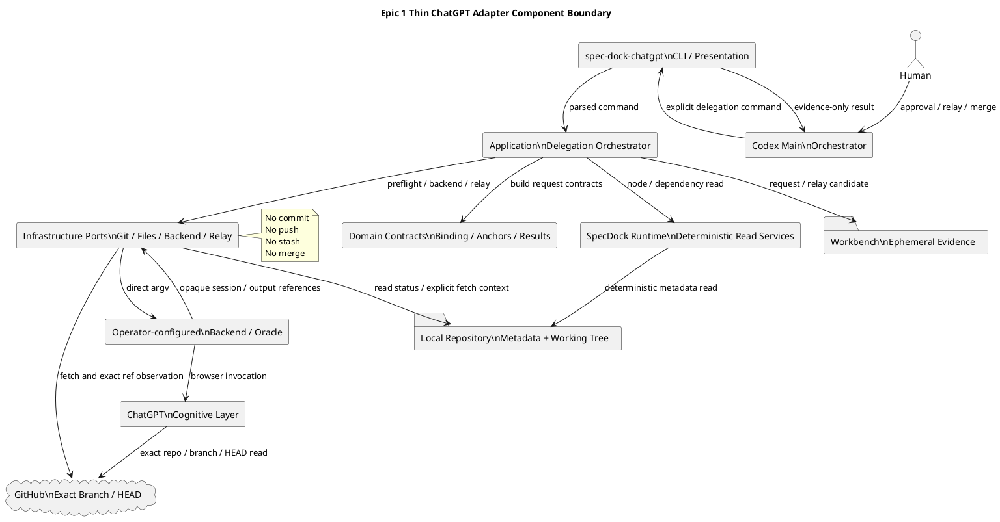
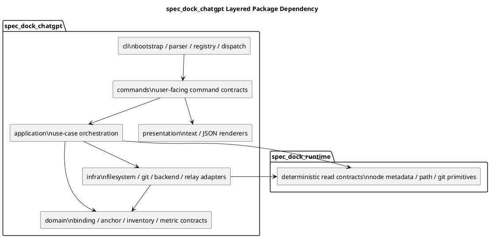
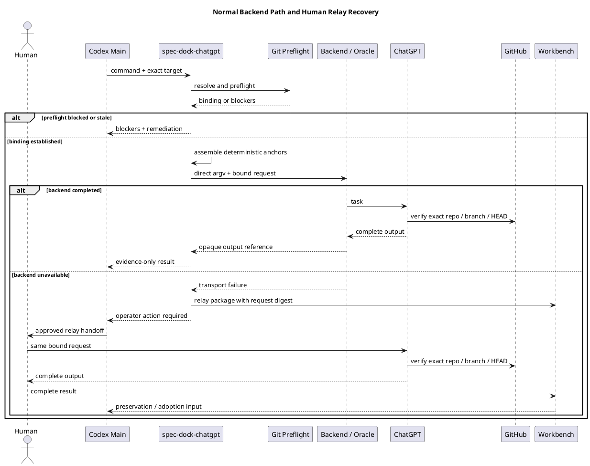
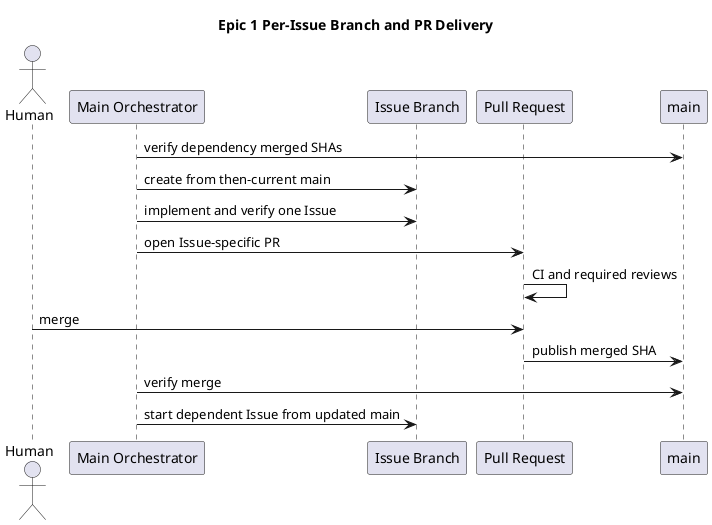

---

種別: 設計書（Epic）
ID: "epic-00324"
タイトル: "Delegation Foundation Asset Inventory and Thin ChatGPT Adapter"
関連GitHub: ["#324"]
状態: "draft"
作成者: "iwasawayuuta"
最終更新: "2026-07-20"
依存: ["requirement.md"]
親: ["init-00322"]
---

# epic-00324 Delegation Foundation Asset Inventory and Thin ChatGPT Adapter — 設計

## 1. 設計目的

本設計は、`epic-00324`が固定するcross-Issue architecture、component boundary、command／adapter contract、failure semantics、inventory ownership、metrics feasibility、test strategyを定義する。

設計優先順位は次の通りである。

1. Human Gateとactor authority
2. GitHub exact repository／branch／HEAD
3. no-hidden-Git
4. deterministic anchorとsemantic selectionの分離
5. thin／operator-configured backend boundary
6. current provider／installed／dogfood architectureへの適合
7. changeabilityとminimal state
8. metrics observability
9. backward compatibility

## 2. 現行architectureと再利用方針

### 2.1 現行surface

| Surface                              | 現行authority／役割                                             | 本Epicでの扱い                                                                                               |
| ------------------------------------ | ---------------------------------------------------------- | ------------------------------------------------------------------------------------------------------- |
| `src/spec_dock/cli.py`               | wheel側の`spec-dock init`／`update` installer                 | new repo-local executable、docs、system inventoryを配布できるようadditiveに更新する。                                   |
| `src/spec_dock/assets/install_root/` | `.agents/`、`.codex/`、`.github/`のagent-tooling authority    | inventoryの主要scan対象。Epic 1ではglobal Skill／Agent cutoverや旧asset削除を行わない。                                    |
| `src/spec_dock/assets/spec_dock/`    | shipped docs／templates／system／repo-local runtime authority | new adapter executable、adapter package、inventory、workflow docのprovider authorityとする。                    |
| `spec-dock/`                         | dogfood projection                                         | provider sourceから同期し、独立implementation authorityとして編集しない。                                                |
| `spec_dock_runtime`                  | layered deterministic Runtime                              | Node metadata、Git preflight、path safety等のnarrow read-only deterministic serviceを再利用可能にする。Oracleを取り込まない。 |
| current `spec-dock authoring`        | current ChatGPT authoring-pack evidence lane               | compatibility regression対象。vNext formal boundaryとしてそのまま再brandingせず、Epic 6まで保持する。                        |
| `spec-dock-chatgpt-authoring` Skill  | current external evidence-lane Skill                       | inventoryではcompatibility surfaceとして記録し、本Epicで削除しない。                                                     |

### 2.2 実装配置の決定

`spec-dock-chatgpt`はwheel-level `[project.scripts]`へ新しい常駐CLIとして追加せず、現行repo-local Runtime patternに合わせたmanaged executableとして配布する。

Provider authority:

```text
src/spec_dock/assets/spec_dock/scripts/
├── spec-dock-chatgpt
└── spec_dock_chatgpt/
    ├── app.py
    ├── cli/
    ├── commands/
    ├── application/
    ├── domain/
    ├── infra/
    └── presentation/
```

Dogfood／installed consumer projection:

```text
spec-dock/scripts/
├── spec-dock-chatgpt
└── spec_dock_chatgpt/
    ├── app.py
    ├── cli/
    ├── commands/
    ├── application/
    ├── domain/
    ├── infra/
    └── presentation/
```

この配置を採る理由:

* day-to-day repo operationをinstalled wheel availabilityから分離する現行patternと一致する。
* `spec-dock-chatgpt`をCore `spec-dock` command registryから分離できる。
* `spec-dock init`／`update`でconsumerへ同一assetを配布できる。
* provider、installed consumer、dogfood projectionを同じasset sourceから検証できる。
* Oracle dependencyをCore Runtime packageへ逆流させずに済む。

`spec_dock_chatgpt`は必要に応じて`spec_dock_runtime`のnarrow deterministic read-only serviceをimportできる。依存方向は常に次である。

```text
spec_dock_chatgpt -> spec_dock_runtime deterministic contracts/services
spec_dock_runtime -X-> spec_dock_chatgpt
```

次は禁止する。

* `spec_dock_runtime`からOracle／backend codeをimportする。
* `spec_dock_chatgpt`からCore command registry、Node mutation use case、finish／sync mutation pathを呼ぶ。
* current `spec-dock authoring` CLIをsubprocessで呼び出してvNext boundaryを偽装する。
* preflight semanticsを複製した二つの独立implementationを長期維持する。

## 3. Cross-Issue invariants

1. `spec-dock-chatgpt`はseparate executableである。
2. semantic command ownerが未materializeの場合、明示的にunsupportedとして停止する。
3. Formal requestはnamed branch、clean tree、origin upstream、local＝remote HEADへbindされる。
4. default branch、memory、tracked attachment、local-contextへsilent fallbackしない。
5. adapterはcanonical docs、Node、dependency、active state、Git transactionを変更しない。
6. remote-tracking refsを更新する明示preflight fetch以外、Git write operationを実行しない。
7. adapterは関連Artifactを意味的に選択しない。
8. backend command、model、browser、login、session internalsはoperator／backend-ownedである。
9. outputはevidence-onlyであり、adoption、reviewer pass、readiness、completionを自己申告しない。
10. inventoryとmetrics schemaはversioned static assetであり、runtime state databaseではない。
11. current authoring laneはEpic 6のcutoverまで維持する。
12. final Execution Brief Prompt、Concern selection、Brief lifecycleはEpic 4へ残す。

## 4. Component view

* **Title**: Epic 1 Thin ChatGPT Adapter Component Boundary
* **Question answered**: provider／Runtime／adapter／Oracle／GitHubの責務と依存方向は何か。
* **Scope**: target resolution、strict preflight、anchor assembly、backend invocation、Human Relay、evidence output。
* **Excluded details**: final Planning／Review／Execution Brief／Repair Prompt、browser UI、private wrapper implementation、Issue内class names。
* **Update trigger**: separate executable boundary、dependency direction、Git ownership、backend ownershipが変わるとき。



## 5. Package dependency

* **Title**: `spec_dock_chatgpt` Layered Package Dependency
* **Question answered**: new adapterのinternal layerとCore Runtimeへの許可依存は何か。
* **Scope**: CLI、commands、application、domain、infra、presentationの依存方向。
* **Excluded details**: individual function names、test helper、backend implementation source tree。
* **Update trigger**: layer responsibilityまたはCore Runtimeとのdependency directionが変わるとき。



`spec_dock_runtime`から`spec_dock_chatgpt`へのruntime dependencyは禁止する。図のhidden relationはlayout用途であり、実dependencyを表さない。

## 6. Design slice catalog

| Design slice                                 | 目的                                                                     | Closes                                                          | Owning Issue candidate | Contract impact                         | Expected evidence                                                 |
| -------------------------------------------- | ---------------------------------------------------------------------- | --------------------------------------------------------------- | ---------------------- | --------------------------------------- | ----------------------------------------------------------------- |
| DS-001 Inventory and authority map           | maintained assetの所在、owner、projection、lifecycleを固定する。                   | E-RQ-002、E-RQ-009。E-AC-001、E-AC-009。                            | `E1-I01`               | static inventory schema、coverage rule   | manifest、scan report、path／parity tests                            |
| DS-002 Adapter boundary and command skeleton | separate executable、layered package、command tree、result envelopeを確立する。 | E-RQ-001、E-RQ-003。E-AC-002、E-AC-008。                            | `E1-I02`               | CLI／application public contract         | help／parser tests、dry-run fixture、forbidden-claim tests           |
| DS-003 Binding, anchors, strict preflight    | exact target／branch／HEADとno-hidden-Gitを成立させる。                          | E-RQ-004、E-RQ-005、E-RQ-008、E-RQ-011。E-AC-003、E-AC-004、E-AC-007。 | `E1-I03`               | TargetBinding、AnchorSet、PreflightResult | hermetic Git tests、digest fixtures、argv spy                       |
| DS-004 Backend and Human Relay               | operator-configured transportと同一contract recoveryを提供する。                | E-RQ-006、E-RQ-007、E-RQ-011。E-AC-005、E-AC-006。                   | `E1-I04`               | BackendInvocationPort、RelayPackage      | backend stub tests、relay round-trip、workflow doc                  |
| DS-005 Metrics and changeability             | M-001〜M-013 feasibility、baseline、M-008 drillを準備する。                     | E-RQ-010。E-AC-010、E-AC-011。                                     | `E1-I05`               | MetricFeasibilityRecord、baseline rubric | coverage matrix、baseline artifact、changeability rehearsal         |
| DS-006 Distribution and compatibility        | installer、dogfood、docs、current lane regressionを統合する。                   | E-RQ-002、E-RQ-009。E-AC-009、E-AC-012。                            | `E1-I06`               | managed asset API、docs navigation       | init／update tests、provider-dogfood parity、current lane regression |
| DS-007 Final quality and delivery            | 各implementation PRがmerge済みのlatest mainからE1-QA専用branchを作り、全contractsを統合検証する。 | 全E-RQ、全E-AC。 | `E1-QA` | Issue単位deliveryとEpic closure boundary | full tests、exact HEAD smoke、rollback rehearsal、PR merge chain、closure matrix |

## 7. Inventory design

### 7.1 Authority and path

Inventory provider authority:

```text
src/spec_dock/assets/spec_dock/system/delegation-inventory.json
```

Shipped／dogfood projection:

```text
spec-dock/system/delegation-inventory.json
```

Human-readable responsibility／operating guidance:

```text
src/spec_dock/assets/spec_dock/docs/workflow_chatgpt_delegation.md
spec-dock/docs/workflow_chatgpt_delegation.md
```

Inventoryはmanaged static catalogであり、次のものではない。

* runtime execution state
* accepted HEAD registry
* workflow database
* completion ledger
* cutover switch
* automatic deletion list

### 7.2 Inventory schema

```text
schema_version
generated_for
entries[]
  asset_id
  kind
  responsibility
  authority_owner
  provider_authority_paths[]
  shipped_paths[]
  installed_consumer_paths[]
  dogfood_paths[]
  hosts[]
  lifecycle
  replacement_owner_epic
  verification_mode
  related_workflows[]
  notes[]
```

#### `kind`

* `skill`
* `agent`
* `workflow`
* `template`
* `script`

#### `lifecycle`

* `maintained`: current supported responsibilityを持つ。
* `compatibility`: current workflow継続に必要だが、後続Epicで置換候補になる。
* `planned_replacement`: parent planでreplacement ownerが明示されている。
* `historical`: maintained surfaceから参照されない履歴。validatorのrequired parity対象外。

`planned_replacement`や`compatibility`は削除許可ではない。実際の削除はEpic 6のreviewed planとHuman Gateを必要とする。

#### `verification_mode`

* `byte_equal_projection`
* `managed_copy`
* `required_marker_set`
* `path_exists`
* `generated_from_provider`
* `manual_external_boundary`

### 7.3 Coverage rules

Validatorは少なくとも次をscanする。

* `src/spec_dock/assets/install_root/.agents/skills/`
* `src/spec_dock/assets/install_root/.agents/host-adapters/`
* `src/spec_dock/assets/install_root/.codex/agents/`
* `src/spec_dock/assets/install_root/.github/agents/`
* `src/spec_dock/assets/spec_dock/docs/workflow_*.md`
* `src/spec_dock/assets/spec_dock/templates/`
* `src/spec_dock/assets/spec_dock/scripts/`
* corresponding dogfood projections

次をfailureにする。

* duplicate `asset_id`
* unknown kind／lifecycle／verification mode
* missing provider authority path
* maintained entryのmissing consumer／dogfood projection
* unmanaged maintained asset
* projectionがproviderと不整合
* replacement owner不在の`planned_replacement`
* private absolute host path
* inventory自体からのcompletion／cutover claim

## 8. Command surface

### 8.1 Root command

```text
spec-dock-chatgpt <command-group> <operation> <target> [options]
```

Reserved logical groups:

```text
planning create
planning revise
review planning
review checkpoint
review delivery
review targeted
execution-brief generate
repair-batch generate
```

Epic 1で必須なのはcommand tree、argument validation、common binding、dry-run、explicit unsupported behaviorである。各semantic handlerのownerは次の通り。

| Command group     | Semantic owner |
| ----------------- | -------------- |
| `planning`        | Epic 2         |
| `review`          | Epic 3         |
| `execution-brief` | Epic 4         |
| `repair-batch`    | Epic 4         |

### 8.2 `execution-brief generate` skeleton

```text
spec-dock-chatgpt execution-brief generate <issue-id-or-path> --unit <execution-unit-id>
```

Epic 1で実装するbehavior:

1. exact Issue targetの構造的解決
2. Execution Unit IDのopaque identifier validation
3. strict preflight
4. deterministic anchor assembly
5. evidence-only request envelopeのdry-run rendering
6. semantic contract未materialize時の明示停止

Epic 1で実装しないbehavior:

* PlanからUnitの意味をparseすること
* relevant Artifact retrieval
* Applicable Concern selection
* final Prompt
* Brief Markdown生成
* `ready | planning-gap | insufficient-evidence`
* Workbench candidate adoption／freeze
* Executor start

### 8.3 Common options

Foundationとして許可する共通option:

```text
--repo-root <path>
--ref <named-branch>
--context <text>
--context-file <external-or-untracked-file>
--file <external-or-untracked-file>
--format text|json
--dry-run
--backend-command <operator-configured-command>
```

禁止するoption／behavior:

```text
--allow-default-branch-fallback
--oracle <implementation-selector>
--prompt <raw-prompt-override>
tracked repository file auto-attachment
implicit active target fallback for formal invocation
implicit local-context fallback
```

`--context-file`と`--file`はregular non-symlink fileに限定し、Git-tracked file、secret-like path、`.env*`を拒否する。

### 8.4 Result envelope

```text
schema_version
status
operation
authority
canonical_written
node_mutated
git_transaction_performed
target_binding
anchor_digest
preflight
backend
relay
blockers[]
remediation[]
durations
```

固定値:

```text
authority = evidence_only
canonical_written = false
node_mutated = false
git_transaction_performed = false
```

Semantic output本文はresult envelopeへ埋め込まず、backend／Oracle-owned output referenceとして扱う。

## 9. Target resolution

### 9.1 Accepted target forms

* exact Scope ID: `init-*`、`epic-*`、`iss-*`
* exact repo-relative node directory path

Formal invocationではtitle fuzzy search、GitHub Issue numberだけの曖昧解決、active Scopeへの暗黙fallbackを使わない。

### 9.2 Resolution algorithm

1. repository rootを決定する。
2. `.workbench`を除外してcanonical `.meta.json`をscanする。
3. requested IDまたはpathに一致するNodeを一件だけ選ぶ。
4. `.meta.json`のtype、ID、parent、initiative、epic、GitHub repositoryを検証する。
5. parent chainをmetadataから解決する。
6. `depends_on`をmetadataから読み、dependency IDとpathを決定的に解決する。
7. canonical file pathsをfixed filename conventionから組み立てる。
8. Artifact directory pathsを構造的に組み立てる。
9. pathをrepo-relative POSIX形式に正規化する。
10. lexical ID／path orderで安定sortする。

Node本文の意味やArtifact relevanceは評価しない。

## 10. Target binding and GitHub sync preflight

### 10.1 `TargetBinding`

```text
schema_version
repository_owner
repository_name
normalized_origin
branch
expected_head
observed_local_head
observed_remote_head
target_type
target_id
target_path
parent_ids[]
parent_paths[]
dependency_ids[]
dependency_paths[]
canonical_paths
artifact_paths
execution_unit_id
binding_digest
```

`binding_digest`はtimestampを含まないcanonical sorted JSONからSHA-256で計算する。

### 10.2 Strict preflight

Formal commandは次を順番に確認する。

1. Git repositoryである。
2. current HEADがdetachedでない。
3. requested refがnamed branchと一致する。
4. originが存在し、GitHub owner／repoへ正規化できる。
5. working tree、index、untracked stateがcleanである。
6. bounded noninteractive `git fetch --prune origin`が成功する。
7. upstreamが`origin/<named-branch>`を指す。
8. remote-visible branchを解決できる。
9. local HEADとremote HEADが一致する。
10. preflight開始時とfinal guard時でrepository snapshotが変化していない。
11. target metadataとcanonical pathがexpected HEADでtrackedである。
12. explicit external fileがtracked contentではない。
13. expected HEADとrequest bindingが一致する。

### 10.3 Failure classifications

| Condition                                      | Status                     | Allowed next action                                           |
| ---------------------------------------------- | -------------------------- | ------------------------------------------------------------- |
| dirty／detached／missing origin／missing upstream | `preflight_blocked`        | operatorが状態を修正して同じcommandを再実行する。                              |
| ahead／diverged／head mismatch                   | `preflight_blocked`        | Mainが明示的Git workflowで整合する。adapterはpush／rebaseしない。             |
| behind／source changed                          | `binding_stale`            | Mainが明示的に更新し、新しいHEADへrequestを再bindする。                         |
| fetch timeout／transport throttling             | `preflight_blocked`        | bounded same-shape retry policyまたはoperator remediation。       |
| authentication／configuration failure           | `preflight_blocked`        | credentials／remote configをoperatorが修正する。権限escalationを自動推測しない。 |
| concurrent repository change                   | `preflight_blocked`        | repositoryが安定した後に再実行する。                                       |
| target missing／ambiguous                       | `target_resolution_failed` | exact ID／pathを修正する。                                           |
| tracked／secret-like attachment                 | `attachment_rejected`      | GitHub anchorまたは安全なexternal fileを使用する。                        |

### 10.4 Git operation policy

Allowed direct Git operationsは、target bindingに必要なread-only observationと明示fetchに限定する。

```text
rev-parse
symbolic-ref
status --porcelain
remote get-url
for-each-ref / show-ref
rev-list
merge-base --is-ancestor
ls-files
cat-file / show for structural existence
fetch --prune origin
```

Forbidden operations:

```text
add
commit
push
stash
checkout
switch
reset
clean
merge
rebase
cherry-pick
revert
tag
update-ref
branch force-update
force push
```

rollbackで使用する`git revert`はMain／Human-controlled delivery procedureであり、adapterに許可しない。

## 11. Deterministic anchor contract

### 11.1 Included anchors

```text
repository owner/name
named branch
expected HEAD
target type/ID/path
Initiative/Epic/Issue parent paths
requirement.md/design.md/plan.md/report.md paths
target artifacts directory
dependency Scope IDs/paths
selected Execution Unit ID
optional Operator Context digest
explicit external file digests
```

### 11.2 Excluded semantics

```text
relevant ADR selection
relevant Interview selection
relevant Discussion selection
relevant Research selection
dependency completion interpretation
code relevance ranking
test seam selection
configuration relevance ranking
architecture classification
Applicable Concern selection
test strategy
implementation strategy
```

### 11.3 Canonical representation

* UTF-8
* POSIX repo-relative path
* dictionary key sort
* list sort by `(scope_type, scope_id, path)`
* duplicate removal
* no timestamp in digest input
* no absolute host path
* no raw context body in durable diagnostics
* SHA-256 digest

## 12. Backend／Oracle boundary

### 12.1 Config resolution

Compatibilityを維持する解決順:

1. explicit `--backend-command`
2. `SPECDOCK_CHATGPT_COMMAND`
3. compatibility environment `ORACLE_CHATGPT_COMMAND`
4. unsetならfail closed

SpecDockは`--oracle` implementation selectorを追加しない。

### 12.2 Invocation contract

`BackendInvocationPort` input:

```text
operator-configured argv prefix
request slug
request text or request package reference
explicit external file references
output directory
timeout
dry-run
```

`BackendInvocationPort` output:

```text
transport_status
backend_source_class
exit_code
session_ref
output_refs[]
stdout_excerpt
stderr_excerpt
duration_ms
retry_disposition
```

Rules:

* `shell=False`
* direct argv
* no private path persistence
* no model／browser selector injected by SpecDock
* no cookie／profile inspection
* no backend source checkout／update
* no output semantic parse
* stdout／stderrはbounded and redacted
* nonzero exitをChatGPT semantic verdictとして扱わない

### 12.3 Idempotency

* config resolution、request rendering、dry-runはpure and repeatable。
* backend invocationはnon-idempotent。
* timeout／uncertain completion後はsession／output discoveryを先に確認する。
* evidenceなしで同じrequestを自動再送しない。
* operator-approved retryは同じbindingとrequest digestを保持する。
* request digestが変わる場合は新しいinvocationとして扱う。

## 13. Human Relay

### 13.1 Relay package

```text
schema_version
request_digest
task_kind
target_binding
deterministic_anchors
operator_context_digest
external_file_digests
required_repository_access
constraints
forbidden_authority_claims
output_contract_reference
created_by
authority
```

固定値:

```text
authority = evidence_only
```

Relay packageにtracked repository content本文を含めない。

### 13.2 Relay flow

* **Title**: Normal Backend Path and Human Relay Recovery
* **Question answered**: preflight成功後、backend failureを同一contractのHuman Relayへどう接続するか。
* **Scope**: request binding、backend invocation、failure、relay、Workbench handoff。
* **Excluded details**: ChatGPT UI操作、final Prompt本文、output adoptionの意味判断。
* **Update trigger**: transport owner、relay package、authority handoffが変わるとき。



### 13.3 Re-entry boundary

Human Relay後のMainは次だけを確認する。

* relay request digest
* exact binding
* complete output presence
* output source／session reference
* forbidden authority claim
* preservation classification

Mainはraw outputを自動でcanonical docsへ書かず、既存のpreservation、EAL、canonical integration、fresh reviewer workflowへ戻す。

## 14. Workflow documentation

`workflow_chatgpt_delegation.md`は次を含む。

1. purposeとauthority
2. actor responsibility
3. normal route
4. strict GitHub preflight
5. deterministic anchors
6. backend configuration
7. external file policy
8. transport failure classification
9. Human Relay
10. evidence preservation and adoption handoff
11. no-hidden-Git
12. security／redaction
13. current authoring laneとのcompatibility
14. later Epic ownership
15. stop conditions
16. operator checklist

この文書はcurrent `workflow_chatgpt_authoring_pack.md`を置換済みと表現しない。

## 15. Metrics feasibility design

### 15.1 Record schema

```text
schema_version
metric_id
metric_name
definition
availability
source_type
source_reference
collector
unit
sample_id
task_shape
started_at
ended_at
observed_value
proxy_definition
privacy_classification
limitations[]
downstream_owner_epic
revisit_condition
```

`availability`:

* `direct`
* `proxy`
* `deferred_measurement`
* `unavailable`

`observed_value`は取得できる場合だけ記録する。未取得値を0として記録しない。

### 15.2 Metric mapping

| Metric                             | Epic 1 feasibility source                           | Expected classification                            |
| ---------------------------------- | --------------------------------------------------- | -------------------------------------------------- |
| M-001 Unplanned Human Intervention | workflow report／operator logのplanned／unplanned分類    | historical recordがあればdirect、なければproxy              |
| M-002 Main Context Protection      | handoff UTF-8 byte数、raw transcript intake有無         | direct byte countまたはproxy                          |
| M-003 Codex Cognitive Route Proxy  | Skill／Agent invocation log、inventory                | direct countまたはrepository evidence                 |
| M-004 Human Gate Integrity         | Git／GitHub／report audit                             | direct                                             |
| M-005 Minimal State                | inventory、repository search、new file classification | direct                                             |
| M-006 Asset Parity                 | provider／installed／dogfood parity test              | direct                                             |
| M-007 Workflow Reliability         | command／smoke statusとfailure classification         | direct                                             |
| M-008 Changeability Drill          | changed files、layers、tests、migration有無              | direct rehearsal                                   |
| M-009 Brief Evidence Quality       | Epic 4以降のreview rubric                              | deferred_measurement。schemaとownerをEpic 1で固定する。     |
| M-010 Implementation Convergence   | Checkpoint result、failure cycle                     | deferred_measurement。Epic 4 owner。                 |
| M-011 Codex Resource Shift         | tokenがあればtoken、なければtool call／exploration／handoff    | proxy対応                                            |
| M-012 General Applicability        | diverse task-shape classification                   | deferred_measurement。Epic 4／7 owner。               |
| M-013 Total Delivery Efficiency    | wall-clock、backend／relay／Executor区分                 | direct timestamp foundation、full evaluationはEpic 7 |

### 15.3 Baseline

Baseline evidenceはEpic scopeのtimestamped `artifacts/`へRuntime-owned artifact commandで保存し、`report.md`にはsummaryとreferenceだけを置く。

Selection rule:

1. repository／Oracle／report evidenceから直近の適格旧Workflowを時系列で列挙する。
2. 3件以上あれば直近3件以上を選ぶ。
3. 3件未満なら全件を選び、不足理由を記録する。
4. sample selectionを導入後の結果に合わせて変更しない。
5. task shape、evidence dates、missing telemetryを記録する。
6. quality metricとresource metricを別々に保つ。

## 16. M-008 changeability feasibility

次の変更を局所化する。

| Change target   | Expected localized surface                 | Forbidden consequence             |
| --------------- | ------------------------------------------ | --------------------------------- |
| Prompt wording  | later Epic-owned resource／fixture          | Core Runtime migration            |
| backend command | operator config／infra adapter test         | product assetへのprivate path保存     |
| model label     | operator backend configuration             | canonical file schema migration   |
| result field    | boundary contract version／renderer／fixture | semantic state database migration |
| anchor field    | domain contract version、compat renderer    | full repository semantic parser   |
| inventory entry | static manifest、coverage test              | automatic asset deletion          |

Rehearsalは変更前後の次を記録する。

* changed file set
* changed layer set
* affected tests
* migration files
* runtime state reset requirement
* provider／dogfood projection impact
* compatibility result

成功条件は、代表変更が局所的であり、semantic database、canonical schema migration、全Scope rewriteを要求しないことである。

## 17. Failure model

| Symbolic status               | 意味                                                                          | Retry／recovery                                |
| ----------------------------- | --------------------------------------------------------------------------- | --------------------------------------------- |
| `pass`                        | foundation-level structural operationが完了した。semantic adoptionやreadinessではない。 | 次のexplicit workflow stepへ進める。                 |
| `capability_not_materialized` | later Epic-owned semantic handlerがまだ存在しない。                                  | owner Epicの実装まで停止する。fallbackしない。              |
| `target_resolution_failed`    | targetがmissing、ambiguous、invalid type。                                      | exact ID／pathを修正する。                           |
| `preflight_blocked`           | repository、remote、worktree、connector前提を満たさない。                               | operator／Mainが修正して再実行する。                      |
| `binding_stale`               | source HEADまたはsource snapshotが古い。                                           | new HEADへrequestを再bindする。                     |
| `attachment_rejected`         | tracked、secret-like、unsafe path。                                            | GitHub anchorまたは安全なexternal fileへ変更する。        |
| `backend_unconfigured`        | backend commandがない。                                                         | operatorがconfigを設定する。                         |
| `backend_unavailable`         | spawn、browser startup、recoverable environment failure。                      | recovery後に再実行、またはHuman Relay。                 |
| `backend_timeout`             | completion不明またはtimeout。                                                     | session／output discoveryを先に行い、重複送信を避ける。       |
| `backend_failed`              | backend nonzero／transport failure。                                          | diagnosticsに基づきrepairまたはHuman Relay。          |
| `output_unavailable`          | complete outputを取得できない。                                                     | output recoveryまたはHuman Relay。                |
| `operator_action_required`    | Human Relay、credential repair、material decisionが必要。                         | Human Gate。                                   |
| `rejected`                    | unsafe input／output、forbidden authority claim。                              | sourceを修正または棄却する。                             |
| `internal_error`              | adapter defectまたは未分類failure。                                                | fail closed、diagnostic evidence、Issue repair。 |

Numeric exit code allocationはIssue implementation detailとするが、`pass`だけがzero、その他はnonzeroでなければならない。

## 18. Security and secrets boundary

* `--backend-command`またはenvironmentから取得したargvはredaction後だけdiagnosticへ出す。
* secret optionの次value、token-like string、host absolute pathをredactする。
* `.env*`のreadはinstruction-forbiddenであり、adapter inputとして拒否する。
* symlink target、path traversal、hidden credential directory、device file、directory attachmentを拒否する。
* relay packageはexternal fileのdigestとlogical referenceを持てるが、secret contentを埋め込まない。
* request package、output、metricsはWorkbenchまたはscope-local Artifact contractに従い、private temp pathをcanonical docsへ残さない。
* ChatGPT側GitHub access failure時はtracked file attachmentで補わない。

## 19. Observability

### 19.1 Structural event fields

```text
operation
status
target_id
target_path
repository
branch
expected_head
observed_local_head
observed_remote_head
anchor_digest
request_digest
preflight_duration_ms
backend_duration_ms
total_duration_ms
backend_source_class
relay_required
blocker_codes[]
remediation_codes[]
git_operation_summary
authority
```

### 19.2 Logging rules

* text outputはoperator-readable remediationを優先する。
* JSON outputはstable symbolic fieldを持つ。
* raw stdout／stderrはbounded excerptだけを保持する。
* raw ChatGPT output本文をstandard logへ複製しない。
* secret、cookie、browser profile、absolute private pathを出力しない。
* `git_operation_summary`は明示fetchとread-only commandsだけを示す。
* metrics collectorがduration、failure、relay routeを再利用できる。

## 20. Compatibility, migration, and rollback

### 20.1 Additive rollout

1. provider assetへnew executable／package／inventory／workflow docを追加する。
2. installerがnew executableをexecutable化する。
3. temp consumer init／updateでprojectionを検証する。
4. dogfood `spec-dock/`をproviderから同期する。
5. current `spec-dock authoring`／current Skillsのregressionを確認する。
6. later Epicはnew boundaryへsemantic handlerを追加する。
7. Epic 6まで旧surfaceを削除しない。

### 20.2 No migration

本Epicは次を要求しない。

* existing Scope document rewrite
* Node metadata migration
* active state migration
* Brief／Review database migration
* Oracle session migration
* new canonical file
* closed Scope modification

### 20.3 Rollback-by-revert

* adapter、inventory、workflow doc、installer integrationを含むEpic candidate commitsをMainがGit revertできる。
* rollback rehearsalはtemp clone／temp consumerで実行する。
* revert後にcurrent `spec-dock` CLI、current authoring lane、existing specsが動作することを確認する。
* adapter自身は`git revert`を実行しない。
* data migrationがないため、rollback後のsemantic cleanupは不要である。
* rollbackでtracked-file attachmentやOracle selectorを再導入しない。

### 20.4 Issue単位のbranch／PR／merge topology

Epic 1のdelivery unitはEpic全体ではなく各Issueである。各Issueは独立したfeature branchとPRを持ち、依存Issueがmainへmergeされるまで開始しない。これにより、review対象、rollback単位、merged evidenceをIssue責務と一致させる。

| State | Contract |
|---|---|
| dependency-ready | 全dependency IssueのPRがHuman merge済みで、merged SHAがmainに含まれる。 |
| branch-created | dependency-ready確認後のthen-current main SHAから、当該Issue専用branchを作成した。 |
| review-ready | Issue acceptance checks、required tests、report evidenceを満たし、当該branchから個別PRを作成した。 |
| merge-ready | blocking review／CIを解消し、reviewed headとPR headが一致する。 |
| merged | HumanがPRをmergeし、merged SHAがmainに含まれる。 |
| downstream-unblocked | Mainがmerged SHAを確認し、依存する次Issueが更新済みmainからbranchを作成できる。 |

並列Issueは同じmain SHAからbranchを作成できる。ただし片方が先にmergeされ、もう片方のbaseが古くなった場合、後者はmerge前に最新mainへ追随し、affected checksとreview freshnessを再確認する。final quality Issueも同じlifecycleを通り、全先行Issueのmerged成果だけを検証する。



## 21. Test strategy

### 21.1 Unit tests

* inventory schema、coverage、stable ordering
* TargetBinding normalization／digest
* AnchorSet normalization／digest
* exact ID／path resolver
* parent／dependency traversal
* external file policy
* strict preflight classification
* config resolution
* backend argv construction
* diagnostic redaction
* relay package digest
* metric feasibility coverage
* result envelope authority fields
* unsupported semantic capability behavior

### 21.2 Application tests

* target resolve → preflight → anchors → dry-run
* blocked preflight short-circuit
* backend normal／timeout／nonzero
* uncertain timeout後のno-automatic-duplicate
* Human Relay package generation
* evidence-only result boundary
* no semantic output parsing
* no Node／canonical mutation

### 21.3 Infra and Git tests

Hermetic temp repositoriesを使い、次を再現する。

* synced branch
* detached HEAD
* dirty tracked file
* untracked file
* missing origin
* missing upstream
* ahead
* behind
* diverged
* fetch failure
* concurrent repository change
* target path absent at expected HEAD
* tracked attachment rejection
* before／after HEAD、branch、index、worktree equality
* direct argv and `shell=False`
* forbidden Git command absence

### 21.4 CLI runtime tests

* root help
* reserved command group help
* `execution-brief generate` help
* required argument validation
* text／JSON result
* dry-run
* unsupported semantic handler
* blocked／stale exit
* forbidden authority claim absence
* current `spec-dock authoring` regression

### 21.5 Installer／projection tests

* `spec-dock init` installs new executable、package、inventory、workflow doc
* `spec-dock update` refreshes managed files without deleting specs
* executable bit is set best-effort on supported platforms
* provider／dogfood copied files match
* package data contains hidden installed tooling and new shipped files
* current Skill／Agent surfaces remain
* no private backend path or Oracle selector appears

### 21.6 Integration smoke

1. stub backend exact argv smoke
2. Human Relay round-trip
3. `chemitaro/spec-dock`のthen-current main baseとE1-QA専用branchのexact HEAD smoke
4. ChatGPT側GitHub connectorがrepo、branch、HEADを一致確認するsmoke
5. mismatch／connector unavailableでfail closed
6. rollback-by-revert rehearsal
7. M-001〜M-013 feasibility coverage
8. no-hidden-Git integrated before／after snapshot
9. Issueごとのbase main SHA、PR head、reviewed head、merged SHAの連鎖確認
10. dependency Issueがmainへmergeされる前にdownstream Issue branchを開始しないnegative check

Live smokeはexternal dependencyを使うため、Epic completion evidenceとして実際のobserved repository、branch、SHA、execution date、routeを記録し、skipだけで完了扱いにしない。通常backendが利用不能でも、同じbindingを使うHuman Relay smokeで代替できる。

### 21.7 Existing regression constraints

少なくとも次の現行test surfaceを壊さない。

* `tests/cli_runtime/test_authoring.py`
* `tests/cli_runtime/test_wrappers.py`
* `tests/unit/authoring_pack/`
* `tests/unit/infra/test_oracle_selector_removal.py`
* installer／package-data tests
* provider／dogfood projection tests

## 22. Issue planningへ委譲する詳細

| Detail                                 | Owning candidate | Epic invariant                                               |
| -------------------------------------- | ---------------- | ------------------------------------------------------------ |
| inventory renderer／validatorのfunction名 | `E1-I01`         | schema、coverage、authority、non-deletionは変更不可                  |
| parser／registry／rendererのfile split    | `E1-I02`         | separate executableとlayeringは変更不可                            |
| numeric exit code                      | `E1-I02`         | `pass`のみzero、failureはnonzero                                 |
| preflight extraction／reuse unit        | `E1-I03`         | strict semantics、no fallback、no hidden Gitは変更不可              |
| Git command helperの具体名                 | `E1-I03`         | allowlist／denylistとbefore-after invariantは変更不可               |
| backend timeout／bounded retry値         | `E1-I04`         | non-idempotent扱い、no duplicate、operator-owned backendは変更不可    |
| relay package filename                 | `E1-I04`         | request digest、same contract、evidence-onlyは変更不可              |
| historical sampleの具体的run               | `E1-I05`         | selection rule、non-invention、all-M coverageは変更不可             |
| docs navigation placement              | `E1-I06`         | `workflow_chatgpt_delegation.md`とcompatibility boundaryは変更不可 |
| final live smokeのthen-current SHA      | `E1-QA`          | exact branch／HEAD、fail closed、evidence recordは変更不可           |

## 23. Related ADR

* `20260716t123423z-01-adr-delegation-first-responsibility-boundary.md`

  * ChatGPT、Main、Executor、Runtimeのauthorityとside-effectを分離する。
* `20260716t123423z-03-adr-thin-chatgpt-oracle-adapter-and-github-binding.md`

  * thin adapter、GitHub exact HEAD、tracked-content非添付、Human Relayを定める。
* `20260716t123423z-06-adr-main-executor-git-ownership.md`

  * Mainだけが明示的Git transactionを所有する。
* `20260716t123423z-08-adr-minimal-persistent-state-and-workbench-boundary.md`

  * new semantic state DBを作らず、Workbenchを一時領域に限定する。
* `20260719t135413z-05-adr-architecture-aware-execution-brief-as-frozen-subordinate-contract.md`

  * Epic 1はBrief command／binding foundationだけを提供し、final Brief semanticsとlifecycleをEpic 4へ残す。

## 24. 設計上の未確定事項

Cross-Issue architecture、public boundary、failure semantics、security、test／rollback条件に未確定事項はない。

§22のIssue-local detailは意図的な委譲であり、Epic invariantを変更する場合はEpic Planning revisionとfresh reviewへ戻す。
