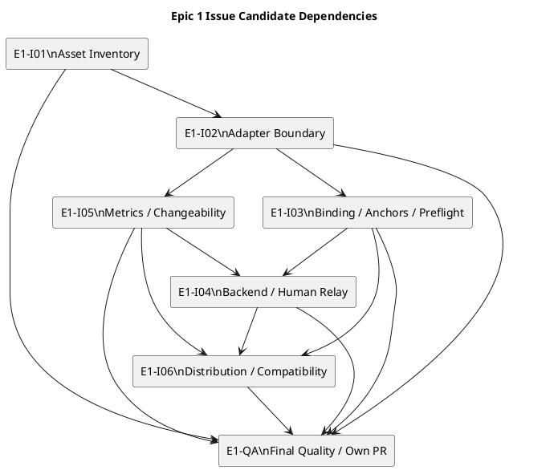

---

種別: 計画書（Epic）
ID: "epic-00324"
タイトル: "Delegation Foundation Asset Inventory and Thin ChatGPT Adapter"
関連GitHub: ["#324"]
状態: "draft"
作成者: "iwasawayuuta"
最終更新: "2026-07-20"
依存: ["requirement.md", "design.md"]
親: ["init-00322"]
---

# epic-00324 Delegation Foundation Asset Inventory and Thin ChatGPT Adapter — 計画

## 1. 計画の役割

この計画は、`epic-00324`をmulti-Issue implementation Epicとして実施するためのIssue candidate、依存、parallel lane、integration checkpoint、verification、provider／installed／dogfood impact、handoff、Delivery Boundaryを定義する。

本計画に記載する`E1-I01`〜`E1-I06`、`E1-QA`はstable candidate keyであり、実際のSpecDock Issue IDやGitHub Issue IDではない。Human approval前にIssue Node、dependency、canonical Issue docsを作成しない。

## 2. この計画で閉じるE-RQ／E-AC

### E-RQ

* E-RQ-001
* E-RQ-002
* E-RQ-003
* E-RQ-004
* E-RQ-005
* E-RQ-006
* E-RQ-007
* E-RQ-008
* E-RQ-009
* E-RQ-010
* E-RQ-011
* E-RQ-012

### E-AC

* E-AC-001
* E-AC-002
* E-AC-003
* E-AC-004
* E-AC-005
* E-AC-006
* E-AC-007
* E-AC-008
* E-AC-009
* E-AC-010
* E-AC-011
* E-AC-012
* E-AC-013

## 3. Epic classificationとIssue slicing policy

* Epic classification: `multi-issue implementation`
* final quality Issue: required
* implementation Issue candidates: 6
* final quality Issue candidate: 1
* actual Issue materialization: Human approval後
* canonical Issue docs: each IssueのJIT Issue Planningで作成
* per-Issue PR policy: 全Issueは専用branchと個別PRを持ち、required review／CI後にHumanがmainへmergeする
* downstream start policy: 依存IssueのPRがmainへmergeされたことを確認後、更新済みmainから新しいIssue branchを作成する
* final quality Issueも個別PRでdeliveryし、先行Issueの未merge差分を集約しない

### 3.1 分割原則

1. stable public boundary、Git binding、transport、metrics、distributionを別risk boundaryへ分ける。
2. provider implementationが安定する前にdogfood projectionを独立編集しない。
3. semantic Prompt／Review／Brief lifecycleをfoundation Issueへ混入させない。
4. Git safetyをtransportやdocsの副作業にせず、独立verification ownerを置く。
5. metricsをfinal qualityだけの後付け作業にせず、implementation Issueとしてbaselineを採取する。
6. final quality Issueを全implementation Issueの依存先にする。
7. Issue内TDD cadence、private implementation step、commit rhythmは本Epic Planで固定しない。

## 4. Issue candidate list

| Candidate key | 目的                                                                                                            | Owned E-RQ                          | Owned E-AC                 | 主成果物                                                                                                       | Dependency                 | Suggested grade | Provider／installed／dogfood impact                                                                                             | Verification                                                                                         | Handoff                                                |
| ------------- | ------------------------------------------------------------------------------------------------------------- | ----------------------------------- | -------------------------- | ---------------------------------------------------------------------------------------------------------- | -------------------------- | --------------- | ----------------------------------------------------------------------------------------------------------------------------- | ---------------------------------------------------------------------------------------------------- | ------------------------------------------------------ |
| `E1-I01`      | Delegation asset inventoryとauthority mapを確立する。                                                                | E-RQ-002、E-RQ-009                   | E-AC-001                   | `delegation-inventory.json`、schema、coverage validator、initial classification report                        | なし                         | `standard`      | provider system assetを追加し、dogfood system projectionを作る。install_rootはscan対象であり削除しない。                                           | schema、unique ID、path existence、coverage、projection tests                                            | `E1-I02`、`E1-I05`、`E1-I06`へasset／owner mapを渡す。         |
| `E1-I02`      | separate `spec-dock-chatgpt` executable、layered package、command／result contractを作る。                           | E-RQ-001、E-RQ-003                   | E-AC-002、E-AC-008          | wrapper、CLI／commands／application／domain／infra／presentation skeleton、reserved command tree、dry-run envelope | `E1-I01`                   | `strict`        | provider scriptsを追加。dogfood projectionを後続integration前に検証。Core `spec-dock` registryは変更しない。                                     | help、argument validation、dry-run、unsupported capability、authority negative tests                     | `E1-I03`、`E1-I04`、`E1-I05`へpublic contractsを渡す。        |
| `E1-I03`      | exact target binding、deterministic anchors、strict GitHub sync preflight、attachment policy、no-hidden-Gitを実装する。 | E-RQ-004、E-RQ-005、E-RQ-008、E-RQ-011 | E-AC-003、E-AC-004、E-AC-007 | TargetBinding、AnchorSet、strict preflight adapter、Git／path policy、text／JSON diagnostics                     | `E1-I02`                   | `strict`        | provider adapter packageとnarrow Runtime reuse seam。dogfood projectionはgenerated。current authoring preflight compatibilityを保持。 | hermetic Git matrix、digest golden、subprocess spy、HEAD／index／worktree invariance                      | `E1-I04`と`E1-I06`へbound request foundationを渡す。         |
| `E1-I04`      | operator-configured backend port、Human Relay、`workflow_chatgpt_delegation.md`を実装する。                           | E-RQ-006、E-RQ-007、E-RQ-011          | E-AC-005、E-AC-006。E-AC-011 backend/config実証を支援 | BackendInvocationPort、relay package、failure mapping、redaction、workflow doc、backend/config change evidence | `E1-I03`、`E1-I05` | `strict` | provider adapter infraとprovider docsを追加。private backend assetは追加しない。current authoring Skillを削除しない。 | backend stub、timeout、nonzero、redaction、relay digest、manual round-trip、M-008 backend/config evidence | `E1-I06`と`E1-QA`へtransport／docs／change evidenceを渡す。 |
| `E1-I05`      | M-001〜M-013 feasibility、historical baseline、M-008 measurement protocol／fixtureを準備する。                         | E-RQ-010                            | E-AC-010。E-AC-011 protocol／fixtureを支援 | metrics schema、feasibility matrix、baseline evidence、changeability measurement protocol／fixture | `E1-I01`、`E1-I02` | `standard` | provider docs／system schemaとEpic artifactsへ影響。Runtime state DBは追加しない。 | all-M coverage、sample rule、non-invention、protocol／fixture assertions | `E1-I04`へ測定protocolを渡し、`E1-I06`と`E1-QA`へbaseline／metric evidenceを渡す。 |
| `E1-I06`      | installer、provider／dogfood projection、docs navigation、compatibilityを統合する。                                     | E-RQ-002、E-RQ-009                   | E-AC-009                   | installer executable handling、init／update projection、docs links、compatibility regression                   | `E1-I03`、`E1-I04`、`E1-I05` | `strict`        | `src/spec_dock/cli.py`、provider assets、dogfood projection、installer tests。install_root旧surfaceは保持。                            | init／update、package data、provider-dogfood parity、current authoring regression                        | `E1-QA`へinstallable integrated candidateを渡す。           |
| `E1-QA`       | mainへmerge済みの全implementation成果を統合確認し、exact HEAD smoke、rollback、full qualityを閉じる。                         | primary ownershipなし。全E-RQをintegration verification | primary ownershipなし。全E-ACをintegration verification | full verification evidence、live smoke、rollback rehearsal、closure matrix、Issue固有PR | `E1-I01`〜`E1-I06` | `strict` | 全provider／installed consumer／dogfood surfaceを検査する。新feature scopeや未完実装を引き取らない。 | full test、live GitHub smoke、Human Relay smoke、no-hidden-Git、baseline、rollback、fresh Epic spec review | E1-QA専用PRをHuman Merge Gateへ渡す。先行Issue差分はすべてmainへmerge済みでなければならない。 |

## 5. Candidateごとのhandoff package

### 5.1 `E1-I01`

Purpose:

* current maintained asset setを列挙し、authorityとprojectionを一意にする。

Allowed local delta:

* inventory schemaのnon-semantic field naming
* validator／rendererのmodule split
* scan helperの具体実装

Forbidden parent boundary changes:

* old asset deletion
* global cutover
* inventoryをruntime state／authority databaseとして扱うこと
* provider authorityをdogfood側へ移すこと

Required evidence:

* provider tree scan
* installed consumer path scan
* dogfood projection scan
* missing／duplicate／stale classification tests
* current authoring laneのclassification

### 5.2 `E1-I02`

Purpose:

* separate executableとstable foundation contractsを作る。

Allowed local delta:

* parser／registry／dispatch helper
* text renderer wording
* numeric exit code allocation

Forbidden parent boundary changes:

* Core `spec-dock` command groupへの統合
* semantic Prompt実装
* automatic adoption／Node mutation
* `--oracle` selector
* raw Prompt override

Required evidence:

* root／subcommand help
* dry-run result
* unsupported semantic capability result
* authority false-claim checks
* wrapper importがrepositoryをdirtyにしないこと

### 5.3 `E1-I03`

Purpose:

* target、revision、anchors、Git safetyを固定する。

Allowed local delta:

* current Runtime preflightからのfunction extraction
* typed dataclass／protocolの細分化
* bounded diagnostic code

Forbidden parent boundary changes:

* local-context fallback
* default branch fallback
* semantic Artifact selector
* automatic push／stash／rebase
* tracked file attachment
* fuzzy target resolution

Required evidence:

* normal／all failure preflight matrix
* stable binding／anchor digest
* before-after Git snapshot
* explicit fetch trace
* attachment rejection
* concurrent change test

### 5.4 `E1-I04`

Purpose:

* backend差替えとHuman Relayを同じcontractへ閉じる。

Allowed local delta:

* backend argv placeholder scheme
* bounded timeout／retry constants
* relay package filename
* output reference normalization

Forbidden parent boundary changes:

* Oracle implementationの固定
* browser automation再実装
* private pathのdurable保存
* semantic output parse
* Codex-only semantic fallback
* Human Relayによるauthority self-grant

Required evidence:

* backend command precedence
* direct argv
* timeout／spawn／nonzero
* redaction
* uncertain completion duplicate prevention
* relay digest
* approved UI round-trip record
* `workflow_chatgpt_delegation.md`

### 5.5 `E1-I05`

Purpose:

* Initiative-level evaluationに必要なmeasurement foundationを先行確立する。

Allowed local delta:

* metric record file format
* baseline artifact title
* historical evidence query method

Forbidden parent boundary changes:

* unavailable valueの推測
* qualityとresourceの単一score化
* Epic 7 final evaluationの先取り
* semantic telemetry DB
* historical sampleの恣意的な後置変更

Required evidence:

* M-001〜M-013 coverage
* source／unit／collector／owner
* direct／proxy／deferred／unavailable classification
* qualifying historical runs
* M-008 measurement protocolとfixture。Prompt resource、backend command／model config、output fieldの実surfaceに対する実証はowning Issueが供給し、E1-QAが統合確認する
* privacy／redaction review

### 5.6 `E1-I06`

Purpose:

* provider sourceをreal consumerとdogfoodへ安全に配布する。

Allowed local delta:

* installer helperの具体名
* docs index placement
* platform-specific executable-bit test method

Forbidden parent boundary changes:

* existing spec deletion
* current authoring lane removal
* broad Skill cutover
* new top-level wheel console scriptへの無根拠な変更
* consumer-only hotfix

Required evidence:

* fresh init
* update over existing specs
* package data
* executable presence
* provider／dogfood parity
* current authoring CLI／Skill regression
* no Oracle selector／private path

### 5.7 `E1-QA`

Purpose:

* all implementation Issue PRがmerge済みのlatest main HEADをbaseに専用branchを作成し、統合検証とbounded repairをE1-QA固有PRでdeliveryする。

Allowed local delta:

* accepted blockerのbounded repair
* test fixture／docs correction
* evidence summary

Forbidden parent boundary changes:

* new semantic Prompt
* Planning／Review／Brief lifecycle実装
* legacy deletion
* auto-merge
* Human merge前のEpic completion
* P2／P3だけを理由とするbranch mutation
* unapproved re-slicing

Required evidence:

* all E-AC closure
* full tests
* exact branch／HEAD GitHub connector smoke
* Human Relay smoke
* no-hidden-Git integrated audit
* baseline／metrics coverage
* rollback-by-revert rehearsal
* provider／installed／dogfood impact summary
* fresh Epic-level specification review
* E1-QA固有PRのbase SHA、reviewed head、required checks、merge evidence

## 6. Dependency graph

```text
E1-I01
  -> E1-I02
      -> E1-I03
      -> E1-I05
E1-I03 + E1-I05
  -> E1-I04
E1-I03 + E1-I04 + E1-I05
  -> E1-I06
E1-I01 + E1-I02 + E1-I03 + E1-I04 + E1-I05 + E1-I06
  -> E1-QA
```

* **Title**: Epic 1 Issue Candidate Dependencies
* **Question answered**: どのIssue candidateが何に依存し、どこを並列化できるか。
* **Scope**: implementation候補6件とfinal quality候補1件の実効依存。
* **Excluded details**: Issue内step、TDD cadence、commit rhythm、actual Issue ID。
* **Update trigger**: HumanがIssue slice、cross-Issue contract、Issue単位Delivery Topologyを変更したとき。



## 7. Parallelizable lanes

| Lane                   | Candidate | Start condition                          | Join condition                                         |
| ---------------------- | --------- | ---------------------------------------- | ------------------------------------------------------ |
| Foundation inventory   | `E1-I01`  | Epic PlanningとHuman Issue-slice approval | inventory schemaとowner mapがreview可能                    |
| Adapter contract       | `E1-I02`  | `E1-I01` handoff                         | stable CLI／domain contracts                            |
| Deterministic Git lane | `E1-I03`  | `E1-I02` contracts                       | exact binding、anchors、preflight、no-hidden-Git evidence |
| Metrics lane           | `E1-I05`  | `E1-I01`と`E1-I02` contracts              | all-M feasibilityとbaseline evidence                    |
| Transport lane         | `E1-I04`  | `E1-I03` bindingと`E1-I05` measurement protocolがmerge済み | backend／relay／M-008 actual evidence |
| Distribution lane      | `E1-I06`  | `E1-I03`、`E1-I04`、`E1-I05`               | installable provider／dogfood candidate                 |
| Final integration      | `E1-QA`   | 全implementation Issue PRがmainへmerge済み  | E1-QA固有PRのHuman mergeとEpic Delivery Boundary       |

`E1-I03`と`E1-I05`は`E1-I02`後に並列実行可能である。`E1-I04`は両IssueのPRがmainへmergeされた後、binding／anchor contractとmeasurement protocolを受け取って開始する。`E1-I06`はimplementation contractsが揃うまで開始しない。

### 7.1 Issue branch／PR lifecycle

1. Mainがdependency IssueのPRとmerged SHAを確認する。
2. then-current mainを取得し、そのSHAから対象Issue専用branchを作成する。
3. 対象IssueのJIT Planning、実装、検証、report更新を行う。
4. 対象Issueだけを含むPRを作成し、required CIとreviewを完了する。
5. blocking findingを同じIssue branchで修正し、新HEADに対して必要なreviewを更新する。
6. HumanがPRをmainへmergeする。
7. Mainがmerged SHAを確認し、依存する次Issueをunblockする。

並列可能なIssueは、全dependencyがmerge済みであれば同じmain SHAから開始できる。一方が先にmergeされて他方のbaseが古くなった場合、後者はmerge前に最新mainへ追随し、影響するchecksとreview freshnessを再確認する。

## 8. Integration checkpoints

### G0: Issue slice approval

Required:

* Humanがcandidate list、責務、dependency、Issue単位Delivery Topologyを承認する。
* actual Issue Node／GitHub Issueは承認後にのみ作成する。
* canonical Issue docsをEpic Planning中に先行本文化しない。

Blockers:

* Issue責務の重複
* final quality candidate不在
* Epic 2〜Epic 7 scopeの混入
* primary AC responsibilityの欠落

### G1: Inventory and boundary freeze

Checkpoint transition invariant:

* 各Gのevidence completionはhandoff-readyを示すだけであり、downstream Issueのbranch-start readinessを単独では成立させない。
* downstream Issueをunblockするのは、全owning dependency IssueのPRがHuman mergeされ、各merged SHAが更新済みmainに含まれることをMainが確認した後だけである。
* checkpoint本文の`Unblocks`は常にこのmerge-and-observe条件を含む。

Owners:

* `E1-I01`
* `E1-I02`

Required evidence:

* inventory coverage
* separate executable
* command tree
* result envelope
* authority boundary
* current lane compatibility classification

Unblocks:

* `E1-I03`
* `E1-I05`

### G2: Deterministic foundation

Owners:

* `E1-I03`
* `E1-I05`

Required evidence:

* target binding
* strict preflight
* anchor digest
* no-hidden-Git
* metrics feasibility
* baseline availability
* M-008 measurement plan

Unblocks:

* `E1-I04`
* later distribution join

### G3: Transport and relay

Owner:

* `E1-I04`

Required evidence:

* backend command abstraction
* direct argv
* transport failure classification
* redaction
* Human Relay
* workflow documentation

Unblocks:

* `E1-I06`

### G4: Distribution and compatibility

Owner:

* `E1-I06`

Required evidence:

* init／update
* executable projection
* provider／dogfood parity
* package data
* docs navigation
* current authoring regression
* no legacy removal

Unblocks:

* `E1-QA`

### G9: Final quality and Delivery Boundary

Owner:

* `E1-QA`

Required evidence:

* closure matrix
* full test suite
* exact GitHub branch／HEAD smoke
* Human Relay smoke
* no-hidden-Git integrated audit
* baseline／telemetry evidence
* rollback rehearsal
* provider／installed／dogfood impact
* fresh Epic spec review
* E1-QA固有PRのbase／head／review／CI／merge evidence

G9開始前にE1-I01〜E1-I06の各PRはmainへmerge済みでなければならない。G9はE1-QA固有PRをHuman Merge Gateへ渡し、Human merge後にmerged SHAを確認する。Epic全体を一つのPRへ再集約しない。

## 9. Provider／installed／dogfood impact matrix

| Surface                                                              | Planned change                                          | Owner candidates  | Gate                                                  |
| -------------------------------------------------------------------- | ------------------------------------------------------- | ----------------- | ----------------------------------------------------- |
| `src/spec_dock/assets/spec_dock/scripts/spec-dock-chatgpt`           | new thin executable wrapper                             | `E1-I02`          | wrapper help、no bytecode dirtiness、executable install |
| `src/spec_dock/assets/spec_dock/scripts/spec_dock_chatgpt/`          | new layered adapter package                             | `E1-I02`〜`E1-I04` | unit／application／infra tests                          |
| `src/spec_dock/assets/spec_dock/system/delegation-inventory.json`    | new static asset inventory                              | `E1-I01`          | schema／coverage／projection                            |
| `src/spec_dock/assets/spec_dock/docs/workflow_chatgpt_delegation.md` | new workflow guidance                                   | `E1-I04`          | spec review／installed docs marker                     |
| metrics schema／reference under provider docs or system               | new measurement contract                                | `E1-I05`          | all-M coverage                                        |
| `src/spec_dock/cli.py`                                               | make new script executable and distribute managed files | `E1-I06`          | fresh init／update                                     |
| `spec-dock/scripts/`                                                 | provider-generated dogfood projection                   | `E1-I06`          | provider parity                                       |
| `spec-dock/system/`                                                  | provider-generated inventory projection                 | `E1-I06`          | byte／schema parity                                    |
| `spec-dock/docs/`                                                    | provider-generated workflow projection                  | `E1-I06`          | docs links／markers                                    |
| `src/spec_dock/assets/install_root/`                                 | inventory scan and compatibility classification         | `E1-I01`、`E1-I06` | no unintended deletion／mutation                       |
| `.agents/`、`.codex/`、`.github/` dogfood                              | inventory／regression inspection only                    | `E1-I01`、`E1-I06` | current Skills／Agents remain                          |
| current `spec_dock_runtime/authoring_pack`                           | strict reusable seamとregression対象                       | `E1-I03`、`E1-I06` | no breaking semantic change                           |

## 10. Verification plan

### 10.1 Focused unit lane

```text
inventory schema and scanner
adapter domain/application/infra/presentation
target binding and anchors
strict preflight
backend and relay
metrics schema
redaction and path safety
```

Expected command family:

```text
uv run pytest tests/unit
```

Issue planningでfocused pathを確定するが、final qualityではfull unit laneを実行する。

### 10.2 Runtime／CLI lane

```text
uv run pytest tests/cli_runtime
```

必須確認:

* new adapter help／dry-run
* current `spec-dock authoring` regression
* wrapper install behavior
* text／JSON diagnostics
* authority false-claim absence
* no hidden mutation

### 10.3 Full baseline

```text
uv run pytest
uv run ruff check src tests
uv run mypy src
```

Repositoryで採用されている実行形に合わせ、final quality Issueがactual commandと結果を記録する。

### 10.4 External integration lane

```text
uv run pytest tests/integration
```

External integrationはenvironment前提を明記し、次を実行する。

* E1-QA専用branchとthen-current mainのexact HEAD smoke
* backend／Oracle routeまたはHuman Relay
* GitHub connector exact binding
* failure on mismatch
* no tracked attachment
* output evidence boundary

External dependency不足を`pass`へ読み替えない。正常backendが利用不能な場合は同一contractのHuman Relayで実行する。

## 11. No-hidden-Git gate

各implementation candidateは自身のGit boundaryを検査し、`E1-QA`は統合状態で再検査する。

Required assertions:

1. adapter subprocess argvにforbidden Git verbがない。
2. adapter run前後でlocal HEADが同じ。
3. local branchが同じ。
4. index treeが同じ。
5. working-tree file content／modeが同じ。
6. untracked file setが同じ。ただしexplicit Workbench outputは事前合意されたephemeral destinationへ限定する。
7. no commit object creation attributable to adapter。
8. no push、stash、merge、rebase。
9. preflight fetchはcommand resultへ明示記録する。
10. preflight failureでautomatic remediationを実行しない。
11. backend／Human Relay routeでもGit invariantが同じ。

## 12. Exact GitHub branch／HEAD smoke

### 12.1 Planning source provenance

このPlanning候補のrepository inspection sourceは次である。

* repository: `chemitaro/spec-dock`
* branch: `codex/init-00322-chatgpt56-planning-pack-adoption`
* required source revision: `abbd652c7d1e05fc269fff08be238e58cc6eef0a`

このSHAはPlanning source provenanceであり、implementation後のdelivery HEADとして固定しない。

### 12.2 Final smoke contract

`E1-QA`は実行時のthen-current main base、E1-QA専用branch、PR headを次の形式で記録する。

```text
repository
requested_branch
expected_head
local_head
remote_head
ChatGPT_observed_repository
ChatGPT_observed_branch
ChatGPT_observed_head
route
observed_at
result
```

`route`:

* `backend`
* `human_relay`

Success condition:

```text
repository == ChatGPT_observed_repository
requested_branch == ChatGPT_observed_branch
expected_head == local_head == remote_head == ChatGPT_observed_head
```

次の場合はfail closed:

* connector unavailable
* default branchだけを参照した
* observed SHA欠落
* SHA mismatch
* attachmentでtracked contentを代替した
* memory／prompt claimだけで確認した
* local／remote mismatch

## 13. Baseline and telemetry gate

`E1-I05`は全Mをcoverageし、`E1-QA`が統合確認する。

| Gate                | Required evidence                                                   |
| ------------------- | ------------------------------------------------------------------- |
| Metric coverage     | M-001〜M-013が一件ずつ存在する。                                               |
| Availability        | direct／proxy／deferred_measurement／unavailableのexact classification。 |
| Provenance          | source type、reference、sample date、collector。                        |
| Unit                | count、bytes、duration、boolean、rate、classification等のunit。             |
| Historical baseline | 3件以上存在する場合は3件以上。存在しない場合は全件と不足理由。                                    |
| Quality separation  | M-009／M-010とM-011／M-013を別軸で保持。                                      |
| Privacy             | token、secret、raw transcript、private pathを保存しない。                     |
| Downstream owner    | Epic 2〜Epic 7のownerとrevisit condition。                              |
| M-008               | changed files、layers、tests、migration absenceを測定可能。                  |

## 14. Documentation gate

Required docs:

* `workflow_chatgpt_delegation.md`
* inventory schema／maintenance guidance
* metrics feasibility／baseline guidance
* operator backend configuration boundary
* Human Relay
* exact GitHub binding
* no-hidden-Git
* current authoring lane compatibility
* later Epic ownership

Required navigation updates:

* provider docs READMEまたは適切なworkflow indexからnew workflowへ到達できる。
* current authoring docsからnew workflowを「既にcutover済み」と表現しない。
* old lane removal、global cutover、Brief semanticsをEpic 1 docsへ混入させない。

## 15. Rollback rehearsal

`E1-QA`はtemp cloneまたはtemp consumerで次を実行する。

1. pre-Epic known-good revisionまたはrevert targetを記録する。
2. candidate assetをinstall／updateする。
3. new adapter help、dry-run、preflight、current authoring regressionを確認する。
4. Main-owned Git operationとしてEpic candidate commitsをrevertした状態を作る。
5. new adapter filesがmanaged expectationどおり除去または旧状態へ戻ることを確認する。
6. current `spec-dock` CLI、current authoring lane、existing specsが維持されることを確認する。
7. semantic state DB、data migration、closed Scope rewriteが存在しないことを確認する。
8. rollback evidenceをArtifact／report summaryへ記録する。

Rollback rehearsalはproduction branchでadapterが自ら`git revert`することを意味しない。

## 16. Issue readiness criteria

Humanがcandidateをmaterializeした後、各IssueはJIT Issue Planningで次を満たすまでexecution-readyにならない。

* actual Issue IDとGitHub link
* current repository HEAD
* parent Epic R／D／P trace
* owned E-RQ／E-AC
* allowed local delta
* forbidden parent changes
* relevant current code／tests
* accepted ADR references
* specific verification
* report evidence destination
* suggested gradeの採用／変更理由
* fresh Issue requirement／design／plan review
* unresolved blocking／stale EALなし

`handoff-ready`はIssue Planningへ渡せる状態であり、implementation開始許可ではない。

## 17. Issue materialization and dependency handoff

Human approval後、Mainはruntime commandでactual Issue Nodeを作成する。candidate keyをactual Issue IDの代わりにmetadataへ直接書き込まない。

Materialization後のdependency rule:

* actual `E1-I02` Issueはactual `E1-I01` Issueへ依存する。
* actual `E1-I03` Issueはactual `E1-I02` Issueへ依存する。
* actual `E1-I04` Issueはactual `E1-I03`と`E1-I05` Issueへ依存する。
* actual `E1-I05` Issueはactual `E1-I01`と`E1-I02` Issueへ依存する。
* actual `E1-I06` Issueはactual `E1-I03`、`E1-I04`、`E1-I05` Issueへ依存する。
* actual `E1-QA` Issueは全implementation Issueへ依存する。

Dependency mutationは次のruntime contractを使用する。

```text
./spec-dock/scripts/spec-dock deps add --from <materialized-dependent-issue-id> --to <materialized-prerequisite-issue-id>
./spec-dock/scripts/spec-dock deps check <materialized-issue-id>
./spec-dock/scripts/spec-dock validate
./spec-dock/scripts/spec-dock sync
```

`.meta.json`を手動編集しない。

## 18. Issue draft handoff

本Planning BundleはIssue candidate evidenceを提供するが、Issue-local draft Artifactをまだ作成しない。

Human approvalとIssue materialization後、必要な場合はruntime-owned commandでIssue-local draftを作る。

```text
./spec-dock/scripts/spec-dock new artifact draft-requirement --issue <materialized-issue-id> --title "<approved-title>"
./spec-dock/scripts/spec-dock new artifact draft-design --issue <materialized-issue-id> --title "<approved-title>"
./spec-dock/scripts/spec-dock new artifact draft-plan --issue <materialized-issue-id> --title "<approved-title>"
```

Rules:

* returned `path=`をdraft pathのSSOTとする。
* draftはevidence-onlyである。
* canonical Issue docsをpre-startで直接埋めない。
* each Issue Planningがcurrent stateとprior completed Issuesを再確認する。
* Mainがdraft claimを採否し、canonical docsへ統合する。
* fresh reviewer pass後だけexecution-readyになり得る。
* stale draftは再生成または採用棄却する。
* candidate keyをactual IDと偽らない。

## 19. Closure matrix: E-RQ

| E-RQ     | Primary Issue candidate | Supporting candidates     | Required verification evidence                         | Epic 7 handoff            |
| -------- | ----------------------- | ------------------------- | ------------------------------------------------------ | ------------------------- |
| E-RQ-001 | `E1-I02`                | `E1-I04`、`E1-QA`          | authority contract、forbidden claim tests、workflow doc  | AC-002／AC-009 evidence    |
| E-RQ-002 | `E1-I01`                | `E1-I06`、`E1-QA`          | inventory coverage、provider／consumer path evidence     | AC-016／M-006 evidence     |
| E-RQ-003 | `E1-I02`                | `E1-I06`、`E1-QA`          | separate executable、help、dry-run、unsupported semantics | AC-004 foundation         |
| E-RQ-004 | `E1-I03`                | `E1-QA`                   | strict preflight matrix、exact live smoke               | AC-004 primary evidence   |
| E-RQ-005 | `E1-I03`                | `E1-QA`                   | anchor digest、semantic selector absence                | AC-019／AC-023 co-evidence |
| E-RQ-006 | `E1-I04`                | `E1-QA`                   | direct argv、config、timeout、redaction                   | AC-004／M-008 evidence     |
| E-RQ-007 | `E1-I04`                | `E1-QA`                   | relay package、round-trip smoke                         | AC-018／AC-023 co-evidence |
| E-RQ-008 | `E1-I03`                | `E1-I02`、`E1-I04`、`E1-QA` | Git argv audit、before-after snapshot                   | AC-009 primary evidence   |
| E-RQ-009 | `E1-I06`                | `E1-I01`、`E1-QA`          | init／update、parity、current lane regression             | AC-016／AC-018 co-evidence |
| E-RQ-010 | `E1-I05`                | `E1-I04`、`E1-QA`          | all-M matrix、baseline、M-008 protocolとintegrated rehearsal | AC-025 co-evidence     |
| E-RQ-011 | `E1-I03`、`E1-I04`       | `E1-I02`、`E1-QA`          | status taxonomy、retry、redaction、observability          | M-007／M-013 evidence      |
| E-RQ-012 | 全Issue                   | `E1-QA`                   | per-Issue base SHA、branch、PR、review／CI、merged SHA     | Delivery evidence         |

## 20. Closure matrix: E-AC

| E-AC     | Verification owner        | Evidence                                                          |
| -------- | ------------------------- | ----------------------------------------------------------------- |
| E-AC-001 | `E1-I01`、`E1-QA`          | inventory schema／coverage／projection report                       |
| E-AC-002 | `E1-I02`、`E1-QA`          | installed help tree、dry-run、unsupported result                    |
| E-AC-003 | `E1-I03`、`E1-QA`          | hermetic preflight matrix、exact field assertions                  |
| E-AC-004 | `E1-I03`、`E1-QA`          | deterministic anchor golden／digest／negative selector check        |
| E-AC-005 | `E1-I04`、`E1-QA`          | backend stub、direct argv、failure／redaction evidence               |
| E-AC-006 | `E1-I04`、`E1-QA`          | relay digest、manual round-trip、normal adoption re-entry           |
| E-AC-007 | `E1-I03`、`E1-QA`          | forbidden Git argv、HEAD／branch／index／worktree invariant           |
| E-AC-008 | `E1-I02`、`E1-I04`、`E1-QA` | evidence-only envelope、forbidden authority claim checks           |
| E-AC-009 | `E1-I06`、`E1-QA`          | fresh init／update、provider-dogfood parity、current lane regression |
| E-AC-010 | `E1-I05`、`E1-QA`          | M-001〜M-013 coverage、historical baseline、missing-data disposition |
| E-AC-011 | `E1-I04`、`E1-I05`、`E1-QA` | I05 measurement protocol／fixture、I04 backend/config evidence、QA integrated rehearsal |
| E-AC-012 | `E1-QA`                   | full tests、live exact HEAD smoke、relay smoke、rollback evidence    |
| E-AC-013 | 全Issue／`E1-QA`           | Issue単位PR、review／CI、Human merge、merged SHA chain                |

## 21. Quality and repair policy

* implementation Issueのblocking defectはowning Issueで修復する。
* cross-Issue contract defectはEpic Planningまたはresponsible earlier Issueへ戻す。
* Prompt semantics、Review semantics、Brief lifecycleが必要になった場合はscope expansionせずowner Epicへdeferする。
* P2／P3だけを理由にbranch mutation、CI rerun、formal re-reviewを行うかどうかはparent Delivery policyに従い、本Epicで独自ruleを作らない。
* `E1-QA`はaccepted blockerのbounded repairだけを行う。
* unapproved new feature、legacy removal、global cutoverをfinal qualityへ混入させない。
* repair後はnew HEADでaffected gatesを再実行する。
* adapter／Executorはcommit／pushしない。Mainがdiffとverification確認後に明示的Git transitionを行う。
* Mainは各Issueごとにcommit／push／PR作成を行い、Human merge後のmainを次の依存Issueのbaseにする。
* 未mergeのIssue branchを別Issueのbaseとして利用せず、複数Issueの差分を一つのEpic PRへ束ねない。

## 22. Epic completion and Delivery Boundary

本Epicがcompletion候補となるために、次のすべてが必要である。

1. Human-approved actual Issuesがreviewed dependency graphどおりmaterializeされている。
2. all implementation IssuesがIssue exit contractを満たしている。
3. `E1-QA`が全implementation Issuesに依存している。
4. E-RQ-001〜E-RQ-012のimplementation／delivery evidenceがある。
5. E-AC-001〜E-AC-013のverification evidenceがある。
6. command boundaryとhelp skeletonがconsumerで利用できる。
7. exact target／branch／HEAD smokeがfail-closed contractどおり完了している。
8. deterministic anchorsがCodex semantic analysisなしで生成できる。
9. no-hidden-Git gateが統合状態で成立している。
10. Human Relay contractとround-trip evidenceがある。
11. M-001〜M-013 feasibility matrixとbaseline evidenceがある。
12. M-008 changeability measurementが可能である。
13. provider／installed consumer／dogfood impactが説明できる。
14. current authoring laneが壊れていない。
15. rollback-by-revert rehearsalが完了している。
16. required tests、lint、type checks、docs gateが完了している。
17. fresh Epic-level specification reviewでblocking findingがない。
18. E1-I01〜E1-I06の各Issueが専用PRを持ち、blocking review／CI解消後にHuman mergeされている。
19. E1-QAが全implementation Issueのmerged SHAを含むthen-current mainから専用branchを作成し、固有PRでfinal qualityをdeliveryしている。
20. mergeは各IssueについてHumanだけが行う。
21. 全Issue PRのHuman merge後、Mainが各merged headとreviewed headの連鎖を確認してからEpic `report.md`へcompletionを反映する。

このPlanning Bundle候補自体は、上記completion、Issue creation approval、PR readiness、merge readinessを成立させない。

## 23. Dependency and blocker handling

| Blocker                                        | Routing                                                                  |
| ---------------------------------------------- | ------------------------------------------------------------------------ |
| GitHub connectorがrepository／branch／HEADを確認できない | Formal smokeを停止し、backend recoveryまたは同一contractのHuman Relayへ進む。           |
| Oracle／backend未設定                              | operator configuration repair。current semantic laneへ黙ってfallbackしない。      |
| private wrapper pathしか利用方法がない                  | product assetへ固定せず、operator config contractを整備する。                        |
| target metadataがambiguous／invalid              | Runtime metadata repairまたはPlanning gap。fuzzy resolutionしない。              |
| current preflight reuseがstrict boundaryを満たさない  | `E1-I03`でnarrow extraction／wrapperを行い、current authoring regressionを保持する。 |
| baseline historical evidenceが3件未満              | 全available runと不足理由、future collection ownerを記録する。値を捏造しない。                |
| metric telemetryが取得不能                          | proxyまたはunavailableと理由を記録し、Epic 7へhandoffする。                             |
| inventoryがlegacy removalを要求する                  | Epic 6へdeferし、本Epicではclassificationだけ行う。                                 |
| semantic Prompt／output decisionが必要             | owning later Epicへrouteし、本Epic contractへ埋め込まない。                          |
| Issue sliceがmaterialに変わる                       | Epic Planningをrevisionし、fresh reviewとHuman approvalへ戻す。                  |

## 24. 計画上の未確定事項

Scope、Issue責務、dependency、integration gate、closure、Delivery Boundaryに未確定事項はない。

Actual Issue ID、GitHub Issue number、Issue-local implementation detail、final delivery SHAは、Human-approved materializationとJIT Issue Planningで確定する。これらを本候補で捏造しない。
