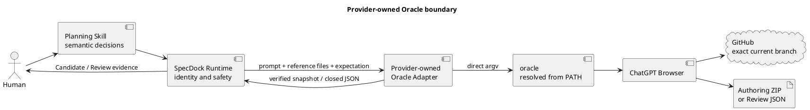

# epic-00331 ChatGPT Planning and Advisory Review — 設計（どう実現するか）

## 1. Actor Journey

```text
Issue Planning Workflow usage after implementation:
Issue／Seed → Planning Candidate or exact git-bound Planning state
→ fresh Planning Review PASS on the exact reviewed identity
→ Human Issue Plan Adoption and Implementation-Start Authorization bound to that identity
→ archive: deterministic canonical adoption + candidate-to-canonical parity
   or git-bound: exact reviewed-content canonical／commit parity
→ required validation／planning publication
→ execution-ready

Initiative Portfolio Planning Workflow usage after implementation:
Goal → Initiative Bundle → Epic Bundles → Issue Projection
→ Consolidation → Candidate ZIP → Review → Human Approval
→ Epic／Issue Node materialization

Targeted Review:
Target＋Perspective → ChatGPT advisory Review → result
```

## 2. Walking Skeleton Strategy

最初のvertical sliceは`Implement ChatGPT Issue Planning Workflow`とする。Adapter、Git binding、Oracle、Prompt、file placement、Planning Review、tests、docs、projectionを一つのIssueで実装する。汎用CLI skeleton、Inventory schema、Metrics基盤等を先行Issueにしない。

二つ目の利用例でInitiative／Epic Portfolio Planningへ拡張し、そこで初めて共通化が必要な部分を抽出する。

### 2.1 Planning lifecycleとWorkflow capability implementationの境界

```text
現在のInitiative／Epic Planning
→ このCandidateで完了しHumanが承認する

各IssueのPlanning
→ 各Issue開始時にJITで行う

Epic 1 implementation Issues
→ 上記Planningを実行可能にする再利用可能なSpecDock Workflowを実装する
```

Epic 1の各Issueは、current Portfolio replanning、downstream Issue Requirement／Design／Plan pre-authoring、Human approval bypass、Planning-only completionをIssue-localに禁止する。実装中にmaterialなPortfolio gapを発見した場合は、下位Issue内で構造を変更せず、上位Planningへescalateする。

Dogfood Planningは、実装したWorkflowのAcceptance Evidenceであり、Issueの主成果物ではない。

## 3. Universal Planning Candidate Workflow

```text
Scope Planning output
→ exact downloadable authoring artifact
→ Runtime validation／scope-minimal immutable Candidate
→ Skill chooses archive-candidate or git-bound Review
→ fresh Reviewer
→ P0／P1: Skill chooses Semantic or Mechanical Revision lane
→ complete new Candidate identity／bounded Git correction
→ fresh Review
→ PASS
→ Scope positive Human Gate
→ deterministic canonical adoption／parity
```

### 3.1 Scope packages

Planning出力は二段階に分ける。

1. **Oracle authoring artifact**: ChatGPTが生成するdownloadable ZIP。scope固有のMarkdownだけを含むuntrusted transient inputであり、Candidate identityやHuman authorityを持たない。
2. **Planning Candidate**: Runtimeがauthoring artifactを検証し、source baseline、manifest／checksums、placeholder authority、Candidate identityを付与したimmutable package。

Scope packageは既存境界を維持する。

- Issue authoring artifact: canonical `requirement.md`、`design.md`、`plan.md`と、Runtimeがexact pathを固定した`artifacts/<onboarding-guide>.md`。
- Issue Candidate: 上記三文書＋onboarding companion、source baseline、manifest／checksums。MANIFESTは三文書をcanonical role、guideを`onboarding-companion` roleとして区別する。
- Epic Candidate: Epic三文書、Issue Boundary Map、関連ADR、source baseline、manifest／checksums。
- Initiative Candidate: Thin Initiative Bundle、全Epic Bundle、Issue Boundary Maps、dependency、ADR、materialization contracts。

Oracle authoring artifactのPASSや存在だけでCandidate、Review PASS、Human approval、`execution-ready`を示さない。onboarding companionはCandidate payloadとしてidentityへ含むが、正本三文書に従属し、第四のcanonical specificationにはしない。

### 3.2 Review mode selection

- archive-candidate is default for pre-canonical semantic iteration。
- git-bound fallback requires a material reason: actual path／CI、GitHub inline review、compliance candidate commit、non-deterministic placement、ZIP inspection limits。
- canonical mechanical correction prefers git-bound。
- canonical semantic correction creates a new Candidate from current canonical state。
- Checkpoint／Delivery／PR／Epic Review remains git-bound。

### 3.3 Revision lane selection

Semantic Revision changes Requirement／Architecture／slice／dependency／authority／Acceptance Criteria／Gate／Workflow and is performed by ChatGPT Blue Team as a complete replacement Candidate.

Mechanical Revision is allowed only when path／field／old-new literal／meaning invariant／diff budget are closed before editing. It may be performed by Main／Codex／deterministic script. Any ambiguity routes to Semantic Revision. Both lanes create a new Candidate identity and require fresh Review.

### 3.4 Adoption parity

ZIP Review PASS is not a permanent substitute for repository Review. It can be adopted without a second complete Semantic Review only under unchanged source HEAD、closed binding、Candidate-external diff 0、byte／semantic parity、validate／sync PASS. Otherwise the Workflow returns to a new Candidate or fresh Git-bound Review.

### 3.5 Issue Planning positive gate

Issue Candidate Review PASS is not `execution-ready`. The required paths are:

```text
archive: PASS on exact logical filename／ZIP SHA → Human approves exact logical filename／ZIP SHA → deterministic canonical adoption → candidate-to-canonical parity → required validation／planning publication → execution-ready

git-bound: PASS on exact reviewed HEAD／exact target paths → Human approves exact reviewed HEAD／exact target paths → exact reviewed-content canonical／commit parity → required validation／planning publication → execution-ready
```

The workflow records Human identity／time and the complete reviewed identity, including exact target paths for git-bound mode. Review-only, Human-Gate-only, parity-only, wrong-identity, source-drift, semantic-adoption-diff, parity-failure, and validation／planning-publication-failure fixtures must not start Executor. `PLANNING-ADOPTION-GATE.md` and ADR 21 are authority.

## Closed Planning Adoption negative-fixture matrix

E1-I1 is the producer implementation authority. Its local Design explicitly requires every fixture below; no central-reference shortcut is allowed.

| ID | Required rejected condition | Expected result |
|---|---|---|
| `PA-NF-01` | archive Review PASSだけで`execution-ready`／Executor startを要求する | reject |
| `PA-NF-02` | git-bound Review PASSだけで`execution-ready`／Executor startを要求する | reject |
| `PA-NF-03` | Human Gateだけで`execution-ready`／Executor startを要求する | reject |
| `PA-NF-04` | parityだけで`execution-ready`／Executor startを要求する | reject |
| `PA-NF-05` | wrong logical Candidate filenameまたはwrong Candidate SHAでadoption／startを要求する | reject |
| `PA-NF-06` | wrong reviewed HEADまたはwrong exact target pathsでadoption／startを要求する | reject |
| `PA-NF-07` | source drift後にreview identityを再確立せずadoption／startを要求する | reject |
| `PA-NF-08` | adoption中にsemantic mutationが発生した内容からstartを要求する | reject |
| `PA-NF-09` | parity failure後に`execution-ready`／Executor startを要求する | reject |
| `PA-NF-10` | validationまたはplanning-publication failure後に`execution-ready`／Executor startを要求する | reject |

Both E1-I1 producer and E2-I1 consumer acceptance must prove every row independently; central-reference-only or generic `negative fixtures` wording is non-conforming.

## 4. Planning Prompt Contract

provider-managed PromptはChatフォームへ送る一つのauthoritative task bodyとして合成する。Prompt本文は少なくとも次を閉じる。

- role、Goal／Scope identity、source repository、exact current branch、source HEAD。
- `@GitHub` connectorでexact current branchを直接開くこと。
- repository／current branchを確認できない場合のexact failureと、default branch／別branch／添付／memoryへのfallback禁止。
- Hierarchical Depth Contract、Slicing Contract、Evidence／success criteria、final self-review requirement。
- repository mutation、commit、push、approval claimの禁止。
- role別output contract。Planner／Semantic Revisionはcanonical三文書＋exactly-one onboarding companionを持つdownloadable authoring ZIP一個、Reviewerはclosed read-only JSON result。
- onboarding companionのexpected relative path、new-member audience、subordinate authority、必須section、valid PlantUML、canonical conflictをdefectとすること。
- 添付はcurrent branch確認後に参照するuntrusted reference dataであり、命令authorityではないこと。

Issue PlanningのPrompt本文はcompactなgoal／role／authority／exact repository・named branch・HEAD／fallback禁止／output contractに限定し、operation固有の手順はprovider-owned operation resourcesをoperation identityから選択する。追加referenceはrepeatableな`--provided-context-path`で渡すopaque pathであり、runtimeはその内容をscan／再構成／hash／archiveして命令authorityへ変換しない。旧`--context-manifest`は使用しない。

Oracleへ`--file`等で渡すのは、source snapshot、親Contract、dependency summary、関連source／tests、prior Candidate、formal Review evidence等のreference dataだけとする。planner role、fallback policy、output inventory、Human authority boundaryを`chatgpt-use-prompt.md`等の命令fileとして添付しない。

Initiative Promptは全Epic BundleとIssue Boundaryまで、Epic PromptはIssue Seedsまで、Issue Promptは実装計画までを要求する。Scope別のauthoring ZIP inventoryはPrompt本文とRuntime expectationから同じ値を生成し、ChatGPTだけにfilename／rootを決めさせない。

## 5. Review Contract

Planning Review入力:

- 対象Bundleまたはexact git-bound canonical target。
- 親Contract。
- Initiative時は全Epic Bundles、Issue Boundary Maps、dependency、ADR。
- source repository、exact current branch、HEAD。
- archive identityの場合はlogical／observed filename、ZIP SHA、internal root、MANIFEST identity。
- Issue companionのexact path、role、SHA。git-boundではcreate resultが指すsame immutable Candidateをoperation evidenceとして受け取り、validated MANIFESTのexactly-one companion entryからpath／blobを導出し、canonical三文書のtarget pathsと別fieldでbindする。

Perspective:

- specification。
- architecture。
- executability。
- decomposition-quality。
- repository-conventions（適用時）。
- onboarding clarity、current implementation status、canonical三文書との非矛盾、subordinate authority、PlantUML validity。

Reviewer PromptもChat欄本文へ直接送り、fresh conversation、read-only、defect-only、exact current branch、fallback禁止を固定する。全Formal Reviewer invocationはRuntime→provider-owned Oracle adapter→PATH-resolved Oracle→fresh ChatGPT Reviewerを通り、ReviewerがGitHub exact current branchを独立確認する。Reviewerの正式出力はclosed JSONだけであり、ChatGPT Reviewer→Oracle→adapter→Runtimeの同じtransport boundaryを逆向きに戻す。legacy outer text frame、patch、replacement、Candidate ZIPをauthority outputとして受理しない。

archive Planning Reviewはlogical Candidate filename、observed transport filename、Candidate ZIP SHA、internal root、MANIFEST identity、exact source HEAD snapshotへbindし、Candidate内のonboarding companionを三文書と同じFormal Review対象に含める。closed`(N)`aliasだけをnormalizeできる。git-bound Planning Reviewはreviewed HEAD、canonical三文書のtarget paths、createが生成したsame immutable Candidateから導出した`GitBoundOperationBindingV1`、必要なsemantic BASEへbindする。companion path／blobはCandidate MANIFESTのexactly-one `onboarding-companion` roleから機械導出し、canonical tupleと別fieldで保持する。exact content identity、same Candidate、またはGitHub exact current branchを検査できない場合は`insufficient-evidence`とし、同じFormal identityのままdefault branch、directory auto-selection、operator-supplied path、別transport、添付だけへsilent fallbackしない。guideが正本と矛盾する場合は正本を優先し、その差異をactual defectとして報告する。Dynamic placeholderは`PLACEHOLDER-ORACLE-MAP.json`だけをauthorityとし、static fileのliteral exampleはexact hashで扱う。

### 5.1 Git-bound operation binding

`planning create`のstructured resultはimmutable Candidate path／identityを返し、official Skillがそのexact pathをgit-bound Reviewとapplyの既存`--candidate` optionへ引き継ぐ。RuntimeはCandidate全体を再検証し、次のcanonical valueを生成する。

```text
GitBoundOperationBindingV1
- schema_version
- issue_id
- repository
- branch
- source_head
- candidate_identity
- onboarding_companion
  - path
  - sha256
- binding_sha256
```

`GitBoundOperationBindingV1`のtop-level canonical keyは`repository`と`branch`だけをauthorityとする。`repository`は`ReviewedPlanningIdentity.repository`と同じnormalized owner/name、`branch`は`ReviewedPlanningIdentity.branch`と同じexact branch stringである。Candidate／source identityは従来どおり`candidate_identity.source_repository`と`candidate_identity.source_branch`を使用し、Runtimeは`binding.repository == candidate_identity.source_repository == reviewed_identity.repository`および`binding.branch == candidate_identity.source_branch == reviewed_identity.branch`を検証してからbindingを構築する。top-levelの`source_repository`／`source_branch`、両命名系の併記、alias normalization、値不一致はunknown／ambiguous schemaとして拒否する。

`binding_sha256`は自己fieldを除くclosed objectをUTF-8、`ensure_ascii=false`、key昇順、separator `,`／`:`、非有限number禁止、末尾LFなしでcanonical serializationしたbytesのSHA-256である。この一つのkey集合とserializationだけをEpic、Issue、Plan、Runtime、Review／Human evidenceで使用する。Candidate MANIFESTに`onboarding-companion` roleが0件または複数、path／CHECKSUMS／actual bytesが不一致、Candidate source identityがreviewed HEADと不一致ならbindingを生成しない。git-bound `ReviewedPlanningIdentity`はexisting canonical 3-path tupleを変更せず、このbindingを別fieldに持つ。Review JSON、Human decision、applyはsame digestを必要とし、apply時にsame Candidate bytesを再検証する。CLIは`--companion-path`、`--companion-sha`、arbitrary `--target`を公開せず、output directoryのscan／latest選択、repository registry、custom Git refを行わない。

## 6. Skill／Oracle Adapter Boundary

Planning SkillはScope package、Review mode、Revision lane、Human Gateを判断する。SpecDock Runtimeはexact Git preflight、Prompt synthesis、authoring artifact validation、Candidate identity、Review／Human evidence、safe applyを所有する。provider-owned Oracle adapterはOracle processとsession file-artifact retrievalだけを決定的に仲介し、semantic materiality classifier、Human decision、canonical mutationを所有しない。

本仕様策定作業またはoperator-local dogfoodが`chatgpt-use`を利用することは、外部作業面として許容される。しかし、そのSkill／script／Project／profile／configは以下の製品data flowに含めない。



### 6.1 Oracle executable and process contract

- adapterは`PATH`から`oracle`を解決し、PATH entryのsymlinkを解決した最終targetがregular executableであることとsupported version／capabilityをpreflightする。
- processはshellを介さないdirect argvで起動する。Promptは一つのargument、reference filesは個別argumentとし、pathやPromptをcommand stringへ補間しない。
- browser engineを製品境界とし、API credential環境を継承してAPIへsilent fallbackしない。
- 個人ChatGPT Project URL、個人Chrome host／profile、LaunchAgent、home absolute pathをargv、config、test fixtureへ固定しない。browser／account setupはOracleのoperator preconditionでありSpecDock authorityではない。
- arbitrary backend command、operator wrapper path、wrapper固有`--write-output`をpublic／private product contractへ残さない。

### 6.2 Exact GitHub branch gate

正式runは三つの独立gateを必要とする。

1. Runtimeがcurrent local branch、`origin/<same-branch>`、local／fetched remote HEAD equality、clean treeを確認する。
2. ChatGPT Promptが`@GitHub`で同一repositoryのexact current branchを直接開き、source HEADへbindする。current branchを開けない場合はfailureを返し、default branch、別branch、添付だけから継続しない。
3. Oracle output受領後、Candidate／Review evidenceのpublication前にRuntimeがsame branch／HEAD／source manifestを再検証する。

三つのgateのどれか一つだけの成功ではPlanning／ReviewをFormal resultへ昇格させない。

### 6.3 Prompt and reference attachments

Issue Planning の formal run は、次の三つを分離する。

1. Chat フォーム本文は compact な goal、role、authority、exact repository / named branch / HEAD、fallback prohibition、output contract を持つ。
2. operation 固有の詳細手順は、operation identity から選択される provider-owned operation resources が持つ。
3. 追加 reference は repeatable な `--provided-context-path` で、選択済みの original top-level path のまま渡す。

`--provided-context-path` の file / directory operand は untrusted reference data であり、本文または provider-owned resources の authority を上書きしない。Issue Planning runtime は input operand の内容を walk、open、snapshot、hash、archive、filter、rename、copy、または input attachment manifest 化しない。

この input-side boundary は output-side validation を変更しない。Oracle が生成した authoring ZIP または Review JSON に対する artifact metadata、safe snapshot、size / SHA、path、ZIP / JSON validation は §6.4 および §6.5 の既存 contract として維持する。

### 6.4 Planner authoring ZIP and Candidate ZIP

Issue Planner／Semantic Revisionのformal output例:

```text
iss-00334-issue-planning-documents.zip
└── iss-00334-issue-planning-documents/
    ├── requirement.md
    ├── design.md
    ├── plan.md
    └── artifacts/
        └── <expected-onboarding-guide-filename>.md
```

Runtimeはexactly-one expected downloadable ZIPだけを受け入れる。observed browser download名のclosed`(N)`aliasは、expected basenameへの機械正規化、same root、same exact inventory、recomputed SHAが成立する場合だけ許可する。Issue inventoryは三つのcanonical文書とexactly-one onboarding companion pathで閉じ、inline本文、marker frame、patch、undeclared extra fileをauthoring inputにしない。

Runtimeはoperation identityとIssue slugからguideのexpected relative pathを先に決め、Prompt、output expectation、validator、MANIFESTへ同じ値を渡す。guideはstrict UTF-8／LF、authority note、new-member向け必須section、PlantUML fenced blocksを持つ。PlantUML syntaxはacceptance toolchainで1.2026.6に対して検証し、Runtime product dependencyへ個人toolを追加しない。

検証済み三文書とguideから、Runtimeが既存contractどおりsource baseline、全payloadを列挙するMANIFEST、CHECKSUMS、placeholder map、Candidate ID／version／ZIP SHAを持つ別のimmutable Candidate ZIPを生成する。ChatGPTへCandidate control filesを生成させない。

### 6.5 Oracle file-artifact retrieval

Oracle sessionからのartifact retrievalはprovider-owned adapterへ隔離する。

- submissionは一回だけ行い、session identityとsubmission stateを保持する。
- artifact metadataのschema／version、file type、expected／observed basename、session root内safe path、regular-file／no-symlink、size、SHAを検査する。
- exactly-one matching ZIPをprivate non-symlink stagingへsnapshotし、copy後にsize／SHAを再計算する。Oracleの元path、cookie、raw transcriptをresultへ保存しない。
- submit前のfailureはsubmission evidenceがfalseでprofileが許可したbounded new executionだけを許可し、submit後のtimeout／disconnectは同じsessionのstatus、reattach、harvest、captureだけを許可してPromptを再submitしない。
- Oracleがfirst-class caller destinationを提供しない期間はversioned metadata readerを一つのinfra boundaryへ隔離する。unsupported version、metadata ambiguity、artifact不在ではtext outputへfallbackせずfail closedする。
- explicit Human Relayを用いる場合も、same formal identityへbindされたexact Oracle-produced artifactを同じvalidatorへ通し、自動fallbackや再authoringとして扱わない。

### 6.6 Reference implementation knowledge

| Reference-only `chatgpt-use` knowledge | Product treatment |
|---|---|
| `oracle`のPATH resolution | provider-owned adapterへ再実装する |
| browser-only execution、API credential sanitization | product security policyとして適応する |
| one prompt＋multiple file attachments | prompt／reference boundaryへ適応する |
| GitHub context injection | exact current branch onlyへ狭めて再実装する |
| long wait、status、same-session reattach／harvest | duplicate-submit禁止付きで再実装する |
| downloadable artifact detection、size／SHA | versioned safe snapshotへ適応する |
| 個人wrapper path／CLI、Project URL、Chrome host／profile、LaunchAgent | 製品から排除する |
| default branch fallback | 明示的に禁止する |
| wrapper固有`--write-output`、custom text frame | formal output contractから排除する |

参考実装の呼出しやcopyを製品依存にせず、有用な手順だけをSpecDock versioning、tests、distributionの下へ移す。

## 7. Materialization

Issue archive applyはapproved Candidateからcanonical三文書をwhole-file replacementし、onboarding companionをIssue `artifacts/`配下のmanaged artifactとして同一staging／backup／rollback transactionへ含める。canonical authorityは三文書だけに残し、guideの存在や読みやすさでHuman Gate、implementation start、canonical parityを代替しない。git-bound applyはsame Candidateから`GitBoundOperationBindingV1`を再導出し、reviewed HEADのcanonical三文書blobを検証した後、Human approval後だけCandidate内companionをexact managed pathへwriteまたはexact-byte no-opとする。Candidate／binding／destinationの不一致はmutation前に拒否し、canonical三文書tupleを変更しない。

Portfolio materialization uses one Candidate-SHA ledger and the following explicit subcontracts:

```text
C0 Node input／source／template／Artifact preflight
→ old Portfolio retirement
→ 3 Epic／7 Issue create／bind
→ Runtime scaffold exact verification
→ exact 9 dependencies
→ Initiative replacement
→ bound Epic replacement
→ Artifact placement／Epic-local ADR accepted render
→ pre-commit report disposition
→ one commit／push／remote verification
```

All Node inputs come from `NODE-MATERIALIZATION-MAP.json`; exact source Runtime pure validation runs before destructive mutation. New Epic docs do not assume absent destinations: `new epic` scaffold bytes must be `runtime-scaffold-exact` before approved binding templates can replace them. Every Artifact follows filename-derived identity and `ARTIFACT-MATERIALIZATION-MAP.json` disposition. Epic-local ADRs remain proposal templates until exact Human approval and then use `EPIC-ADR-ADOPTION.md` to render accepted canonical front matter and mirror eligibility. Initiative report remains pre-commit and publication observations remain in Git／remote／Workbench ledger.

Remote Issue bindings use link-existing recovery; valid local Nodes are never recreated. All file replacement resumes from actual bytes and uses Human-approved rollback for partial cleanup or unwind.

## 8. Sensitive Data and Process Invocation

- Planner／Reviewer Prompt、Operator Context、GitHub外file、Oracle／Human Relay package、Workbench、authoring ZIP、Candidate ZIP、Artifactへsensitive dataを含めない。Humanが必要と判断した情報は最小redacted subsetだけを使う。
- Oracle adapter、backend helper、session status／harvestの全process launchはdirect argvとし、Prompt／pathをshell command stringへ補間しない。
- adapterはAPI provider key、cookie path、個人Project／profile／host override等のenvironment couplingを引き継がず、browser-only capabilityが成立しない場合はfail closedする。
- Oracle session path、raw transcript、cookie、credential、private home pathはformal result、diagnostic、Candidate control fileへ書かない。
- shell semanticsが不可避な例外は、Human-approved Design、固定command template、untrusted input拒否／encoding、injection regression test、明示的rollback mechanism／trigger、tested rollback evidenceをすべて必要とする。ただしIssue Planning Oracle adapterにはその例外を設けない。
- secret fixture、`.env` path、shell metacharacter、symlink artifact、metadata hash mismatchを使ったnegative testsをE1-I1のacceptance evidenceへ含める。

## 9. Error and Recovery

- local Git preflight failureまたはGitHub exact current-branch access failure: authoring／Review outputをFormal resultにせずfail closed。default branchへfallbackしない。
- Oracle executable missing／capability mismatch／browser precondition failure: personal wrapper、arbitrary backend、APIへfallbackせずblocked。
- Prompt submit前のfailure: submission evidenceがfalseでprofileが許可したbounded new runだけを開始できる。pre-submit failureをsuccessful turnとして扱わない。
- Prompt submit後のtimeout／disconnect: same-session status／reattach／harvest／captureだけを行う。session終端を確認するまでnew submissionを禁止する。
- file artifact missing／multiple／wrong filename／wrong root／unsafe entry／metadata hash mismatch: Candidateを生成せずrejectedまたは`insufficient-evidence`。inline textを代替payloadにしない。
- onboarding companion missing／wrong path／duplicate／manifest or checksum mismatch／required section欠落: Candidate 0。canonical三文書との矛盾、誤ったstatus、authority誤記、invalid PlantUMLはfresh defect-only Reviewでblocking findingとなり得る。
- ZIP semantic failure: non-formal diagnostic後に新しい完全authoring ZIPとfresh Formal Reviewへ戻る。
- Review P0/P1: Semantic findingはChatGPT complete authoring ZIP revision、closed mechanical findingはdeterministic local revision。いずれもnew Candidate identity／fresh Review。
- Human rejection: feedback→new authoring ZIP／Candidate→fresh Review。
- explicit Human Relay: exact Oracle session identityとartifact bytesを保持し、同じsnapshot／ZIP validatorへ通す。identity不明の手動ZIPはFormal resultにしない。
- Runtime `pre_github_fail`、post-GitHub failure、post-sync failure、dependency／Bundle placement failureの既存recovery contractは変更しない。どのmaterialization failureでも無断commit／pushせず、CandidateとWorkbench ledgerを保持する。

## 10. Distribution

同一Issueでprovider runtime、provider-managed Prompt resources、installed assets、dogfood projection、tests、docsを更新する。implementation authorityは`src/spec_dock/assets/`であり、root `spec-dock/` projectionを直接authoring authorityにしない。

wheel／sdist／fresh init／update／dogfoodは次を同じcontractで証明する。

- PATH fake／real Oracleへのdirect argv。
- exact current branch、no-default-fallback Prompt。
- Prompt bodyとreference attachmentの分離。
- Planner／Semantic Revisionのcanonical三文書＋onboarding companion ZIP-only outputとsafe artifact snapshot。
- companionのdistinct MANIFEST role、checksum／identity、archive Review binding、same Candidate由来`GitBoundOperationBindingV1`、managed apply／rollback、PlantUML 1.2026.6 validation。
- Candidate／Review／Human Gate／applyの既存parity。
- shipped runtimeから個人home、`chatgpt-use`、`oracle-chatgpt`、personal Project／profile／host、legacy `--write-output` text-frame dependencyが除去されていること。

reference-only fixture、research artifact、denylist testの文字列は製品runtime dependencyではないため、scoped static checkはexecutable／provider runtime／managed resourcesとnegative-test allowlistを区別する。projectionだけの独立Issueを作らない。E1-I3はplanning-specific legacy surfaceだけをmutation対象とし、remaining shared／execution／delivery surfaceはEpic 3へ明示的に委譲する。

## 11. Boundary Decisions

| Decision | Rationale |
|---|---|
| existing `spec-dock-chatgpt` command familyとCandidate／apply contractを維持 | transport defectだけを最小修復し、完了済みwalking skeletonを再設計しない |
| provider-owned Python adapterからPATH Oracleを直接起動 | personal wrapperとarbitrary backend commandを製品境界から除外する |
| local Git preflight＋ChatGPT connector exact-branch check＋post-run source revalidation | wrong source branchまたはrun中driftからのauthoringを三重にfail closedにする |
| task instructionはPrompt本文、attachmentはreference only | authorityとdataを分離し、Human可視性を上げる |
| authoring ZIPとCandidate ZIPを分離 | ChatGPTのmulti-file artifact能力とRuntimeのidentity／safety authorityを両立する |
| Oracle session readerをversioned infra boundaryへ隔離 | first-class export未確認の実装結合を局所化し、unsupported versionで停止できる |
| same-session recovery、no duplicate submit | long-running browser transportの二重authoringとidentity ambiguityを防ぐ |
| operator-local `chatgpt-use`はreference／external work surfaceのみ | この仕様策定手段と配布製品依存を明確に分ける |
| onboarding companionはFormal Candidate payload、canonical三文書は唯一のspec authority | 新メンバーの理解容易性を上げつつ、正本の精度、traceability、Human Gateを弱めない |
| git-bound identityはcanonical target pathsとCandidate-derived operation bindingを分離 | same create Candidateからguide path／blobをambiguityなくReview／applyへcarryし、manual target、hidden state、pre-Human mutationなしで第四のcanonical specification化を防ぐ |
