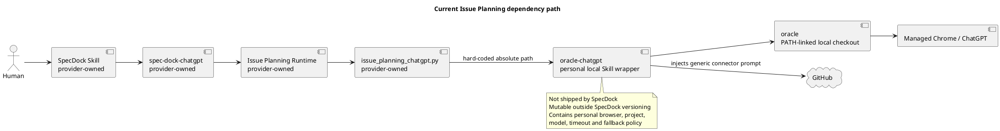
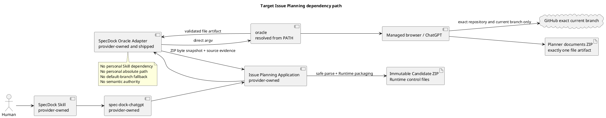
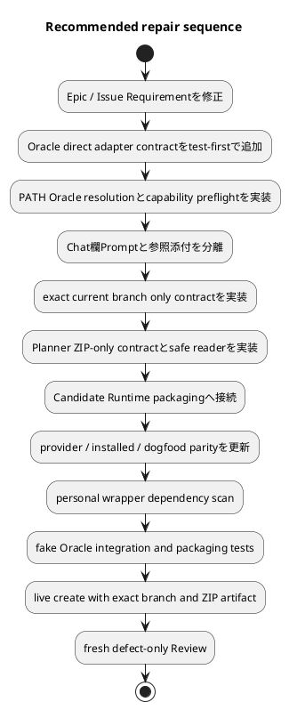

# Issue PlanningのOracle依存境界 — 現状と理想状態

## 1. 結論

現在のIssue Planning実装には、SpecDockの配布Runtimeが個人所有のローカルSkill
`chatgpt-use`の絶対パスへ直接依存する重大な製品境界違反がある。

```text
/Users/iwasawayuuta/.agents/skills/chatgpt-use/scripts/oracle-chatgpt
```

この依存は単なる開発環境の設定ではない。provider source、dogfood projection、unit test、
integration testがこのパスとwrapper固有の`--write-output`契約を正式な実行経路として固定している。
そのため、別ユーザー、fresh install、wheel／sdistから導入したconsumer repositoryでは、
同じWorkflowを再現できない。

理想状態は次のとおりである。

1. SpecDockの外部実行依存は、`PATH`で解決されるローカルOracle本体の`oracle` commandだけとする。
2. SpecDockがprovider-ownedのOracle adapter／wrapperを配布する。
3. adapterはOracleをdirect argvで起動し、個人Skill、個人絶対パス、個人ChatGPT Project、
   wrapper固有のGitHub fallback policyへ依存しない。
4. GitHub repositoryとexact current branchを必須参照する命令、fallback禁止、ZIP-only出力契約は、
   SpecDockがChat欄へ直接入力するPrompt本文として所有する。
5. 添付ファイルは参照情報だけとし、命令templateを添付して実行させない。
6. Plannerの正式出力は、三文書を所定のdirectory構造で収録したdownloadable ZIP一個だけとする。
7. Oracleが保存したfile artifactをSpecDock adapterが安全にsnapshotし、Runtimeが検証して
   immutable Candidate ZIPとcontrol filesを生成する。

## 2. 調査範囲と方法

調査はcurrent branch
`iss-00334-implement-chatgpt-issue-planning-workflow`のHEAD
`079f7e8df79b2fb8d3401340a96dc147868db7dd`を対象に行った。

確認対象:

- provider authority:
  `src/spec_dock/assets/spec_dock/scripts/spec_dock_runtime/`
- installed assets:
  `src/spec_dock/assets/install_root/`
- dogfood projection:
  `spec-dock/scripts/spec_dock_runtime/`
- Issue Planning unit／integration tests
- active Initiative／Epic／IssueのRequirement／Design
- 過去のlocal-wrapper非依存要件とquality-gate evidence
- PATH上のOracle本体とOracle 0.16.1 source
- 個人所有`chatgpt-use` wrapperは実装案ではなく、現行挙動の参考資料としてread-only確認

調査はrepository source、Git history、test assertions、installed CLIの実測を根拠とした。
外部モデルの推測は根拠に使用していない。

## 3. 現在の状態

### 3.1 現在の実行経路



実行時の主要経路:

1. `spec-dock-issue-planning` Skillがrepo-local `spec-dock-chatgpt`を呼ぶ。
2. Runtimeの`invoke_issue_planning_chatgpt()`が一時Prompt packを生成する。
3. adapterは`_FIXED_CHATGPT_USE`へ個人絶対パスを設定する。
4. generic backend invocationへ、そのwrapperと`--write-output <temp-file>`を渡す。
5. `chatgpt-use` wrapperがOracleのbrowser mode、model、Chrome endpoint、profile、
   ChatGPT Project URL、timeouts、GitHub connector Promptを独自に追加する。
6. OracleがChatGPTを操作する。
7. Runtimeは最終assistant text fileから独自response frameをparseする。

### 3.2 確認した直接依存

| Surface | 現在の事実 | 影響 |
|---|---|---|
| provider runtime | `infra/issue_planning_chatgpt.py`が`_FIXED_CHATGPT_USE = "/Users/.../oracle-chatgpt"`を保持 | product codeが個人homeへ依存 |
| dogfood projection | 同じ絶対パスをbyte-equivalentに保持 | dogfood成功がportable installを証明しない |
| unit test | `_FIXED_CHATGPT_USE`がargv先頭であることをassert | 欠陥がregression contract化 |
| integration test | wrapper固有`--write-output`をassert | Oracle本体のcontractではなく個人wrapperのcontractを固定 |
| Git history | hard-codeはcommit `796a1ce4`で導入 | 意図的なS02 transport実装として入った |
| current HEAD | output分離修正`079f7e8d`後も依存は残存 | text capture不具合修正では根本境界を解消しない |

### 3.3 個人wrapperから暗黙に継承しているpolicy

現在のSpecDock Runtimeは、自身のsourceやversioned configではなく、個人wrapperの現在内容から
次の挙動を暗黙継承する。

- `oracle`のPATH解決。
- `--engine browser`固定とAPI key環境の除去。
- default modelとして`Pro`を指定。
- 個人用ChatGPT Project URL。
- `127.0.0.1:9223`のmanaged Chrome。
- 個人home配下のChrome profile。
- attachment upload policy。
- 120分waitとauto-reattach policy。
- conversation archive policy。
- GitHub repository、current branch、default branchをPromptへ自動注入。
- current branchを開けない場合にdefault branchへfallbackする指示。
- wrapper独自preflightとLaunchAgent依存。

これらは一部が有用であっても、SpecDockのRequirement、Design、配布version、test contractから独立して
変更できる。したがって、同じSpecDock commitでも実行結果が個人wrapperのlocal revisionにより変わる。

### 3.4 Promptの命令／参照データ境界

現状では、Chat欄へ直接入力する本文は次の短い指示だけである。

```text
Use only the attached Issue Planning transport pack.
```

実際のPlanner／Reviewer role、Git identity、出力frame、文書形式の指示は
`chatgpt-use-prompt.md`や`expected-output-contract.md`として添付される。

この構造には次の問題がある。

- 命令と参照データのauthorityが添付内で混在する。
- ChatGPTが添付を「参照資料」として処理し、出力契約を十分強く守らない可能性がある。
- generic wrapperがChat欄へ追加するGitHub fallback指示が、添付内のsource identityより先に効く。
- 実行画面をHumanが見ても、重要なbranch／output contractをChat欄だけでは確認できない。

### 3.5 出力形式の問題

現在のPlanner出力は、一つのassistant text response内に三文書をmarkerで連結したpayloadである。

```text
outer response frame
  ├── requirement.md marker + full body
  ├── design.md marker + full body
  └── plan.md marker + full body
```

この形式は次の制約を持つ。

- 三文書全体がassistant text token limitの影響を受ける。
- 複数ファイルを一つの長いtextへ直列化する。
- ChatGPTが得意とするdownloadable file artifactを使わない。
- 一文書のtruncationが全体frameをpartialにする。
- Humanが取得、展開、比較しにくい。
- Oracleが既に備えるfile artifact保存機能を利用していない。

### 3.6 既存要件との矛盾

過去の正式Issue
`iss-00304-add-chatgpt-authoring-skill-and-update-planning-skills`
には、次の明示要件がある。

```text
BH-007: local wrapper path is not product dependency
```

同Issueは、個人`oracle-chatgpt`をoperator-configurable exampleに限定し、
shipped workflowへuser-specific pathをhard-codeしないことを要求していた。

続く`iss-00307-final-quality-gate-and-mergeable-pr-delivery`では、
local wrapper hard-codeが存在しないことを`rg`で確認し、PASS evidenceとして記録していた。

今回の`iss-00334`実装は、この既存の製品境界を再導入した回帰である。
active Epic RequirementはOracle invocationの責務を記載しているが、
「Oracle本体だけに依存し、個人Skill／wrapperへ依存しない」というclosed requirementを持っていなかった。
この欠落により、過去の制約がwalking skeleton実装へ継承されなかった。

## 4. 問題の分類

| ID | 深刻度 | 問題 | 具体的影響 |
|---|---|---|---|
| F-001 | Critical | 個人絶対パスがprovider runtimeにhard-code | fresh installと別userで起動不能 |
| F-002 | Critical | product behaviorがSpecDock外のmutable wrapperに依存 | SpecDock commitと実行挙動が一意に対応しない |
| F-003 | High | current branch失敗時のdefault branch fallbackを継承 | 誤ったsourceから仕様書を生成し得る |
| F-004 | High | 命令templateをChat欄でなく添付へ置く | branch／output contractの遵守が弱く、Human可視性も低い |
| F-005 | High | Planner outputが単一text frame | token limit、partial output、複数文書取扱いの問題 |
| F-006 | High | testsが個人wrapper依存をpositive contract化 | 欠陥除去がtest failureになる |
| F-007 | Medium | provider／dogfood parityが同じ欠陥の複製に留まる | parityがportabilityを証明しない |
| F-008 | Medium | Oracle artifact出力のcaller-controlled受け渡しcontractが未定義 | session storage実装へ不用意に結合する危険 |

## 5. Oracle本体の現状能力

調査時点のPATH解決:

```text
command: /opt/homebrew/bin/oracle
realpath: /Volumes/990p2t/workspace/tools/oracle/dist/bin/oracle-cli.js
version: 0.16.1
source HEAD: 6009d4ad167b4f09c050ad22f19de5dfaf71504a
```

Oracle 0.16.1は、Issue Planningに必要な主要能力を既に持つ。

- ChatGPT browser engine。
- Prompt本文と複数file attachment。
- explicit model／ChatGPT URL／browser policy。
- long wait、session storage、same-conversation reattach／harvest。
- assistant textをcaller pathへ保存する`--write-output`。
- ChatGPT response内のdownloadable filesの検出。
- sandbox URL、ChatGPT file endpoint、download buttonからのfile保存。
- ZIP validation metadata、size、SHA-256を含むsession artifact。
- transcriptとdownloadable file artifactのtype分離。

ただし、一般file artifactをcaller指定pathへ直接copyする公開CLI optionは確認できなかった。
現在はOracle session metadataとsession artifact directoryに保存される。

したがって、SpecDock側には次のいずれかが必要である。

1. Oracleへ、exactly-one file artifactをcaller-controlled pathへatomic publishする
   first-class optionを追加し、そのcontractを利用する。
2. SpecDock provider-owned adapterが、version確認済みOracle session metadata contractから
   exactly-one ZIPを安全にsnapshotする。

長期的には1を推奨する。2を先に実装する場合も、Oracle-specific処理を一つのinfra adapterへ隔離し、
version／schema／path／symlink／size／SHA／ZIP inventoryをfail closedで検証する必要がある。

## 6. 理想状態

### 6.1 依存方向



許可する依存:

```text
SpecDock provider-owned adapter
  -> PATH-resolved oracle executable
  -> Oracle public CLI / artifact contract
  -> ChatGPT / GitHub connector
```

禁止する依存:

```text
SpecDock
  -X-> ~/.agents/skills/chatgpt-use/**
  -X-> ~/.codex/skills/**
  -X-> /Users/<name>/**
  -X-> personal ChatGPT Project URL hard-code
  -X-> personal LaunchAgent／Chrome profile hard-code
  -X-> default branch fallback
  -X-> arbitrary operator backend command
```

### 6.2 Provider-owned Oracle adapter

推奨する配布surface:

```text
src/spec_dock/assets/spec_dock/scripts/spec-dock-oracle-chatgpt
src/spec_dock/assets/spec_dock/scripts/spec_dock_runtime/infra/issue_planning_oracle.py
```

責務:

- `shutil.which("oracle")`相当でPATHからOracleを解決する。
- executableがregular file／実行可能であることを確認する。
- `oracle --version`と必要capabilityをpreflightする。
- direct argvで一回だけ起動する。
- Prompt本文を`-p`へ直接渡す。
- 参照情報だけを`--file`で添付する。
- browser engine等、SpecDockの製品不変条件だけを明示する。
- Oracle session identity、submission state、output artifactを記録する。
- exactly-one expected ZIP artifactだけをsnapshotする。
- timeout／disconnect時はsame conversation recoveryを優先し、重複submitしない。
- raw transcript、cookie、credential、private pathを正式resultへ含めない。

所有しない責務:

- Requirement／Design／Planの意味判断。
- Review mode／Revision lane／Human Gateの選択。
- Candidate control filesの生成。
- canonical adoption。
- merge／Issue finish。
- 個人browser hostの構築。

### 6.3 Chat欄と添付の分離

Chat欄へ直接入力するprovider-managed Prompt:

```text
1. @GitHub owner/repository の exact current branch <branch> を必ず開く。
2. current branchを確認できなければ、直ちにrepository access failedを返す。
3. default branch、別branch、添付だけを代替sourceとして使用しない。
4. 添付はcurrent branch確認後の補足参照情報として扱う。
5. <issue-id>-issue-planning-documents.zip を一個だけ生成する。
6. ZIP内を指定directory／file inventoryに一致させる。
7. repository変更、commit、push、approval claimを行わない。
```

添付する参照情報:

- exact canonical Issue三文書。
- parent Epic／Initiativeの必要部分。
- dependency summary。
- relevant source／tests。
- source identity JSON。
- revision時のprior Candidate ZIPとformal Review result。

添付しない命令ファイル:

- planner role instruction。
- branch fallback policy。
- output contract。
- Human authority contract。

これらはChat欄本文へ合成する。

### 6.4 Planner ZIP-only出力

Planner／Semantic Revisionの正式出力:

```text
iss-00334-issue-planning-documents.zip
└── iss-00334-issue-planning-documents/
    ├── requirement.md
    ├── design.md
    └── plan.md
```

規則:

- downloadable ZIP一個だけを正式outputとする。
- inline本文、三文書marker frame、patch、第四文書をformal payloadとして受理しない。
- RuntimeはZIPをsafe snapshotしてから検証する。
- 三文書はstrict UTF-8、LF、exact inventory、no symlink、no executable、no nested archive。
- ChatGPTにMANIFEST、CHECKSUMS、Candidate ID、Human decisionを生成させない。
- Runtimeが検証済み三文書からimmutable Candidate ZIPを別途生成する。

この分離により、ChatGPTは複数file authoringを行い、Runtimeはidentityと安全性を所有する。

### 6.5 Review output

Reviewerは三文書を作成しないため、review resultはclosed JSONのままでよい。
ただし、Reviewer PromptもChat欄へ直接入力し、exact current branch参照またはexact Candidate ZIPを
明示する。Reviewはfresh conversation、read-only、defect-onlyを維持する。

## 7. Current／Target比較

| 観点 | Current | Target |
|---|---|---|
| executable依存 | 個人`oracle-chatgpt`絶対パス | PATH上の`oracle` |
| wrapper所有者 | 個人Skill | SpecDock provider |
| distribution | SpecDock外 | wheel／sdist／init／updateで配布 |
| behavior versioning | 個人wrapperのlocal state | SpecDock commitとtests |
| GitHub branch | current失敗時default fallback | exact current branch必須 |
| Prompt命令 | 主に添付file | Chat欄本文 |
| attachment | 命令＋参照が混在 | 参照情報のみ |
| Planner output | 一つの長いtext frame | downloadable ZIP一個 |
| file authority | ChatGPT text parse | Runtime safe ZIP parse |
| Candidate controls | Runtime生成 | Runtime生成を維持 |
| artifact retrieval | `--write-output` text | Oracle file artifact snapshot |
| portability test | 同じhard-codeのparity | personal-path absence＋fake Oracle PATH fixture |

## 8. 要件修正の必要性

active Epic RequirementにはOracle invocationとwrapper責務の記述はあるが、
dependency allowlist／denylistがない。次のEpic-level requirementを追加する必要がある。

```text
SpecDockのPlanning／Review Workflowが外部実行依存として許可するのは、
PATHで解決されたOracle本体だけとする。SpecDockはprovider-owned adapterを配布し、
個人Skill、個人wrapper、user-specific absolute path、個人ChatGPT Project／browser profileを
製品依存として参照してはならない。
```

対応Acceptance Criteria:

```text
provider／wheel／sdist／fresh init／update／dogfoodで、
fake PATH Oracleによる同一contractが成立すること。
shipped sourceとtestsのscoped scanで個人path／chatgpt-use wrapper依存が0件であること。
```

Issue Requirementも、`provider-managed PromptとChatGPT Use`を
`provider-managed Promptとprovider-owned Oracle adapter`へ修正し、
walking skeletonがEpic requirementを具体化する必要がある。

## 9. 推奨実装順



優先順位:

1. 個人wrapper hard-codeを除去する。
2. product-owned Oracle adapterを作る。
3. exact current branch、Chat欄命令、ZIP-only outputを一つのtransport contractとして実装する。
4. testsをpersonal wrapper positive assertionからOracle direct contractへ置換する。
5. live dogfoodをやり直す。

現在のlive create結果は、旧transport contractと個人wrapper policyで実行されたため、
新contractのAcceptance Evidenceには使用しない。

## 10. 必須テスト観点

### Oracle dependency boundary

- PATHに`oracle`がない場合は`backend_unavailable`。
- PATHのfake `oracle`がexact argvを記録し、一回だけ起動される。
- `/Users/`、`.agents/skills/chatgpt-use`、`oracle-chatgpt`がshipped product surfaceに0件。
- wrapper／arbitrary backend envへのsilent fallback 0。
- wheel／sdist／fresh init／updateにprovider-owned adapterが含まれる。

### GitHub identity

- exact repository／current branch／HEADがChat欄Promptに含まれる。
- default branch名とfallback文言がIssue Planning Promptに含まれない。
- current branch connector access failureでoutput 0。
- attached contextだけで継続しない。

### Prompt／attachment separation

- Chat欄Promptにrole、authority、branch、ZIP inventoryが含まれる。
- attachment inventoryは参照dataだけ。
- instruction template fileがOracle `--file`へ渡らない。

### ZIP output

- exactly-one expected downloadable ZIPで成功。
- no ZIP、2 ZIP、wrong filename、wrong root、missing document、extra fileで失敗。
- symlink、path traversal、absolute path、nested archive、executable、binary、oversizeで失敗。
- Oracle metadataのsize／SHAと実bytes不一致で失敗。
- inline text frameだけではCandidateを作らない。
- Runtime生成CandidateのMANIFEST／CHECKSUMS／source bindingが維持される。

### Recovery

- prompt submitted後のtimeout／disconnectではnew submission 0。
- same conversation harvestでZIP artifactを回収できる。
- terminal unrecoverable確定前のretry 0。

## 11. 判断

現行の個人`chatgpt-use` wrapper依存は採用不可であり、単なるconfig修正では足りない。
`iss-00334`のS02 transport boundaryへ戻り、Oracle direct adapter、Prompt入力境界、
ZIP artifact出力を一つのbounded repairとして実装する必要がある。

個人wrapperは、browser-only、model selection、managed Chrome、long wait、reattach、
GitHub connector injection、artifact保存などの運用知見を得るための参考実装として有用である。
ただし、そのpath、script、local policy、personal project／profileはSpecDockの依存先にしない。

本レポートは現状調査とtarget architectureの提案であり、それ自体はcanonical Design採用、
実装完了、Review PASS、Human Gateを意味しない。
