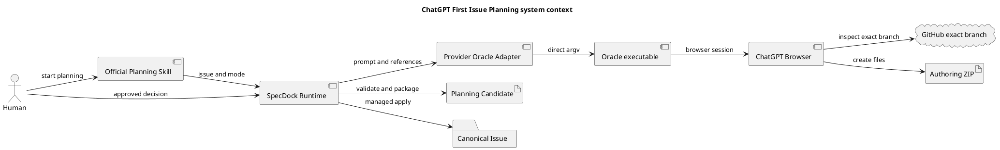
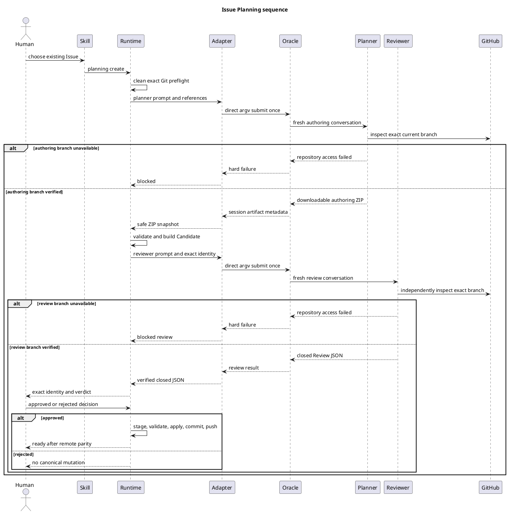
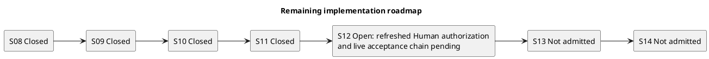

# 新メンバー向け ChatGPT First Issue Planning ガイド

> **最初に読むべき権限注記**
>
> このガイドは、`init-00322`、`epic-00331`、`iss-00334`を短時間で理解するための補助資料です。正式な仕様上の正本は各Nodeの`requirement.md`、`design.md`、`plan.md`です。このガイドは第四のcanonical specificationではなく、正本を置換・要約して権限を奪うものでもありません。内容が正本と矛盾する場合は正本が優先され、その矛盾自体をReview defectとして扱います。

## 1. 今日参加した人が最初に押さえる結論

**目的**は、ChatGPTを「repositoryを直接変更する自動実装者」ではなく、**高品質なPlanning Candidateとread-only Reviewを生成する認知サービス**として使い、Git、identity、archive safety、Human approval、canonical applyをSpecDock Runtimeの決定的な境界に残すことです。

現在の対象は次の三階層です。

| 階層 | ID | 役割 |
|---|---|---|
| Initiative | `init-00322` | ChatGPT First Intelligence Architecture全体。認知作業をChatGPTへ寄せつつ、Human authorityとdeterministic Runtimeを維持する。 |
| Epic | `epic-00331` | Planningとadvisory Reviewの製品能力。Issue／Epic／Initiative Candidate、Review、Human Gate、materializationの共通境界を定義する。 |
| Issue | `iss-00334` | 最初のwalking skeleton。既存Issueを対象にcreate→revise→review→Human Gate→applyを一つのvertical sliceで実装する。 |

このガイドのstatus reconciliation source/review baselineは、repository `chemitaro/spec-dock`、branch `iss-00334-implement-chatgpt-issue-planning-workflow`、HEAD `bb65257155a73b621b0d0b6fb3426393c46de712`です。これはWU-1修正入力のidentityであり、修正後のcurrent HEADを主張するものではありません。Formal Planningでは別branch、default branch、添付だけ、memoryだけから同じ結果を作ってはいけません。

## 2. System context



システムの中心は、ChatGPTの出力をそのまま正本とみなさないことです。ChatGPTが作るdownloadable ZIPはuntrusted authoring artifactです。Runtimeがexact inventory、UTF-8、archive safety、identity、manifest、checksumsを検証して初めてimmutable Candidateになります。

## 3. Authorityと責務の境界

```plantuml
@startuml
title Responsibility and authority boundary
left to right direction
actor Human
component "Official Planning Skill" as Skill
component "SpecDock Runtime" as Runtime
component "Provider Oracle Adapter" as Adapter
component "PATH-resolved Oracle" as Oracle
component "Fresh ChatGPT Planner" as Planner
component "Fresh ChatGPT Reviewer" as Reviewer
cloud "GitHub exact current branch" as GitHub
folder "Managed repository" as Repository

Human --> Skill : scope and mode
Skill --> Runtime : bounded operation
Runtime --> Adapter : planner prompt and references
Adapter --> Oracle : direct argv
Oracle --> Planner : fresh authoring conversation
Planner --> GitHub : inspect exact current branch
Planner --> Oracle : authoring ZIP
Oracle --> Adapter : artifact result
Adapter --> Runtime : verified ZIP snapshot
Runtime --> Adapter : reviewer prompt and exact identity
Adapter --> Oracle : direct argv
Oracle --> Reviewer : fresh review conversation
Reviewer --> GitHub : independently inspect exact branch
Reviewer --> Oracle : closed Review JSON
Oracle --> Adapter : review result
Adapter --> Runtime : verified closed JSON
Runtime --> Human : findings and verdict
Human --> Runtime : approve or reject
Runtime --> Repository : apply only after approval
@enduml
```



| Actor／component | 所有するもの | 所有しないもの |
|---|---|---|
| Human | Plan採用、implementation start、merge、Issue finishの最終判断 | Candidate生成やReview verdictの機械的判定 |
| `spec-dock-issue-planning` Skill | Human入口、Review mode、revision lane、必要文脈の選択 | Git mutation、Human decisionの生成 |
| ChatGPT Planner／Blue Team | canonical三文書とonboarding companionのauthoring、P0／P1に対するcomplete revision | Candidate control files、repository mutation、approval、commit、push |
| ChatGPT Reviewer／Red Team | fresh、read-only、defect-only Review | patch、replacement、Candidate ZIP、Human decision |
| Core Runtime | exact Git preflight、identity、archive validation、manifest／checksums、Review／Human binding、transactional apply | semantic materialityやHuman approvalの推測 |
| provider-owned Oracle adapter | PATH Oracleの解決、direct argv、reference attachment、same-session recovery、file artifact snapshot | Review mode、revision lane、canonical mutation |
| Dogfood projection | providerから生成された利用面とparity evidence | 実装authority |

## 4. Current architectureとtarget architecture

### 4.1 現行実装で判明した欠陥

S01〜S07でwalking skeletonは成立しましたが、S02のtransport implementationには製品境界違反が残りました。

- provider runtimeが個人home配下の`chatgpt-use` wrapper絶対パスをhard-codeしている。
- wrapper固有の`--write-output`とcustom text frameをformal transport contractとしている。
- wrapperが持つ個人ChatGPT Project、browser profile／host、default branch fallback等のpolicyを製品が暗黙継承している。
- Plannerの三文書を長いinline text frameとして返すため、multi-file artifactを活用していない。

### 4.2 目標境界

| 観点 | Current defect | Target contract |
|---|---|---|
| executable | 個人wrapperの絶対パス | `PATH`で解決した`oracle`本体だけ |
| process | wrapper経由、wrapper CLIに依存 | provider-owned adapterからshellなしdirect argv |
| instruction | 重要命令を添付fileへ格納 | role、task、branch、fallback禁止、output inventoryをChat prompt本文へ格納 |
| attachment | instructionとreferenceが混在 | source／evidenceだけのuntrusted reference data |
| GitHub | default branch fallbackを暗黙継承 | exact current branch必須、開けなければfail closed |
| Planner output | inline text frame | exactly-one downloadable authoring ZIP |
| Candidate | text parse後に三文書だけ | 三つのcanonical文書＋onboarding companion＋Runtime controls |
| recovery | wrapper固有の運用 | same-session status／reattach／harvest、duplicate submit 0 |

### 4.3 direct Oracleとreference-only `chatgpt-use`

`chatgpt-use`は、この仕様策定やoperator-side dogfoodでOracle browser利用、GitHub context注入、attachment制御、long-running recoveryの知見を得るために使ってよい外部作業面です。ただし、shipped SpecDock runtimeはそれを呼び出しません。

製品へ再実装してよい知見は、PATH resolution、browser-only execution、one prompt＋multiple references、same-session recovery、artifact detection、safe snapshotです。排除する結合は、個人wrapper path、個人Project／profile／config、LaunchAgent、wrapper固有CLI、default branch fallback、custom text frameです。

## 5. ChatGPT First Planning lifecycle



### 5.1 artifactとevidenceの段階

1. **Reference input**: current parent／Issue docs、dependency、source、tests、prior Candidate、formal Review evidence。命令authorityではありません。
2. **Oracle authoring ZIP**: ChatGPTが作るcontent-only ZIP。まだCandidateでもReview PASSでもありません。
3. **Planning Candidate**: Runtimeがidentity、source baseline、MANIFEST、CHECKSUMS、placeholder authorityを付与したimmutable packageです。
4. **Planning Review result**: exact Candidateまたはexact git-bound identityへbindされたfresh read-only JSONです。Formal Reviewerは必ずRuntime→provider-owned adapter→PATH Oracle→fresh ChatGPT Reviewerを通り、Reviewer自身がexact current branchを独立確認し、closed JSONを同じ境界でRuntimeへ返します。
5. **Human decision**: reviewed identityとReview bytesへbindされた`approved`／`rejected`です。Runtimeが生成・推測しません。
6. **Managed apply**: approvedの場合だけstaging、parity、validate／sync、commit、push、remote parityへ進みます。
7. **Execution readiness**: Review PASSだけ、Human Gateだけ、parityだけでは成立しません。全正のgateが必要です。

## 6. onboarding companionの位置づけ

今後のIssue Planning authoringは、三つのcanonical文書に加えて、new-member onboarding companionを常に一つ生成します。

```text
<issue-id>-issue-planning-documents.zip
└── <issue-id>-issue-planning-documents/
    ├── requirement.md
    ├── design.md
    ├── plan.md
    └── artifacts/
        └── <expected-onboarding-guide-filename>.md
```

このガイド自身のexpected pathは`artifacts/20260729t044600z-guide-new-member-chatgpt-first-issue-planning.md`です。

- companionはCandidateの正式payloadであり、MANIFEST role、SHA-256、CHECKSUMS、Candidate identity、completeness validation、fresh defect-only Review、Human decisionの対象です。
- companionはcanonical specificationではありません。Requirement／Design／Planが常に優先します。
- companionが正本と矛盾する、statusを誤る、Human authorityを弱める、exact-branch／Oracle境界を誤記する、必要sectionやPlantUMLが欠ける場合はactual defectです。
- archive applyでは三文書と同じtransactionでmanaged Issue artifactとして配置されます。Human approval前のtracked tree、index、HEAD mutationは0です。
- git-bound Review／applyでは`planning create`が生成したsame immutable Candidateを既存`--candidate`でcarryします。RuntimeはCandidate MANIFESTのexactly-one `onboarding-companion` roleからpath／SHAを機械導出し、canonical三文書の3-path tupleとは別の`GitBoundOperationBindingV1`へbindします。manual path／digest、directory scan、hidden registry、pre-Human repository writeは使いません。

## 7. exact current branch binding

Formal runは次の三重gateを必要とします。

1. Runtimeがclean symbolic current branch、`origin/<same-branch>`、local HEADとfetched remote HEADの一致を確認する。
2. Chat promptがChatGPTへ`@GitHub`で同一repositoryのexact current branchを直接開かせる。current branchを開けない場合はdefault branch、別branch、添付、memoryへfallbackしない。
3. Oracle output受領後、Candidate／Review publication前にbranch、HEAD、source manifestを再検証する。

このガイドのstatus reconciliation source/review baselineは次の通りです。これはWU-1修正入力のidentityであり、修正後のcurrent HEADを主張するものではありません。

```text
repository: chemitaro/spec-dock
branch: iss-00334-implement-chatgpt-issue-planning-workflow
HEAD: bb65257155a73b621b0d0b6fb3426393c46de712
```

## 8. 実装状態と残作業

### 8.1 milestoneの履歴と現在状態

| Step | 状態 | 今日の理解 |
|---|---|---|
| S01 | closed、commit `c597bd146c1d68e619cdc1e24b1b76dd405fe36a` | CLI skeleton、domain contracts、result／identity validationを実装。 |
| S02 | closed、commit `796a1ce4c8b4f2161f0d646cf45f3afc6aaf40e2` | Git contextとChatGPT invocationを実装。ただし後にpersonal-wrapper境界欠陥が判明。 |
| S03 | closed、commit `70fe45acdf0002ec399343f7d11dba0e87856700` | Candidate construction、control files、immutable publicationを実装。 |
| S04 | closed、commit `6042553343225541709f71e74eeeca549ead2089` | archive／git-bound Review、Semantic／Mechanical revisionを実装。 |
| S05 | closed、commit `5f2edb93ab3e9e607abecf169f8167b0bd545f38` | Human decision binding、apply transaction、rollback／publication semanticsを実装。 |
| S06 | closed、commit `9206ab28d205b654603c8ecac2db7f89ee53bdeb` | provider、installed assets、dogfood projection、end-to-end regressionを整備。 |
| S07 | historical step retained | execution packetとread-only preflightの履歴だけを保持する。S07のhistorical evidenceはnew-boundary S12 evidenceを代替しない。 |
| S08 | closed | personal wrapper依存を除去し、PATH Oracle、direct argv、safe session artifact snapshotを実装済み。 |
| S09 | closed | Prompt本文、exact current branch、no fallback、role別output、companion contractを実装済み。 |
| S10 | closed | authoring ZIP、Candidate、same-Candidate Review／apply、managed companion transactionを実装済み。 |
| S11 | closed | provider authority、installed assets、distribution、dogfood projectionを同期・検証済み。 |
| S12 | open | refreshed Human authorization後のlive acceptance chainが未完了。新境界でのlive create／Review／Human decision／apply／publication evidenceを待つ。 |
| S13 | not admitted | S12が閉じるまでcommit／push closureへ進まない。 |
| S14 | not admitted | S13が閉じるまでexact pushed SHAのfinal reviewへ進まない。 |

S01〜S11を未実施へ戻しません。現在の実行点はS12のHuman gateであり、S13／S14はまだadmitされていません。

### 8.2 effective roadmap



| Step | 状態 | 現在の意味 |
|---|---|---|
| S08 | closed | direct Oracle adapterとsafe artifact snapshotの実装・検証が完了した。 |
| S09 | closed | Prompt／companion contractとexact-branch failure semanticsの実装・検証が完了した。 |
| S10 | closed | authoring ZIP、Candidate binding、Review／Human identity、managed apply／rollbackの実装・検証が完了した。 |
| S11 | closed | provider／installed／distribution／dogfood projectionの同期・検証が完了した。 |
| S12 | open | refreshed Human authorizationを取得し、新境界のlive acceptance chainを完了するまでopen。S07の旧evidenceは流用しない。 |
| S13 | not admitted | S12 closure後にだけcommit、non-force push、remote parityへadmitする。 |
| S14 | not admitted | S13 closure後にだけexact pushed SHAのfresh final reviewへadmitする。 |

## 9. provider authorityとdogfood projection

実装authorityは`src/spec_dock/assets/`です。

- runtime／executable authority: `src/spec_dock/assets/spec_dock/`
- installed Skill／Prompt authority: `src/spec_dock/assets/install_root/.agents/`
- direct Oracle adapter: provider側`spec_dock_runtime/infra/issue_planning_chatgpt.py`と必要最小のprivate helper

repository rootの`spec-dock/`はdogfood projectionです。そこを直接修正して成功させても、fresh installやwheel／sdistの正しさは証明できません。providerを変更し、official init／updateでprojectionを再生成し、managed bytesのparityを検証します。

## 10. 主なfailure modeと安全な反応

| Failure | Expected reaction |
|---|---|
| dirty tree、detached HEAD、upstream不一致 | Oracle call 0でblocked |
| GitHub connectorがexact current branchを開けない | default branchへfallbackせずblocked |
| PATHにOracleがない／capability unsupported | personal wrapperやAPIへfallbackせずblocked |
| Prompt submit後のtimeout／disconnect | same-session status／reattach／harvestだけ。duplicate submit 0 |
| expected authoring ZIPなし／複数 | Candidate 0でrejected |
| wrong filename／root／inventory、unsafe entry、hash mismatch | `archive_rejected`、Candidate 0 |
| onboarding companion欠落／wrong path／manifest不一致 | Candidate 0でrejected |
| git-bound Review／applyのCandidate欠落／差替え／role ambiguity／binding mismatch | manual補完せずpre-mutationでrejectedまたはstale |
| companionがcanonical docsと矛盾 | defect-only Review finding。canonical docsを優先 |
| Review P0／P1 | new complete Candidateまたはclosed Mechanical revision後にfresh Review |
| Human rejected | canonical mutation 0。new Candidateへ戻る |
| apply中のcommit前failure | reverse-order restore。確認できれば`rolled_back` |
| commit後のpush failure | local commitを保持し`publication_pending`。force pushしない |
| source drift | Formal publication前に`stale`として停止 |

## 11. First-day checklist

- [ ] `init-00322`のRequirement／Designを読み、Human authorityとdeterministic Runtimeの原則を確認した。
- [ ] `epic-00331`のRequirement／Designを読み、Candidate、Review mode、revision lane、Human Gateを説明できる。
- [ ] `iss-00334`のRequirement／Design／append-only Planを読み、このガイドより正本が優先すると理解した。
- [ ] repository、current branch、HEADを確認し、default branch fallbackを使わない。
- [ ] `src/spec_dock/assets/`がprovider authority、root `spec-dock/`がprojectionであると確認した。
- [ ] product runtimeで個人`chatgpt-use` path、Project、profile、configを参照しない。
- [ ] Planner outputのauthoring ZIPとRuntime Candidate ZIPを区別できる。
- [ ] onboarding companionはformal Candidate payloadだが第四のcanonical specificationではないと説明できる。
- [ ] git-bound Review／applyはcreate由来same Candidateからoperation bindingを導出し、canonical 3-path tupleを変更しないと説明できる。
- [ ] formal Reviewerがadapter／PATH Oracle経由で起動し、exact current branchを独立確認してclosed JSONを同境界で返すことを確認した。
- [ ] Review PASSだけでは`execution-ready`にならず、exact Human decision、parity、validation、publicationが必要と理解した。
- [ ] live Oracle、canonical mutation、commit、pushの前にHuman authorization範囲を確認した。
- [ ] S01〜S11がclosed、S12がrefreshed Human authorizationとlive acceptance chain待ちでopen、S13／S14がnot admittedであり、S07のhistorical evidenceをS12へ流用できないと説明できる。
- [ ] failure時にsilent fallback、duplicate submit、force push、approval推測をしない。

## 12. よくある誤解

| 誤解 | 正しい理解 |
|---|---|
| ChatGPTがZIPを返したのでPlanningは承認済み | ZIPはuntrusted authoring artifact。Runtime Candidate、fresh Review、Human Gateが別に必要。 |
| onboarding guideが読みやすいので正本より優先できる | できない。三つのcanonical文書が常に優先。 |
| local Gitが正しいのでChatGPTはmainを見てもよい | だめ。ChatGPT connectorでもexact current branchが必須。 |
| `chatgpt-use`で動くなら製品要件を満たす | だめ。製品はPATH Oracleへのdirect argvだけを依存先にする。 |
| dogfood projectionを直接直せばよい | だめ。provider authorityを直してprojectionを再生成する。 |
| Review PASSなら実装開始できる | できない。Human decision、apply、parity、validation／publicationまで必要。 |
| git-bound guide pathはtimestampから再計算すればよい | だめ。createが返したsame immutable CandidateをReview／applyへ渡し、MANIFESTからpath／SHAを導出する。 |
| timeout時は同じPromptを再送すればよい | だめ。同じsessionのstatus／reattach／harvestだけを行う。 |

## 13. 次に参照する正本

このガイドを読んだ後は、次の順にcanonical documentsへ戻ってください。

1. `init-00322` Requirement — Initiative Goal、横断原則、Human／Git／安全境界。
2. `init-00322` Design — universal Candidate、Review、revision、delivery architecture。
3. `epic-00331` Requirement — Planning／Review capabilityの必須要件とAcceptance。
4. `epic-00331` Design — direct Oracle、exact branch、Prompt／reference分離、artifact lifecycle。
5. `iss-00334` Requirement — walking skeletonのobservable contract。
6. `iss-00334` Design — current module／test構成に沿った実装責務とfailure semantics。
7. `iss-00334` Plan — S01〜S07の履歴、S08以降の順序、onboarding companion amendment。
8. `iss-00334` Report — 実際に完了したstep、commit、review、Human Gateの証跡。

正本とこのガイドの差異を見つけた場合は、このガイドを正本の代替として修正するのではなく、差異をdefectとして記録し、exact source identityへbindしたfresh Reviewへ渡してください。
