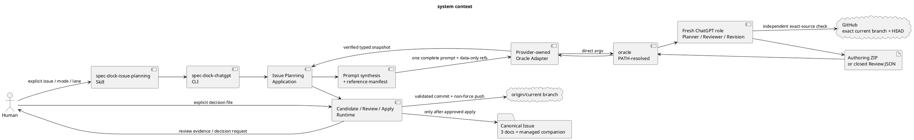
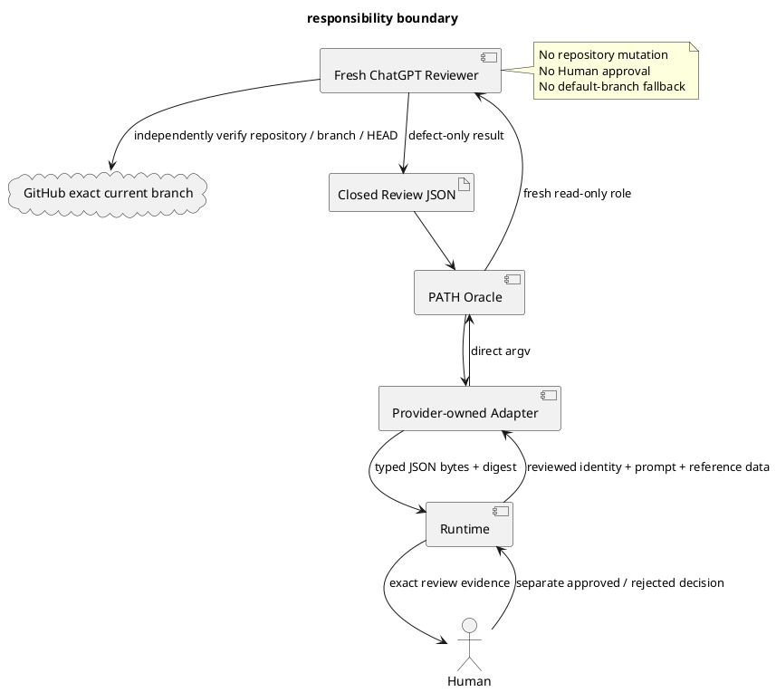
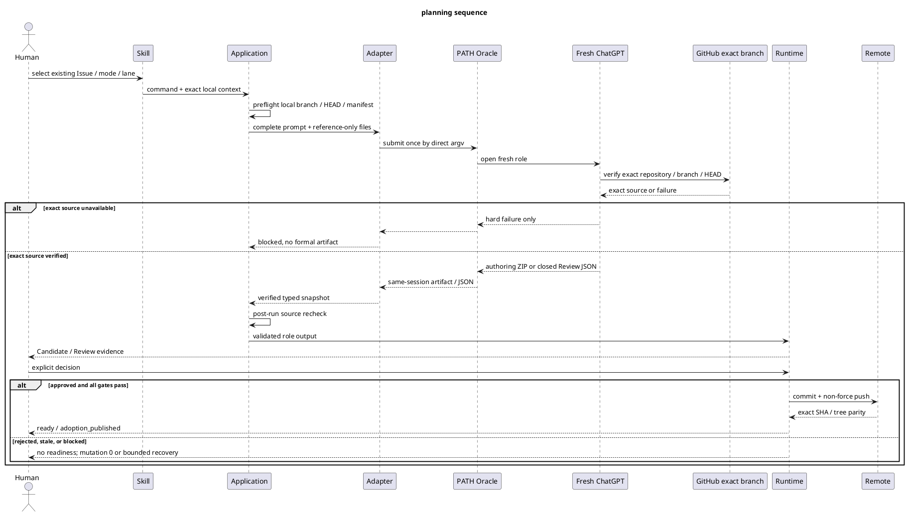
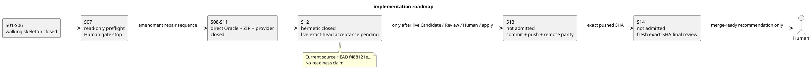

# iss-00334 ChatGPT First Issue Planning — New Member Guide

> **Authority note:** このguideはnew member向けのsubordinate explanatory artifactである。canonical authorityは同じCandidate内の`requirement.md`、`design.md`、`plan.md`だけにあり、矛盾時は三文書が優先される。本guide、Planner出力、Review PASSはいずれもPlan採用、implementation start、canonical mutation、commit、push、merge、Issue finishを承認しない。Humanがexact reviewed identityへ明示決定した後にだけapplyへ進む。

## init-/epic-/iss- lineage

- Initiative: `init-00322-gpt-5-6-chatgpt-first-intelligence-architecture`。ChatGPT Firstのintelligence architectureと運用境界を親として持つ。
- Epic: `epic-00331-planning-and-advisory-review`。Planning authoring、advisory review、Human authorityを一貫したdelivery lifecycleへ接続する。
- Issue: `iss-00334-implement-chatgpt-issue-planning-workflow`。existing Issueを対象に、create→revise→review→Human Gate→applyをSpecDockのprovider-owned capabilityとして実装する。
- Exact source identity: repository `chemitaro/spec-dock`、branch `iss-00334-implement-chatgpt-issue-planning-workflow`、HEAD `f488121e80fc93f01cb64fab70a06d306c903804`。
- Canonical Issue pathsは同Issue directoryの`requirement.md`、`design.md`、`plan.md`である。本guideのmanaged relative pathは`artifacts/20260730t094713z-guide-new-member-chatgpt-first-issue-planning.md`であり、第四のcanonical specificationではない。

このlineageを変更する別Issue、別Epic、default branch、添付資料は、このoperationのauthority sourceにならない。

## Purpose/scope

本guideの目的は、new memberがaccepted contractを再設計せず、どのcomponentが何を所有し、どのgateを越えるまでrepositoryを変更してはならないかを初日から判断できるようにすることである。

対象scopeは次に限定される。

- existing Issueに対する`planning create`、`planning revise`、`review planning`、`planning apply`。
- exact current repository／branch／HEADへのbinding。
- Planner／Semantic Revisionのexactly-one authoring ZIP、Runtime Candidate、fresh defect-only Review、exact Human decision、transactional apply／publication。
- canonical三文書に従属するexactly-one onboarding companion。
- provider authority、installed assets、wheel／sdist、fresh init／update、dogfood projectionのparity。

次はscope外である。

- Seedの暗黙materialization、Initiative／Epic Planning、汎用Review framework、persistent Planning database、arbitrary backend／Prompt／target。
- default branchまたは別branchへのfallback、API fallback、個人wrapperの製品依存化。
- ChatGPTによるHuman decision、implementation start、merge、Issue finishの推測または自動化。
- general `planning-gap` contract、role-based intelligence tier policy、Initiative／Epic／Issue横断hardening。これらはcurrent accepted contractを完走不能にする実証済み欠陥ではなく、後続Issueの対象である。

### 根拠

このpackageのcanonical三文書はGitHub connectorで確認したexact HEADの各blobとbyte-identicalなsourceを使用する。current statusは同HEADのcanonical Reportに記録されたS01〜S14 evidenceに限定して記述する。

### 仮定・不確実性・未検証主張

- 本guideはsource HEADより後のworktree、browser account、Oracle UI、remote publication、Human authorizationを観測したとは主張しない。
- `f488121e...`で修復されたsame-session recoveryのlive再実行、Candidate、fresh Review、Human decision、apply、remote parityは未完了として扱う。
- 添付やoperator-local artifactはreference dataであり、canonical三文書またはexact GitHub sourceを上書きしない。

## System context



System context上、ChatGPTはauthoringとreviewを担うが、identity、archive safety、Candidate controls、Human evidence、filesystem transaction、Git publicationはRuntimeが決定する。GitHub connector gateはlocal Git evidenceの代替ではなく追加gateである。

## Authority/responsibility

| Actor／layer | Authorityと責務 | 明示的に禁止されること |
|---|---|---|
| Human | Plan採用、implementation start、mergeの最終決定 | PASSや`ok`から承認を推測させること |
| official Skill | 対象Issue、Review mode、revision lane、same Candidate pathの引継ぎ | directory scan、latest Candidate推測、manual companion digest |
| CLI／application | parser、dispatch、exact local Git preflight、Prompt synthesis、post-run drift check | default branch切替、arbitrary backend、canonical mutationの先行実行 |
| provider-owned Adapter | PATH Oracleのcapability preflight、direct argv、single submit、same-session recovery、safe artifact snapshot | shell、API fallback、personal Project／profile／host、home-wide fuzzy scan |
| ChatGPT Planner／Revision | canonical三文書＋exact companionのcomplete authoring ZIPを一件作る | MANIFEST／CHECKSUMS／Human decision生成、repository mutation、approval claim |
| ChatGPT Reviewer | fresh read-only defect-only Review、exact branch独立確認、closed JSON | replacement ZIP、patch、style preferenceによるFAIL、Runtimeからのdirect bypass |
| Runtime | ZIP safety、Candidate identity、binding、Review／Human validation、transaction、rollback、publication | Human decision生成、wrong Candidate補完、force push |
| canonical三文書 | requirement／design／planの唯一のspecification authority | guideやReportへauthorityを委譲すること |
| onboarding companion | new-member向け説明、Candidate／Review／Human／applyのmanaged payload | 第四のcanonical specificationまたは独立approvalになること |



このboundaryでは、Review JSONがOracle／Adapterを逆向きに戻ることが必須であり、RuntimeからReviewerへのdirect callは不適合である。

## Current architecture/target architecture

| 観点 | Current architecture at `f488121e...` | Target architecture／closure condition |
|---|---|---|
| Public surface | 四command、archive／git-bound Review、Semantic／Mechanical revision、Human-bound applyが存在する | command familyを増やさず、same Candidateとclosed identityを全laneで維持する |
| Oracle transport | provider-owned PATH Oracle adapter、direct argv、capability preflight、single submit、bounded same-session pollingを実装済み | exact pushed HEADでreal Oracle publication lagを再検証し、duplicate submit 0をlive evidence化する |
| Prompt／output | exact branch gate、data-only attachments、13 H2／4 diagram roleを含むfour-file ZIP contractをprovider／projectionへ配布済み | exactly-one valid ZIPからCandidateを生成し、fresh Reviewer JSONを同boundaryで回収する |
| Candidate／apply | guide-inclusive Candidate、same-Candidate git-bound binding、Human後のcompanion write／rollbackを実装済み | exact-head Candidate→Review→Human decision→apply→validation→commit→push→remote parityを完走する |
| Verification | S08〜S11 closure、S12 hermetic／full regression、distribution／projection／PlantUML evidenceは成立 | live acceptance後にS13を閉じ、exact pushed SHAでfresh S14 final combined ReviewをPASSする |
| Delivery | merge-ready authorityは未成立 | zero blocker、required checks、clean／remote parity後にHumanへmerge-ready handoffする。merge自体はHuman専権 |

現行設計は新しいworkflow engineやpersistent registryを追加せず、既存authoring-pack、Candidate、transaction、Git publication primitiveを最小拡張する。targetは機能追加ではなく、accepted contractをexact identityとfail-closed semanticsで最後まで実証することである。

## ChatGPT First planning workflow

1. Skillがexisting Issue、repository、current branch、HEAD、upstream、output directoryを明示する。
2. Applicationがclean symbolic branch、`origin/<same branch>`、local／fetched remote HEAD一致、source manifestをOracle起動前に検証する。
3. Prompt本文へrole、scope、Human boundary、exact GitHub gate、output contractを統合し、添付はhash-checked reference dataだけにする。
4. AdapterがPATH Oracleをdirect argvで一度だけsubmitする。timeout／disconnect後はsame sessionのstatus／reattach／harvestだけを使う。
5. Fresh ChatGPT roleがGitHub connectorでsame repository／branch／HEADを独立確認する。確認できなければFormal outputを作らない。
6. Planner／Semantic Revisionはfour-file authoring ZIP一件、Reviewerはclosed JSON一件だけを返す。
7. Adapter／Applicationがtyped outputを取得し、local branch／HEAD／source manifestを再検証する。drift時はpublication前に`stale`で停止する。
8. Runtimeがauthoring ZIPを安全検証し、control filesを追加したimmutable Candidateを生成する。
9. Fresh ReviewでP0／P1があれば明示requestによるrevisionへ戻る。P2／P3だけではCandidateを変更しない。
10. Humanがexact reviewed identityへapproved／rejected decisionを明示する。
11. approved applyだけがtransaction、validation／sync、commit、non-force push、remote parityへ進む。すべて成立した場合だけ`ready/adoption_published`となる。



## Provider-owned direct Oracle/reference-only chatgpt-use

製品依存の外部実行境界は`PATH`で解決された`oracle` commandだけである。provider-owned adapterは最終resolved targetがregular executableであること、supported version、browser／attachment／session artifact capabilityをpreflightし、Promptとreference filesをshellなしのdirect argvで渡す。

不変条件は次のとおりである。

- Prompt submitは一回だけ。terminal state不明時にnew sessionへ再送しない。
- API credential環境を除去し、browser failureをAPI fallbackで隠さない。
- personal Project URL、Chrome profile、private host path、LaunchAgent、wrapper固有`--write-output`をproduct argv／configへ入れない。
- artifact retrievalはsame sessionのversioned metadataとfirst-class exportだけを使い、home directoryやdownload directoryをfuzzy scanしない。
- session path、raw transcript、cookie、credential、private absolute pathをformal resultへ保存しない。

operator-local `chatgpt-use`は、Planning調査、bounded decision、reference-only snapshotに利用されることがあっても、product component、fallback、distribution requirement、test prerequisite、acceptance authorityではない。そこで得た内容もRuntime validationとHuman approval前はuntrusted transient inputである。

## Candidate/Review/Human/apply lifecycle

### 1. Oracle authoring ZIPとRuntime Candidateを分離する

Oracle authoring ZIPは次のcontent-only inventoryを持つ。

```text
iss-00334-issue-planning-documents/
├── requirement.md
├── design.md
├── plan.md
└── artifacts/20260730t094713z-guide-new-member-chatgpt-first-issue-planning.md
```

RuntimeはこのZIPをsafe-openし、front matter、Issue identity、exact root／inventory、UTF-8／LF、guide completeness、archive safetyを検証する。ChatGPTがcontrol filesを生成することはない。valid payload mapからRuntimeが`SOURCE-BASELINE.json`、`MANIFEST.json`、`CHECKSUMS.sha256`、`PLACEHOLDER-ORACLE-MAP.json`を追加してimmutable Candidateを構築する。

### 2. Review identityを分離する

- `archive-candidate`: exact Candidate全体をreviewed targetとし、guideもCandidateの一部としてReviewする。
- `git-bound`: canonical targetはreviewed HEAD上の`requirement.md`、`design.md`、`plan.md`のexact 3 pathsだけである。同じimmutable Candidateのexactly-one `onboarding-companion` roleからpath／SHAを導出し、`GitBoundOperationBindingV1`へ別fieldとしてbindする。Candidate内の三文書をcanonical targetへ流用しない。

Reviewはfresh、read-only、defect-onlyである。P0／P1だけがblockingで、P2／P3だけならCandidateを変更せずHuman Gateへ進む。別mode、別Candidate、別HEADのPASSを流用しない。

### 3. Human decisionは別証拠である

Human decisionはreviewed identity、review result bytes／digest、Candidate／bindingへexactにbindし、`approved`または`rejected`だけを許可する。approvedはPlan adoption、companion adoption、implementation startを同じidentityへ明示する。rejectedはcanonical三文書を変更せずdecision artifactだけを記録する。

### 4. Applyはtransactionである

- archive applyは三文書のwhole-file replacementとcompanion managed writeを同じstaging／backup／rollback transactionへ含める。
- git-bound applyはcanonical 3-path blob不変を確認し、same Candidateからbindingを再導出した後、Human approval後だけcompanionを書き込む。destinationがexact bytesならevidence-qualified no-op、異なるbytes／symlink／ambiguous pathならmutation前に拒否する。
- commit前failureはreverse-order restoreし、restore確認不能なら`recovery_required`。commit後push failureはlocal commitを保持して`publication_pending`。remote divergence時はforce pushしない。

`ok/candidate_created`やReview PASSは実装開始可能を意味しない。validation、commit、push、remote parityまで完了した`ready/adoption_published`だけがapply lifecycleの完了を示す。

## Exact branch failure

Formal runは次の三gateすべてを満たす必要がある。

| Gate | 検証内容 | 失敗時の扱い |
|---|---|---|
| 1. pre-invocation local Git | repository、symbolic current branch、clean tree／index、`origin/<same branch>`、local==fetched remote HEAD、source manifest | Oracle call 0で`blocked`または`stale` |
| 2. fresh ChatGPT GitHub connector | same repository、exact current branch、source HEADをrole自身が独立確認 | `repository access failed`相当のhard failure。ZIP／Review JSON／Candidateを作らない |
| 3. post-output local revalidation | branch、HEAD、source manifestがrun中に変化していない | output publication前に`stale`、repository mutation 0 |

このpackageのexact gateはrepository `chemitaro/spec-dock`、branch `iss-00334-implement-chatgpt-issue-planning-workflow`、HEAD `f488121e80fc93f01cb64fab70a06d306c903804`である。

次を代替sourceにしてはならない。

- repositoryのdefault branchまたは別branch。
- 添付されたcanonical copy、Prompt context、memory、browser history。
- operatorが推測したHEAD、latest Candidate、manual companion path／digest。

ChatGPTのhard-failure文字列はformal authoring ZIPやReview JSONではない。Product Runtimeはexact branch確認不能を`blocked/github_exact_branch_unavailable`等のclosed resultへ分類し、成功へ正規化しない。

## S01/S07/S08/S14 status/roadmap

| Milestone | Source-grounded status at `f488121e...` | 次のgate |
|---|---|---|
| S01 | CLI skeletonとdomain contractsのwalking-skeleton baselineはclosed | public command family／identity contractを変更しない |
| S02〜S06 | initial create／review／revision／Human／apply／provider projectionは履歴としてimplemented | 旧personal-wrapper／text-frame evidenceをnew Oracle acceptanceへ流用しない |
| S07 | execution packetとread-only preflightまで進み、live mutationはHuman Gateで停止した。successful end-to-end acceptanceではない | current exact identityへbindしたHuman authorizationなしに再開しない |
| S08 | provider-owned direct Oracle adapter、capability preflight、single submit、same-session recovery、typed snapshotはclosed | S09以降のcontractを再設計せず非回帰を維持する |
| S09〜S11 | exact-branch Prompt、four-file ZIP、guide-inclusive Candidate／binding、provider／projection／distributionはclosed | S12 evidenceでsame contractをlive検証する |
| S12 | hermetic focused／full regression、lint、distribution、projection、PlantUMLはclosed。`f488121e...`でsame-session publication-race repairがlandedしたが、real exact-head create→Candidate→fresh Review→Human→apply／parityは未完了 | refreshed Human authorization後、formal createを一度だけ実行し、same-session recoveryとvalid packageを確認する |
| S13 | not admitted | S12 live acceptanceとexact evidenceが揃った後、mandatory scoped commit／non-force push／remote parityを閉じる |
| S14 | not admitted。過去のcombined Review／repairは履歴であり、current exact pushed SHAのfinal assuranceではない | S13 exact pushed SHAをfresh spec／code／QA reviewersがzero blockerでPASSした場合だけHumanへmerge-ready handoffする |



したがって、new memberが最初に行うべきことはS14を始めることではなく、S12のremaining live gateとfresh Human authorityを確認することである。

## Provider/projection

Implementation authorityは`src/spec_dock/assets/`配下にある。主要ownerは次のとおりである。

- provider runtime: `src/spec_dock/assets/spec_dock/scripts/spec_dock_runtime/`
- public executable: `src/spec_dock/assets/spec_dock/scripts/spec-dock-chatgpt`
- official Skill／Prompt resources: `src/spec_dock/assets/install_root/.agents/`
- direct Oracle adapter: provider runtimeの`infra/issue_planning_chatgpt.py`とbounded private artifact helper。

root `spec-dock/`はdogfood projectionであり、authoring authorityではない。変更順序は必ず次である。

1. provider sourceを変更する。
2. focused testsでowner contractを閉じる。
3. official init／update経路でinstalled assetsとdogfood projectionを生成する。
4. provider／projection bytes、wheel／sdist、fresh init／update、second update no-opを確認する。
5. projectionだけを直接編集した差分、personal dependency、legacy transport dependencyが0であることを確認する。

Prompt、adapter、Candidate contract、guide validator、official docs／Skillは同じprovider authorityから配布される。providerとprojectionの不一致はcurrent branch上で動いてもdistribution defectであり、S13／S14へ進めない。

## Failure modes

| Failure mode | Expected disposition | Safety invariant |
|---|---|---|
| dirty／detached／missing upstream／local-remote mismatch | `blocked`または`stale` | Oracle call 0、repository mutation 0 |
| exact current branchをGitHub connectorで確認不能 | `blocked/github_exact_branch_unavailable` | default／other branch、添付、memoryへfallbackしない |
| PATH Oracleなし／unsupported capability | `blocked/oracle_unavailable`または`oracle_capability_unsupported` | wrapper／API fallback 0 |
| timeout／disconnect／harvest nonzeroでterminal state不明 | same-session bounded polling後`blocked/oracle_session_recovery_required` | new prompt submit 0、same exact sessionだけを追跡 |
| authoring artifactなし／複数／wrong filename／root／metadata | `rejected/oracle_artifact_missing`、`oracle_artifact_ambiguous`、`oracle_artifact_rejected` | Candidate 0 |
| unsafe ZIP、extra／missing payload、wrong guide path、13 H2／diagram role欠落 | `rejected/archive_rejected`＋closed details | partial Candidate 0、失敗ZIPはimmutable evidence |
| wrong Candidate、companion role 0／複数、binding digest mismatch | `rejected/operation_candidate_required`、`operation_binding_rejected`、`operation_binding_mismatch`または`stale` | Human decision前mutation 0 |
| ReviewにP0／P1 | `verdict=fail` | selected findingだけSemantic revision、new Candidate、fresh Review |
| P2／P3だけ | `verdict=pass` | Candidate revision 0 |
| Human decisionなし／rejected／identity mismatch | `blocked`または`rejected` | approved applyへ進まない。rejectedはdecision artifactだけ |
| commit前apply failure、restore成功 | `rolled_back` | 三文書、guide、indexをprior stateへ戻す |
| restore不一致 | `recovery_required` | 自動継続、別workspace探索をしない |
| commit後push／remote確認失敗 | `publication_pending` | local commitを保持し、reset／amendしない |
| retry時remote divergence | `blocked_remote_diverged` | force push 0 |
| secret、credential、private data、unsafe path | preflight拒否 | Oracle call／formal artifact／diagnostic leak 0 |

失敗理由はraw Oracle error、session path、Prompt、transcript、credentialを含まない。`ok`、ZIP取得、Review PASSを`ready`へ読み替えない。

## First-day checklist

1. `requirement.md`、`design.md`、`plan.md`を先に読み、本guideを補助説明として扱う。
2. repository、current branch、HEAD、upstream、clean stateをRuntime／GitHubの両方で確認する。今回のsource identityは`chemitaro/spec-dock`／`iss-00334-implement-chatgpt-issue-planning-workflow`／`f488121e80fc93f01cb64fab70a06d306c903804`である。
3. ReportでS12 live、S13、S14の最新gateを確認し、本guideからHuman authorizationを推測しない。
4. official `spec-dock-issue-planning` Skillからrepo-local`spec-dock-chatgpt`へ入る。personal wrapperやdirect browser operationをproduct pathに混ぜない。
5. outputは明示されたrepository外non-symlink directoryへ出し、directory scan／latest Candidate selectionを使わない。
6. Prompt本文にexact repository／branch／HEAD、fallback禁止、Human boundary、role output contractがあることを確認する。添付はreference-onlyである。
7. formal createは一度だけsubmitする。timeout後はsame sessionだけをrecoverし、別slugで再送しない。
8. authoring ZIPがexact logical filename、single root、`requirement.md`／`design.md`／`plan.md`／current exact guide pathの四fileだけを持つことを確認する。
9. Runtime Candidate path／identity／ZIP SHAをstructured resultから保持し、git-bound Reviewとapplyへ同じCandidateを明示的に渡す。
10. ReviewerがRuntime→Adapter→PATH Oracle→fresh Reviewer→GitHub exact branchを通り、closed JSONを同じ境界で返したことを確認する。
11. P0／P1だけをrevision triggerにする。P2／P3、style preference、better architectureの提案ではCandidateを変更しない。
12. Review result、reviewed identity、Candidate bindingにexactに対応するHuman decisionを別fileで得る。ChatGPTやCLIに補完させない。
13. approved apply前にcanonical三文書、guide destination、index、HEADが未変更であることを確認する。
14. apply後はpayload parity、validation／sync、commit、non-force push、remote SHA／tree parityを確認し、`ready/adoption_published`以外をimplementation readinessと扱わない。
15. failure時はclosed status／reasonに従って停止する。force push、default branch fallback、manual identity repair、hidden state、unbounded retryを行わない。
16. evidenceにはsource HEAD、Candidate／Review／Human digest、test／parity結果だけを残し、raw transcript、session／conversation identifier、credential、cookie、private absolute pathを保存しない。
17. S12 live acceptanceが閉じるまでS13を、S13 exact pushが閉じるまでS14をadmitしない。S14 PASS後もmerge／Issue finishはHumanへhandoffして停止する。
