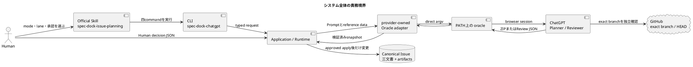
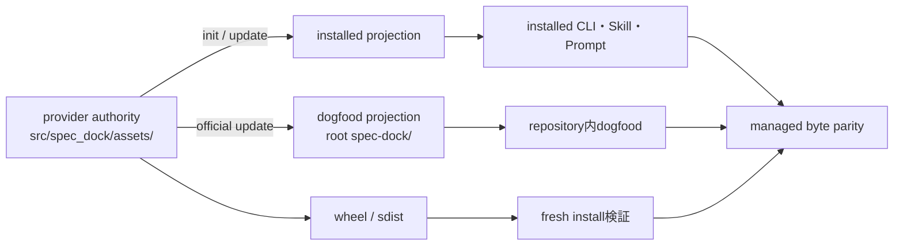
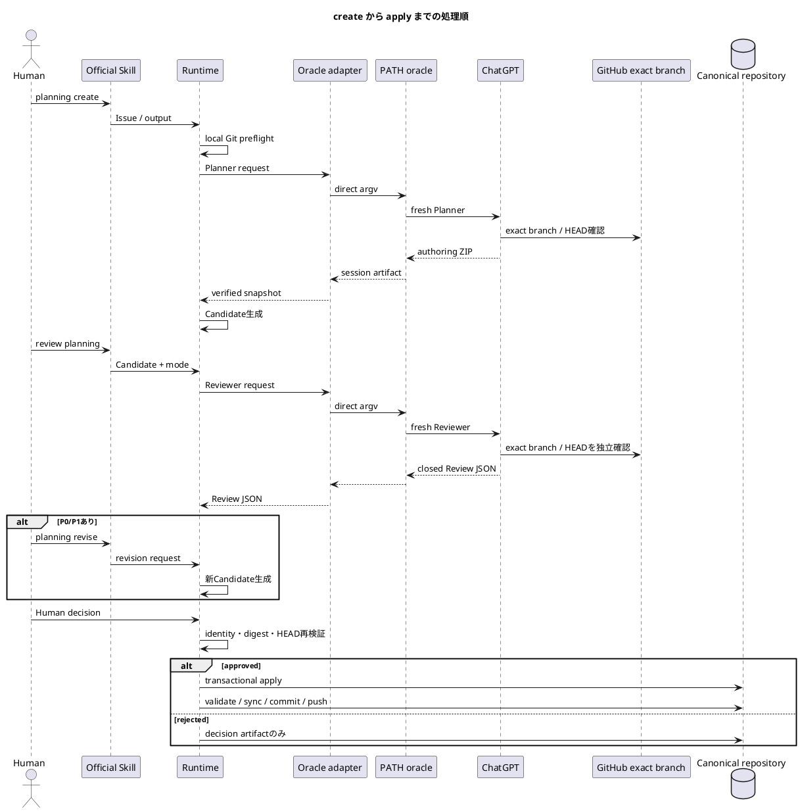
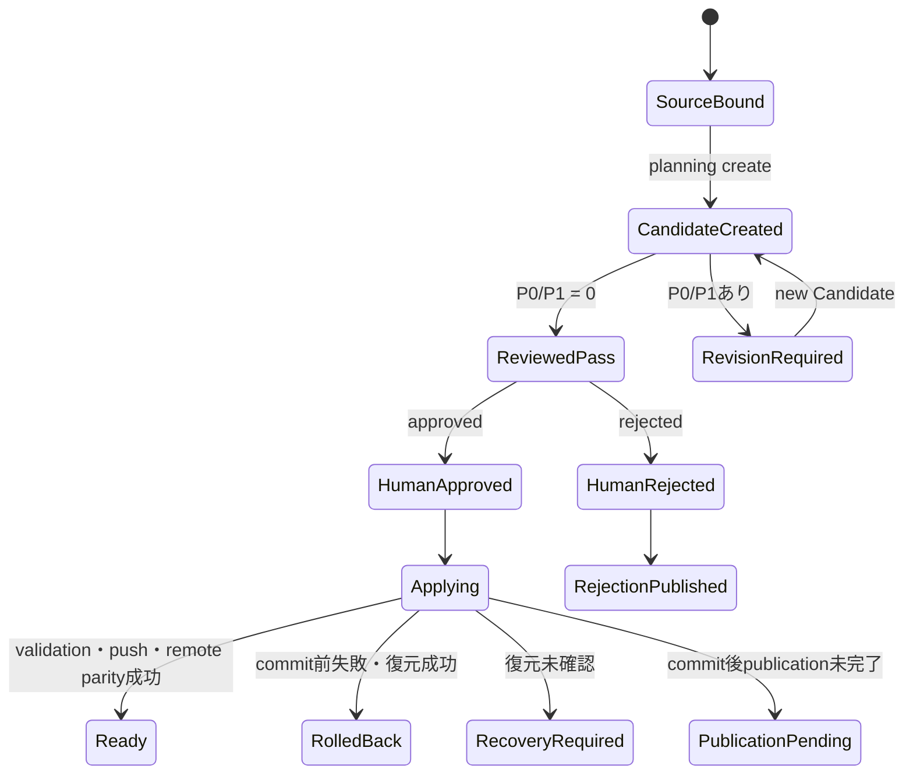
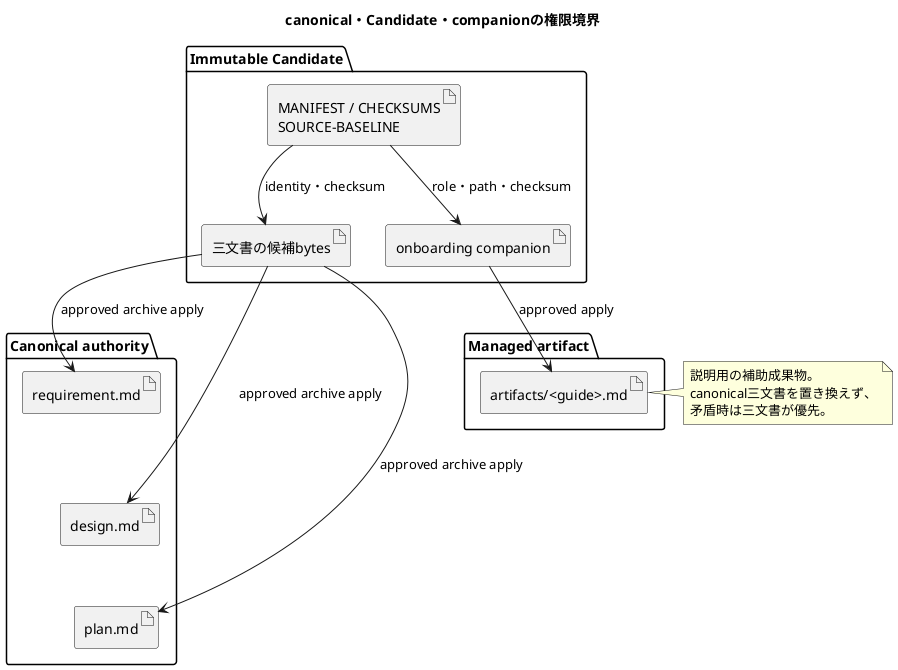

# 1. まず押さえる結論

`iss-00334`で追加されたのは、既存Issueの計画文書をChatGPTで作成・レビューし、Humanが承認した内容だけを安全に正本へ反映する一連のワークフローである。

入口はOfficial Skill、実行本体はrepo-localの`spec-dock-chatgpt`、外部ChatGPT呼び出しはprovider-owned adapterから`PATH`上の`oracle`を直接起動する。ChatGPTは文書作成と助言を担当するが、Candidateの検証、Human承認、repository変更、commit、pushの権限は持たない。

現行branchはGitHub上で確認でき、HEADは指定された`9ea4f1fee2b5180b6ec56ae8da2cc777b00b40d7`と一致している。`main`とは分岐しており、Issue Planning用CLI、Prompt、Oracle adapter、Candidate／apply処理、テスト、Skill、dogfood projectionなどが追加・変更されている。

主要な公開コマンドは次の四つだけである。

```text
spec-dock-chatgpt planning create
spec-dock-chatgpt planning revise
spec-dock-chatgpt review planning
spec-dock-chatgpt planning apply
```

`ok`は各コマンドが完了したという意味にすぎない。実装開始可能な状態を示すのは、Human承認後のapply、validation、commit、push、remote parityまで成立した`ready/adoption_published`だけである。

# 2. 今回の変更前と変更後

変更前にもSpecDockには、Issueのcanonical文書、Git同期確認、ZIP安全検証、validation、sync、commitなどの基礎部品が存在した。しかし、ChatGPTによる計画作成からHuman承認後の反映までを、一つの閉じた製品ワークフローとして接続する経路が不足していた。また、初期実装には個人用wrapperや独自text frameに依存する経路があり、配布可能な製品境界として不適切だった。

変更後は次が可能になった。

1. existing Issueとexact repository／branch／HEADを固定する。
2. ChatGPT Plannerからcanonical三文書とonboarding companionを含むZIPを受け取る。
3. RuntimeがZIPを検証し、control files付きのimmutable Candidate ZIPを生成する。
4. CandidateまたはGit上の正本をfresh ChatGPT Reviewerでレビューする。
5. P0／P1がある場合だけCandidateを改訂する。
6. exact reviewed identityに結び付いたHuman decisionを受け取る。
7. approvedの場合だけ正本・companionを反映し、validate、sync、commit、push、remote parityを確認する。

既存のCore CLI、Issue lifecycle、汎用authoring-packは置き換えていない。Issue Planningは`spec-dock-chatgpt`という別のcommand familyに閉じられ、既存機能を壊さないよう、既存primitiveを限定的に再利用している。

# 3. システムの全体像

次の図では、文書を考える責務と、repositoryを変更する責務が分離されている点を見る。



## 3.1 Provider authorityとprojection

実装の編集元は`src/spec_dock/assets/`である。

* runtime authority: `src/spec_dock/assets/spec_dock/`
* Skill／Prompt authority: `src/spec_dock/assets/install_root/.agents/`
* Oracle adapter: provider runtime内の`infra/issue_planning_chatgpt.py`

installed projectionは利用先へinstallされたコピー、rootの`spec-dock/`はこのrepository自身で動作確認するdogfood projectionである。projectionを先に直接編集するのではなく、providerを変更してinit／update経路で投影し、byte parityを検証する。



個人用`chatgpt-use`は、この製品runtimeの構成要素ではない。仕様検討やoperator-localな外部操作の参考として使われることはあっても、製品のfallback、配布物、必須dependency、acceptance条件には含まれない。

# 4. 実際の処理の流れ

## 4.1 create

`planning create`はexisting Issueを解決し、cleanなsymbolic branch、`origin/<same-branch>`、local／remote HEAD一致、source manifestを確認する。default branchへのfallbackは無効である。

その後、Prompt本文にrepository、branch、HEAD、Human authority、output contractを埋め込み、Issue文書や関連sourceをreference attachmentとして渡す。添付は命令ではなく、信頼しない参照データとして扱われる。

Plannerの正式出力は、次の内容だけを持つdownloadable ZIP一個である。

```text
<issue-id>-issue-planning-documents.zip
└── <issue-id>-issue-planning-documents/
    ├── requirement.md
    ├── design.md
    ├── plan.md
    └── artifacts/
        └── <onboarding-companion>.md
```

RuntimeはこのZIPを検証した後、Candidate ZIPを生成する。

## 4.2 reviewとrevision

`review planning`には二つのmodeがある。

`archive-candidate`は、正本へ反映する前の標準modeで、Candidate ZIP全体をレビューする。`git-bound`は、実際のGit HEAD上のcanonical三文書やinline参照が必要な場合のfallbackである。

git-boundでも、createで作ったsame Candidate ZIPが必須である。canonical三文書はGit HEADから読み、companionだけをCandidateから取得する。CandidateのMANIFESTからcompanion pathとSHAを導出し、`GitBoundOperationBindingV1`としてreviewed identityへ結び付ける。

P0／P1が存在する場合だけ`planning revise`へ進む。P2／P3だけならCandidateを変更せずHuman Gateへ進む。

* Semantic revision: ChatGPTに三文書とcompanionのcomplete replacement ZIPを要求する。
* Mechanical revision: Runtimeが指定箇所を一意に限定置換する。曖昧な場合にSemanticへ自動fallbackしない。

## 4.3 Human decisionとapply

Human decisionは`approved`または`rejected`だけで、CLIが生成・推測・補完することはない。



ライフサイクルを状態として見ると次のようになる。



# 5. 成果物と権限の境界

ChatGPTが生成するauthoring ZIPはcontent-onlyであり、Candidate ID、MANIFEST、CHECKSUMS、Human decisionを作らない。これらはRuntimeが生成する。

Candidate ZIPには次が含まれる。

```text
requirement.md
design.md
plan.md
artifacts/<onboarding-companion>.md
SOURCE-BASELINE.json
MANIFEST.json
CHECKSUMS.sha256
PLACEHOLDER-ORACLE-MAP.json
```

`MANIFEST.json`は三文書を`requirement`、`design`、`plan`として、guideを`onboarding-companion`として区別する。`CHECKSUMS.sha256`はpayload bytesを覆い、`SOURCE-BASELINE.json`はsource repository／branch／HEADやsource manifestを保持する。

onboarding companionは、新メンバーに現行設計や運用順序を説明する補助成果物である。Formal Candidate、Review、Human decision、managed apply、rollback、parityの対象ではあるが、第四のcanonical specificationではない。



# 6. 失敗時に止まる安全策

正式runはrepository、current branch、HEADの三つを固定する。current branchがGitHub connectorから開けない場合、default branch、別branch、添付、memoryを代用しない。ChatGPTが`repository access failed`を返した場合も正式成果物として採用しない。

Oracle起動前にはlocal Git preflightを行い、Oracle出力受領後とpublication直前にもsource evidenceを再確認する。run中にbranch、HEAD、source manifest、Candidate bytesが変化した場合は`stale`として停止する。

Human承認前にはcanonical文書、companion destination、index、HEADを変更しない。apply開始後も、書込み対象は事前にcaptureしたdirectory descriptorとfile identityにより保護される。

commit前の失敗では、三文書、companionの既存／不存在状態、Git index、managed sync stateを復元する。復元を証明できれば`rolled_back`、証明できなければ`recovery_required`で停止する。

commit後のpush失敗ではcommitをreset／amendせず、`publication_pending`として同一operationの再開を可能にする。remoteが分岐していれば`blocked_remote_diverged`となり、force pushは行わない。

Oracle呼び出しもshell文字列ではなくdirect argvである。Prompt送信後のtimeoutでは新しいsessionへ再送せず、同じsessionのstatus／harvestだけを行う。

# 7. テストと検証

現行実装の検証方針は、責務ごとのfocused testからintegration、distribution、full regressionへ広げる構成である。

主要な確認対象は次のとおり。

* domain: Candidate identity、MANIFEST、CHECKSUMS、companion validation、reviewed identity。
* application: exact Git preflight、create／review／revise／apply orchestration、drift検出。
* infra: `PATH` Oracle解決、direct argv、environment sanitization、session recovery、artifact snapshot。
* CLI: 四commandのhelp、option closure、text／JSON result parity。
* apply: Human decision binding、rollback、resume、commit tree、push、remote parity。
* distribution: provider、wheel、sdist、fresh init、update、dogfood projectionのparity。
* security: unsafe ZIP、symlink、path traversal、secret、shell injection、TOCTOU、unexpected diffの拒否。

repositoryにはfocused review、full regression、quality gate、PR修復の証跡が保存されている。また、現行branchのexact HEADがGitHub上の指定値と一致すること、および`main`との差分にprovider runtime、Skill、Prompt、tests、dogfood projectionが含まれることは、この資料作成時に確認した。

ただし、この資料作成セッションではpytest、build、PlantUML、SpecDock validate、実Oracle dogfoodを新規実行していない。したがって、各テストのGreen状態はrepository内の既存report／artifactに記録された検証事実として扱い、この資料による独立再実行済みとはみなさない。

# 8. 新メンバーの最初の一日

最初は次の順序で読むと責務を追いやすい。

1. Issueの`requirement.md`で、何を可能にし、何を自動化しないかを確認する。
2. `design.md`で、CLI、Runtime、Oracle adapter、Candidate、Human Gateの境界を確認する。
3. `plan.md`で、S01以降の実装順と検証責務を確認する。
4. provider側の`application/issue_planning.py`を読み、create／review／revise／applyの入口を追う。
5. `application/issue_planning_prompt.py`でPrompt本文とattachmentの分離を見る。
6. `infra/issue_planning_chatgpt.py`でOracleのdirect argv、session recovery、typed output回収を見る。
7. `domain/issue_planning_candidate.py`でCandidate inventory、companion、MANIFEST、CHECKSUMSを見る。
8. apply実装でtransaction、rollback、commit、push、remote parityを追う。
9. root `spec-dock/`ではなくprovider authorityとの差分と投影方法を確認する。

実装を探す際の入口は次である。

```bash
git rev-parse HEAD
git branch --show-current
git diff main...HEAD -- src/spec_dock/assets
git diff main...HEAD -- tests
grep -R "run_issue_planning_create" src/spec_dock/assets/spec_dock
grep -R "invoke_issue_planning_chatgpt" src/spec_dock/assets/spec_dock
grep -R "GitBoundOperationBindingV1" src/spec_dock/assets/spec_dock
spec-dock-chatgpt planning create --help
spec-dock-chatgpt review planning --help
spec-dock-chatgpt planning apply --help
```

# 9. 用語集と非対象事項

**Canonical三文書**
Issueの正本である`requirement.md`、`design.md`、`plan.md`。

**Authoring ZIP**
ChatGPTが返すcontent-only ZIP。三文書とcompanionだけを含む。

**Candidate ZIP**
Runtimeが検証・control files追加後に生成するimmutableな採用候補。

**Onboarding companion**
新人向け説明資料。managed artifactだがcanonical authorityではない。

**Archive mode**
Candidate ZIPを直接レビューし、approved applyで三文書とcompanionを採用する標準mode。

**Git-bound mode**
Git HEAD上のcanonical三文書をレビューするmode。companionとoperation identityはsame Candidateから導出する。

**Exact branch gate**
指定repository／branch／HEAD以外を情報源として使わせない仕組み。

**Provider authority**
編集元となる`src/spec_dock/assets/`。installed／dogfoodはそこから生成される。

**Human Gate**
Review結果とreviewed identityに結び付いたHumanのapproved／rejected判断。

このIssueの非対象は、SeedからのIssue自動作成、Initiative／Epic Planning、汎用Review framework、Human承認やmergeの自動化、Oracle本体の改造、永続Planning database、任意backend、個人`chatgpt-use`の製品組込みである。

# 10. 参照先

* `spec-dock/initiatives/init-00322-gpt-5-6-chatgpt-first-intelligence-architecture/epics/epic-00331-planning-and-advisory-review/issues/iss-00334-implement-chatgpt-issue-planning-workflow/requirement.md`
* `spec-dock/initiatives/init-00322-gpt-5-6-chatgpt-first-intelligence-architecture/epics/epic-00331-planning-and-advisory-review/issues/iss-00334-implement-chatgpt-issue-planning-workflow/design.md`
* `spec-dock/initiatives/init-00322-gpt-5-6-chatgpt-first-intelligence-architecture/epics/epic-00331-planning-and-advisory-review/issues/iss-00334-implement-chatgpt-issue-planning-workflow/plan.md`
* `spec-dock/initiatives/init-00322-gpt-5-6-chatgpt-first-intelligence-architecture/epics/epic-00331-planning-and-advisory-review/issues/iss-00334-implement-chatgpt-issue-planning-workflow/report.md`
* `src/spec_dock/assets/spec_dock/scripts/spec_dock_runtime/application/issue_planning.py`
* `src/spec_dock/assets/spec_dock/scripts/spec_dock_runtime/application/issue_planning_prompt.py`
* `src/spec_dock/assets/spec_dock/scripts/spec_dock_runtime/domain/issue_planning_candidate.py`
* `src/spec_dock/assets/spec_dock/scripts/spec_dock_runtime/domain/issue_planning_contracts.py`
* `src/spec_dock/assets/spec_dock/scripts/spec_dock_runtime/infra/issue_planning_chatgpt.py`
* `src/spec_dock/assets/install_root/.agents/skills/spec-dock-issue-planning/`
